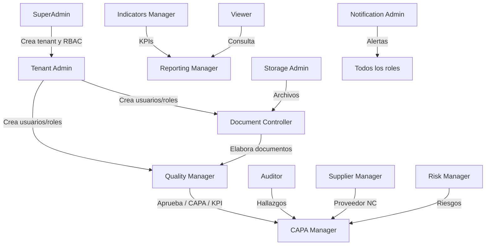

# 04 — Role Functional Flows

Reconstrucción paso a paso de los flujos observados en código (`app.js`, `FoundationEndpoints.cs`) y validados en E2E (`docs/e2e/`, `tools/e2e_*_visible.py`). Tenant de referencia E2E: `4c131edd-47dc-4bb4-908a-a4b5e34c85ac` (Alimentos Premium Panamá S.A.).

---

## Flujo transversal: autenticación

1. Usuario abre `/#/` → `loginView` (`app.js`)
2. Ingresa `tenantId`, email, password → POST `/api/v1/auth/login`
3. Backend valida credenciales, MFA si `requireMfa` → JWT con `role`, `permission[]`, `tenant_id`
4. Frontend guarda token en `localStorage`, ejecuta `permissionsFromToken`, `render()`
5. Si MFA pendiente → `mfaChallengeView` → POST `/auth/mfa/complete`
6. Logout → POST `/auth/logout`, limpia token y permisos

**Información generada:** sesión JWT, claims RBAC.  
**Auditoría:** eventos de login/logout en audit trail.

---

## 1. SuperAdmin

### Cómo inicia su trabajo
Accede a la plataforma con credenciales bootstrap (`admin@compliance360.local`, tenant bootstrap `dc7c46ee-...`).

### Secuencia completa (E2E PASS)

| Paso | Acción | Módulo | API / UI | Información |
|------|--------|--------|----------|-------------|
| 1 | Login | Auth | POST `/auth/login` | JWT con rol SuperAdmin + 76 permisos |
| 2 | Ver dashboard | Dashboard | GET métricas (varias) | KPIs agregados |
| 3 | Abrir SuperAdmin Platform | Platform | GET `/superadmin/platform-center` | Tenants, providers, alertas |
| 4 | Buscar tenants | Platform | GET `.../tenants?search=` | Lista cross-tenant |
| 5 | Crear tenant | TAC | POST `/tenants` + navegación TAC | Nuevo tenantId |
| 6 | Configurar tenant | TAC | PUT general, branding, security, settings | Datos empresa |
| 7 | Configurar storage/notifications | TAC / Config | PUT providers | Providers tenant |
| 8 | Crear usuario tenant | TAC Users | POST `/users` | Usuario operativo |
| 9 | Crear rol | TAC RBAC | POST `/rbac/roles` | Rol nuevo |
| 10 | Crear permiso | TAC RBAC | POST `/rbac/permissions` | Permiso custom |
| 11 | Otorgar permiso | TAC RBAC | POST `/rbac/permissions/grant` | RolePermission |
| 12 | Asignar rol | TAC RBAC | POST `/rbac/roles/assign` | UserRole |
| 13 | Ver auditoría tenant | TAC Audit | GET `/audit-timeline` | Eventos |
| 14 | Exportar auditoría global | Platform | GET `.../audit-timeline/export` | CSV |
| 15 | Logout | Auth | POST `/auth/logout` | Fin sesión |

### Otros roles que intervienen
Ninguno durante provisioning; crea identidades para Tenant Admin y roles operativos.

### Resultado
Tenant operativo con usuarios y RBAC listos para pruebas funcionales.

---

## 2. Tenant Admin

### Cómo inicia
Login con `tenant.admin@alimentos-premium.test` en su tenant. MFA no obligatorio (ajustado en E2E).

### Secuencia completa (E2E PASS)

| Paso | Acción | Pantalla | Permiso requerido |
|------|--------|----------|-------------------|
| 1 | Login | Login | — |
| 2 | Revisar Executive Dashboard | dashboard | TENANT.READ |
| 3 | Abrir Tenant Administration | tenant-administration | TENANT.USERS \| ROLES \| UPDATE |
| 4 | Verificar tenant propio (Alimentos Premium) | TAC General | TENANT.READ |
| 5 | Actualizar ciudad/provincia | TAC General | TENANT.UPDATE |
| 6 | Ir a pestaña Users | TAC Users | TENANT.USERS |
| 7 | Crear usuario Viewer Visible | TAC Users | TENANT.USERS |
| 8 | Ir a pestaña RBAC | TAC RBAC | RBAC.MANAGE |
| 9 | Crear rol "Viewer Visible" | TAC RBAC | RBAC.MANAGE |
| 10 | Ir a pestaña Security | TAC Security | TENANT.SECURITY |
| 11 | Guardar configuración seguridad | TAC Security | TENANT.SECURITY |
| 12 | Ir a pestaña Audit | TAC Audit | TENANT.AUDIT / AUDIT.READ |
| 13 | Revisar timeline | TAC Audit | AUDIT.READ |
| 14 | Logout | — | — |

### Información que recibe
Estado del tenant (`administration-center`), usuarios, roles, configuración.

### Información que genera
Usuarios, roles, cambios de configuración — auditados.

### Otros roles
SuperAdmin pudo haber creado el tenant; Tenant Admin no ve otros tenants.

### Resultado
Tenant administrado internamente sin intervención de plataforma.

---

## 3. Document Controller

### Secuencia (E2E PASS)

| Paso | Acción | Detalle |
|------|--------|---------|
| 1 | Login | `document.controller@alimentos-premium.test` |
| 2 | Dashboard | Centro de comando — métricas según permisos |
| 3 | Navegar a Document Management | `[data-route="documents"]` |
| 4 | Completar formulario módulo | `#module-action-form` name, code, description |
| 5 | Submit | POST `/tenants/{id}/documents/...` vía `createDocumentFoundation` |
| 6 | Ver toast éxito | `.toast.success` |
| 7 | Buscar documento | `#global-search` + Enter |
| 8 | Audit Trail | `[data-route="audit-trail"]` |
| 9 | Logout | — |

### Módulos
Documents (principal), Audit Trail, Dashboard.

### Intervención de otros roles
Quality Manager podría aprobar documento (`decision`) — no ejecutado en este E2E.

### Resultado
Registro documental creado y trazable.

---

## 4. Quality Manager

### Secuencia (E2E PASS)

| Paso | Módulo | Acción |
|------|--------|--------|
| 1 | Auth | Login |
| 2 | Dashboard | Revisión estado calidad |
| 3 | Documents | Crear "Política Calidad E2E" |
| 4 | CAPA | Crear CAPA calidad |
| 5 | Risks | Crear riesgo |
| 6 | Indicators | Crear KPI |
| 7 | Reports | Abrir Report Center |
| 8 | Audit Trail | Validar trazabilidad |
| 9 | Auth | Logout |

### Información generada
Entidades en 4 módulos operativos + consulta reportes.

### Otros roles
Document Controller elabora documentos; QM en este flujo también crea documentos (solapamiento).

### Resultado
Visión transversal de calidad actualizada con datos de prueba.

---

## 5. Auditor

### Secuencia (E2E PASS)

| Paso | Módulo | Acción |
|------|--------|--------|
| 1 | Auth | Login |
| 2 | Dashboard | Revisión |
| 3 | Audit Management | Crear auditoría BPM E2E |
| 4 | CAPA | Crear CAPA desde hallazgo |
| 5 | Audit Trail | Consultar eventos |
| 6 | Auth | Logout |

### Información recibida
Programas/checklists existentes (si los hay), estado de auditorías.

### Información generada
Auditoría, hallazgo implícito, CAPA vinculada.

### Otros roles
CAPA Manager daría seguimiento a CAPA originada; Quality Manager podría aprobar cierre.

### Resultado
Ciclo auditoría → no conformidad → CAPA iniciado.

---

## 6. Supplier Manager

### Secuencia (E2E PASS, tras fix RBAC)

| Paso | Módulo | Acción |
|------|--------|--------|
| 1 | Auth | Login |
| 2 | Dashboard | Revisión |
| 3 | Suppliers | Crear proveedor BPM E2E |
| 4 | CAPA | Crear CAPA proveedor (requirió `CAPA.MANAGE`) |
| 5 | Audit Trail | Trazabilidad |
| 6 | Auth | Logout |

### Desviación detectada
Flujo de negocio esperaba CAPA desde proveedor; permiso nominal `SUPPLIER.MANAGE` no incluye CAPA — se añadió permiso extra en E2E.

### Resultado
Proveedor registrado con CAPA asociada.

---

## 7. CAPA Manager

### Secuencia (E2E PASS, tras fix dashboard)

| Paso | Módulo | Acción |
|------|--------|--------|
| 1 | Auth | Login |
| 2 | Dashboard | Requirió `AUDITMANAGEMENT.MANAGE` para métrica audit |
| 3 | CAPA | Crear y gestionar CAPA |
| 4 | Risks | Consultar/relacionar riesgos |
| 5 | Indicators | Consultar indicadores |
| 6 | Audit Trail | Trazabilidad |
| 7 | Auth | Logout |

### Resultado
CAPA operativa con contexto de riesgo e indicadores.

---

## 8. Risk Manager

### Secuencia (E2E PASS)

| Paso | Módulo | Acción |
|------|--------|--------|
| 1 | Login | — |
| 2 | Dashboard | — |
| 3 | Risks | Crear riesgo |
| 4 | CAPA | Crear CAPA relacionada |
| 5 | Reports | Report Center |
| 6 | Audit Trail | — |
| 7 | Logout | — |

### Resultado
Riesgo documentado con acciones correlativas.

---

## 9. Indicators Manager

### Secuencia (E2E PASS)

| Paso | Módulo | Acción |
|------|--------|--------|
| 1–2 | Auth / Dashboard | — |
| 3 | Indicators | Crear indicador |
| 4 | Reports | Reportes |
| 5 | Risks | Contexto riesgos |
| 6 | Audit Trail | — |
| 7 | Logout | — |

---

## 10. Reporting Manager

### Secuencia (E2E PASS)

| Paso | Módulo | Acción |
|------|--------|--------|
| 1–2 | Auth / Dashboard | — |
| 3 | Reports | Report Center — ejecutar/consultar |
| 4 | Indicators | Datos KPI |
| 5 | Risks | Datos riesgo |
| 6 | Audit Trail | — |
| 7 | Logout | — |

**Nota:** sin `REPORT.MANAGE` no diseña nuevas definiciones de reporte.

---

## 11. Storage Admin

### Secuencia (E2E PASS, tras fix UI `tableFromRows`)

| Paso | Módulo | Acción |
|------|--------|--------|
| 1–2 | Auth / Dashboard | Lecturas adicionales para métricas |
| 3 | Configuration | Provider Administration |
| 4 | Storage | Crear provider local |
| 5 | Storage | Probar conexión |
| 6 | Audit Trail | — |
| 7 | Logout | — |

### APIs
POST `/storage/providers`, POST `.../test`, POST `/storage/files`.

---

## 12. Notification Admin

### Secuencia (E2E PASS)

| Paso | Módulo | Acción |
|------|--------|--------|
| 1–2 | Auth / Dashboard | — |
| 3 | Configuration | Provider Administration (email) |
| 4 | Notifications | Configurar SMTP prueba |
| 5 | Audit Trail | — |
| 6 | Logout | — |

### Permisos
`NOTIFICATION.ADMIN`, `NOTIFICATION.TEMPLATE`, `NOTIFICATION.SEND`, etc.

---

## 13. Viewer

### Secuencia (E2E PASS, tras filtro RBAC UI)

| Paso | Validación |
|------|------------|
| 1 | Login |
| 2 | Menú NO muestra: documents, suppliers, configuration, tenant-administration, superadmin-platform |
| 3 | Consultar reports | Sin error HTTP |
| 4 | Consultar capa | Texto "Modo solo lectura", sin `#module-action-form` |
| 5 | Consultar risks | Idem |
| 6 | Consultar indicators | Idem |
| 7 | Consultar audit-trail | Solo lectura |
| 8 | Logout |

### Resultado
Experiencia read-only coherente en frontend; API debe rechazar POST sin `*.MANAGE`.

---

## Flujos no cubiertos por E2E (gaps funcionales)

| Flujo | Estado | Motivo |
|-------|--------|--------|
| Aprobación documento multi-etapa | No probado | UI workflow limitada |
| Upload archivo / versión documento | Parcial | E2E creó registro, no adjunto |
| Export PDF/Excel real | No probado | UI referencia sin validación completa |
| Fichas técnicas por rol | No probado | Sin E2E dedicado |
| Enterprise workspaces por rol | No probado | Solo `TENANT.READ` |
| MFA obligatorio por rol | No probado | Desactivado para tenant prueba |

---

## Diagrama de interacción de flujos principales

