# Portada

# Compliance 360

## Enterprise Compliance Management Platform

**Tipo de documento:** Enterprise Product Handbook  
**Versión del handbook:** 2.0  
**Fecha:** 2026-06-23  
**Estado del sistema:** Enterprise Core avanzado, con Security Hardening, Observability, CI/CD, Notification Provider Real y Provider Administration implementados. No debe presentarse todavía como suite 100% final en módulos de portales/diseñador/regulatory/training especializados.  
**Autor:** Compliance 360 Product & Engineering Documentation  
**Audiencia:** Dueño del producto, consultoras, empresas cliente, ventas, soporte, implementación, auditoría, desarrollo e inversionistas.

---

# Tabla de Contenido Automática

> Esta tabla está estructurada con numeración jerárquica para generadores automáticos de índice en Markdown, PDF, Word o portales de documentación.

1. Resumen Ejecutivo  
   1.1 Qué es Compliance 360  
   1.2 Problema que resuelve  
   1.3 Beneficios  
   1.4 Casos de uso  
   1.5 Público objetivo  
2. Arquitectura de Alto Nivel  
   2.1 Vista general  
   2.2 Flujo de autenticación  
   2.3 Modelo RBAC  
   2.4 Modelo multitenant  
   2.5 Modelo de datos conceptual  
3. Mapa General de Módulos  
4. Roles, Permisos y Matrices de Acceso  
5. Configuración Inicial del Sistema  
6. Módulos del Producto  
   6.1 Tenant Management  
   6.2 Identity  
   6.3 RBAC  
   6.4 MFA  
   6.5 Audit Trail  
   6.6 Storage  
   6.7 Notifications  
   6.8 Document Management  
   6.9 Workflow Engine  
   6.10 Technical Sheets  
   6.11 Supplier Management  
   6.12 Audit Management  
   6.13 CAPA Management  
   6.14 Risk Management  
   6.15 Quality Indicators  
   6.16 Reporting Engine  
   6.17 Dashboard  
   6.18 Template Builder  
   6.19 Regulatory Management  
   6.20 Training Management  
   6.21 Supplier Portal  
   6.22 Customer Portal  
   6.23 Observability  
   6.24 CI/CD  
   6.25 Security Hardening  
7. Guías Paso a Paso por Proceso  
8. Configuración Enterprise  
9. Cómo Opera una Consultora usando Compliance 360  
10. Cómo Opera una Empresa usando Compliance 360  
11. Demo Script para Ventas  
12. Implementation Guide  
13. Operations Manual  
14. Troubleshooting  
15. Product Readiness Assessment  
16. Glosario  
17. Conclusión Ejecutiva  

---

# 1. Resumen Ejecutivo

## 1.1 Qué es Compliance 360

Compliance 360 es una plataforma SaaS empresarial para administrar cumplimiento, calidad, auditorías, documentos, riesgos, CAPA, proveedores, indicadores, reportes, evidencias, notificaciones, almacenamiento y operación técnica.

La plataforma permite que una consultora o una empresa controle su sistema de gestión desde un solo lugar, con trazabilidad, permisos, auditoría, dashboards y APIs.

## 1.2 Problema que resuelve

Muchas empresas manejan documentos, auditorías, hallazgos, acciones correctivas, riesgos, proveedores e indicadores con correos, carpetas, hojas de cálculo y mensajes aislados. Eso genera:

- Falta de trazabilidad.
- Duplicidad de información.
- Pérdida de evidencias.
- Procesos sin responsables.
- Auditorías difíciles de preparar.
- Vencimientos sin seguimiento.
- Reportes manuales.
- Riesgos sin tratamiento formal.
- Falta de control por empresa, usuario y rol.

Compliance 360 resuelve este problema centralizando la operación y dejando evidencia auditable.

## 1.3 Beneficios

- Control documental centralizado.
- Gestión de auditorías y hallazgos.
- CAPA con responsables, seguimiento y cierre.
- Riesgos con matriz y tratamiento.
- Indicadores con metas y tendencias.
- Proveedores con documentos, evaluación y homologación.
- Reportes ejecutivos.
- Trazabilidad mediante Audit Trail.
- Multitenancy para consultoras con varios clientes.
- Seguridad con RBAC, MFA y headers reforzados.
- Integraciones configurables para email y storage.
- Observabilidad operativa.
- Base de CI/CD para despliegue controlado.

## 1.4 Casos de uso

- Consultora que administra cumplimiento de varias empresas.
- Empresa alimentaria que necesita fichas técnicas, proveedores, auditorías y CAPA.
- Empresa regulada que debe evidenciar controles, documentos y registros.
- Departamento de calidad que quiere dejar Excel y operar con trazabilidad.
- Equipo directivo que necesita dashboards y reportes.
- Auditor que requiere evidencia rápida y confiable.

## 1.5 Público objetivo

- Consultoras ISO y cumplimiento.
- Empresas de alimentos, manufactura, salud, logística y servicios.
- Gerencias de calidad.
- Auditores internos y externos.
- Responsables de riesgos.
- Equipos de operaciones.
- Equipos de tecnología y soporte.

---

# 2. Arquitectura de Alto Nivel

## 2.1 Vista general

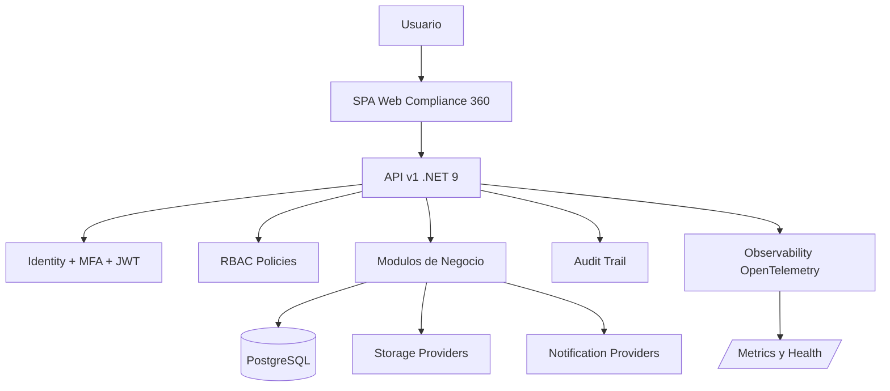

La aplicación está organizada en capas:

- **Domain:** reglas de negocio.
- **Application:** casos de uso y contratos.
- **Infrastructure:** EF Core, PostgreSQL, providers, storage, notificaciones.
- **Web/API:** Minimal APIs, seguridad, Swagger y SPA.
- **Tests:** pruebas xUnit por módulo.

## 2.2 Flujo de autenticación

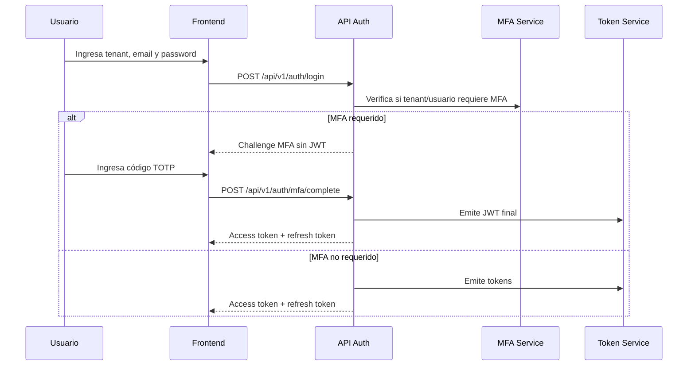

## 2.3 Modelo RBAC

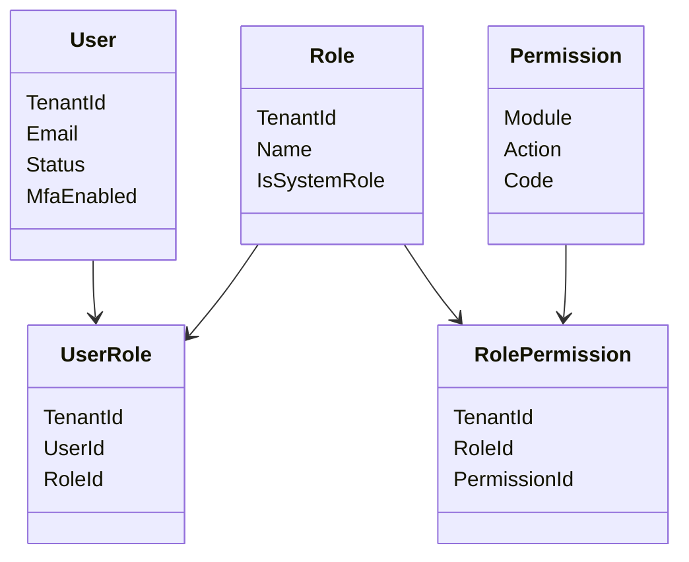

El sistema no depende de nombres fijos de rol. Depende de permisos (`permission` claims) evaluados por policies.

## 2.4 Modelo multitenant

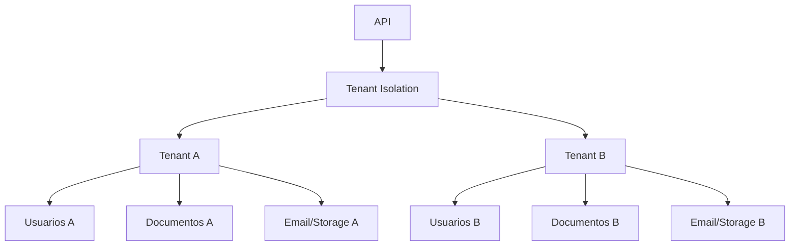

Cada registro operativo importante contiene `TenantId`. Las APIs validan que el tenant de la ruta coincida con el contexto del usuario autenticado.

## 2.5 Modelo de datos conceptual

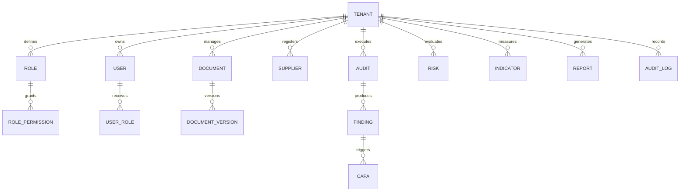

---

# 3. Mapa General de Módulos

| Módulo | Objetivo | Usuario Principal | Estado | Dependencias |
| ------ | -------- | ----------------- | ------ | ------------ |
| Tenant Management | Crear y configurar empresas cliente | Consultora Admin / Tenant Admin | Parcial operativo | Identity, RBAC |
| Identity | Login, sesión, password | Todos | Operativo | Tenant |
| RBAC | Roles y permisos | Tenant Admin | Operativo API | Identity |
| MFA | Segundo factor | Usuarios / Admin | Operativo TOTP | Identity |
| Audit Trail | Trazabilidad | Auditor / Admin | Operativo | Todos los módulos |
| Storage | Evidencias y archivos | Storage Admin | Operativo configurable | Provider config |
| Notifications | Correos y tracking | Notification Admin | Operativo email | Provider externo |
| Document Management | Control documental | Document Controller | Operativo core | Storage, Workflow |
| Workflow Engine | Flujos de aprobación | Quality Manager | Operativo API | RBAC |
| Technical Sheets | Fichas técnicas | Calidad / Regulatorio | Operativo core | Documents, Storage |
| Supplier Management | Proveedores | Compras / Calidad | Operativo core | Storage, Notifications |
| Audit Management | Auditorías | Auditor | Operativo core | CAPA, Storage |
| CAPA Management | Correctivas/preventivas | Quality Manager | Operativo core | Audit, Risk |
| Risk Management | Riesgos | Risk Manager | Operativo core | CAPA, Indicators |
| Quality Indicators | KPIs | Quality Manager | Operativo core | Reports |
| Reporting Engine | Reportes | Analyst / Admin | Avanzado parcial | Módulos core |
| Dashboard | Visión ejecutiva | Gerencia | Operativo | Reporting datasets |
| Template Builder | Plantillas | Consultora | Workspace genérico | Enterprise Workspaces |
| Regulatory Management | Regulatorio | Regulatorio | Workspace genérico | Enterprise Workspaces |
| Training Management | Capacitación | RRHH / Calidad | Workspace genérico | Enterprise Workspaces |
| Supplier Portal | Portal proveedor | Supplier User | Workspace genérico | Enterprise Workspaces |
| Customer Portal | Portal cliente | Customer User | Workspace genérico | Enterprise Workspaces |
| Observability | Monitoreo técnico | DevOps / Soporte | Operativo | OpenTelemetry |
| CI/CD | Validación entrega | DevOps | Implementado local | GitHub/Azure remoto pendiente |
| Security Hardening | Seguridad base | Seguridad / Admin | Operativo fase 1 | Identity, Web |

---

# 4. Roles, Permisos y Matrices de Acceso

## 4.1 Roles funcionales recomendados

| Rol | Propósito | Permisos típicos |
| --- | --------- | ---------------- |
| SuperAdmin | Administración global de plataforma | Todos los permisos |
| Consultora Admin | Implementar y operar clientes | Tenant, RBAC, Document, Workflow, Reports |
| Tenant Admin | Administrar una empresa cliente | Tenant, Identity, RBAC limitados al tenant |
| Quality Manager | Operar calidad | Document, CAPA, Risk, Indicator, Audit |
| Auditor | Ejecutar auditorías | AuditManagement, Audit.Read |
| Approver | Aprobar documentos/CAPA/riesgos/KPIs | Approve/Close por módulo |
| Reviewer | Revisar y comentar | Read/Manage limitado |
| Supplier User | Proveedor externo previsto | Portal/workspace o permisos limitados |
| Customer User | Cliente externo previsto | Portal/workspace o reportes autorizados |
| Viewer | Solo consulta | Read por módulo |
| Notification Admin | Email providers, plantillas, tracking | Notification.Admin |
| Storage Admin | Storage providers y evidencias | Storage.Manage |
| Observability Admin | Health, métricas y alertas | Observability.Admin |

## 4.2 Matriz visual de roles

| Acción | SuperAdmin | Consultora | Tenant Admin | Quality Manager | Auditor | Approver | Viewer |
| ------ | ---------- | ---------- | ------------ | --------------- | ------- | -------- | ------ |
| Crear tenant | Sí | Sí | No | No | No | No | No |
| Configurar branding | Sí | Sí | Sí | No | No | No | No |
| Crear usuarios | Sí | Sí | Sí | No | No | No | No |
| Crear roles | Sí | Sí | Sí | No | No | No | No |
| Crear documento | Sí | Sí | Sí | Sí | No | No | No |
| Aprobar documento | Sí | Sí | Sí | Sí | No | Sí | No |
| Registrar auditoría | Sí | Sí | Sí | Sí | Sí | No | No |
| Crear CAPA | Sí | Sí | Sí | Sí | Sí | No | No |
| Cerrar CAPA | Sí | Sí | Sí | Sí | No | Sí | No |
| Crear riesgo | Sí | Sí | Sí | Sí | No | No | No |
| Aprobar riesgo | Sí | Sí | Sí | Sí | No | Sí | No |
| Ver reportes | Sí | Sí | Sí | Sí | Sí | Sí | Sí |
| Exportar reportes | Sí | Sí | Sí | Sí | No | No | No |
| Configurar email provider | Sí | Sí | Sí | No | No | No | No |
| Configurar storage provider | Sí | Sí | Sí | No | No | No | No |
| Ver audit trail | Sí | Sí | Sí | Sí | Sí | No | Solo si permiso |

## 4.3 Matriz por módulo y permisos reales

| Módulo | Permiso mínimo | Permiso avanzado |
| ------ | -------------- | ---------------- |
| Tenant | `TENANT.MANAGE` | `TENANT.MANAGE` |
| Identity | `IDENTITY.MANAGE` | `IDENTITY.MANAGE` |
| RBAC | `RBAC.MANAGE` | `RBAC.MANAGE` |
| Audit Trail | `AUDIT.READ` | `AUDIT.MANAGE` |
| Documentos | `DOCUMENT.MANAGE` | `DOCUMENT.MANAGE` |
| Workflow | `WORKFLOW.MANAGE` | `WORKFLOW.MANAGE` |
| Proveedores | `SUPPLIER.MANAGE` | `SUPPLIER.MANAGE` |
| CAPA | `CAPA.READ` | `CAPA.MANAGE`, `CAPA.APPROVE`, `CAPA.CLOSE` |
| Riesgos | `RISK.READ` | `RISK.MANAGE`, `RISK.APPROVE`, `RISK.CLOSE` |
| Indicadores | `INDICATOR.READ` | `INDICATOR.MANAGE`, `INDICATOR.APPROVE`, `INDICATOR.EXPORT` |
| Reportes | `REPORT.READ` | `REPORT.EXECUTE`, `REPORT.EXPORT`, `REPORT.SCHEDULE`, `REPORT.MANAGE` |
| Storage | `STORAGE.MANAGE` | `STORAGE.MANAGE` |
| Notifications | `NOTIFICATION.READ` | `NOTIFICATION.SEND`, `NOTIFICATION.TEMPLATE`, `NOTIFICATION.ADMIN` |
| Observability | `OBSERVABILITY.READ` | `OBSERVABILITY.MANAGE`, `OBSERVABILITY.ADMIN` |

---

# 5. Configuración Inicial del Sistema

## 5.1 Objetivo

Preparar la plataforma para que una empresa pueda operar con usuarios, seguridad, branding, documentos, workflows, storage, notificaciones y módulos core.

## 5.2 Prerrequisitos

- Base de datos PostgreSQL configurada.
- `ConnectionStrings__Compliance360` o `COMPLIANCE360_DESIGN_CONNECTION` para migraciones.
- `Jwt:SigningKey` seguro.
- Tenant inicial.
- Usuario administrador.
- Proveedores externos si se usará email/storage cloud.

## 5.3 Pasos

1. Crear tenant.
2. Crear compañía.
3. Activar tenant.
4. Configurar settings.
5. Configurar branding.
6. Crear usuarios.
7. Crear roles.
8. Crear permisos.
9. Asignar permisos a roles.
10. Asignar roles a usuarios.
11. Configurar MFA si aplica.
12. Configurar Storage Provider.
13. Configurar Email Provider.
14. Crear tipos documentales.
15. Crear categorías.
16. Configurar workflows.
17. Crear plantillas.
18. Cargar documentos base.
19. Crear proveedores.
20. Definir indicadores iniciales.

## 5.4 Resultado esperado

El tenant queda listo para operar documentos, proveedores, auditorías, CAPA, riesgos, indicadores y reportes.

## 5.5 Posibles errores

| Problema | Causa | Solución | Prevención |
| -------- | ----- | -------- | ---------- |
| Usuario no puede entrar | Password incorrecto, usuario bloqueado o MFA requerido | Resetear/validar MFA | Configurar usuarios antes del go-live |
| API devuelve 401 | Token ausente o expirado | Re-login | Manejar refresh token |
| API devuelve 403 | Falta permiso | Revisar rol y claims | Matriz de permisos |
| No se envía email | Provider sin secreto/config | Configurar secret store | Probar provider |
| No sube archivo | Storage provider incompleto | Probar conexión | Configurar fallback |
| Dashboard vacío | No hay datos operativos | Crear registros base | Cargar datos iniciales |

---

# 6. Módulos del Producto

> Nota: todos los módulos a continuación usan el mismo formato enterprise solicitado. Cuando una capacidad está limitada, se declara en "Estado real del módulo".

## 6.1 Tenant Management

### Descripción

Administra empresas cliente dentro de la plataforma SaaS.

### Objetivo de negocio

Permitir que una consultora opere múltiples clientes sin mezclar datos.

### Problema que resuelve

Evita operar clientes en carpetas separadas, hojas de cálculo y usuarios compartidos.

### Usuarios involucrados

SuperAdmin, Consultora Admin, Tenant Admin.

### Roles permitidos

`Tenant.Manage`.

### Configuración inicial

Crear tenant, compañía, settings, branding y suscripción.

### Flujo funcional

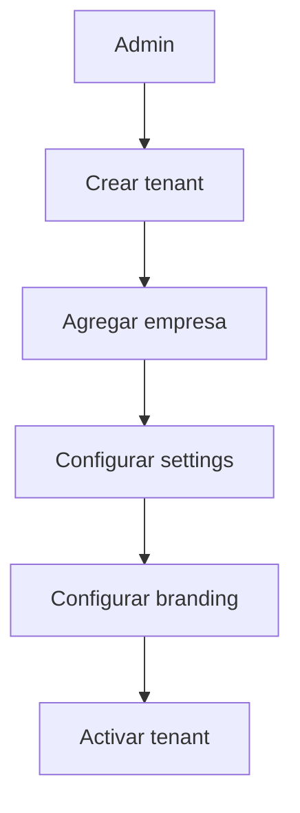

### Pantallas asociadas

Configuración general y APIs. La UI de alta/listado de tenants no está tan completa como el backend.

### APIs asociadas

- `POST /api/v1/tenants`
- `POST /api/v1/tenants/{tenantId}/companies`
- `POST /api/v1/tenants/{tenantId}/activate`
- `POST /api/v1/tenants/{tenantId}/suspend`
- `PUT /api/v1/tenants/{tenantId}/settings`
- `PUT /api/v1/tenants/{tenantId}/branding`
- `PUT /api/v1/tenants/{tenantId}/subscription`

### Permisos asociados

`Tenant.Manage`.

### Integraciones

Identity, RBAC, branding, módulos tenant-scoped.

### Alertas generadas

No se detectan alertas específicas de tenant.

### Reportes generados

No se detecta reporte especializado de tenant.

### Dashboard asociado

Indirectamente dashboard ejecutivo por tenant.

### Ejemplo real de uso

Una consultora crea el tenant "Industrias Alimentarias Panamá" y le configura logo, zona horaria y retención documental.

### Mejores prácticas

- Crear un tenant por empresa legal.
- No compartir usuarios entre tenants.
- Activar MFA para clientes regulados.

### Riesgos comunes

- Usar el tenant equivocado.
- No configurar branding antes de demo.
- No crear roles antes de invitar usuarios.

### Estado real del módulo

Backend/API operativo. UI administrativa completa de tenant es parcial.

---

## 6.2 Identity

### Descripción

Autenticación, sesión, password, refresh token y logout.

### Objetivo de negocio

Controlar acceso seguro a la plataforma.

### Problema que resuelve

Evita accesos compartidos o sin trazabilidad.

### Usuarios involucrados

Todos los usuarios.

### Roles permitidos

Login público; acciones administrativas dependen de `Identity.Manage`.

### Configuración inicial

Crear usuario, password y asignar rol.

### Flujo funcional

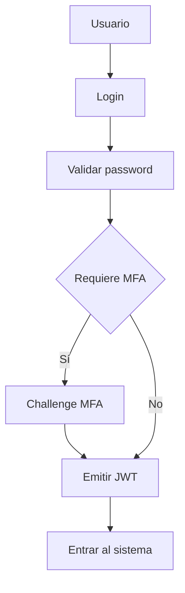

### Pantallas asociadas

Login y MFA Challenge.

### APIs asociadas

- `POST /api/v1/auth/login`
- `POST /api/v1/auth/mfa/complete`
- `POST /api/v1/auth/refresh`
- `POST /api/v1/auth/logout`
- `POST /api/v1/auth/password`

### Permisos asociados

`Identity.Manage` para administración.

### Integraciones

MFA, RBAC, Audit Trail.

### Alertas generadas

Authentication failures y MFA failures en observabilidad.

### Reportes generados

Eventos consultables por Audit Trail.

### Dashboard asociado

Security/Observability.

### Ejemplo real de uso

Un auditor entra al sistema, completa MFA y revisa auditorías asignadas.

### Mejores prácticas

- Usar passwords fuertes.
- Activar MFA.
- Revocar sesiones cuando un usuario sale de la empresa.

### Riesgos comunes

- JWT vencido.
- Usuario sin permisos.
- MFA no configurado correctamente.

### Estado real del módulo

Operativo con MFA TOTP y hardening de login.

---

## 6.3 RBAC

### Descripción

Control de acceso basado en roles y permisos.

### Objetivo de negocio

Permitir que cada usuario haga solo lo que corresponde.

### Problema que resuelve

Evita que usuarios no autorizados aprueben, eliminen, exporten o configuren.

### Usuarios involucrados

SuperAdmin, Consultora Admin, Tenant Admin.

### Roles permitidos

`Rbac.Manage`.

### Configuración inicial

Crear roles, crear permisos, asignar permisos a roles y roles a usuarios.

### Flujo funcional

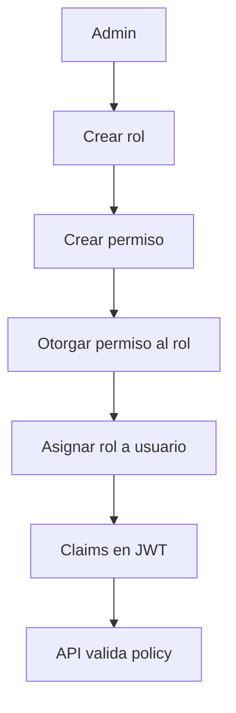

### Pantallas asociadas

Principalmente API/backend; no se observa UI completa de administración RBAC.

### APIs asociadas

- `/api/v1/tenants/{tenantId}/rbac/roles`
- `/api/v1/tenants/{tenantId}/rbac/permissions`
- `/api/v1/tenants/{tenantId}/rbac/roles/assign`
- `/api/v1/tenants/{tenantId}/rbac/permissions/grant`
- `/api/v1/tenants/{tenantId}/rbac/users/{userId}/permissions`

### Permisos asociados

`Rbac.Manage`.

### Integraciones

Todos los módulos protegidos.

### Alertas generadas

Authorization failures en observabilidad.

### Reportes generados

Audit Trail de cambios administrativos.

### Dashboard asociado

Security/Observability.

### Ejemplo real de uso

Crear rol "Auditor Interno" y asignarle `AUDIT.READ` y `AUDITMANAGEMENT.MANAGE`.

### Mejores prácticas

- Usar mínimo privilegio.
- Separar aprobación de creación.
- Revisar permisos periódicamente.

### Riesgos comunes

- Dar `MANAGE` a usuarios de solo lectura.
- No documentar roles.

### Estado real del módulo

Operativo en backend/API. UI administrativa completa pendiente.

---

## 6.4 MFA

### Descripción

Segundo factor de autenticación con TOTP.

### Objetivo de negocio

Reducir riesgo de acceso no autorizado.

### Problema que resuelve

Contraseñas filtradas o compartidas.

### Usuarios involucrados

Usuarios finales, Identity Admin.

### Roles permitidos

`Identity.Manage` para gestión; usuario autenticado para verificación.

### Configuración inicial

Setup TOTP, verificación y enable.

### Flujo funcional

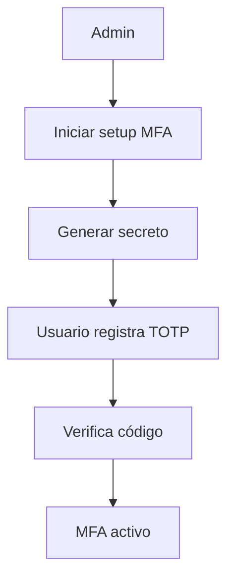

### Pantallas asociadas

Pantalla MFA durante login.

### APIs asociadas

- `/api/v1/tenants/{tenantId}/users/{userId}/mfa/setup`
- `/api/v1/tenants/{tenantId}/users/{userId}/mfa/enable`
- `/api/v1/tenants/{tenantId}/users/{userId}/mfa/verify`
- `/api/v1/tenants/{tenantId}/users/{userId}/mfa/disable`
- `/api/v1/auth/mfa/complete`

### Permisos asociados

`Identity.Manage`.

### Integraciones

Identity, Audit Trail, Security.

### Alertas generadas

MFA failure.

### Reportes generados

Audit Trail.

### Dashboard asociado

Security/Observability.

### Ejemplo real de uso

El Tenant Admin exige MFA a todo usuario con permisos de aprobación.

### Mejores prácticas

- Activar MFA para administradores.
- Exigir MFA por tenant en clientes regulados.

### Riesgos comunes

- Usuario sin app TOTP.
- Códigos vencidos.

### Estado real del módulo

TOTP operativo. Email MFA no está productivizado.

---

## 6.5 Audit Trail

### Descripción

Bitácora central de eventos.

### Objetivo de negocio

Demostrar trazabilidad y responsabilidad.

### Problema que resuelve

No saber quién creó, aprobó, cambió o falló un proceso.

### Usuarios involucrados

Auditor, soporte, admins.

### Roles permitidos

`Audit.Read`, `Audit.Manage`.

### Configuración inicial

Se alimenta automáticamente desde módulos.

### Flujo funcional

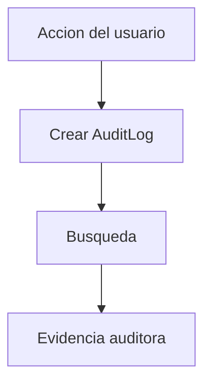

### Pantallas asociadas

Audit Trail.

### APIs asociadas

- `POST /api/v1/tenants/{tenantId}/audit/search`

### Permisos asociados

`Audit.Read`.

### Integraciones

Todos los módulos.

### Alertas generadas

No alertas directas; eventos disponibles para análisis.

### Reportes generados

Consultas de auditoría.

### Dashboard asociado

Audit Trail.

### Ejemplo real de uso

Un auditor externo revisa quién aprobó una CAPA y cuándo.

### Mejores prácticas

- No borrar auditoría.
- Usar filtros por fecha/usuario/módulo.

### Riesgos comunes

- No asignar `Audit.Read` a auditores.

### Estado real del módulo

Operativo.

---

## 6.6 Storage

### Descripción

Gestión de archivos, evidencias y providers de almacenamiento.

### Objetivo de negocio

Guardar evidencias de forma organizada, tenant-scoped y auditable.

### Problema que resuelve

Archivos dispersos sin hash, propietario ni trazabilidad.

### Usuarios involucrados

Storage Admin, Document Controller, Quality Manager.

### Roles permitidos

`Storage.Manage`.

### Configuración inicial

Crear provider Local, Azure Blob, AWS S3, MinIO, Google Cloud Storage o SFTP; definir bucket/contenedor, prioridad y estado.

### Flujo funcional

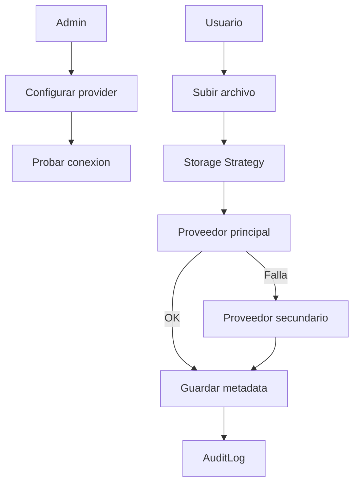

### Pantallas asociadas

Configuration -> Integraciones; módulos que suben archivos.

### APIs asociadas

- `/api/v1/tenants/{tenantId}/storage/files`
- `/api/v1/tenants/{tenantId}/storage/files/{id}`
- `/api/v1/tenants/{tenantId}/storage/providers`
- `/api/v1/tenants/{tenantId}/storage/providers/{id}/test`

### Permisos asociados

`Storage.Manage`.

### Integraciones

Documents, Suppliers, Audits, CAPA, Risks, Technical Sheets.

### Alertas generadas

Storage Down, provider health degradado, failover auditado.

### Reportes generados

Audit Trail y reportes de evidencias si se configuran.

### Dashboard asociado

Integrations Health, Observability.

### Ejemplo real de uso

Una empresa usa MinIO on-premise para evidencias internas y SFTP como contingencia.

### Mejores prácticas

- Definir provider primario y secundario.
- Usar buckets por tenant.
- No hardcodear credenciales.

### Riesgos comunes

- Credenciales vencidas.
- Bucket mal escrito.
- No probar conexión.

### Estado real del módulo

Administración configurable implementada. Local real operativo. Providers cloud/SFTP están modelados por strategy/configuración; operación real requiere credenciales/proveedor externo y posible hardening SDK por proveedor.

---

## 6.7 Notifications

### Descripción

Sistema de notificaciones email con providers, plantillas, tracking, retries y dead letters.

### Objetivo de negocio

Enviar alertas y comunicaciones sobre vencimientos, hallazgos, workflows, CAPA y reportes.

### Problema que resuelve

Recordatorios manuales y correos sin trazabilidad.

### Usuarios involucrados

Notification Admin, Quality Manager, usuarios finales.

### Roles permitidos

`Notification.Read`, `Notification.Send`, `Notification.Template`, `Notification.Admin`.

### Configuración inicial

Crear provider SMTP, Gmail SMTP, Microsoft 365, Exchange Online, SendGrid, Mailgun, Resend o Amazon SES; configurar prioridad, secretos y plantillas.

### Flujo funcional

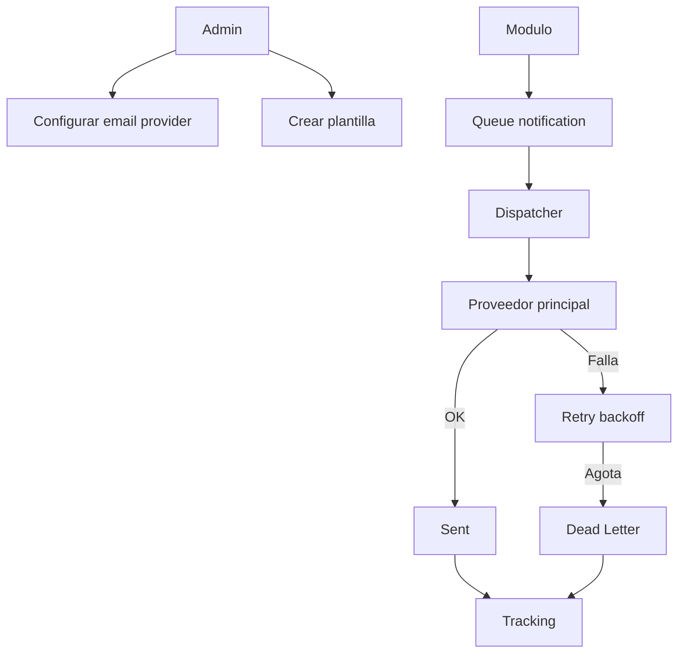

### Pantallas asociadas

Configuration -> Integraciones; dashboards de notificaciones.

### APIs asociadas

- `/api/v1/tenants/{tenantId}/notifications/templates`
- `/api/v1/tenants/{tenantId}/notifications/templates/preview`
- `/api/v1/tenants/{tenantId}/notifications/messages`
- `/api/v1/tenants/{tenantId}/notifications/messages/{id}/send`
- `/api/v1/tenants/{tenantId}/notifications/messages/{id}/retry`
- `/api/v1/tenants/{tenantId}/notifications/tracking/dead-letters`
- `/api/v1/tenants/{tenantId}/notifications/dashboard`
- `/api/v1/tenants/{tenantId}/notifications/providers`

### Permisos asociados

`Notification.*`.

### Integraciones

Workflow, Reports, CAPA, Supplier alerts, Observability.

### Alertas generadas

Provider Failure, Repeated Failure, Dead Letter Growth, Delivery Failure, Template Failure.

### Reportes generados

Dashboard de notificaciones y Audit Trail.

### Dashboard asociado

Notifications Dashboard.

### Ejemplo real de uso

Una empresa envía recordatorios por Microsoft 365 y usa SendGrid como failover.

### Mejores prácticas

- Configurar failover.
- Probar proveedores.
- Usar plantillas por tenant.

### Riesgos comunes

- API key inválida.
- Dominio no verificado.
- Mailgun/SendGrid sin remitente autorizado.

### Estado real del módulo

Operativo para email. SMS/WhatsApp/Push/In-App están preparados en arquitectura, pero no implementados como canales productivos completos.

---

## 6.8 Document Management

### Descripción

Control documental con tipos, categorías, documentos, versiones, aprobaciones, permisos y obsolescencia.

### Objetivo de negocio

Mantener documentos controlados, vigentes y auditables.

### Problema que resuelve

Versiones dispersas, documentos vencidos y aprobaciones sin evidencia.

### Usuarios involucrados

Document Controller, Quality Manager, Approver, Viewer.

### Roles permitidos

`Document.Manage`; storage requiere `Storage.Manage`.

### Configuración inicial

Crear tipos documentales, categorías y workflow si aplica.

### Flujo funcional

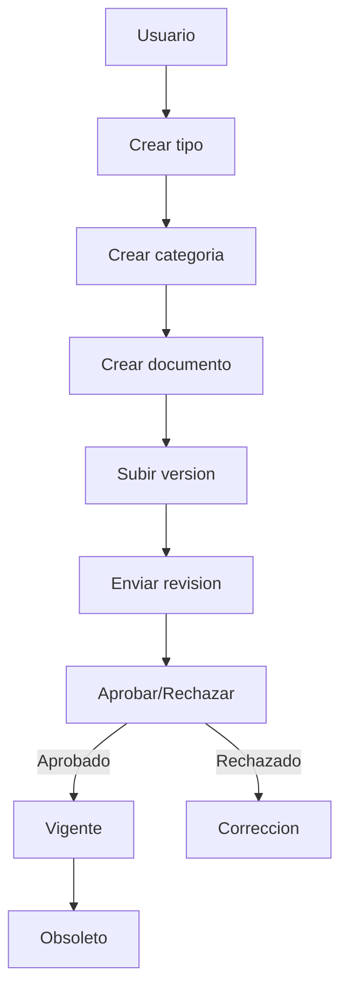

### Pantallas asociadas

Document Management.

### APIs asociadas

Documents endpoints para tipos, categorías, documentos, versiones, submit, decision, obsolete, permissions y search.

### Permisos asociados

`Document.Manage`.

### Integraciones

Storage, Workflow, Audit Trail, Reporting.

### Alertas generadas

Vencimientos/documentos pueden notificarse si se configuran procesos.

### Reportes generados

Documentos por estado, vigencia, categorías y reportes estándar.

### Dashboard asociado

Dashboard ejecutivo y reportes.

### Ejemplo real de uso

Procedimiento de limpieza en planta alimentaria se versiona y aprueba antes de entrar en vigencia.

### Mejores prácticas

- Usar códigos únicos.
- No subir documentos sin tipo/categoría.
- Definir responsable.

### Riesgos comunes

- Versiones duplicadas.
- Permisos demasiado amplios.

### Estado real del módulo

Operativo core con UI y API.

---

## 6.9 Workflow Engine

### Descripción

Motor de workflows con pasos, transiciones, reglas, instancias, asignaciones y escalaciones.

### Objetivo de negocio

Formalizar aprobaciones y tareas.

### Problema que resuelve

Aprobaciones por correo sin control.

### Usuarios involucrados

Quality Manager, Approver, Reviewer.

### Roles permitidos

`Workflow.Manage`.

### Configuración inicial

Crear workflow, pasos, transiciones, reglas y activarlo.

### Flujo funcional

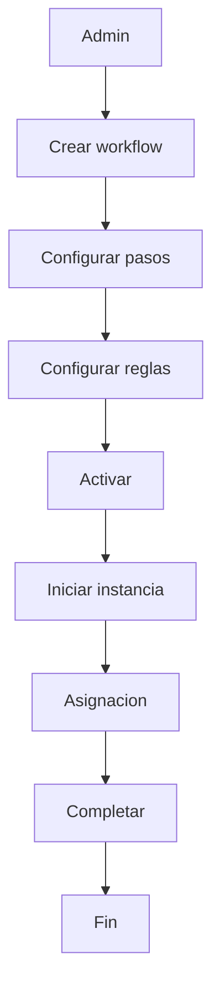

### Pantallas asociadas

Principalmente API/backend; la UI no muestra diseñador visual completo.

### APIs asociadas

Workflow endpoints para create, steps, transitions, rules, activate, start, assignments, complete, escalate y reminders.

### Permisos asociados

`Workflow.Manage`.

### Integraciones

Documents, CAPA, Risk, Notifications.

### Alertas generadas

Workflow failures y reminders.

### Reportes generados

Trazabilidad y dashboards si se conectan.

### Dashboard asociado

Observability y módulos que consumen workflows.

### Ejemplo real de uso

Aprobación de procedimiento: redactor, revisor, aprobador.

### Mejores prácticas

- Mantener flujos simples.
- Definir SLA.
- Asignar roles, no personas cuando sea posible.

### Riesgos comunes

- Workflow activado sin transiciones.
- Asignaciones sin responsable.

### Estado real del módulo

Backend/API operativo. Diseñador visual pendiente.

---

## 6.10 Technical Sheets

### Descripción

Gestión de fichas técnicas de productos.

### Objetivo de negocio

Controlar información técnica, ingredientes, nutrientes, certificaciones y versiones.

### Problema que resuelve

Fichas técnicas desactualizadas o sin aprobación.

### Usuarios involucrados

Calidad, Regulatorio, Producción.

### Roles permitidos

`TechnicalSheet.Manage`.

### Configuración inicial

Crear productos y estructura documental.

### Flujo funcional

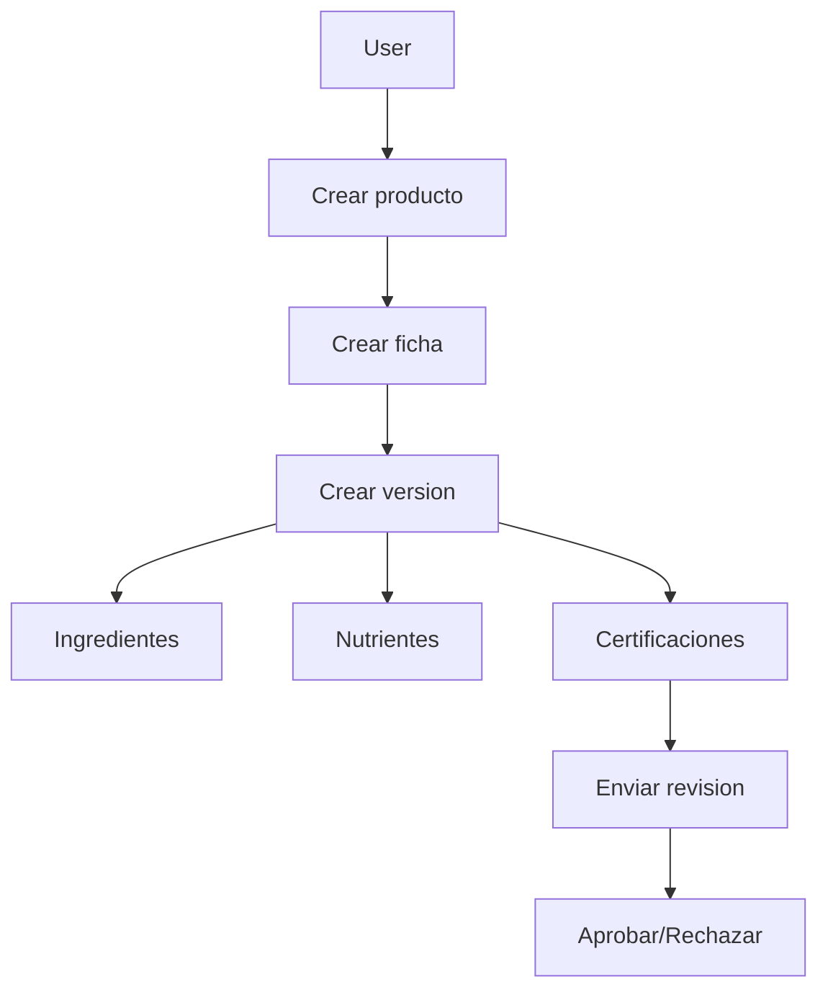

### Pantallas asociadas

Technical Sheets.

### APIs asociadas

Products, sheets, versions, ingredients, nutrients, certifications, submit, decision, PDF metadata, obsolete, search.

### Permisos asociados

`TechnicalSheet.Manage`.

### Integraciones

Documents, Storage, Reporting.

### Alertas generadas

Vencimientos/certificaciones si se configuran.

### Reportes generados

Fichas por estado/producto/certificación.

### Dashboard asociado

Dashboard general y reportes.

### Ejemplo real de uso

Ficha técnica de producto alimenticio con ingredientes y certificación sanitaria.

### Mejores prácticas

- Versionar toda actualización.
- Adjuntar certificaciones.
- Revisar vigencias.

### Riesgos comunes

- Usar ficha sin aprobación.

### Estado real del módulo

Operativo core.

---

## 6.11 Supplier Management

### Descripción

Gestión de proveedores, documentos, evaluación, homologación, alertas y suspensión.

### Objetivo de negocio

Controlar proveedores críticos y evidencias de cumplimiento.

### Problema que resuelve

Proveedores aprobados sin documentos vigentes.

### Usuarios involucrados

Compras, Calidad, Supplier Manager, Auditor.

### Roles permitidos

`Supplier.Manage`.

### Configuración inicial

Definir documentos requeridos y criterios de evaluación.

### Flujo funcional

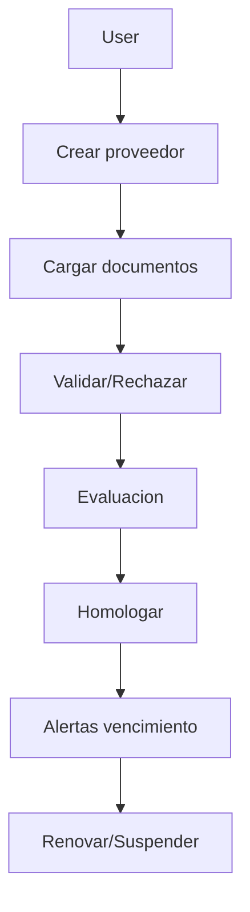

### Pantallas asociadas

Supplier Management.

### APIs asociadas

Supplier endpoints para create, documents, validate, reject, evaluations, homologate, alerts, suspend, search.

### Permisos asociados

`Supplier.Manage`.

### Integraciones

Storage, Notifications, Audit, Risk.

### Alertas generadas

Documentos vencidos, proveedor crítico, suspensión.

### Reportes generados

Proveedores aprobados, vencidos, críticos.

### Dashboard asociado

Dashboard ejecutivo y reportes.

### Ejemplo real de uso

Homologar proveedor de empaques con certificado vigente.

### Mejores prácticas

- No homologar sin documentos.
- Revisar score.
- Programar alertas.

### Riesgos comunes

- Certificados vencidos.
- Evaluaciones incompletas.

### Estado real del módulo

Operativo core.

---

## 6.12 Audit Management

### Descripción

Planificación y ejecución de auditorías.

### Objetivo de negocio

Controlar auditorías internas/externas con evidencia y seguimiento.

### Problema que resuelve

Auditorías sin hallazgos trazables ni CAPA vinculada.

### Usuarios involucrados

Auditor, Quality Manager, responsables de área.

### Roles permitidos

`AuditManagement.Manage`, `Audit.Read`.

### Configuración inicial

Crear programa, checklist y plan.

### Flujo funcional

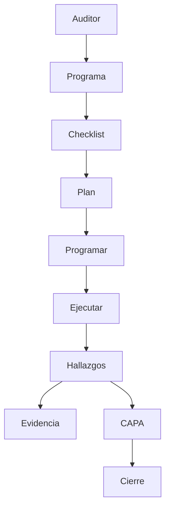

### Pantallas asociadas

Audit Management.

### APIs asociadas

Programs, checklists, plans, audits, schedule, participants, areas, findings, evidence, observations, nonconformities, recommendations, CAPA links, attachments, lifecycle, dashboard, export, search.

### Permisos asociados

`AuditManagement.Manage`.

### Integraciones

CAPA, Storage, Audit Trail, Reports.

### Alertas generadas

Auditorías vencidas, hallazgos, CAPA pendiente si se configura.

### Reportes generados

Auditorías abiertas/cerradas, hallazgos, no conformidades.

### Dashboard asociado

Audit Management Dashboard.

### Ejemplo real de uso

Auditoría ISO 9001 a proceso de compras.

### Mejores prácticas

- Preparar checklist antes de ejecutar.
- Adjuntar evidencia.
- Vincular CAPA.

### Riesgos comunes

- Hallazgos sin responsable.
- Auditoría sin cierre formal.

### Estado real del módulo

Operativo core.

---

## 6.13 CAPA Management

### Descripción

Gestión de acciones correctivas y preventivas.

### Objetivo de negocio

Corregir causas raíz y evitar recurrencia.

### Problema que resuelve

Hallazgos repetidos sin cierre efectivo.

### Usuarios involucrados

Quality Manager, responsable CAPA, Approver, Auditor.

### Roles permitidos

`Capa.Read`, `Capa.Manage`, `Capa.Approve`, `Capa.Close`.

### Configuración inicial

Definir responsables, origen y criterios de efectividad.

### Flujo funcional

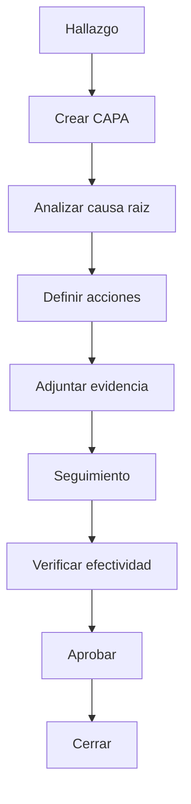

### Pantallas asociadas

CAPA.

### APIs asociadas

Create, classify, owners, approvers, root causes, cause analysis, actions, evidence, attachments, follow-up, effectiveness, workflow, close/reopen, dashboard, export, search.

### Permisos asociados

`Capa.*`.

### Integraciones

Audit Management, Risk, Storage, Notifications, Reports.

### Alertas generadas

CAPA vencida, efectividad pendiente, cierre pendiente.

### Reportes generados

CAPA abiertas/cerradas, por prioridad, por origen.

### Dashboard asociado

CAPA Dashboard.

### Ejemplo real de uso

No conformidad por limpieza deficiente genera CAPA con causa raíz y acción preventiva.

### Mejores prácticas

- No cerrar sin evidencia.
- Verificar efectividad.
- Separar contención de corrección.

### Riesgos comunes

- Cerrar por cumplimiento formal sin resolver causa.

### Estado real del módulo

Operativo core; diagramas visuales 5 Why/Ishikawa especializados no están como UI gráfica completa.

---

## 6.14 Risk Management

### Descripción

Gestión de riesgos con matriz, controles, tratamiento y residual.

### Objetivo de negocio

Reducir exposición y priorizar controles.

### Problema que resuelve

Riesgos conocidos pero no medidos ni tratados.

### Usuarios involucrados

Risk Manager, Quality Manager, Gerencia.

### Roles permitidos

`Risk.Read`, `Risk.Manage`, `Risk.Approve`, `Risk.Close`.

### Configuración inicial

Crear categorías y matriz.

### Flujo funcional

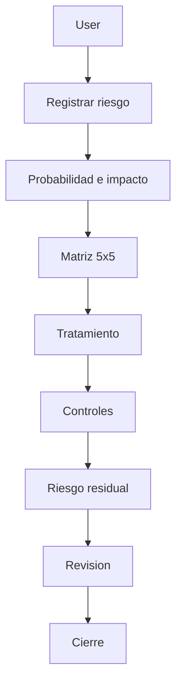

### Pantallas asociadas

Risk Management.

### APIs asociadas

Categories, matrices, risks, assessment, treatment, mitigation, controls, evidence, attachments, reviews, indicators, escalation, workflow, close/reopen, dashboard, heat map, export, search.

### Permisos asociados

`Risk.*`.

### Integraciones

CAPA, Indicators, Reports, Audit Trail.

### Alertas generadas

Riesgo alto, revisión vencida, escalación.

### Reportes generados

Matriz, heat map, riesgos por nivel.

### Dashboard asociado

Risk Dashboard y Heat Map.

### Ejemplo real de uso

Riesgo de proveedor crítico sin certificación vigente.

### Mejores prácticas

- Revisar riesgos periódicamente.
- Documentar controles.
- Medir residual.

### Riesgos comunes

- Registrar riesgo sin tratamiento.

### Estado real del módulo

Operativo core.

---

## 6.15 Quality Indicators

### Descripción

Gestión de KPIs, metas, mediciones, resultados y tendencias.

### Objetivo de negocio

Medir desempeño del sistema de gestión.

### Problema que resuelve

Indicadores sin meta, sin frecuencia o sin seguimiento.

### Usuarios involucrados

Quality Manager, Gerencia, Analyst.

### Roles permitidos

`Indicator.Read`, `Indicator.Manage`, `Indicator.Approve`, `Indicator.Export`.

### Configuración inicial

Crear categorías, indicadores, fórmulas, metas, umbrales y períodos.

### Flujo funcional

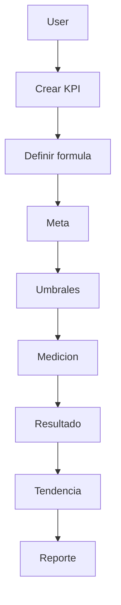

### Pantallas asociadas

Quality Indicators.

### APIs asociadas

Categories, indicators, formulas, targets, thresholds, periods, processes, measurements, results, attachments, workflow, activate/approve, dashboard, trends, export, search.

### Permisos asociados

`Indicator.*`.

### Integraciones

CAPA, Risk, Reports.

### Alertas generadas

Desviaciones de umbral si se configuran.

### Reportes generados

KPIs, tendencias, cumplimiento de metas.

### Dashboard asociado

Quality Indicators Dashboard.

### Ejemplo real de uso

Indicador de reclamos por mes con meta menor a 2%.

### Mejores prácticas

- Definir frecuencia.
- Evitar KPIs sin dueño.
- Revisar tendencia, no solo valor puntual.

### Riesgos comunes

- Fórmulas mal definidas.

### Estado real del módulo

Operativo core.

---

## 6.16 Reporting Engine

### Descripción

Motor de reportes con categorías, definiciones, datasets, ejecuciones, exportación, schedules y subscriptions.

### Objetivo de negocio

Generar información ejecutiva y operativa.

### Problema que resuelve

Reportes manuales y repetitivos.

### Usuarios involucrados

Gerencia, Quality Manager, Analyst, Consultora.

### Roles permitidos

`Report.Read`, `Report.Manage`, `Report.Execute`, `Report.Export`, `Report.Schedule`.

### Configuración inicial

Sembrar reportes estándar y configurar permisos.

### Flujo funcional

```mermaid
flowchart TD
    Admin --> Seed[Seed reportes]
    User --> Select[Seleccionar reporte]
    Select --> Execute[Ejecutar]
    Execute --> Dataset[Dataset]
    Dataset --> Export[Exportar]
    Dataset --> Schedule[Agendar]
    Schedule --> Subscription[Suscripcion]
```

### Pantallas asociadas

Report Center.

### APIs asociadas

Reporting endpoints para categories, definitions, templates, parameters, permissions, activate, execute, complete, export, schedules, subscriptions, dashboard binding, dashboard datasets, standard reports, seed, search.

### Permisos asociados

`Report.*`.

### Integraciones

Todos los módulos operativos.

### Alertas generadas

Report failures en observabilidad.

### Reportes generados

Reportes estándar por módulo, datasets y exportaciones.

### Dashboard asociado

Report Center y dashboards ejecutivos.

### Ejemplo real de uso

Reporte mensual de CAPA abiertas, cerradas y vencidas.

### Mejores prácticas

- Asignar permisos por audiencia.
- Programar reportes recurrentes.
- Validar datos fuente.

### Riesgos comunes

- Vender PDF/Excel/Word avanzado como completo si aún no se implementó la fase de realization.

### Estado real del módulo

Avanzado y usable con catálogo/datasets/export básico. Reporting Realization profunda sigue como brecha futura.

---

## 6.17 Dashboard

### Descripción

Vista ejecutiva de la operación.

### Objetivo de negocio

Mostrar estado del sistema sin entrar módulo por módulo.

### Problema que resuelve

Gerencia sin visibilidad rápida.

### Usuarios involucrados

Gerencia, consultora, Quality Manager.

### Roles permitidos

Depende de permisos de lectura y endpoints usados.

### Configuración inicial

Datos operativos en módulos.

### Flujo funcional

```mermaid
flowchart TD
    User --> Dashboard[Executive Dashboard]
    Dashboard --> KPIs[Metricas]
    Dashboard --> HeatMap[Risk Heat Map]
    Dashboard --> Reports[Report Center]
    Dashboard --> Modules[Acciones rapidas]
```

### Pantallas asociadas

Executive Dashboard, Compliance Dashboard.

### APIs asociadas

Health, audit dashboard, CAPA dashboard, risk dashboard, indicators dashboard, reporting datasets.

### Permisos asociados

Según módulo consultado.

### Integraciones

Todos los módulos core.

### Alertas generadas

No directas; visualiza estados.

### Reportes generados

No genera, dirige a Report Center.

### Dashboard asociado

El propio dashboard.

### Ejemplo real de uso

Director revisa riesgos altos y CAPA vencidas antes de comité.

### Mejores prácticas

- Cargar datos reales antes de demo.
- Usar como punto inicial diario.

### Riesgos comunes

- Dashboard vacío si no hay datos.

### Estado real del módulo

Operativo.

---

## 6.18 Template Builder

### Descripción

Área prevista para construir plantillas empresariales.

### Objetivo de negocio

Diseñar formatos, reportes o documentos reutilizables.

### Problema que resuelve

Plantillas dispersas y no controladas.

### Usuarios involucrados

Consultora, Tenant Admin.

### Roles permitidos

Actualmente Enterprise Workspaces usa `Tenant.Manage`.

### Configuración inicial

Crear items en workspace.

### Flujo funcional

```mermaid
flowchart TD
    User --> Workspace[Template Builder Workspace]
    Workspace --> Item[Crear item]
    Item --> Track[Seguimiento]
    Track --> Complete[Completar]
```

### Pantallas asociadas

Template Builder workspace.

### APIs asociadas

Enterprise Workspaces.

### Permisos asociados

`Tenant.Manage`.

### Integraciones

Reporting y Notifications en visión futura.

### Alertas generadas

No específicas.

### Reportes generados

No específicos.

### Dashboard asociado

Enterprise Workspace dashboard.

### Ejemplo real de uso

Registrar tarea para crear formato de inspección BPM.

### Mejores prácticas

- No venderlo como diseñador drag-and-drop completo.

### Riesgos comunes

- Confundir workspace genérico con diseñador visual final.

### Estado real del módulo

Workspace genérico persistente; diseñador visual completo pendiente.

---

## 6.19 Regulatory Management

### Descripción

Workspace para seguimiento regulatorio.

### Objetivo de negocio

Dar visibilidad a registros, permisos, licencias y vencimientos.

### Problema que resuelve

Vencimientos regulatorios sin dueño.

### Usuarios involucrados

Regulatorio, Calidad, Consultora.

### Roles permitidos

`Tenant.Manage` en workspace actual.

### Configuración inicial

Crear items de obligaciones regulatorias.

### Flujo funcional

```mermaid
flowchart TD
    User --> Item[Crear registro regulatorio]
    Item --> Due[Vencimiento]
    Due --> Evidence[Evidencia]
    Evidence --> Complete[Completar]
```

### Pantallas asociadas

Regulatory Management workspace.

### APIs asociadas

Enterprise Workspaces.

### Permisos asociados

`Tenant.Manage`.

### Integraciones

Documents, Notifications en visión futura.

### Alertas generadas

No especializadas aún.

### Reportes generados

Workspace dashboard.

### Dashboard asociado

Enterprise Workspace dashboard.

### Ejemplo real de uso

Registrar renovación de registro sanitario.

### Mejores prácticas

- Usarlo como seguimiento inicial, no como módulo regulatorio final.

### Riesgos comunes

- Requerir campos regulatorios especializados que aún no existen.

### Estado real del módulo

Workspace genérico; módulo regulatorio especializado pendiente.

---

## 6.20 Training Management

### Descripción

Workspace para seguimiento de capacitaciones.

### Objetivo de negocio

Organizar tareas de entrenamiento y evidencias.

### Problema que resuelve

Capacitaciones sin seguimiento.

### Usuarios involucrados

Calidad, RRHH, Consultora.

### Roles permitidos

`Tenant.Manage` en workspace actual.

### Configuración inicial

Crear items de capacitación.

### Flujo funcional

```mermaid
flowchart TD
    User --> Course[Crear item curso]
    Course --> Assign[Asignar responsable]
    Assign --> Evidence[Evidencia]
    Evidence --> Complete[Completar]
```

### Pantallas asociadas

Training Management workspace.

### APIs asociadas

Enterprise Workspaces.

### Permisos asociados

`Tenant.Manage`.

### Integraciones

Documents y Notifications en visión futura.

### Alertas generadas

No especializadas.

### Reportes generados

Workspace dashboard.

### Dashboard asociado

Enterprise Workspace dashboard.

### Ejemplo real de uso

Registrar capacitación BPM anual.

### Mejores prácticas

- No usarlo como LMS completo todavía.

### Riesgos comunes

- Necesitar exámenes/certificaciones/matriz de competencias completas.

### Estado real del módulo

Workspace genérico; LMS especializado pendiente.

---

## 6.21 Supplier Portal

### Descripción

Área prevista para portal de proveedores.

### Objetivo de negocio

Permitir colaboración externa con proveedores.

### Problema que resuelve

Carga documental por correo.

### Usuarios involucrados

Supplier User, Supplier Manager.

### Roles permitidos

Actualmente workspace bajo `Tenant.Manage`.

### Configuración inicial

Crear items de portal.

### Flujo funcional

```mermaid
flowchart TD
    Supplier --> Portal[Supplier Portal Workspace]
    Portal --> Docs[Seguimiento documental]
    Docs --> Review[Revision interna]
    Review --> Complete[Completar]
```

### Pantallas asociadas

Supplier Portal workspace.

### APIs asociadas

Enterprise Workspaces.

### Permisos asociados

`Tenant.Manage` en estado actual.

### Integraciones

Supplier Management, Storage, Notifications.

### Alertas generadas

No especializadas.

### Reportes generados

Workspace dashboard.

### Dashboard asociado

Enterprise Workspace dashboard.

### Ejemplo real de uso

Registrar solicitud para que proveedor cargue certificado.

### Mejores prácticas

- Presentarlo como workspace interno, no portal externo final.

### Riesgos comunes

- Requerir login externo y chat no implementados completamente.

### Estado real del módulo

Workspace genérico; portal externo real pendiente.

---

## 6.22 Customer Portal

### Descripción

Área prevista para portal de cliente.

### Objetivo de negocio

Dar visibilidad a clientes sobre documentos, reportes e indicadores.

### Problema que resuelve

Entrega manual de reportes por correo.

### Usuarios involucrados

Customer User, Consultora, Tenant Admin.

### Roles permitidos

Actualmente workspace bajo `Tenant.Manage`.

### Configuración inicial

Crear items de portal.

### Flujo funcional

```mermaid
flowchart TD
    Customer --> Portal[Customer Portal Workspace]
    Portal --> Request[Solicitud]
    Request --> Report[Reporte/Documento]
    Report --> Complete[Completar]
```

### Pantallas asociadas

Customer Portal workspace.

### APIs asociadas

Enterprise Workspaces.

### Permisos asociados

`Tenant.Manage` en estado actual.

### Integraciones

Reports, Documents, Dashboards.

### Alertas generadas

No especializadas.

### Reportes generados

Workspace dashboard.

### Dashboard asociado

Enterprise Workspace dashboard.

### Ejemplo real de uso

Registrar entrega de reporte mensual al cliente.

### Mejores prácticas

- No presentarlo como portal externo final todavía.

### Riesgos comunes

- Cliente espere descargas/autoservicio completo.

### Estado real del módulo

Workspace genérico; portal externo real pendiente.

---

## 6.23 Observability

### Descripción

Telemetría, métricas, logs, health checks y alertas operacionales.

### Objetivo de negocio

Operar la plataforma con visibilidad productiva.

### Problema que resuelve

No saber si API, DB, storage o notificaciones fallan.

### Usuarios involucrados

DevOps, soporte, administración técnica.

### Roles permitidos

`Observability.Read`, `Observability.Manage`, `Observability.Admin`.

### Configuración inicial

Configurar entorno, conexión DB y exporter/Prometheus si aplica.

### Flujo funcional

```mermaid
flowchart TD
    Request[Request API] --> Middleware[Correlation]
    Middleware --> Trace[Trace]
    Middleware --> Metrics[Metrics]
    Middleware --> Logs[Structured Logs]
    Metrics --> Dashboard[Operational Dashboard]
    Health[Health Checks] --> Dashboard
```

### Pantallas asociadas

Endpoints/API de observability; UI directa limitada.

### APIs asociadas

- `/health`
- `/health/live`
- `/health/ready`
- `/metrics`
- `/telemetry`
- `/api/v1/observability/*`

### Permisos asociados

`Observability.*`.

### Integraciones

OpenTelemetry, Serilog, Prometheus endpoint.

### Alertas generadas

Application Down, Database Down, Storage Down, Notification Failure, High Error Rate, High Latency, Authentication/MFA failures, Workflow/Report failures.

### Reportes generados

Dashboards operacionales.

### Dashboard asociado

Operational, System, Performance, Security, Tenant.

### Ejemplo real de uso

Soporte revisa si los correos fallan por provider o si DB está degradada.

### Mejores prácticas

- Conectar Prometheus/Grafana en producción.
- Usar correlation id en soporte.

### Riesgos comunes

- No persistir logs en infraestructura externa.

### Estado real del módulo

Operativo técnicamente; APM externo/Grafana depende de infraestructura.

---

## 6.24 CI/CD

### Descripción

Pipeline de build, tests, coverage, security, migraciones, Docker, artifacts y rollback.

### Objetivo de negocio

Reducir riesgo de releases.

### Problema que resuelve

Despliegues manuales sin validación.

### Usuarios involucrados

DevOps, desarrollo, soporte.

### Roles permitidos

No aplica dentro de la app; aplica al repositorio.

### Configuración inicial

Conectar GitHub Actions o Azure DevOps, configurar secretos y ambientes.

### Flujo funcional

```mermaid
flowchart TD
    Commit --> Restore
    Restore --> Build
    Build --> Tests
    Tests --> Coverage
    Coverage --> Security
    Security --> Migrations
    Migrations --> Docker
    Docker --> Artifact
    Artifact --> ReleaseValidation
```

### Pantallas asociadas

GitHub/Azure DevOps, no la SPA.

### APIs asociadas

No aplica.

### Permisos asociados

Permisos del repositorio.

### Integraciones

Docker, dotnet, EF Core, coverage, security scan.

### Alertas generadas

Fallas de pipeline.

### Reportes generados

Artifacts y evidencia CI.

### Dashboard asociado

CI provider externo.

### Ejemplo real de uso

Antes de entregar versión a cliente, pipeline valida build y tests.

### Mejores prácticas

- Ejecutar en cada PR.
- No saltar gates.

### Riesgos comunes

- No configurar secretos remotos.

### Estado real del módulo

Implementado y validado localmente. Ejecución remota depende de conectar repositorio.

---

## 6.25 Security Hardening

### Descripción

Controles base de seguridad: MFA, CSP, headers, CORS, JWT sin cookies y secretos fuera del código.

### Objetivo de negocio

Reducir exposición a ataques comunes.

### Problema que resuelve

Debilidades de login, headers inseguros y credenciales hardcodeadas.

### Usuarios involucrados

Todos, especialmente admins.

### Roles permitidos

Aplica transversalmente.

### Configuración inicial

Configurar JWT signing key, CORS permitido, MFA y connection strings seguras.

### Flujo funcional

```mermaid
flowchart TD
    Request --> Headers[Security Headers]
    Login --> MFA[MFA requerido]
    MFA --> JWT[JWT final]
    API --> CORS[CORS policy]
    Config --> Secrets[Variables de entorno]
```

### Pantallas asociadas

Login/MFA.

### APIs asociadas

Auth y middleware general.

### Permisos asociados

Identity/RBAC.

### Integraciones

Identity, Web security, CI/CD.

### Alertas generadas

Authentication/MFA failures.

### Reportes generados

Security hardening report.

### Dashboard asociado

Security Observability.

### Ejemplo real de uso

Un admin con MFA no recibe JWT hasta completar segundo factor.

### Mejores prácticas

- No usar secretos en código.
- CORS explícito.
- MFA para admins.

### Riesgos comunes

- Configurar CORS demasiado abierto.

### Estado real del módulo

Security Hardening Phase 1 aprobado.

---

# 7. Guías Paso a Paso por Proceso

## 7.1 Crear documento

### Objetivo

Crear un documento controlado.

### Prerrequisitos

Tenant activo, usuario con `Document.Manage`, tipo documental y categoría.

### Pasos

1. Iniciar sesión.
2. Ir a Document Management.
3. Crear tipo documental si no existe.
4. Crear categoría si no existe.
5. Crear documento.
6. Subir versión/evidencia.
7. Enviar a aprobación.
8. Aprobar o corregir.

### Resultado esperado

Documento creado, versionado y trazable.

### Posibles errores

- Falta permiso.
- Falta tipo/categoría.
- Storage no configurado.

### Cómo solucionarlos

Asignar permisos, crear catálogo documental, probar storage provider.

## 7.2 Homologar proveedor

### Objetivo

Aprobar formalmente un proveedor.

### Prerrequisitos

Usuario con `Supplier.Manage`, documentos requeridos definidos.

### Pasos

1. Crear proveedor.
2. Cargar documentos.
3. Validar documentos.
4. Registrar evaluación.
5. Homologar.
6. Configurar alertas de vencimiento.

### Resultado esperado

Proveedor aprobado con evidencia.

### Posibles errores

Documento vencido o incompleto.

### Cómo solucionarlos

Rechazar documento y solicitar actualización.

## 7.3 Ejecutar auditoría

### Objetivo

Planificar y cerrar auditoría.

### Prerrequisitos

`AuditManagement.Manage`, programa y checklist.

### Pasos

1. Crear programa.
2. Crear checklist.
3. Crear plan.
4. Programar auditoría.
5. Ejecutar.
6. Registrar hallazgos.
7. Adjuntar evidencia.
8. Crear CAPA si aplica.
9. Cerrar auditoría.

### Resultado esperado

Auditoría documentada y auditada.

### Posibles errores

Hallazgos sin responsable.

### Cómo solucionarlos

Asignar responsable y CAPA.

## 7.4 Gestionar CAPA

### Objetivo

Cerrar una acción correctiva/preventiva.

### Prerrequisitos

`Capa.Manage`; para aprobar/cerrar se requieren permisos específicos.

### Pasos

1. Crear CAPA.
2. Clasificar origen.
3. Asignar dueño.
4. Analizar causa raíz.
5. Definir acciones.
6. Adjuntar evidencia.
7. Hacer seguimiento.
8. Verificar efectividad.
9. Aprobar.
10. Cerrar.

### Resultado esperado

CAPA cerrada con evidencia.

### Posibles errores

Sin evidencia de efectividad.

### Cómo solucionarlos

Registrar medición, evidencia o seguimiento adicional.

## 7.5 Configurar integración

### Objetivo

Configurar providers de email/storage.

### Prerrequisitos

`Notification.Admin` o `Storage.Manage`.

### Pasos

1. Ir a Configuration -> Integraciones.
2. Crear provider.
3. Definir prioridad.
4. Marcar default.
5. Configurar secretos por entorno.
6. Probar conexión/envío.

### Resultado esperado

Provider activo y validado.

### Posibles errores

Credencial inválida, bucket inexistente o dominio no verificado.

### Cómo solucionarlos

Corregir secretos, verificar proveedor externo y repetir test.

---

# 8. Configuración Enterprise

## 8.1 Configuración inicial

Seguir capítulo 5 antes de operar módulos.

## 8.2 MFA

Activar en tenants regulados y usuarios administradores.

## 8.3 Notificaciones

Configurar provider, templates, failover y tracking.

## 8.4 Gmail SMTP

Host `smtp.gmail.com`, puerto 587, SSL, usuario y secreto desde secret store.

## 8.5 Microsoft 365

Host `smtp.office365.com`, puerto 587, SSL, credenciales corporativas seguras.

## 8.6 SendGrid

API key, remitente verificado, base URL `https://api.sendgrid.com`.

## 8.7 Storage

Configurar provider por tenant con prioridad y default.

## 8.8 Azure Blob

Configurar connection string o account metadata en settings seguros.

## 8.9 AWS S3

Configurar access key, secret key, region y bucket.

## 8.10 MinIO

Configurar endpoint, access key, secret key y bucket.

## 8.11 Branding

Configurar display name, logo URI, color primario y secundario.

## 8.12 Tenants

Un tenant por empresa cliente.

## 8.13 Usuarios

Crear usuario por persona real. Evitar usuarios compartidos.

## 8.14 Roles

Crear roles funcionales basados en responsabilidades reales.

---

# 9. Cómo Opera una Consultora usando Compliance 360

Una consultora usa Compliance 360 como plataforma central para implementar, operar y demostrar avances de cumplimiento en varias empresas cliente.

## 9.1 Alta de clientes

1. Crear tenant.
2. Agregar empresa.
3. Configurar branding.
4. Crear usuarios.
5. Configurar roles.

## 9.2 Configuración

1. MFA.
2. Storage provider.
3. Email provider.
4. Documentos base.
5. Workflows.
6. Reportes estándar.

## 9.3 Auditorías

1. Crear programa.
2. Crear checklist.
3. Programar auditoría.
4. Registrar hallazgos.
5. Generar CAPA.

## 9.4 Indicadores

1. Definir KPIs por proceso.
2. Establecer metas.
3. Medir periódicamente.
4. Presentar tendencias.

## 9.5 CAPA

1. Crear CAPA por hallazgo.
2. Asignar responsable.
3. Revisar efectividad.
4. Cerrar formalmente.

## 9.6 Reportes

1. Ejecutar reportes.
2. Exportar evidencia.
3. Presentar a gerencia.

## 9.7 Facturación futura

El sistema tiene suscripción/límites de tenant, pero facturación comercial completa no está implementada como módulo final.

---

# 10. Cómo Opera una Empresa usando Compliance 360

## 10.1 Inicio diario

1. Login.
2. MFA si aplica.
3. Revisar dashboard.
4. Revisar tareas críticas.

## 10.2 Gestión documental

1. Crear documento.
2. Versionar.
3. Aprobar.
4. Controlar vigencia.

## 10.3 Auditorías

1. Revisar auditorías programadas.
2. Atender hallazgos.
3. Adjuntar evidencias.

## 10.4 Riesgos

1. Registrar riesgo.
2. Evaluar matriz.
3. Definir mitigación.
4. Revisar residual.

## 10.5 Indicadores

1. Registrar mediciones.
2. Revisar semáforo.
3. Generar acciones si hay desvíos.

## 10.6 Cumplimiento

Usar reportes y Audit Trail para demostrar evidencia.

---

# 11. Demo Script para Ventas

## 11.1 Demo de 15 minutos

Objetivo: mostrar valor rápido.

1. Login con MFA.
2. Dashboard ejecutivo.
3. Document Management.
4. CAPA.
5. Risk Heat Map.
6. Report Center.
7. Audit Trail.

Beneficios a destacar:

- Trazabilidad.
- Control documental.
- Evidencia para auditorías.
- Dashboard para gerencia.

## 11.2 Demo de 30 minutos

1. Login.
2. Dashboard.
3. Crear documento.
4. Crear proveedor.
5. Programar auditoría.
6. Registrar hallazgo.
7. Crear CAPA.
8. Crear riesgo.
9. Crear KPI.
10. Ejecutar reporte.
11. Mostrar Audit Trail.
12. Mostrar Integraciones.

Módulos que impresionan más:

- Dashboard.
- Risk Heat Map.
- CAPA.
- Audit Trail.
- Integraciones por tenant.

## 11.3 Demo de 60 minutos

1. Onboarding de tenant.
2. Branding.
3. Roles/permisos.
4. Storage/email providers.
5. Documentos.
6. Proveedores.
7. Auditoría completa.
8. CAPA completa.
9. Riesgos.
10. Indicadores.
11. Reportes.
12. Observability.
13. Discusión de roadmap: portales, template builder avanzado, regulatory/training especializados.

---

# 12. Implementation Guide

## Semana 1: Preparación

- Definir alcance.
- Crear tenant.
- Crear usuarios clave.
- Definir roles.
- Configurar MFA.
- Configurar branding.

## Semana 2: Configuración base

- Storage.
- Notificaciones.
- Tipos documentales.
- Categorías.
- Workflows iniciales.
- Reportes estándar.

## Semana 3: Carga operativa

- Documentos base.
- Proveedores.
- Fichas técnicas.
- Auditorías iniciales.
- Riesgos iniciales.
- Indicadores iniciales.

## Semana 4: Validación y go-live

- Ejecutar demo interna.
- Revisar permisos.
- Probar notificaciones.
- Probar almacenamiento.
- Ejecutar reportes.
- Revisar Audit Trail.
- Capacitar usuarios.
- Definir soporte.

## Puesta en producción

- Validar connection strings.
- Validar secrets.
- Ejecutar migraciones.
- Activar CI/CD remoto.
- Configurar backups.
- Configurar observability externa.
- Documentar plan de rollback.

---

# 13. Operations Manual

## 13.1 Respaldos

- Respaldar PostgreSQL.
- Respaldar storage externo si aplica.
- Respaldar secretos en vault seguro.

## 13.2 Recuperación

- Restaurar base de datos.
- Restaurar archivos.
- Validar `/health/ready`.
- Ejecutar smoke test.

## 13.3 Logs

- Usar logs estructurados Serilog.
- Capturar correlation id.
- Revisar errores por tenant.

## 13.4 Monitoreo

- `/health`.
- `/health/live`.
- `/health/ready`.
- `/metrics`.
- Observability API.

## 13.5 Alertas

- App down.
- DB down.
- Storage down.
- Notification failures.
- High latency.
- High error rate.
- Dead letters.

## 13.6 Mantenimiento

- Revisar migraciones.
- Revisar providers.
- Revisar usuarios inactivos.
- Revisar roles.
- Limpiar dead letters procesadas.

## 13.7 Actualizaciones

- Ejecutar pipeline.
- Revisar coverage/security.
- Generar artifact.
- Validar Docker.
- Aplicar migraciones.
- Ejecutar smoke test.

---

# 14. Troubleshooting

| Problema | Causa | Solución | Prevención |
| -------- | ----- | -------- | ---------- |
| No puedo iniciar sesión | Password incorrecto, usuario bloqueado o MFA pendiente | Resetear password, desbloquear, verificar MFA | MFA onboarding |
| 401 Unauthorized | Token vencido o ausente | Login nuevamente | Refresh token correcto |
| 403 Forbidden | Falta permiso | Revisar rol/permisos | Matriz RBAC |
| No se sube archivo | Storage provider mal configurado | Probar provider y corregir settings | Validar conexión antes de go-live |
| No salen correos | API key/SMTP incorrecto | Corregir secretos y probar envío | Configurar failover |
| Reporte vacío | No hay datos o permisos | Cargar datos y revisar permisos | Seed y datos iniciales |
| Dashboard vacío | Módulos sin registros | Crear datos operativos | Plan de carga inicial |
| CAPA no cierra | Falta evidencia/permiso | Adjuntar evidencia y asignar `Capa.Close` | Definir flujo |
| Auditor no ve audit trail | Falta `Audit.Read` | Asignar permiso | Rol auditor estándar |
| Health degraded | DB/storage/email fallando | Revisar provider y logs | Monitoreo continuo |
| Dead letters crecen | Provider email fallando | Revisar credenciales/failover | Alertas y pruebas periódicas |

---

# 15. Product Readiness Assessment

| Dimensión | Puntuación | Comentario |
| --------- | ---------- | ---------- |
| Arquitectura | 95 | Clean Architecture, DDD, módulos claros, multitenant. |
| Backend | 93 | Muy avanzado; algunos módulos enterprise siguen genéricos. |
| Frontend | 86 | SPA usable y navegable; algunas administraciones profundas aún son limitadas. |
| Seguridad | 92 | MFA, CSP, headers, CORS y JWT strategy; falta red team completo. |
| Multitenant | 94 | Tenant isolation extendido en módulos principales. |
| Observabilidad | 95 | OpenTelemetry, metrics, health, dashboards. |
| Operación | 88 | CI/CD y Docker implementados; falta ejecución remota y operación cloud final. |
| Testing | 90 | Suite amplia y cobertura por áreas; faltan E2E/load completos. |
| Performance | 78 | No hay load testing 100-5000 usuarios aún. |
| Cumplimiento | 90 | Buen soporte ISO/calidad; regulatory/training especializados pendientes. |
| Producto Comercial | 84 | Core vendible como plataforma avanzada; portales/diseñador/regulatory/training requieren roadmap. |

## Veredicto

Compliance 360 es una plataforma enterprise core avanzada, funcional y demostrable. Para venderla como suite SaaS completa sin reservas, deben cerrarse especialmente:

- Portales externos reales.
- Template Builder visual.
- Regulatory Management especializado.
- Training Management especializado.
- Reporting realization avanzada.
- E2E/load/security red team.
- Operación cloud completa con secrets, backups y APM externo.

---

# 16. Glosario

Tenant: empresa cliente dentro del SaaS.  
Multitenant: varias empresas operan en la misma plataforma sin mezclar datos.  
Workflow: flujo de pasos y aprobaciones.  
CAPA: acción correctiva o preventiva.  
KPI: indicador clave de desempeño.  
Hallazgo: situación detectada en auditoría.  
No conformidad: incumplimiento de norma, proceso o requisito.  
Riesgo: evento que puede afectar objetivos.  
Auditoría: revisión formal contra criterios.  
Homologación: aprobación formal de proveedor.  
Ficha técnica: documento técnico de producto.  
Registro sanitario: autorización regulatoria.  
Trazabilidad: capacidad de saber quién hizo qué y cuándo.  
Evidencia: archivo o dato que prueba una acción.  
MFA: autenticación multifactor.  
RBAC: control de acceso por roles/permisos.  
Dead Letter: notificación fallida que agotó reintentos.  
Provider: servicio externo o interno para email/storage.  
Failover: cambio automático a proveedor alterno cuando falla el principal.

---

# 17. Conclusión Ejecutiva

Compliance 360 sirve para que consultoras y empresas administren cumplimiento, calidad, auditorías, documentos, CAPA, riesgos, proveedores, indicadores y reportes con trazabilidad y control de acceso.

Debe configurarse comenzando por tenant, usuarios, roles, MFA, branding, storage, notificaciones, documentos y workflows. El primer módulo operativo recomendado es Document Management, porque los documentos y evidencias son la base de cualquier sistema de gestión.

El valor comercial está en reducir desorden operativo, acelerar auditorías, demostrar cumplimiento, controlar riesgos y entregar reportes ejecutivos.

Una consultora puede mostrar a un cliente:

- Login seguro.
- Dashboard ejecutivo.
- Control documental.
- Proveedores.
- Auditorías.
- CAPA.
- Riesgos.
- Indicadores.
- Reportes.
- Audit Trail.
- Integraciones configurables.

Lo que aún debe explicarse con honestidad comercial:

- Template Builder, Regulatory, Training, Supplier Portal y Customer Portal existen como workspaces genéricos, no como módulos finales profundos.
- Reporting avanzado PDF/Excel/Word y portales externos reales deben cerrarse en roadmap.
- Performance/load testing y red team completo siguen siendo pasos necesarios antes de una certificación production-ready absoluta.

---

# Anexo A - Fuentes Revisadas

- `COMPLIANCE360_FINAL_GAP_ANALYSIS.md`
- `CHANGELOG.md`
- `SECURITY_HARDENING_PHASE_1_REPORT.md`
- `OBSERVABILITY_ENTERPRISE_COMPLETION_REPORT.md`
- `CI_CD_ENTERPRISE_REPORT.md`
- `NOTIFICATION_PROVIDER_REAL_REPORT.md`
- `PROVIDER_ABSTRACTION_ADMINISTRATION_REPORT.md`
- `docs/APPLICATION_MAPPING_REPORT.md`
- `docs/COMPLIANCE360_FINAL_ENTERPRISE_DELIVERY_REPORT.md`
- `src/Compliance360.Domain`
- `src/Compliance360.Application`
- `src/Compliance360.Infrastructure`
- `src/Compliance360.Web`
- `tests/Compliance360.Tests`

