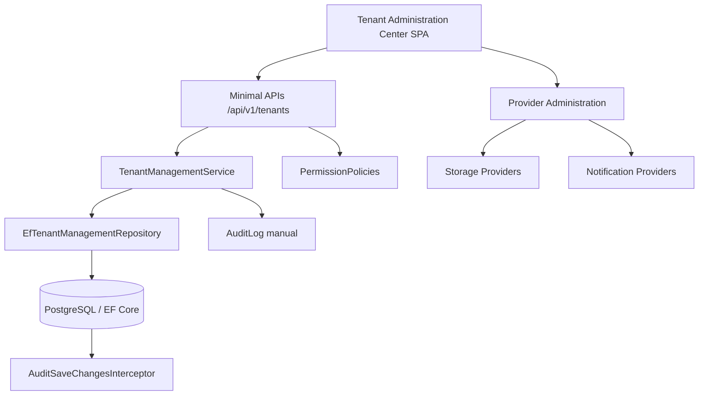
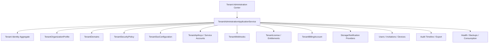

# Compliance 360 - Tenant Administration Center Final Enterprise Audit

Fecha: 2026-06-25  
Modo: solo lectura sobre codigo de producto.  
Rol de auditoria: Software Architect Senior, SaaS Multitenant Enterprise.  
Veredicto: **NO GO para produccion Enterprise completa**.  
Score global objetivo: **72/100**.

## Resumen Ejecutivo

El Tenant Administration Center es una mejora importante frente al antiguo Tenant Management. Ya existe una consola visible, dashboard, tabs, endpoints para informacion general, branding, seguridad, suscripcion, lifecycle y timeline. Sin embargo, **no permite administrar un tenant Enterprise de principio a fin** al nivel de Microsoft 365 Admin Center, Azure Portal, Salesforce Setup, ServiceNow, Atlassian Admin, AWS Organizations o Google Workspace Admin.

La razon principal no es cosmetica. El modulo todavia no modela ni opera capacidades SaaS criticas: dominios, subdominios, aliases, SSO/OIDC/SAML, LDAP/Active Directory, API keys, webhooks, billing real, renovaciones, entitlements, feature flags, administracion completa de usuarios/invitaciones/dispositivos, backup policy, usuarios conectados y export real de auditoria. Varias pestañas del frontend son resumen, redireccion o roadmap, no administracion funcional.

Conclusion: **GO parcial para administracion basica de tenant y demo comercial controlada. NO GO para produccion Enterprise completa con clientes reales**.

## Arquitectura Actual



El modulo actual administra directamente:

- Tenant profile: razon social, nombre comercial, tax id, direccion parcial, contacto, moneda, pais, industria, descripcion.
- Tenant settings: culture, language, timezone, MFA, retencion, session timeout, password expiration, lockout, IP whitelist, trusted devices, security score.
- Branding: display name, logo, favicon, colores, theme, login background, corporate email, footer.
- Subscription basica: plan, status, max users, max storage, expires on.
- Lifecycle: draft, trial, active, suspended, archived, restore.
- Dashboard metrics: usuarios, roles, documentos, proveedores, auditorias, CAPA, riesgos, indicadores, notificaciones, storage, providers, ultimo login.
- Timeline parcial: audit logs de categoria TenantManagement.

## Arquitectura Ideal



Recomendacion de arquitectura: mantener `Tenant` como identidad/lifecycle, pero crear subdominios o agregados tenant-scoped para dominios, seguridad, SSO, API keys, webhooks, licenciamiento, billing, usuarios/invitaciones/dispositivos y politicas operativas. El centro debe actuar como orquestador application-level, no como agregado gigante.

## Evidencias Clave

### Modelo Tenant Actual

El agregado `Tenant` ya contiene perfil empresarial y lifecycle, pero no contiene dominios, subdominios, aliases, SSO, API keys, webhooks, billing ni backup policy.

```csharp
public sealed class Tenant : Entity
{
    private readonly List<Company> _companies = [];
    public string Name { get; private set; }
    public string Slug { get; private set; }
    public string LegalName { get; private set; }
    public string CommercialName { get; private set; }
    public string TaxIdentifier { get; private set; }
    public TenantSettings Settings { get; private set; }
    public TenantBranding Branding { get; private set; }
    public Subscription Subscription { get; private set; }
}
```

Evidencia: `src/Compliance360.Domain/TenantManagement/TenantManagementModels.cs`.

### Slug Tiene Metodo De Dominio Pero No Flujo Real

Existe `ChangeSlug`, pero no hay comando, endpoint ni UI para cambiar slug con workflow especial.

```csharp
public void ChangeSlug(string slug)
{
    Slug = Guard.AgainstNullOrWhiteSpace(slug, nameof(slug), 80).ToLowerInvariant();
    MarkUpdated(DateTimeOffset.UtcNow);
}
```

Impacto: el prompt exige slug, subdominio, dominio principal, dominios secundarios y aliases administrables. Solo slug existe en dominio; no esta expuesto como administracion real.

### APIs Tenant Disponibles

```csharp
tenants.MapGet("/", ...)
tenants.MapPost("/", ...)
tenants.MapGet("/{tenantId:guid}", ...)
tenants.MapGet("/{tenantId:guid}/administration-dashboard", ...)
tenants.MapPut("/{tenantId:guid}/general-information", ...)
tenants.MapPut("/{tenantId:guid}/security", ...)
tenants.MapPut("/{tenantId:guid}/branding", ...)
tenants.MapPut("/{tenantId:guid}/subscription", ...)
tenants.MapGet("/{tenantId:guid}/audit-timeline", ...)
```

Evidencia: `src/Compliance360.Web/Api/FoundationEndpoints.cs`.

Faltan APIs REST para dominios, aliases, SSO, API keys, webhooks, billing, renovacion, usuarios/invitaciones, dispositivos, backup y export de auditoria.

### Integraciones Son Roadmap En UI

```javascript
function tenantIntegrationsPanel() {
  const rows = ["API Keys", "OAuth", "Webhooks", "ERP", "CRM", "SSO", "LDAP", "Active Directory"]
    .map(item => ({ integration: item, status: item === "OAuth" ? "Planned" : "Roadmap", permission: "TENANT.INTEGRATIONS" }));
}
```

Evidencia: `src/Compliance360.Web/wwwroot/app.js`.

Impacto: el Tenant Administration Center muestra integraciones, pero no las administra.

### Dashboard Tiene Health Y Backup Simulados

```csharp
return new TenantAdministrationMetrics(
    users,
    activeUsers,
    roles,
    storageBytes,
    documents,
    suppliers,
    audits,
    capas,
    risks,
    indicators,
    notifications,
    storageProviders,
    notificationProviders,
    lastLogin,
    LastBackupAtUtc: null,
    Health: true);
```

Evidencia: `src/Compliance360.Infrastructure/TenantManagement/EfTenantManagementRepository.cs`.

Impacto: `Health=true` y `LastBackupAtUtc=null` no son medicion operativa real.

### Auditoria Automatica Existe Pero Categoria Puede Ser Generica

```csharp
var action = entry.State switch
{
    EntityState.Added => AuditAction.Created,
    EntityState.Modified => AuditAction.Updated,
    EntityState.Deleted => AuditAction.Deleted,
};

var auditEvent = new AuditEvent(
    entry.Metadata.ClrType.Name,
    entity.Id,
    action,
    AuditLog.InferCategory(action),
    context with { TenantId = tenantId },
    new AuditSnapshot(...),
    new AuditMetadata("{\"source\":\"ef-interceptor\"}"),
    Success: true,
    ErrorMessage: null);
```

Evidencia: `src/Compliance360.Infrastructure/Audit/AuditSaveChangesInterceptor.cs`.

Impacto: los snapshots before/after existen, pero las actualizaciones genericas caen como `Updated` y pueden no entrar en timeline tenant si se filtra solo `TenantManagement`.

### Middleware De Auditoria Antes De Authentication

```csharp
app.UseMiddleware<AuditContextMiddleware>();
app.UseAuthentication();
app.UseMiddleware<ObservabilityMiddleware>();
app.UseAuthorization();
```

Evidencia: `src/Compliance360.Web/Program.cs`.

Impacto: el contexto de auditoria puede no tener claims autenticados completos al capturarse.

## Hallazgos P0 - Bloqueantes Para Produccion Enterprise

| ID | Hallazgo | Evidencia | Impacto | Recomendacion |
|---|---|---|---|---|
| P0-01 | No existe gestion real de dominios, subdominios ni aliases | No hay entidades/API; solo `Slug` en `Tenant` | Bloquea onboarding SaaS real, URLs corporativas, branding DNS y soporte | Crear `TenantDomain`, validacion DNS, primary/secondary, verification tokens y endpoint/UI |
| P0-02 | No existe SSO/OIDC/SAML/LDAP/AD funcional por tenant | Busqueda solo encuentra labels roadmap en `app.js` | Bloquea clientes Enterprise con identidad corporativa | Crear `TenantSsoConfiguration`, metadata, cert rotation, JIT/SCIM, mappings |
| P0-03 | No existen API keys, service accounts ni webhooks | Integraciones UI marca Roadmap | Bloquea integraciones B2B y automatizacion | Crear `TenantApiKey`, `TenantWebhook`, secretos cifrados y rotacion |
| P0-04 | Billing/licencia no es enterprise | `Subscription` solo plan/status/max users/max storage/expires | Riesgo comercial/legal por contratos, renovaciones, entitlements | Crear `TenantLicense`, `Entitlement`, `BillingAccount`, periodos, renovacion |
| P0-05 | Usuarios/invitaciones/dispositivos no se administran desde el centro | Identity service no tiene create/invite/disable user; UI users tab es resumen | Bloquea administracion operativa del cliente | Crear modulo Tenant User Administration con invitaciones, disable, MFA reset, devices |
| P0-06 | Auditoria no garantiza before/after/correlation en timeline tenant | Interceptor usa `Updated` generico; middleware antes de auth | Riesgo legal/auditoria: timeline incompleto | Reordenar middleware, emitir eventos `TenantChanged` con snapshots y motivo |
| P0-07 | Health y backups son placeholders | `Health: true`, `LastBackupAtUtc: null` | Riesgo de soporte y promesas falsas en consola | Integrar health real, backup jobs, RPO/RTO y ultimo backup |

## Hallazgos P1 - Altos

| ID | Hallazgo | Impacto | Recomendacion |
|---|---|---|---|
| P1-01 | `TenantSettings` mezcla regionalizacion, retencion y seguridad | Agregado poco cohesivo | Separar `TenantRegionalSettings`, `TenantSecurityPolicy`, `TenantRetentionPolicy` |
| P1-02 | Falta value objects para email, URL, colores, pais, moneda, timezone, CIDR | Validaciones debiles y duplicadas | Crear value objects y validadores compartidos |
| P1-03 | `CreatedByUserId` no tiene FK ni indice | Integridad debil | Agregar FK opcional a users o snapshot de actor immutable |
| P1-04 | `TenantStorage`, `TenantNotifications`, `TenantUsers`, `TenantRoles` existen pero no protegen route groups reales | Matriz de permisos inconsistente | Alinear Storage/RBAC/Notifications con permisos tenant o documentar separacion |
| P1-05 | `TenantRead` acepta casi cualquier permiso tenant | READ demasiado amplio | Separar read estricto y admin implicit read de forma auditable |
| P1-06 | No hay cliente-side validation equivalente al dominio | UX pobre y errores tardios | Agregar required/maxlength/pattern/min/max y mensajes por campo |
| P1-07 | No hay DELETE REST ni PATCH | REST incompleto | Definir estrategia REST: PATCH parcial, DELETE soft archive, POST actions solo para workflows |

## Hallazgos P2 - Medios

| ID | Hallazgo | Impacto | Recomendacion |
|---|---|---|---|
| P2-01 | Storage y Notifications son delegados a Provider Administration, no inline | Experiencia fragmentada | Embeber management real o deep links con contexto |
| P2-02 | Audit export copia snapshot de tenant, no exporta timeline | Funcion "Exportar" no cumple expectativa | Export CSV/XLSX/PDF desde backend |
| P2-03 | No hay consumo de features/modulos habilitados | Licenciamiento no controla producto | Feature gates por tenant |
| P2-04 | No hay usuarios conectados/sesiones activas en dashboard | Operacion incompleta | Metrica desde `UserSessions` activas |
| P2-05 | No hay constraints DB para email/url/color/currency/country | Datos invalidos posibles | Check constraints o value converters |

## Hallazgos P3 - Mejoras

| ID | Hallazgo | Recomendacion |
|---|---|---|
| P3-01 | Score de seguridad es input manual | Calcular score desde politicas reales |
| P3-02 | No hay wizard de onboarding tenant | Crear wizard para consultoras y soporte |
| P3-03 | No hay comparador de cambios visual por campo | Agregar diff viewer en audit timeline |
| P3-04 | No hay contratos OpenAPI documentados por seccion | Enriquecer Swagger por Tenant Admin |

## Matriz CRUD Funcional

| Area | List | Detail | Create | Update | Delete/Archive | Restore | Estado |
|---|---:|---:|---:|---:|---:|---:|---|
| Tenant core | Si | Si | Si | Parcial | Archive via POST | Si | Parcial |
| Informacion general | N/A | Si | En create parcial | Si | No | No | Parcial |
| Slug | Si en create | Si | Si | No expuesto | No | No | Gap |
| Dominios/subdominios/aliases | No | No | No | No | No | No | Gap critico |
| Branding | No list | Si | Default | Si | No | No | Parcial |
| Seguridad tenant | No list | Si | Default | Si | No | No | Parcial |
| Usuarios | Metrica | No | No | No | No | No | Gap critico |
| Roles/permisos | Via RBAC | Parcial | Si | Parcial | No claro | No | Fuera del centro |
| Licencia/suscripcion | No historial | Si | Default | Parcial | No | No | Parcial |
| Billing/renovacion | No | No | No | No | No | No | Gap critico |
| Storage providers | Si fuera del centro | Si fuera | Si fuera | Si fuera | Disable fuera | No | Delegado |
| Notification providers | Si fuera | Parcial | Parcial | Parcial | No claro | No | Delegado |
| API keys | No | No | No | No | No | No | Gap critico |
| Webhooks | No | No | No | No | No | No | Gap critico |
| SSO/OIDC/SAML/LDAP/AD | No | No | No | No | No | No | Gap critico |
| Audit timeline | Si | Si | Auto | No | No | No | Parcial |
| Export audit | No real | No | No | No | No | No | Gap |

## Matriz De Campos De Informacion General

| Campo | Dominio | DB | DTO/API | Servicio | Frontend | Editable real |
|---|---:|---:|---:|---:|---:|---:|
| Razon social | Si | Si | Si | Si | Si | Si |
| Nombre comercial | Si | Si | Si | Si | Si | Si |
| RUC/Tax ID | Si | Si unique | Si | Si | Si | Si |
| Direccion | Si | Si | Si | Si | Si | Si |
| Ciudad | Si | Si | Si | Si | Si | Si |
| Provincia/Estado | Si | Si | Si | Si | Si | Si |
| Pais | Si | Si | Si | Si | Si | Si |
| Codigo postal | Si | Si | Si | Si | Si | Si |
| Email | Si | Si | Si | Si | Si | Si, sin formato fuerte |
| Telefono | Si | Si | Si | Si | Si | Si |
| Website | Si | Si | Si | Si | Si | Si, sin formato fuerte |
| Zona horaria | Si en settings | Si | Si settings | Si | No en general tab | Parcial |
| Idioma | Si en settings | Si | No directo salvo culture | Parcial | No en UI TAC | Parcial |
| Moneda | Si | Si | Si | Si | Si | Si |
| Industria | Si | Si | Si | Si | Si | Si |
| Descripcion | Si | Si | Si | Si | Si | Si |
| Logo | Si branding | Si | Si | Si | Si | Si |
| Favicon | Si | Si | Si | Si | Si | Si |
| Tema | Si | Si | Si | Si | Si | Si |
| Colores | Si | Si | Si | Si | Si | Si, sin validador color |
| Footer | Si | Si | Si | Si | Si | Si |
| Correo corporativo | Si branding | Si | Si | Si | Si | Si |
| Dominio principal | No | No | No | No | No | No |
| Dominios secundarios | No | No | No | No | No | No |
| Subdominio | No | No | No | No | No | No |
| Slug | Si | Si | Create only | No update command | No | No normal |
| Alias | No | No | No | No | No | No |

## Matriz De Seguridad

| Capacidad | Configurable por tenant | Evidencia | Veredicto |
|---|---:|---|---|
| MFA requerido | Si | `ConfigureTenantSecurityCommand.RequireMfa` | Parcial |
| Password expiration | Si | `PasswordExpirationDays` | Parcial, no probado contra policy real |
| Lockout | Si | `LockoutMaxFailedAttempts`, `LockoutMinutes` | Parcial |
| Trusted devices | Si flag | `TrustedDevicesEnabled` | Parcial, falta entidad/dispositivos |
| Session timeout | Si | `SessionTimeoutMinutes` | Parcial, falta enforcement probado |
| Session lifetime | No claro | JWT options globales | Gap |
| Allowed IP/IP whitelist | Si string | `IpWhitelist` | Parcial, falta CIDR VO/enforcement probado |
| API Keys | No | Solo roadmap UI | Gap critico |
| OAuth/OIDC/SAML | No | Solo roadmap UI | Gap critico |
| LDAP/AD | No | Solo roadmap UI | Gap critico |
| Secrets por tenant | Parcial storage settings JSON | Sin vault/rotation tenant admin | Gap |
| JWT | Global | `JwtOptions` | No tenant-specific |
| Refresh tokens | Si global identity | No tenant admin UI | Parcial |
| CORS | Global config | `appsettings` | No tenant-specific |
| Headers | Global | Security middleware | No tenant-specific |
| CSRF/cookies | No evidente | JWT SPA | Revisar en hardening |

## Matriz De Suscripcion

| Capacidad | Estado |
|---|---|
| Plan | Editable |
| Estado licencia | Editable |
| Trial/Active/Suspended/Archived/Restore | Tenant lifecycle, no billing lifecycle completo |
| Fecha inicio | No modelada |
| Fecha fin | `ExpiresOn` parcial |
| Seats contratados | `MaxUsers` |
| Usuarios usados | Metrica calculada |
| Storage usado | Metrica calculada |
| Storage maximo | `MaxStorageGb` |
| Features | No |
| Modulos habilitados | No |
| Limites avanzados | No |
| Licencia contractual | No |
| Facturacion | No |
| Renovacion | No |
| Periodo | No |
| Historial de consumo | No |

## Matriz De APIs

| Requisito REST | Existe | Observacion |
|---|---:|---|
| GET list/search | Si | `/api/v1/tenants` |
| GET detail | Si | `/api/v1/tenants/{tenantId}` |
| POST create | Si | `/api/v1/tenants` |
| PUT full sections | Si | general/security/branding/subscription |
| PATCH partial | No | Gap REST |
| DELETE | No | Archive via POST |
| Status actions | Si | POST actions |
| Restore | Si | POST restore |
| Dashboard | Si | `/administration-dashboard` |
| Timeline | Si | `/audit-timeline` |
| Audit search/export | Parcial | global audit exists, no TAC export |
| Domains | No | Gap |
| SSO | No | Gap |
| API Keys | No | Gap |
| Webhooks | No | Gap |
| Billing | No | Gap |
| Users admin | No | Gap |

## Matriz De Base De Datos

| Area | Estado | Observacion |
|---|---|---|
| Tenant slug unique | Si | `Slug` unique |
| Tenant tax id unique | Si | `IX_tenants_TaxIdentifier` |
| Required profile fields | Parcial | varios defaults vacios y backfill posterior |
| FK settings/branding/subscription | Si one-to-one | TenantId unique |
| FK CreatedByUserId | No | Sin integridad |
| Check constraints email/url/color | No | Datos invalidos posibles |
| Country/currency constraints | No | Solo max length |
| Soft delete | Parcial | `Archived` status, no deleted metadata |
| Cascade | Parcial | children required; revisar impacto legal |
| Backfill | Si | migration actualiza defaults |
| Tenant domains table | No | Gap |
| SSO/API/webhook tables | No | Gap |
| Billing/license tables | No | Gap |

## Simulacion De Casos Reales

| Caso | Resultado esperado | Estado real |
|---|---|---|
| Consultora crea tenant | Crear tenant con perfil minimo | Funciona parcialmente |
| Corrige RUC | Update general info | Funciona |
| Cambia razon social | Update general info | Funciona |
| Cambia dominio principal | Administrar dominio y verificar DNS | No existe |
| Cambia subdominio/alias | Administrar rutas/aliases | No existe |
| Actualiza branding | Branding endpoint/UI | Funciona |
| Cambia SMTP | Provider admin externo | Parcial/delegado |
| Cambia Storage | Provider admin externo | Parcial/delegado |
| Actualiza licencia | Subscription parcial | Parcial |
| Activa MFA | Security endpoint | Parcial |
| Suspende | Lifecycle | Funciona |
| Restaura | Lifecycle | Funciona hacia Suspended |
| Archiva | Lifecycle | Funciona |
| Reactiva | Active desde non-archived | Parcial |
| Renueva | Billing/periodo/renovacion | No existe |

## Benchmark Enterprise

| Plataforma | Capacidades esperadas | Estado Compliance 360 |
|---|---|---|
| Microsoft 365 Admin Center | dominios, usuarios, licencias, grupos, security, billing, audit, service health | Falta dominios, usuarios admin completo, billing, service health real |
| Azure Portal | RBAC granular, subscriptions, resource health, activity log, policy, key vault | Falta policy/entitlements, health real, secret vault tenant |
| Salesforce Setup | SSO, connected apps, domains, profiles, permission sets, audit setup | Falta SSO, connected apps, domains, permission set admin |
| ServiceNow | instance config, integrations, MID/LDAP, audit, update sets | Falta integraciones reales y configuracion avanzada |
| Atlassian Admin | org domains, SSO, SCIM, user provisioning, audit, product access | Falta SCIM/provisioning, product access |
| AWS Organizations | accounts, SCP, billing, IAM, access keys, CloudTrail | Falta organizaciones/billing/policies/API keys auditables |
| Google Workspace Admin | domains, users, groups, devices, security, apps, audit | Falta dominios, grupos, dispositivos, apps, SSO |

## Riesgos

| Riesgo | Severidad | Descripcion |
|---|---|---|
| Comercial | Alta | Ventas Enterprise pueden prometer dominios, SSO, billing o API keys que no existen |
| Legal/fiscal | Alta | Tax ID existe, pero billing/contratos/licencias no estan modelados |
| Seguridad | Alta | SSO/API keys/secrets/tenant session enforcement no estan completos |
| SaaS | Alta | Sin dominios, provisioning, entitlements ni health real no es admin center completo |
| Multitenant | Media | SuperAdmin bypass global requiere monitoreo estricto |
| Auditoria | Alta | Timeline puede no contener snapshots completos ni contexto autenticado |
| Soporte | Media | Health/backup placeholders dificultan soporte real |
| Escalabilidad | Media | Dashboard hace multiples counts; aceptable inicial, optimizar con read model si crece |

## Score Por Categoria

| Categoria | Score |
|---|---:|
| Dominio / DDD | 70 |
| Informacion general | 78 |
| Seguridad | 62 |
| Suscripcion / billing | 48 |
| Integraciones | 30 |
| Administracion operativa | 68 |
| Permisos | 72 |
| Auditoria | 66 |
| Base de datos | 74 |
| Frontend / UX | 76 |
| APIs | 72 |
| Benchmark enterprise | 50 |

Score global ponderado: **72/100**.

## Roadmap Priorizado

### P0 - Antes De Produccion Enterprise

1. Implementar `TenantDomain` con dominio principal, secundarios, subdominio, aliases, estado de verificacion DNS y certificados.
2. Implementar `TenantSsoConfiguration` para OIDC/SAML, certificados, metadata, claims mapping y JIT/SCIM.
3. Implementar `TenantApiKey` y `TenantWebhook` con secretos cifrados, rotacion, scopes, expiracion y auditoria.
4. Crear `TenantLicense`, `TenantEntitlement`, `BillingAccount`, renovacion, periodo, features y limites.
5. Crear administracion completa de usuarios: invite, create, disable, reset MFA, unlock, devices, sessions, last access.
6. Corregir auditoria: middleware despues de authentication, snapshots categorizados como TenantManagement, motivo obligatorio para campos sensibles.
7. Reemplazar `Health=true` y `LastBackupAtUtc=null` con health/backups reales.

### P1 - Hardening Enterprise

1. Separar `TenantSettings` en regional/security/retention policies.
2. Agregar value objects para email, URL, color, country, currency, timezone, CIDR.
3. Agregar FK/index para `CreatedByUserId` o actor snapshot inmutable.
4. Alinear permisos `TENANT.STORAGE`, `TENANT.NOTIFICATIONS`, `TENANT.USERS`, `TENANT.ROLES` con route groups reales.
5. Implementar PATCH y DELETE REST controlado.
6. Agregar validacion frontend completa.

### P2 - Operacion Y UX

1. Integrar Provider Administration dentro del TAC o con deep links contextuales.
2. Exportar audit timeline a CSV/XLSX/PDF desde backend.
3. Agregar usuarios conectados, sesiones activas, consumo historico y alertas reales.
4. Agregar wizard de onboarding tenant.
5. Agregar feature gates por modulo.

### P3 - Producto Comercial

1. Comparador visual before/after por campo.
2. Plantillas de onboarding por industria.
3. Score de seguridad calculado automaticamente.
4. Documentacion OpenAPI por seccion de Tenant Admin.

## Veredicto Final

**NO GO para produccion Enterprise completa.**

El modulo puede ser usado como base de administracion tenant y como demo funcional de alto nivel. Pero no cumple todavia el estandar de un Tenant Administration Center comparable con Microsoft 365 Admin Center, Salesforce Setup, ServiceNow, Atlassian Admin, AWS Organizations o Google Workspace Admin.

La proxima fase debe enfocarse en los P0: dominios, SSO, API keys, webhooks, billing/licensing, user administration completa, auditoria completa y health/backups reales. Hasta completar esos puntos, la recomendacion arquitectonica es **no venderlo como administracion Enterprise completa**, sino como **Tenant Administration Core en evolucion**.
