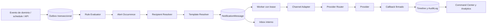

# 01 — Alert Center Enterprise: arquitectura de producto

**Estado:** Design Baseline v1  
**Fecha:** 2026-07-19  
**Producto:** Compliance 360 Alert Center  
**Principio de compatibilidad:** evolución aditiva sobre Notifications, Regulatory, Workflow, Audit y RBAC existentes.

## 1. Visión del producto

Alert Center es el centro operativo y de gobierno que convierte eventos de cualquier módulo en alertas accionables, entregas multicanal, escalaciones, evidencia y analítica.

No es un módulo de correo. Sus capacidades son:

1. Capturar eventos transaccionales, temporales, de integración, seguridad y operación.
2. Evaluar reglas no-code versionadas.
3. Resolver audiencias dinámicas.
4. Aplicar preferencias, consentimientos, quiet hours, dedupe y throttling.
5. Renderizar plantillas aprobadas por canal, idioma y marca.
6. Entregar de forma asíncrona, idempotente y observable.
7. Administrar alertas, SLA, escalaciones, inbox, retry y dead letters.
8. Conservar evidencia reproducible desde el evento hasta la lectura o resolución.

Flujo canónico:



## 2. Principios no negociables

- Todo recurso funcional es tenant-scoped, salvo catálogos explícitamente globales.
- Las APIs y políticas del servidor son la autoridad; ocultar botones no concede seguridad.
- Una alerta, un mensaje, un intento, una entrega y una lectura son conceptos separados.
- Las configuraciones publicadas son inmutables y versionadas.
- Maker-checker y segregación de funciones se aplican por recurso.
- Ningún usuario introduce SQL, C#, JavaScript o expresiones sin sandbox.
- Los efectos laterales son asíncronos y utilizan outbox, leases e idempotencia.
- Los secretos son write-only y se protegen mediante vault/envelope encryption.
- No se elimina evidencia utilizada; se retira, archiva o redacta bajo política.
- Las APIs V1 y tablas `notification_*` se preservan mediante una anti-corruption layer.
- La operación externa es at-least-once; no se promete exactly-once cuando el proveedor no lo garantiza.
- Toda acción privilegiada exige motivo, correlation ID y auditoría.

## 3. Bounded contexts

1. **Alert Signals:** contratos de eventos de Regulatory, Workflow, Documents, CAPA, Risk, Audit, Suppliers, Indicators, Identity e integraciones.
2. **Alert Policy:** definiciones, versiones, AST, dedupe, throttling, quiet hours y suppressions.
3. **Alert Lifecycle:** occurrences, ownership, acknowledge, snooze, resolve, close y reopen.
4. **Audience & Routing:** usuarios, roles, grupos, departamentos, owner, manager, on-call, preferencias y consentimientos.
5. **Template Center:** contenido versionado, locales, branding, aprobación y render seguro.
6. **Delivery:** evolución de Notifications; messages, providers, attempts, retry, callbacks y DLQ.
7. **Scheduler & SLA:** schedules, calendarios, digests, timers y escalamiento.
8. **User Inbox:** proyección personal y de equipo.
9. **Compliance Ledger:** AuditLog y timelines inmutables.
10. **Insights:** rollups, dashboards, reportes, exports y SLO.

## 4. Navegación

Elemento raíz único: **Alert Center**.

```text
Alert Center
├── Command Center
├── Mi Inbox
├── Inbox de Equipo
├── Alertas
├── Operaciones
│   ├── Cola
│   ├── Historial de Mensajes
│   ├── Dead Letters
│   └── Retry Center
├── Diseño
│   ├── Eventos
│   ├── Reglas
│   ├── Plantillas
│   ├── Variables
│   ├── Destinatarios
│   ├── SLA y Escalamientos
│   └── Programaciones
├── Canales y Proveedores
├── Analítica y Reportes
├── Auditoría
└── Administración
```

Rutas principales:

- `#/alert-center/dashboard`
- `#/alert-center/inbox`
- `#/alert-center/team-inbox`
- `#/alert-center/alerts`
- `#/alert-center/operations/queue`
- `#/alert-center/operations/history`
- `#/alert-center/operations/dead-letters`
- `#/alert-center/operations/retry`
- `#/alert-center/events`
- `#/alert-center/rules`
- `#/alert-center/templates`
- `#/alert-center/variables`
- `#/alert-center/audiences`
- `#/alert-center/sla`
- `#/alert-center/schedules`
- `#/alert-center/channels`
- `#/alert-center/providers`
- `#/alert-center/analytics`
- `#/alert-center/audit`
- `#/alert-center/admin`
- `#/platform/alert-center`

## 5. Contrato UX transversal

Todas las superficies de lista incluyen:

- filtros serializados en URL;
- búsqueda con debounce;
- orden server-side estable;
- paginación cursor-based;
- selector y reordenamiento de columnas;
- densidad, columnas congeladas y vistas guardadas;
- favoritos privados o compartidos;
- export asíncrono según permisos;
- refresco manual y timestamp de actualización;
- estados loading, vacío inicial, vacío por filtros, 403, 404, 409, timeout, parcial y error correlacionado;
- ayuda contextual y tooltips para fórmulas, estados y consecuencias;
- responsive desktop/tablet/móvil;
- dark mode con tokens semánticos;
- WCAG 2.2 AA, teclado, foco visible, `aria-live`, labels y alternativa tabular para gráficos.

Acciones masivas:

1. selección explícita o “todos los resultados”;
2. preview y recuento;
3. impacto, exclusiones y warnings;
4. motivo obligatorio;
5. confirmación;
6. job asíncrono;
7. resultado descargable y auditado.

## 6. Inventario de módulos y pantallas

### 6.1 Experiencia personal

| # | Pantalla | Propósito | Acciones principales |
|---:|---|---|---|
| 1 | Campana global | Acceso inmediato a no leídas, críticas y menciones | Abrir, leer, acknowledge, snooze |
| 2 | Mi Inbox | Bandeja personal completa | Leer/no leer, archivar, fijar, confirmar, resolver |
| 3 | Detalle de alerta | Contexto, SLA, timeline y acciones | Asumir, delegar, comentar, resolver, reabrir |
| 4 | Preferencias personales | Canales, idioma, digest y quiet hours | Habilitar, verificar, restaurar defaults |
| 5 | Inbox de equipo | Supervisión de alertas compartidas | Asignar, reasignar, escalar, recordar |

### 6.2 Operación

| # | Pantalla | Propósito | Acciones principales |
|---:|---|---|---|
| 6 | Command Center | Salud tenant y métricas operativas | Drill-down, crear vista, abrir incidente |
| 7 | Cola en vivo | Mensajes queued/leased/retry | Cancelar, retry, liberar lease, priorizar |
| 8 | Historial de mensajes | Buscar cualquier intención de entrega | Ver, cancelar, retry, resend-as-new |
| 9 | Detalle de mensaje | Timeline evento→regla→provider→callback | Export evidence, retry, cancel, resend |
| 10 | Compositor manual | Envío controlado individual/grupal | Wizard, preview, aprobación, schedule |
| 11 | Campañas | Comunicaciones masivas reguladas | Crear, aprobar, pausar, cancelar |
| 12 | Dead-letter queue | Triage de mensajes agotados | Asignar, reparar, requeue, descartar |
| 13 | Remediación DLQ | Diagnóstico y corrección controlada | Cambiar campos reparables, diff, requeue |

### 6.3 Reglas y automatización

| # | Pantalla | Propósito | Acciones principales |
|---:|---|---|---|
| 14 | Catálogo de reglas | Administrar reglas y versiones | Crear, clonar, comparar, activar, retirar |
| 15 | Wizard de regla | Crear automatización no-code | Evento, AST, audiencia, canales, SLA, simular |
| 16 | Detalle/versiones | Gobierno y telemetría por versión | Editar nueva versión, aprobar, rollback |
| 17 | Simulador | “Qué habría ocurrido” sin side effects | Replay, compare, export |
| 18 | Catálogo de eventos | Eventos, schemas y variables | Versionar, deprecar, probar muestra |
| 19 | Schedules/calendarios | Recurrencia, DST y business time | Crear, pausar, run-now, recalcular |
| 20 | Políticas de escalación | Niveles, destinatarios y timers | Versionar, aprobar, simular |
| 21 | Dedupe/throttling/quiet hours | Control de fatiga | Crear, simular, activar |

### 6.4 Plantillas

| # | Pantalla | Propósito | Acciones principales |
|---:|---|---|---|
| 22 | Biblioteca | Catálogo multicanal/multidioma | Crear, clonar, traducir, retirar |
| 23 | Editor | Contenido visual/HTML/text seguro | Insertar variables, validar, autosave |
| 24 | Preview/test | Render por canal/locale/dispositivo | Comparar, enviar a allowlist |
| 25 | Versiones/aprobación | Maker-checker y firma | Diff, comentar, aprobar, rollback |
| 26 | Branding/bloques/layouts | Componentes reutilizables | Crear, versionar, deprecar |

### 6.5 Audiencias

| # | Pantalla | Propósito | Acciones principales |
|---:|---|---|---|
| 27 | Catálogo de audiencias | Grupos estáticos/dinámicos | Crear, refrescar, congelar, retirar |
| 28 | Builder de audiencia | Resolver users/roles/groups/owner | Condiciones, exclusiones, preview |
| 29 | Simulador de destinatarios | Explicar inclusión/exclusión | Comparar, abrir preferencias |
| 30 | Preferencias/suscripciones admin | Defaults y categorías | Configurar, migrar |
| 31 | Consentimientos/suppressions | Opt-out, bounce, complaint, legal | Importar, añadir, retirar, investigar |

### 6.6 Canales y proveedores

| # | Pantalla | Propósito | Acciones principales |
|---:|---|---|---|
| 32 | Resumen de canales | Disponibilidad, volumen y coste | Pausar, test, abrir configuración |
| 33 | Catálogo de proveedores | Configuración efectiva tenant-scoped | Crear, clonar, enable/disable, retire |
| 34 | Wizard/detalle provider | Endpoint, identidad, vault y test | Configurar, rotar, aprobar, activar |
| 35 | Routing/failover | Prioridad, peso, residencia y circuit breaker | Ordenar, simular, activar |
| 36 | Dominios/remitentes | DKIM/SPF/DMARC, números y push apps | Verificar, rotar, retirar |
| 37 | Callbacks | Delivery/bounce/complaint y replay | Inspeccionar, reprocesar, rotar secret |

### 6.7 Analítica y cumplimiento

| # | Pantalla | Propósito | Acciones principales |
|---:|---|---|---|
| 38 | Analítica de entrega | Sent/delivered/read/ack y latencia | Drill-down, comparar, programar |
| 39 | Efectividad/fatiga | Acción, ruido, supresión y opt-out | Abrir regla, recomendar revisión |
| 40 | SLA/SLO/capacidad | Objetivos, burn rate y saturación | Incidente, alerta operacional |
| 41 | Audit Trail | Evidencia inmutable y diffs | Verificar, export firmado |
| 42 | Exportaciones/evidence packs | Jobs asíncronos | Descargar, cancelar, regenerar |

### 6.8 Backoffice tenant

| # | Pantalla | Propósito | Acciones principales |
|---:|---|---|---|
| 43 | Configuración/catálogos | Valores funcionales sin código | Versionar, traducir, importar, deprecar |
| 44 | Retención/privacidad/legal hold | Lifecycle de datos | Simular purge, hold, aprobar |
| 45 | Roles/permisos/SoD | Gobierno de accesos | Asignar, revocar, resolver conflictos |
| 46 | Promoción ambientes | Dev→Test→UAT→Prod | Validar, diff, aprobar, promover, rollback |
| 47 | Integraciones/API/service accounts | Productores y consumidores | Registrar, scope, rotate, test |
| 48 | Salud tenant | Worker/outbox/scheduler/provider | Probe, traces, incidente |

### 6.9 Backoffice plataforma

| # | Pantalla | Propósito | Acciones principales |
|---:|---|---|---|
| 49 | Fleet Command Center | Salud agregada sin contenido tenant | Incident, soporte JIT |
| 50 | Límites por tenant | Flags, cuotas y residencia | Override temporal, rings |
| 51 | Providers/incidentes compartidos | Blast radius y failover global | Circuit-break, comunicar, postmortem |

## 7. Botones y acciones normalizadas

Acciones de lectura:

- Ver detalle
- Abrir entidad
- Abrir en nueva vista
- Copiar ID/correlation ID
- Guardar vista
- Añadir/quitar favorito
- Exportar
- Actualizar

Acciones de lifecycle:

- Crear
- Guardar borrador
- Clonar
- Enviar a revisión
- Solicitar cambios
- Rechazar
- Aprobar
- Publicar
- Programar
- Activar
- Pausar
- Deshabilitar
- Rollback
- Retirar

Acciones runtime:

- Acknowledge
- Asumir
- Asignar/Reasignar
- Snooze
- Escalar
- Resolver
- Cerrar
- Reabrir
- Cancelar
- Retry
- Resend as new
- Requeue
- Descartar
- Suprimir dirección

Acciones técnicas:

- Simular
- Probar conexión
- Enviar prueba
- Ejecutar ahora
- Liberar lease
- Reprocesar callback
- Rotar secreto
- Verificar firma
- Crear evidence pack

Todo botón declara:

- permiso;
- estados donde es válido;
- confirmación/motivo;
- nivel de riesgo;
- endpoint idempotente;
- evento de auditoría;
- feedback de éxito/error;
- etiqueta y descripción accesibles.

## 8. Roles de producto

| Rol | Responsabilidad | Restricciones |
|---|---|---|
| Alert Viewer | Lectura operativa autorizada | Sin mutaciones |
| End User | Inbox propio y acciones de negocio | Sin configuración |
| Team Supervisor | Inbox de equipo, assignment y SLA | Alcance organizativo |
| Alert Operator | Cola, retry, cancelación y DLQ | No edita reglas/templates |
| Functional Designer | Eventos/reglas/audiencias | No aprueba lo propio |
| Template Designer | Contenido y locales | Sin providers/secrets |
| Compliance Reviewer | Revisión regulada | No modifica contenido |
| Alert Approver | Aprueba versiones | Independiente del maker |
| Publisher | Publica artefactos aprobados | No crea/aprueba |
| Production Activator | Activa/rollback en producción | No maker |
| Provider Administrator | Metadata, routing y tests | No lee secretos |
| Secret Administrator | Crea/rota secretos | No reglas/destinatarios |
| Security Administrator | SoD, policies y break-glass | Auditado |
| Auditor | Evidencia y export firmado | Solo lectura |
| Tenant Administrator | Gobierno tenant y asignación de roles | Sin acceso automático a secrets |
| Platform SRE | Salud de flota | Sin contenido tenant |

Los roles son bundles administrables. La autorización siempre usa permisos, scopes y resource checks.

## 9. Familias de permisos

Convención: `ALERT.<RESOURCE>.<ACTION>`.

Recursos:

- `DASHBOARD`
- `INBOX`
- `ALERT`
- `MESSAGE`
- `EVENT`
- `RULE`
- `AUDIENCE`
- `TEMPLATE`
- `VARIABLE`
- `CHANNEL`
- `PROVIDER`
- `SCHEDULE`
- `SLA`
- `ESCALATION`
- `QUEUE`
- `DEADLETTER`
- `EXPORT`
- `AUDIT`
- `CONFIGURATION`
- `PROMOTION`
- `PLATFORM`

Acciones:

- `READ`
- `READ_SELF`
- `READ_TEAM`
- `READ_SENSITIVE`
- `CREATE`
- `UPDATE`
- `DELETE_DRAFT`
- `CLONE`
- `SIMULATE`
- `SUBMIT`
- `REVIEW`
- `APPROVE`
- `PUBLISH`
- `ACTIVATE`
- `PAUSE`
- `ROLLBACK`
- `RETIRE`
- `OPERATE`
- `RETRY`
- `CANCEL`
- `RESEND`
- `EXPORT`
- `TEST`
- `SECRET_MANAGE`
- `BREAKGLASS`

Aliases de transición:

- `NOTIFICATION.READ` → lectura básica de dashboard/history.
- `NOTIFICATION.SEND` → message create en scope legacy.
- `NOTIFICATION.TEMPLATE` → template create/update no regulado.
- `NOTIFICATION.MANAGE` → operaciones limitadas.
- `NOTIFICATION.ADMIN` → provider metadata, nunca secrets.

## 10. Lifecycle y workflows

### 10.1 Configuración versionada

```text
Draft → InReview → Approved → Published → Superseded → Retired
             └──→ ChangesRequested → Draft
             └──→ Rejected
```

- Solo Draft es editable.
- Approved/Published son inmutables.
- Rejected/Retired se clonan; no se reabren.
- Producción puede exigir dos aprobadores y publisher independiente.

### 10.2 Deployment

```text
NotDeployed → Scheduled → Active → Paused → Active
                            ├──→ Disabled
                            └──→ RolledBack
```

La versión y el deployment son máquinas separadas.

### 10.3 Alerta

```text
Candidate → Suppressed
Candidate → Open → Acknowledged → InProgress → Resolved → Closed
                  └──────────────────────────────→ Expired
Resolved/Closed → Reopened
No terminal → Cancelled
```

### 10.4 Entrega

```text
Planned → Deferred → Queued → Leased → Rendering → Dispatching
Dispatching → Accepted → Delivered
Dispatching → RetryScheduled → Queued
Dispatching → FailedPermanent → DeadLettered
Antes de Accepted → Cancelled
```

Engagement: `Unread`, `Read`, `Archived`, `Actioned`.

### 10.5 Escalamiento

`Pending → Due → Fired → Acknowledged/Completed`, con `Skipped`, `Cancelled` o `Failed`.

### 10.6 Promoción

`DraftPackage → Validated → InReview → Approved → Scheduled → Promoting → Deployed`, con `Failed`, `PartiallyDeployed`, `RolledBack` o `Cancelled`.

## 11. Catálogos funcionales

Configurables por tenant o plataforma:

- tipos/versiones de evento;
- módulos productores y schemas;
- severidades, prioridades y taxonomías;
- campos, operadores y funciones del DSL;
- variables, sensibilidad y masking;
- tipos de audiencia y fallbacks;
- canales y capacidades;
- provider types soportados;
- políticas retry/backoff/timeout;
- routing, failover, cuotas y circuit breaker;
- calendarios, feriados, timezone y DST;
- quiet hours, dedupe, throttling y digests;
- SLA, escalaciones y motivos de waiver;
- locales, branding, layouts y bloques;
- consentimientos, suppressions y bounce classifications;
- retención, legal hold y redaction;
- formatos/limites de export;
- feature flags, rings, cuotas y residencia;
- motivos de rechazo, cancelación, retry, override y acceso soporte.

Invariantes no configurables:

- aislamiento tenant;
- autorización server-side;
- idempotencia;
- protección criptográfica;
- append-only audit;
- no revelar secretos;
- transiciones imposibles;
- separación entre alerta, mensaje, intento y entrega.

## 12. Compatibilidad y migración

### Reutilizar

- `NotificationMessage`, deliveries, retries, history, DLQ y provider abstractions.
- `NotificationTemplate` como cabecera legacy.
- `AuditLog`, audit middleware e interceptor.
- `PermissionCatalog`, policies y role provisioning.
- `TenantEntity`, tenant claims y branding.
- Regulatory V1/V2 y Workflow como productores.
- OpenTelemetry, Serilog, Prometheus y health.

### Evolucionar

- `QueueAsync` hacia orchestrator asíncrono.
- provider config DB hacia configuración efectiva.
- templates hacia versiones inmutables.
- subscriptions/preferences hacia routing real.
- regulatory/workflow alerts hacia outbox.

### Retirar gradualmente

- envío síncrono dentro de requests;
- GET regulatorio con side effects;
- `WorkflowNotification` como delivery paralelo;
- configuración provider duplicada en `appsettings`;
- full scans de history/dashboard.

### Estrategia

1. Expand schema.
2. Backfill verificable.
3. Dual-write.
4. Shadow evaluation.
5. Canary por tenant.
6. Cutover por módulo/canal.
7. Dos releases de compatibilidad.
8. Contract phase sin eliminar evidencia.

## 13. Decisiones tecnológicas

- .NET 9, EF Core 9, Npgsql 9 y PostgreSQL 18 existentes.
- PostgreSQL como outbox, scheduler y cola durable inicial.
- Worker .NET separado.
- `FOR UPDATE SKIP LOCKED`, leases y compare-and-set.
- SignalR opcional para aceleración; inbox persistente es la fuente de verdad.
- Mailpit exclusivamente en perfil sandbox.
- Sin RabbitMQ/Redis/Hangfire/Quartz mientras el volumen medido no lo requiera.
- Keyset pagination y rollups para analítica.
- Object storage para exports y payloads grandes.

## 14. Criterios de aprobación del diseño

El diseño queda aprobado cuando:

- las 51 superficies tienen owner, permiso y acciones;
- los workflows y SoD no contienen transiciones ambiguas;
- el modelo de datos preserva tenant e integridad;
- las APIs son idempotentes y paginadas;
- cada configuración crítica es versionable y auditable;
- existe plan de migración/rollback sin pérdida;
- ningún provider o canal se declara soportado sin adapter y pruebas;
- el roadmap asigna cada capacidad a un módulo implementable;
- los criterios de prueba y certificación son objetivos.

