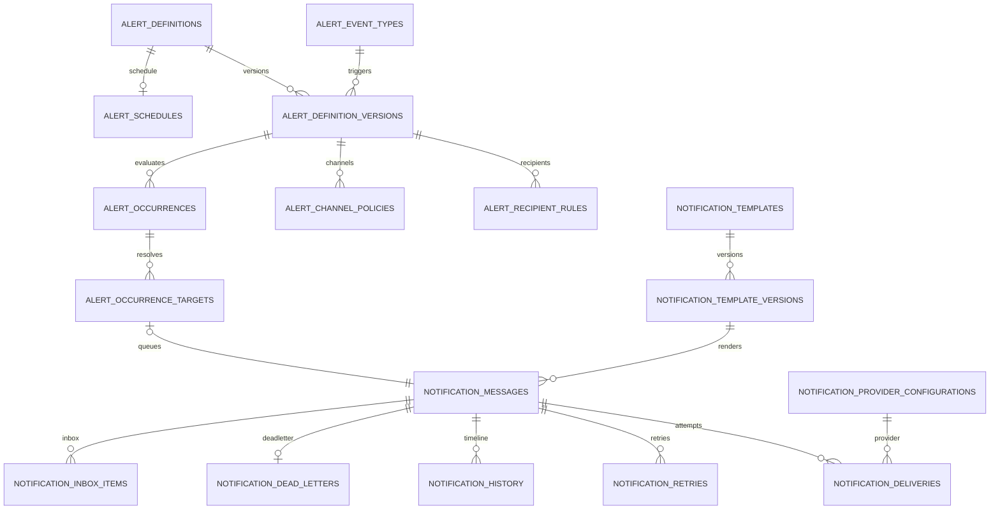

# 02 — Diseño de base de datos

**Motor:** PostgreSQL 18  
**Schema:** `compliance360`  
**Modelo:** shared database, tenant-scoped, defensa en profundidad.

## 1. Convenciones

- PK `uuid`; nuevos IDs preferentemente UUIDv7.
- Todas las tablas tenant-scoped incluyen `TenantId`, `CreatedAtUtc` y, si son mutables, `UpdatedAtUtc` y `RowVersion`.
- Enums se persisten como `varchar` con `CHECK`.
- JSON flexible se almacena en `jsonb` validado.
- Fechas se almacenan UTC; las configuraciones guardan timezone IANA.
- Cada padre tenant-scoped expone `UNIQUE (TenantId, Id)`.
- Las FK entre tablas tenant-scoped son compuestas `(TenantId, ParentId)`.
- No se borran versiones publicadas, timelines, intentos ni auditoría.
- Query filters EF y PostgreSQL RLS protegen las tablas nuevas.
- La API ejecuta `SET LOCAL app.tenant_id` dentro de transacciones.

## 2. Mapa relacional



## 3. Tablas de catálogo y reglas

### `alert_event_types`

| Columna | Tipo | Regla |
|---|---|---|
| Id | uuid | PK |
| TenantId | uuid | FK tenant; GUID especial para catálogo global controlado |
| Code | varchar(160) | Código estable `module.aggregate.action` |
| Module | varchar(80) | Módulo productor |
| DisplayName | varchar(200) | Nombre funcional |
| SchemaVersion | int | >0 |
| PayloadSchema | jsonb | JSON Schema |
| Sensitivity | varchar(24) | Public/Internal/Confidential/Restricted |
| IsActive | boolean | Estado |

Unique `(TenantId, Code, SchemaVersion)`. Índices por módulo/estado y código.

### `alert_definitions`

Cabecera estable: código, nombre, descripción, owner, backup owner, severidad, estado y versión vigente.

Estados: `Draft`, `Active`, `Paused`, `Retired`.

Unique `(TenantId, Code)`. No hay delete físico si tuvo una versión publicada.

### `alert_definition_versions`

Versión inmutable:

- DefinitionId, Version.
- EventTypeId.
- ConditionExpression JSON AST.
- DedupeExpression y ventana.
- Timezone, quiet hours, SLA.
- EffectiveFrom/To.
- CreatedBy, ApprovedBy, PublishedBy.
- ChangeReason y content hash.

Unique `(TenantId, DefinitionId, Version)`. Una versión efectiva requiere aprobación y publicación.

### `alert_recipient_rules`

- DefinitionVersionId y ordinal.
- Kind: User, Owner, Creator, Responsible, Approver, Reviewer, Submitter, Role, Group, Department, Manager, Subscription, DistributionList, External, Expression, Fallback.
- ReferenceId/ReferenceCode o Expression.
- RecipientClass: To/CC/BCC.
- Required y FallbackRuleId.

### `alert_channel_policies`

- DefinitionVersionId y Channel.
- TemplateId/TemplateVersionId.
- Priority, delay, max attempts.
- RespectPreferences, Mandatory.
- EscalationAfter, digest key.
- Routing policy.

Unique por versión/canal.

## 4. Evaluación

### `alert_occurrences`

Resultado único de evaluar evento/regla:

- DefinitionId/VersionId/EventTypeId.
- SourceModule/EntityType/EntityId.
- CorrelationId/CausationId.
- DedupeKey.
- Payload JSON.
- Status: Pending, Matched, Suppressed, NoRecipients, Queued, Completed, Failed.
- Occurred/Evaluated timestamps.
- FailureCode/Reason.

Unique `(TenantId, DefinitionVersionId, DedupeKey)`. Para ventanas temporales, la clave incluye bucket.

### `alert_occurrence_targets`

Snapshot explicable de resolución:

- OccurrenceId, RecipientRuleId.
- UserId o NotificationEndpointId.
- Channel y To/CC/BCC.
- Resolution y reason.
- NotificationMessageId.

Unique null-safe por occurrence/user/endpoint/channel/class.

## 5. Plantillas

### `notification_templates` existente

Se conserva como cabecera. Se agregan:

- CurrentApprovedVersionId.
- DefaultLocale.
- Category.
- OwnerUserId.

Las columnas legacy Subject/Body/TextBody/Locale/Version permanecen durante dos releases.

### `notification_template_versions`

- TemplateId, Version, Locale.
- Status: Draft, InReview, ChangesRequested, Rejected, Approved, Published, Superseded, Retired.
- Subject, HtmlBody, TextBody.
- VariableSchema, Branding, Theme.
- ContentSha256.
- CreatedBy/ApprovedBy/PublishedBy.
- Approval timestamps y ChangeReason.

Unique `(TenantId, TemplateId, Version, Locale)`. Una versión publicada es inmutable.

## 6. Cola y entrega

### `notification_messages` existente

Agregado canónico y cola. Se agregan:

- AlertOccurrenceId.
- TemplateVersionId.
- CorrelationId/CausationId.
- IdempotencyKey.
- Payload JSON.
- ScheduledAtUtc, NotBeforeUtc, ExpiresAtUtc.
- AttemptCount, MaxAttempts.
- LeaseToken, LeaseOwner, LeaseUntilUtc.
- LastAttemptAtUtc, CompletedAtUtc.
- RecipientHash y ContentHash.
- PriorityRank.

Estados V2: `Queued`, `Leased`, `Sending`, `Sent`, `Delivered`, `Failed`, `RetryScheduled`, `Cancelled`, `Expired`, `DeadLetter`, `Unknown`.

Índice worker parcial:

```sql
("NotBeforeUtc", "PriorityRank" DESC, "CreatedAtUtc", "Id")
WHERE "Status" IN ('Queued','RetryScheduled');
```

Unique `(TenantId, IdempotencyKey)`.

### `notification_deliveries`

Un registro por intento:

- MessageId, AttemptNo.
- ProviderConfigurationId.
- Started/Completed/Occurred timestamps.
- Outcome.
- ProviderMessageId, provider/http codes.
- LatencyMs.
- ResponseMetadata redacted.

Unique `(TenantId, MessageId, AttemptNo)`.

### `notification_retries`

Se conserva y amplía:

- Status Scheduled/Claimed/Executed/Cancelled.
- Scheduled/Claimed/Completed timestamps.
- Lease.
- ErrorClass y FailureReason redacted.

### `notification_history`

Timeline append-only:

- EventId único.
- MessageId.
- Status/EventName.
- ActorType/ActorId.
- ProviderConfigurationId.
- CorrelationId.
- Details JSON sanitizado.
- OccurredAtUtc.

Partición mensual cuando el volumen lo justifique; BRIN temporal.

### `notification_dead_letters`

- MessageId, Reason, PayloadJson redacted.
- Status Open/Requeued/Resolved/Discarded.
- ResolvedBy/At y ResolutionNote.
- OriginalMessageVersion.

Índice único parcial para un DLQ abierto por mensaje.

## 7. Inbox, endpoints y preferencias

### `notification_inbox_items`

- MessageId y UserId.
- State Unread/Read/Archived/Deleted.
- ReadAt, ArchivedAt, DeletedAt.
- Pinned y SortAt.
- AcknowledgedAt y ActionedAt opcionales.

Unique `(TenantId, MessageId, UserId)`. Índice parcial de no leídas.

### `notification_endpoints`

- UserId, Channel.
- AddressCiphertext y AddressHash.
- VerifiedAt, IsPrimary, IsActive.
- Metadata JSON.

Nunca se devuelve la dirección completa sin permiso reforzado.

### `notification_preferences` existente

Agregar topic pattern, quiet hours, timezone, digest mode, source y updated by.

### `notification_subscriptions` existente

Agregar UserId, EventTypeId, scope type/id y expiry. `Recipient` queda solo para compatibilidad.

### `notification_suppressions`

Canal, endpoint hash, motivo, fuente, inicio/fin y evidencia. Unique parcial para supresión activa.

## 8. Providers y secretos

### `notification_provider_configurations` existente

Agregar:

- Channel.
- Settings JSON sin secretos.
- Priority/default/enabled efectivos.
- Rate limit, timeout y circuit breaker.
- HealthStatus, LastHealthAt/Message.
- Environment y ResidencyRegion.

Solo un default habilitado por tenant/canal mediante índice parcial.

### `notification_provider_secrets`

Ciphertext, nonce, encrypted DEK, key ID, algorithm, version, rotated/expiry timestamps. Nunca se retorna por API ni se incluye en AuditLog.

### `notification_provider_callback_inbox`

Provider config, public event ID, raw payload cifrado, hash, firma válida, estado, attempts, next attempt y error redacted.

Unique por provider/event ID. Retención raw corta; normalización queda en timeline.

## 9. Infraestructura durable

### `notification_outbox`

- EventType, AggregateType/Id.
- Correlation/Causation.
- Payload.
- Occurred/Available timestamps.
- Status Pending/Claimed/Published/Failed.
- AttemptCount y lease.
- PublishedAt y LastError.

Índice parcial por AvailableAt para pendientes/fallidos.

### `alert_schedules`

- DefinitionId.
- ScheduleType y expresión normalizada.
- CronExpression opcional.
- Timezone.
- MisfirePolicy.
- BusinessCalendarId.
- Next/LastRun.
- Jitter y MaxCatchUpRuns.
- Enabled y lease.

### `alert_schedule_runs`

Unique `(TenantId, ScheduleId, ScheduledForUtc)`. Conserva estado, tiempos, occurrences y error.

### `api_idempotency_records`

PK `(TenantId, Key, Operation)`. RequestHash, estado, resource, respuesta segura, lock y expiry.

### `notification_export_jobs`

Solicitante, formato, filtros, snapshot, estado, object key, row count, tamaño, hash y expiry.

### `alert_rollups_hourly` / `alert_rollups_daily`

Tenant, bucket, módulo, canal, provider, prioridad, autoridad, país, workflow y counters/latencies agregados. No contienen PII.

## 10. Calendarios y gobierno

- `business_calendars`
- `business_calendar_versions`
- `business_calendar_days`
- `alert_sla_policies`
- `alert_sla_policy_versions`
- `alert_escalation_policies`
- `alert_escalation_steps`
- `alert_digest_policies`
- `alert_digest_runs`
- `alert_approval_requests`
- `alert_approval_decisions`
- `alert_deployments`
- `alert_promotion_packages`
- `alert_promotion_items`
- `alert_feature_flags`
- `alert_migration_checkpoints`

Todas las configuraciones usadas por runtime tienen versión inmutable, hash, actor, vigencia y lifecycle.

## 11. RLS e integridad tenant

Política conceptual:

```sql
USING ("TenantId" = current_setting('app.tenant_id', true)::uuid)
WITH CHECK ("TenantId" = current_setting('app.tenant_id', true)::uuid)
```

- API: rol DB tenant-scoped.
- Worker: rol dedicado con acceso únicamente a funciones/queries de claim y finalize.
- Migrator: rol DDL separado.
- Soporte: rol break-glass temporal y auditado.

Las FK nuevas se crean `NOT VALID`, se limpian huérfanos y luego se validan.

## 12. Escala y retención

- Cola caliente e inbox usan B-tree e índices parciales.
- Timeline, callbacks y outbox archivado pueden particionarse mensualmente.
- BRIN en tablas append-only.
- Keyset pagination; prohibido offset para altos volúmenes.
- Rollups sirven dashboards; no se escanean mensajes.
- Payloads/attachments grandes van a object storage.
- Autovacuum ajustado en tablas de alta mutación.
- Read replica para exports/analytics cuando exista.
- Retención default:
  - configuración/versiones: 7 años;
  - timeline/intentos/evidencia: 7 años;
  - callback raw: 90 días;
  - outbox publicado: 30 días;
  - inbox archivado: 2 años;
  - bodies/recipient PII: redacción o cifrado según política, normalmente 400 días;
  - legal hold prevalece.

## 13. Migración aditiva

1. Preflight, backup y análisis de huérfanos.
2. Expand: tablas/columnas nullable e índices.
3. Backfill reanudable con checkpoints.
4. Crear versión 1 `LegacyDraft` para templates.
5. `IdempotencyKey = legacy:{messageId}`.
6. No convertir falsos `DeliveredAtUtc` regulatorios en entregas.
7. Dual-write por feature flag.
8. Shadow evaluation y reconciliación.
9. Canary por tenant/canal.
10. Cutover progresivo.
11. Validar constraints y RLS.
12. Retirar escrituras legacy después de dos releases; conservar evidencia.

Rollback: desactivar workers/flags y volver a la aplicación anterior. El schema aditivo permanece; no se ejecutan `Down` destructivos en producción.

