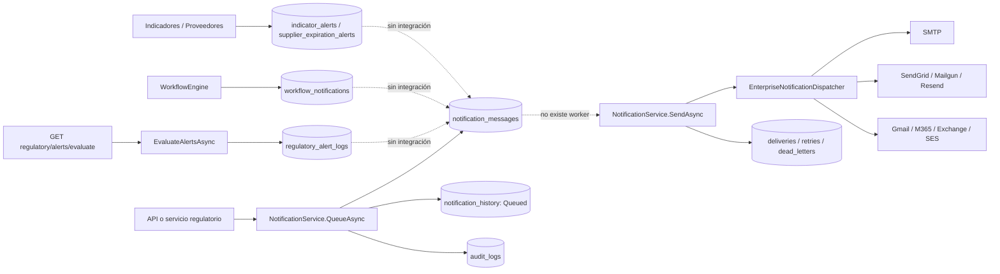
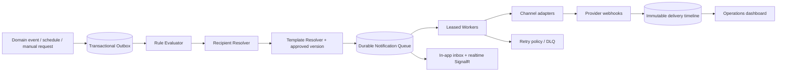

# Auditoría Enterprise del motor de alertas y notificaciones

**Sistema:** Compliance 360 / Regulatory Affairs  
**Fecha de corte:** 2026-07-19  
**Alcance:** código fuente, persistencia, API, UI, configuración, pruebas y datos locales restaurados en VPS  
**Dictamen:** **PARCIAL — existe una base técnica de notificaciones, pero no un Alert Engine Enterprise operativo**  
**Calificación total:** **43.4/100**

## 1. Resumen ejecutivo

Compliance 360 contiene un dominio de notificaciones con plantillas, mensajes, intentos, entregas, historial, dead letters, proveedores, auditoría y endpoints. También incluye adaptadores para SMTP, SendGrid, Mailgun, Resend, Gmail SMTP, Microsoft 365, Exchange Online y Amazon SES.

Sin embargo, el flujo productivo está incompleto:

- No existe `BackgroundService`, `IHostedService`, Hangfire, Quartz, cron, scheduler, cola externa, SignalR, domain-event bus ni worker que procese mensajes pendientes o reintentos.
- `QueueAsync` solo persiste. Ningún componente consume automáticamente `notification_messages`.
- Los 268 mensajes observados en la base están todos en `InApp / Queued / High`; no hay entregas ni reintentos ejecutados.
- No hay bandeja o campana in-app que consulte esos mensajes para el usuario.
- La configuración creada desde UI/base de datos no contiene host, credencial, remitente o URL y el dispatcher no la consulta; el envío real usa exclusivamente `IOptions<NotificationProviderOptions>` cargado desde configuración de aplicación.
- Las “alertas regulatorias” son otro subsistema separado. Se evalúan cuando el usuario abre la pantalla, escriben un registro marcado como entregado, pero no crean ni envían una `NotificationMessage`.
- Las notificaciones de Workflow, alertas de proveedores e indicadores son entidades separadas que no convergen en el servicio central.
- La aplicación permite crear plantillas y mensajes por API, pero la UI no ofrece administración de plantillas, composición de mensajes, historial, retry, cancelación o dead letters.

Por tanto, el sistema no consiste únicamente en correos dispersos: existe una **fundación modular razonable**. No obstante, tampoco constituye un motor Enterprise completo porque carece de orquestación, ejecución asíncrona, motor de reglas, resolución de destinatarios, experiencia de usuario y operación end-to-end.

## 2. Método y cobertura

Se inspeccionaron las coincidencias de `Alert`, `Notification`, `Email`, `SMTP`, `SendGrid`, `BackgroundService`, `IHostedService`, `Job`, `Queue`, `SignalR`, `Template`, `Reminder`, `Scheduler`, `Cron`, `Hangfire`, `Quartz`, `Workflow`, `EventHandler`, `DomainEvent`, `Audit`, `Logging` y configuración en:

- `src/Compliance360.Domain`
- `src/Compliance360.Application`
- `src/Compliance360.Infrastructure`
- `src/Compliance360.Web`
- `tests/Compliance360.Tests`
- `e2e`
- migraciones, `appsettings.json`, Docker/CI y scripts

Las búsquedas de `AddHostedService`, `IHostedService`, `BackgroundService`, Hangfire, Quartz, cron, `PeriodicTimer`, SignalR, `IHubContext`, MediatR, `INotificationHandler` y domain-event handlers no encontraron implementaciones en `src`.

Validaciones ejecutadas:

- `dotnet test ... --filter "NotificationFoundationTests|NotificationProviderRealTests|WorkflowEngineTests"`: **38/38 PASS**, 0 fallos, 0 omitidos.
- Consulta de datos local, que corresponde al dump restaurado en VPS:
  - `notification_messages`: 268
  - `notification_history`: 268
  - `notification_templates`: 0
  - `notification_deliveries`: 0
  - `notification_retries`: 0
  - `notification_dead_letters`: 0
  - `notification_subscriptions`: 0
  - `notification_preferences`: 0
  - `notification_attachments`: 0
  - `notification_provider_configurations`: 1 (`SMTP Primary`, default, **deshabilitado**)
  - `regulatory_alert_settings`: 1 (`120,90,60,30,7,0`)
  - `regulatory_alert_logs`, `indicator_alerts`, `supplier_expiration_alerts`, `workflow_notifications`, `workflow_escalations`: 0
  - distribución real: 268 mensajes `InApp / Queued / High`, 268 eventos `Queued`, 268 con `TargetUserId`.

## 3. Arquitectura actual

### Flujo real observado

1. Una transición regulatoria llama a `Notify`/`NotifyAsync`.
2. Se crea una notificación `InApp` con destinatario textual `user:{guid}` y `TargetUserId`.
3. `NotificationService.QueueAsync` crea `NotificationMessage`, historial `Queued` y `AuditLog`.
4. El mensaje permanece `Queued`.
5. No hay worker que invoque `SendAsync`.
6. No hay endpoint de bandeja del usuario ni UI que muestre sus mensajes.

El endpoint manual `POST /messages/{id}/send` sí puede despachar, pero exige una llamada explícita con permiso `NOTIFICATION.SEND`.

## 4. Inventario completo

### 4.1 Dominio y contratos centrales

| Archivo | Elemento | Responsabilidad / evidencia |
|---|---|---|
| `src/Compliance360.Domain/Notifications/NotificationModels.cs:5-53` | enums de canal, estado, prioridad, proveedor y delivery | Define Email, InApp, SMS, WhatsApp, Push; solo Email tiene transporte real. |
| `.../NotificationModels.cs:56-111` | `NotificationTemplate` | Código, canal, subject/body, text body, locale, branding, versión e inactivación. |
| `.../NotificationModels.cs:113-240` | `NotificationMessage` | Cola, destinatario, usuario objetivo, estado, timestamps, retry, provider y cancelación. |
| `.../NotificationModels.cs:242-300` | `NotificationDelivery`, `NotificationRetry` | Evidencia de entrega e intentos programados. |
| `.../NotificationModels.cs:302-399` | `NotificationSubscription`, `NotificationPreference`, `NotificationHistory`, `NotificationAttachment` | Modelos persistentes; no tienen servicios/endpoints de gestión. |
| `.../NotificationModels.cs:401-453` | `NotificationProviderConfiguration`, `NotificationDeadLetter` | Configuración metadata y dead letter. |
| `src/Compliance360.Application/Notifications/NotificationContracts.cs:7-98` | interfaces | Servicio, repositorio, dispatcher, provider factory, template engine, retry, tracking y audit. |
| `.../NotificationContracts.cs:100-224` | comandos y DTO | Crear/preview template, queue/send/retry/cancel, provider config, dashboard. |
| `.../NotificationContracts.cs:226-260` | `NotificationProviderOptions` | Configuración efectiva de proveedores desde `Notifications` de configuración. |

### 4.2 Servicios y transporte

| Archivo | Clase / método | Evidencia |
|---|---|---|
| `src/Compliance360.Application/Notifications/NotificationService.cs:39-59` | `CreateTemplateAsync` | Crea template y auditoría; no existe update/list/delete por servicio. |
| `.../NotificationService.cs:61-67` | `PreviewTemplateAsync` | Renderiza, pero devuelve un resumen que no contiene el HTML resultante. |
| `.../NotificationService.cs:69-95` | `QueueAsync` | Persiste, registra tracking y auditoría; no envía. |
| `.../NotificationService.cs:97-146` | `SendAsync` | Envío síncrono, delivery/retry/dead-letter y auditoría. |
| `.../NotificationService.cs:148-173` | `RetryAsync`, `CancelAsync` | Retry manual y cancelación. |
| `.../NotificationService.cs:175-214` | dashboard, history, dead letters, provider | Agregados por tenant; provider DB es solo metadata. |
| `src/Compliance360.Application/Notifications/NotificationEnterpriseServices.cs:7-44` | `NotificationTemplateEngine` | Sustitución simple `{{Variable}}`; no parser, escaping ni validación de tokens. |
| `.../NotificationEnterpriseServices.cs:46-65` | `NotificationRetryService` | Backoff exponencial y límite; no ejecuta los reintentos. |
| `.../NotificationEnterpriseServices.cs:67-110` | tracking/audit | Escribe history y `AuditLog`. |
| `src/Compliance360.Infrastructure/Notifications/EnterpriseNotificationDispatchers.cs:13-83` | dispatcher | Recorre proveedores de `appsettings`; ignora prioridad/enabled/default de DB. |
| `.../EnterpriseNotificationDispatchers.cs:102-179` | SMTP/Gmail/M365/Exchange | `System.Net.Mail`; autenticación usuario/clave, sin OAuth. |
| `.../EnterpriseNotificationDispatchers.cs:181-278` | SendGrid/Mailgun/Resend/SES | Adaptadores HTTP. SES usa Bearer simple y no AWS Signature V4. |
| `.../EnterpriseNotificationDispatchers.cs:280-322` | base HTTP | Config check superficial y HTTP send. |
| `src/Compliance360.Infrastructure/Notifications/EfNotificationRepository.cs` | repositorio EF | CRUD parcial tenant-scoped para templates, messages, delivery, retry, history, dead letters y providers. |
| `src/Compliance360.Infrastructure/DependencyInjection.cs:67,101-115,151` | registro DI | Registra opciones, 8 providers, dispatcher, service y repository; no registra worker. |

### 4.3 API y permisos

Base: `/api/v1/tenants/{tenantId}/notifications`.

| Endpoint | Política | Resultado |
|---|---|---|
| `POST /templates` | `Notification.Template` | Crear plantilla. |
| `POST /templates/preview` | `Notification.Template` | Preview técnico incompleto. |
| `POST /messages` | `Notification.Send` | Encolar mensaje. |
| `POST /messages/{id}/send` | `Notification.Send` | Envío síncrono manual. |
| `POST /messages/{id}/retry` | `Notification.Send` | Retry manual. |
| `POST /messages/{id}/cancel` | `Notification.Manage` | Cancelar. |
| `GET /history` | `Notification.Read` | Lista mensajes, no eventos detallados. |
| `GET /tracking/dead-letters` | `Notification.Read` | Lista dead letters. |
| `GET /dashboard` | `Notification.Read` | Conteos y flags de configuración. |
| `POST /providers` | `Notification.Admin` | Crea metadata de proveedor, no endpoint real/secret. |

Evidencia: `src/Compliance360.Web/Api/FoundationEndpoints.cs:1265-1313`.

Permisos: `NOTIFICATION.READ`, `.SEND`, `.TEMPLATE`, `.MANAGE`, `.ADMIN` en `RbacCatalog.cs:145-150`; políticas en `PermissionPolicies.cs:206-210`. El rol `Notification Administrator` recibe todos ellos en `RoleCatalog.cs:151-156`. `Viewer` solo recibe lectura.

### 4.4 UI

| Archivo / ubicación | Funcionalidad real |
|---|---|
| `wwwroot/app.js:1206-1272` | Pantalla `configuration`: health general, sent, delivery rate, dead letters y flags por provider. |
| `wwwroot/app.js:1297-1316` | Botón “Crear Email SMTP”: crea un SMTP deshabilitado, sin host, remitente o credencial. |
| `wwwroot/app.js:1952,2161-2163` | Panel TAC de notificaciones meramente informativo y enlace a configuración. |
| `wwwroot/regulatory-affairs.js:1500-1532` | Evalúa alertas regulatorias al abrir y permite cambiar únicamente umbrales de días. |

No se encontraron llamadas UI a `/notifications/history`, `/tracking/dead-letters`, `/messages`, `/send`, `/retry`, `/cancel`, `/templates` ni `/templates/preview`.

### 4.5 Persistencia

Tablas centrales:

- `notification_templates`
- `notification_messages`
- `notification_deliveries`
- `notification_retries`
- `notification_subscriptions`
- `notification_preferences`
- `notification_history`
- `notification_attachments`
- `notification_provider_configurations`
- `notification_dead_letters`

Tablas paralelas:

- `regulatory_alert_settings`
- `regulatory_alert_logs`
- `workflow_notifications`
- `workflow_escalations`
- `indicator_alerts`
- `supplier_expiration_alerts`

Configuración EF: `Compliance360DbContext.cs:781-884`. Migración principal: `20260621145700_AddNotificationProviderReal.cs`. Las tablas centrales de deliveries, retries, history, attachments y dead letters no declaran FK a `notification_messages`; `TemplateId` y `TargetUserId` del mensaje tampoco tienen FK.

### 4.6 Observabilidad

- `Program.cs:107-116`: health checks de servicio, SMTP, SendGrid, Mailgun, Resend, queue y dead letter.
- `ObservabilityHealthChecks.cs:53-65`: “saludable” solo confirma que el dispatcher está registrado.
- `...:68-87`: provider health valida presencia de configuración, no realiza handshake autenticado.
- `...:90-105`: queue se considera saludable hasta 9,999 mensajes; no evalúa antigüedad.
- `...:108-123`: dead letters se consideran saludables hasta 999; no evalúa tasa ni severidad.

## 5. ¿Existe un verdadero Alert Engine?

**Respuesta: PARCIAL.**

Sí existe:

- modelo de mensajes y estados;
- abstracción de providers;
- failover secuencial;
- plantillas con tokens;
- persistencia de retry/dead-letter/history;
- RBAC, tenant scope y audit;
- API administrativa básica.

No existe:

- catálogo configurable de reglas/eventos/condiciones;
- event bus/outbox y handlers;
- resolución de destinatarios por rol, grupo, departamento, owner o supervisor;
- scheduler/worker;
- procesamiento concurrente con leases;
- retry automático;
- inbox in-app;
- webhooks de delivery/bounce/complaint;
- edición completa y versionado histórico de templates;
- dashboard operativo accionable;
- correlación uniforme entre alertas regulatorias/workflow/indicadores/proveedores y el dominio central.

Conclusión técnica: **es una fundación de Notification Service con varios modelos de alerta desconectados, no un Alert Engine Enterprise end-to-end**.

## 6. Configurabilidad, creación y modificación

### 6.1 Resultado

**Configurabilidad global: PARCIAL.**

| Capacidad | Estado | Evidencia |
|---|---|---|
| Umbrales regulatorios | Sí | UI RA y `PUT /alert-settings`; solo lista CSV de días. |
| Crear template | API únicamente | `POST /notifications/templates`; rol Notification Administrator. |
| Editar template | No | El dominio tiene `UpdateContent`, pero no servicio ni endpoint. |
| Preview | API parcial | No hay UI; DTO de respuesta no expone body renderizado. |
| Provider real | No desde UI | UI crea metadata; endpoint no acepta host/secret/from/base URL. |
| Frecuencia / cron | No | Sin modelo ni scheduler. |
| Destinatarios | Parcial | API acepta un recipient y target user; workflow usa owner/creator/responsible. |
| Condiciones | No | Codificadas en C#. |
| Asunto / mensaje | API parcial | Directo al encolar o template al crear. |
| Prioridad | API | Low/Normal/High/Critical. |
| Canal | Modelo/API | Email/InApp/SMS/WhatsApp/Push; solo Email tiene provider real. |
| Estado | Máquina interna | No configurable. |
| Tiempo / SLA | No | Solo `NextRetryAtUtc`; sin consumidor. |
| Workflow | No configurable | Integraciones codificadas en servicios regulatorios. |
| Preferencias / suscripciones | Modelo sin API/UI | No son usadas para resolver recipients. |

Un usuario funcional no puede crear una **regla de alerta** nueva. Puede:

- cambiar días de anticipación regulatorios con `REGULATORY.CONFIGURE`;
- crear una plantilla o mensaje mediante API si posee permisos;
- crear metadata de proveedor desde UI.

Para agregar un evento, condición, resolución de destinatario o ejecución programada se requiere un desarrollador y despliegue.

## 7. Disparadores identificados

### 7.1 Notificaciones centrales generadas por Regulatory Affairs V1

| Evento | Archivo / método | Destinatario |
|---|---|---|
| Aprobación interna para sometimiento | `RegulatoryAffairsService.cs:353-386`, `ApproveForSubmissionAsync` | Owner, si no creator. |
| Sometimiento registrado | `:395-433`, `SubmitDossierAsync` | Owner/creator. |
| Resometimiento registrado | `:442-479`, `ResubmitDossierAsync` | Owner/creator. |
| Rechazo por autoridad | `:510-550`, `RejectDossierAsync` | Owner/creator. |
| Observación de autoridad | `:644-672`, `OpenObservationAsync` | Responsible, luego owner/creator. |

### 7.2 Notificaciones centrales generadas por Workflow V2

| Evento | Archivo / método | Destinatario |
|---|---|---|
| Corrección solicitada | `RegulatoryWorkflowV2Service.cs:92-110`, `ReturnForCorrectionAsync` | Owner/creator. |
| Corrección enviada | `:140-145`, `SubmitCorrectionAsync` | Usuario que solicitó corrección. |
| Revisión técnica completada | `:236-241`, `CompleteTechnicalReviewAsync` | Owner/creator. |
| Expediente reabierto | `:361-366`, `ExecuteReopenAsync` | Owner/creator. |
| Expediente cancelado | `:439-444`, `CancelAsync` | Owner/creator. |

Todos encolan canal `InApp`; capturan y silencian cualquier excepción en `Notify` (`:501-527`).

### 7.3 Alertas regulatorias por evaluación manual

`RegulatoryAffairsService.EvaluateAlertsAsync`, `:991-1085`:

- registro sanitario próximo a vencer;
- registro sanitario vencido;
- certificado de fabricante próximo a vencer;
- certificado de fabricante vencido;
- fecha máxima de recepción de expediente incumplida;
- licencia de operación próxima a vencer;
- licencia de operación vencida.

El disparador real es un **GET** a `/regulatory/alerts/evaluate`, normalmente al abrir la pantalla. No es horario ni event-driven.

### 7.4 Alertas paralelas no despachadas

- Workflow: completion, escalation y reminder crean `WorkflowNotification` en `WorkflowModels.cs:298-326`; reminder y escalation se invocan por endpoints manuales.
- Supplier: `SupplierManagementService.CreateExpirationAlertAsync` crea `SupplierExpirationAlert` bajo endpoint manual.
- Quality Indicator: `QualityIndicatorModels.cs:327-345` crea alertas por target missed/reached/exceeded/missing data y tendencia negativa.
- Tenant/SuperAdmin: `TenantManagementService.BuildAlerts` y `SuperAdminPlatformService.BuildAlerts` calculan avisos de UI en memoria.
- CAPA y Risk tienen acciones manuales de escalamiento, pero no se integran con `INotificationService`.

No se encontraron disparadores de notificación central para creación de expediente, asignación, comentario, carga documental, firma, nueva versión, documento próximo a vencer fuera del evaluador regulatorio, ni recordatorios de SLA programados.

## 8. Destinatarios

Mecanismos reales:

- API manual: `Recipient` textual y `TargetUserId` opcional.
- Regulatory V1/V2: usuario responsable, owner o creator según evento.
- Corrección V2: solicitante original.
- Alertas regulatorias: el `userId` de quien ejecuta el GET, no necesariamente el owner afectado.

No existe resolución por:

- rol;
- grupo;
- departamento;
- supervisor;
- equipo del expediente;
- suscripción activa;
- preferencia del usuario;
- guardia/on-call;
- matriz configurable.

`NotificationSubscription` y `NotificationPreference` existen como modelos y tablas, pero no son leídos por `NotificationService` ni expuestos por API.

## 9. Plantillas

**Template Engine: PARCIAL.**

- HTML: sí, el body se envía como HTML.
- Variables: sí, reemplazo literal case-insensitive de `{{Key}}`.
- Text body: sí.
- Branding: logo, colores y tenant name como variables.
- Locale: persistido, pero no resuelve automáticamente template por idioma.
- Preview: método/API, sin pantalla y sin devolver el cuerpo renderizado al consumidor.
- Versionado: solo contador mutable; no conserva revisiones anteriores ni autor/motivo/aprobación.
- Edición UI: no.
- Update API: no.
- Lista de templates: no.
- Activación/desactivación API: no.
- Validación de variables: no.
- Escaping/sanitización: no. Valores de variables se insertan sin HTML encoding, creando riesgo de HTML injection/phishing si contienen datos no confiables.

## 10. SMTP y proveedores

Configuración efectiva: `src/Compliance360.Web/appsettings.json:36-103` y overrides estándar de .NET (variables de entorno/secrets externos si se suministran).

Proveedores registrados:

- SMTP genérico;
- Gmail SMTP;
- Microsoft 365 SMTP;
- Exchange Online SMTP;
- SendGrid;
- Mailgun;
- Resend;
- Amazon SES.

Hallazgos:

- El repositorio no contiene valores efectivos de host/username/secret/from; defaults están vacíos.
- No se encontraron overrides `Notifications__...` en Docker, scripts o CI versionados.
- La base de datos solo guarda provider, name, priority, default y enabled.
- `EnterpriseNotificationDispatcher` usa `appsettings`, no las configuraciones por tenant de DB.
- La UI no permite ingresar ni probar credenciales.
- La prioridad DB y `IsEnabled` no controlan el dispatcher.
- Microsoft 365/Gmail/Exchange dependen de usuario/clave SMTP; no hay OAuth2/Graph.
- El adaptador SES no implementa SigV4, por lo que no corresponde a la autenticación normal de AWS SES.

## 11. Programación, colas y reintentos

**No existe programación automática.**

- No hourly/daily/weekly/monthly.
- No cron.
- No Hangfire.
- No Quartz.
- No Windows Service.
- No Hosted Service.
- No cola durable externa.
- No SignalR.

Existe `NextRetryAtUtc`, `NotificationRetry.ScheduledAtUtc` y backoff exponencial, pero son datos sin ejecutor. El endpoint `/retry` ejecuta manualmente y no verifica que haya llegado `NextRetryAtUtc`.

## 12. Historial y dashboard

### Historial

Persistencia disponible:

- mensajes: destinatario, asunto, prioridad, estado, queued/sent/failed y error;
- deliveries: provider, status, provider message id y timestamp;
- retries: intento, fecha programada/ejecutada y error;
- history: estado/evento/timestamp;
- dead letters;
- audit logs.

Limitaciones:

- UI inexistente.
- `GET /history` devuelve resúmenes de mensaje, no la secuencia de `notification_history`.
- No endpoint para deliveries/retries/attachments/subscriptions/preferences.
- No webhook de delivered/bounce/complaint; `MarkDelivered` no es invocado en producción.
- Reenvío equivale a retry manual; no existe “resend as new” con trazabilidad.
- Sin filtros, paginación ni retención; el repositorio carga todos los mensajes del tenant.

### Dashboard

Existe un dashboard API y tres métricas UI: enviados, delivery rate y dead letters, más flags de provider.

No muestra:

- pendientes y antigüedad;
- fallidas recientes;
- retries vencidos;
- canceladas;
- throughput;
- latencia;
- bounce/complaint;
- desglose por template/evento/canal;
- SLA;
- acciones de retry/cancel/resend;
- detalle por mensaje.

## 13. Problemas y riesgos prioritarios

### P0

1. **No hay consumidor de cola.** Impacto: 268 mensajes regulatorios permanecen pendientes indefinidamente.
2. **“InApp” sin inbox.** Impacto: el usuario objetivo nunca ve el mensaje.
3. **Configuración DB/UI desconectada del dispatcher.** Impacto: la pantalla puede indicar provider configurado mientras el envío real sigue sin credenciales.
4. **Alertas regulatorias marcan `DeliveredAtUtc` y `Success=true` sin entrega.** Evidencia: constructor `RegulatoryAlertLog`, líneas 422-439.
5. **GET con escritura y destinatario incorrecto.** `/alerts/evaluate` crea logs y asigna al usuario que consulta.

### P1

6. **Deduplicación rota para expirados.** La consulta busca `daysRemaining=0`, pero el log guarda el número negativo real; un expirado puede generar logs repetidos en cada evaluación.
7. **Alertas positivas se pierden si no se evalúan el día exacto.** Los umbrales usan `days == threshold`; no existe catch-up para una ejecución omitida.
8. **Riesgo de duplicación de envío.** El side effect externo ocurre antes del commit del estado; no hay outbox, idempotency key, lease o provider deduplication.
9. **Una excepción puede abortar el failover.** El dispatcher itera providers sin `try/catch` por intento; una excepción SMTP/HTTP impide probar el siguiente.
10. **HTML injection.** Tokens se insertan sin encoding/sanitización.
11. **Destinatario externo arbitrario.** `NOTIFICATION.SEND` acepta un recipient textual sin política de dominio, allowlist ni resolución tenant-scoped.
12. **Integridad referencial insuficiente.** No hay FK entre messages y template/user, ni de delivery/retry/history/dead-letter/attachment al mensaje.
13. **Providers anunciados pero no plenamente válidos.** SES auth no estándar; M365/Exchange/Gmail sin OAuth.
14. **Consulta no escalable.** Dashboard/history materializan todos los mensajes del tenant.
15. **Dashboard susceptible a error por provider duplicado.** La base permite varios nombres del mismo enum Provider, pero `GetDashboardAsync` ejecuta `ToDictionary` únicamente por Provider.

### P2

16. Modelos SMS/WhatsApp/Push sin providers.
17. Preferencias, suscripciones y attachments sin uso operativo.
18. Versionado de template sobrescribe contenido y solo incrementa un entero.
19. Health checks miden registro/configuración, no entrega real ni edad del backlog.
20. Excepciones de notificación regulatoria se silencian sin telemetría explícita.
21. Los health endpoints de providers no cubren Gmail SMTP, Microsoft 365, Exchange Online ni Amazon SES.
22. Los report schedules también persisten `NextRunUtc` sin ejecutor, confirmando que la ausencia de scheduler es transversal.

## 14. Scorecard Enterprise

| Dimensión | Nota /100 | Fundamento |
|---|---:|---|
| Arquitectura | 55 | Capas e interfaces claras, pero subsistemas fragmentados y sin outbox/worker. |
| Configurabilidad | 35 | Umbral y metadata; reglas, credenciales y destinatarios no configurables. |
| Escalabilidad | 30 | Envío síncrono, full scans, sin broker, leases ni partición operativa. |
| Seguridad | 45 | RBAC/tenant/audit positivos; HTML injection y secretos/config/provider incompletos. |
| Flexibilidad | 45 | Canales/providers/modelos amplios, implementación efectiva limitada. |
| UX | 30 | Métricas básicas y umbral; sin inbox, editor, history ni operación. |
| Mantenibilidad | 60 | Código modular y pruebas unitarias; duplicidad de conceptos y wiring incompleto. |
| Automatización | 20 | No hay scheduler/worker/retry automático. |
| Auditoría | 60 | History y AuditLog; semántica falsa de delivery y falta de UI/callbacks. |
| Motor de reglas | 20 | Condiciones codificadas; solo CSV de umbrales. |
| Plantillas | 50 | HTML/tokens/locale/version integer; sin lifecycle Enterprise. |
| Dashboard | 45 | API y métricas mínimas; no es consola operacional. |
| Historial | 55 | Modelo rico, exposición y uso incompletos. |
| Integración | 58 | Varios adaptadores; configuración y algunos protocolos no productivos. |
| **Total** | **43.4** | Promedio simple de las 14 dimensiones. |

## 15. Arquitectura objetivo

Componentes recomendados:

1. `AlertDefinition`: evento, condición DSL, tenant/module, prioridad, SLA, quiet hours, dedupe window y estado.
2. `AlertRecipientRule`: usuario, owner, role, group, department, manager, expression y fallback.
3. `NotificationTemplateVersion`: draft/review/approved/retired, locale, channel, schema de variables, autor y aprobación.
4. Outbox transaccional junto al cambio de negocio.
5. Worker con `FOR UPDATE SKIP LOCKED` o broker administrado; leases, heartbeat, idempotency key.
6. Adapters separados por canal; OAuth/managed identity y secret vault.
7. Webhooks firmados para delivered/bounce/complaint.
8. Inbox in-app con unread/read/archive, badge y SignalR opcional.
9. Consola de operaciones con búsqueda, retry, cancel, resend, DLQ y trazabilidad.
10. Scheduler durable para expiraciones, SLA, digest y escalamiento.

## 16. Roadmap

### Fase 0 — Contención (1-2 semanas)

- Corregir semántica y dedupe de `RegulatoryAlertLog`.
- Cambiar evaluación con side effect a `POST`/job interno.
- Conectar alertas regulatorias al servicio central.
- Añadir logging estructurado al catch regulatorio.
- Ocultar claims UI de configuración por tenant que hoy no son reales.

### Fase 1 — Entrega mínima confiable (2-4 semanas)

- Implementar outbox y worker durable.
- Procesar cola/retries por `NextRetryAtUtc`.
- Introducir idempotency key, lease y límites de concurrencia.
- Crear inbox in-app y endpoints por usuario.
- Usar provider config tenant-scoped cifrada o references a vault.
- Health por backlog age, failure rate y provider round-trip.

### Fase 2 — Configuración funcional (4-8 semanas)

- CRUD de templates y versiones aprobadas, preview real y validación de tokens.
- Sanitización/encoding y allowlist HTML.
- CRUD de reglas, destinatarios, canales, frecuencia, SLA y escalamiento.
- Resolver roles/grupos/departamentos/owner/supervisor/preferencias.
- UI completa para Notification Administrator y separación SoD de secrets.

### Fase 3 — Operación Enterprise (6-10 semanas)

- Dashboard operacional, filtros, métricas, retry/cancel/resend y DLQ.
- Webhooks provider, bounces, complaints, suppressions y unsubscribe.
- OAuth2 Microsoft/Google; SDK/firma correcta de SES.
- Rate limits por provider, circuit breakers y bulkheads.
- Retención, particionado/archivado e índices por estado/next-at/tenant.

### Fase 4 — Comparabilidad Salesforce/Veeva/ServiceNow (8-16 semanas)

- Diseñador visual de reglas y recipient policies.
- Catálogo de eventos versionado y schema registry.
- Aprobación de templates/reglas con firma, motivo y audit inmutable.
- Digests, quiet hours, calendario laboral, timezone y escalamiento SLA.
- Simulador “qué habría ocurrido”, sandbox y promoción dev/stage/prod.
- KPIs SLO, observabilidad distribuida y pruebas de volumen/caos.

## 17. Límites de la evidencia de pruebas

Las 38 pruebas focalizadas verifican dominio, persistencia básica, payloads HTTP, failover simulado, backoff y flujos manuales. No prueban worker, recuperación tras reinicio, concurrencia, SMTP real, M365/Exchange/SES real, callbacks, expiraciones regulatorias, idempotencia ni entrega end-to-end.

La prueba Playwright de Notification Administrator (`e2e/tests/functional.spec.ts:268-287`) solo pulsa “Crear Email SMTP” y comprueba que el dashboard responde HTTP 200; no demuestra envío o recepción. GitHub Actions y Azure Pipelines ejecutan `dotnet test`, pero no Playwright operacional de notificaciones. Los reportes históricos referencian capturas bajo `artifacts/e2e`, pero las capturas específicas de notificaciones no están presentes actualmente en el repositorio; por ello esta auditoría no las considera evidencia verificable.

Existen documentos de certificación que declaran ejecución automática o casos PASS, pero el código no contiene consumidor de retries/schedules ni resultados individuales suficientes. Esas declaraciones documentales no sustituyen evidencia operativa.

## 18. Pruebas requeridas para certificación futura

- Worker recovery, crash-after-send y exactamente-una-intención con envío idempotente.
- Concurrencia de múltiples workers.
- Retry por errores transitorios y DLQ por permanentes.
- Failover real con proveedores sandbox.
- Webhook spoof/replay/signature.
- Tenant isolation e IDOR en todas las entidades.
- HTML/script/link injection en variables y templates.
- Recipient resolution por rol/grupo/owner/supervisor.
- Timezones, DST, quiet hours y calendario.
- Carga sostenida, burst, backlog recovery y rate limit.
- E2E de inbox, unread/read, dashboard, retry/cancel/resend.
- Restauración de base sin mensajes duplicados o perdidos.

## 19. Dictamen final

**NO — el módulo actual no está al nivel de un Alert Engine Enterprise comparable con Salesforce, Veeva Vault o ServiceNow.**

La base de dominio y los adaptadores reducen el esfuerzo de evolución, y las 38 pruebas focalizadas pasan. Pero la evidencia operacional —268 mensajes InApp en cola, cero deliveries, cero retries ejecutados, cero templates y provider SMTP deshabilitado— confirma que el circuito de entrega no está cerrado.

El nombre técnicamente correcto hoy es: **Notification Foundation + alertas de dominio fragmentadas**. La certificación Enterprise exige completar como mínimo las fases 0, 1 y 2, además de demostrar entregas reales, reintentos automáticos, inbox, trazabilidad y aislamiento multi-tenant bajo carga.
