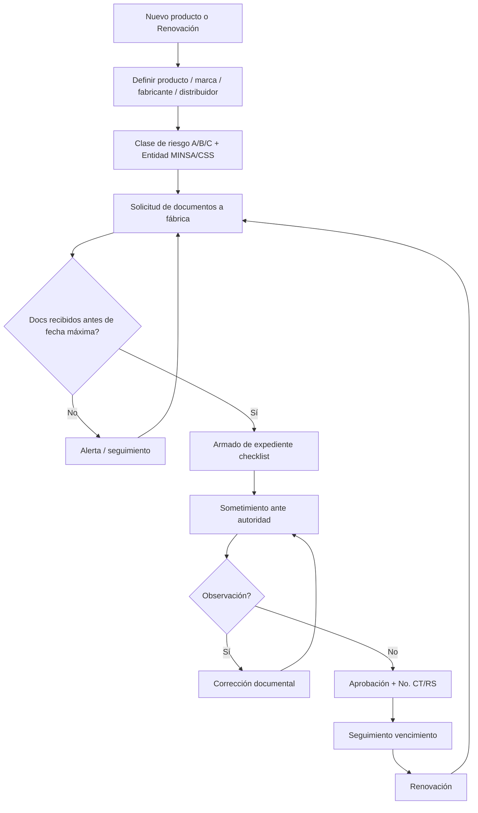

# 02 — Business Process Analysis

**Fuente primaria:** `REGUTRACK 02JUN26 MG.xlsx`  
**Hojas:** `CTT REGISTROS (2)`, `CTT REGISTROS`, `CTT REGISTROS TUBERIA`, `DOCUMENTACION`, `CTT LICENCIAS OP`

---

## 1. Problema real que intenta resolver la empresa

Permitir **comercializar productos de salud** (principalmente **insumos médicos**, minoritariamente equipos) en Panamá **sin interrupción regulatoria**, manteniendo:

- Registros/criterios técnicos **vigentes** ante **MINSA** o **CSS**
- Expedientes de **nuevo registro** y **renovación** completos y rastreables
- Documentación del **fabricante extranjero** vigente (ISO, CLV/FDA, CE, etc.)
- **Licencias de operación** corporativas (Multimed / 4 Hospital) vigentes y renovables vía plataformas digitales (FADDI / Panamá Digital / oferente)

El “producto” económico no es software ni “compliance abstracto”: es **capacidad legal de vender un SKU médico**.

---

## 2. Producto del negocio, activo principal, expediente principal

| Concepto | Evidencia Excel | Definición operativa |
|----------|-----------------|----------------------|
| **Producto del negocio** | Columna *Nombre del Producto Como aparece en el CT*; ~182–192 productos; marcas REBSTOCK, STERIKING, OSSUR, etc. | Dispositivo/insumo médico identificado comercialmente |
| **Activo principal** | *Criterio Técnico / Registro Sanitario No.* (p.ej. `MQ-1892-02-24`) + *Fecha de vencimiento* | Autorización sanitaria numerada y con ciclo de vida |
| **Expediente principal** | Columnas documentales 18–39 + hitos 40–50 | Carpeta/caso de sometimiento: requisitos legales + del fabricante + fechas de proceso |
| **Activo corporativo paralelo** | `CTT LICENCIAS OP` | Licencias de operación / oferentes / farmacia y drogas / marca |

**País operativo observado:** `PA` (Panamá) en 191/191 filas de `CTT REGISTROS (2)`.

**Distribuidores/Importadores:** `4 Hospital, Inc.` (~172), `MULTIMED SOLUTIONS PANAMA, INC` (~19).

**Entidades emisoras:** `MINSA` (113), `CSS` (65).

---

## 3. Actores

| Actor | Rol en REGUTRACK |
|-------|------------------|
| Especialista RA / CTT | Arma expediente, pide docs a fábrica, registra fechas, somete, atiende observaciones |
| Fabricante extranjero | Emite ISO, CLV/FDA, CE, literatura, cartas, muestras |
| Distribuidor / importador (4H / Multimed) | Titular/comercializador; dueña del portafolio |
| Autoridad (MINSA / CSS) | Emite CT/RS; recibe sometimiento; emite observaciones/aprobación |
| Representante legal / Regente | Documentos de identidad / cédula / licencia |
| Sales / Marketing | *Sales / Mkt input*; prioridad; *Oportunidad* (\$) |
| Plataformas digitales estatales | Panamá Digital oferente; FADDI-MINSA (comentario en licencias) |

---

## 4. Procesos identificados (desde el Excel, no inventados)

### P1 — Gestión del portafolio de registros (CTT REGISTROS / REGISTROS (2))

Inventario vivo de productos con CT/RS, clase de riesgo A/B/C, tipo de proceso `NUEVO CRITERIO/REGISTRO` o `RENOVACION`, fabricante, distribuidor, proveedores registrados, oportunidad comercial, vencimiento.

Evidencia: 191 filas; Tipo proceso 70 nuevo / 39 renovación; Clase A 135, B 42, C 4.

### P2 — Tubería / pipeline de sometimiento (CTT REGISTROS TUBERIA)

Misma estructura de columnas; énfasis en casos **en trámite** (ejemplos con *Fecha de Sometimiento* 2024 sin aprobación aún).

### P3 — Armado documental del expediente (checklist por producto)

Columnas 18–39 definen el **paquete documental**:

- Identidad del representante legal  
- Licencia de operaciones  
- Registro público  
- Certificado de oferente  
- Ficha técnica  
- Literatura técnica del dispositivo  
- Instructivo/inserto  
- Carta de compromiso del fabricante  
- ISO  
- CLV o FDA  
- Fotos, etiquetas  
- Método de esterilización  
- Estudios clínicos  
- Manufactura y empaque  
- Análisis de riesgo  
- Protocolo de trazabilidad  
- Muestras  
- Manual operación/mantenimiento  
- Soporte técnico local  
- Almacenamiento/transporte  
- Accesorios/repuestos/consumibles  

### P4 — Solicitud y control de documentos a fábrica (hitos)

- Solicitud a fábrica  
- Fecha estimada recepción  
- Fecha máxima recepción  
- Fecha recepción  
- Alerta  
- Fecha armado expediente  
- Fecha estimada/real sometimiento  
- Fecha observación  
- Fecha estimada/real aprobación  

Evidencia de uso: `est_recep` 176, `armado` 173, `est_somet` 148, `somet` 11, `aprob` 6, `vencimiento` 173 — el Excel es **gestión de plazos**, no solo catálogo.

### P5 — Vigencia de documentación del fabricante (DOCUMENTACION)

~213 filas: fabricante, país, documento (CLV, CE, ISO 13485), vencimiento, formato (apostillado/notariado), estatus ACTIVO/INACTIVO, seguimiento, vínculo a criterios (RS cosmético/medicamento/Gorgas/Bio).

### P6 — Renovación / mantenimiento de licencias corporativas (CTT LICENCIAS OP)

Para Multimed y 4 Hospitals:

- Licencia Operaciones Dispositivos Médicos  
- Certificado Registro Nacional de Oferentes  
- Licencia Farmacia y Drogas / No Farmacéutica  
- Permiso sanitario operación/limpieza  
- Registro de marca  

Mismos hitos de armado/sometimiento/aprobación/expiración + checklist documental específico de licencia (cédulas, timbres, tasa, croquis, listado de dispositivos, contratos 3eros, etc.).

---

## 5. Flujo completo (P1+P2+P3+P4)

---

## 6. Dependencias, eventos, vencimientos, aprobaciones

| Tipo | Elementos observados |
|------|----------------------|
| **Dependencias** | Producto ← Fabricante docs; Expediente ← Licencias corporativas (columnas 18–21); Comercialización ← CT/RS vigente; Licencia ← listado de dispositivos comercializados |
| **Eventos** | Solicitud a fábrica; Recepción; Armado; Sometimiento; Observación; Aprobación; Vencimiento; Actualización (cols 56–87 = historial de updates) |
| **Vencimientos** | CT/RS producto; docs fabricante; cada licencia corporativa |
| **Renovaciones** | Tipo proceso `RENOVACION`; armado anticipado de licencias (fechas 2026–2029 planificadas) |
| **Aprobaciones** | Fecha de aprobación (autoridad); no hay “aprobador interno” modelado explícito más allá del flujo operacional |
| **Obligaciones regulatorias** | Registro ante MINSA/CSS; licencias FADDI/Panamá Digital; oferente; ISO 13485 / CLV / CE según clase y origen |

---

## 7. Entregables del proceso

1. Expediente sometido completo  
2. Número de Criterio Técnico / Registro Sanitario  
3. Producto vendible legalmente hasta vencimiento  
4. Set de documentos fabricante vigentes  
5. Licencias corporativas vigentes y actualizadas en plataformas estatales  
6. Visibilidad de **oportunidad comercial** atada a cada registro  

---

## 8. Indicadores implícitos en el Excel

- Conteo de productos por clase de riesgo  
- Ratio Nuevo vs Renovación  
- Pipeline: sometidos vs aprobados vs sin fecha  
- Días estimados armado → sometimiento → aprobación  
- Oportunidad \$ acumulada por portafolio  
- Docs fabricante por vencer / ACTIVO vs INACTIVO  
- Licencias próximas a expirar  

---

## Conclusión de fase de negocio

El Excel demuestra un **Case Management regulatorio + inventario de autorizaciones**, no un sistema genérico de CAPA/auditoría. Cualquier evaluación de Compliance 360 debe medirse contra **estos** procesos (P1–P6), no contra la presencia de módulos QMS.
