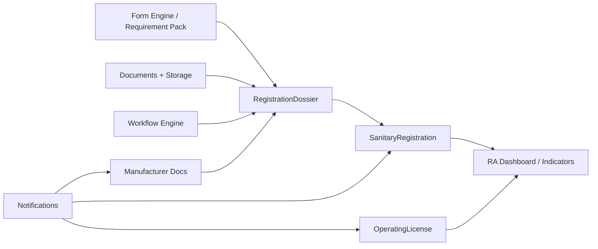

# 08 — Compliance 360 Restructuring Proposal

**Principio:** no reescribir “porque sí”. Evolucionar desde evidencia del gap.

---

## 1. Qué funciona y se conserva

| Capacidad | Por qué conservar |
|-----------|-------------------|
| Tenant / Identity / RBAC / MFA | Base SaaS demostrada |
| AuditLog | Evidencia / compliance IT |
| Storage + Notifications | Adjuntos y alertas de vencimiento |
| Documents (DMS) | Contenedor de archivos del expediente |
| Workflow Engine | Orquestar estados del dossier |
| Form Templates / Studio | Diseñar checklists por clase/autoridad |
| Suppliers | Base para Manufacturers |
| Reporting / Indicators | Dashboards post-modelo RA |
| CAPA / Audit / Risk | Valor post-market / ISO 13485 org — **después** del núcleo RA |

---

## 2. Qué debe evolucionarse (no botarse a ciegas)

| Artefacto | Problema | Evolución |
|-----------|----------|-----------|
| `Product` + Technical Sheets | Modelo nutricional | Extender o BC paralelo **MedicalDeviceProduct** + ficha técnica de dispositivo |
| `#/regulatory` Workspace | Tracker vacío | Reemplazar UI por **Registration Case Management** |
| SupplierDocument | Genérico | Tipología REGUTRACK (CLV, ISO13485, CE, apostille…) + link a Manufacturer |
| Risk module | Semántica distinta | **No fusionar** con RiskClass A/B/C del dispositivo; mantener separados |
| Form Templates | Huérfanos | Conectar como **RequirementPack** versionado del dossier |

---

## 3. Qué falta (nuevos Bounded Contexts)

### BC: Regulatory Affairs (núcleo)

Aggregates:

1. **Authority** (MINSA, CSS, …)  
2. **MedicalDeviceProduct** (marca, categoría, catálogo, fabricante, distribuidor, risk class)  
3. **SanitaryRegistration** (número CT/RS, fechas, status, authorityId, productId)  
4. **RegistrationDossier** (processType NEW|RENEWAL, milestones, status machine, opportunity, salesInput)  
5. **DossierRequirement** (checklist item + status + file link)  
6. **AuthorityObservation** (ciclo observación → corrección → re-sometimiento)

### BC: Manufacturer Documentation

- Manufacturer (puede mapear/extender Supplier)  
- ControlledCertificate (tipo, vencimiento, formato legal, countries)

### BC: Corporate Operating Licenses

- OperatingLicense  
- LicenseRenewalCase + requirement checklist  
- (Futuro) conector Panamá Digital / FADDI — **fase larga**

---

## 4. Orchestración

Template Builder **no** es el orquestador; es **proveedor de definición de requisitos/forms**.

---

## 5. Anti-patrones a evitar

| No hacer | Por qué |
|----------|---------|
| Meter 88 columnas en EnterpriseWorkspaceItem | Pierde integridad y reporting |
| Usar CAPA para registro sanitario | Semántica incorrecta |
| Usar Risk org como clase A/B/C | Contamina ambos modelos |
| Reescribir Identity/Documents | Costo sin beneficio |
| Hacer Studio el “sistema” | Genera forms, no casos |
| Integrar FADDI el día 1 | Dependencia externa; proceso manual primero |

---

## 6. Criterios de éxito de la reestructuración

1. Una fila de `CTT REGISTROS` se representa 1:1 como Product + Registration (+ Dossier si en trámite)  
2. Las 22 columnas documentales son requirements con estado/archivo  
3. Alertas usan fechas 41–42–55 reales  
4. Licencias OP tienen su caso con expiración  
5. QMS modules siguen disponibles sin ser prerequisito del RA  
