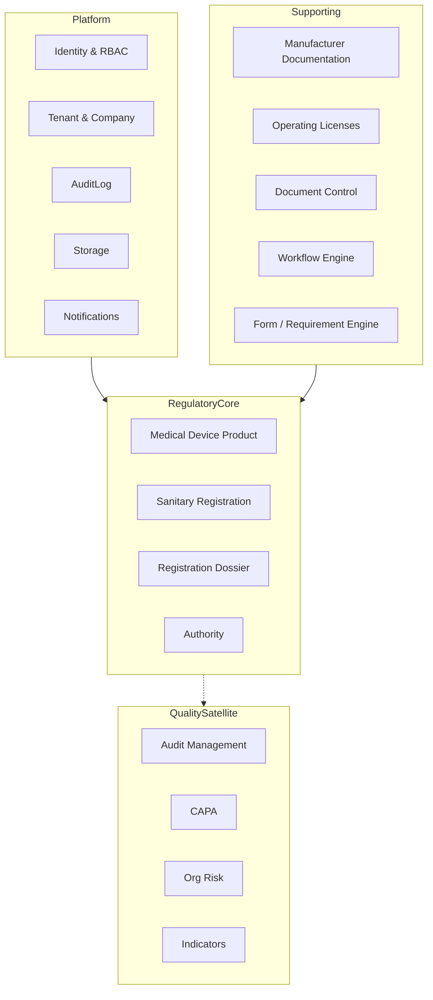

# 09 — Target Enterprise Architecture

Diseño objetivo (**no implementado**). Justificado por REGUTRACK + assets actuales C360.

---

## 1. Principios

1. **Business first:** Aggregate raíz = autorización para vender (CT/RS + licencias).  
2. **Reuse platforms services:** no reinventar IAM/storage/audit.  
3. **Case-centric UX:** el usuario RA trabaja un expediente, no 10 módulos sueltos.  
4. **Forms are definitions; cases are instances.**  
5. **QMS is satellite** until post-market needs mature.

---

## 2. Mapa de Bounded Contexts

---

## 3. Aggregates, entidades, VOs

### RegulatoryCore

| Aggregate | Entidades / VOs | Invariantes ejemplo |
|-----------|-----------------|---------------------|
| MedicalDeviceProduct | Brand, Category, CatalogCode, RiskClass, ManufacturerRef, DistributorRef | RiskClass ∈ {A,B,C}; país mercado |
| SanitaryRegistration | Number, IssuedOn, ExpiresOn, AuthorityId, Status | No activo sin número; expirado bloquea “comercializable” |
| RegistrationDossier | ProcessType, Milestones, Priority, OpportunityMoney, Comments, Status | No sometimiento sin requirements críticos Complete |
| Authority | Code, Name, Country | MINSA/CSS iniciales |

### Manufacturer Documentation

| Aggregate | Notas |
|-----------|-------|
| Manufacturer | Puede originarse desde Supplier |
| ManufacturerCertificate | Type (ISO13485, CLV, CE, FDA…), Format (apostille), ExpiresOn, Status |

### Operating Licenses

| Aggregate | Notas |
|-----------|-------|
| OperatingLicense | Company, LicenseType, ExpiresOn |
| LicenseDossier | Checklist + milestones espejo del Excel licencias |

### Platform / Supporting (existentes)

WorkflowInstance(EntityName=`RegistrationDossier`, EntityId=…)  
DocumentVersion linked to RequirementItem.StoredFileId  
FormTemplate published as RequirementPack for (Authority, RiskClass, ProcessType)

---

## 4. Domain Events (mínimo viable)

- `DossierCreated`  
- `FactoryDocumentsRequested`  
- `RequirementCompleted`  
- `DossierAssembled`  
- `DossierSubmitted`  
- `ObservationOpened` / `ObservationClosed`  
- `RegistrationActivated`  
- `RegistrationExpiring` / `RegistrationExpired`  
- `CertificateExpiring`  
- `LicenseExpiring`  

Consumidores: Notifications, Indicators, AuditLog, Reporting.

---

## 5. Workflows objetivo

| Workflow | Pasos principales |
|----------|-------------------|
| New/Renewal Registration | RequestDocs → Receive → Assemble → Submit → (Observe ↔ Correct)* → Approve → Monitor |
| License Renewal | Assemble → Submit → Approve → UpdateDigitalPlatform (manual task) |
| Certificate Intake | Request → Receive → LegalFormatCheck → Active |

Implementación: **WorkflowEngine existente** + policy rules; no nuevo motor.

---

## 6. Motores

| Motor | Rol |
|-------|-----|
| Workflow Engine | Transiciones de caso |
| Form / Requirement Engine (Studio) | Define packs de requisitos y formularios de captura |
| Document / Storage | Binarios + versionado |
| Notification | SLA / vencimientos |
| Reporting | Tableros REGUTRACK-like |

---

## 7. Integraciones (prioridad)

| Integración | Plazo | Notas |
|-------------|-------|-------|
| Ninguna externa al inicio | Inmediato | Igual que Excel + archivos |
| Importador Excel REGUTRACK | Corto | Migración de datos |
| Panamá Digital / FADDI | Largo | Solo con API estable + proceso legal |
| Email al fabricante | Medio | Via Notification providers |

---

## 8. UX objetivo (RA Console)

1. **Portfolio** — productos + CT status + days-to-expiry + \$ opportunity  
2. **Pipeline (Tubería)** — kanban por milestone  
3. **Dossier workspace** — checklist + files + dates + observations  
4. **Manufacturer vault** — certificados por fábrica  
5. **Licenses board** — Multimed / 4H  

Studio accesible desde “configurar pack de requisitos”, no como home del usuario RA.
