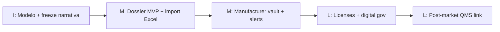

# 10 — Implementation Roadmap

Sin código. Clasificación temporal de recomendaciones.

---

## Inmediato (0–6 semanas) — “Debe hacerse ahora”

| ID | Recomendación | Por qué | Dependencia |
|----|---------------|---------|-------------|
| I1 | Congelar desarrollo de features QMS no ligadas a RA como “solución” del cliente REGUTRACK | Evita falsa cobertura | Decisión PO |
| I2 | Formalizar BC Regulatory Affairs en backlog (épicas P1–P6) | Gap 0% en núcleo | Docs 05–07 |
| I3 | Prototipo de modelo de datos CT/RS + Dossier + Requirements (diseño aprobado) | Base de evolución | Arquitectura 09 |
| I4 | Plan de migración de filas Excel → entidades (mapeo ETL) | Continuidad operativa | Excel vivo |
| I5 | Dejar claro en producto que `#/regulatory` **no** es REGUTRACK | Expectativa / riesgo comercial | UI copy / docs |
| I6 | Inventariar Requirement Pack inicial = columnas 18–39 | Entrada a Studio con propósito | Excel |

**No hacer ahora:** reescritura de Identity, Documents, Workflow, ni “Compliance Studio como sistema completo”.

---

## Mediano plazo (6–20 semanas)

| ID | Recomendación |
|----|---------------|
| M1 | Implementar Aggregates Producto médico + SanitaryRegistration + RegistrationDossier |
| M2 | UI RA Console: Portfolio + Pipeline + Dossier |
| M3 | Wire FormTemplates publicados como packs de requisitos del dossier |
| M4 | Extender/relacionar Manufacturer certificates (desde Supplier) con alertas de vencimiento |
| M5 | Workflow definition “Registration NEW/RENEWAL” sobre motor existente |
| M6 | Importación asistida desde REGUTRACK xlsx |
| M7 | Reorientar Technical Sheets: modo dispositivo (eliminar ambigüedad nutricional o BC paralelo) |
| M8 | Dashboards: vencimientos CT, pipeline aging, oportunidad \$ |

---

## Largo plazo (20+ semanas)

| ID | Recomendación |
|----|---------------|
| L1 | BC Operating Licenses completo (hoja LICENCIAS OP) |
| L2 | Observaciones multi-ronda con histórico |
| L3 | Indicadores RA formales + Reporting packs |
| L4 | Integraciones Panamá Digital / FADDI (si APIs y marco legal lo permiten) |
| L5 | Portal fabricante para carga de documentos |
| L6 | Conectar CAPA/Audit **post-market** a productos registrados (trazabilidad real) |
| L7 | Multi-país más allá de PA (hoy Excel = PA) |

---

## No debe hacerse

| ID | Ítem | Motivo evidencia |
|----|------|------------------|
| N1 | Big-bang rewrite del monolito | Platform layers útiles |
| N2 | Sustituir CT/RS con solo CAPA/Risk/Audit | Semántica distinta; Excel no opera así |
| N3 | Hacer Template Builder el dominio raíz | Genera forms; no casos ni CT |
| N4 | Fusionar RiskClass dispositivo con RiskManagement org | Contamina invariantes |
| N5 | Meter expediente en EnterpriseWorkspaceItem | Modelo insuficiente (title/code/due) |
| N6 | Integración gubernamental como MVP | Comentarios Excel muestran proceso digital externo manual; alto riesgo |

---

## Secuencia sugerida de valor

---

## Definition of Done del MVP RA (mediano)

1. 100% de filas activas de `CTT REGISTROS (2)` importables  
2. Usuario RA gestiona checklist 18–39 con archivos  
3. Pipeline refleja fechas 41–50  
4. Alertas de vencimiento CT (col 55) y certificados fabricante  
5. Sin dependencia de Workspace tracker para operación diaria  
