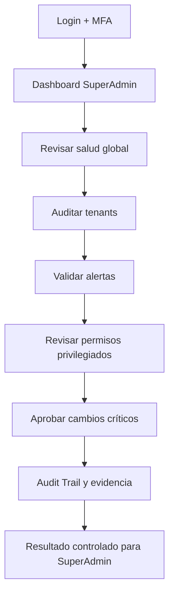
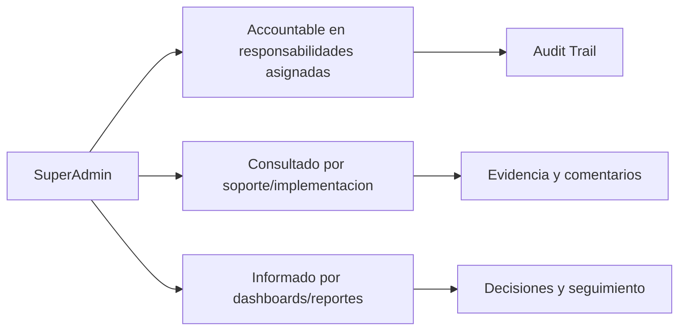

# Compliance 360 Academy

## SuperAdmin Certification

## Portada

| Campo | Valor |
| --- | --- |
| Rol | SuperAdmin |
| Nivel | Expert / Architect |
| Duración | 24 horas |
| Objetivo | Formar al administrador global capaz de gobernar toda la plataforma Compliance 360. |
| Prerrequisitos | Conocer SaaS, seguridad, RBAC, operación cloud y fundamentos de compliance. |
| Ruta de aprendizaje | Fundamentos -> Seguridad -> Módulos -> Operación -> Escenarios -> Evaluación -> Certificación |
| Certificación asociada | Compliance 360 Certified Architect |
| Estado | Markdown maestro. No generar Word hasta aprobación. |

---

# CAPÍTULO 1 - Introducción al Rol

## ¿Quién es?

El `SuperAdmin` es un perfil formal de Compliance 360 Academy. Su entrenamiento está diseñado para que pueda usar la plataforma sin revisar código fuente, entendiendo módulos, permisos, responsabilidades, riesgos y límites reales del producto.

## ¿Qué responsabilidades tiene?

| Responsabilidad | Dueño | Prioridad | Evidencia esperada |
| --- | --- | --- | --- |
| Gobernar tenants | SuperAdmin | Alta | Evidencia en Audit Trail / reporte / registro |
| Gestionar seguridad global | SuperAdmin | Alta | Evidencia en Audit Trail / reporte / registro |
| Aprobar configuraciones críticas | SuperAdmin | Alta | Evidencia en Audit Trail / reporte / registro |
| Supervisar observabilidad | SuperAdmin | Alta | Evidencia en Audit Trail / reporte / registro |
| Coordinar releases | SuperAdmin | Alta | Evidencia en Audit Trail / reporte / registro |

## ¿Qué puede hacer?

- Gobernar tenants
- Gestionar seguridad global
- Aprobar configuraciones críticas
- Supervisar observabilidad
- Coordinar releases

## ¿Qué no puede hacer?

- Operar procesos del cliente sin autorización
- Compartir cuentas
- Desactivar MFA sin análisis
- Alterar audit trail

## Flujo operativo del rol

## Matriz de responsabilidades

| Responsabilidad | Dueño | Prioridad | Evidencia esperada |
| --- | --- | --- | --- |
| Gobernar tenants | SuperAdmin | Alta | Evidencia en Audit Trail / reporte / registro |
| Gestionar seguridad global | SuperAdmin | Alta | Evidencia en Audit Trail / reporte / registro |
| Aprobar configuraciones críticas | SuperAdmin | Alta | Evidencia en Audit Trail / reporte / registro |
| Supervisar observabilidad | SuperAdmin | Alta | Evidencia en Audit Trail / reporte / registro |
| Coordinar releases | SuperAdmin | Alta | Evidencia en Audit Trail / reporte / registro |

## Matriz RACI

| Proceso | SuperAdmin | Tenant Admin | Quality Manager | Support Engineer | Consultora Admin |
| --- | --- | --- | --- | --- | --- |
| Crear tenant | R/A | I | I | C | C |
| Configurar RBAC | R/A | I | I | C | C |
| Activar MFA | R/A | I | I | C | C |
| Configurar provider | R/A | I | I | C | C |
| Revisar observability | R/A | I | I | C | C |
| Validar release | R/A | I | I | C | C |

---

# CAPÍTULO 2 - Módulos que utiliza

## Módulos asignados al rol

| Módulo | Para qué sirve | Cuándo lo usa |
| --- | --- | --- |
| Tenant Management | Sirve para tenant management | Se usa cuando el rol necesita operar o consultar esta capacidad |
| Identity | Sirve para identity | Se usa cuando el rol necesita operar o consultar esta capacidad |
| RBAC | Sirve para rbac | Se usa cuando el rol necesita operar o consultar esta capacidad |
| MFA | Sirve para mfa | Se usa cuando el rol necesita operar o consultar esta capacidad |
| Audit Trail | Sirve para audit trail | Se usa cuando el rol necesita operar o consultar esta capacidad |
| Storage | Sirve para storage | Se usa cuando el rol necesita operar o consultar esta capacidad |
| Notifications | Sirve para notifications | Se usa cuando el rol necesita operar o consultar esta capacidad |
| Observability | Sirve para observability | Se usa cuando el rol necesita operar o consultar esta capacidad |
| CI/CD | Sirve para ci/cd | Se usa cuando el rol necesita operar o consultar esta capacidad |
| Security Hardening | Sirve para security hardening | Se usa cuando el rol necesita operar o consultar esta capacidad |
| Reporting Engine | Sirve para reporting engine | Se usa cuando el rol necesita operar o consultar esta capacidad |

## Matriz de módulos

| Módulo | Tipo de uso | Frecuencia | Nota de estado |
| --- | --- | --- | --- |
| Tenant Management | Uso principal | Diario/Semanal | Ver estado real en Handbook |
| Identity | Uso principal | Diario/Semanal | Ver estado real en Handbook |
| RBAC | Uso principal | Diario/Semanal | Ver estado real en Handbook |
| MFA | Uso principal | Diario/Semanal | Ver estado real en Handbook |
| Audit Trail | Uso principal | Diario/Semanal | Ver estado real en Handbook |
| Storage | Uso complementario | Según evento | Ver estado real en Handbook |
| Notifications | Uso complementario | Según evento | Ver estado real en Handbook |
| Observability | Uso complementario | Según evento | Ver estado real en Handbook |
| CI/CD | Uso complementario | Según evento | Ver estado real en Handbook |
| Security Hardening | Uso complementario | Según evento | Ver estado real en Handbook |
| Reporting Engine | Uso complementario | Según evento | Ver estado real en Handbook |

## Diagrama de responsabilidades

---

# CAPÍTULO 3 - Configuración Inicial

## Objetivo

Preparar el acceso y el entorno de trabajo del rol `SuperAdmin` para operar sin fricción.

## Paso a paso

1. Crear o validar usuario en el tenant correcto.
2. Asignar rol y permisos correspondientes.
3. Activar MFA si el tenant lo requiere.
4. Validar acceso a dashboard.
5. Validar acceso a módulos asignados.
6. Probar operación mínima permitida.
7. Confirmar que Audit Trail registra eventos clave.
8. Documentar restricciones del rol.

## Pantalla por pantalla

| Pantalla | Acción esperada | Resultado |
| --- | --- | --- |
| Login | Ingresar credenciales y completar MFA si aplica | Sesión activa |
| Dashboard | Revisar indicadores y alertas | Prioridades visibles |
| Módulos asignados | Validar acceso según matriz | Acceso autorizado |
| Reportes | Consultar datos según permiso | Reporte visible |
| Audit Trail | Confirmar trazabilidad si aplica | Evento registrado |

## Proceso por proceso

Cada proceso debe ejecutarse con tenant, permiso y evidencia correctos. Si aparece `401`, el usuario debe renovar sesión. Si aparece `403`, debe solicitar ajuste de rol, no intentar rodear el control.

---

# CAPÍTULO 4 - Operación Diaria

## ¿Qué hace al iniciar sesión?

| Tarea | Frecuencia | Resultado esperado |
| --- | --- | --- |
| Revisar salud global | Diario | Validar resultado en dashboard/audit trail |
| Auditar tenants | Diario | Validar resultado en dashboard/audit trail |
| Validar alertas | Diario | Validar resultado en dashboard/audit trail |
| Revisar permisos privilegiados | Diario | Validar resultado en dashboard/audit trail |
| Aprobar cambios críticos | Diario | Validar resultado en dashboard/audit trail |

## ¿Qué revisa?

- Estado general del dashboard.
- Tareas asignadas.
- Alertas relacionadas con sus módulos.
- Reportes o indicadores relevantes.
- Evidencia pendiente o procesos vencidos.

## ¿Qué tareas ejecuta?

- Revisar salud global
- Auditar tenants
- Validar alertas
- Revisar permisos privilegiados
- Aprobar cambios críticos

## ¿Qué indicadores debe monitorear?

| Indicador | Uso | Acción esperada |
| --- | --- | --- |
| Tenants activos | Monitorear tendencia | Escalar desviaciones |
| Alertas críticas | Monitorear tendencia | Escalar desviaciones |
| Usuarios privilegiados | Monitorear tendencia | Escalar desviaciones |
| Health status | Monitorear tendencia | Escalar desviaciones |
| Coverage CI | Monitorear tendencia | Escalar desviaciones |

---

# CAPÍTULO 5 - Procesos Paso a Paso

### 5.1 Crear tenant

**Objetivo:** ejecutar el proceso `Crear tenant` de forma trazable, segura y alineada con el rol `SuperAdmin`.

**Prerrequisitos:**

- Usuario activo en el tenant correcto.
- Permisos del rol validados antes de iniciar.
- Datos base cargados: documentos, usuarios, módulos o providers según aplique.
- MFA completado si el tenant lo requiere.

**Pasos:**

1. Iniciar sesión en Compliance 360.
2. Confirmar tenant, rol activo y permisos visibles.
3. Abrir el módulo relacionado con `Crear tenant`.
4. Revisar dashboard, filtros y estado actual antes de modificar información.
5. Crear, actualizar, aprobar, consultar o ejecutar la acción permitida por el rol.
6. Adjuntar evidencia cuando el proceso lo requiera.
7. Validar resultado esperado y registrar observaciones.
8. Revisar que el evento quede trazado en Audit Trail o en el dashboard correspondiente.

**Resultado esperado:** el proceso queda actualizado, con responsable, evidencia, estado visible y trazabilidad.

**Errores comunes:**

- Ejecutar el proceso en el tenant equivocado.
- Usar un rol sin permiso suficiente y recibir `403 Forbidden`.
- Omitir evidencia antes de aprobación/cierre.
- Confundir módulos core operativos con workspaces genéricos.

**Buenas prácticas:**

- Documentar decisiones en comentarios o evidencia.
- Validar datos antes de aprobar.
- Usar reportes para confirmar impacto.
- Escalar a soporte con correlation id cuando exista error técnico.

### 5.2 Configurar RBAC

**Objetivo:** ejecutar el proceso `Configurar RBAC` de forma trazable, segura y alineada con el rol `SuperAdmin`.

**Prerrequisitos:**

- Usuario activo en el tenant correcto.
- Permisos del rol validados antes de iniciar.
- Datos base cargados: documentos, usuarios, módulos o providers según aplique.
- MFA completado si el tenant lo requiere.

**Pasos:**

1. Iniciar sesión en Compliance 360.
2. Confirmar tenant, rol activo y permisos visibles.
3. Abrir el módulo relacionado con `Configurar RBAC`.
4. Revisar dashboard, filtros y estado actual antes de modificar información.
5. Crear, actualizar, aprobar, consultar o ejecutar la acción permitida por el rol.
6. Adjuntar evidencia cuando el proceso lo requiera.
7. Validar resultado esperado y registrar observaciones.
8. Revisar que el evento quede trazado en Audit Trail o en el dashboard correspondiente.

**Resultado esperado:** el proceso queda actualizado, con responsable, evidencia, estado visible y trazabilidad.

**Errores comunes:**

- Ejecutar el proceso en el tenant equivocado.
- Usar un rol sin permiso suficiente y recibir `403 Forbidden`.
- Omitir evidencia antes de aprobación/cierre.
- Confundir módulos core operativos con workspaces genéricos.

**Buenas prácticas:**

- Documentar decisiones en comentarios o evidencia.
- Validar datos antes de aprobar.
- Usar reportes para confirmar impacto.
- Escalar a soporte con correlation id cuando exista error técnico.

### 5.3 Activar MFA

**Objetivo:** ejecutar el proceso `Activar MFA` de forma trazable, segura y alineada con el rol `SuperAdmin`.

**Prerrequisitos:**

- Usuario activo en el tenant correcto.
- Permisos del rol validados antes de iniciar.
- Datos base cargados: documentos, usuarios, módulos o providers según aplique.
- MFA completado si el tenant lo requiere.

**Pasos:**

1. Iniciar sesión en Compliance 360.
2. Confirmar tenant, rol activo y permisos visibles.
3. Abrir el módulo relacionado con `Activar MFA`.
4. Revisar dashboard, filtros y estado actual antes de modificar información.
5. Crear, actualizar, aprobar, consultar o ejecutar la acción permitida por el rol.
6. Adjuntar evidencia cuando el proceso lo requiera.
7. Validar resultado esperado y registrar observaciones.
8. Revisar que el evento quede trazado en Audit Trail o en el dashboard correspondiente.

**Resultado esperado:** el proceso queda actualizado, con responsable, evidencia, estado visible y trazabilidad.

**Errores comunes:**

- Ejecutar el proceso en el tenant equivocado.
- Usar un rol sin permiso suficiente y recibir `403 Forbidden`.
- Omitir evidencia antes de aprobación/cierre.
- Confundir módulos core operativos con workspaces genéricos.

**Buenas prácticas:**

- Documentar decisiones en comentarios o evidencia.
- Validar datos antes de aprobar.
- Usar reportes para confirmar impacto.
- Escalar a soporte con correlation id cuando exista error técnico.

### 5.4 Configurar provider

**Objetivo:** ejecutar el proceso `Configurar provider` de forma trazable, segura y alineada con el rol `SuperAdmin`.

**Prerrequisitos:**

- Usuario activo en el tenant correcto.
- Permisos del rol validados antes de iniciar.
- Datos base cargados: documentos, usuarios, módulos o providers según aplique.
- MFA completado si el tenant lo requiere.

**Pasos:**

1. Iniciar sesión en Compliance 360.
2. Confirmar tenant, rol activo y permisos visibles.
3. Abrir el módulo relacionado con `Configurar provider`.
4. Revisar dashboard, filtros y estado actual antes de modificar información.
5. Crear, actualizar, aprobar, consultar o ejecutar la acción permitida por el rol.
6. Adjuntar evidencia cuando el proceso lo requiera.
7. Validar resultado esperado y registrar observaciones.
8. Revisar que el evento quede trazado en Audit Trail o en el dashboard correspondiente.

**Resultado esperado:** el proceso queda actualizado, con responsable, evidencia, estado visible y trazabilidad.

**Errores comunes:**

- Ejecutar el proceso en el tenant equivocado.
- Usar un rol sin permiso suficiente y recibir `403 Forbidden`.
- Omitir evidencia antes de aprobación/cierre.
- Confundir módulos core operativos con workspaces genéricos.

**Buenas prácticas:**

- Documentar decisiones en comentarios o evidencia.
- Validar datos antes de aprobar.
- Usar reportes para confirmar impacto.
- Escalar a soporte con correlation id cuando exista error técnico.

### 5.5 Revisar observability

**Objetivo:** ejecutar el proceso `Revisar observability` de forma trazable, segura y alineada con el rol `SuperAdmin`.

**Prerrequisitos:**

- Usuario activo en el tenant correcto.
- Permisos del rol validados antes de iniciar.
- Datos base cargados: documentos, usuarios, módulos o providers según aplique.
- MFA completado si el tenant lo requiere.

**Pasos:**

1. Iniciar sesión en Compliance 360.
2. Confirmar tenant, rol activo y permisos visibles.
3. Abrir el módulo relacionado con `Revisar observability`.
4. Revisar dashboard, filtros y estado actual antes de modificar información.
5. Crear, actualizar, aprobar, consultar o ejecutar la acción permitida por el rol.
6. Adjuntar evidencia cuando el proceso lo requiera.
7. Validar resultado esperado y registrar observaciones.
8. Revisar que el evento quede trazado en Audit Trail o en el dashboard correspondiente.

**Resultado esperado:** el proceso queda actualizado, con responsable, evidencia, estado visible y trazabilidad.

**Errores comunes:**

- Ejecutar el proceso en el tenant equivocado.
- Usar un rol sin permiso suficiente y recibir `403 Forbidden`.
- Omitir evidencia antes de aprobación/cierre.
- Confundir módulos core operativos con workspaces genéricos.

**Buenas prácticas:**

- Documentar decisiones en comentarios o evidencia.
- Validar datos antes de aprobar.
- Usar reportes para confirmar impacto.
- Escalar a soporte con correlation id cuando exista error técnico.

### 5.6 Validar release

**Objetivo:** ejecutar el proceso `Validar release` de forma trazable, segura y alineada con el rol `SuperAdmin`.

**Prerrequisitos:**

- Usuario activo en el tenant correcto.
- Permisos del rol validados antes de iniciar.
- Datos base cargados: documentos, usuarios, módulos o providers según aplique.
- MFA completado si el tenant lo requiere.

**Pasos:**

1. Iniciar sesión en Compliance 360.
2. Confirmar tenant, rol activo y permisos visibles.
3. Abrir el módulo relacionado con `Validar release`.
4. Revisar dashboard, filtros y estado actual antes de modificar información.
5. Crear, actualizar, aprobar, consultar o ejecutar la acción permitida por el rol.
6. Adjuntar evidencia cuando el proceso lo requiera.
7. Validar resultado esperado y registrar observaciones.
8. Revisar que el evento quede trazado en Audit Trail o en el dashboard correspondiente.

**Resultado esperado:** el proceso queda actualizado, con responsable, evidencia, estado visible y trazabilidad.

**Errores comunes:**

- Ejecutar el proceso en el tenant equivocado.
- Usar un rol sin permiso suficiente y recibir `403 Forbidden`.
- Omitir evidencia antes de aprobación/cierre.
- Confundir módulos core operativos con workspaces genéricos.

**Buenas prácticas:**

- Documentar decisiones en comentarios o evidencia.
- Validar datos antes de aprobar.
- Usar reportes para confirmar impacto.
- Escalar a soporte con correlation id cuando exista error técnico.

---

# CAPÍTULO 6 - Escenarios Reales

### 6.1 Escenario: Alta de nuevo cliente enterprise

**Contexto empresarial:** el rol `SuperAdmin` enfrenta el caso `Alta de nuevo cliente enterprise` dentro de un tenant productivo o de capacitación.

**Objetivo del escenario:** resolver la situación sin romper trazabilidad, seguridad ni segregación de funciones.

**Acciones esperadas:**

1. Identificar el módulo principal del caso.
2. Revisar permisos y alcance del rol.
3. Consultar registros existentes, dashboard o reportes relacionados.
4. Ejecutar la acción permitida por el rol.
5. Adjuntar evidencia o comentario de soporte.
6. Confirmar estado final y responsables.
7. Escalar si el proceso requiere permisos de otro rol.

**Criterios de éxito:**

- El caso queda resuelto o escalado formalmente.
- No se realizan acciones fuera del permiso del rol.
- Existe evidencia o trazabilidad suficiente para auditoría.
- El estado final es comprensible para negocio, soporte e implementación.

**Riesgo si se opera mal:** pérdida de evidencia, aprobación indebida, error de tenant, incumplimiento de ISO 9001/BPM/HACCP o confusión comercial sobre el estado real del producto.

### 6.2 Escenario: MFA obligatorio para administradores

**Contexto empresarial:** el rol `SuperAdmin` enfrenta el caso `MFA obligatorio para administradores` dentro de un tenant productivo o de capacitación.

**Objetivo del escenario:** resolver la situación sin romper trazabilidad, seguridad ni segregación de funciones.

**Acciones esperadas:**

1. Identificar el módulo principal del caso.
2. Revisar permisos y alcance del rol.
3. Consultar registros existentes, dashboard o reportes relacionados.
4. Ejecutar la acción permitida por el rol.
5. Adjuntar evidencia o comentario de soporte.
6. Confirmar estado final y responsables.
7. Escalar si el proceso requiere permisos de otro rol.

**Criterios de éxito:**

- El caso queda resuelto o escalado formalmente.
- No se realizan acciones fuera del permiso del rol.
- Existe evidencia o trazabilidad suficiente para auditoría.
- El estado final es comprensible para negocio, soporte e implementación.

**Riesgo si se opera mal:** pérdida de evidencia, aprobación indebida, error de tenant, incumplimiento de ISO 9001/BPM/HACCP o confusión comercial sobre el estado real del producto.

### 6.3 Escenario: Provider de email fallando

**Contexto empresarial:** el rol `SuperAdmin` enfrenta el caso `Provider de email fallando` dentro de un tenant productivo o de capacitación.

**Objetivo del escenario:** resolver la situación sin romper trazabilidad, seguridad ni segregación de funciones.

**Acciones esperadas:**

1. Identificar el módulo principal del caso.
2. Revisar permisos y alcance del rol.
3. Consultar registros existentes, dashboard o reportes relacionados.
4. Ejecutar la acción permitida por el rol.
5. Adjuntar evidencia o comentario de soporte.
6. Confirmar estado final y responsables.
7. Escalar si el proceso requiere permisos de otro rol.

**Criterios de éxito:**

- El caso queda resuelto o escalado formalmente.
- No se realizan acciones fuera del permiso del rol.
- Existe evidencia o trazabilidad suficiente para auditoría.
- El estado final es comprensible para negocio, soporte e implementación.

**Riesgo si se opera mal:** pérdida de evidencia, aprobación indebida, error de tenant, incumplimiento de ISO 9001/BPM/HACCP o confusión comercial sobre el estado real del producto.

### 6.4 Escenario: Storage primario caído

**Contexto empresarial:** el rol `SuperAdmin` enfrenta el caso `Storage primario caído` dentro de un tenant productivo o de capacitación.

**Objetivo del escenario:** resolver la situación sin romper trazabilidad, seguridad ni segregación de funciones.

**Acciones esperadas:**

1. Identificar el módulo principal del caso.
2. Revisar permisos y alcance del rol.
3. Consultar registros existentes, dashboard o reportes relacionados.
4. Ejecutar la acción permitida por el rol.
5. Adjuntar evidencia o comentario de soporte.
6. Confirmar estado final y responsables.
7. Escalar si el proceso requiere permisos de otro rol.

**Criterios de éxito:**

- El caso queda resuelto o escalado formalmente.
- No se realizan acciones fuera del permiso del rol.
- Existe evidencia o trazabilidad suficiente para auditoría.
- El estado final es comprensible para negocio, soporte e implementación.

**Riesgo si se opera mal:** pérdida de evidencia, aprobación indebida, error de tenant, incumplimiento de ISO 9001/BPM/HACCP o confusión comercial sobre el estado real del producto.

### 6.5 Escenario: Auditoría de permisos

**Contexto empresarial:** el rol `SuperAdmin` enfrenta el caso `Auditoría de permisos` dentro de un tenant productivo o de capacitación.

**Objetivo del escenario:** resolver la situación sin romper trazabilidad, seguridad ni segregación de funciones.

**Acciones esperadas:**

1. Identificar el módulo principal del caso.
2. Revisar permisos y alcance del rol.
3. Consultar registros existentes, dashboard o reportes relacionados.
4. Ejecutar la acción permitida por el rol.
5. Adjuntar evidencia o comentario de soporte.
6. Confirmar estado final y responsables.
7. Escalar si el proceso requiere permisos de otro rol.

**Criterios de éxito:**

- El caso queda resuelto o escalado formalmente.
- No se realizan acciones fuera del permiso del rol.
- Existe evidencia o trazabilidad suficiente para auditoría.
- El estado final es comprensible para negocio, soporte e implementación.

**Riesgo si se opera mal:** pérdida de evidencia, aprobación indebida, error de tenant, incumplimiento de ISO 9001/BPM/HACCP o confusión comercial sobre el estado real del producto.

### 6.6 Escenario: Release bloqueado por CI

**Contexto empresarial:** el rol `SuperAdmin` enfrenta el caso `Release bloqueado por CI` dentro de un tenant productivo o de capacitación.

**Objetivo del escenario:** resolver la situación sin romper trazabilidad, seguridad ni segregación de funciones.

**Acciones esperadas:**

1. Identificar el módulo principal del caso.
2. Revisar permisos y alcance del rol.
3. Consultar registros existentes, dashboard o reportes relacionados.
4. Ejecutar la acción permitida por el rol.
5. Adjuntar evidencia o comentario de soporte.
6. Confirmar estado final y responsables.
7. Escalar si el proceso requiere permisos de otro rol.

**Criterios de éxito:**

- El caso queda resuelto o escalado formalmente.
- No se realizan acciones fuera del permiso del rol.
- Existe evidencia o trazabilidad suficiente para auditoría.
- El estado final es comprensible para negocio, soporte e implementación.

**Riesgo si se opera mal:** pérdida de evidencia, aprobación indebida, error de tenant, incumplimiento de ISO 9001/BPM/HACCP o confusión comercial sobre el estado real del producto.

### 6.7 Escenario: Tenant suspendido por riesgo

**Contexto empresarial:** el rol `SuperAdmin` enfrenta el caso `Tenant suspendido por riesgo` dentro de un tenant productivo o de capacitación.

**Objetivo del escenario:** resolver la situación sin romper trazabilidad, seguridad ni segregación de funciones.

**Acciones esperadas:**

1. Identificar el módulo principal del caso.
2. Revisar permisos y alcance del rol.
3. Consultar registros existentes, dashboard o reportes relacionados.
4. Ejecutar la acción permitida por el rol.
5. Adjuntar evidencia o comentario de soporte.
6. Confirmar estado final y responsables.
7. Escalar si el proceso requiere permisos de otro rol.

**Criterios de éxito:**

- El caso queda resuelto o escalado formalmente.
- No se realizan acciones fuera del permiso del rol.
- Existe evidencia o trazabilidad suficiente para auditoría.
- El estado final es comprensible para negocio, soporte e implementación.

**Riesgo si se opera mal:** pérdida de evidencia, aprobación indebida, error de tenant, incumplimiento de ISO 9001/BPM/HACCP o confusión comercial sobre el estado real del producto.

### 6.8 Escenario: Revisión de logs

**Contexto empresarial:** el rol `SuperAdmin` enfrenta el caso `Revisión de logs` dentro de un tenant productivo o de capacitación.

**Objetivo del escenario:** resolver la situación sin romper trazabilidad, seguridad ni segregación de funciones.

**Acciones esperadas:**

1. Identificar el módulo principal del caso.
2. Revisar permisos y alcance del rol.
3. Consultar registros existentes, dashboard o reportes relacionados.
4. Ejecutar la acción permitida por el rol.
5. Adjuntar evidencia o comentario de soporte.
6. Confirmar estado final y responsables.
7. Escalar si el proceso requiere permisos de otro rol.

**Criterios de éxito:**

- El caso queda resuelto o escalado formalmente.
- No se realizan acciones fuera del permiso del rol.
- Existe evidencia o trazabilidad suficiente para auditoría.
- El estado final es comprensible para negocio, soporte e implementación.

**Riesgo si se opera mal:** pérdida de evidencia, aprobación indebida, error de tenant, incumplimiento de ISO 9001/BPM/HACCP o confusión comercial sobre el estado real del producto.

### 6.9 Escenario: Incidente de acceso

**Contexto empresarial:** el rol `SuperAdmin` enfrenta el caso `Incidente de acceso` dentro de un tenant productivo o de capacitación.

**Objetivo del escenario:** resolver la situación sin romper trazabilidad, seguridad ni segregación de funciones.

**Acciones esperadas:**

1. Identificar el módulo principal del caso.
2. Revisar permisos y alcance del rol.
3. Consultar registros existentes, dashboard o reportes relacionados.
4. Ejecutar la acción permitida por el rol.
5. Adjuntar evidencia o comentario de soporte.
6. Confirmar estado final y responsables.
7. Escalar si el proceso requiere permisos de otro rol.

**Criterios de éxito:**

- El caso queda resuelto o escalado formalmente.
- No se realizan acciones fuera del permiso del rol.
- Existe evidencia o trazabilidad suficiente para auditoría.
- El estado final es comprensible para negocio, soporte e implementación.

**Riesgo si se opera mal:** pérdida de evidencia, aprobación indebida, error de tenant, incumplimiento de ISO 9001/BPM/HACCP o confusión comercial sobre el estado real del producto.

### 6.10 Escenario: Migración controlada

**Contexto empresarial:** el rol `SuperAdmin` enfrenta el caso `Migración controlada` dentro de un tenant productivo o de capacitación.

**Objetivo del escenario:** resolver la situación sin romper trazabilidad, seguridad ni segregación de funciones.

**Acciones esperadas:**

1. Identificar el módulo principal del caso.
2. Revisar permisos y alcance del rol.
3. Consultar registros existentes, dashboard o reportes relacionados.
4. Ejecutar la acción permitida por el rol.
5. Adjuntar evidencia o comentario de soporte.
6. Confirmar estado final y responsables.
7. Escalar si el proceso requiere permisos de otro rol.

**Criterios de éxito:**

- El caso queda resuelto o escalado formalmente.
- No se realizan acciones fuera del permiso del rol.
- Existe evidencia o trazabilidad suficiente para auditoría.
- El estado final es comprensible para negocio, soporte e implementación.

**Riesgo si se opera mal:** pérdida de evidencia, aprobación indebida, error de tenant, incumplimiento de ISO 9001/BPM/HACCP o confusión comercial sobre el estado real del producto.

---

# CAPÍTULO 7 - Mejores Prácticas

## ISO 9001

- Mantener evidencia trazable de cambios, aprobaciones y cierres.
- Usar roles claros para evitar conflictos de interés.
- Medir desempeño con indicadores y revisar tendencias.
- Gestionar no conformidades mediante CAPA con causa raíz y efectividad.

## ISO 22000, HACCP y BPM

- Controlar documentos de inocuidad y BPM como documentos vigentes.
- Vincular proveedores críticos con certificaciones y evaluaciones.
- Registrar riesgos de inocuidad con controles y tratamiento.
- Mantener evidencias de acciones preventivas y correctivas.

## Buenas prácticas SaaS

- No compartir usuarios.
- Activar MFA para roles sensibles.
- Usar permisos mínimos necesarios.
- Validar providers de email/storage antes de producción.
- Escalar errores técnicos con evidencia, hora, tenant y correlation id.

---

# CAPÍTULO 8 - Errores Comunes

| Error | Consecuencia | Prevención |
| --- | --- | --- |
| Operar en tenant incorrecto | Riesgo de privacidad y datos cruzados | Confirmar tenant al iniciar |
| Usar rol con permisos excesivos | Falta de segregación | Revisar matriz RBAC |
| Cerrar sin evidencia | Debilidad ante auditoría | Adjuntar evidencia antes de cierre |
| Ignorar módulos en estado workspace | Promesa comercial incorrecta | Aplicar regla de honestidad |
| No revisar Audit Trail | Falta de trazabilidad | Validar eventos clave |
| No probar providers | Fallas de email/storage en producción | Ejecutar tests de conexión |
| Compartir credenciales | Riesgo de seguridad | Usuario individual por persona |
| Omitir MFA | Mayor exposición de acceso | Activar MFA en roles críticos |
| No documentar decisiones | Soporte y auditoría débiles | Registrar comentarios |
| No escalar a tiempo | SLA incumplido | Clasificar severidad |

---

# CAPÍTULO 9 - Checklist Operativo

## Checklist diario

- Confirmar acceso y tenant correcto.
- Revisar dashboard y tareas asignadas.
- Revisar alertas de módulos asignados.
- Ejecutar procesos prioritarios.
- Escalar bloqueos con evidencia.

## Checklist semanal

- Revisar reportes relevantes.
- Revisar tareas vencidas.
- Validar indicadores del rol.
- Confirmar que los procesos críticos tienen responsables.
- Revisar errores recurrentes.

## Checklist mensual

- Preparar comité o revisión ejecutiva.
- Auditar permisos del rol si aplica.
- Revisar tendencias y desviaciones.
- Confirmar cierre de procesos críticos.
- Documentar oportunidades de mejora.

## Checklist trimestral

- Revisar matriz de responsabilidades.
- Validar capacitación de usuarios.
- Revisar efectividad de controles.
- Actualizar procesos según cambios normativos.
- Preparar evidencia para auditorías.

---

# CAPÍTULO 10 - Evaluación Teórica

**Instrucciones:** responder 50 preguntas de opción múltiple. Puntaje recomendado: 2 puntos por pregunta. Mínimo de aprobación: 80/100.

### Pregunta 1

**Situación:** el rol `SuperAdmin` debe trabajar con `Tenant Management` en Compliance 360.

A. Validar permisos, tenant, evidencia y estado antes de operar Tenant Management.
B. Compartir credenciales para acelerar el trabajo sobre Tenant Management.
C. Omitir Audit Trail porque el proceso Tenant Management es interno.
D. Prometer funcionalidad no implementada para Tenant Management sin aclaración.

**Respuesta correcta:** A

**Explicación:** la respuesta correcta protege multitenancy, RBAC, trazabilidad, evidencia y honestidad del producto. Las demás opciones introducen riesgos de seguridad, auditoría, soporte o venta incorrecta.

### Pregunta 2

**Situación:** el rol `SuperAdmin` debe trabajar con `Identity` en Compliance 360.

A. Compartir credenciales para acelerar el trabajo sobre Identity.
B. Validar permisos, tenant, evidencia y estado antes de operar Identity.
C. Omitir Audit Trail porque el proceso Identity es interno.
D. Prometer funcionalidad no implementada para Identity sin aclaración.

**Respuesta correcta:** B

**Explicación:** la respuesta correcta protege multitenancy, RBAC, trazabilidad, evidencia y honestidad del producto. Las demás opciones introducen riesgos de seguridad, auditoría, soporte o venta incorrecta.

### Pregunta 3

**Situación:** el rol `SuperAdmin` debe trabajar con `RBAC` en Compliance 360.

A. Omitir Audit Trail porque el proceso RBAC es interno.
B. Compartir credenciales para acelerar el trabajo sobre RBAC.
C. Validar permisos, tenant, evidencia y estado antes de operar RBAC.
D. Prometer funcionalidad no implementada para RBAC sin aclaración.

**Respuesta correcta:** C

**Explicación:** la respuesta correcta protege multitenancy, RBAC, trazabilidad, evidencia y honestidad del producto. Las demás opciones introducen riesgos de seguridad, auditoría, soporte o venta incorrecta.

### Pregunta 4

**Situación:** el rol `SuperAdmin` debe trabajar con `MFA` en Compliance 360.

A. Prometer funcionalidad no implementada para MFA sin aclaración.
B. Compartir credenciales para acelerar el trabajo sobre MFA.
C. Omitir Audit Trail porque el proceso MFA es interno.
D. Validar permisos, tenant, evidencia y estado antes de operar MFA.

**Respuesta correcta:** D

**Explicación:** la respuesta correcta protege multitenancy, RBAC, trazabilidad, evidencia y honestidad del producto. Las demás opciones introducen riesgos de seguridad, auditoría, soporte o venta incorrecta.

### Pregunta 5

**Situación:** el rol `SuperAdmin` debe trabajar con `Audit Trail` en Compliance 360.

A. Validar permisos, tenant, evidencia y estado antes de operar Audit Trail.
B. Compartir credenciales para acelerar el trabajo sobre Audit Trail.
C. Omitir Audit Trail porque el proceso Audit Trail es interno.
D. Prometer funcionalidad no implementada para Audit Trail sin aclaración.

**Respuesta correcta:** A

**Explicación:** la respuesta correcta protege multitenancy, RBAC, trazabilidad, evidencia y honestidad del producto. Las demás opciones introducen riesgos de seguridad, auditoría, soporte o venta incorrecta.

### Pregunta 6

**Situación:** el rol `SuperAdmin` debe trabajar con `Storage` en Compliance 360.

A. Compartir credenciales para acelerar el trabajo sobre Storage.
B. Validar permisos, tenant, evidencia y estado antes de operar Storage.
C. Omitir Audit Trail porque el proceso Storage es interno.
D. Prometer funcionalidad no implementada para Storage sin aclaración.

**Respuesta correcta:** B

**Explicación:** la respuesta correcta protege multitenancy, RBAC, trazabilidad, evidencia y honestidad del producto. Las demás opciones introducen riesgos de seguridad, auditoría, soporte o venta incorrecta.

### Pregunta 7

**Situación:** el rol `SuperAdmin` debe trabajar con `Notifications` en Compliance 360.

A. Omitir Audit Trail porque el proceso Notifications es interno.
B. Compartir credenciales para acelerar el trabajo sobre Notifications.
C. Validar permisos, tenant, evidencia y estado antes de operar Notifications.
D. Prometer funcionalidad no implementada para Notifications sin aclaración.

**Respuesta correcta:** C

**Explicación:** la respuesta correcta protege multitenancy, RBAC, trazabilidad, evidencia y honestidad del producto. Las demás opciones introducen riesgos de seguridad, auditoría, soporte o venta incorrecta.

### Pregunta 8

**Situación:** el rol `SuperAdmin` debe trabajar con `Observability` en Compliance 360.

A. Prometer funcionalidad no implementada para Observability sin aclaración.
B. Compartir credenciales para acelerar el trabajo sobre Observability.
C. Omitir Audit Trail porque el proceso Observability es interno.
D. Validar permisos, tenant, evidencia y estado antes de operar Observability.

**Respuesta correcta:** D

**Explicación:** la respuesta correcta protege multitenancy, RBAC, trazabilidad, evidencia y honestidad del producto. Las demás opciones introducen riesgos de seguridad, auditoría, soporte o venta incorrecta.

### Pregunta 9

**Situación:** el rol `SuperAdmin` debe trabajar con `CI/CD` en Compliance 360.

A. Validar permisos, tenant, evidencia y estado antes de operar CI/CD.
B. Compartir credenciales para acelerar el trabajo sobre CI/CD.
C. Omitir Audit Trail porque el proceso CI/CD es interno.
D. Prometer funcionalidad no implementada para CI/CD sin aclaración.

**Respuesta correcta:** A

**Explicación:** la respuesta correcta protege multitenancy, RBAC, trazabilidad, evidencia y honestidad del producto. Las demás opciones introducen riesgos de seguridad, auditoría, soporte o venta incorrecta.

### Pregunta 10

**Situación:** el rol `SuperAdmin` debe trabajar con `Security Hardening` en Compliance 360.

A. Compartir credenciales para acelerar el trabajo sobre Security Hardening.
B. Validar permisos, tenant, evidencia y estado antes de operar Security Hardening.
C. Omitir Audit Trail porque el proceso Security Hardening es interno.
D. Prometer funcionalidad no implementada para Security Hardening sin aclaración.

**Respuesta correcta:** B

**Explicación:** la respuesta correcta protege multitenancy, RBAC, trazabilidad, evidencia y honestidad del producto. Las demás opciones introducen riesgos de seguridad, auditoría, soporte o venta incorrecta.

### Pregunta 11

**Situación:** el rol `SuperAdmin` debe trabajar con `Reporting Engine` en Compliance 360.

A. Omitir Audit Trail porque el proceso Reporting Engine es interno.
B. Compartir credenciales para acelerar el trabajo sobre Reporting Engine.
C. Validar permisos, tenant, evidencia y estado antes de operar Reporting Engine.
D. Prometer funcionalidad no implementada para Reporting Engine sin aclaración.

**Respuesta correcta:** C

**Explicación:** la respuesta correcta protege multitenancy, RBAC, trazabilidad, evidencia y honestidad del producto. Las demás opciones introducen riesgos de seguridad, auditoría, soporte o venta incorrecta.

### Pregunta 12

**Situación:** el rol `SuperAdmin` debe trabajar con `Crear tenant` en Compliance 360.

A. Prometer funcionalidad no implementada para Crear tenant sin aclaración.
B. Compartir credenciales para acelerar el trabajo sobre Crear tenant.
C. Omitir Audit Trail porque el proceso Crear tenant es interno.
D. Validar permisos, tenant, evidencia y estado antes de operar Crear tenant.

**Respuesta correcta:** D

**Explicación:** la respuesta correcta protege multitenancy, RBAC, trazabilidad, evidencia y honestidad del producto. Las demás opciones introducen riesgos de seguridad, auditoría, soporte o venta incorrecta.

### Pregunta 13

**Situación:** el rol `SuperAdmin` debe trabajar con `Configurar RBAC` en Compliance 360.

A. Validar permisos, tenant, evidencia y estado antes de operar Configurar RBAC.
B. Compartir credenciales para acelerar el trabajo sobre Configurar RBAC.
C. Omitir Audit Trail porque el proceso Configurar RBAC es interno.
D. Prometer funcionalidad no implementada para Configurar RBAC sin aclaración.

**Respuesta correcta:** A

**Explicación:** la respuesta correcta protege multitenancy, RBAC, trazabilidad, evidencia y honestidad del producto. Las demás opciones introducen riesgos de seguridad, auditoría, soporte o venta incorrecta.

### Pregunta 14

**Situación:** el rol `SuperAdmin` debe trabajar con `Activar MFA` en Compliance 360.

A. Compartir credenciales para acelerar el trabajo sobre Activar MFA.
B. Validar permisos, tenant, evidencia y estado antes de operar Activar MFA.
C. Omitir Audit Trail porque el proceso Activar MFA es interno.
D. Prometer funcionalidad no implementada para Activar MFA sin aclaración.

**Respuesta correcta:** B

**Explicación:** la respuesta correcta protege multitenancy, RBAC, trazabilidad, evidencia y honestidad del producto. Las demás opciones introducen riesgos de seguridad, auditoría, soporte o venta incorrecta.

### Pregunta 15

**Situación:** el rol `SuperAdmin` debe trabajar con `Configurar provider` en Compliance 360.

A. Omitir Audit Trail porque el proceso Configurar provider es interno.
B. Compartir credenciales para acelerar el trabajo sobre Configurar provider.
C. Validar permisos, tenant, evidencia y estado antes de operar Configurar provider.
D. Prometer funcionalidad no implementada para Configurar provider sin aclaración.

**Respuesta correcta:** C

**Explicación:** la respuesta correcta protege multitenancy, RBAC, trazabilidad, evidencia y honestidad del producto. Las demás opciones introducen riesgos de seguridad, auditoría, soporte o venta incorrecta.

### Pregunta 16

**Situación:** el rol `SuperAdmin` debe trabajar con `Revisar observability` en Compliance 360.

A. Prometer funcionalidad no implementada para Revisar observability sin aclaración.
B. Compartir credenciales para acelerar el trabajo sobre Revisar observability.
C. Omitir Audit Trail porque el proceso Revisar observability es interno.
D. Validar permisos, tenant, evidencia y estado antes de operar Revisar observability.

**Respuesta correcta:** D

**Explicación:** la respuesta correcta protege multitenancy, RBAC, trazabilidad, evidencia y honestidad del producto. Las demás opciones introducen riesgos de seguridad, auditoría, soporte o venta incorrecta.

### Pregunta 17

**Situación:** el rol `SuperAdmin` debe trabajar con `Validar release` en Compliance 360.

A. Validar permisos, tenant, evidencia y estado antes de operar Validar release.
B. Compartir credenciales para acelerar el trabajo sobre Validar release.
C. Omitir Audit Trail porque el proceso Validar release es interno.
D. Prometer funcionalidad no implementada para Validar release sin aclaración.

**Respuesta correcta:** A

**Explicación:** la respuesta correcta protege multitenancy, RBAC, trazabilidad, evidencia y honestidad del producto. Las demás opciones introducen riesgos de seguridad, auditoría, soporte o venta incorrecta.

### Pregunta 18

**Situación:** el rol `SuperAdmin` debe trabajar con `RBAC` en Compliance 360.

A. Compartir credenciales para acelerar el trabajo sobre RBAC.
B. Validar permisos, tenant, evidencia y estado antes de operar RBAC.
C. Omitir Audit Trail porque el proceso RBAC es interno.
D. Prometer funcionalidad no implementada para RBAC sin aclaración.

**Respuesta correcta:** B

**Explicación:** la respuesta correcta protege multitenancy, RBAC, trazabilidad, evidencia y honestidad del producto. Las demás opciones introducen riesgos de seguridad, auditoría, soporte o venta incorrecta.

### Pregunta 19

**Situación:** el rol `SuperAdmin` debe trabajar con `MFA` en Compliance 360.

A. Omitir Audit Trail porque el proceso MFA es interno.
B. Compartir credenciales para acelerar el trabajo sobre MFA.
C. Validar permisos, tenant, evidencia y estado antes de operar MFA.
D. Prometer funcionalidad no implementada para MFA sin aclaración.

**Respuesta correcta:** C

**Explicación:** la respuesta correcta protege multitenancy, RBAC, trazabilidad, evidencia y honestidad del producto. Las demás opciones introducen riesgos de seguridad, auditoría, soporte o venta incorrecta.

### Pregunta 20

**Situación:** el rol `SuperAdmin` debe trabajar con `Audit Trail` en Compliance 360.

A. Prometer funcionalidad no implementada para Audit Trail sin aclaración.
B. Compartir credenciales para acelerar el trabajo sobre Audit Trail.
C. Omitir Audit Trail porque el proceso Audit Trail es interno.
D. Validar permisos, tenant, evidencia y estado antes de operar Audit Trail.

**Respuesta correcta:** D

**Explicación:** la respuesta correcta protege multitenancy, RBAC, trazabilidad, evidencia y honestidad del producto. Las demás opciones introducen riesgos de seguridad, auditoría, soporte o venta incorrecta.

### Pregunta 21

**Situación:** el rol `SuperAdmin` debe trabajar con `Estado real del módulo` en Compliance 360.

A. Validar permisos, tenant, evidencia y estado antes de operar Estado real del módulo.
B. Compartir credenciales para acelerar el trabajo sobre Estado real del módulo.
C. Omitir Audit Trail porque el proceso Estado real del módulo es interno.
D. Prometer funcionalidad no implementada para Estado real del módulo sin aclaración.

**Respuesta correcta:** A

**Explicación:** la respuesta correcta protege multitenancy, RBAC, trazabilidad, evidencia y honestidad del producto. Las demás opciones introducen riesgos de seguridad, auditoría, soporte o venta incorrecta.

### Pregunta 22

**Situación:** el rol `SuperAdmin` debe trabajar con `Buenas prácticas ISO` en Compliance 360.

A. Compartir credenciales para acelerar el trabajo sobre Buenas prácticas ISO.
B. Validar permisos, tenant, evidencia y estado antes de operar Buenas prácticas ISO.
C. Omitir Audit Trail porque el proceso Buenas prácticas ISO es interno.
D. Prometer funcionalidad no implementada para Buenas prácticas ISO sin aclaración.

**Respuesta correcta:** B

**Explicación:** la respuesta correcta protege multitenancy, RBAC, trazabilidad, evidencia y honestidad del producto. Las demás opciones introducen riesgos de seguridad, auditoría, soporte o venta incorrecta.

### Pregunta 23

**Situación:** el rol `SuperAdmin` debe trabajar con `Tenant Management` en Compliance 360.

A. Omitir Audit Trail porque el proceso Tenant Management es interno.
B. Compartir credenciales para acelerar el trabajo sobre Tenant Management.
C. Validar permisos, tenant, evidencia y estado antes de operar Tenant Management.
D. Prometer funcionalidad no implementada para Tenant Management sin aclaración.

**Respuesta correcta:** C

**Explicación:** la respuesta correcta protege multitenancy, RBAC, trazabilidad, evidencia y honestidad del producto. Las demás opciones introducen riesgos de seguridad, auditoría, soporte o venta incorrecta.

### Pregunta 24

**Situación:** el rol `SuperAdmin` debe trabajar con `Identity` en Compliance 360.

A. Prometer funcionalidad no implementada para Identity sin aclaración.
B. Compartir credenciales para acelerar el trabajo sobre Identity.
C. Omitir Audit Trail porque el proceso Identity es interno.
D. Validar permisos, tenant, evidencia y estado antes de operar Identity.

**Respuesta correcta:** D

**Explicación:** la respuesta correcta protege multitenancy, RBAC, trazabilidad, evidencia y honestidad del producto. Las demás opciones introducen riesgos de seguridad, auditoría, soporte o venta incorrecta.

### Pregunta 25

**Situación:** el rol `SuperAdmin` debe trabajar con `RBAC` en Compliance 360.

A. Validar permisos, tenant, evidencia y estado antes de operar RBAC.
B. Compartir credenciales para acelerar el trabajo sobre RBAC.
C. Omitir Audit Trail porque el proceso RBAC es interno.
D. Prometer funcionalidad no implementada para RBAC sin aclaración.

**Respuesta correcta:** A

**Explicación:** la respuesta correcta protege multitenancy, RBAC, trazabilidad, evidencia y honestidad del producto. Las demás opciones introducen riesgos de seguridad, auditoría, soporte o venta incorrecta.

### Pregunta 26

**Situación:** el rol `SuperAdmin` debe trabajar con `MFA` en Compliance 360.

A. Compartir credenciales para acelerar el trabajo sobre MFA.
B. Validar permisos, tenant, evidencia y estado antes de operar MFA.
C. Omitir Audit Trail porque el proceso MFA es interno.
D. Prometer funcionalidad no implementada para MFA sin aclaración.

**Respuesta correcta:** B

**Explicación:** la respuesta correcta protege multitenancy, RBAC, trazabilidad, evidencia y honestidad del producto. Las demás opciones introducen riesgos de seguridad, auditoría, soporte o venta incorrecta.

### Pregunta 27

**Situación:** el rol `SuperAdmin` debe trabajar con `Audit Trail` en Compliance 360.

A. Omitir Audit Trail porque el proceso Audit Trail es interno.
B. Compartir credenciales para acelerar el trabajo sobre Audit Trail.
C. Validar permisos, tenant, evidencia y estado antes de operar Audit Trail.
D. Prometer funcionalidad no implementada para Audit Trail sin aclaración.

**Respuesta correcta:** C

**Explicación:** la respuesta correcta protege multitenancy, RBAC, trazabilidad, evidencia y honestidad del producto. Las demás opciones introducen riesgos de seguridad, auditoría, soporte o venta incorrecta.

### Pregunta 28

**Situación:** el rol `SuperAdmin` debe trabajar con `Storage` en Compliance 360.

A. Prometer funcionalidad no implementada para Storage sin aclaración.
B. Compartir credenciales para acelerar el trabajo sobre Storage.
C. Omitir Audit Trail porque el proceso Storage es interno.
D. Validar permisos, tenant, evidencia y estado antes de operar Storage.

**Respuesta correcta:** D

**Explicación:** la respuesta correcta protege multitenancy, RBAC, trazabilidad, evidencia y honestidad del producto. Las demás opciones introducen riesgos de seguridad, auditoría, soporte o venta incorrecta.

### Pregunta 29

**Situación:** el rol `SuperAdmin` debe trabajar con `Notifications` en Compliance 360.

A. Validar permisos, tenant, evidencia y estado antes de operar Notifications.
B. Compartir credenciales para acelerar el trabajo sobre Notifications.
C. Omitir Audit Trail porque el proceso Notifications es interno.
D. Prometer funcionalidad no implementada para Notifications sin aclaración.

**Respuesta correcta:** A

**Explicación:** la respuesta correcta protege multitenancy, RBAC, trazabilidad, evidencia y honestidad del producto. Las demás opciones introducen riesgos de seguridad, auditoría, soporte o venta incorrecta.

### Pregunta 30

**Situación:** el rol `SuperAdmin` debe trabajar con `Observability` en Compliance 360.

A. Compartir credenciales para acelerar el trabajo sobre Observability.
B. Validar permisos, tenant, evidencia y estado antes de operar Observability.
C. Omitir Audit Trail porque el proceso Observability es interno.
D. Prometer funcionalidad no implementada para Observability sin aclaración.

**Respuesta correcta:** B

**Explicación:** la respuesta correcta protege multitenancy, RBAC, trazabilidad, evidencia y honestidad del producto. Las demás opciones introducen riesgos de seguridad, auditoría, soporte o venta incorrecta.

### Pregunta 31

**Situación:** el rol `SuperAdmin` debe trabajar con `CI/CD` en Compliance 360.

A. Omitir Audit Trail porque el proceso CI/CD es interno.
B. Compartir credenciales para acelerar el trabajo sobre CI/CD.
C. Validar permisos, tenant, evidencia y estado antes de operar CI/CD.
D. Prometer funcionalidad no implementada para CI/CD sin aclaración.

**Respuesta correcta:** C

**Explicación:** la respuesta correcta protege multitenancy, RBAC, trazabilidad, evidencia y honestidad del producto. Las demás opciones introducen riesgos de seguridad, auditoría, soporte o venta incorrecta.

### Pregunta 32

**Situación:** el rol `SuperAdmin` debe trabajar con `Security Hardening` en Compliance 360.

A. Prometer funcionalidad no implementada para Security Hardening sin aclaración.
B. Compartir credenciales para acelerar el trabajo sobre Security Hardening.
C. Omitir Audit Trail porque el proceso Security Hardening es interno.
D. Validar permisos, tenant, evidencia y estado antes de operar Security Hardening.

**Respuesta correcta:** D

**Explicación:** la respuesta correcta protege multitenancy, RBAC, trazabilidad, evidencia y honestidad del producto. Las demás opciones introducen riesgos de seguridad, auditoría, soporte o venta incorrecta.

### Pregunta 33

**Situación:** el rol `SuperAdmin` debe trabajar con `Reporting Engine` en Compliance 360.

A. Validar permisos, tenant, evidencia y estado antes de operar Reporting Engine.
B. Compartir credenciales para acelerar el trabajo sobre Reporting Engine.
C. Omitir Audit Trail porque el proceso Reporting Engine es interno.
D. Prometer funcionalidad no implementada para Reporting Engine sin aclaración.

**Respuesta correcta:** A

**Explicación:** la respuesta correcta protege multitenancy, RBAC, trazabilidad, evidencia y honestidad del producto. Las demás opciones introducen riesgos de seguridad, auditoría, soporte o venta incorrecta.

### Pregunta 34

**Situación:** el rol `SuperAdmin` debe trabajar con `Crear tenant` en Compliance 360.

A. Compartir credenciales para acelerar el trabajo sobre Crear tenant.
B. Validar permisos, tenant, evidencia y estado antes de operar Crear tenant.
C. Omitir Audit Trail porque el proceso Crear tenant es interno.
D. Prometer funcionalidad no implementada para Crear tenant sin aclaración.

**Respuesta correcta:** B

**Explicación:** la respuesta correcta protege multitenancy, RBAC, trazabilidad, evidencia y honestidad del producto. Las demás opciones introducen riesgos de seguridad, auditoría, soporte o venta incorrecta.

### Pregunta 35

**Situación:** el rol `SuperAdmin` debe trabajar con `Configurar RBAC` en Compliance 360.

A. Omitir Audit Trail porque el proceso Configurar RBAC es interno.
B. Compartir credenciales para acelerar el trabajo sobre Configurar RBAC.
C. Validar permisos, tenant, evidencia y estado antes de operar Configurar RBAC.
D. Prometer funcionalidad no implementada para Configurar RBAC sin aclaración.

**Respuesta correcta:** C

**Explicación:** la respuesta correcta protege multitenancy, RBAC, trazabilidad, evidencia y honestidad del producto. Las demás opciones introducen riesgos de seguridad, auditoría, soporte o venta incorrecta.

### Pregunta 36

**Situación:** el rol `SuperAdmin` debe trabajar con `Activar MFA` en Compliance 360.

A. Prometer funcionalidad no implementada para Activar MFA sin aclaración.
B. Compartir credenciales para acelerar el trabajo sobre Activar MFA.
C. Omitir Audit Trail porque el proceso Activar MFA es interno.
D. Validar permisos, tenant, evidencia y estado antes de operar Activar MFA.

**Respuesta correcta:** D

**Explicación:** la respuesta correcta protege multitenancy, RBAC, trazabilidad, evidencia y honestidad del producto. Las demás opciones introducen riesgos de seguridad, auditoría, soporte o venta incorrecta.

### Pregunta 37

**Situación:** el rol `SuperAdmin` debe trabajar con `Configurar provider` en Compliance 360.

A. Validar permisos, tenant, evidencia y estado antes de operar Configurar provider.
B. Compartir credenciales para acelerar el trabajo sobre Configurar provider.
C. Omitir Audit Trail porque el proceso Configurar provider es interno.
D. Prometer funcionalidad no implementada para Configurar provider sin aclaración.

**Respuesta correcta:** A

**Explicación:** la respuesta correcta protege multitenancy, RBAC, trazabilidad, evidencia y honestidad del producto. Las demás opciones introducen riesgos de seguridad, auditoría, soporte o venta incorrecta.

### Pregunta 38

**Situación:** el rol `SuperAdmin` debe trabajar con `Revisar observability` en Compliance 360.

A. Compartir credenciales para acelerar el trabajo sobre Revisar observability.
B. Validar permisos, tenant, evidencia y estado antes de operar Revisar observability.
C. Omitir Audit Trail porque el proceso Revisar observability es interno.
D. Prometer funcionalidad no implementada para Revisar observability sin aclaración.

**Respuesta correcta:** B

**Explicación:** la respuesta correcta protege multitenancy, RBAC, trazabilidad, evidencia y honestidad del producto. Las demás opciones introducen riesgos de seguridad, auditoría, soporte o venta incorrecta.

### Pregunta 39

**Situación:** el rol `SuperAdmin` debe trabajar con `Validar release` en Compliance 360.

A. Omitir Audit Trail porque el proceso Validar release es interno.
B. Compartir credenciales para acelerar el trabajo sobre Validar release.
C. Validar permisos, tenant, evidencia y estado antes de operar Validar release.
D. Prometer funcionalidad no implementada para Validar release sin aclaración.

**Respuesta correcta:** C

**Explicación:** la respuesta correcta protege multitenancy, RBAC, trazabilidad, evidencia y honestidad del producto. Las demás opciones introducen riesgos de seguridad, auditoría, soporte o venta incorrecta.

### Pregunta 40

**Situación:** el rol `SuperAdmin` debe trabajar con `RBAC` en Compliance 360.

A. Prometer funcionalidad no implementada para RBAC sin aclaración.
B. Compartir credenciales para acelerar el trabajo sobre RBAC.
C. Omitir Audit Trail porque el proceso RBAC es interno.
D. Validar permisos, tenant, evidencia y estado antes de operar RBAC.

**Respuesta correcta:** D

**Explicación:** la respuesta correcta protege multitenancy, RBAC, trazabilidad, evidencia y honestidad del producto. Las demás opciones introducen riesgos de seguridad, auditoría, soporte o venta incorrecta.

### Pregunta 41

**Situación:** el rol `SuperAdmin` debe trabajar con `MFA` en Compliance 360.

A. Validar permisos, tenant, evidencia y estado antes de operar MFA.
B. Compartir credenciales para acelerar el trabajo sobre MFA.
C. Omitir Audit Trail porque el proceso MFA es interno.
D. Prometer funcionalidad no implementada para MFA sin aclaración.

**Respuesta correcta:** A

**Explicación:** la respuesta correcta protege multitenancy, RBAC, trazabilidad, evidencia y honestidad del producto. Las demás opciones introducen riesgos de seguridad, auditoría, soporte o venta incorrecta.

### Pregunta 42

**Situación:** el rol `SuperAdmin` debe trabajar con `Audit Trail` en Compliance 360.

A. Compartir credenciales para acelerar el trabajo sobre Audit Trail.
B. Validar permisos, tenant, evidencia y estado antes de operar Audit Trail.
C. Omitir Audit Trail porque el proceso Audit Trail es interno.
D. Prometer funcionalidad no implementada para Audit Trail sin aclaración.

**Respuesta correcta:** B

**Explicación:** la respuesta correcta protege multitenancy, RBAC, trazabilidad, evidencia y honestidad del producto. Las demás opciones introducen riesgos de seguridad, auditoría, soporte o venta incorrecta.

### Pregunta 43

**Situación:** el rol `SuperAdmin` debe trabajar con `Estado real del módulo` en Compliance 360.

A. Omitir Audit Trail porque el proceso Estado real del módulo es interno.
B. Compartir credenciales para acelerar el trabajo sobre Estado real del módulo.
C. Validar permisos, tenant, evidencia y estado antes de operar Estado real del módulo.
D. Prometer funcionalidad no implementada para Estado real del módulo sin aclaración.

**Respuesta correcta:** C

**Explicación:** la respuesta correcta protege multitenancy, RBAC, trazabilidad, evidencia y honestidad del producto. Las demás opciones introducen riesgos de seguridad, auditoría, soporte o venta incorrecta.

### Pregunta 44

**Situación:** el rol `SuperAdmin` debe trabajar con `Buenas prácticas ISO` en Compliance 360.

A. Prometer funcionalidad no implementada para Buenas prácticas ISO sin aclaración.
B. Compartir credenciales para acelerar el trabajo sobre Buenas prácticas ISO.
C. Omitir Audit Trail porque el proceso Buenas prácticas ISO es interno.
D. Validar permisos, tenant, evidencia y estado antes de operar Buenas prácticas ISO.

**Respuesta correcta:** D

**Explicación:** la respuesta correcta protege multitenancy, RBAC, trazabilidad, evidencia y honestidad del producto. Las demás opciones introducen riesgos de seguridad, auditoría, soporte o venta incorrecta.

### Pregunta 45

**Situación:** el rol `SuperAdmin` debe trabajar con `Tenant Management` en Compliance 360.

A. Validar permisos, tenant, evidencia y estado antes de operar Tenant Management.
B. Compartir credenciales para acelerar el trabajo sobre Tenant Management.
C. Omitir Audit Trail porque el proceso Tenant Management es interno.
D. Prometer funcionalidad no implementada para Tenant Management sin aclaración.

**Respuesta correcta:** A

**Explicación:** la respuesta correcta protege multitenancy, RBAC, trazabilidad, evidencia y honestidad del producto. Las demás opciones introducen riesgos de seguridad, auditoría, soporte o venta incorrecta.

### Pregunta 46

**Situación:** el rol `SuperAdmin` debe trabajar con `Identity` en Compliance 360.

A. Compartir credenciales para acelerar el trabajo sobre Identity.
B. Validar permisos, tenant, evidencia y estado antes de operar Identity.
C. Omitir Audit Trail porque el proceso Identity es interno.
D. Prometer funcionalidad no implementada para Identity sin aclaración.

**Respuesta correcta:** B

**Explicación:** la respuesta correcta protege multitenancy, RBAC, trazabilidad, evidencia y honestidad del producto. Las demás opciones introducen riesgos de seguridad, auditoría, soporte o venta incorrecta.

### Pregunta 47

**Situación:** el rol `SuperAdmin` debe trabajar con `RBAC` en Compliance 360.

A. Omitir Audit Trail porque el proceso RBAC es interno.
B. Compartir credenciales para acelerar el trabajo sobre RBAC.
C. Validar permisos, tenant, evidencia y estado antes de operar RBAC.
D. Prometer funcionalidad no implementada para RBAC sin aclaración.

**Respuesta correcta:** C

**Explicación:** la respuesta correcta protege multitenancy, RBAC, trazabilidad, evidencia y honestidad del producto. Las demás opciones introducen riesgos de seguridad, auditoría, soporte o venta incorrecta.

### Pregunta 48

**Situación:** el rol `SuperAdmin` debe trabajar con `MFA` en Compliance 360.

A. Prometer funcionalidad no implementada para MFA sin aclaración.
B. Compartir credenciales para acelerar el trabajo sobre MFA.
C. Omitir Audit Trail porque el proceso MFA es interno.
D. Validar permisos, tenant, evidencia y estado antes de operar MFA.

**Respuesta correcta:** D

**Explicación:** la respuesta correcta protege multitenancy, RBAC, trazabilidad, evidencia y honestidad del producto. Las demás opciones introducen riesgos de seguridad, auditoría, soporte o venta incorrecta.

### Pregunta 49

**Situación:** el rol `SuperAdmin` debe trabajar con `Audit Trail` en Compliance 360.

A. Validar permisos, tenant, evidencia y estado antes de operar Audit Trail.
B. Compartir credenciales para acelerar el trabajo sobre Audit Trail.
C. Omitir Audit Trail porque el proceso Audit Trail es interno.
D. Prometer funcionalidad no implementada para Audit Trail sin aclaración.

**Respuesta correcta:** A

**Explicación:** la respuesta correcta protege multitenancy, RBAC, trazabilidad, evidencia y honestidad del producto. Las demás opciones introducen riesgos de seguridad, auditoría, soporte o venta incorrecta.

### Pregunta 50

**Situación:** el rol `SuperAdmin` debe trabajar con `Storage` en Compliance 360.

A. Compartir credenciales para acelerar el trabajo sobre Storage.
B. Validar permisos, tenant, evidencia y estado antes de operar Storage.
C. Omitir Audit Trail porque el proceso Storage es interno.
D. Prometer funcionalidad no implementada para Storage sin aclaración.

**Respuesta correcta:** B

**Explicación:** la respuesta correcta protege multitenancy, RBAC, trazabilidad, evidencia y honestidad del producto. Las demás opciones introducen riesgos de seguridad, auditoría, soporte o venta incorrecta.

---

# CAPÍTULO 11 - Evaluación Práctica

### 11.1 Ejercicio práctico: Crear tenant

**Caso:** ejecutar `Crear tenant` en un tenant de entrenamiento llamado `Academy Demo Tenant`.

**Tareas dentro de Compliance 360:**

1. Iniciar sesión con usuario de entrenamiento del rol `SuperAdmin`.
2. Navegar al módulo correspondiente.
3. Ejecutar el proceso de punta a punta, respetando permisos.
4. Registrar evidencia o comentario.
5. Consultar dashboard, reporte o audit trail para validar resultado.

**Entregable del estudiante:** captura o descripción del resultado, estado final, evidencia creada y lección aprendida.

**Criterio de aprobación:** proceso completo sin violar permisos, sin usar tenant incorrecto y con trazabilidad visible.

### 11.2 Ejercicio práctico: Configurar RBAC

**Caso:** ejecutar `Configurar RBAC` en un tenant de entrenamiento llamado `Academy Demo Tenant`.

**Tareas dentro de Compliance 360:**

1. Iniciar sesión con usuario de entrenamiento del rol `SuperAdmin`.
2. Navegar al módulo correspondiente.
3. Ejecutar el proceso de punta a punta, respetando permisos.
4. Registrar evidencia o comentario.
5. Consultar dashboard, reporte o audit trail para validar resultado.

**Entregable del estudiante:** captura o descripción del resultado, estado final, evidencia creada y lección aprendida.

**Criterio de aprobación:** proceso completo sin violar permisos, sin usar tenant incorrecto y con trazabilidad visible.

### 11.3 Ejercicio práctico: Activar MFA

**Caso:** ejecutar `Activar MFA` en un tenant de entrenamiento llamado `Academy Demo Tenant`.

**Tareas dentro de Compliance 360:**

1. Iniciar sesión con usuario de entrenamiento del rol `SuperAdmin`.
2. Navegar al módulo correspondiente.
3. Ejecutar el proceso de punta a punta, respetando permisos.
4. Registrar evidencia o comentario.
5. Consultar dashboard, reporte o audit trail para validar resultado.

**Entregable del estudiante:** captura o descripción del resultado, estado final, evidencia creada y lección aprendida.

**Criterio de aprobación:** proceso completo sin violar permisos, sin usar tenant incorrecto y con trazabilidad visible.

### 11.4 Ejercicio práctico: Configurar provider

**Caso:** ejecutar `Configurar provider` en un tenant de entrenamiento llamado `Academy Demo Tenant`.

**Tareas dentro de Compliance 360:**

1. Iniciar sesión con usuario de entrenamiento del rol `SuperAdmin`.
2. Navegar al módulo correspondiente.
3. Ejecutar el proceso de punta a punta, respetando permisos.
4. Registrar evidencia o comentario.
5. Consultar dashboard, reporte o audit trail para validar resultado.

**Entregable del estudiante:** captura o descripción del resultado, estado final, evidencia creada y lección aprendida.

**Criterio de aprobación:** proceso completo sin violar permisos, sin usar tenant incorrecto y con trazabilidad visible.

### 11.5 Ejercicio práctico: Revisar observability

**Caso:** ejecutar `Revisar observability` en un tenant de entrenamiento llamado `Academy Demo Tenant`.

**Tareas dentro de Compliance 360:**

1. Iniciar sesión con usuario de entrenamiento del rol `SuperAdmin`.
2. Navegar al módulo correspondiente.
3. Ejecutar el proceso de punta a punta, respetando permisos.
4. Registrar evidencia o comentario.
5. Consultar dashboard, reporte o audit trail para validar resultado.

**Entregable del estudiante:** captura o descripción del resultado, estado final, evidencia creada y lección aprendida.

**Criterio de aprobación:** proceso completo sin violar permisos, sin usar tenant incorrecto y con trazabilidad visible.

### 11.6 Ejercicio práctico: Validar release

**Caso:** ejecutar `Validar release` en un tenant de entrenamiento llamado `Academy Demo Tenant`.

**Tareas dentro de Compliance 360:**

1. Iniciar sesión con usuario de entrenamiento del rol `SuperAdmin`.
2. Navegar al módulo correspondiente.
3. Ejecutar el proceso de punta a punta, respetando permisos.
4. Registrar evidencia o comentario.
5. Consultar dashboard, reporte o audit trail para validar resultado.

**Entregable del estudiante:** captura o descripción del resultado, estado final, evidencia creada y lección aprendida.

**Criterio de aprobación:** proceso completo sin violar permisos, sin usar tenant incorrecto y con trazabilidad visible.

---

# CAPÍTULO 12 - Certificación

## Criterios de aprobación

- Evaluación teórica mínima: 80%.
- Evaluación práctica mínima: 85%.
- No cometer violaciones críticas: operar tenant equivocado, usar permisos no asignados, aprobar sin evidencia o prometer funcionalidades no implementadas.

## Puntaje mínimo

| Componente | Peso | Mínimo |
| --- | --- | --- |
| Evaluación teórica | 50% | 80% |
| Evaluación práctica | 35% | 85% |
| Checklist operativo | 10% | Completo |
| Conducta de seguridad y trazabilidad | 5% | Sin faltas críticas |

## Competencias adquiridas

- Comprensión del rol `SuperAdmin`.
- Uso de módulos asignados.
- Respeto de RBAC, MFA, multitenancy y Audit Trail.
- Ejecución de procesos reales.
- Identificación de errores comunes y escalamiento.

## Nivel alcanzado

`Compliance 360 Certified Architect`.

## Matriz final de permisos

| Módulo | Acceso | Permiso/Claim orientativo | Alcance |
| --- | --- | --- | --- |
| Tenant Management | Sí | TENANT.MANAGE | Operar/consultar según alcance del rol |
| Identity | Sí | IDENTITY.MANAGE | Operar/consultar según alcance del rol |
| RBAC | Sí | RBAC.MANAGE | Operar/consultar según alcance del rol |
| MFA | Sí | TENANT.MANAGE | Operar/consultar según alcance del rol |
| Audit Trail | Sí | AUDIT.READ | Operar/consultar según alcance del rol |
| Storage | Sí | STORAGE.MANAGE | Operar/consultar según alcance del rol |
| Notifications | Sí | TENANT.MANAGE | Operar/consultar según alcance del rol |
| Document Management | No | No asignado | No debe acceder salvo aprobación formal |
| Workflow Engine | No | No asignado | No debe acceder salvo aprobación formal |
| Technical Sheets | No | No asignado | No debe acceder salvo aprobación formal |
| Supplier Management | No | No asignado | No debe acceder salvo aprobación formal |
| Audit Management | No | No asignado | No debe acceder salvo aprobación formal |
| CAPA Management | No | No asignado | No debe acceder salvo aprobación formal |
| Risk Management | No | No asignado | No debe acceder salvo aprobación formal |
| Quality Indicators | No | No asignado | No debe acceder salvo aprobación formal |
| Reporting Engine | Sí | TENANT.MANAGE | Operar/consultar según alcance del rol |
| Dashboard | No | No asignado | No debe acceder salvo aprobación formal |
| Template Builder | No | No asignado | No debe acceder salvo aprobación formal |
| Regulatory Management | No | No asignado | No debe acceder salvo aprobación formal |
| Training Management | No | No asignado | No debe acceder salvo aprobación formal |
| Supplier Portal | No | No asignado | No debe acceder salvo aprobación formal |
| Customer Portal | No | No asignado | No debe acceder salvo aprobación formal |
| Observability | Sí | OBSERVABILITY.ADMIN | Operar/consultar según alcance del rol |
| CI/CD | Sí | TENANT.MANAGE | Operar/consultar según alcance del rol |
| Security Hardening | Sí | TENANT.MANAGE | Operar/consultar según alcance del rol |
