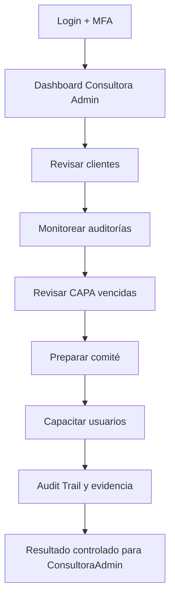
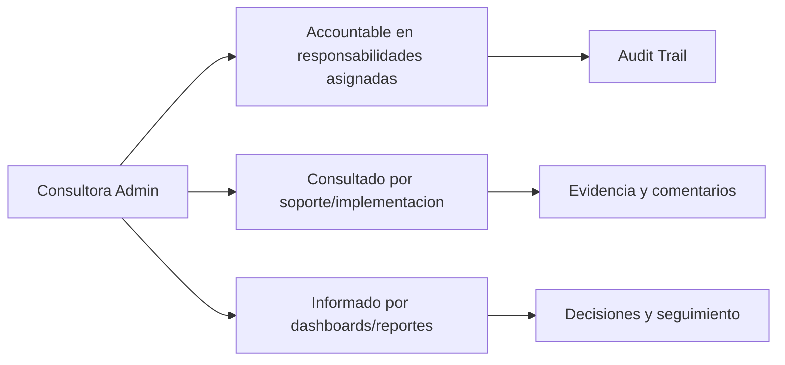

# Compliance 360 Academy

## Consultora Admin Certification

## Portada

| Campo | Valor |
| --- | --- |
| Rol | Consultora Admin |
| Nivel | Advanced / Consultant |
| Duración | 28 horas |
| Objetivo | Formar consultoras capaces de implementar, configurar y operar clientes en Compliance 360. |
| Prerrequisitos | Experiencia en consultoría ISO, calidad, auditoría o implementación SaaS. |
| Ruta de aprendizaje | Fundamentos -> Seguridad -> Módulos -> Operación -> Escenarios -> Evaluación -> Certificación |
| Certificación asociada | Compliance 360 Certified Consultant |
| Estado | Markdown maestro. No generar Word hasta aprobación. |

---

# CAPÍTULO 1 - Introducción al Rol

## ¿Quién es?

El `Consultora Admin` es un perfil formal de Compliance 360 Academy. Su entrenamiento está diseñado para que pueda usar la plataforma sin revisar código fuente, entendiendo módulos, permisos, responsabilidades, riesgos y límites reales del producto.

## ¿Qué responsabilidades tiene?

| Responsabilidad | Dueño | Prioridad | Evidencia esperada |
| --- | --- | --- | --- |
| Dar de alta clientes | Consultora Admin | Alta | Evidencia en Audit Trail / reporte / registro |
| Configurar módulos | Consultora Admin | Alta | Evidencia en Audit Trail / reporte / registro |
| Diseñar procesos | Consultora Admin | Alta | Evidencia en Audit Trail / reporte / registro |
| Capacitar usuarios | Consultora Admin | Alta | Evidencia en Audit Trail / reporte / registro |
| Preparar reportes ejecutivos | Consultora Admin | Alta | Evidencia en Audit Trail / reporte / registro |

## ¿Qué puede hacer?

- Dar de alta clientes
- Configurar módulos
- Diseñar procesos
- Capacitar usuarios
- Preparar reportes ejecutivos

## ¿Qué no puede hacer?

- Modificar datos del cliente sin acuerdo
- Prometer módulos marcados como workspace genérico
- Usar credenciales compartidas

## Flujo operativo del rol

## Matriz de responsabilidades

| Responsabilidad | Dueño | Prioridad | Evidencia esperada |
| --- | --- | --- | --- |
| Dar de alta clientes | Consultora Admin | Alta | Evidencia en Audit Trail / reporte / registro |
| Configurar módulos | Consultora Admin | Alta | Evidencia en Audit Trail / reporte / registro |
| Diseñar procesos | Consultora Admin | Alta | Evidencia en Audit Trail / reporte / registro |
| Capacitar usuarios | Consultora Admin | Alta | Evidencia en Audit Trail / reporte / registro |
| Preparar reportes ejecutivos | Consultora Admin | Alta | Evidencia en Audit Trail / reporte / registro |

## Matriz RACI

| Proceso | Consultora Admin | Tenant Admin | Quality Manager | Support Engineer |
| --- | --- | --- | --- | --- |
| Implementar cliente | R/A | I | I | C |
| Configurar módulos | R/A | I | I | C |
| Crear auditoría | R/A | I | I | C |
| Crear CAPA | R/A | I | I | C |
| Crear riesgo | R/A | I | I | C |
| Crear KPI | R/A | I | I | C |
| Generar reporte | R/A | I | I | C |

---

# CAPÍTULO 2 - Módulos que utiliza

## Módulos asignados al rol

| Módulo | Para qué sirve | Cuándo lo usa |
| --- | --- | --- |
| Tenant Management | Sirve para tenant management | Se usa cuando el rol necesita operar o consultar esta capacidad |
| RBAC | Sirve para rbac | Se usa cuando el rol necesita operar o consultar esta capacidad |
| MFA | Sirve para mfa | Se usa cuando el rol necesita operar o consultar esta capacidad |
| Document Management | Sirve para document management | Se usa cuando el rol necesita operar o consultar esta capacidad |
| Supplier Management | Sirve para supplier management | Se usa cuando el rol necesita operar o consultar esta capacidad |
| Audit Management | Sirve para audit management | Se usa cuando el rol necesita operar o consultar esta capacidad |
| CAPA Management | Sirve para capa management | Se usa cuando el rol necesita operar o consultar esta capacidad |
| Risk Management | Sirve para risk management | Se usa cuando el rol necesita operar o consultar esta capacidad |
| Quality Indicators | Sirve para quality indicators | Se usa cuando el rol necesita operar o consultar esta capacidad |
| Reporting Engine | Sirve para reporting engine | Se usa cuando el rol necesita operar o consultar esta capacidad |
| Dashboard | Sirve para dashboard | Se usa cuando el rol necesita operar o consultar esta capacidad |
| Template Builder | Sirve para template builder | Se usa cuando el rol necesita operar o consultar esta capacidad |
| Regulatory Management | Sirve para regulatory management | Se usa cuando el rol necesita operar o consultar esta capacidad |
| Training Management | Sirve para training management | Se usa cuando el rol necesita operar o consultar esta capacidad |
| Supplier Portal | Sirve para supplier portal | Se usa cuando el rol necesita operar o consultar esta capacidad |
| Customer Portal | Sirve para customer portal | Se usa cuando el rol necesita operar o consultar esta capacidad |

## Matriz de módulos

| Módulo | Tipo de uso | Frecuencia | Nota de estado |
| --- | --- | --- | --- |
| Tenant Management | Uso principal | Diario/Semanal | Ver estado real en Handbook |
| RBAC | Uso principal | Diario/Semanal | Ver estado real en Handbook |
| MFA | Uso principal | Diario/Semanal | Ver estado real en Handbook |
| Document Management | Uso principal | Diario/Semanal | Ver estado real en Handbook |
| Supplier Management | Uso principal | Diario/Semanal | Ver estado real en Handbook |
| Audit Management | Uso complementario | Según evento | Ver estado real en Handbook |
| CAPA Management | Uso complementario | Según evento | Ver estado real en Handbook |
| Risk Management | Uso complementario | Según evento | Ver estado real en Handbook |
| Quality Indicators | Uso complementario | Según evento | Ver estado real en Handbook |
| Reporting Engine | Uso complementario | Según evento | Ver estado real en Handbook |
| Dashboard | Uso complementario | Según evento | Ver estado real en Handbook |
| Template Builder | Uso complementario | Según evento | Ver estado real en Handbook |
| Regulatory Management | Uso complementario | Según evento | Ver estado real en Handbook |
| Training Management | Uso complementario | Según evento | Ver estado real en Handbook |
| Supplier Portal | Uso complementario | Según evento | Ver estado real en Handbook |
| Customer Portal | Uso complementario | Según evento | Ver estado real en Handbook |

## Diagrama de responsabilidades

---

# CAPÍTULO 3 - Configuración Inicial

## Objetivo

Preparar el acceso y el entorno de trabajo del rol `Consultora Admin` para operar sin fricción.

## Paso a paso

1. Crear o validar usuario en el tenant correcto.
2. Asignar rol y permisos correspondientes.
3. Activar MFA si el tenant lo requiere.
4. Validar acceso a dashboard.
5. Validar acceso a módulos asignados.
6. Probar operación mínima permitida.
7. Confirmar que Audit Trail registra eventos clave.
8. Documentar restricciones del rol.

## Pantalla por pantalla

| Pantalla | Acción esperada | Resultado |
| --- | --- | --- |
| Login | Ingresar credenciales y completar MFA si aplica | Sesión activa |
| Dashboard | Revisar indicadores y alertas | Prioridades visibles |
| Módulos asignados | Validar acceso según matriz | Acceso autorizado |
| Reportes | Consultar datos según permiso | Reporte visible |
| Audit Trail | Confirmar trazabilidad si aplica | Evento registrado |

## Proceso por proceso

Cada proceso debe ejecutarse con tenant, permiso y evidencia correctos. Si aparece `401`, el usuario debe renovar sesión. Si aparece `403`, debe solicitar ajuste de rol, no intentar rodear el control.

---

# CAPÍTULO 4 - Operación Diaria

## ¿Qué hace al iniciar sesión?

| Tarea | Frecuencia | Resultado esperado |
| --- | --- | --- |
| Revisar clientes | Diario | Validar resultado en dashboard/audit trail |
| Monitorear auditorías | Diario | Validar resultado en dashboard/audit trail |
| Revisar CAPA vencidas | Diario | Validar resultado en dashboard/audit trail |
| Preparar comité | Diario | Validar resultado en dashboard/audit trail |
| Capacitar usuarios | Diario | Validar resultado en dashboard/audit trail |

## ¿Qué revisa?

- Estado general del dashboard.
- Tareas asignadas.
- Alertas relacionadas con sus módulos.
- Reportes o indicadores relevantes.
- Evidencia pendiente o procesos vencidos.

## ¿Qué tareas ejecuta?

- Revisar clientes
- Monitorear auditorías
- Revisar CAPA vencidas
- Preparar comité
- Capacitar usuarios

## ¿Qué indicadores debe monitorear?

| Indicador | Uso | Acción esperada |
| --- | --- | --- |
| Clientes activos | Monitorear tendencia | Escalar desviaciones |
| CAPA vencidas | Monitorear tendencia | Escalar desviaciones |
| Riesgos altos | Monitorear tendencia | Escalar desviaciones |
| KPIs fuera de meta | Monitorear tendencia | Escalar desviaciones |
| Reportes emitidos | Monitorear tendencia | Escalar desviaciones |

---

# CAPÍTULO 5 - Procesos Paso a Paso

### 5.1 Implementar cliente

**Objetivo:** ejecutar el proceso `Implementar cliente` de forma trazable, segura y alineada con el rol `Consultora Admin`.

**Prerrequisitos:**

- Usuario activo en el tenant correcto.
- Permisos del rol validados antes de iniciar.
- Datos base cargados: documentos, usuarios, módulos o providers según aplique.
- MFA completado si el tenant lo requiere.

**Pasos:**

1. Iniciar sesión en Compliance 360.
2. Confirmar tenant, rol activo y permisos visibles.
3. Abrir el módulo relacionado con `Implementar cliente`.
4. Revisar dashboard, filtros y estado actual antes de modificar información.
5. Crear, actualizar, aprobar, consultar o ejecutar la acción permitida por el rol.
6. Adjuntar evidencia cuando el proceso lo requiera.
7. Validar resultado esperado y registrar observaciones.
8. Revisar que el evento quede trazado en Audit Trail o en el dashboard correspondiente.

**Resultado esperado:** el proceso queda actualizado, con responsable, evidencia, estado visible y trazabilidad.

**Errores comunes:**

- Ejecutar el proceso en el tenant equivocado.
- Usar un rol sin permiso suficiente y recibir `403 Forbidden`.
- Omitir evidencia antes de aprobación/cierre.
- Confundir módulos core operativos con workspaces genéricos.

**Buenas prácticas:**

- Documentar decisiones en comentarios o evidencia.
- Validar datos antes de aprobar.
- Usar reportes para confirmar impacto.
- Escalar a soporte con correlation id cuando exista error técnico.

### 5.2 Configurar módulos

**Objetivo:** ejecutar el proceso `Configurar módulos` de forma trazable, segura y alineada con el rol `Consultora Admin`.

**Prerrequisitos:**

- Usuario activo en el tenant correcto.
- Permisos del rol validados antes de iniciar.
- Datos base cargados: documentos, usuarios, módulos o providers según aplique.
- MFA completado si el tenant lo requiere.

**Pasos:**

1. Iniciar sesión en Compliance 360.
2. Confirmar tenant, rol activo y permisos visibles.
3. Abrir el módulo relacionado con `Configurar módulos`.
4. Revisar dashboard, filtros y estado actual antes de modificar información.
5. Crear, actualizar, aprobar, consultar o ejecutar la acción permitida por el rol.
6. Adjuntar evidencia cuando el proceso lo requiera.
7. Validar resultado esperado y registrar observaciones.
8. Revisar que el evento quede trazado en Audit Trail o en el dashboard correspondiente.

**Resultado esperado:** el proceso queda actualizado, con responsable, evidencia, estado visible y trazabilidad.

**Errores comunes:**

- Ejecutar el proceso en el tenant equivocado.
- Usar un rol sin permiso suficiente y recibir `403 Forbidden`.
- Omitir evidencia antes de aprobación/cierre.
- Confundir módulos core operativos con workspaces genéricos.

**Buenas prácticas:**

- Documentar decisiones en comentarios o evidencia.
- Validar datos antes de aprobar.
- Usar reportes para confirmar impacto.
- Escalar a soporte con correlation id cuando exista error técnico.

### 5.3 Crear auditoría

**Objetivo:** ejecutar el proceso `Crear auditoría` de forma trazable, segura y alineada con el rol `Consultora Admin`.

**Prerrequisitos:**

- Usuario activo en el tenant correcto.
- Permisos del rol validados antes de iniciar.
- Datos base cargados: documentos, usuarios, módulos o providers según aplique.
- MFA completado si el tenant lo requiere.

**Pasos:**

1. Iniciar sesión en Compliance 360.
2. Confirmar tenant, rol activo y permisos visibles.
3. Abrir el módulo relacionado con `Crear auditoría`.
4. Revisar dashboard, filtros y estado actual antes de modificar información.
5. Crear, actualizar, aprobar, consultar o ejecutar la acción permitida por el rol.
6. Adjuntar evidencia cuando el proceso lo requiera.
7. Validar resultado esperado y registrar observaciones.
8. Revisar que el evento quede trazado en Audit Trail o en el dashboard correspondiente.

**Resultado esperado:** el proceso queda actualizado, con responsable, evidencia, estado visible y trazabilidad.

**Errores comunes:**

- Ejecutar el proceso en el tenant equivocado.
- Usar un rol sin permiso suficiente y recibir `403 Forbidden`.
- Omitir evidencia antes de aprobación/cierre.
- Confundir módulos core operativos con workspaces genéricos.

**Buenas prácticas:**

- Documentar decisiones en comentarios o evidencia.
- Validar datos antes de aprobar.
- Usar reportes para confirmar impacto.
- Escalar a soporte con correlation id cuando exista error técnico.

### 5.4 Crear CAPA

**Objetivo:** ejecutar el proceso `Crear CAPA` de forma trazable, segura y alineada con el rol `Consultora Admin`.

**Prerrequisitos:**

- Usuario activo en el tenant correcto.
- Permisos del rol validados antes de iniciar.
- Datos base cargados: documentos, usuarios, módulos o providers según aplique.
- MFA completado si el tenant lo requiere.

**Pasos:**

1. Iniciar sesión en Compliance 360.
2. Confirmar tenant, rol activo y permisos visibles.
3. Abrir el módulo relacionado con `Crear CAPA`.
4. Revisar dashboard, filtros y estado actual antes de modificar información.
5. Crear, actualizar, aprobar, consultar o ejecutar la acción permitida por el rol.
6. Adjuntar evidencia cuando el proceso lo requiera.
7. Validar resultado esperado y registrar observaciones.
8. Revisar que el evento quede trazado en Audit Trail o en el dashboard correspondiente.

**Resultado esperado:** el proceso queda actualizado, con responsable, evidencia, estado visible y trazabilidad.

**Errores comunes:**

- Ejecutar el proceso en el tenant equivocado.
- Usar un rol sin permiso suficiente y recibir `403 Forbidden`.
- Omitir evidencia antes de aprobación/cierre.
- Confundir módulos core operativos con workspaces genéricos.

**Buenas prácticas:**

- Documentar decisiones en comentarios o evidencia.
- Validar datos antes de aprobar.
- Usar reportes para confirmar impacto.
- Escalar a soporte con correlation id cuando exista error técnico.

### 5.5 Crear riesgo

**Objetivo:** ejecutar el proceso `Crear riesgo` de forma trazable, segura y alineada con el rol `Consultora Admin`.

**Prerrequisitos:**

- Usuario activo en el tenant correcto.
- Permisos del rol validados antes de iniciar.
- Datos base cargados: documentos, usuarios, módulos o providers según aplique.
- MFA completado si el tenant lo requiere.

**Pasos:**

1. Iniciar sesión en Compliance 360.
2. Confirmar tenant, rol activo y permisos visibles.
3. Abrir el módulo relacionado con `Crear riesgo`.
4. Revisar dashboard, filtros y estado actual antes de modificar información.
5. Crear, actualizar, aprobar, consultar o ejecutar la acción permitida por el rol.
6. Adjuntar evidencia cuando el proceso lo requiera.
7. Validar resultado esperado y registrar observaciones.
8. Revisar que el evento quede trazado en Audit Trail o en el dashboard correspondiente.

**Resultado esperado:** el proceso queda actualizado, con responsable, evidencia, estado visible y trazabilidad.

**Errores comunes:**

- Ejecutar el proceso en el tenant equivocado.
- Usar un rol sin permiso suficiente y recibir `403 Forbidden`.
- Omitir evidencia antes de aprobación/cierre.
- Confundir módulos core operativos con workspaces genéricos.

**Buenas prácticas:**

- Documentar decisiones en comentarios o evidencia.
- Validar datos antes de aprobar.
- Usar reportes para confirmar impacto.
- Escalar a soporte con correlation id cuando exista error técnico.

### 5.6 Crear KPI

**Objetivo:** ejecutar el proceso `Crear KPI` de forma trazable, segura y alineada con el rol `Consultora Admin`.

**Prerrequisitos:**

- Usuario activo en el tenant correcto.
- Permisos del rol validados antes de iniciar.
- Datos base cargados: documentos, usuarios, módulos o providers según aplique.
- MFA completado si el tenant lo requiere.

**Pasos:**

1. Iniciar sesión en Compliance 360.
2. Confirmar tenant, rol activo y permisos visibles.
3. Abrir el módulo relacionado con `Crear KPI`.
4. Revisar dashboard, filtros y estado actual antes de modificar información.
5. Crear, actualizar, aprobar, consultar o ejecutar la acción permitida por el rol.
6. Adjuntar evidencia cuando el proceso lo requiera.
7. Validar resultado esperado y registrar observaciones.
8. Revisar que el evento quede trazado en Audit Trail o en el dashboard correspondiente.

**Resultado esperado:** el proceso queda actualizado, con responsable, evidencia, estado visible y trazabilidad.

**Errores comunes:**

- Ejecutar el proceso en el tenant equivocado.
- Usar un rol sin permiso suficiente y recibir `403 Forbidden`.
- Omitir evidencia antes de aprobación/cierre.
- Confundir módulos core operativos con workspaces genéricos.

**Buenas prácticas:**

- Documentar decisiones en comentarios o evidencia.
- Validar datos antes de aprobar.
- Usar reportes para confirmar impacto.
- Escalar a soporte con correlation id cuando exista error técnico.

### 5.7 Generar reporte

**Objetivo:** ejecutar el proceso `Generar reporte` de forma trazable, segura y alineada con el rol `Consultora Admin`.

**Prerrequisitos:**

- Usuario activo en el tenant correcto.
- Permisos del rol validados antes de iniciar.
- Datos base cargados: documentos, usuarios, módulos o providers según aplique.
- MFA completado si el tenant lo requiere.

**Pasos:**

1. Iniciar sesión en Compliance 360.
2. Confirmar tenant, rol activo y permisos visibles.
3. Abrir el módulo relacionado con `Generar reporte`.
4. Revisar dashboard, filtros y estado actual antes de modificar información.
5. Crear, actualizar, aprobar, consultar o ejecutar la acción permitida por el rol.
6. Adjuntar evidencia cuando el proceso lo requiera.
7. Validar resultado esperado y registrar observaciones.
8. Revisar que el evento quede trazado en Audit Trail o en el dashboard correspondiente.

**Resultado esperado:** el proceso queda actualizado, con responsable, evidencia, estado visible y trazabilidad.

**Errores comunes:**

- Ejecutar el proceso en el tenant equivocado.
- Usar un rol sin permiso suficiente y recibir `403 Forbidden`.
- Omitir evidencia antes de aprobación/cierre.
- Confundir módulos core operativos con workspaces genéricos.

**Buenas prácticas:**

- Documentar decisiones en comentarios o evidencia.
- Validar datos antes de aprobar.
- Usar reportes para confirmar impacto.
- Escalar a soporte con correlation id cuando exista error técnico.

---

# CAPÍTULO 6 - Escenarios Reales

### 6.1 Escenario: Cliente alimentario nuevo

**Contexto empresarial:** el rol `Consultora Admin` enfrenta el caso `Cliente alimentario nuevo` dentro de un tenant productivo o de capacitación.

**Objetivo del escenario:** resolver la situación sin romper trazabilidad, seguridad ni segregación de funciones.

**Acciones esperadas:**

1. Identificar el módulo principal del caso.
2. Revisar permisos y alcance del rol.
3. Consultar registros existentes, dashboard o reportes relacionados.
4. Ejecutar la acción permitida por el rol.
5. Adjuntar evidencia o comentario de soporte.
6. Confirmar estado final y responsables.
7. Escalar si el proceso requiere permisos de otro rol.

**Criterios de éxito:**

- El caso queda resuelto o escalado formalmente.
- No se realizan acciones fuera del permiso del rol.
- Existe evidencia o trazabilidad suficiente para auditoría.
- El estado final es comprensible para negocio, soporte e implementación.

**Riesgo si se opera mal:** pérdida de evidencia, aprobación indebida, error de tenant, incumplimiento de ISO 9001/BPM/HACCP o confusión comercial sobre el estado real del producto.

### 6.2 Escenario: Auditoría ISO 9001

**Contexto empresarial:** el rol `Consultora Admin` enfrenta el caso `Auditoría ISO 9001` dentro de un tenant productivo o de capacitación.

**Objetivo del escenario:** resolver la situación sin romper trazabilidad, seguridad ni segregación de funciones.

**Acciones esperadas:**

1. Identificar el módulo principal del caso.
2. Revisar permisos y alcance del rol.
3. Consultar registros existentes, dashboard o reportes relacionados.
4. Ejecutar la acción permitida por el rol.
5. Adjuntar evidencia o comentario de soporte.
6. Confirmar estado final y responsables.
7. Escalar si el proceso requiere permisos de otro rol.

**Criterios de éxito:**

- El caso queda resuelto o escalado formalmente.
- No se realizan acciones fuera del permiso del rol.
- Existe evidencia o trazabilidad suficiente para auditoría.
- El estado final es comprensible para negocio, soporte e implementación.

**Riesgo si se opera mal:** pérdida de evidencia, aprobación indebida, error de tenant, incumplimiento de ISO 9001/BPM/HACCP o confusión comercial sobre el estado real del producto.

### 6.3 Escenario: Proveedor certificado vencido

**Contexto empresarial:** el rol `Consultora Admin` enfrenta el caso `Proveedor certificado vencido` dentro de un tenant productivo o de capacitación.

**Objetivo del escenario:** resolver la situación sin romper trazabilidad, seguridad ni segregación de funciones.

**Acciones esperadas:**

1. Identificar el módulo principal del caso.
2. Revisar permisos y alcance del rol.
3. Consultar registros existentes, dashboard o reportes relacionados.
4. Ejecutar la acción permitida por el rol.
5. Adjuntar evidencia o comentario de soporte.
6. Confirmar estado final y responsables.
7. Escalar si el proceso requiere permisos de otro rol.

**Criterios de éxito:**

- El caso queda resuelto o escalado formalmente.
- No se realizan acciones fuera del permiso del rol.
- Existe evidencia o trazabilidad suficiente para auditoría.
- El estado final es comprensible para negocio, soporte e implementación.

**Riesgo si se opera mal:** pérdida de evidencia, aprobación indebida, error de tenant, incumplimiento de ISO 9001/BPM/HACCP o confusión comercial sobre el estado real del producto.

### 6.4 Escenario: CAPA crítica

**Contexto empresarial:** el rol `Consultora Admin` enfrenta el caso `CAPA crítica` dentro de un tenant productivo o de capacitación.

**Objetivo del escenario:** resolver la situación sin romper trazabilidad, seguridad ni segregación de funciones.

**Acciones esperadas:**

1. Identificar el módulo principal del caso.
2. Revisar permisos y alcance del rol.
3. Consultar registros existentes, dashboard o reportes relacionados.
4. Ejecutar la acción permitida por el rol.
5. Adjuntar evidencia o comentario de soporte.
6. Confirmar estado final y responsables.
7. Escalar si el proceso requiere permisos de otro rol.

**Criterios de éxito:**

- El caso queda resuelto o escalado formalmente.
- No se realizan acciones fuera del permiso del rol.
- Existe evidencia o trazabilidad suficiente para auditoría.
- El estado final es comprensible para negocio, soporte e implementación.

**Riesgo si se opera mal:** pérdida de evidencia, aprobación indebida, error de tenant, incumplimiento de ISO 9001/BPM/HACCP o confusión comercial sobre el estado real del producto.

### 6.5 Escenario: KPI fuera de meta

**Contexto empresarial:** el rol `Consultora Admin` enfrenta el caso `KPI fuera de meta` dentro de un tenant productivo o de capacitación.

**Objetivo del escenario:** resolver la situación sin romper trazabilidad, seguridad ni segregación de funciones.

**Acciones esperadas:**

1. Identificar el módulo principal del caso.
2. Revisar permisos y alcance del rol.
3. Consultar registros existentes, dashboard o reportes relacionados.
4. Ejecutar la acción permitida por el rol.
5. Adjuntar evidencia o comentario de soporte.
6. Confirmar estado final y responsables.
7. Escalar si el proceso requiere permisos de otro rol.

**Criterios de éxito:**

- El caso queda resuelto o escalado formalmente.
- No se realizan acciones fuera del permiso del rol.
- Existe evidencia o trazabilidad suficiente para auditoría.
- El estado final es comprensible para negocio, soporte e implementación.

**Riesgo si se opera mal:** pérdida de evidencia, aprobación indebida, error de tenant, incumplimiento de ISO 9001/BPM/HACCP o confusión comercial sobre el estado real del producto.

### 6.6 Escenario: Riesgo alto

**Contexto empresarial:** el rol `Consultora Admin` enfrenta el caso `Riesgo alto` dentro de un tenant productivo o de capacitación.

**Objetivo del escenario:** resolver la situación sin romper trazabilidad, seguridad ni segregación de funciones.

**Acciones esperadas:**

1. Identificar el módulo principal del caso.
2. Revisar permisos y alcance del rol.
3. Consultar registros existentes, dashboard o reportes relacionados.
4. Ejecutar la acción permitida por el rol.
5. Adjuntar evidencia o comentario de soporte.
6. Confirmar estado final y responsables.
7. Escalar si el proceso requiere permisos de otro rol.

**Criterios de éxito:**

- El caso queda resuelto o escalado formalmente.
- No se realizan acciones fuera del permiso del rol.
- Existe evidencia o trazabilidad suficiente para auditoría.
- El estado final es comprensible para negocio, soporte e implementación.

**Riesgo si se opera mal:** pérdida de evidencia, aprobación indebida, error de tenant, incumplimiento de ISO 9001/BPM/HACCP o confusión comercial sobre el estado real del producto.

### 6.7 Escenario: Comité mensual

**Contexto empresarial:** el rol `Consultora Admin` enfrenta el caso `Comité mensual` dentro de un tenant productivo o de capacitación.

**Objetivo del escenario:** resolver la situación sin romper trazabilidad, seguridad ni segregación de funciones.

**Acciones esperadas:**

1. Identificar el módulo principal del caso.
2. Revisar permisos y alcance del rol.
3. Consultar registros existentes, dashboard o reportes relacionados.
4. Ejecutar la acción permitida por el rol.
5. Adjuntar evidencia o comentario de soporte.
6. Confirmar estado final y responsables.
7. Escalar si el proceso requiere permisos de otro rol.

**Criterios de éxito:**

- El caso queda resuelto o escalado formalmente.
- No se realizan acciones fuera del permiso del rol.
- Existe evidencia o trazabilidad suficiente para auditoría.
- El estado final es comprensible para negocio, soporte e implementación.

**Riesgo si se opera mal:** pérdida de evidencia, aprobación indebida, error de tenant, incumplimiento de ISO 9001/BPM/HACCP o confusión comercial sobre el estado real del producto.

### 6.8 Escenario: Entrenamiento de usuarios

**Contexto empresarial:** el rol `Consultora Admin` enfrenta el caso `Entrenamiento de usuarios` dentro de un tenant productivo o de capacitación.

**Objetivo del escenario:** resolver la situación sin romper trazabilidad, seguridad ni segregación de funciones.

**Acciones esperadas:**

1. Identificar el módulo principal del caso.
2. Revisar permisos y alcance del rol.
3. Consultar registros existentes, dashboard o reportes relacionados.
4. Ejecutar la acción permitida por el rol.
5. Adjuntar evidencia o comentario de soporte.
6. Confirmar estado final y responsables.
7. Escalar si el proceso requiere permisos de otro rol.

**Criterios de éxito:**

- El caso queda resuelto o escalado formalmente.
- No se realizan acciones fuera del permiso del rol.
- Existe evidencia o trazabilidad suficiente para auditoría.
- El estado final es comprensible para negocio, soporte e implementación.

**Riesgo si se opera mal:** pérdida de evidencia, aprobación indebida, error de tenant, incumplimiento de ISO 9001/BPM/HACCP o confusión comercial sobre el estado real del producto.

### 6.9 Escenario: Preparación de auditor externo

**Contexto empresarial:** el rol `Consultora Admin` enfrenta el caso `Preparación de auditor externo` dentro de un tenant productivo o de capacitación.

**Objetivo del escenario:** resolver la situación sin romper trazabilidad, seguridad ni segregación de funciones.

**Acciones esperadas:**

1. Identificar el módulo principal del caso.
2. Revisar permisos y alcance del rol.
3. Consultar registros existentes, dashboard o reportes relacionados.
4. Ejecutar la acción permitida por el rol.
5. Adjuntar evidencia o comentario de soporte.
6. Confirmar estado final y responsables.
7. Escalar si el proceso requiere permisos de otro rol.

**Criterios de éxito:**

- El caso queda resuelto o escalado formalmente.
- No se realizan acciones fuera del permiso del rol.
- Existe evidencia o trazabilidad suficiente para auditoría.
- El estado final es comprensible para negocio, soporte e implementación.

**Riesgo si se opera mal:** pérdida de evidencia, aprobación indebida, error de tenant, incumplimiento de ISO 9001/BPM/HACCP o confusión comercial sobre el estado real del producto.

### 6.10 Escenario: Reporte ejecutivo

**Contexto empresarial:** el rol `Consultora Admin` enfrenta el caso `Reporte ejecutivo` dentro de un tenant productivo o de capacitación.

**Objetivo del escenario:** resolver la situación sin romper trazabilidad, seguridad ni segregación de funciones.

**Acciones esperadas:**

1. Identificar el módulo principal del caso.
2. Revisar permisos y alcance del rol.
3. Consultar registros existentes, dashboard o reportes relacionados.
4. Ejecutar la acción permitida por el rol.
5. Adjuntar evidencia o comentario de soporte.
6. Confirmar estado final y responsables.
7. Escalar si el proceso requiere permisos de otro rol.

**Criterios de éxito:**

- El caso queda resuelto o escalado formalmente.
- No se realizan acciones fuera del permiso del rol.
- Existe evidencia o trazabilidad suficiente para auditoría.
- El estado final es comprensible para negocio, soporte e implementación.

**Riesgo si se opera mal:** pérdida de evidencia, aprobación indebida, error de tenant, incumplimiento de ISO 9001/BPM/HACCP o confusión comercial sobre el estado real del producto.

---

# CAPÍTULO 7 - Mejores Prácticas

## ISO 9001

- Mantener evidencia trazable de cambios, aprobaciones y cierres.
- Usar roles claros para evitar conflictos de interés.
- Medir desempeño con indicadores y revisar tendencias.
- Gestionar no conformidades mediante CAPA con causa raíz y efectividad.

## ISO 22000, HACCP y BPM

- Controlar documentos de inocuidad y BPM como documentos vigentes.
- Vincular proveedores críticos con certificaciones y evaluaciones.
- Registrar riesgos de inocuidad con controles y tratamiento.
- Mantener evidencias de acciones preventivas y correctivas.

## Buenas prácticas SaaS

- No compartir usuarios.
- Activar MFA para roles sensibles.
- Usar permisos mínimos necesarios.
- Validar providers de email/storage antes de producción.
- Escalar errores técnicos con evidencia, hora, tenant y correlation id.

---

# CAPÍTULO 8 - Errores Comunes

| Error | Consecuencia | Prevención |
| --- | --- | --- |
| Operar en tenant incorrecto | Riesgo de privacidad y datos cruzados | Confirmar tenant al iniciar |
| Usar rol con permisos excesivos | Falta de segregación | Revisar matriz RBAC |
| Cerrar sin evidencia | Debilidad ante auditoría | Adjuntar evidencia antes de cierre |
| Ignorar módulos en estado workspace | Promesa comercial incorrecta | Aplicar regla de honestidad |
| No revisar Audit Trail | Falta de trazabilidad | Validar eventos clave |
| No probar providers | Fallas de email/storage en producción | Ejecutar tests de conexión |
| Compartir credenciales | Riesgo de seguridad | Usuario individual por persona |
| Omitir MFA | Mayor exposición de acceso | Activar MFA en roles críticos |
| No documentar decisiones | Soporte y auditoría débiles | Registrar comentarios |
| No escalar a tiempo | SLA incumplido | Clasificar severidad |

---

# CAPÍTULO 9 - Checklist Operativo

## Checklist diario

- Confirmar acceso y tenant correcto.
- Revisar dashboard y tareas asignadas.
- Revisar alertas de módulos asignados.
- Ejecutar procesos prioritarios.
- Escalar bloqueos con evidencia.

## Checklist semanal

- Revisar reportes relevantes.
- Revisar tareas vencidas.
- Validar indicadores del rol.
- Confirmar que los procesos críticos tienen responsables.
- Revisar errores recurrentes.

## Checklist mensual

- Preparar comité o revisión ejecutiva.
- Auditar permisos del rol si aplica.
- Revisar tendencias y desviaciones.
- Confirmar cierre de procesos críticos.
- Documentar oportunidades de mejora.

## Checklist trimestral

- Revisar matriz de responsabilidades.
- Validar capacitación de usuarios.
- Revisar efectividad de controles.
- Actualizar procesos según cambios normativos.
- Preparar evidencia para auditorías.

---

# CAPÍTULO 10 - Evaluación Teórica

**Instrucciones:** responder 50 preguntas de opción múltiple. Puntaje recomendado: 2 puntos por pregunta. Mínimo de aprobación: 80/100.

### Pregunta 1

**Situación:** el rol `Consultora Admin` debe trabajar con `Tenant Management` en Compliance 360.

A. Validar permisos, tenant, evidencia y estado antes de operar Tenant Management.
B. Compartir credenciales para acelerar el trabajo sobre Tenant Management.
C. Omitir Audit Trail porque el proceso Tenant Management es interno.
D. Prometer funcionalidad no implementada para Tenant Management sin aclaración.

**Respuesta correcta:** A

**Explicación:** la respuesta correcta protege multitenancy, RBAC, trazabilidad, evidencia y honestidad del producto. Las demás opciones introducen riesgos de seguridad, auditoría, soporte o venta incorrecta.

### Pregunta 2

**Situación:** el rol `Consultora Admin` debe trabajar con `RBAC` en Compliance 360.

A. Compartir credenciales para acelerar el trabajo sobre RBAC.
B. Validar permisos, tenant, evidencia y estado antes de operar RBAC.
C. Omitir Audit Trail porque el proceso RBAC es interno.
D. Prometer funcionalidad no implementada para RBAC sin aclaración.

**Respuesta correcta:** B

**Explicación:** la respuesta correcta protege multitenancy, RBAC, trazabilidad, evidencia y honestidad del producto. Las demás opciones introducen riesgos de seguridad, auditoría, soporte o venta incorrecta.

### Pregunta 3

**Situación:** el rol `Consultora Admin` debe trabajar con `MFA` en Compliance 360.

A. Omitir Audit Trail porque el proceso MFA es interno.
B. Compartir credenciales para acelerar el trabajo sobre MFA.
C. Validar permisos, tenant, evidencia y estado antes de operar MFA.
D. Prometer funcionalidad no implementada para MFA sin aclaración.

**Respuesta correcta:** C

**Explicación:** la respuesta correcta protege multitenancy, RBAC, trazabilidad, evidencia y honestidad del producto. Las demás opciones introducen riesgos de seguridad, auditoría, soporte o venta incorrecta.

### Pregunta 4

**Situación:** el rol `Consultora Admin` debe trabajar con `Document Management` en Compliance 360.

A. Prometer funcionalidad no implementada para Document Management sin aclaración.
B. Compartir credenciales para acelerar el trabajo sobre Document Management.
C. Omitir Audit Trail porque el proceso Document Management es interno.
D. Validar permisos, tenant, evidencia y estado antes de operar Document Management.

**Respuesta correcta:** D

**Explicación:** la respuesta correcta protege multitenancy, RBAC, trazabilidad, evidencia y honestidad del producto. Las demás opciones introducen riesgos de seguridad, auditoría, soporte o venta incorrecta.

### Pregunta 5

**Situación:** el rol `Consultora Admin` debe trabajar con `Supplier Management` en Compliance 360.

A. Validar permisos, tenant, evidencia y estado antes de operar Supplier Management.
B. Compartir credenciales para acelerar el trabajo sobre Supplier Management.
C. Omitir Audit Trail porque el proceso Supplier Management es interno.
D. Prometer funcionalidad no implementada para Supplier Management sin aclaración.

**Respuesta correcta:** A

**Explicación:** la respuesta correcta protege multitenancy, RBAC, trazabilidad, evidencia y honestidad del producto. Las demás opciones introducen riesgos de seguridad, auditoría, soporte o venta incorrecta.

### Pregunta 6

**Situación:** el rol `Consultora Admin` debe trabajar con `Audit Management` en Compliance 360.

A. Compartir credenciales para acelerar el trabajo sobre Audit Management.
B. Validar permisos, tenant, evidencia y estado antes de operar Audit Management.
C. Omitir Audit Trail porque el proceso Audit Management es interno.
D. Prometer funcionalidad no implementada para Audit Management sin aclaración.

**Respuesta correcta:** B

**Explicación:** la respuesta correcta protege multitenancy, RBAC, trazabilidad, evidencia y honestidad del producto. Las demás opciones introducen riesgos de seguridad, auditoría, soporte o venta incorrecta.

### Pregunta 7

**Situación:** el rol `Consultora Admin` debe trabajar con `CAPA Management` en Compliance 360.

A. Omitir Audit Trail porque el proceso CAPA Management es interno.
B. Compartir credenciales para acelerar el trabajo sobre CAPA Management.
C. Validar permisos, tenant, evidencia y estado antes de operar CAPA Management.
D. Prometer funcionalidad no implementada para CAPA Management sin aclaración.

**Respuesta correcta:** C

**Explicación:** la respuesta correcta protege multitenancy, RBAC, trazabilidad, evidencia y honestidad del producto. Las demás opciones introducen riesgos de seguridad, auditoría, soporte o venta incorrecta.

### Pregunta 8

**Situación:** el rol `Consultora Admin` debe trabajar con `Risk Management` en Compliance 360.

A. Prometer funcionalidad no implementada para Risk Management sin aclaración.
B. Compartir credenciales para acelerar el trabajo sobre Risk Management.
C. Omitir Audit Trail porque el proceso Risk Management es interno.
D. Validar permisos, tenant, evidencia y estado antes de operar Risk Management.

**Respuesta correcta:** D

**Explicación:** la respuesta correcta protege multitenancy, RBAC, trazabilidad, evidencia y honestidad del producto. Las demás opciones introducen riesgos de seguridad, auditoría, soporte o venta incorrecta.

### Pregunta 9

**Situación:** el rol `Consultora Admin` debe trabajar con `Quality Indicators` en Compliance 360.

A. Validar permisos, tenant, evidencia y estado antes de operar Quality Indicators.
B. Compartir credenciales para acelerar el trabajo sobre Quality Indicators.
C. Omitir Audit Trail porque el proceso Quality Indicators es interno.
D. Prometer funcionalidad no implementada para Quality Indicators sin aclaración.

**Respuesta correcta:** A

**Explicación:** la respuesta correcta protege multitenancy, RBAC, trazabilidad, evidencia y honestidad del producto. Las demás opciones introducen riesgos de seguridad, auditoría, soporte o venta incorrecta.

### Pregunta 10

**Situación:** el rol `Consultora Admin` debe trabajar con `Reporting Engine` en Compliance 360.

A. Compartir credenciales para acelerar el trabajo sobre Reporting Engine.
B. Validar permisos, tenant, evidencia y estado antes de operar Reporting Engine.
C. Omitir Audit Trail porque el proceso Reporting Engine es interno.
D. Prometer funcionalidad no implementada para Reporting Engine sin aclaración.

**Respuesta correcta:** B

**Explicación:** la respuesta correcta protege multitenancy, RBAC, trazabilidad, evidencia y honestidad del producto. Las demás opciones introducen riesgos de seguridad, auditoría, soporte o venta incorrecta.

### Pregunta 11

**Situación:** el rol `Consultora Admin` debe trabajar con `Dashboard` en Compliance 360.

A. Omitir Audit Trail porque el proceso Dashboard es interno.
B. Compartir credenciales para acelerar el trabajo sobre Dashboard.
C. Validar permisos, tenant, evidencia y estado antes de operar Dashboard.
D. Prometer funcionalidad no implementada para Dashboard sin aclaración.

**Respuesta correcta:** C

**Explicación:** la respuesta correcta protege multitenancy, RBAC, trazabilidad, evidencia y honestidad del producto. Las demás opciones introducen riesgos de seguridad, auditoría, soporte o venta incorrecta.

### Pregunta 12

**Situación:** el rol `Consultora Admin` debe trabajar con `Template Builder` en Compliance 360.

A. Prometer funcionalidad no implementada para Template Builder sin aclaración.
B. Compartir credenciales para acelerar el trabajo sobre Template Builder.
C. Omitir Audit Trail porque el proceso Template Builder es interno.
D. Validar permisos, tenant, evidencia y estado antes de operar Template Builder.

**Respuesta correcta:** D

**Explicación:** la respuesta correcta protege multitenancy, RBAC, trazabilidad, evidencia y honestidad del producto. Las demás opciones introducen riesgos de seguridad, auditoría, soporte o venta incorrecta.

### Pregunta 13

**Situación:** el rol `Consultora Admin` debe trabajar con `Regulatory Management` en Compliance 360.

A. Validar permisos, tenant, evidencia y estado antes de operar Regulatory Management.
B. Compartir credenciales para acelerar el trabajo sobre Regulatory Management.
C. Omitir Audit Trail porque el proceso Regulatory Management es interno.
D. Prometer funcionalidad no implementada para Regulatory Management sin aclaración.

**Respuesta correcta:** A

**Explicación:** la respuesta correcta protege multitenancy, RBAC, trazabilidad, evidencia y honestidad del producto. Las demás opciones introducen riesgos de seguridad, auditoría, soporte o venta incorrecta.

### Pregunta 14

**Situación:** el rol `Consultora Admin` debe trabajar con `Training Management` en Compliance 360.

A. Compartir credenciales para acelerar el trabajo sobre Training Management.
B. Validar permisos, tenant, evidencia y estado antes de operar Training Management.
C. Omitir Audit Trail porque el proceso Training Management es interno.
D. Prometer funcionalidad no implementada para Training Management sin aclaración.

**Respuesta correcta:** B

**Explicación:** la respuesta correcta protege multitenancy, RBAC, trazabilidad, evidencia y honestidad del producto. Las demás opciones introducen riesgos de seguridad, auditoría, soporte o venta incorrecta.

### Pregunta 15

**Situación:** el rol `Consultora Admin` debe trabajar con `Supplier Portal` en Compliance 360.

A. Omitir Audit Trail porque el proceso Supplier Portal es interno.
B. Compartir credenciales para acelerar el trabajo sobre Supplier Portal.
C. Validar permisos, tenant, evidencia y estado antes de operar Supplier Portal.
D. Prometer funcionalidad no implementada para Supplier Portal sin aclaración.

**Respuesta correcta:** C

**Explicación:** la respuesta correcta protege multitenancy, RBAC, trazabilidad, evidencia y honestidad del producto. Las demás opciones introducen riesgos de seguridad, auditoría, soporte o venta incorrecta.

### Pregunta 16

**Situación:** el rol `Consultora Admin` debe trabajar con `Customer Portal` en Compliance 360.

A. Prometer funcionalidad no implementada para Customer Portal sin aclaración.
B. Compartir credenciales para acelerar el trabajo sobre Customer Portal.
C. Omitir Audit Trail porque el proceso Customer Portal es interno.
D. Validar permisos, tenant, evidencia y estado antes de operar Customer Portal.

**Respuesta correcta:** D

**Explicación:** la respuesta correcta protege multitenancy, RBAC, trazabilidad, evidencia y honestidad del producto. Las demás opciones introducen riesgos de seguridad, auditoría, soporte o venta incorrecta.

### Pregunta 17

**Situación:** el rol `Consultora Admin` debe trabajar con `Implementar cliente` en Compliance 360.

A. Validar permisos, tenant, evidencia y estado antes de operar Implementar cliente.
B. Compartir credenciales para acelerar el trabajo sobre Implementar cliente.
C. Omitir Audit Trail porque el proceso Implementar cliente es interno.
D. Prometer funcionalidad no implementada para Implementar cliente sin aclaración.

**Respuesta correcta:** A

**Explicación:** la respuesta correcta protege multitenancy, RBAC, trazabilidad, evidencia y honestidad del producto. Las demás opciones introducen riesgos de seguridad, auditoría, soporte o venta incorrecta.

### Pregunta 18

**Situación:** el rol `Consultora Admin` debe trabajar con `Configurar módulos` en Compliance 360.

A. Compartir credenciales para acelerar el trabajo sobre Configurar módulos.
B. Validar permisos, tenant, evidencia y estado antes de operar Configurar módulos.
C. Omitir Audit Trail porque el proceso Configurar módulos es interno.
D. Prometer funcionalidad no implementada para Configurar módulos sin aclaración.

**Respuesta correcta:** B

**Explicación:** la respuesta correcta protege multitenancy, RBAC, trazabilidad, evidencia y honestidad del producto. Las demás opciones introducen riesgos de seguridad, auditoría, soporte o venta incorrecta.

### Pregunta 19

**Situación:** el rol `Consultora Admin` debe trabajar con `Crear auditoría` en Compliance 360.

A. Omitir Audit Trail porque el proceso Crear auditoría es interno.
B. Compartir credenciales para acelerar el trabajo sobre Crear auditoría.
C. Validar permisos, tenant, evidencia y estado antes de operar Crear auditoría.
D. Prometer funcionalidad no implementada para Crear auditoría sin aclaración.

**Respuesta correcta:** C

**Explicación:** la respuesta correcta protege multitenancy, RBAC, trazabilidad, evidencia y honestidad del producto. Las demás opciones introducen riesgos de seguridad, auditoría, soporte o venta incorrecta.

### Pregunta 20

**Situación:** el rol `Consultora Admin` debe trabajar con `Crear CAPA` en Compliance 360.

A. Prometer funcionalidad no implementada para Crear CAPA sin aclaración.
B. Compartir credenciales para acelerar el trabajo sobre Crear CAPA.
C. Omitir Audit Trail porque el proceso Crear CAPA es interno.
D. Validar permisos, tenant, evidencia y estado antes de operar Crear CAPA.

**Respuesta correcta:** D

**Explicación:** la respuesta correcta protege multitenancy, RBAC, trazabilidad, evidencia y honestidad del producto. Las demás opciones introducen riesgos de seguridad, auditoría, soporte o venta incorrecta.

### Pregunta 21

**Situación:** el rol `Consultora Admin` debe trabajar con `Crear riesgo` en Compliance 360.

A. Validar permisos, tenant, evidencia y estado antes de operar Crear riesgo.
B. Compartir credenciales para acelerar el trabajo sobre Crear riesgo.
C. Omitir Audit Trail porque el proceso Crear riesgo es interno.
D. Prometer funcionalidad no implementada para Crear riesgo sin aclaración.

**Respuesta correcta:** A

**Explicación:** la respuesta correcta protege multitenancy, RBAC, trazabilidad, evidencia y honestidad del producto. Las demás opciones introducen riesgos de seguridad, auditoría, soporte o venta incorrecta.

### Pregunta 22

**Situación:** el rol `Consultora Admin` debe trabajar con `Crear KPI` en Compliance 360.

A. Compartir credenciales para acelerar el trabajo sobre Crear KPI.
B. Validar permisos, tenant, evidencia y estado antes de operar Crear KPI.
C. Omitir Audit Trail porque el proceso Crear KPI es interno.
D. Prometer funcionalidad no implementada para Crear KPI sin aclaración.

**Respuesta correcta:** B

**Explicación:** la respuesta correcta protege multitenancy, RBAC, trazabilidad, evidencia y honestidad del producto. Las demás opciones introducen riesgos de seguridad, auditoría, soporte o venta incorrecta.

### Pregunta 23

**Situación:** el rol `Consultora Admin` debe trabajar con `Generar reporte` en Compliance 360.

A. Omitir Audit Trail porque el proceso Generar reporte es interno.
B. Compartir credenciales para acelerar el trabajo sobre Generar reporte.
C. Validar permisos, tenant, evidencia y estado antes de operar Generar reporte.
D. Prometer funcionalidad no implementada para Generar reporte sin aclaración.

**Respuesta correcta:** C

**Explicación:** la respuesta correcta protege multitenancy, RBAC, trazabilidad, evidencia y honestidad del producto. Las demás opciones introducen riesgos de seguridad, auditoría, soporte o venta incorrecta.

### Pregunta 24

**Situación:** el rol `Consultora Admin` debe trabajar con `RBAC` en Compliance 360.

A. Prometer funcionalidad no implementada para RBAC sin aclaración.
B. Compartir credenciales para acelerar el trabajo sobre RBAC.
C. Omitir Audit Trail porque el proceso RBAC es interno.
D. Validar permisos, tenant, evidencia y estado antes de operar RBAC.

**Respuesta correcta:** D

**Explicación:** la respuesta correcta protege multitenancy, RBAC, trazabilidad, evidencia y honestidad del producto. Las demás opciones introducen riesgos de seguridad, auditoría, soporte o venta incorrecta.

### Pregunta 25

**Situación:** el rol `Consultora Admin` debe trabajar con `MFA` en Compliance 360.

A. Validar permisos, tenant, evidencia y estado antes de operar MFA.
B. Compartir credenciales para acelerar el trabajo sobre MFA.
C. Omitir Audit Trail porque el proceso MFA es interno.
D. Prometer funcionalidad no implementada para MFA sin aclaración.

**Respuesta correcta:** A

**Explicación:** la respuesta correcta protege multitenancy, RBAC, trazabilidad, evidencia y honestidad del producto. Las demás opciones introducen riesgos de seguridad, auditoría, soporte o venta incorrecta.

### Pregunta 26

**Situación:** el rol `Consultora Admin` debe trabajar con `Audit Trail` en Compliance 360.

A. Compartir credenciales para acelerar el trabajo sobre Audit Trail.
B. Validar permisos, tenant, evidencia y estado antes de operar Audit Trail.
C. Omitir Audit Trail porque el proceso Audit Trail es interno.
D. Prometer funcionalidad no implementada para Audit Trail sin aclaración.

**Respuesta correcta:** B

**Explicación:** la respuesta correcta protege multitenancy, RBAC, trazabilidad, evidencia y honestidad del producto. Las demás opciones introducen riesgos de seguridad, auditoría, soporte o venta incorrecta.

### Pregunta 27

**Situación:** el rol `Consultora Admin` debe trabajar con `Estado real del módulo` en Compliance 360.

A. Omitir Audit Trail porque el proceso Estado real del módulo es interno.
B. Compartir credenciales para acelerar el trabajo sobre Estado real del módulo.
C. Validar permisos, tenant, evidencia y estado antes de operar Estado real del módulo.
D. Prometer funcionalidad no implementada para Estado real del módulo sin aclaración.

**Respuesta correcta:** C

**Explicación:** la respuesta correcta protege multitenancy, RBAC, trazabilidad, evidencia y honestidad del producto. Las demás opciones introducen riesgos de seguridad, auditoría, soporte o venta incorrecta.

### Pregunta 28

**Situación:** el rol `Consultora Admin` debe trabajar con `Buenas prácticas ISO` en Compliance 360.

A. Prometer funcionalidad no implementada para Buenas prácticas ISO sin aclaración.
B. Compartir credenciales para acelerar el trabajo sobre Buenas prácticas ISO.
C. Omitir Audit Trail porque el proceso Buenas prácticas ISO es interno.
D. Validar permisos, tenant, evidencia y estado antes de operar Buenas prácticas ISO.

**Respuesta correcta:** D

**Explicación:** la respuesta correcta protege multitenancy, RBAC, trazabilidad, evidencia y honestidad del producto. Las demás opciones introducen riesgos de seguridad, auditoría, soporte o venta incorrecta.

### Pregunta 29

**Situación:** el rol `Consultora Admin` debe trabajar con `Tenant Management` en Compliance 360.

A. Validar permisos, tenant, evidencia y estado antes de operar Tenant Management.
B. Compartir credenciales para acelerar el trabajo sobre Tenant Management.
C. Omitir Audit Trail porque el proceso Tenant Management es interno.
D. Prometer funcionalidad no implementada para Tenant Management sin aclaración.

**Respuesta correcta:** A

**Explicación:** la respuesta correcta protege multitenancy, RBAC, trazabilidad, evidencia y honestidad del producto. Las demás opciones introducen riesgos de seguridad, auditoría, soporte o venta incorrecta.

### Pregunta 30

**Situación:** el rol `Consultora Admin` debe trabajar con `RBAC` en Compliance 360.

A. Compartir credenciales para acelerar el trabajo sobre RBAC.
B. Validar permisos, tenant, evidencia y estado antes de operar RBAC.
C. Omitir Audit Trail porque el proceso RBAC es interno.
D. Prometer funcionalidad no implementada para RBAC sin aclaración.

**Respuesta correcta:** B

**Explicación:** la respuesta correcta protege multitenancy, RBAC, trazabilidad, evidencia y honestidad del producto. Las demás opciones introducen riesgos de seguridad, auditoría, soporte o venta incorrecta.

### Pregunta 31

**Situación:** el rol `Consultora Admin` debe trabajar con `MFA` en Compliance 360.

A. Omitir Audit Trail porque el proceso MFA es interno.
B. Compartir credenciales para acelerar el trabajo sobre MFA.
C. Validar permisos, tenant, evidencia y estado antes de operar MFA.
D. Prometer funcionalidad no implementada para MFA sin aclaración.

**Respuesta correcta:** C

**Explicación:** la respuesta correcta protege multitenancy, RBAC, trazabilidad, evidencia y honestidad del producto. Las demás opciones introducen riesgos de seguridad, auditoría, soporte o venta incorrecta.

### Pregunta 32

**Situación:** el rol `Consultora Admin` debe trabajar con `Document Management` en Compliance 360.

A. Prometer funcionalidad no implementada para Document Management sin aclaración.
B. Compartir credenciales para acelerar el trabajo sobre Document Management.
C. Omitir Audit Trail porque el proceso Document Management es interno.
D. Validar permisos, tenant, evidencia y estado antes de operar Document Management.

**Respuesta correcta:** D

**Explicación:** la respuesta correcta protege multitenancy, RBAC, trazabilidad, evidencia y honestidad del producto. Las demás opciones introducen riesgos de seguridad, auditoría, soporte o venta incorrecta.

### Pregunta 33

**Situación:** el rol `Consultora Admin` debe trabajar con `Supplier Management` en Compliance 360.

A. Validar permisos, tenant, evidencia y estado antes de operar Supplier Management.
B. Compartir credenciales para acelerar el trabajo sobre Supplier Management.
C. Omitir Audit Trail porque el proceso Supplier Management es interno.
D. Prometer funcionalidad no implementada para Supplier Management sin aclaración.

**Respuesta correcta:** A

**Explicación:** la respuesta correcta protege multitenancy, RBAC, trazabilidad, evidencia y honestidad del producto. Las demás opciones introducen riesgos de seguridad, auditoría, soporte o venta incorrecta.

### Pregunta 34

**Situación:** el rol `Consultora Admin` debe trabajar con `Audit Management` en Compliance 360.

A. Compartir credenciales para acelerar el trabajo sobre Audit Management.
B. Validar permisos, tenant, evidencia y estado antes de operar Audit Management.
C. Omitir Audit Trail porque el proceso Audit Management es interno.
D. Prometer funcionalidad no implementada para Audit Management sin aclaración.

**Respuesta correcta:** B

**Explicación:** la respuesta correcta protege multitenancy, RBAC, trazabilidad, evidencia y honestidad del producto. Las demás opciones introducen riesgos de seguridad, auditoría, soporte o venta incorrecta.

### Pregunta 35

**Situación:** el rol `Consultora Admin` debe trabajar con `CAPA Management` en Compliance 360.

A. Omitir Audit Trail porque el proceso CAPA Management es interno.
B. Compartir credenciales para acelerar el trabajo sobre CAPA Management.
C. Validar permisos, tenant, evidencia y estado antes de operar CAPA Management.
D. Prometer funcionalidad no implementada para CAPA Management sin aclaración.

**Respuesta correcta:** C

**Explicación:** la respuesta correcta protege multitenancy, RBAC, trazabilidad, evidencia y honestidad del producto. Las demás opciones introducen riesgos de seguridad, auditoría, soporte o venta incorrecta.

### Pregunta 36

**Situación:** el rol `Consultora Admin` debe trabajar con `Risk Management` en Compliance 360.

A. Prometer funcionalidad no implementada para Risk Management sin aclaración.
B. Compartir credenciales para acelerar el trabajo sobre Risk Management.
C. Omitir Audit Trail porque el proceso Risk Management es interno.
D. Validar permisos, tenant, evidencia y estado antes de operar Risk Management.

**Respuesta correcta:** D

**Explicación:** la respuesta correcta protege multitenancy, RBAC, trazabilidad, evidencia y honestidad del producto. Las demás opciones introducen riesgos de seguridad, auditoría, soporte o venta incorrecta.

### Pregunta 37

**Situación:** el rol `Consultora Admin` debe trabajar con `Quality Indicators` en Compliance 360.

A. Validar permisos, tenant, evidencia y estado antes de operar Quality Indicators.
B. Compartir credenciales para acelerar el trabajo sobre Quality Indicators.
C. Omitir Audit Trail porque el proceso Quality Indicators es interno.
D. Prometer funcionalidad no implementada para Quality Indicators sin aclaración.

**Respuesta correcta:** A

**Explicación:** la respuesta correcta protege multitenancy, RBAC, trazabilidad, evidencia y honestidad del producto. Las demás opciones introducen riesgos de seguridad, auditoría, soporte o venta incorrecta.

### Pregunta 38

**Situación:** el rol `Consultora Admin` debe trabajar con `Reporting Engine` en Compliance 360.

A. Compartir credenciales para acelerar el trabajo sobre Reporting Engine.
B. Validar permisos, tenant, evidencia y estado antes de operar Reporting Engine.
C. Omitir Audit Trail porque el proceso Reporting Engine es interno.
D. Prometer funcionalidad no implementada para Reporting Engine sin aclaración.

**Respuesta correcta:** B

**Explicación:** la respuesta correcta protege multitenancy, RBAC, trazabilidad, evidencia y honestidad del producto. Las demás opciones introducen riesgos de seguridad, auditoría, soporte o venta incorrecta.

### Pregunta 39

**Situación:** el rol `Consultora Admin` debe trabajar con `Dashboard` en Compliance 360.

A. Omitir Audit Trail porque el proceso Dashboard es interno.
B. Compartir credenciales para acelerar el trabajo sobre Dashboard.
C. Validar permisos, tenant, evidencia y estado antes de operar Dashboard.
D. Prometer funcionalidad no implementada para Dashboard sin aclaración.

**Respuesta correcta:** C

**Explicación:** la respuesta correcta protege multitenancy, RBAC, trazabilidad, evidencia y honestidad del producto. Las demás opciones introducen riesgos de seguridad, auditoría, soporte o venta incorrecta.

### Pregunta 40

**Situación:** el rol `Consultora Admin` debe trabajar con `Template Builder` en Compliance 360.

A. Prometer funcionalidad no implementada para Template Builder sin aclaración.
B. Compartir credenciales para acelerar el trabajo sobre Template Builder.
C. Omitir Audit Trail porque el proceso Template Builder es interno.
D. Validar permisos, tenant, evidencia y estado antes de operar Template Builder.

**Respuesta correcta:** D

**Explicación:** la respuesta correcta protege multitenancy, RBAC, trazabilidad, evidencia y honestidad del producto. Las demás opciones introducen riesgos de seguridad, auditoría, soporte o venta incorrecta.

### Pregunta 41

**Situación:** el rol `Consultora Admin` debe trabajar con `Regulatory Management` en Compliance 360.

A. Validar permisos, tenant, evidencia y estado antes de operar Regulatory Management.
B. Compartir credenciales para acelerar el trabajo sobre Regulatory Management.
C. Omitir Audit Trail porque el proceso Regulatory Management es interno.
D. Prometer funcionalidad no implementada para Regulatory Management sin aclaración.

**Respuesta correcta:** A

**Explicación:** la respuesta correcta protege multitenancy, RBAC, trazabilidad, evidencia y honestidad del producto. Las demás opciones introducen riesgos de seguridad, auditoría, soporte o venta incorrecta.

### Pregunta 42

**Situación:** el rol `Consultora Admin` debe trabajar con `Training Management` en Compliance 360.

A. Compartir credenciales para acelerar el trabajo sobre Training Management.
B. Validar permisos, tenant, evidencia y estado antes de operar Training Management.
C. Omitir Audit Trail porque el proceso Training Management es interno.
D. Prometer funcionalidad no implementada para Training Management sin aclaración.

**Respuesta correcta:** B

**Explicación:** la respuesta correcta protege multitenancy, RBAC, trazabilidad, evidencia y honestidad del producto. Las demás opciones introducen riesgos de seguridad, auditoría, soporte o venta incorrecta.

### Pregunta 43

**Situación:** el rol `Consultora Admin` debe trabajar con `Supplier Portal` en Compliance 360.

A. Omitir Audit Trail porque el proceso Supplier Portal es interno.
B. Compartir credenciales para acelerar el trabajo sobre Supplier Portal.
C. Validar permisos, tenant, evidencia y estado antes de operar Supplier Portal.
D. Prometer funcionalidad no implementada para Supplier Portal sin aclaración.

**Respuesta correcta:** C

**Explicación:** la respuesta correcta protege multitenancy, RBAC, trazabilidad, evidencia y honestidad del producto. Las demás opciones introducen riesgos de seguridad, auditoría, soporte o venta incorrecta.

### Pregunta 44

**Situación:** el rol `Consultora Admin` debe trabajar con `Customer Portal` en Compliance 360.

A. Prometer funcionalidad no implementada para Customer Portal sin aclaración.
B. Compartir credenciales para acelerar el trabajo sobre Customer Portal.
C. Omitir Audit Trail porque el proceso Customer Portal es interno.
D. Validar permisos, tenant, evidencia y estado antes de operar Customer Portal.

**Respuesta correcta:** D

**Explicación:** la respuesta correcta protege multitenancy, RBAC, trazabilidad, evidencia y honestidad del producto. Las demás opciones introducen riesgos de seguridad, auditoría, soporte o venta incorrecta.

### Pregunta 45

**Situación:** el rol `Consultora Admin` debe trabajar con `Implementar cliente` en Compliance 360.

A. Validar permisos, tenant, evidencia y estado antes de operar Implementar cliente.
B. Compartir credenciales para acelerar el trabajo sobre Implementar cliente.
C. Omitir Audit Trail porque el proceso Implementar cliente es interno.
D. Prometer funcionalidad no implementada para Implementar cliente sin aclaración.

**Respuesta correcta:** A

**Explicación:** la respuesta correcta protege multitenancy, RBAC, trazabilidad, evidencia y honestidad del producto. Las demás opciones introducen riesgos de seguridad, auditoría, soporte o venta incorrecta.

### Pregunta 46

**Situación:** el rol `Consultora Admin` debe trabajar con `Configurar módulos` en Compliance 360.

A. Compartir credenciales para acelerar el trabajo sobre Configurar módulos.
B. Validar permisos, tenant, evidencia y estado antes de operar Configurar módulos.
C. Omitir Audit Trail porque el proceso Configurar módulos es interno.
D. Prometer funcionalidad no implementada para Configurar módulos sin aclaración.

**Respuesta correcta:** B

**Explicación:** la respuesta correcta protege multitenancy, RBAC, trazabilidad, evidencia y honestidad del producto. Las demás opciones introducen riesgos de seguridad, auditoría, soporte o venta incorrecta.

### Pregunta 47

**Situación:** el rol `Consultora Admin` debe trabajar con `Crear auditoría` en Compliance 360.

A. Omitir Audit Trail porque el proceso Crear auditoría es interno.
B. Compartir credenciales para acelerar el trabajo sobre Crear auditoría.
C. Validar permisos, tenant, evidencia y estado antes de operar Crear auditoría.
D. Prometer funcionalidad no implementada para Crear auditoría sin aclaración.

**Respuesta correcta:** C

**Explicación:** la respuesta correcta protege multitenancy, RBAC, trazabilidad, evidencia y honestidad del producto. Las demás opciones introducen riesgos de seguridad, auditoría, soporte o venta incorrecta.

### Pregunta 48

**Situación:** el rol `Consultora Admin` debe trabajar con `Crear CAPA` en Compliance 360.

A. Prometer funcionalidad no implementada para Crear CAPA sin aclaración.
B. Compartir credenciales para acelerar el trabajo sobre Crear CAPA.
C. Omitir Audit Trail porque el proceso Crear CAPA es interno.
D. Validar permisos, tenant, evidencia y estado antes de operar Crear CAPA.

**Respuesta correcta:** D

**Explicación:** la respuesta correcta protege multitenancy, RBAC, trazabilidad, evidencia y honestidad del producto. Las demás opciones introducen riesgos de seguridad, auditoría, soporte o venta incorrecta.

### Pregunta 49

**Situación:** el rol `Consultora Admin` debe trabajar con `Crear riesgo` en Compliance 360.

A. Validar permisos, tenant, evidencia y estado antes de operar Crear riesgo.
B. Compartir credenciales para acelerar el trabajo sobre Crear riesgo.
C. Omitir Audit Trail porque el proceso Crear riesgo es interno.
D. Prometer funcionalidad no implementada para Crear riesgo sin aclaración.

**Respuesta correcta:** A

**Explicación:** la respuesta correcta protege multitenancy, RBAC, trazabilidad, evidencia y honestidad del producto. Las demás opciones introducen riesgos de seguridad, auditoría, soporte o venta incorrecta.

### Pregunta 50

**Situación:** el rol `Consultora Admin` debe trabajar con `Crear KPI` en Compliance 360.

A. Compartir credenciales para acelerar el trabajo sobre Crear KPI.
B. Validar permisos, tenant, evidencia y estado antes de operar Crear KPI.
C. Omitir Audit Trail porque el proceso Crear KPI es interno.
D. Prometer funcionalidad no implementada para Crear KPI sin aclaración.

**Respuesta correcta:** B

**Explicación:** la respuesta correcta protege multitenancy, RBAC, trazabilidad, evidencia y honestidad del producto. Las demás opciones introducen riesgos de seguridad, auditoría, soporte o venta incorrecta.

---

# CAPÍTULO 11 - Evaluación Práctica

### 11.1 Ejercicio práctico: Implementar cliente

**Caso:** ejecutar `Implementar cliente` en un tenant de entrenamiento llamado `Academy Demo Tenant`.

**Tareas dentro de Compliance 360:**

1. Iniciar sesión con usuario de entrenamiento del rol `Consultora Admin`.
2. Navegar al módulo correspondiente.
3. Ejecutar el proceso de punta a punta, respetando permisos.
4. Registrar evidencia o comentario.
5. Consultar dashboard, reporte o audit trail para validar resultado.

**Entregable del estudiante:** captura o descripción del resultado, estado final, evidencia creada y lección aprendida.

**Criterio de aprobación:** proceso completo sin violar permisos, sin usar tenant incorrecto y con trazabilidad visible.

### 11.2 Ejercicio práctico: Configurar módulos

**Caso:** ejecutar `Configurar módulos` en un tenant de entrenamiento llamado `Academy Demo Tenant`.

**Tareas dentro de Compliance 360:**

1. Iniciar sesión con usuario de entrenamiento del rol `Consultora Admin`.
2. Navegar al módulo correspondiente.
3. Ejecutar el proceso de punta a punta, respetando permisos.
4. Registrar evidencia o comentario.
5. Consultar dashboard, reporte o audit trail para validar resultado.

**Entregable del estudiante:** captura o descripción del resultado, estado final, evidencia creada y lección aprendida.

**Criterio de aprobación:** proceso completo sin violar permisos, sin usar tenant incorrecto y con trazabilidad visible.

### 11.3 Ejercicio práctico: Crear auditoría

**Caso:** ejecutar `Crear auditoría` en un tenant de entrenamiento llamado `Academy Demo Tenant`.

**Tareas dentro de Compliance 360:**

1. Iniciar sesión con usuario de entrenamiento del rol `Consultora Admin`.
2. Navegar al módulo correspondiente.
3. Ejecutar el proceso de punta a punta, respetando permisos.
4. Registrar evidencia o comentario.
5. Consultar dashboard, reporte o audit trail para validar resultado.

**Entregable del estudiante:** captura o descripción del resultado, estado final, evidencia creada y lección aprendida.

**Criterio de aprobación:** proceso completo sin violar permisos, sin usar tenant incorrecto y con trazabilidad visible.

### 11.4 Ejercicio práctico: Crear CAPA

**Caso:** ejecutar `Crear CAPA` en un tenant de entrenamiento llamado `Academy Demo Tenant`.

**Tareas dentro de Compliance 360:**

1. Iniciar sesión con usuario de entrenamiento del rol `Consultora Admin`.
2. Navegar al módulo correspondiente.
3. Ejecutar el proceso de punta a punta, respetando permisos.
4. Registrar evidencia o comentario.
5. Consultar dashboard, reporte o audit trail para validar resultado.

**Entregable del estudiante:** captura o descripción del resultado, estado final, evidencia creada y lección aprendida.

**Criterio de aprobación:** proceso completo sin violar permisos, sin usar tenant incorrecto y con trazabilidad visible.

### 11.5 Ejercicio práctico: Crear riesgo

**Caso:** ejecutar `Crear riesgo` en un tenant de entrenamiento llamado `Academy Demo Tenant`.

**Tareas dentro de Compliance 360:**

1. Iniciar sesión con usuario de entrenamiento del rol `Consultora Admin`.
2. Navegar al módulo correspondiente.
3. Ejecutar el proceso de punta a punta, respetando permisos.
4. Registrar evidencia o comentario.
5. Consultar dashboard, reporte o audit trail para validar resultado.

**Entregable del estudiante:** captura o descripción del resultado, estado final, evidencia creada y lección aprendida.

**Criterio de aprobación:** proceso completo sin violar permisos, sin usar tenant incorrecto y con trazabilidad visible.

### 11.6 Ejercicio práctico: Crear KPI

**Caso:** ejecutar `Crear KPI` en un tenant de entrenamiento llamado `Academy Demo Tenant`.

**Tareas dentro de Compliance 360:**

1. Iniciar sesión con usuario de entrenamiento del rol `Consultora Admin`.
2. Navegar al módulo correspondiente.
3. Ejecutar el proceso de punta a punta, respetando permisos.
4. Registrar evidencia o comentario.
5. Consultar dashboard, reporte o audit trail para validar resultado.

**Entregable del estudiante:** captura o descripción del resultado, estado final, evidencia creada y lección aprendida.

**Criterio de aprobación:** proceso completo sin violar permisos, sin usar tenant incorrecto y con trazabilidad visible.

### 11.7 Ejercicio práctico: Generar reporte

**Caso:** ejecutar `Generar reporte` en un tenant de entrenamiento llamado `Academy Demo Tenant`.

**Tareas dentro de Compliance 360:**

1. Iniciar sesión con usuario de entrenamiento del rol `Consultora Admin`.
2. Navegar al módulo correspondiente.
3. Ejecutar el proceso de punta a punta, respetando permisos.
4. Registrar evidencia o comentario.
5. Consultar dashboard, reporte o audit trail para validar resultado.

**Entregable del estudiante:** captura o descripción del resultado, estado final, evidencia creada y lección aprendida.

**Criterio de aprobación:** proceso completo sin violar permisos, sin usar tenant incorrecto y con trazabilidad visible.

---

# CAPÍTULO 12 - Certificación

## Criterios de aprobación

- Evaluación teórica mínima: 80%.
- Evaluación práctica mínima: 85%.
- No cometer violaciones críticas: operar tenant equivocado, usar permisos no asignados, aprobar sin evidencia o prometer funcionalidades no implementadas.

## Puntaje mínimo

| Componente | Peso | Mínimo |
| --- | --- | --- |
| Evaluación teórica | 50% | 80% |
| Evaluación práctica | 35% | 85% |
| Checklist operativo | 10% | Completo |
| Conducta de seguridad y trazabilidad | 5% | Sin faltas críticas |

## Competencias adquiridas

- Comprensión del rol `Consultora Admin`.
- Uso de módulos asignados.
- Respeto de RBAC, MFA, multitenancy y Audit Trail.
- Ejecución de procesos reales.
- Identificación de errores comunes y escalamiento.

## Nivel alcanzado

`Compliance 360 Certified Consultant`.

## Matriz final de permisos

| Módulo | Acceso | Permiso/Claim orientativo | Alcance |
| --- | --- | --- | --- |
| Tenant Management | Sí | TENANT.MANAGE | Operar/consultar según alcance del rol |
| Identity | No | No asignado | No debe acceder salvo aprobación formal |
| RBAC | Sí | RBAC.MANAGE | Operar/consultar según alcance del rol |
| MFA | Sí | TENANT.MANAGE | Operar/consultar según alcance del rol |
| Audit Trail | No | No asignado | No debe acceder salvo aprobación formal |
| Storage | No | No asignado | No debe acceder salvo aprobación formal |
| Notifications | No | No asignado | No debe acceder salvo aprobación formal |
| Document Management | Sí | DOCUMENT.MANAGE | Operar/consultar según alcance del rol |
| Workflow Engine | No | No asignado | No debe acceder salvo aprobación formal |
| Technical Sheets | No | No asignado | No debe acceder salvo aprobación formal |
| Supplier Management | Sí | SUPPLIER.MANAGE | Operar/consultar según alcance del rol |
| Audit Management | Sí | AUDITMANAGEMENT.MANAGE | Operar/consultar según alcance del rol |
| CAPA Management | Sí | CAPA.MANAGE | Operar/consultar según alcance del rol |
| Risk Management | Sí | RISK.MANAGE | Operar/consultar según alcance del rol |
| Quality Indicators | Sí | TENANT.MANAGE | Operar/consultar según alcance del rol |
| Reporting Engine | Sí | TENANT.MANAGE | Operar/consultar según alcance del rol |
| Dashboard | Sí | TENANT.MANAGE | Operar/consultar según alcance del rol |
| Template Builder | Sí | TENANT.MANAGE | Operar/consultar según alcance del rol |
| Regulatory Management | Sí | TENANT.MANAGE | Operar/consultar según alcance del rol |
| Training Management | Sí | TENANT.MANAGE | Operar/consultar según alcance del rol |
| Supplier Portal | Sí | SUPPLIER.MANAGE | Operar/consultar según alcance del rol |
| Customer Portal | Sí | TENANT.MANAGE | Operar/consultar según alcance del rol |
| Observability | No | No asignado | No debe acceder salvo aprobación formal |
| CI/CD | No | No asignado | No debe acceder salvo aprobación formal |
| Security Hardening | No | No asignado | No debe acceder salvo aprobación formal |
