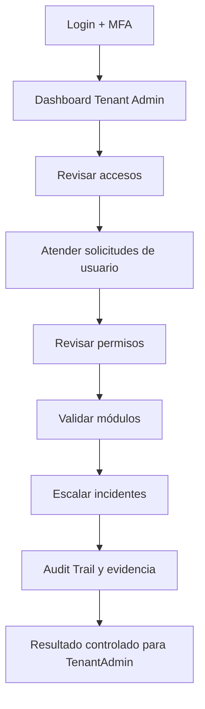
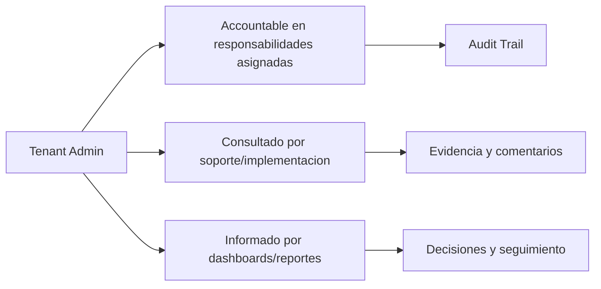

# Compliance 360 Academy

## Tenant Admin Certification

## Portada

| Campo | Valor |
| --- | --- |
| Rol | Tenant Admin |
| Nivel | Advanced / Administrator |
| Duración | 22 horas |
| Objetivo | Formar al administrador interno de una empresa cliente. |
| Prerrequisitos | Conocer estructura organizacional, usuarios, permisos y procesos internos. |
| Ruta de aprendizaje | Fundamentos -> Seguridad -> Módulos -> Operación -> Escenarios -> Evaluación -> Certificación |
| Certificación asociada | Compliance 360 Certified Administrator |
| Estado | Markdown maestro. No generar Word hasta aprobación. |

---

# CAPÍTULO 1 - Introducción al Rol

## ¿Quién es?

El `Tenant Admin` es un perfil formal de Compliance 360 Academy. Su entrenamiento está diseñado para que pueda usar la plataforma sin revisar código fuente, entendiendo módulos, permisos, responsabilidades, riesgos y límites reales del producto.

## ¿Qué responsabilidades tiene?

| Responsabilidad | Dueño | Prioridad | Evidencia esperada |
| --- | --- | --- | --- |
| Administrar usuarios del tenant | Tenant Admin | Alta | Evidencia en Audit Trail / reporte / registro |
| Configurar roles internos | Tenant Admin | Alta | Evidencia en Audit Trail / reporte / registro |
| Gestionar branding | Tenant Admin | Alta | Evidencia en Audit Trail / reporte / registro |
| Supervisar módulos | Tenant Admin | Alta | Evidencia en Audit Trail / reporte / registro |
| Coordinar soporte | Tenant Admin | Alta | Evidencia en Audit Trail / reporte / registro |

## ¿Qué puede hacer?

- Administrar usuarios del tenant
- Configurar roles internos
- Gestionar branding
- Supervisar módulos
- Coordinar soporte

## ¿Qué no puede hacer?

- Crear tenants externos
- Ver datos de otros tenants
- Desactivar controles sin aprobación
- Usar permisos globales

## Flujo operativo del rol

## Matriz de responsabilidades

| Responsabilidad | Dueño | Prioridad | Evidencia esperada |
| --- | --- | --- | --- |
| Administrar usuarios del tenant | Tenant Admin | Alta | Evidencia en Audit Trail / reporte / registro |
| Configurar roles internos | Tenant Admin | Alta | Evidencia en Audit Trail / reporte / registro |
| Gestionar branding | Tenant Admin | Alta | Evidencia en Audit Trail / reporte / registro |
| Supervisar módulos | Tenant Admin | Alta | Evidencia en Audit Trail / reporte / registro |
| Coordinar soporte | Tenant Admin | Alta | Evidencia en Audit Trail / reporte / registro |

## Matriz RACI

| Proceso | Tenant Admin | Quality Manager | Support Engineer | Consultora Admin |
| --- | --- | --- | --- | --- |
| Crear usuario | R/A | I | C | C |
| Asignar rol | R/A | I | C | C |
| Activar MFA | R/A | I | C | C |
| Revisar audit trail | R/A | I | C | C |
| Ejecutar reporte | R/A | I | C | C |
| Gestionar permiso | R/A | I | C | C |

---

# CAPÍTULO 2 - Módulos que utiliza

## Módulos asignados al rol

| Módulo | Para qué sirve | Cuándo lo usa |
| --- | --- | --- |
| Identity | Sirve para identity | Se usa cuando el rol necesita operar o consultar esta capacidad |
| RBAC | Sirve para rbac | Se usa cuando el rol necesita operar o consultar esta capacidad |
| MFA | Sirve para mfa | Se usa cuando el rol necesita operar o consultar esta capacidad |
| Audit Trail | Sirve para audit trail | Se usa cuando el rol necesita operar o consultar esta capacidad |
| Document Management | Sirve para document management | Se usa cuando el rol necesita operar o consultar esta capacidad |
| Supplier Management | Sirve para supplier management | Se usa cuando el rol necesita operar o consultar esta capacidad |
| CAPA Management | Sirve para capa management | Se usa cuando el rol necesita operar o consultar esta capacidad |
| Risk Management | Sirve para risk management | Se usa cuando el rol necesita operar o consultar esta capacidad |
| Quality Indicators | Sirve para quality indicators | Se usa cuando el rol necesita operar o consultar esta capacidad |
| Reporting Engine | Sirve para reporting engine | Se usa cuando el rol necesita operar o consultar esta capacidad |
| Dashboard | Sirve para dashboard | Se usa cuando el rol necesita operar o consultar esta capacidad |

## Matriz de módulos

| Módulo | Tipo de uso | Frecuencia | Nota de estado |
| --- | --- | --- | --- |
| Identity | Uso principal | Diario/Semanal | Ver estado real en Handbook |
| RBAC | Uso principal | Diario/Semanal | Ver estado real en Handbook |
| MFA | Uso principal | Diario/Semanal | Ver estado real en Handbook |
| Audit Trail | Uso principal | Diario/Semanal | Ver estado real en Handbook |
| Document Management | Uso principal | Diario/Semanal | Ver estado real en Handbook |
| Supplier Management | Uso complementario | Según evento | Ver estado real en Handbook |
| CAPA Management | Uso complementario | Según evento | Ver estado real en Handbook |
| Risk Management | Uso complementario | Según evento | Ver estado real en Handbook |
| Quality Indicators | Uso complementario | Según evento | Ver estado real en Handbook |
| Reporting Engine | Uso complementario | Según evento | Ver estado real en Handbook |
| Dashboard | Uso complementario | Según evento | Ver estado real en Handbook |

## Diagrama de responsabilidades

---

# CAPÍTULO 3 - Configuración Inicial

## Objetivo

Preparar el acceso y el entorno de trabajo del rol `Tenant Admin` para operar sin fricción.

## Paso a paso

1. Crear o validar usuario en el tenant correcto.
2. Asignar rol y permisos correspondientes.
3. Activar MFA si el tenant lo requiere.
4. Validar acceso a dashboard.
5. Validar acceso a módulos asignados.
6. Probar operación mínima permitida.
7. Confirmar que Audit Trail registra eventos clave.
8. Documentar restricciones del rol.

## Pantalla por pantalla

| Pantalla | Acción esperada | Resultado |
| --- | --- | --- |
| Login | Ingresar credenciales y completar MFA si aplica | Sesión activa |
| Dashboard | Revisar indicadores y alertas | Prioridades visibles |
| Módulos asignados | Validar acceso según matriz | Acceso autorizado |
| Reportes | Consultar datos según permiso | Reporte visible |
| Audit Trail | Confirmar trazabilidad si aplica | Evento registrado |

## Proceso por proceso

Cada proceso debe ejecutarse con tenant, permiso y evidencia correctos. Si aparece `401`, el usuario debe renovar sesión. Si aparece `403`, debe solicitar ajuste de rol, no intentar rodear el control.

---

# CAPÍTULO 4 - Operación Diaria

## ¿Qué hace al iniciar sesión?

| Tarea | Frecuencia | Resultado esperado |
| --- | --- | --- |
| Revisar accesos | Diario | Validar resultado en dashboard/audit trail |
| Atender solicitudes de usuario | Diario | Validar resultado en dashboard/audit trail |
| Revisar permisos | Diario | Validar resultado en dashboard/audit trail |
| Validar módulos | Diario | Validar resultado en dashboard/audit trail |
| Escalar incidentes | Diario | Validar resultado en dashboard/audit trail |

## ¿Qué revisa?

- Estado general del dashboard.
- Tareas asignadas.
- Alertas relacionadas con sus módulos.
- Reportes o indicadores relevantes.
- Evidencia pendiente o procesos vencidos.

## ¿Qué tareas ejecuta?

- Revisar accesos
- Atender solicitudes de usuario
- Revisar permisos
- Validar módulos
- Escalar incidentes

## ¿Qué indicadores debe monitorear?

| Indicador | Uso | Acción esperada |
| --- | --- | --- |
| Usuarios activos | Monitorear tendencia | Escalar desviaciones |
| Permisos asignados | Monitorear tendencia | Escalar desviaciones |
| Incidentes de acceso | Monitorear tendencia | Escalar desviaciones |
| MFA activo | Monitorear tendencia | Escalar desviaciones |
| Reportes clave | Monitorear tendencia | Escalar desviaciones |

---

# CAPÍTULO 5 - Procesos Paso a Paso

### 5.1 Crear usuario

**Objetivo:** ejecutar el proceso `Crear usuario` de forma trazable, segura y alineada con el rol `Tenant Admin`.

**Prerrequisitos:**

- Usuario activo en el tenant correcto.
- Permisos del rol validados antes de iniciar.
- Datos base cargados: documentos, usuarios, módulos o providers según aplique.
- MFA completado si el tenant lo requiere.

**Pasos:**

1. Iniciar sesión en Compliance 360.
2. Confirmar tenant, rol activo y permisos visibles.
3. Abrir el módulo relacionado con `Crear usuario`.
4. Revisar dashboard, filtros y estado actual antes de modificar información.
5. Crear, actualizar, aprobar, consultar o ejecutar la acción permitida por el rol.
6. Adjuntar evidencia cuando el proceso lo requiera.
7. Validar resultado esperado y registrar observaciones.
8. Revisar que el evento quede trazado en Audit Trail o en el dashboard correspondiente.

**Resultado esperado:** el proceso queda actualizado, con responsable, evidencia, estado visible y trazabilidad.

**Errores comunes:**

- Ejecutar el proceso en el tenant equivocado.
- Usar un rol sin permiso suficiente y recibir `403 Forbidden`.
- Omitir evidencia antes de aprobación/cierre.
- Confundir módulos core operativos con workspaces genéricos.

**Buenas prácticas:**

- Documentar decisiones en comentarios o evidencia.
- Validar datos antes de aprobar.
- Usar reportes para confirmar impacto.
- Escalar a soporte con correlation id cuando exista error técnico.

### 5.2 Asignar rol

**Objetivo:** ejecutar el proceso `Asignar rol` de forma trazable, segura y alineada con el rol `Tenant Admin`.

**Prerrequisitos:**

- Usuario activo en el tenant correcto.
- Permisos del rol validados antes de iniciar.
- Datos base cargados: documentos, usuarios, módulos o providers según aplique.
- MFA completado si el tenant lo requiere.

**Pasos:**

1. Iniciar sesión en Compliance 360.
2. Confirmar tenant, rol activo y permisos visibles.
3. Abrir el módulo relacionado con `Asignar rol`.
4. Revisar dashboard, filtros y estado actual antes de modificar información.
5. Crear, actualizar, aprobar, consultar o ejecutar la acción permitida por el rol.
6. Adjuntar evidencia cuando el proceso lo requiera.
7. Validar resultado esperado y registrar observaciones.
8. Revisar que el evento quede trazado en Audit Trail o en el dashboard correspondiente.

**Resultado esperado:** el proceso queda actualizado, con responsable, evidencia, estado visible y trazabilidad.

**Errores comunes:**

- Ejecutar el proceso en el tenant equivocado.
- Usar un rol sin permiso suficiente y recibir `403 Forbidden`.
- Omitir evidencia antes de aprobación/cierre.
- Confundir módulos core operativos con workspaces genéricos.

**Buenas prácticas:**

- Documentar decisiones en comentarios o evidencia.
- Validar datos antes de aprobar.
- Usar reportes para confirmar impacto.
- Escalar a soporte con correlation id cuando exista error técnico.

### 5.3 Activar MFA

**Objetivo:** ejecutar el proceso `Activar MFA` de forma trazable, segura y alineada con el rol `Tenant Admin`.

**Prerrequisitos:**

- Usuario activo en el tenant correcto.
- Permisos del rol validados antes de iniciar.
- Datos base cargados: documentos, usuarios, módulos o providers según aplique.
- MFA completado si el tenant lo requiere.

**Pasos:**

1. Iniciar sesión en Compliance 360.
2. Confirmar tenant, rol activo y permisos visibles.
3. Abrir el módulo relacionado con `Activar MFA`.
4. Revisar dashboard, filtros y estado actual antes de modificar información.
5. Crear, actualizar, aprobar, consultar o ejecutar la acción permitida por el rol.
6. Adjuntar evidencia cuando el proceso lo requiera.
7. Validar resultado esperado y registrar observaciones.
8. Revisar que el evento quede trazado en Audit Trail o en el dashboard correspondiente.

**Resultado esperado:** el proceso queda actualizado, con responsable, evidencia, estado visible y trazabilidad.

**Errores comunes:**

- Ejecutar el proceso en el tenant equivocado.
- Usar un rol sin permiso suficiente y recibir `403 Forbidden`.
- Omitir evidencia antes de aprobación/cierre.
- Confundir módulos core operativos con workspaces genéricos.

**Buenas prácticas:**

- Documentar decisiones en comentarios o evidencia.
- Validar datos antes de aprobar.
- Usar reportes para confirmar impacto.
- Escalar a soporte con correlation id cuando exista error técnico.

### 5.4 Revisar audit trail

**Objetivo:** ejecutar el proceso `Revisar audit trail` de forma trazable, segura y alineada con el rol `Tenant Admin`.

**Prerrequisitos:**

- Usuario activo en el tenant correcto.
- Permisos del rol validados antes de iniciar.
- Datos base cargados: documentos, usuarios, módulos o providers según aplique.
- MFA completado si el tenant lo requiere.

**Pasos:**

1. Iniciar sesión en Compliance 360.
2. Confirmar tenant, rol activo y permisos visibles.
3. Abrir el módulo relacionado con `Revisar audit trail`.
4. Revisar dashboard, filtros y estado actual antes de modificar información.
5. Crear, actualizar, aprobar, consultar o ejecutar la acción permitida por el rol.
6. Adjuntar evidencia cuando el proceso lo requiera.
7. Validar resultado esperado y registrar observaciones.
8. Revisar que el evento quede trazado en Audit Trail o en el dashboard correspondiente.

**Resultado esperado:** el proceso queda actualizado, con responsable, evidencia, estado visible y trazabilidad.

**Errores comunes:**

- Ejecutar el proceso en el tenant equivocado.
- Usar un rol sin permiso suficiente y recibir `403 Forbidden`.
- Omitir evidencia antes de aprobación/cierre.
- Confundir módulos core operativos con workspaces genéricos.

**Buenas prácticas:**

- Documentar decisiones en comentarios o evidencia.
- Validar datos antes de aprobar.
- Usar reportes para confirmar impacto.
- Escalar a soporte con correlation id cuando exista error técnico.

### 5.5 Ejecutar reporte

**Objetivo:** ejecutar el proceso `Ejecutar reporte` de forma trazable, segura y alineada con el rol `Tenant Admin`.

**Prerrequisitos:**

- Usuario activo en el tenant correcto.
- Permisos del rol validados antes de iniciar.
- Datos base cargados: documentos, usuarios, módulos o providers según aplique.
- MFA completado si el tenant lo requiere.

**Pasos:**

1. Iniciar sesión en Compliance 360.
2. Confirmar tenant, rol activo y permisos visibles.
3. Abrir el módulo relacionado con `Ejecutar reporte`.
4. Revisar dashboard, filtros y estado actual antes de modificar información.
5. Crear, actualizar, aprobar, consultar o ejecutar la acción permitida por el rol.
6. Adjuntar evidencia cuando el proceso lo requiera.
7. Validar resultado esperado y registrar observaciones.
8. Revisar que el evento quede trazado en Audit Trail o en el dashboard correspondiente.

**Resultado esperado:** el proceso queda actualizado, con responsable, evidencia, estado visible y trazabilidad.

**Errores comunes:**

- Ejecutar el proceso en el tenant equivocado.
- Usar un rol sin permiso suficiente y recibir `403 Forbidden`.
- Omitir evidencia antes de aprobación/cierre.
- Confundir módulos core operativos con workspaces genéricos.

**Buenas prácticas:**

- Documentar decisiones en comentarios o evidencia.
- Validar datos antes de aprobar.
- Usar reportes para confirmar impacto.
- Escalar a soporte con correlation id cuando exista error técnico.

### 5.6 Gestionar permiso

**Objetivo:** ejecutar el proceso `Gestionar permiso` de forma trazable, segura y alineada con el rol `Tenant Admin`.

**Prerrequisitos:**

- Usuario activo en el tenant correcto.
- Permisos del rol validados antes de iniciar.
- Datos base cargados: documentos, usuarios, módulos o providers según aplique.
- MFA completado si el tenant lo requiere.

**Pasos:**

1. Iniciar sesión en Compliance 360.
2. Confirmar tenant, rol activo y permisos visibles.
3. Abrir el módulo relacionado con `Gestionar permiso`.
4. Revisar dashboard, filtros y estado actual antes de modificar información.
5. Crear, actualizar, aprobar, consultar o ejecutar la acción permitida por el rol.
6. Adjuntar evidencia cuando el proceso lo requiera.
7. Validar resultado esperado y registrar observaciones.
8. Revisar que el evento quede trazado en Audit Trail o en el dashboard correspondiente.

**Resultado esperado:** el proceso queda actualizado, con responsable, evidencia, estado visible y trazabilidad.

**Errores comunes:**

- Ejecutar el proceso en el tenant equivocado.
- Usar un rol sin permiso suficiente y recibir `403 Forbidden`.
- Omitir evidencia antes de aprobación/cierre.
- Confundir módulos core operativos con workspaces genéricos.

**Buenas prácticas:**

- Documentar decisiones en comentarios o evidencia.
- Validar datos antes de aprobar.
- Usar reportes para confirmar impacto.
- Escalar a soporte con correlation id cuando exista error técnico.

---

# CAPÍTULO 6 - Escenarios Reales

### 6.1 Escenario: Nuevo gerente de calidad

**Contexto empresarial:** el rol `Tenant Admin` enfrenta el caso `Nuevo gerente de calidad` dentro de un tenant productivo o de capacitación.

**Objetivo del escenario:** resolver la situación sin romper trazabilidad, seguridad ni segregación de funciones.

**Acciones esperadas:**

1. Identificar el módulo principal del caso.
2. Revisar permisos y alcance del rol.
3. Consultar registros existentes, dashboard o reportes relacionados.
4. Ejecutar la acción permitida por el rol.
5. Adjuntar evidencia o comentario de soporte.
6. Confirmar estado final y responsables.
7. Escalar si el proceso requiere permisos de otro rol.

**Criterios de éxito:**

- El caso queda resuelto o escalado formalmente.
- No se realizan acciones fuera del permiso del rol.
- Existe evidencia o trazabilidad suficiente para auditoría.
- El estado final es comprensible para negocio, soporte e implementación.

**Riesgo si se opera mal:** pérdida de evidencia, aprobación indebida, error de tenant, incumplimiento de ISO 9001/BPM/HACCP o confusión comercial sobre el estado real del producto.

### 6.2 Escenario: Usuario bloqueado

**Contexto empresarial:** el rol `Tenant Admin` enfrenta el caso `Usuario bloqueado` dentro de un tenant productivo o de capacitación.

**Objetivo del escenario:** resolver la situación sin romper trazabilidad, seguridad ni segregación de funciones.

**Acciones esperadas:**

1. Identificar el módulo principal del caso.
2. Revisar permisos y alcance del rol.
3. Consultar registros existentes, dashboard o reportes relacionados.
4. Ejecutar la acción permitida por el rol.
5. Adjuntar evidencia o comentario de soporte.
6. Confirmar estado final y responsables.
7. Escalar si el proceso requiere permisos de otro rol.

**Criterios de éxito:**

- El caso queda resuelto o escalado formalmente.
- No se realizan acciones fuera del permiso del rol.
- Existe evidencia o trazabilidad suficiente para auditoría.
- El estado final es comprensible para negocio, soporte e implementación.

**Riesgo si se opera mal:** pérdida de evidencia, aprobación indebida, error de tenant, incumplimiento de ISO 9001/BPM/HACCP o confusión comercial sobre el estado real del producto.

### 6.3 Escenario: Auditor externo temporal

**Contexto empresarial:** el rol `Tenant Admin` enfrenta el caso `Auditor externo temporal` dentro de un tenant productivo o de capacitación.

**Objetivo del escenario:** resolver la situación sin romper trazabilidad, seguridad ni segregación de funciones.

**Acciones esperadas:**

1. Identificar el módulo principal del caso.
2. Revisar permisos y alcance del rol.
3. Consultar registros existentes, dashboard o reportes relacionados.
4. Ejecutar la acción permitida por el rol.
5. Adjuntar evidencia o comentario de soporte.
6. Confirmar estado final y responsables.
7. Escalar si el proceso requiere permisos de otro rol.

**Criterios de éxito:**

- El caso queda resuelto o escalado formalmente.
- No se realizan acciones fuera del permiso del rol.
- Existe evidencia o trazabilidad suficiente para auditoría.
- El estado final es comprensible para negocio, soporte e implementación.

**Riesgo si se opera mal:** pérdida de evidencia, aprobación indebida, error de tenant, incumplimiento de ISO 9001/BPM/HACCP o confusión comercial sobre el estado real del producto.

### 6.4 Escenario: Permiso faltante

**Contexto empresarial:** el rol `Tenant Admin` enfrenta el caso `Permiso faltante` dentro de un tenant productivo o de capacitación.

**Objetivo del escenario:** resolver la situación sin romper trazabilidad, seguridad ni segregación de funciones.

**Acciones esperadas:**

1. Identificar el módulo principal del caso.
2. Revisar permisos y alcance del rol.
3. Consultar registros existentes, dashboard o reportes relacionados.
4. Ejecutar la acción permitida por el rol.
5. Adjuntar evidencia o comentario de soporte.
6. Confirmar estado final y responsables.
7. Escalar si el proceso requiere permisos de otro rol.

**Criterios de éxito:**

- El caso queda resuelto o escalado formalmente.
- No se realizan acciones fuera del permiso del rol.
- Existe evidencia o trazabilidad suficiente para auditoría.
- El estado final es comprensible para negocio, soporte e implementación.

**Riesgo si se opera mal:** pérdida de evidencia, aprobación indebida, error de tenant, incumplimiento de ISO 9001/BPM/HACCP o confusión comercial sobre el estado real del producto.

### 6.5 Escenario: Salida de colaborador

**Contexto empresarial:** el rol `Tenant Admin` enfrenta el caso `Salida de colaborador` dentro de un tenant productivo o de capacitación.

**Objetivo del escenario:** resolver la situación sin romper trazabilidad, seguridad ni segregación de funciones.

**Acciones esperadas:**

1. Identificar el módulo principal del caso.
2. Revisar permisos y alcance del rol.
3. Consultar registros existentes, dashboard o reportes relacionados.
4. Ejecutar la acción permitida por el rol.
5. Adjuntar evidencia o comentario de soporte.
6. Confirmar estado final y responsables.
7. Escalar si el proceso requiere permisos de otro rol.

**Criterios de éxito:**

- El caso queda resuelto o escalado formalmente.
- No se realizan acciones fuera del permiso del rol.
- Existe evidencia o trazabilidad suficiente para auditoría.
- El estado final es comprensible para negocio, soporte e implementación.

**Riesgo si se opera mal:** pérdida de evidencia, aprobación indebida, error de tenant, incumplimiento de ISO 9001/BPM/HACCP o confusión comercial sobre el estado real del producto.

### 6.6 Escenario: MFA perdido

**Contexto empresarial:** el rol `Tenant Admin` enfrenta el caso `MFA perdido` dentro de un tenant productivo o de capacitación.

**Objetivo del escenario:** resolver la situación sin romper trazabilidad, seguridad ni segregación de funciones.

**Acciones esperadas:**

1. Identificar el módulo principal del caso.
2. Revisar permisos y alcance del rol.
3. Consultar registros existentes, dashboard o reportes relacionados.
4. Ejecutar la acción permitida por el rol.
5. Adjuntar evidencia o comentario de soporte.
6. Confirmar estado final y responsables.
7. Escalar si el proceso requiere permisos de otro rol.

**Criterios de éxito:**

- El caso queda resuelto o escalado formalmente.
- No se realizan acciones fuera del permiso del rol.
- Existe evidencia o trazabilidad suficiente para auditoría.
- El estado final es comprensible para negocio, soporte e implementación.

**Riesgo si se opera mal:** pérdida de evidencia, aprobación indebida, error de tenant, incumplimiento de ISO 9001/BPM/HACCP o confusión comercial sobre el estado real del producto.

### 6.7 Escenario: Reporte mensual

**Contexto empresarial:** el rol `Tenant Admin` enfrenta el caso `Reporte mensual` dentro de un tenant productivo o de capacitación.

**Objetivo del escenario:** resolver la situación sin romper trazabilidad, seguridad ni segregación de funciones.

**Acciones esperadas:**

1. Identificar el módulo principal del caso.
2. Revisar permisos y alcance del rol.
3. Consultar registros existentes, dashboard o reportes relacionados.
4. Ejecutar la acción permitida por el rol.
5. Adjuntar evidencia o comentario de soporte.
6. Confirmar estado final y responsables.
7. Escalar si el proceso requiere permisos de otro rol.

**Criterios de éxito:**

- El caso queda resuelto o escalado formalmente.
- No se realizan acciones fuera del permiso del rol.
- Existe evidencia o trazabilidad suficiente para auditoría.
- El estado final es comprensible para negocio, soporte e implementación.

**Riesgo si se opera mal:** pérdida de evidencia, aprobación indebida, error de tenant, incumplimiento de ISO 9001/BPM/HACCP o confusión comercial sobre el estado real del producto.

### 6.8 Escenario: Revisión de audit trail

**Contexto empresarial:** el rol `Tenant Admin` enfrenta el caso `Revisión de audit trail` dentro de un tenant productivo o de capacitación.

**Objetivo del escenario:** resolver la situación sin romper trazabilidad, seguridad ni segregación de funciones.

**Acciones esperadas:**

1. Identificar el módulo principal del caso.
2. Revisar permisos y alcance del rol.
3. Consultar registros existentes, dashboard o reportes relacionados.
4. Ejecutar la acción permitida por el rol.
5. Adjuntar evidencia o comentario de soporte.
6. Confirmar estado final y responsables.
7. Escalar si el proceso requiere permisos de otro rol.

**Criterios de éxito:**

- El caso queda resuelto o escalado formalmente.
- No se realizan acciones fuera del permiso del rol.
- Existe evidencia o trazabilidad suficiente para auditoría.
- El estado final es comprensible para negocio, soporte e implementación.

**Riesgo si se opera mal:** pérdida de evidencia, aprobación indebida, error de tenant, incumplimiento de ISO 9001/BPM/HACCP o confusión comercial sobre el estado real del producto.

### 6.9 Escenario: Configuración de branding

**Contexto empresarial:** el rol `Tenant Admin` enfrenta el caso `Configuración de branding` dentro de un tenant productivo o de capacitación.

**Objetivo del escenario:** resolver la situación sin romper trazabilidad, seguridad ni segregación de funciones.

**Acciones esperadas:**

1. Identificar el módulo principal del caso.
2. Revisar permisos y alcance del rol.
3. Consultar registros existentes, dashboard o reportes relacionados.
4. Ejecutar la acción permitida por el rol.
5. Adjuntar evidencia o comentario de soporte.
6. Confirmar estado final y responsables.
7. Escalar si el proceso requiere permisos de otro rol.

**Criterios de éxito:**

- El caso queda resuelto o escalado formalmente.
- No se realizan acciones fuera del permiso del rol.
- Existe evidencia o trazabilidad suficiente para auditoría.
- El estado final es comprensible para negocio, soporte e implementación.

**Riesgo si se opera mal:** pérdida de evidencia, aprobación indebida, error de tenant, incumplimiento de ISO 9001/BPM/HACCP o confusión comercial sobre el estado real del producto.

### 6.10 Escenario: Incidente de acceso

**Contexto empresarial:** el rol `Tenant Admin` enfrenta el caso `Incidente de acceso` dentro de un tenant productivo o de capacitación.

**Objetivo del escenario:** resolver la situación sin romper trazabilidad, seguridad ni segregación de funciones.

**Acciones esperadas:**

1. Identificar el módulo principal del caso.
2. Revisar permisos y alcance del rol.
3. Consultar registros existentes, dashboard o reportes relacionados.
4. Ejecutar la acción permitida por el rol.
5. Adjuntar evidencia o comentario de soporte.
6. Confirmar estado final y responsables.
7. Escalar si el proceso requiere permisos de otro rol.

**Criterios de éxito:**

- El caso queda resuelto o escalado formalmente.
- No se realizan acciones fuera del permiso del rol.
- Existe evidencia o trazabilidad suficiente para auditoría.
- El estado final es comprensible para negocio, soporte e implementación.

**Riesgo si se opera mal:** pérdida de evidencia, aprobación indebida, error de tenant, incumplimiento de ISO 9001/BPM/HACCP o confusión comercial sobre el estado real del producto.

---

# CAPÍTULO 7 - Mejores Prácticas

## ISO 9001

- Mantener evidencia trazable de cambios, aprobaciones y cierres.
- Usar roles claros para evitar conflictos de interés.
- Medir desempeño con indicadores y revisar tendencias.
- Gestionar no conformidades mediante CAPA con causa raíz y efectividad.

## ISO 22000, HACCP y BPM

- Controlar documentos de inocuidad y BPM como documentos vigentes.
- Vincular proveedores críticos con certificaciones y evaluaciones.
- Registrar riesgos de inocuidad con controles y tratamiento.
- Mantener evidencias de acciones preventivas y correctivas.

## Buenas prácticas SaaS

- No compartir usuarios.
- Activar MFA para roles sensibles.
- Usar permisos mínimos necesarios.
- Validar providers de email/storage antes de producción.
- Escalar errores técnicos con evidencia, hora, tenant y correlation id.

---

# CAPÍTULO 8 - Errores Comunes

| Error | Consecuencia | Prevención |
| --- | --- | --- |
| Operar en tenant incorrecto | Riesgo de privacidad y datos cruzados | Confirmar tenant al iniciar |
| Usar rol con permisos excesivos | Falta de segregación | Revisar matriz RBAC |
| Cerrar sin evidencia | Debilidad ante auditoría | Adjuntar evidencia antes de cierre |
| Ignorar módulos en estado workspace | Promesa comercial incorrecta | Aplicar regla de honestidad |
| No revisar Audit Trail | Falta de trazabilidad | Validar eventos clave |
| No probar providers | Fallas de email/storage en producción | Ejecutar tests de conexión |
| Compartir credenciales | Riesgo de seguridad | Usuario individual por persona |
| Omitir MFA | Mayor exposición de acceso | Activar MFA en roles críticos |
| No documentar decisiones | Soporte y auditoría débiles | Registrar comentarios |
| No escalar a tiempo | SLA incumplido | Clasificar severidad |

---

# CAPÍTULO 9 - Checklist Operativo

## Checklist diario

- Confirmar acceso y tenant correcto.
- Revisar dashboard y tareas asignadas.
- Revisar alertas de módulos asignados.
- Ejecutar procesos prioritarios.
- Escalar bloqueos con evidencia.

## Checklist semanal

- Revisar reportes relevantes.
- Revisar tareas vencidas.
- Validar indicadores del rol.
- Confirmar que los procesos críticos tienen responsables.
- Revisar errores recurrentes.

## Checklist mensual

- Preparar comité o revisión ejecutiva.
- Auditar permisos del rol si aplica.
- Revisar tendencias y desviaciones.
- Confirmar cierre de procesos críticos.
- Documentar oportunidades de mejora.

## Checklist trimestral

- Revisar matriz de responsabilidades.
- Validar capacitación de usuarios.
- Revisar efectividad de controles.
- Actualizar procesos según cambios normativos.
- Preparar evidencia para auditorías.

---

# CAPÍTULO 10 - Evaluación Teórica

**Instrucciones:** responder 50 preguntas de opción múltiple. Puntaje recomendado: 2 puntos por pregunta. Mínimo de aprobación: 80/100.

### Pregunta 1

**Situación:** el rol `Tenant Admin` debe trabajar con `Identity` en Compliance 360.

A. Validar permisos, tenant, evidencia y estado antes de operar Identity.
B. Compartir credenciales para acelerar el trabajo sobre Identity.
C. Omitir Audit Trail porque el proceso Identity es interno.
D. Prometer funcionalidad no implementada para Identity sin aclaración.

**Respuesta correcta:** A

**Explicación:** la respuesta correcta protege multitenancy, RBAC, trazabilidad, evidencia y honestidad del producto. Las demás opciones introducen riesgos de seguridad, auditoría, soporte o venta incorrecta.

### Pregunta 2

**Situación:** el rol `Tenant Admin` debe trabajar con `RBAC` en Compliance 360.

A. Compartir credenciales para acelerar el trabajo sobre RBAC.
B. Validar permisos, tenant, evidencia y estado antes de operar RBAC.
C. Omitir Audit Trail porque el proceso RBAC es interno.
D. Prometer funcionalidad no implementada para RBAC sin aclaración.

**Respuesta correcta:** B

**Explicación:** la respuesta correcta protege multitenancy, RBAC, trazabilidad, evidencia y honestidad del producto. Las demás opciones introducen riesgos de seguridad, auditoría, soporte o venta incorrecta.

### Pregunta 3

**Situación:** el rol `Tenant Admin` debe trabajar con `MFA` en Compliance 360.

A. Omitir Audit Trail porque el proceso MFA es interno.
B. Compartir credenciales para acelerar el trabajo sobre MFA.
C. Validar permisos, tenant, evidencia y estado antes de operar MFA.
D. Prometer funcionalidad no implementada para MFA sin aclaración.

**Respuesta correcta:** C

**Explicación:** la respuesta correcta protege multitenancy, RBAC, trazabilidad, evidencia y honestidad del producto. Las demás opciones introducen riesgos de seguridad, auditoría, soporte o venta incorrecta.

### Pregunta 4

**Situación:** el rol `Tenant Admin` debe trabajar con `Audit Trail` en Compliance 360.

A. Prometer funcionalidad no implementada para Audit Trail sin aclaración.
B. Compartir credenciales para acelerar el trabajo sobre Audit Trail.
C. Omitir Audit Trail porque el proceso Audit Trail es interno.
D. Validar permisos, tenant, evidencia y estado antes de operar Audit Trail.

**Respuesta correcta:** D

**Explicación:** la respuesta correcta protege multitenancy, RBAC, trazabilidad, evidencia y honestidad del producto. Las demás opciones introducen riesgos de seguridad, auditoría, soporte o venta incorrecta.

### Pregunta 5

**Situación:** el rol `Tenant Admin` debe trabajar con `Document Management` en Compliance 360.

A. Validar permisos, tenant, evidencia y estado antes de operar Document Management.
B. Compartir credenciales para acelerar el trabajo sobre Document Management.
C. Omitir Audit Trail porque el proceso Document Management es interno.
D. Prometer funcionalidad no implementada para Document Management sin aclaración.

**Respuesta correcta:** A

**Explicación:** la respuesta correcta protege multitenancy, RBAC, trazabilidad, evidencia y honestidad del producto. Las demás opciones introducen riesgos de seguridad, auditoría, soporte o venta incorrecta.

### Pregunta 6

**Situación:** el rol `Tenant Admin` debe trabajar con `Supplier Management` en Compliance 360.

A. Compartir credenciales para acelerar el trabajo sobre Supplier Management.
B. Validar permisos, tenant, evidencia y estado antes de operar Supplier Management.
C. Omitir Audit Trail porque el proceso Supplier Management es interno.
D. Prometer funcionalidad no implementada para Supplier Management sin aclaración.

**Respuesta correcta:** B

**Explicación:** la respuesta correcta protege multitenancy, RBAC, trazabilidad, evidencia y honestidad del producto. Las demás opciones introducen riesgos de seguridad, auditoría, soporte o venta incorrecta.

### Pregunta 7

**Situación:** el rol `Tenant Admin` debe trabajar con `CAPA Management` en Compliance 360.

A. Omitir Audit Trail porque el proceso CAPA Management es interno.
B. Compartir credenciales para acelerar el trabajo sobre CAPA Management.
C. Validar permisos, tenant, evidencia y estado antes de operar CAPA Management.
D. Prometer funcionalidad no implementada para CAPA Management sin aclaración.

**Respuesta correcta:** C

**Explicación:** la respuesta correcta protege multitenancy, RBAC, trazabilidad, evidencia y honestidad del producto. Las demás opciones introducen riesgos de seguridad, auditoría, soporte o venta incorrecta.

### Pregunta 8

**Situación:** el rol `Tenant Admin` debe trabajar con `Risk Management` en Compliance 360.

A. Prometer funcionalidad no implementada para Risk Management sin aclaración.
B. Compartir credenciales para acelerar el trabajo sobre Risk Management.
C. Omitir Audit Trail porque el proceso Risk Management es interno.
D. Validar permisos, tenant, evidencia y estado antes de operar Risk Management.

**Respuesta correcta:** D

**Explicación:** la respuesta correcta protege multitenancy, RBAC, trazabilidad, evidencia y honestidad del producto. Las demás opciones introducen riesgos de seguridad, auditoría, soporte o venta incorrecta.

### Pregunta 9

**Situación:** el rol `Tenant Admin` debe trabajar con `Quality Indicators` en Compliance 360.

A. Validar permisos, tenant, evidencia y estado antes de operar Quality Indicators.
B. Compartir credenciales para acelerar el trabajo sobre Quality Indicators.
C. Omitir Audit Trail porque el proceso Quality Indicators es interno.
D. Prometer funcionalidad no implementada para Quality Indicators sin aclaración.

**Respuesta correcta:** A

**Explicación:** la respuesta correcta protege multitenancy, RBAC, trazabilidad, evidencia y honestidad del producto. Las demás opciones introducen riesgos de seguridad, auditoría, soporte o venta incorrecta.

### Pregunta 10

**Situación:** el rol `Tenant Admin` debe trabajar con `Reporting Engine` en Compliance 360.

A. Compartir credenciales para acelerar el trabajo sobre Reporting Engine.
B. Validar permisos, tenant, evidencia y estado antes de operar Reporting Engine.
C. Omitir Audit Trail porque el proceso Reporting Engine es interno.
D. Prometer funcionalidad no implementada para Reporting Engine sin aclaración.

**Respuesta correcta:** B

**Explicación:** la respuesta correcta protege multitenancy, RBAC, trazabilidad, evidencia y honestidad del producto. Las demás opciones introducen riesgos de seguridad, auditoría, soporte o venta incorrecta.

### Pregunta 11

**Situación:** el rol `Tenant Admin` debe trabajar con `Dashboard` en Compliance 360.

A. Omitir Audit Trail porque el proceso Dashboard es interno.
B. Compartir credenciales para acelerar el trabajo sobre Dashboard.
C. Validar permisos, tenant, evidencia y estado antes de operar Dashboard.
D. Prometer funcionalidad no implementada para Dashboard sin aclaración.

**Respuesta correcta:** C

**Explicación:** la respuesta correcta protege multitenancy, RBAC, trazabilidad, evidencia y honestidad del producto. Las demás opciones introducen riesgos de seguridad, auditoría, soporte o venta incorrecta.

### Pregunta 12

**Situación:** el rol `Tenant Admin` debe trabajar con `Crear usuario` en Compliance 360.

A. Prometer funcionalidad no implementada para Crear usuario sin aclaración.
B. Compartir credenciales para acelerar el trabajo sobre Crear usuario.
C. Omitir Audit Trail porque el proceso Crear usuario es interno.
D. Validar permisos, tenant, evidencia y estado antes de operar Crear usuario.

**Respuesta correcta:** D

**Explicación:** la respuesta correcta protege multitenancy, RBAC, trazabilidad, evidencia y honestidad del producto. Las demás opciones introducen riesgos de seguridad, auditoría, soporte o venta incorrecta.

### Pregunta 13

**Situación:** el rol `Tenant Admin` debe trabajar con `Asignar rol` en Compliance 360.

A. Validar permisos, tenant, evidencia y estado antes de operar Asignar rol.
B. Compartir credenciales para acelerar el trabajo sobre Asignar rol.
C. Omitir Audit Trail porque el proceso Asignar rol es interno.
D. Prometer funcionalidad no implementada para Asignar rol sin aclaración.

**Respuesta correcta:** A

**Explicación:** la respuesta correcta protege multitenancy, RBAC, trazabilidad, evidencia y honestidad del producto. Las demás opciones introducen riesgos de seguridad, auditoría, soporte o venta incorrecta.

### Pregunta 14

**Situación:** el rol `Tenant Admin` debe trabajar con `Activar MFA` en Compliance 360.

A. Compartir credenciales para acelerar el trabajo sobre Activar MFA.
B. Validar permisos, tenant, evidencia y estado antes de operar Activar MFA.
C. Omitir Audit Trail porque el proceso Activar MFA es interno.
D. Prometer funcionalidad no implementada para Activar MFA sin aclaración.

**Respuesta correcta:** B

**Explicación:** la respuesta correcta protege multitenancy, RBAC, trazabilidad, evidencia y honestidad del producto. Las demás opciones introducen riesgos de seguridad, auditoría, soporte o venta incorrecta.

### Pregunta 15

**Situación:** el rol `Tenant Admin` debe trabajar con `Revisar audit trail` en Compliance 360.

A. Omitir Audit Trail porque el proceso Revisar audit trail es interno.
B. Compartir credenciales para acelerar el trabajo sobre Revisar audit trail.
C. Validar permisos, tenant, evidencia y estado antes de operar Revisar audit trail.
D. Prometer funcionalidad no implementada para Revisar audit trail sin aclaración.

**Respuesta correcta:** C

**Explicación:** la respuesta correcta protege multitenancy, RBAC, trazabilidad, evidencia y honestidad del producto. Las demás opciones introducen riesgos de seguridad, auditoría, soporte o venta incorrecta.

### Pregunta 16

**Situación:** el rol `Tenant Admin` debe trabajar con `Ejecutar reporte` en Compliance 360.

A. Prometer funcionalidad no implementada para Ejecutar reporte sin aclaración.
B. Compartir credenciales para acelerar el trabajo sobre Ejecutar reporte.
C. Omitir Audit Trail porque el proceso Ejecutar reporte es interno.
D. Validar permisos, tenant, evidencia y estado antes de operar Ejecutar reporte.

**Respuesta correcta:** D

**Explicación:** la respuesta correcta protege multitenancy, RBAC, trazabilidad, evidencia y honestidad del producto. Las demás opciones introducen riesgos de seguridad, auditoría, soporte o venta incorrecta.

### Pregunta 17

**Situación:** el rol `Tenant Admin` debe trabajar con `Gestionar permiso` en Compliance 360.

A. Validar permisos, tenant, evidencia y estado antes de operar Gestionar permiso.
B. Compartir credenciales para acelerar el trabajo sobre Gestionar permiso.
C. Omitir Audit Trail porque el proceso Gestionar permiso es interno.
D. Prometer funcionalidad no implementada para Gestionar permiso sin aclaración.

**Respuesta correcta:** A

**Explicación:** la respuesta correcta protege multitenancy, RBAC, trazabilidad, evidencia y honestidad del producto. Las demás opciones introducen riesgos de seguridad, auditoría, soporte o venta incorrecta.

### Pregunta 18

**Situación:** el rol `Tenant Admin` debe trabajar con `RBAC` en Compliance 360.

A. Compartir credenciales para acelerar el trabajo sobre RBAC.
B. Validar permisos, tenant, evidencia y estado antes de operar RBAC.
C. Omitir Audit Trail porque el proceso RBAC es interno.
D. Prometer funcionalidad no implementada para RBAC sin aclaración.

**Respuesta correcta:** B

**Explicación:** la respuesta correcta protege multitenancy, RBAC, trazabilidad, evidencia y honestidad del producto. Las demás opciones introducen riesgos de seguridad, auditoría, soporte o venta incorrecta.

### Pregunta 19

**Situación:** el rol `Tenant Admin` debe trabajar con `MFA` en Compliance 360.

A. Omitir Audit Trail porque el proceso MFA es interno.
B. Compartir credenciales para acelerar el trabajo sobre MFA.
C. Validar permisos, tenant, evidencia y estado antes de operar MFA.
D. Prometer funcionalidad no implementada para MFA sin aclaración.

**Respuesta correcta:** C

**Explicación:** la respuesta correcta protege multitenancy, RBAC, trazabilidad, evidencia y honestidad del producto. Las demás opciones introducen riesgos de seguridad, auditoría, soporte o venta incorrecta.

### Pregunta 20

**Situación:** el rol `Tenant Admin` debe trabajar con `Audit Trail` en Compliance 360.

A. Prometer funcionalidad no implementada para Audit Trail sin aclaración.
B. Compartir credenciales para acelerar el trabajo sobre Audit Trail.
C. Omitir Audit Trail porque el proceso Audit Trail es interno.
D. Validar permisos, tenant, evidencia y estado antes de operar Audit Trail.

**Respuesta correcta:** D

**Explicación:** la respuesta correcta protege multitenancy, RBAC, trazabilidad, evidencia y honestidad del producto. Las demás opciones introducen riesgos de seguridad, auditoría, soporte o venta incorrecta.

### Pregunta 21

**Situación:** el rol `Tenant Admin` debe trabajar con `Estado real del módulo` en Compliance 360.

A. Validar permisos, tenant, evidencia y estado antes de operar Estado real del módulo.
B. Compartir credenciales para acelerar el trabajo sobre Estado real del módulo.
C. Omitir Audit Trail porque el proceso Estado real del módulo es interno.
D. Prometer funcionalidad no implementada para Estado real del módulo sin aclaración.

**Respuesta correcta:** A

**Explicación:** la respuesta correcta protege multitenancy, RBAC, trazabilidad, evidencia y honestidad del producto. Las demás opciones introducen riesgos de seguridad, auditoría, soporte o venta incorrecta.

### Pregunta 22

**Situación:** el rol `Tenant Admin` debe trabajar con `Buenas prácticas ISO` en Compliance 360.

A. Compartir credenciales para acelerar el trabajo sobre Buenas prácticas ISO.
B. Validar permisos, tenant, evidencia y estado antes de operar Buenas prácticas ISO.
C. Omitir Audit Trail porque el proceso Buenas prácticas ISO es interno.
D. Prometer funcionalidad no implementada para Buenas prácticas ISO sin aclaración.

**Respuesta correcta:** B

**Explicación:** la respuesta correcta protege multitenancy, RBAC, trazabilidad, evidencia y honestidad del producto. Las demás opciones introducen riesgos de seguridad, auditoría, soporte o venta incorrecta.

### Pregunta 23

**Situación:** el rol `Tenant Admin` debe trabajar con `Identity` en Compliance 360.

A. Omitir Audit Trail porque el proceso Identity es interno.
B. Compartir credenciales para acelerar el trabajo sobre Identity.
C. Validar permisos, tenant, evidencia y estado antes de operar Identity.
D. Prometer funcionalidad no implementada para Identity sin aclaración.

**Respuesta correcta:** C

**Explicación:** la respuesta correcta protege multitenancy, RBAC, trazabilidad, evidencia y honestidad del producto. Las demás opciones introducen riesgos de seguridad, auditoría, soporte o venta incorrecta.

### Pregunta 24

**Situación:** el rol `Tenant Admin` debe trabajar con `RBAC` en Compliance 360.

A. Prometer funcionalidad no implementada para RBAC sin aclaración.
B. Compartir credenciales para acelerar el trabajo sobre RBAC.
C. Omitir Audit Trail porque el proceso RBAC es interno.
D. Validar permisos, tenant, evidencia y estado antes de operar RBAC.

**Respuesta correcta:** D

**Explicación:** la respuesta correcta protege multitenancy, RBAC, trazabilidad, evidencia y honestidad del producto. Las demás opciones introducen riesgos de seguridad, auditoría, soporte o venta incorrecta.

### Pregunta 25

**Situación:** el rol `Tenant Admin` debe trabajar con `MFA` en Compliance 360.

A. Validar permisos, tenant, evidencia y estado antes de operar MFA.
B. Compartir credenciales para acelerar el trabajo sobre MFA.
C. Omitir Audit Trail porque el proceso MFA es interno.
D. Prometer funcionalidad no implementada para MFA sin aclaración.

**Respuesta correcta:** A

**Explicación:** la respuesta correcta protege multitenancy, RBAC, trazabilidad, evidencia y honestidad del producto. Las demás opciones introducen riesgos de seguridad, auditoría, soporte o venta incorrecta.

### Pregunta 26

**Situación:** el rol `Tenant Admin` debe trabajar con `Audit Trail` en Compliance 360.

A. Compartir credenciales para acelerar el trabajo sobre Audit Trail.
B. Validar permisos, tenant, evidencia y estado antes de operar Audit Trail.
C. Omitir Audit Trail porque el proceso Audit Trail es interno.
D. Prometer funcionalidad no implementada para Audit Trail sin aclaración.

**Respuesta correcta:** B

**Explicación:** la respuesta correcta protege multitenancy, RBAC, trazabilidad, evidencia y honestidad del producto. Las demás opciones introducen riesgos de seguridad, auditoría, soporte o venta incorrecta.

### Pregunta 27

**Situación:** el rol `Tenant Admin` debe trabajar con `Document Management` en Compliance 360.

A. Omitir Audit Trail porque el proceso Document Management es interno.
B. Compartir credenciales para acelerar el trabajo sobre Document Management.
C. Validar permisos, tenant, evidencia y estado antes de operar Document Management.
D. Prometer funcionalidad no implementada para Document Management sin aclaración.

**Respuesta correcta:** C

**Explicación:** la respuesta correcta protege multitenancy, RBAC, trazabilidad, evidencia y honestidad del producto. Las demás opciones introducen riesgos de seguridad, auditoría, soporte o venta incorrecta.

### Pregunta 28

**Situación:** el rol `Tenant Admin` debe trabajar con `Supplier Management` en Compliance 360.

A. Prometer funcionalidad no implementada para Supplier Management sin aclaración.
B. Compartir credenciales para acelerar el trabajo sobre Supplier Management.
C. Omitir Audit Trail porque el proceso Supplier Management es interno.
D. Validar permisos, tenant, evidencia y estado antes de operar Supplier Management.

**Respuesta correcta:** D

**Explicación:** la respuesta correcta protege multitenancy, RBAC, trazabilidad, evidencia y honestidad del producto. Las demás opciones introducen riesgos de seguridad, auditoría, soporte o venta incorrecta.

### Pregunta 29

**Situación:** el rol `Tenant Admin` debe trabajar con `CAPA Management` en Compliance 360.

A. Validar permisos, tenant, evidencia y estado antes de operar CAPA Management.
B. Compartir credenciales para acelerar el trabajo sobre CAPA Management.
C. Omitir Audit Trail porque el proceso CAPA Management es interno.
D. Prometer funcionalidad no implementada para CAPA Management sin aclaración.

**Respuesta correcta:** A

**Explicación:** la respuesta correcta protege multitenancy, RBAC, trazabilidad, evidencia y honestidad del producto. Las demás opciones introducen riesgos de seguridad, auditoría, soporte o venta incorrecta.

### Pregunta 30

**Situación:** el rol `Tenant Admin` debe trabajar con `Risk Management` en Compliance 360.

A. Compartir credenciales para acelerar el trabajo sobre Risk Management.
B. Validar permisos, tenant, evidencia y estado antes de operar Risk Management.
C. Omitir Audit Trail porque el proceso Risk Management es interno.
D. Prometer funcionalidad no implementada para Risk Management sin aclaración.

**Respuesta correcta:** B

**Explicación:** la respuesta correcta protege multitenancy, RBAC, trazabilidad, evidencia y honestidad del producto. Las demás opciones introducen riesgos de seguridad, auditoría, soporte o venta incorrecta.

### Pregunta 31

**Situación:** el rol `Tenant Admin` debe trabajar con `Quality Indicators` en Compliance 360.

A. Omitir Audit Trail porque el proceso Quality Indicators es interno.
B. Compartir credenciales para acelerar el trabajo sobre Quality Indicators.
C. Validar permisos, tenant, evidencia y estado antes de operar Quality Indicators.
D. Prometer funcionalidad no implementada para Quality Indicators sin aclaración.

**Respuesta correcta:** C

**Explicación:** la respuesta correcta protege multitenancy, RBAC, trazabilidad, evidencia y honestidad del producto. Las demás opciones introducen riesgos de seguridad, auditoría, soporte o venta incorrecta.

### Pregunta 32

**Situación:** el rol `Tenant Admin` debe trabajar con `Reporting Engine` en Compliance 360.

A. Prometer funcionalidad no implementada para Reporting Engine sin aclaración.
B. Compartir credenciales para acelerar el trabajo sobre Reporting Engine.
C. Omitir Audit Trail porque el proceso Reporting Engine es interno.
D. Validar permisos, tenant, evidencia y estado antes de operar Reporting Engine.

**Respuesta correcta:** D

**Explicación:** la respuesta correcta protege multitenancy, RBAC, trazabilidad, evidencia y honestidad del producto. Las demás opciones introducen riesgos de seguridad, auditoría, soporte o venta incorrecta.

### Pregunta 33

**Situación:** el rol `Tenant Admin` debe trabajar con `Dashboard` en Compliance 360.

A. Validar permisos, tenant, evidencia y estado antes de operar Dashboard.
B. Compartir credenciales para acelerar el trabajo sobre Dashboard.
C. Omitir Audit Trail porque el proceso Dashboard es interno.
D. Prometer funcionalidad no implementada para Dashboard sin aclaración.

**Respuesta correcta:** A

**Explicación:** la respuesta correcta protege multitenancy, RBAC, trazabilidad, evidencia y honestidad del producto. Las demás opciones introducen riesgos de seguridad, auditoría, soporte o venta incorrecta.

### Pregunta 34

**Situación:** el rol `Tenant Admin` debe trabajar con `Crear usuario` en Compliance 360.

A. Compartir credenciales para acelerar el trabajo sobre Crear usuario.
B. Validar permisos, tenant, evidencia y estado antes de operar Crear usuario.
C. Omitir Audit Trail porque el proceso Crear usuario es interno.
D. Prometer funcionalidad no implementada para Crear usuario sin aclaración.

**Respuesta correcta:** B

**Explicación:** la respuesta correcta protege multitenancy, RBAC, trazabilidad, evidencia y honestidad del producto. Las demás opciones introducen riesgos de seguridad, auditoría, soporte o venta incorrecta.

### Pregunta 35

**Situación:** el rol `Tenant Admin` debe trabajar con `Asignar rol` en Compliance 360.

A. Omitir Audit Trail porque el proceso Asignar rol es interno.
B. Compartir credenciales para acelerar el trabajo sobre Asignar rol.
C. Validar permisos, tenant, evidencia y estado antes de operar Asignar rol.
D. Prometer funcionalidad no implementada para Asignar rol sin aclaración.

**Respuesta correcta:** C

**Explicación:** la respuesta correcta protege multitenancy, RBAC, trazabilidad, evidencia y honestidad del producto. Las demás opciones introducen riesgos de seguridad, auditoría, soporte o venta incorrecta.

### Pregunta 36

**Situación:** el rol `Tenant Admin` debe trabajar con `Activar MFA` en Compliance 360.

A. Prometer funcionalidad no implementada para Activar MFA sin aclaración.
B. Compartir credenciales para acelerar el trabajo sobre Activar MFA.
C. Omitir Audit Trail porque el proceso Activar MFA es interno.
D. Validar permisos, tenant, evidencia y estado antes de operar Activar MFA.

**Respuesta correcta:** D

**Explicación:** la respuesta correcta protege multitenancy, RBAC, trazabilidad, evidencia y honestidad del producto. Las demás opciones introducen riesgos de seguridad, auditoría, soporte o venta incorrecta.

### Pregunta 37

**Situación:** el rol `Tenant Admin` debe trabajar con `Revisar audit trail` en Compliance 360.

A. Validar permisos, tenant, evidencia y estado antes de operar Revisar audit trail.
B. Compartir credenciales para acelerar el trabajo sobre Revisar audit trail.
C. Omitir Audit Trail porque el proceso Revisar audit trail es interno.
D. Prometer funcionalidad no implementada para Revisar audit trail sin aclaración.

**Respuesta correcta:** A

**Explicación:** la respuesta correcta protege multitenancy, RBAC, trazabilidad, evidencia y honestidad del producto. Las demás opciones introducen riesgos de seguridad, auditoría, soporte o venta incorrecta.

### Pregunta 38

**Situación:** el rol `Tenant Admin` debe trabajar con `Ejecutar reporte` en Compliance 360.

A. Compartir credenciales para acelerar el trabajo sobre Ejecutar reporte.
B. Validar permisos, tenant, evidencia y estado antes de operar Ejecutar reporte.
C. Omitir Audit Trail porque el proceso Ejecutar reporte es interno.
D. Prometer funcionalidad no implementada para Ejecutar reporte sin aclaración.

**Respuesta correcta:** B

**Explicación:** la respuesta correcta protege multitenancy, RBAC, trazabilidad, evidencia y honestidad del producto. Las demás opciones introducen riesgos de seguridad, auditoría, soporte o venta incorrecta.

### Pregunta 39

**Situación:** el rol `Tenant Admin` debe trabajar con `Gestionar permiso` en Compliance 360.

A. Omitir Audit Trail porque el proceso Gestionar permiso es interno.
B. Compartir credenciales para acelerar el trabajo sobre Gestionar permiso.
C. Validar permisos, tenant, evidencia y estado antes de operar Gestionar permiso.
D. Prometer funcionalidad no implementada para Gestionar permiso sin aclaración.

**Respuesta correcta:** C

**Explicación:** la respuesta correcta protege multitenancy, RBAC, trazabilidad, evidencia y honestidad del producto. Las demás opciones introducen riesgos de seguridad, auditoría, soporte o venta incorrecta.

### Pregunta 40

**Situación:** el rol `Tenant Admin` debe trabajar con `RBAC` en Compliance 360.

A. Prometer funcionalidad no implementada para RBAC sin aclaración.
B. Compartir credenciales para acelerar el trabajo sobre RBAC.
C. Omitir Audit Trail porque el proceso RBAC es interno.
D. Validar permisos, tenant, evidencia y estado antes de operar RBAC.

**Respuesta correcta:** D

**Explicación:** la respuesta correcta protege multitenancy, RBAC, trazabilidad, evidencia y honestidad del producto. Las demás opciones introducen riesgos de seguridad, auditoría, soporte o venta incorrecta.

### Pregunta 41

**Situación:** el rol `Tenant Admin` debe trabajar con `MFA` en Compliance 360.

A. Validar permisos, tenant, evidencia y estado antes de operar MFA.
B. Compartir credenciales para acelerar el trabajo sobre MFA.
C. Omitir Audit Trail porque el proceso MFA es interno.
D. Prometer funcionalidad no implementada para MFA sin aclaración.

**Respuesta correcta:** A

**Explicación:** la respuesta correcta protege multitenancy, RBAC, trazabilidad, evidencia y honestidad del producto. Las demás opciones introducen riesgos de seguridad, auditoría, soporte o venta incorrecta.

### Pregunta 42

**Situación:** el rol `Tenant Admin` debe trabajar con `Audit Trail` en Compliance 360.

A. Compartir credenciales para acelerar el trabajo sobre Audit Trail.
B. Validar permisos, tenant, evidencia y estado antes de operar Audit Trail.
C. Omitir Audit Trail porque el proceso Audit Trail es interno.
D. Prometer funcionalidad no implementada para Audit Trail sin aclaración.

**Respuesta correcta:** B

**Explicación:** la respuesta correcta protege multitenancy, RBAC, trazabilidad, evidencia y honestidad del producto. Las demás opciones introducen riesgos de seguridad, auditoría, soporte o venta incorrecta.

### Pregunta 43

**Situación:** el rol `Tenant Admin` debe trabajar con `Estado real del módulo` en Compliance 360.

A. Omitir Audit Trail porque el proceso Estado real del módulo es interno.
B. Compartir credenciales para acelerar el trabajo sobre Estado real del módulo.
C. Validar permisos, tenant, evidencia y estado antes de operar Estado real del módulo.
D. Prometer funcionalidad no implementada para Estado real del módulo sin aclaración.

**Respuesta correcta:** C

**Explicación:** la respuesta correcta protege multitenancy, RBAC, trazabilidad, evidencia y honestidad del producto. Las demás opciones introducen riesgos de seguridad, auditoría, soporte o venta incorrecta.

### Pregunta 44

**Situación:** el rol `Tenant Admin` debe trabajar con `Buenas prácticas ISO` en Compliance 360.

A. Prometer funcionalidad no implementada para Buenas prácticas ISO sin aclaración.
B. Compartir credenciales para acelerar el trabajo sobre Buenas prácticas ISO.
C. Omitir Audit Trail porque el proceso Buenas prácticas ISO es interno.
D. Validar permisos, tenant, evidencia y estado antes de operar Buenas prácticas ISO.

**Respuesta correcta:** D

**Explicación:** la respuesta correcta protege multitenancy, RBAC, trazabilidad, evidencia y honestidad del producto. Las demás opciones introducen riesgos de seguridad, auditoría, soporte o venta incorrecta.

### Pregunta 45

**Situación:** el rol `Tenant Admin` debe trabajar con `Identity` en Compliance 360.

A. Validar permisos, tenant, evidencia y estado antes de operar Identity.
B. Compartir credenciales para acelerar el trabajo sobre Identity.
C. Omitir Audit Trail porque el proceso Identity es interno.
D. Prometer funcionalidad no implementada para Identity sin aclaración.

**Respuesta correcta:** A

**Explicación:** la respuesta correcta protege multitenancy, RBAC, trazabilidad, evidencia y honestidad del producto. Las demás opciones introducen riesgos de seguridad, auditoría, soporte o venta incorrecta.

### Pregunta 46

**Situación:** el rol `Tenant Admin` debe trabajar con `RBAC` en Compliance 360.

A. Compartir credenciales para acelerar el trabajo sobre RBAC.
B. Validar permisos, tenant, evidencia y estado antes de operar RBAC.
C. Omitir Audit Trail porque el proceso RBAC es interno.
D. Prometer funcionalidad no implementada para RBAC sin aclaración.

**Respuesta correcta:** B

**Explicación:** la respuesta correcta protege multitenancy, RBAC, trazabilidad, evidencia y honestidad del producto. Las demás opciones introducen riesgos de seguridad, auditoría, soporte o venta incorrecta.

### Pregunta 47

**Situación:** el rol `Tenant Admin` debe trabajar con `MFA` en Compliance 360.

A. Omitir Audit Trail porque el proceso MFA es interno.
B. Compartir credenciales para acelerar el trabajo sobre MFA.
C. Validar permisos, tenant, evidencia y estado antes de operar MFA.
D. Prometer funcionalidad no implementada para MFA sin aclaración.

**Respuesta correcta:** C

**Explicación:** la respuesta correcta protege multitenancy, RBAC, trazabilidad, evidencia y honestidad del producto. Las demás opciones introducen riesgos de seguridad, auditoría, soporte o venta incorrecta.

### Pregunta 48

**Situación:** el rol `Tenant Admin` debe trabajar con `Audit Trail` en Compliance 360.

A. Prometer funcionalidad no implementada para Audit Trail sin aclaración.
B. Compartir credenciales para acelerar el trabajo sobre Audit Trail.
C. Omitir Audit Trail porque el proceso Audit Trail es interno.
D. Validar permisos, tenant, evidencia y estado antes de operar Audit Trail.

**Respuesta correcta:** D

**Explicación:** la respuesta correcta protege multitenancy, RBAC, trazabilidad, evidencia y honestidad del producto. Las demás opciones introducen riesgos de seguridad, auditoría, soporte o venta incorrecta.

### Pregunta 49

**Situación:** el rol `Tenant Admin` debe trabajar con `Document Management` en Compliance 360.

A. Validar permisos, tenant, evidencia y estado antes de operar Document Management.
B. Compartir credenciales para acelerar el trabajo sobre Document Management.
C. Omitir Audit Trail porque el proceso Document Management es interno.
D. Prometer funcionalidad no implementada para Document Management sin aclaración.

**Respuesta correcta:** A

**Explicación:** la respuesta correcta protege multitenancy, RBAC, trazabilidad, evidencia y honestidad del producto. Las demás opciones introducen riesgos de seguridad, auditoría, soporte o venta incorrecta.

### Pregunta 50

**Situación:** el rol `Tenant Admin` debe trabajar con `Supplier Management` en Compliance 360.

A. Compartir credenciales para acelerar el trabajo sobre Supplier Management.
B. Validar permisos, tenant, evidencia y estado antes de operar Supplier Management.
C. Omitir Audit Trail porque el proceso Supplier Management es interno.
D. Prometer funcionalidad no implementada para Supplier Management sin aclaración.

**Respuesta correcta:** B

**Explicación:** la respuesta correcta protege multitenancy, RBAC, trazabilidad, evidencia y honestidad del producto. Las demás opciones introducen riesgos de seguridad, auditoría, soporte o venta incorrecta.

---

# CAPÍTULO 11 - Evaluación Práctica

### 11.1 Ejercicio práctico: Crear usuario

**Caso:** ejecutar `Crear usuario` en un tenant de entrenamiento llamado `Academy Demo Tenant`.

**Tareas dentro de Compliance 360:**

1. Iniciar sesión con usuario de entrenamiento del rol `Tenant Admin`.
2. Navegar al módulo correspondiente.
3. Ejecutar el proceso de punta a punta, respetando permisos.
4. Registrar evidencia o comentario.
5. Consultar dashboard, reporte o audit trail para validar resultado.

**Entregable del estudiante:** captura o descripción del resultado, estado final, evidencia creada y lección aprendida.

**Criterio de aprobación:** proceso completo sin violar permisos, sin usar tenant incorrecto y con trazabilidad visible.

### 11.2 Ejercicio práctico: Asignar rol

**Caso:** ejecutar `Asignar rol` en un tenant de entrenamiento llamado `Academy Demo Tenant`.

**Tareas dentro de Compliance 360:**

1. Iniciar sesión con usuario de entrenamiento del rol `Tenant Admin`.
2. Navegar al módulo correspondiente.
3. Ejecutar el proceso de punta a punta, respetando permisos.
4. Registrar evidencia o comentario.
5. Consultar dashboard, reporte o audit trail para validar resultado.

**Entregable del estudiante:** captura o descripción del resultado, estado final, evidencia creada y lección aprendida.

**Criterio de aprobación:** proceso completo sin violar permisos, sin usar tenant incorrecto y con trazabilidad visible.

### 11.3 Ejercicio práctico: Activar MFA

**Caso:** ejecutar `Activar MFA` en un tenant de entrenamiento llamado `Academy Demo Tenant`.

**Tareas dentro de Compliance 360:**

1. Iniciar sesión con usuario de entrenamiento del rol `Tenant Admin`.
2. Navegar al módulo correspondiente.
3. Ejecutar el proceso de punta a punta, respetando permisos.
4. Registrar evidencia o comentario.
5. Consultar dashboard, reporte o audit trail para validar resultado.

**Entregable del estudiante:** captura o descripción del resultado, estado final, evidencia creada y lección aprendida.

**Criterio de aprobación:** proceso completo sin violar permisos, sin usar tenant incorrecto y con trazabilidad visible.

### 11.4 Ejercicio práctico: Revisar audit trail

**Caso:** ejecutar `Revisar audit trail` en un tenant de entrenamiento llamado `Academy Demo Tenant`.

**Tareas dentro de Compliance 360:**

1. Iniciar sesión con usuario de entrenamiento del rol `Tenant Admin`.
2. Navegar al módulo correspondiente.
3. Ejecutar el proceso de punta a punta, respetando permisos.
4. Registrar evidencia o comentario.
5. Consultar dashboard, reporte o audit trail para validar resultado.

**Entregable del estudiante:** captura o descripción del resultado, estado final, evidencia creada y lección aprendida.

**Criterio de aprobación:** proceso completo sin violar permisos, sin usar tenant incorrecto y con trazabilidad visible.

### 11.5 Ejercicio práctico: Ejecutar reporte

**Caso:** ejecutar `Ejecutar reporte` en un tenant de entrenamiento llamado `Academy Demo Tenant`.

**Tareas dentro de Compliance 360:**

1. Iniciar sesión con usuario de entrenamiento del rol `Tenant Admin`.
2. Navegar al módulo correspondiente.
3. Ejecutar el proceso de punta a punta, respetando permisos.
4. Registrar evidencia o comentario.
5. Consultar dashboard, reporte o audit trail para validar resultado.

**Entregable del estudiante:** captura o descripción del resultado, estado final, evidencia creada y lección aprendida.

**Criterio de aprobación:** proceso completo sin violar permisos, sin usar tenant incorrecto y con trazabilidad visible.

### 11.6 Ejercicio práctico: Gestionar permiso

**Caso:** ejecutar `Gestionar permiso` en un tenant de entrenamiento llamado `Academy Demo Tenant`.

**Tareas dentro de Compliance 360:**

1. Iniciar sesión con usuario de entrenamiento del rol `Tenant Admin`.
2. Navegar al módulo correspondiente.
3. Ejecutar el proceso de punta a punta, respetando permisos.
4. Registrar evidencia o comentario.
5. Consultar dashboard, reporte o audit trail para validar resultado.

**Entregable del estudiante:** captura o descripción del resultado, estado final, evidencia creada y lección aprendida.

**Criterio de aprobación:** proceso completo sin violar permisos, sin usar tenant incorrecto y con trazabilidad visible.

---

# CAPÍTULO 12 - Certificación

## Criterios de aprobación

- Evaluación teórica mínima: 80%.
- Evaluación práctica mínima: 85%.
- No cometer violaciones críticas: operar tenant equivocado, usar permisos no asignados, aprobar sin evidencia o prometer funcionalidades no implementadas.

## Puntaje mínimo

| Componente | Peso | Mínimo |
| --- | --- | --- |
| Evaluación teórica | 50% | 80% |
| Evaluación práctica | 35% | 85% |
| Checklist operativo | 10% | Completo |
| Conducta de seguridad y trazabilidad | 5% | Sin faltas críticas |

## Competencias adquiridas

- Comprensión del rol `Tenant Admin`.
- Uso de módulos asignados.
- Respeto de RBAC, MFA, multitenancy y Audit Trail.
- Ejecución de procesos reales.
- Identificación de errores comunes y escalamiento.

## Nivel alcanzado

`Compliance 360 Certified Administrator`.

## Matriz final de permisos

| Módulo | Acceso | Permiso/Claim orientativo | Alcance |
| --- | --- | --- | --- |
| Tenant Management | No | No asignado | No debe acceder salvo aprobación formal |
| Identity | Sí | IDENTITY.MANAGE | Operar/consultar según alcance del rol |
| RBAC | Sí | RBAC.MANAGE | Operar/consultar según alcance del rol |
| MFA | Sí | IDENTITY.MANAGE | Operar/consultar según alcance del rol |
| Audit Trail | Sí | AUDIT.READ | Operar/consultar según alcance del rol |
| Storage | No | No asignado | No debe acceder salvo aprobación formal |
| Notifications | No | No asignado | No debe acceder salvo aprobación formal |
| Document Management | Sí | DOCUMENT.MANAGE | Operar/consultar según alcance del rol |
| Workflow Engine | No | No asignado | No debe acceder salvo aprobación formal |
| Technical Sheets | No | No asignado | No debe acceder salvo aprobación formal |
| Supplier Management | Sí | SUPPLIER.MANAGE | Operar/consultar según alcance del rol |
| Audit Management | No | No asignado | No debe acceder salvo aprobación formal |
| CAPA Management | Sí | CAPA.MANAGE | Operar/consultar según alcance del rol |
| Risk Management | Sí | RISK.MANAGE | Operar/consultar según alcance del rol |
| Quality Indicators | Sí | IDENTITY.MANAGE | Operar/consultar según alcance del rol |
| Reporting Engine | Sí | IDENTITY.MANAGE | Operar/consultar según alcance del rol |
| Dashboard | Sí | IDENTITY.MANAGE | Operar/consultar según alcance del rol |
| Template Builder | No | No asignado | No debe acceder salvo aprobación formal |
| Regulatory Management | No | No asignado | No debe acceder salvo aprobación formal |
| Training Management | No | No asignado | No debe acceder salvo aprobación formal |
| Supplier Portal | No | No asignado | No debe acceder salvo aprobación formal |
| Customer Portal | No | No asignado | No debe acceder salvo aprobación formal |
| Observability | No | No asignado | No debe acceder salvo aprobación formal |
| CI/CD | No | No asignado | No debe acceder salvo aprobación formal |
| Security Hardening | No | No asignado | No debe acceder salvo aprobación formal |
