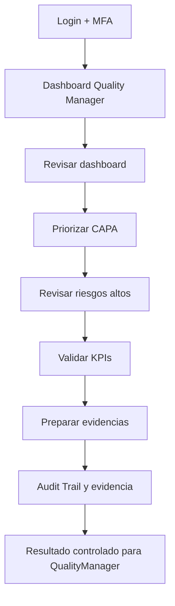
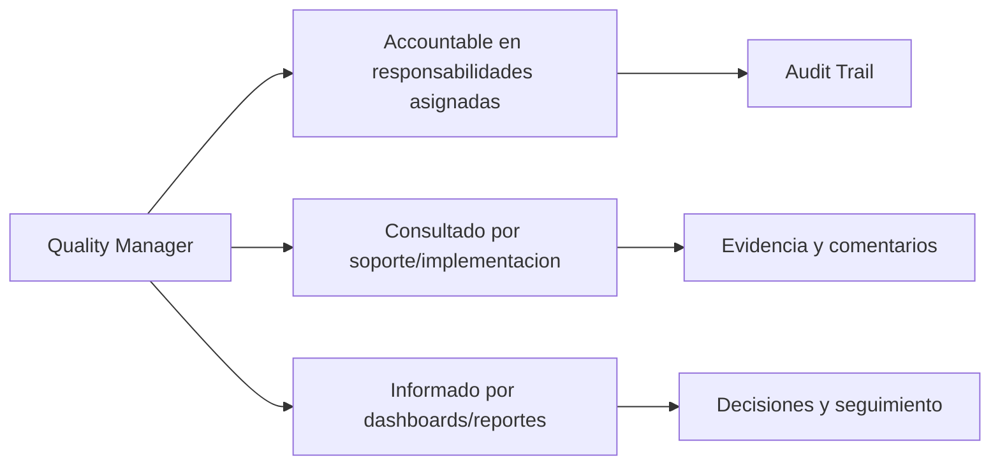

# Compliance 360 Academy

## Quality Manager Certification

## Portada

| Campo | Valor |
| --- | --- |
| Rol | Quality Manager |
| Nivel | Advanced / Operator |
| Duración | 32 horas |
| Objetivo | Formar al responsable de calidad que opera documentos, auditorías, CAPA, riesgos e indicadores. |
| Prerrequisitos | Conocer ISO 9001, BPM, HACCP o sistema de gestión de calidad. |
| Ruta de aprendizaje | Fundamentos -> Seguridad -> Módulos -> Operación -> Escenarios -> Evaluación -> Certificación |
| Certificación asociada | Compliance 360 Certified Quality Manager |
| Estado | Markdown maestro. No generar Word hasta aprobación. |

---

# CAPÍTULO 1 - Introducción al Rol

## ¿Quién es?

El `Quality Manager` es un perfil formal de Compliance 360 Academy. Su entrenamiento está diseñado para que pueda usar la plataforma sin revisar código fuente, entendiendo módulos, permisos, responsabilidades, riesgos y límites reales del producto.

## ¿Qué responsabilidades tiene?

| Responsabilidad | Dueño | Prioridad | Evidencia esperada |
| --- | --- | --- | --- |
| Controlar documentos | Quality Manager | Alta | Evidencia en Audit Trail / reporte / registro |
| Gestionar CAPA | Quality Manager | Alta | Evidencia en Audit Trail / reporte / registro |
| Analizar riesgos | Quality Manager | Alta | Evidencia en Audit Trail / reporte / registro |
| Monitorear indicadores | Quality Manager | Alta | Evidencia en Audit Trail / reporte / registro |
| Preparar auditorías | Quality Manager | Alta | Evidencia en Audit Trail / reporte / registro |

## ¿Qué puede hacer?

- Controlar documentos
- Gestionar CAPA
- Analizar riesgos
- Monitorear indicadores
- Preparar auditorías

## ¿Qué no puede hacer?

- Cambiar seguridad global
- Aprobar acciones propias sin segregación
- Cerrar CAPA sin evidencia
- Ignorar audit trail

## Flujo operativo del rol

## Matriz de responsabilidades

| Responsabilidad | Dueño | Prioridad | Evidencia esperada |
| --- | --- | --- | --- |
| Controlar documentos | Quality Manager | Alta | Evidencia en Audit Trail / reporte / registro |
| Gestionar CAPA | Quality Manager | Alta | Evidencia en Audit Trail / reporte / registro |
| Analizar riesgos | Quality Manager | Alta | Evidencia en Audit Trail / reporte / registro |
| Monitorear indicadores | Quality Manager | Alta | Evidencia en Audit Trail / reporte / registro |
| Preparar auditorías | Quality Manager | Alta | Evidencia en Audit Trail / reporte / registro |

## Matriz RACI

| Proceso | Quality Manager | Tenant Admin | Support Engineer | Consultora Admin |
| --- | --- | --- | --- | --- |
| Crear documento | R/A | I | C | C |
| Aprobar documento | R/A | I | C | C |
| Crear auditoría | R/A | I | C | C |
| Crear CAPA | R/A | I | C | C |
| Crear riesgo | R/A | I | C | C |
| Crear indicador | R/A | I | C | C |
| Generar reporte | R/A | I | C | C |

---

# CAPÍTULO 2 - Módulos que utiliza

## Módulos asignados al rol

| Módulo | Para qué sirve | Cuándo lo usa |
| --- | --- | --- |
| Document Management | Sirve para document management | Se usa cuando el rol necesita operar o consultar esta capacidad |
| Workflow Engine | Sirve para workflow engine | Se usa cuando el rol necesita operar o consultar esta capacidad |
| Technical Sheets | Sirve para technical sheets | Se usa cuando el rol necesita operar o consultar esta capacidad |
| Supplier Management | Sirve para supplier management | Se usa cuando el rol necesita operar o consultar esta capacidad |
| Audit Management | Sirve para audit management | Se usa cuando el rol necesita operar o consultar esta capacidad |
| CAPA Management | Sirve para capa management | Se usa cuando el rol necesita operar o consultar esta capacidad |
| Risk Management | Sirve para risk management | Se usa cuando el rol necesita operar o consultar esta capacidad |
| Quality Indicators | Sirve para quality indicators | Se usa cuando el rol necesita operar o consultar esta capacidad |
| Reporting Engine | Sirve para reporting engine | Se usa cuando el rol necesita operar o consultar esta capacidad |
| Dashboard | Sirve para dashboard | Se usa cuando el rol necesita operar o consultar esta capacidad |

## Matriz de módulos

| Módulo | Tipo de uso | Frecuencia | Nota de estado |
| --- | --- | --- | --- |
| Document Management | Uso principal | Diario/Semanal | Ver estado real en Handbook |
| Workflow Engine | Uso principal | Diario/Semanal | Ver estado real en Handbook |
| Technical Sheets | Uso principal | Diario/Semanal | Ver estado real en Handbook |
| Supplier Management | Uso principal | Diario/Semanal | Ver estado real en Handbook |
| Audit Management | Uso principal | Diario/Semanal | Ver estado real en Handbook |
| CAPA Management | Uso complementario | Según evento | Ver estado real en Handbook |
| Risk Management | Uso complementario | Según evento | Ver estado real en Handbook |
| Quality Indicators | Uso complementario | Según evento | Ver estado real en Handbook |
| Reporting Engine | Uso complementario | Según evento | Ver estado real en Handbook |
| Dashboard | Uso complementario | Según evento | Ver estado real en Handbook |

## Diagrama de responsabilidades

---

# CAPÍTULO 3 - Configuración Inicial

## Objetivo

Preparar el acceso y el entorno de trabajo del rol `Quality Manager` para operar sin fricción.

## Paso a paso

1. Crear o validar usuario en el tenant correcto.
2. Asignar rol y permisos correspondientes.
3. Activar MFA si el tenant lo requiere.
4. Validar acceso a dashboard.
5. Validar acceso a módulos asignados.
6. Probar operación mínima permitida.
7. Confirmar que Audit Trail registra eventos clave.
8. Documentar restricciones del rol.

## Pantalla por pantalla

| Pantalla | Acción esperada | Resultado |
| --- | --- | --- |
| Login | Ingresar credenciales y completar MFA si aplica | Sesión activa |
| Dashboard | Revisar indicadores y alertas | Prioridades visibles |
| Módulos asignados | Validar acceso según matriz | Acceso autorizado |
| Reportes | Consultar datos según permiso | Reporte visible |
| Audit Trail | Confirmar trazabilidad si aplica | Evento registrado |

## Proceso por proceso

Cada proceso debe ejecutarse con tenant, permiso y evidencia correctos. Si aparece `401`, el usuario debe renovar sesión. Si aparece `403`, debe solicitar ajuste de rol, no intentar rodear el control.

---

# CAPÍTULO 4 - Operación Diaria

## ¿Qué hace al iniciar sesión?

| Tarea | Frecuencia | Resultado esperado |
| --- | --- | --- |
| Revisar dashboard | Diario | Validar resultado en dashboard/audit trail |
| Priorizar CAPA | Diario | Validar resultado en dashboard/audit trail |
| Revisar riesgos altos | Diario | Validar resultado en dashboard/audit trail |
| Validar KPIs | Diario | Validar resultado en dashboard/audit trail |
| Preparar evidencias | Diario | Validar resultado en dashboard/audit trail |

## ¿Qué revisa?

- Estado general del dashboard.
- Tareas asignadas.
- Alertas relacionadas con sus módulos.
- Reportes o indicadores relevantes.
- Evidencia pendiente o procesos vencidos.

## ¿Qué tareas ejecuta?

- Revisar dashboard
- Priorizar CAPA
- Revisar riesgos altos
- Validar KPIs
- Preparar evidencias

## ¿Qué indicadores debe monitorear?

| Indicador | Uso | Acción esperada |
| --- | --- | --- |
| CAPA abiertas | Monitorear tendencia | Escalar desviaciones |
| CAPA vencidas | Monitorear tendencia | Escalar desviaciones |
| Riesgos altos | Monitorear tendencia | Escalar desviaciones |
| KPIs fuera de meta | Monitorear tendencia | Escalar desviaciones |
| Documentos vencidos | Monitorear tendencia | Escalar desviaciones |

---

# CAPÍTULO 5 - Procesos Paso a Paso

Los procesos de este capítulo reemplazan la versión genérica anterior. Cada flujo incluye pantalla, decisión, resultado esperado y evidencia.

## 5.1 Crear y publicar procedimiento ISO 9001

**Objetivo:** Crear un procedimiento controlado, revisado y vigente.

**Pantallas / áreas usadas:** Quality → Documents; Workflow; Audit Trail

**Prerrequisitos específicos:**

- Tipo documental Procedimiento creado
- Reviewer y Approver configurados
- Código documental disponible

**Paso a paso operativo:**

1. Ingresar a Quality → Documents.
2. Seleccionar Nuevo Documento y tipo Procedimiento.
3. Asignar código DOC-PR-001, título 'Control de Limpieza de Línea 3' y responsable Producción.
4. Clasificar en categoría BPM / Limpieza.
5. Cargar archivo v0.1 como borrador.
6. Seleccionar Workflow ISO 9001: Redactor → Reviewer → Approver.
7. Enviar a Reviewer con comentario de cambios.
8. Registrar observaciones del reviewer y cargar v0.2.
9. Enviar a Approver y aprobar como versión 1.0 vigente.
10. Validar en Audit Trail creación, revisión, aprobación y publicación.

**Decisiones clave:**

- **Documento rechazado:** debe volver a borrador con observaciones obligatorias.
- **Documento aprobado:** debe quedar vigente y disponible para usuarios autorizados.

**Resultado esperado:**

- Documento DOC-PR-001 vigente
- Versión 1.0 publicada
- Audit Trail completo

**Evidencias requeridas:**

- Archivo aprobado
- Comentarios de revisión
- Evento de aprobación

**Errores comunes a evitar:**

- Publicar sin workflow
- Usar código duplicado
- No registrar observaciones

**Validación de cierre:** el `Quality Manager` debe poder explicar qué cambió, quién aprobó, qué evidencia quedó, qué riesgo se redujo y dónde se consulta la trazabilidad.

## 5.2 Gestionar CAPA crítica vencida

**Objetivo:** Recuperar control de una CAPA crítica con vencimiento próximo o superado.

**Pantallas / áreas usadas:** Quality → CAPA; Evidence; Dashboard

**Prerrequisitos específicos:**

- CAPA abierta
- Responsable asignado
- Permiso CAPA.MANAGE

**Paso a paso operativo:**

1. Abrir Quality → CAPA y filtrar prioridad Crítica.
2. Seleccionar CAPA CAPA-2026-014 por desviación microbiológica.
3. Revisar origen, fecha límite, dueño y acciones abiertas.
4. Registrar contención inmediata: bloqueo de lote y saneamiento adicional.
5. Crear acción correctiva con responsable Producción y fecha comprometida.
6. Adjuntar evidencia de limpieza, capacitación y verificación.
7. Solicitar verificación de efectividad al Approver.
8. Si evidencia insuficiente, mantener CAPA abierta y escalar.
9. Si evidencia válida, aprobar efectividad y cerrar.
10. Validar que dashboard ya no muestre CAPA crítica vencida.

**Decisiones clave:**

- **Evidencia insuficiente:** no se cierra y se exige nueva prueba.
- **Efectividad confirmada:** se cierra con resultado verificable.

**Resultado esperado:**

- CAPA cerrada o escalada formalmente
- Riesgo residual actualizado si aplica

**Evidencias requeridas:**

- Evidencia de contención
- Evidencia correctiva
- Verificación de efectividad

**Errores comunes a evitar:**

- Cerrar por presión de fecha
- No distinguir contención de causa raíz
- No validar efectividad

**Validación de cierre:** el `Quality Manager` debe poder explicar qué cambió, quién aprobó, qué evidencia quedó, qué riesgo se redujo y dónde se consulta la trazabilidad.

## 5.3 Crear riesgo alto de inocuidad

**Objetivo:** Registrar y tratar un riesgo alto con matriz 5x5.

**Pantallas / áreas usadas:** Quality → Risks; Heat Map; CAPA

**Prerrequisitos específicos:**

- Categoría Inocuidad creada
- Matriz 5x5 activa

**Paso a paso operativo:**

1. Ir a Quality → Risks y crear riesgo.
2. Título: 'Contaminación cruzada en línea de empaque'.
3. Asignar categoría Inocuidad y proceso Empaque.
4. Evaluar probabilidad 4 e impacto 5 para score 20.
5. Clasificar nivel Alto/Crítico según matriz.
6. Definir controles existentes: limpieza, segregación y capacitación.
7. Crear tratamiento: verificación ATP diaria por 30 días.
8. Vincular CAPA si el riesgo deriva de hallazgo.
9. Asignar revisión semanal y dueño.
10. Validar aparición en Heat Map y dashboard ejecutivo.

**Decisiones clave:**

- **Score ≥ umbral crítico:** requiere tratamiento y seguimiento ejecutivo.
- **Control insuficiente:** genera CAPA o acción adicional.

**Resultado esperado:**

- Riesgo registrado con tratamiento
- Heat Map actualizado

**Evidencias requeridas:**

- Registro de riesgo
- Plan de tratamiento
- Control asociado

**Errores comunes a evitar:**

- Registrar riesgo sin dueño
- No evaluar residual
- No revisar controles

**Validación de cierre:** el `Quality Manager` debe poder explicar qué cambió, quién aprobó, qué evidencia quedó, qué riesgo se redujo y dónde se consulta la trazabilidad.

## 5.4 Crear KPI con meta y umbrales

**Objetivo:** Configurar un indicador medible y accionable.

**Pantallas / áreas usadas:** Quality → Indicators; Reporting

**Prerrequisitos específicos:**

- Categoría KPI creada
- Proceso asociado

**Paso a paso operativo:**

1. Abrir Quality → Indicators.
2. Crear indicador 'Reclamos por millón de unidades'.
3. Definir fórmula: reclamos validados / unidades despachadas * 1,000,000.
4. Asignar frecuencia mensual y dueño Calidad.
5. Definir meta ≤ 120 PPM; alerta amarilla >120 y roja >180.
6. Cargar mediciones de enero, febrero y marzo.
7. Analizar tendencia de 3 meses bajo meta.
8. Crear acción CAPA si se supera umbral rojo.
9. Aprobar indicador y publicar en dashboard.
10. Generar reporte trimestral.

**Decisiones clave:**

- **Tendencia empeora:** se debe generar acción correctiva.
- **Datos incompletos:** no se aprueba medición.

**Resultado esperado:**

- KPI activo con meta, umbrales y tendencia
- Reporte disponible

**Evidencias requeridas:**

- Fórmula documentada
- Mediciones mensuales
- Reporte

**Errores comunes a evitar:**

- KPI sin fórmula
- Meta no definida
- No actuar ante desviación

**Validación de cierre:** el `Quality Manager` debe poder explicar qué cambió, quién aprobó, qué evidencia quedó, qué riesgo se redujo y dónde se consulta la trazabilidad.

## 5.5 Ejecutar auditoría interna desde calidad

**Objetivo:** Coordinar auditoría y convertir hallazgos en acciones.

**Pantallas / áreas usadas:** Audit Management; CAPA; Documents

**Prerrequisitos específicos:**

- Programa anual creado
- Checklist ISO 9001 disponible

**Paso a paso operativo:**

1. Abrir Audit Management → Plans.
2. Crear auditoría interna Q2 para proceso Producción.
3. Seleccionar checklist ISO 9001 y áreas participantes.
4. Asignar auditor líder y responsables de área.
5. Ejecutar revisión documental previa.
6. Registrar 12 hallazgos: 2 mayores, 5 menores, 5 observaciones.
7. Adjuntar evidencias por hallazgo.
8. Convertir no conformidades mayores en CAPA.
9. Emitir reporte de auditoría.
10. Revisar tablero de auditorías y CAPA vinculadas.

**Decisiones clave:**

- **Hallazgo mayor:** requiere CAPA obligatoria.
- **Evidencia débil:** hallazgo queda pendiente de soporte.

**Resultado esperado:**

- Auditoría ejecutada
- Hallazgos clasificados
- CAPA creadas

**Evidencias requeridas:**

- Checklist
- Evidencias
- Reporte final

**Errores comunes a evitar:**

- No clasificar severidad
- No vincular CAPA
- Cerrar sin informe

**Validación de cierre:** el `Quality Manager` debe poder explicar qué cambió, quién aprobó, qué evidencia quedó, qué riesgo se redujo y dónde se consulta la trazabilidad.

---

# CAPÍTULO 6 - Escenarios Reales

Todos los escenarios fueron reemplazados por casos empresariales con datos, decisiones y consecuencias.

## 6.1 Escenario: Auditoría ISO 9001 con 12 hallazgos

**Contexto real:** Auditoría interna Q2 detecta 2 no conformidades mayores, 5 menores y 5 observaciones.

**Datos iniciales:**

- Proceso: Producción
- Checklist ISO 9001: 48 preguntas
- 12 hallazgos registrados
- 2 hallazgos mayores sin CAPA

**Decisiones que debe tomar el `Quality Manager`:**

- **Prioridad:** Los hallazgos mayores se convierten en CAPA antes del cierre.
- **Cierre:** La auditoría no se cierra hasta tener plan de acción.

**Acciones esperadas:**

1. Clasificar hallazgos por severidad.
2. Crear CAPA para cada mayor.
3. Asignar responsables y fechas.
4. Adjuntar evidencia.
5. Emitir reporte.

**Resultado esperado:** Auditoría cerrada con CAPA vinculadas y evidencias completas.

**Consecuencias si se ejecuta mal:**

- Hallazgos sin CAPA
- Reporte incompleto
- Riesgo de falla en auditoría externa

**Criterios de evaluación:** el caso se aprueba si el estudiante identifica el módulo correcto, aplica permisos adecuados, documenta evidencia, toma decisiones justificadas y deja trazabilidad auditable.

## 6.2 Escenario: Indicador bajo meta durante 3 meses

**Contexto real:** KPI de reclamos supera meta en enero, febrero y marzo.

**Datos iniciales:**

- Meta: ≤120 PPM
- Enero: 160
- Febrero: 190
- Marzo: 210

**Decisiones que debe tomar el `Quality Manager`:**

- **Umbral rojo:** Crear CAPA por tendencia.
- **Reporte:** Escalar a comité de calidad.

**Acciones esperadas:**

1. Analizar tendencia.
2. Crear CAPA.
3. Asignar acciones.
4. Generar reporte.
5. Monitorear abril.

**Resultado esperado:** KPI queda con acción correctiva y seguimiento ejecutivo.

**Consecuencias si se ejecuta mal:**

- Tendencia no tratada
- Pérdida de cliente
- No conformidad por falta de mejora

**Criterios de evaluación:** el caso se aprueba si el estudiante identifica el módulo correcto, aplica permisos adecuados, documenta evidencia, toma decisiones justificadas y deja trazabilidad auditable.

## 6.3 Escenario: CAPA crítica con vencimiento

**Contexto real:** CAPA por contaminación microbiológica vence en 48 horas sin evidencia de efectividad.

**Datos iniciales:**

- CAPA-2026-014
- Prioridad crítica
- Dueño Producción
- Sin verificación ATP

**Decisiones que debe tomar el `Quality Manager`:**

- **Cierre:** No cerrar sin efectividad.
- **Escalación:** Notificar a gerente de planta.

**Acciones esperadas:**

1. Revisar acciones.
2. Adjuntar evidencia.
3. Solicitar verificación.
4. Escalar vencimiento.
5. Cerrar solo si procede.

**Resultado esperado:** CAPA cerrada con efectividad o escalada formalmente.

**Consecuencias si se ejecuta mal:**

- Cierre inválido
- Reincidencia
- Riesgo sanitario

**Criterios de evaluación:** el caso se aprueba si el estudiante identifica el módulo correcto, aplica permisos adecuados, documenta evidencia, toma decisiones justificadas y deja trazabilidad auditable.

## 6.4 Escenario: Riesgo alto de inocuidad

**Contexto real:** Proveedor de empaque reporta desviación de limpieza que puede contaminar producto.

**Datos iniciales:**

- Probabilidad 4
- Impacto 5
- Score 20

**Decisiones que debe tomar el `Quality Manager`:**

- **Tratamiento:** Plan inmediato requerido.
- **Proveedor:** Bloquear recepción hasta evidencia.

**Acciones esperadas:**

1. Registrar riesgo.
2. Definir controles.
3. Vincular proveedor.
4. Crear acción.
5. Monitorear residual.

**Resultado esperado:** Riesgo crítico bajo tratamiento y visible en Heat Map.

**Consecuencias si se ejecuta mal:**

- Producto contaminado
- Retiro de mercado
- Falla HACCP

**Criterios de evaluación:** el caso se aprueba si el estudiante identifica el módulo correcto, aplica permisos adecuados, documenta evidencia, toma decisiones justificadas y deja trazabilidad auditable.

## 6.5 Escenario: Documento obsoleto usado en producción

**Contexto real:** Operador usa versión impresa v0.9 cuando la vigente es v1.2.

**Datos iniciales:**

- Documento DOC-PR-001
- Área Producción
- Uso detectado en turno noche

**Decisiones que debe tomar el `Quality Manager`:**

- **Obsolescencia:** Retirar copia obsoleta.
- **CAPA:** Evaluar si hubo desviación de proceso.

**Acciones esperadas:**

1. Marcar incidente.
2. Retirar copia.
3. Comunicar versión vigente.
4. Capacitar turno.
5. Registrar evidencia.

**Resultado esperado:** Documento obsoleto retirado y acción preventiva creada.

**Consecuencias si se ejecuta mal:**

- Proceso fuera de control
- No conformidad documental
- Uso repetido de versión obsoleta

**Criterios de evaluación:** el caso se aprueba si el estudiante identifica el módulo correcto, aplica permisos adecuados, documenta evidencia, toma decisiones justificadas y deja trazabilidad auditable.

## 6.6 Escenario: Proveedor HACCP vencido

**Contexto real:** Certificado HACCP del proveedor de ingrediente crítico venció hace 15 días.

**Datos iniciales:**

- Proveedor: Ingredientes del Norte
- Certificado HACCP vencido
- Órdenes abiertas

**Decisiones que debe tomar el `Quality Manager`:**

- **Homologación:** Suspender o condicionar proveedor.
- **Compras:** Bloquear nuevas órdenes hasta renovación.

**Acciones esperadas:**

1. Revisar supplier.
2. Rechazar documento vencido.
3. Solicitar actualización.
4. Notificar compras.
5. Evaluar riesgo.

**Resultado esperado:** Proveedor queda bloqueado/condicionado y documentado.

**Consecuencias si se ejecuta mal:**

- Compra no conforme
- Riesgo inocuidad
- Auditoría fallida

**Criterios de evaluación:** el caso se aprueba si el estudiante identifica el módulo correcto, aplica permisos adecuados, documenta evidencia, toma decisiones justificadas y deja trazabilidad auditable.

## 6.7 Escenario: Ficha técnica actualizada sin aprobación

**Contexto real:** Regulatorio cambia alérgenos en ficha técnica pero no existe aprobación final.

**Datos iniciales:**

- Producto: Salsa Premium
- Cambio: contiene soya
- Estado: borrador

**Decisiones que debe tomar el `Quality Manager`:**

- **Publicación:** No publicar sin aprobación.
- **Notificación:** Informar a calidad y ventas.

**Acciones esperadas:**

1. Revisar versión.
2. Solicitar aprobación.
3. Adjuntar evidencia regulatoria.
4. Publicar versión vigente.
5. Obsoletar anterior.

**Resultado esperado:** Ficha vigente refleja alérgenos y versiones anteriores quedan obsoletas.

**Consecuencias si se ejecuta mal:**

- Etiqueta incorrecta
- Riesgo legal
- Reclamo cliente

**Criterios de evaluación:** el caso se aprueba si el estudiante identifica el módulo correcto, aplica permisos adecuados, documenta evidencia, toma decisiones justificadas y deja trazabilidad auditable.

## 6.8 Escenario: Hallazgo repetitivo

**Contexto real:** La misma no conformidad aparece por tercera auditoría consecutiva.

**Datos iniciales:**

- Hallazgo: registros incompletos
- 3 recurrencias
- CAPA previa cerrada

**Decisiones que debe tomar el `Quality Manager`:**

- **Efectividad:** Reabrir o crear CAPA robusta.
- **Causa raíz:** Exigir análisis profundo.

**Acciones esperadas:**

1. Analizar recurrencia.
2. Revisar CAPA previa.
3. Crear nueva acción.
4. Escalar a dirección.
5. Medir efectividad.

**Resultado esperado:** Hallazgo recurrente tratado con causa raíz y seguimiento.

**Consecuencias si se ejecuta mal:**

- CAPA cosmética
- Reincidencia
- Pérdida de credibilidad

**Criterios de evaluación:** el caso se aprueba si el estudiante identifica el módulo correcto, aplica permisos adecuados, documenta evidencia, toma decisiones justificadas y deja trazabilidad auditable.

## 6.9 Escenario: Comité mensual de calidad

**Contexto real:** Dirección solicita resumen de CAPA, riesgos, KPIs y auditorías.

**Datos iniciales:**

- Periodo: mayo 2026
- CAPA vencidas: 4
- Riesgos críticos: 2

**Decisiones que debe tomar el `Quality Manager`:**

- **Priorización:** Presentar críticos primero.
- **Acción:** Asignar decisiones ejecutivas.

**Acciones esperadas:**

1. Ejecutar reportes.
2. Preparar tablero.
3. Identificar desvíos.
4. Registrar decisiones.
5. Asignar responsables.

**Resultado esperado:** Comité queda con decisiones y seguimiento documentados.

**Consecuencias si se ejecuta mal:**

- Reunión sin acciones
- Desvíos sin dueño
- Reporte incompleto

**Criterios de evaluación:** el caso se aprueba si el estudiante identifica el módulo correcto, aplica permisos adecuados, documenta evidencia, toma decisiones justificadas y deja trazabilidad auditable.

## 6.10 Escenario: Preparación auditor externo

**Contexto real:** Auditor externo pide evidencia documental, CAPA, proveedores y KPIs.

**Datos iniciales:**

- Fecha auditoría: 2026-07-15
- Norma ISO 9001
- Muestra: 6 procesos

**Decisiones que debe tomar el `Quality Manager`:**

- **Evidencia:** Entregar solo registros vigentes/autorizados.
- **Brechas:** Cerrar CAPA críticas antes de visita.

**Acciones esperadas:**

1. Buscar documentos.
2. Exportar reportes.
3. Revisar audit trail.
4. Validar CAPA.
5. Preparar carpeta de evidencia.

**Resultado esperado:** Paquete auditor preparado y consistente.

**Consecuencias si se ejecuta mal:**

- Evidencia obsoleta
- Datos contradictorios
- Hallazgos evitables

**Criterios de evaluación:** el caso se aprueba si el estudiante identifica el módulo correcto, aplica permisos adecuados, documenta evidencia, toma decisiones justificadas y deja trazabilidad auditable.

---

# CAPÍTULO 7 - Mejores Prácticas

## ISO 9001

- Mantener evidencia trazable de cambios, aprobaciones y cierres.
- Usar roles claros para evitar conflictos de interés.
- Medir desempeño con indicadores y revisar tendencias.
- Gestionar no conformidades mediante CAPA con causa raíz y efectividad.

## ISO 22000, HACCP y BPM

- Controlar documentos de inocuidad y BPM como documentos vigentes.
- Vincular proveedores críticos con certificaciones y evaluaciones.
- Registrar riesgos de inocuidad con controles y tratamiento.
- Mantener evidencias de acciones preventivas y correctivas.

## Buenas prácticas SaaS

- No compartir usuarios.
- Activar MFA para roles sensibles.
- Usar permisos mínimos necesarios.
- Validar providers de email/storage antes de producción.
- Escalar errores técnicos con evidencia, hora, tenant y correlation id.

---

# CAPÍTULO 8 - Errores Comunes

| Error | Consecuencia | Prevención |
| --- | --- | --- |
| Operar en tenant incorrecto | Riesgo de privacidad y datos cruzados | Confirmar tenant al iniciar |
| Usar rol con permisos excesivos | Falta de segregación | Revisar matriz RBAC |
| Cerrar sin evidencia | Debilidad ante auditoría | Adjuntar evidencia antes de cierre |
| Ignorar módulos en estado workspace | Promesa comercial incorrecta | Aplicar regla de honestidad |
| No revisar Audit Trail | Falta de trazabilidad | Validar eventos clave |
| No probar providers | Fallas de email/storage en producción | Ejecutar tests de conexión |
| Compartir credenciales | Riesgo de seguridad | Usuario individual por persona |
| Omitir MFA | Mayor exposición de acceso | Activar MFA en roles críticos |
| No documentar decisiones | Soporte y auditoría débiles | Registrar comentarios |
| No escalar a tiempo | SLA incumplido | Clasificar severidad |

---

# CAPÍTULO 9 - Checklist Operativo

## Checklist diario

- Confirmar acceso y tenant correcto.
- Revisar dashboard y tareas asignadas.
- Revisar alertas de módulos asignados.
- Ejecutar procesos prioritarios.
- Escalar bloqueos con evidencia.

## Checklist semanal

- Revisar reportes relevantes.
- Revisar tareas vencidas.
- Validar indicadores del rol.
- Confirmar que los procesos críticos tienen responsables.
- Revisar errores recurrentes.

## Checklist mensual

- Preparar comité o revisión ejecutiva.
- Auditar permisos del rol si aplica.
- Revisar tendencias y desviaciones.
- Confirmar cierre de procesos críticos.
- Documentar oportunidades de mejora.

## Checklist trimestral

- Revisar matriz de responsabilidades.
- Validar capacitación de usuarios.
- Revisar efectividad de controles.
- Actualizar procesos según cambios normativos.
- Preparar evidencia para auditorías.

---

# CAPÍTULO 10 - Evaluación Teórica

**Formato del examen:** 50 preguntas situacionales, 2 puntos por pregunta, 100 puntos totales.

**Regla de certificación:** las preguntas mezclan contexto, datos, problema, decisión y consecuencia. Las opciones incorrectas son plausibles y requieren criterio profesional.

## Pregunta 1

**Contexto:** Auditoría ISO 9001 detecta CAPA-2026-014 en estado Closed sin evidencia objetiva. Enfoque: Acción inmediata.

**Datos del sistema/caso:**

- CAPA-2026-014
- Estado: Closed
- Evidence Count: 0
- Due Date: 14 días atrás

**Problema:** El rol `Quality Manager` debe resolver `CAPA cerrada sin evidencia` sin romper segregación, evidencia ni trazabilidad.

**Decisión requerida:** ¿Cuál es la primera acción correcta?

**Consecuencia de una mala decisión:** Si se elige mal, el proceso puede avanzar sin control.

A. Mantener cerrada si el responsable confirma verbalmente.
B. Reabrir CAPA, solicitar evidencia objetiva, registrar seguimiento y actualizar Audit Trail.
C. Crear una CAPA nueva sin vincular auditoría.
D. Eliminar CAPA para evitar inconsistencia.

**Respuesta correcta:** B

**Explicación:** La opción B es correcta porque aborda `CAPA cerrada sin evidencia` con control verificable, decisión justificada y evidencia auditable. Las demás opciones son plausibles, pero dejan una brecha de cumplimiento, operación o certificación.

## Pregunta 2

**Contexto:** Auditoría ISO 9001 detecta CAPA-2026-014 en estado Closed sin evidencia objetiva. Enfoque: Decisión de aprobación.

**Datos del sistema/caso:**

- CAPA-2026-014
- Estado: Closed
- Evidence Count: 0
- Due Date: 14 días atrás

**Problema:** El rol `Quality Manager` debe resolver `CAPA cerrada sin evidencia` sin romper segregación, evidencia ni trazabilidad.

**Decisión requerida:** ¿Qué decisión protege mejor la trazabilidad y el cumplimiento?

**Consecuencia de una mala decisión:** Una aprobación débil genera evidencia no defendible.

A. Crear una CAPA nueva sin vincular auditoría.
B. Cambiar estado a In Review sin justificar.
C. Cerrar hallazgo de auditoría sin acción.
D. Bloquear cierre hasta verificar efectividad y asignar acción al responsable CAPA.

**Respuesta correcta:** D

**Explicación:** La opción D es correcta porque aborda `CAPA cerrada sin evidencia` con control verificable, decisión justificada y evidencia auditable. Las demás opciones son plausibles, pero dejan una brecha de cumplimiento, operación o certificación.

## Pregunta 3

**Contexto:** Auditoría ISO 9001 detecta CAPA-2026-014 en estado Closed sin evidencia objetiva. Enfoque: Evidencia.

**Datos del sistema/caso:**

- CAPA-2026-014
- Estado: Closed
- Evidence Count: 0
- Due Date: 14 días atrás

**Problema:** El rol `Quality Manager` debe resolver `CAPA cerrada sin evidencia` sin romper segregación, evidencia ni trazabilidad.

**Decisión requerida:** ¿Qué evidencia mínima debe exigirse antes de cerrar o avanzar?

**Consecuencia de una mala decisión:** Sin evidencia objetiva no hay certificación defendible.

A. Solicitar evidencia de efectividad, registrar decisión y mantener trazabilidad con auditoría.
B. Cambiar estado a In Review sin justificar.
C. Aceptar evidencia posterior sin fecha ni responsable.
D. Desactivar validación de evidencia.

**Respuesta correcta:** A

**Explicación:** La opción A es correcta porque aborda `CAPA cerrada sin evidencia` con control verificable, decisión justificada y evidencia auditable. Las demás opciones son plausibles, pero dejan una brecha de cumplimiento, operación o certificación.

## Pregunta 4

**Contexto:** Auditoría ISO 9001 detecta CAPA-2026-014 en estado Closed sin evidencia objetiva. Enfoque: Escalación.

**Datos del sistema/caso:**

- CAPA-2026-014
- Estado: Closed
- Evidence Count: 0
- Due Date: 14 días atrás

**Problema:** El rol `Quality Manager` debe resolver `CAPA cerrada sin evidencia` sin romper segregación, evidencia ni trazabilidad.

**Decisión requerida:** ¿Cuándo debe escalarse el caso y a quién?

**Consecuencia de una mala decisión:** Escalar tarde puede producir incumplimiento, pérdida de SLA o riesgo contractual.

A. Aceptar evidencia posterior sin fecha ni responsable.
B. Mantener cerrada si el responsable confirma verbalmente.
C. Escalar a Quality Manager y Approver por cierre inválido.
D. Eliminar CAPA para evitar inconsistencia.

**Respuesta correcta:** C

**Explicación:** La opción C es correcta porque aborda `CAPA cerrada sin evidencia` con control verificable, decisión justificada y evidencia auditable. Las demás opciones son plausibles, pero dejan una brecha de cumplimiento, operación o certificación.

## Pregunta 5

**Contexto:** Auditoría ISO 9001 detecta CAPA-2026-014 en estado Closed sin evidencia objetiva. Enfoque: Prevención.

**Datos del sistema/caso:**

- CAPA-2026-014
- Estado: Closed
- Evidence Count: 0
- Due Date: 14 días atrás

**Problema:** El rol `Quality Manager` debe resolver `CAPA cerrada sin evidencia` sin romper segregación, evidencia ni trazabilidad.

**Decisión requerida:** ¿Qué control evita la recurrencia del problema?

**Consecuencia de una mala decisión:** Resolver solo el síntoma deja el sistema expuesto a repetición.

A. Mantener cerrada si el responsable confirma verbalmente.
B. Crear control preventivo para impedir cierres sin evidencia.
C. Crear una CAPA nueva sin vincular auditoría.
D. Cerrar hallazgo de auditoría sin acción.

**Respuesta correcta:** B

**Explicación:** La opción B es correcta porque aborda `CAPA cerrada sin evidencia` con control verificable, decisión justificada y evidencia auditable. Las demás opciones son plausibles, pero dejan una brecha de cumplimiento, operación o certificación.

## Pregunta 6

**Contexto:** Matriz de riesgo muestra score 20 por contaminación cruzada en empaque. Enfoque: Acción inmediata.

**Datos del sistema/caso:**

- Probabilidad: 4
- Impacto: 5
- Control actual: limpieza semanal
- Proveedor asociado: Empaques Norte

**Problema:** El rol `Quality Manager` debe resolver `Riesgo alto de inocuidad` sin romper segregación, evidencia ni trazabilidad.

**Decisión requerida:** ¿Cuál es la primera acción correcta?

**Consecuencia de una mala decisión:** Si se elige mal, el proceso puede avanzar sin control.

A. Mantener riesgo alto hasta próxima revisión trimestral.
B. Bajar impacto porque no hubo reclamos.
C. Cerrar riesgo sin residual.
D. Registrar tratamiento inmediato, dueño, revisión semanal y control ATP diario.

**Respuesta correcta:** D

**Explicación:** La opción D es correcta porque aborda `Riesgo alto de inocuidad` con control verificable, decisión justificada y evidencia auditable. Las demás opciones son plausibles, pero dejan una brecha de cumplimiento, operación o certificación.

## Pregunta 7

**Contexto:** Matriz de riesgo muestra score 20 por contaminación cruzada en empaque. Enfoque: Decisión de aprobación.

**Datos del sistema/caso:**

- Probabilidad: 4
- Impacto: 5
- Control actual: limpieza semanal
- Proveedor asociado: Empaques Norte

**Problema:** El rol `Quality Manager` debe resolver `Riesgo alto de inocuidad` sin romper segregación, evidencia ni trazabilidad.

**Decisión requerida:** ¿Qué decisión protege mejor la trazabilidad y el cumplimiento?

**Consecuencia de una mala decisión:** Una aprobación débil genera evidencia no defendible.

A. Vincular riesgo a CAPA y proveedor crítico si hay hallazgo de origen.
B. Bajar impacto porque no hubo reclamos.
C. Crear observación sin tratamiento.
D. Eliminar proveedor del riesgo.

**Respuesta correcta:** A

**Explicación:** La opción A es correcta porque aborda `Riesgo alto de inocuidad` con control verificable, decisión justificada y evidencia auditable. Las demás opciones son plausibles, pero dejan una brecha de cumplimiento, operación o certificación.

## Pregunta 8

**Contexto:** Matriz de riesgo muestra score 20 por contaminación cruzada en empaque. Enfoque: Evidencia.

**Datos del sistema/caso:**

- Probabilidad: 4
- Impacto: 5
- Control actual: limpieza semanal
- Proveedor asociado: Empaques Norte

**Problema:** El rol `Quality Manager` debe resolver `Riesgo alto de inocuidad` sin romper segregación, evidencia ni trazabilidad.

**Decisión requerida:** ¿Qué evidencia mínima debe exigirse antes de cerrar o avanzar?

**Consecuencia de una mala decisión:** Sin evidencia objetiva no hay certificación defendible.

A. Crear observación sin tratamiento.
B. Delegar evaluación a compras sin criterio HACCP.
C. Exigir control residual documentado antes de bajar severidad.
D. Cambiar matriz para reducir score.

**Respuesta correcta:** C

**Explicación:** La opción C es correcta porque aborda `Riesgo alto de inocuidad` con control verificable, decisión justificada y evidencia auditable. Las demás opciones son plausibles, pero dejan una brecha de cumplimiento, operación o certificación.

## Pregunta 9

**Contexto:** Matriz de riesgo muestra score 20 por contaminación cruzada en empaque. Enfoque: Escalación.

**Datos del sistema/caso:**

- Probabilidad: 4
- Impacto: 5
- Control actual: limpieza semanal
- Proveedor asociado: Empaques Norte

**Problema:** El rol `Quality Manager` debe resolver `Riesgo alto de inocuidad` sin romper segregación, evidencia ni trazabilidad.

**Decisión requerida:** ¿Cuándo debe escalarse el caso y a quién?

**Consecuencia de una mala decisión:** Escalar tarde puede producir incumplimiento, pérdida de SLA o riesgo contractual.

A. Delegar evaluación a compras sin criterio HACCP.
B. Escalar a comité de calidad por riesgo crítico.
C. Mantener riesgo alto hasta próxima revisión trimestral.
D. Cerrar riesgo sin residual.

**Respuesta correcta:** B

**Explicación:** La opción B es correcta porque aborda `Riesgo alto de inocuidad` con control verificable, decisión justificada y evidencia auditable. Las demás opciones son plausibles, pero dejan una brecha de cumplimiento, operación o certificación.

## Pregunta 10

**Contexto:** Matriz de riesgo muestra score 20 por contaminación cruzada en empaque. Enfoque: Prevención.

**Datos del sistema/caso:**

- Probabilidad: 4
- Impacto: 5
- Control actual: limpieza semanal
- Proveedor asociado: Empaques Norte

**Problema:** El rol `Quality Manager` debe resolver `Riesgo alto de inocuidad` sin romper segregación, evidencia ni trazabilidad.

**Decisión requerida:** ¿Qué control evita la recurrencia del problema?

**Consecuencia de una mala decisión:** Resolver solo el síntoma deja el sistema expuesto a repetición.

A. Mantener riesgo alto hasta próxima revisión trimestral.
B. Actualizar heat map y reporte ejecutivo.
C. Bajar impacto porque no hubo reclamos.
D. Eliminar proveedor del riesgo.

**Respuesta correcta:** B

**Explicación:** La opción B es correcta porque aborda `Riesgo alto de inocuidad` con control verificable, decisión justificada y evidencia auditable. Las demás opciones son plausibles, pero dejan una brecha de cumplimiento, operación o certificación.

## Pregunta 11

**Contexto:** Indicador de reclamos supera meta durante tres meses consecutivos. Enfoque: Acción inmediata.

**Datos del sistema/caso:**

- Meta: <=120 PPM
- Enero: 160
- Febrero: 190
- Marzo: 210

**Problema:** El rol `Quality Manager` debe resolver `KPI fuera de meta` sin romper segregación, evidencia ni trazabilidad.

**Decisión requerida:** ¿Cuál es la primera acción correcta?

**Consecuencia de una mala decisión:** Si se elige mal, el proceso puede avanzar sin control.

A. Crear CAPA por tendencia, documentar análisis y revisar meta/umbral.
B. Esperar otro trimestre para confirmar tendencia.
C. Cambiar meta a 220 PPM para quedar en verde.
D. Borrar mediciones atípicas.

**Respuesta correcta:** A

**Explicación:** La opción A es correcta porque aborda `KPI fuera de meta` con control verificable, decisión justificada y evidencia auditable. Las demás opciones son plausibles, pero dejan una brecha de cumplimiento, operación o certificación.

## Pregunta 12

**Contexto:** Indicador de reclamos supera meta durante tres meses consecutivos. Enfoque: Decisión de aprobación.

**Datos del sistema/caso:**

- Meta: <=120 PPM
- Enero: 160
- Febrero: 190
- Marzo: 210

**Problema:** El rol `Quality Manager` debe resolver `KPI fuera de meta` sin romper segregación, evidencia ni trazabilidad.

**Decisión requerida:** ¿Qué decisión protege mejor la trazabilidad y el cumplimiento?

**Consecuencia de una mala decisión:** Una aprobación débil genera evidencia no defendible.

A. Cambiar meta a 220 PPM para quedar en verde.
B. Excluir reclamos abiertos de la fórmula sin criterio.
C. Validar fórmula y datos antes de presentar al comité.
D. Cerrar KPI por falta de datos.

**Respuesta correcta:** C

**Explicación:** La opción C es correcta porque aborda `KPI fuera de meta` con control verificable, decisión justificada y evidencia auditable. Las demás opciones son plausibles, pero dejan una brecha de cumplimiento, operación o certificación.

## Pregunta 13

**Contexto:** Indicador de reclamos supera meta durante tres meses consecutivos. Enfoque: Evidencia.

**Datos del sistema/caso:**

- Meta: <=120 PPM
- Enero: 160
- Febrero: 190
- Marzo: 210

**Problema:** El rol `Quality Manager` debe resolver `KPI fuera de meta` sin romper segregación, evidencia ni trazabilidad.

**Decisión requerida:** ¿Qué evidencia mínima debe exigirse antes de cerrar o avanzar?

**Consecuencia de una mala decisión:** Sin evidencia objetiva no hay certificación defendible.

A. Excluir reclamos abiertos de la fórmula sin criterio.
B. Escalar a gerencia si el umbral rojo se sostiene.
C. Reportar solo marzo como caso aislado.
D. Ocultar indicador del dashboard.

**Respuesta correcta:** B

**Explicación:** La opción B es correcta porque aborda `KPI fuera de meta` con control verificable, decisión justificada y evidencia auditable. Las demás opciones son plausibles, pero dejan una brecha de cumplimiento, operación o certificación.

## Pregunta 14

**Contexto:** Indicador de reclamos supera meta durante tres meses consecutivos. Enfoque: Escalación.

**Datos del sistema/caso:**

- Meta: <=120 PPM
- Enero: 160
- Febrero: 190
- Marzo: 210

**Problema:** El rol `Quality Manager` debe resolver `KPI fuera de meta` sin romper segregación, evidencia ni trazabilidad.

**Decisión requerida:** ¿Cuándo debe escalarse el caso y a quién?

**Consecuencia de una mala decisión:** Escalar tarde puede producir incumplimiento, pérdida de SLA o riesgo contractual.

A. Reportar solo marzo como caso aislado.
B. Adjuntar reporte trimestral y acciones comprometidas.
C. Esperar otro trimestre para confirmar tendencia.
D. Borrar mediciones atípicas.

**Respuesta correcta:** B

**Explicación:** La opción B es correcta porque aborda `KPI fuera de meta` con control verificable, decisión justificada y evidencia auditable. Las demás opciones son plausibles, pero dejan una brecha de cumplimiento, operación o certificación.

## Pregunta 15

**Contexto:** Indicador de reclamos supera meta durante tres meses consecutivos. Enfoque: Prevención.

**Datos del sistema/caso:**

- Meta: <=120 PPM
- Enero: 160
- Febrero: 190
- Marzo: 210

**Problema:** El rol `Quality Manager` debe resolver `KPI fuera de meta` sin romper segregación, evidencia ni trazabilidad.

**Decisión requerida:** ¿Qué control evita la recurrencia del problema?

**Consecuencia de una mala decisión:** Resolver solo el síntoma deja el sistema expuesto a repetición.

A. Esperar otro trimestre para confirmar tendencia.
B. Cambiar meta a 220 PPM para quedar en verde.
C. Cerrar KPI por falta de datos.
D. Agregar seguimiento mensual hasta estabilización.

**Respuesta correcta:** D

**Explicación:** La opción D es correcta porque aborda `KPI fuera de meta` con control verificable, decisión justificada y evidencia auditable. Las demás opciones son plausibles, pero dejan una brecha de cumplimiento, operación o certificación.

## Pregunta 16

**Contexto:** Producción usa copia impresa v0.9 de procedimiento cuya versión vigente es v1.2. Enfoque: Acción inmediata.

**Datos del sistema/caso:**

- Documento: DOC-PR-001
- Versión vigente: 1.2
- Copia usada: 0.9
- Área: Línea 3

**Problema:** El rol `Quality Manager` debe resolver `Documento obsoleto en producción` sin romper segregación, evidencia ni trazabilidad.

**Decisión requerida:** ¿Cuál es la primera acción correcta?

**Consecuencia de una mala decisión:** Si se elige mal, el proceso puede avanzar sin control.

A. Permitir uso hasta agotar copias impresas.
B. Actualizar copia manualmente con firma del supervisor.
C. Retirar copia obsoleta, registrar incidente documental y comunicar versión vigente.
D. Eliminar versión 0.9 del histórico.

**Respuesta correcta:** C

**Explicación:** La opción C es correcta porque aborda `Documento obsoleto en producción` con control verificable, decisión justificada y evidencia auditable. Las demás opciones son plausibles, pero dejan una brecha de cumplimiento, operación o certificación.

## Pregunta 17

**Contexto:** Producción usa copia impresa v0.9 de procedimiento cuya versión vigente es v1.2. Enfoque: Decisión de aprobación.

**Datos del sistema/caso:**

- Documento: DOC-PR-001
- Versión vigente: 1.2
- Copia usada: 0.9
- Área: Línea 3

**Problema:** El rol `Quality Manager` debe resolver `Documento obsoleto en producción` sin romper segregación, evidencia ni trazabilidad.

**Decisión requerida:** ¿Qué decisión protege mejor la trazabilidad y el cumplimiento?

**Consecuencia de una mala decisión:** Una aprobación débil genera evidencia no defendible.

A. Actualizar copia manualmente con firma del supervisor.
B. Evaluar si el uso produjo desviación y crear CAPA si corresponde.
C. Crear documento nuevo con otro código.
D. Cambiar fecha de vigencia retroactivamente.

**Respuesta correcta:** B

**Explicación:** La opción B es correcta porque aborda `Documento obsoleto en producción` con control verificable, decisión justificada y evidencia auditable. Las demás opciones son plausibles, pero dejan una brecha de cumplimiento, operación o certificación.

## Pregunta 18

**Contexto:** Producción usa copia impresa v0.9 de procedimiento cuya versión vigente es v1.2. Enfoque: Evidencia.

**Datos del sistema/caso:**

- Documento: DOC-PR-001
- Versión vigente: 1.2
- Copia usada: 0.9
- Área: Línea 3

**Problema:** El rol `Quality Manager` debe resolver `Documento obsoleto en producción` sin romper segregación, evidencia ni trazabilidad.

**Decisión requerida:** ¿Qué evidencia mínima debe exigirse antes de cerrar o avanzar?

**Consecuencia de una mala decisión:** Sin evidencia objetiva no hay certificación defendible.

A. Crear documento nuevo con otro código.
B. Actualizar distribución controlada y evidencia de capacitación.
C. Cerrar incidente como error menor sin evidencia.
D. Ignorar entrenamiento de turno.

**Respuesta correcta:** B

**Explicación:** La opción B es correcta porque aborda `Documento obsoleto en producción` con control verificable, decisión justificada y evidencia auditable. Las demás opciones son plausibles, pero dejan una brecha de cumplimiento, operación o certificación.

## Pregunta 19

**Contexto:** Producción usa copia impresa v0.9 de procedimiento cuya versión vigente es v1.2. Enfoque: Escalación.

**Datos del sistema/caso:**

- Documento: DOC-PR-001
- Versión vigente: 1.2
- Copia usada: 0.9
- Área: Línea 3

**Problema:** El rol `Quality Manager` debe resolver `Documento obsoleto en producción` sin romper segregación, evidencia ni trazabilidad.

**Decisión requerida:** ¿Cuándo debe escalarse el caso y a quién?

**Consecuencia de una mala decisión:** Escalar tarde puede producir incumplimiento, pérdida de SLA o riesgo contractual.

A. Cerrar incidente como error menor sin evidencia.
B. Permitir uso hasta agotar copias impresas.
C. Eliminar versión 0.9 del histórico.
D. Validar Audit Trail de obsolescencia y publicación.

**Respuesta correcta:** D

**Explicación:** La opción D es correcta porque aborda `Documento obsoleto en producción` con control verificable, decisión justificada y evidencia auditable. Las demás opciones son plausibles, pero dejan una brecha de cumplimiento, operación o certificación.

## Pregunta 20

**Contexto:** Producción usa copia impresa v0.9 de procedimiento cuya versión vigente es v1.2. Enfoque: Prevención.

**Datos del sistema/caso:**

- Documento: DOC-PR-001
- Versión vigente: 1.2
- Copia usada: 0.9
- Área: Línea 3

**Problema:** El rol `Quality Manager` debe resolver `Documento obsoleto en producción` sin romper segregación, evidencia ni trazabilidad.

**Decisión requerida:** ¿Qué control evita la recurrencia del problema?

**Consecuencia de una mala decisión:** Resolver solo el síntoma deja el sistema expuesto a repetición.

A. Bloquear reimpresión no controlada.
B. Permitir uso hasta agotar copias impresas.
C. Actualizar copia manualmente con firma del supervisor.
D. Cambiar fecha de vigencia retroactivamente.

**Respuesta correcta:** A

**Explicación:** La opción A es correcta porque aborda `Documento obsoleto en producción` con control verificable, decisión justificada y evidencia auditable. Las demás opciones son plausibles, pero dejan una brecha de cumplimiento, operación o certificación.

## Pregunta 21

**Contexto:** Procedimiento crítico fue aprobado por el mismo usuario que lo redactó. Enfoque: Acción inmediata.

**Datos del sistema/caso:**

- Workflow: Redactor -> Reviewer -> Approver
- Redactor=Approver
- Documento crítico
- Estado: Approved

**Problema:** El rol `Quality Manager` debe resolver `Workflow ISO 9001` sin romper segregación, evidencia ni trazabilidad.

**Decisión requerida:** ¿Cuál es la primera acción correcta?

**Consecuencia de una mala decisión:** Si se elige mal, el proceso puede avanzar sin control.

A. Aceptar aprobación por urgencia productiva.
B. Rechazar aprobación por falta de segregación y reenviar a aprobador independiente.
C. Publicar y corregir workflow después.
D. Borrar evento de aprobación.

**Respuesta correcta:** B

**Explicación:** La opción B es correcta porque aborda `Workflow ISO 9001` con control verificable, decisión justificada y evidencia auditable. Las demás opciones son plausibles, pero dejan una brecha de cumplimiento, operación o certificación.

## Pregunta 22

**Contexto:** Procedimiento crítico fue aprobado por el mismo usuario que lo redactó. Enfoque: Decisión de aprobación.

**Datos del sistema/caso:**

- Workflow: Redactor -> Reviewer -> Approver
- Redactor=Approver
- Documento crítico
- Estado: Approved

**Problema:** El rol `Quality Manager` debe resolver `Workflow ISO 9001` sin romper segregación, evidencia ni trazabilidad.

**Decisión requerida:** ¿Qué decisión protege mejor la trazabilidad y el cumplimiento?

**Consecuencia de una mala decisión:** Una aprobación débil genera evidencia no defendible.

A. Publicar y corregir workflow después.
B. Registrar desviación del workflow y preservar Audit Trail.
C. Pedir comentario informal a otro usuario.
D. Desactivar workflow para documentos críticos.

**Respuesta correcta:** B

**Explicación:** La opción B es correcta porque aborda `Workflow ISO 9001` con control verificable, decisión justificada y evidencia auditable. Las demás opciones son plausibles, pero dejan una brecha de cumplimiento, operación o certificación.

## Pregunta 23

**Contexto:** Procedimiento crítico fue aprobado por el mismo usuario que lo redactó. Enfoque: Evidencia.

**Datos del sistema/caso:**

- Workflow: Redactor -> Reviewer -> Approver
- Redactor=Approver
- Documento crítico
- Estado: Approved

**Problema:** El rol `Quality Manager` debe resolver `Workflow ISO 9001` sin romper segregación, evidencia ni trazabilidad.

**Decisión requerida:** ¿Qué evidencia mínima debe exigirse antes de cerrar o avanzar?

**Consecuencia de una mala decisión:** Sin evidencia objetiva no hay certificación defendible.

A. Pedir comentario informal a otro usuario.
B. Duplicar documento para iniciar flujo limpio.
C. Asignar permisos Approver a todos los redactores.
D. Revisar roles de Reviewer/Approver antes de publicar.

**Respuesta correcta:** D

**Explicación:** La opción D es correcta porque aborda `Workflow ISO 9001` con control verificable, decisión justificada y evidencia auditable. Las demás opciones son plausibles, pero dejan una brecha de cumplimiento, operación o certificación.

## Pregunta 24

**Contexto:** Procedimiento crítico fue aprobado por el mismo usuario que lo redactó. Enfoque: Escalación.

**Datos del sistema/caso:**

- Workflow: Redactor -> Reviewer -> Approver
- Redactor=Approver
- Documento crítico
- Estado: Approved

**Problema:** El rol `Quality Manager` debe resolver `Workflow ISO 9001` sin romper segregación, evidencia ni trazabilidad.

**Decisión requerida:** ¿Cuándo debe escalarse el caso y a quién?

**Consecuencia de una mala decisión:** Escalar tarde puede producir incumplimiento, pérdida de SLA o riesgo contractual.

A. Mantener documento en revisión hasta decisión válida.
B. Duplicar documento para iniciar flujo limpio.
C. Aceptar aprobación por urgencia productiva.
D. Borrar evento de aprobación.

**Respuesta correcta:** A

**Explicación:** La opción A es correcta porque aborda `Workflow ISO 9001` con control verificable, decisión justificada y evidencia auditable. Las demás opciones son plausibles, pero dejan una brecha de cumplimiento, operación o certificación.

## Pregunta 25

**Contexto:** Procedimiento crítico fue aprobado por el mismo usuario que lo redactó. Enfoque: Prevención.

**Datos del sistema/caso:**

- Workflow: Redactor -> Reviewer -> Approver
- Redactor=Approver
- Documento crítico
- Estado: Approved

**Problema:** El rol `Quality Manager` debe resolver `Workflow ISO 9001` sin romper segregación, evidencia ni trazabilidad.

**Decisión requerida:** ¿Qué control evita la recurrencia del problema?

**Consecuencia de una mala decisión:** Resolver solo el síntoma deja el sistema expuesto a repetición.

A. Aceptar aprobación por urgencia productiva.
B. Publicar y corregir workflow después.
C. Actualizar matriz de permisos para evitar repetición.
D. Desactivar workflow para documentos críticos.

**Respuesta correcta:** C

**Explicación:** La opción C es correcta porque aborda `Workflow ISO 9001` con control verificable, decisión justificada y evidencia auditable. Las demás opciones son plausibles, pero dejan una brecha de cumplimiento, operación o certificación.

## Pregunta 26

**Contexto:** Proveedor de ingrediente crítico tiene certificado HACCP vencido y órdenes abiertas. Enfoque: Acción inmediata.

**Datos del sistema/caso:**

- Proveedor: Ingredientes del Norte
- Certificado vencido: 15 días
- Órdenes abiertas: 3
- Riesgo: Inocuidad

**Problema:** El rol `Quality Manager` debe resolver `Proveedor HACCP vencido` sin romper segregación, evidencia ni trazabilidad.

**Decisión requerida:** ¿Cuál es la primera acción correcta?

**Consecuencia de una mala decisión:** Si se elige mal, el proceso puede avanzar sin control.

A. Aceptar certificado vencido si el proveedor promete renovación.
B. Bloquear homologación o condicionar compras hasta certificado vigente.
C. Permitir compras mientras no haya reclamos.
D. Eliminar requisito HACCP.

**Respuesta correcta:** B

**Explicación:** La opción B es correcta porque aborda `Proveedor HACCP vencido` con control verificable, decisión justificada y evidencia auditable. Las demás opciones son plausibles, pero dejan una brecha de cumplimiento, operación o certificación.

## Pregunta 27

**Contexto:** Proveedor de ingrediente crítico tiene certificado HACCP vencido y órdenes abiertas. Enfoque: Decisión de aprobación.

**Datos del sistema/caso:**

- Proveedor: Ingredientes del Norte
- Certificado vencido: 15 días
- Órdenes abiertas: 3
- Riesgo: Inocuidad

**Problema:** El rol `Quality Manager` debe resolver `Proveedor HACCP vencido` sin romper segregación, evidencia ni trazabilidad.

**Decisión requerida:** ¿Qué decisión protege mejor la trazabilidad y el cumplimiento?

**Consecuencia de una mala decisión:** Una aprobación débil genera evidencia no defendible.

A. Permitir compras mientras no haya reclamos.
B. Cambiar fecha de vencimiento provisionalmente.
C. Cerrar evaluación proveedor sin certificado.
D. Rechazar documento vencido y solicitar actualización formal.

**Respuesta correcta:** D

**Explicación:** La opción D es correcta porque aborda `Proveedor HACCP vencido` con control verificable, decisión justificada y evidencia auditable. Las demás opciones son plausibles, pero dejan una brecha de cumplimiento, operación o certificación.

## Pregunta 28

**Contexto:** Proveedor de ingrediente crítico tiene certificado HACCP vencido y órdenes abiertas. Enfoque: Evidencia.

**Datos del sistema/caso:**

- Proveedor: Ingredientes del Norte
- Certificado vencido: 15 días
- Órdenes abiertas: 3
- Riesgo: Inocuidad

**Problema:** El rol `Quality Manager` debe resolver `Proveedor HACCP vencido` sin romper segregación, evidencia ni trazabilidad.

**Decisión requerida:** ¿Qué evidencia mínima debe exigirse antes de cerrar o avanzar?

**Consecuencia de una mala decisión:** Sin evidencia objetiva no hay certificación defendible.

A. Evaluar riesgo de inocuidad y notificar compras.
B. Cambiar fecha de vencimiento provisionalmente.
C. Archivar documento como evidencia válida.
D. Ocultar alerta de vencimiento.

**Respuesta correcta:** A

**Explicación:** La opción A es correcta porque aborda `Proveedor HACCP vencido` con control verificable, decisión justificada y evidencia auditable. Las demás opciones son plausibles, pero dejan una brecha de cumplimiento, operación o certificación.

## Pregunta 29

**Contexto:** Proveedor de ingrediente crítico tiene certificado HACCP vencido y órdenes abiertas. Enfoque: Escalación.

**Datos del sistema/caso:**

- Proveedor: Ingredientes del Norte
- Certificado vencido: 15 días
- Órdenes abiertas: 3
- Riesgo: Inocuidad

**Problema:** El rol `Quality Manager` debe resolver `Proveedor HACCP vencido` sin romper segregación, evidencia ni trazabilidad.

**Decisión requerida:** ¿Cuándo debe escalarse el caso y a quién?

**Consecuencia de una mala decisión:** Escalar tarde puede producir incumplimiento, pérdida de SLA o riesgo contractual.

A. Archivar documento como evidencia válida.
B. Aceptar certificado vencido si el proveedor promete renovación.
C. Registrar evidencia de decisión y seguimiento.
D. Eliminar requisito HACCP.

**Respuesta correcta:** C

**Explicación:** La opción C es correcta porque aborda `Proveedor HACCP vencido` con control verificable, decisión justificada y evidencia auditable. Las demás opciones son plausibles, pero dejan una brecha de cumplimiento, operación o certificación.

## Pregunta 30

**Contexto:** Proveedor de ingrediente crítico tiene certificado HACCP vencido y órdenes abiertas. Enfoque: Prevención.

**Datos del sistema/caso:**

- Proveedor: Ingredientes del Norte
- Certificado vencido: 15 días
- Órdenes abiertas: 3
- Riesgo: Inocuidad

**Problema:** El rol `Quality Manager` debe resolver `Proveedor HACCP vencido` sin romper segregación, evidencia ni trazabilidad.

**Decisión requerida:** ¿Qué control evita la recurrencia del problema?

**Consecuencia de una mala decisión:** Resolver solo el síntoma deja el sistema expuesto a repetición.

A. Aceptar certificado vencido si el proveedor promete renovación.
B. Vincular proveedor a riesgo o CAPA si hay impacto.
C. Permitir compras mientras no haya reclamos.
D. Cerrar evaluación proveedor sin certificado.

**Respuesta correcta:** B

**Explicación:** La opción B es correcta porque aborda `Proveedor HACCP vencido` con control verificable, decisión justificada y evidencia auditable. Las demás opciones son plausibles, pero dejan una brecha de cumplimiento, operación o certificación.

## Pregunta 31

**Contexto:** Ficha técnica cambia alérgenos pero la versión no está aprobada. Enfoque: Acción inmediata.

**Datos del sistema/caso:**

- Producto: Salsa Premium
- Cambio: contiene soya
- Estado: Draft
- Ventas solicita publicación

**Problema:** El rol `Quality Manager` debe resolver `Ficha técnica con alérgenos` sin romper segregación, evidencia ni trazabilidad.

**Decisión requerida:** ¿Cuál es la primera acción correcta?

**Consecuencia de una mala decisión:** Si se elige mal, el proceso puede avanzar sin control.

A. Publicar por urgencia comercial.
B. Enviar PDF por correo mientras se aprueba.
C. Eliminar alérgeno para evitar impacto.
D. Mantener en draft hasta aprobación regulatoria/calidad.

**Respuesta correcta:** D

**Explicación:** La opción D es correcta porque aborda `Ficha técnica con alérgenos` con control verificable, decisión justificada y evidencia auditable. Las demás opciones son plausibles, pero dejan una brecha de cumplimiento, operación o certificación.

## Pregunta 32

**Contexto:** Ficha técnica cambia alérgenos pero la versión no está aprobada. Enfoque: Decisión de aprobación.

**Datos del sistema/caso:**

- Producto: Salsa Premium
- Cambio: contiene soya
- Estado: Draft
- Ventas solicita publicación

**Problema:** El rol `Quality Manager` debe resolver `Ficha técnica con alérgenos` sin romper segregación, evidencia ni trazabilidad.

**Decisión requerida:** ¿Qué decisión protege mejor la trazabilidad y el cumplimiento?

**Consecuencia de una mala decisión:** Una aprobación débil genera evidencia no defendible.

A. Adjuntar evidencia del cambio de alérgenos y enviar a workflow.
B. Enviar PDF por correo mientras se aprueba.
C. Modificar etiqueta sin cambiar ficha.
D. Sobrescribir versión anterior.

**Respuesta correcta:** A

**Explicación:** La opción A es correcta porque aborda `Ficha técnica con alérgenos` con control verificable, decisión justificada y evidencia auditable. Las demás opciones son plausibles, pero dejan una brecha de cumplimiento, operación o certificación.

## Pregunta 33

**Contexto:** Ficha técnica cambia alérgenos pero la versión no está aprobada. Enfoque: Evidencia.

**Datos del sistema/caso:**

- Producto: Salsa Premium
- Cambio: contiene soya
- Estado: Draft
- Ventas solicita publicación

**Problema:** El rol `Quality Manager` debe resolver `Ficha técnica con alérgenos` sin romper segregación, evidencia ni trazabilidad.

**Decisión requerida:** ¿Qué evidencia mínima debe exigirse antes de cerrar o avanzar?

**Consecuencia de una mala decisión:** Sin evidencia objetiva no hay certificación defendible.

A. Modificar etiqueta sin cambiar ficha.
B. Aprobar verbalmente en comité.
C. Obsoletar versión anterior solo después de publicar la vigente.
D. Omitir revisión regulatoria.

**Respuesta correcta:** C

**Explicación:** La opción C es correcta porque aborda `Ficha técnica con alérgenos` con control verificable, decisión justificada y evidencia auditable. Las demás opciones son plausibles, pero dejan una brecha de cumplimiento, operación o certificación.

## Pregunta 34

**Contexto:** Ficha técnica cambia alérgenos pero la versión no está aprobada. Enfoque: Escalación.

**Datos del sistema/caso:**

- Producto: Salsa Premium
- Cambio: contiene soya
- Estado: Draft
- Ventas solicita publicación

**Problema:** El rol `Quality Manager` debe resolver `Ficha técnica con alérgenos` sin romper segregación, evidencia ni trazabilidad.

**Decisión requerida:** ¿Cuándo debe escalarse el caso y a quién?

**Consecuencia de una mala decisión:** Escalar tarde puede producir incumplimiento, pérdida de SLA o riesgo contractual.

A. Aprobar verbalmente en comité.
B. Notificar áreas afectadas por impacto en cliente/etiqueta.
C. Publicar por urgencia comercial.
D. Eliminar alérgeno para evitar impacto.

**Respuesta correcta:** B

**Explicación:** La opción B es correcta porque aborda `Ficha técnica con alérgenos` con control verificable, decisión justificada y evidencia auditable. Las demás opciones son plausibles, pero dejan una brecha de cumplimiento, operación o certificación.

## Pregunta 35

**Contexto:** Ficha técnica cambia alérgenos pero la versión no está aprobada. Enfoque: Prevención.

**Datos del sistema/caso:**

- Producto: Salsa Premium
- Cambio: contiene soya
- Estado: Draft
- Ventas solicita publicación

**Problema:** El rol `Quality Manager` debe resolver `Ficha técnica con alérgenos` sin romper segregación, evidencia ni trazabilidad.

**Decisión requerida:** ¿Qué control evita la recurrencia del problema?

**Consecuencia de una mala decisión:** Resolver solo el síntoma deja el sistema expuesto a repetición.

A. Publicar por urgencia comercial.
B. Validar Audit Trail de aprobación.
C. Enviar PDF por correo mientras se aprueba.
D. Sobrescribir versión anterior.

**Respuesta correcta:** B

**Explicación:** La opción B es correcta porque aborda `Ficha técnica con alérgenos` con control verificable, decisión justificada y evidencia auditable. Las demás opciones son plausibles, pero dejan una brecha de cumplimiento, operación o certificación.

## Pregunta 36

**Contexto:** Auditoría interna Q2 registra 2 mayores, 5 menores y 5 observaciones. Enfoque: Acción inmediata.

**Datos del sistema/caso:**

- Checklist: ISO 9001
- Hallazgos mayores: 2
- Evidencia parcial
- CAPA pendientes: 0

**Problema:** El rol `Quality Manager` debe resolver `Auditoría con 12 hallazgos` sin romper segregación, evidencia ni trazabilidad.

**Decisión requerida:** ¿Cuál es la primera acción correcta?

**Consecuencia de una mala decisión:** Si se elige mal, el proceso puede avanzar sin control.

A. Convertir hallazgos mayores en CAPA antes del cierre.
B. Cerrar auditoría con plan verbal.
C. Agrupar todos los hallazgos en una observación.
D. Eliminar observaciones para bajar riesgo.

**Respuesta correcta:** A

**Explicación:** La opción A es correcta porque aborda `Auditoría con 12 hallazgos` con control verificable, decisión justificada y evidencia auditable. Las demás opciones son plausibles, pero dejan una brecha de cumplimiento, operación o certificación.

## Pregunta 37

**Contexto:** Auditoría interna Q2 registra 2 mayores, 5 menores y 5 observaciones. Enfoque: Decisión de aprobación.

**Datos del sistema/caso:**

- Checklist: ISO 9001
- Hallazgos mayores: 2
- Evidencia parcial
- CAPA pendientes: 0

**Problema:** El rol `Quality Manager` debe resolver `Auditoría con 12 hallazgos` sin romper segregación, evidencia ni trazabilidad.

**Decisión requerida:** ¿Qué decisión protege mejor la trazabilidad y el cumplimiento?

**Consecuencia de una mala decisión:** Una aprobación débil genera evidencia no defendible.

A. Agrupar todos los hallazgos en una observación.
B. Crear CAPA solo para hallazgos repetidos.
C. Clasificar severidad y asignar responsables por hallazgo.
D. Cerrar mayores como menores.

**Respuesta correcta:** C

**Explicación:** La opción C es correcta porque aborda `Auditoría con 12 hallazgos` con control verificable, decisión justificada y evidencia auditable. Las demás opciones son plausibles, pero dejan una brecha de cumplimiento, operación o certificación.

## Pregunta 38

**Contexto:** Auditoría interna Q2 registra 2 mayores, 5 menores y 5 observaciones. Enfoque: Evidencia.

**Datos del sistema/caso:**

- Checklist: ISO 9001
- Hallazgos mayores: 2
- Evidencia parcial
- CAPA pendientes: 0

**Problema:** El rol `Quality Manager` debe resolver `Auditoría con 12 hallazgos` sin romper segregación, evidencia ni trazabilidad.

**Decisión requerida:** ¿Qué evidencia mínima debe exigirse antes de cerrar o avanzar?

**Consecuencia de una mala decisión:** Sin evidencia objetiva no hay certificación defendible.

A. Crear CAPA solo para hallazgos repetidos.
B. Bloquear cierre si no hay evidencia mínima.
C. Enviar reporte sin responsables.
D. No adjuntar evidencia.

**Respuesta correcta:** B

**Explicación:** La opción B es correcta porque aborda `Auditoría con 12 hallazgos` con control verificable, decisión justificada y evidencia auditable. Las demás opciones son plausibles, pero dejan una brecha de cumplimiento, operación o certificación.

## Pregunta 39

**Contexto:** Auditoría interna Q2 registra 2 mayores, 5 menores y 5 observaciones. Enfoque: Escalación.

**Datos del sistema/caso:**

- Checklist: ISO 9001
- Hallazgos mayores: 2
- Evidencia parcial
- CAPA pendientes: 0

**Problema:** El rol `Quality Manager` debe resolver `Auditoría con 12 hallazgos` sin romper segregación, evidencia ni trazabilidad.

**Decisión requerida:** ¿Cuándo debe escalarse el caso y a quién?

**Consecuencia de una mala decisión:** Escalar tarde puede producir incumplimiento, pérdida de SLA o riesgo contractual.

A. Enviar reporte sin responsables.
B. Emitir reporte con acciones y fechas.
C. Cerrar auditoría con plan verbal.
D. Eliminar observaciones para bajar riesgo.

**Respuesta correcta:** B

**Explicación:** La opción B es correcta porque aborda `Auditoría con 12 hallazgos` con control verificable, decisión justificada y evidencia auditable. Las demás opciones son plausibles, pero dejan una brecha de cumplimiento, operación o certificación.

## Pregunta 40

**Contexto:** Auditoría interna Q2 registra 2 mayores, 5 menores y 5 observaciones. Enfoque: Prevención.

**Datos del sistema/caso:**

- Checklist: ISO 9001
- Hallazgos mayores: 2
- Evidencia parcial
- CAPA pendientes: 0

**Problema:** El rol `Quality Manager` debe resolver `Auditoría con 12 hallazgos` sin romper segregación, evidencia ni trazabilidad.

**Decisión requerida:** ¿Qué control evita la recurrencia del problema?

**Consecuencia de una mala decisión:** Resolver solo el síntoma deja el sistema expuesto a repetición.

A. Cerrar auditoría con plan verbal.
B. Agrupar todos los hallazgos en una observación.
C. Cerrar mayores como menores.
D. Monitorear CAPA vinculadas en dashboard.

**Respuesta correcta:** D

**Explicación:** La opción D es correcta porque aborda `Auditoría con 12 hallazgos` con control verificable, decisión justificada y evidencia auditable. Las demás opciones son plausibles, pero dejan una brecha de cumplimiento, operación o certificación.

## Pregunta 41

**Contexto:** Comité mensual revisa CAPA vencidas, riesgos críticos y KPIs rojos. Enfoque: Acción inmediata.

**Datos del sistema/caso:**

- CAPA vencidas: 4
- Riesgos críticos: 2
- KPIs rojos: 3
- Sponsor: Gerencia

**Problema:** El rol `Quality Manager` debe resolver `Comité de calidad` sin romper segregación, evidencia ni trazabilidad.

**Decisión requerida:** ¿Cuál es la primera acción correcta?

**Consecuencia de una mala decisión:** Si se elige mal, el proceso puede avanzar sin control.

A. Presentar todos los temas en orden alfabético.
B. Cerrar reunión sin responsables para evitar conflictos.
C. Presentar prioridades por riesgo y asignar decisiones con responsables.
D. Eliminar CAPA vencidas del reporte.

**Respuesta correcta:** C

**Explicación:** La opción C es correcta porque aborda `Comité de calidad` con control verificable, decisión justificada y evidencia auditable. Las demás opciones son plausibles, pero dejan una brecha de cumplimiento, operación o certificación.

## Pregunta 42

**Contexto:** Comité mensual revisa CAPA vencidas, riesgos críticos y KPIs rojos. Enfoque: Decisión de aprobación.

**Datos del sistema/caso:**

- CAPA vencidas: 4
- Riesgos críticos: 2
- KPIs rojos: 3
- Sponsor: Gerencia

**Problema:** El rol `Quality Manager` debe resolver `Comité de calidad` sin romper segregación, evidencia ni trazabilidad.

**Decisión requerida:** ¿Qué decisión protege mejor la trazabilidad y el cumplimiento?

**Consecuencia de una mala decisión:** Una aprobación débil genera evidencia no defendible.

A. Cerrar reunión sin responsables para evitar conflictos.
B. Separar acciones inmediatas de acciones preventivas.
C. Tratar KPIs rojos como informativos.
D. Cambiar semáforos manualmente.

**Respuesta correcta:** B

**Explicación:** La opción B es correcta porque aborda `Comité de calidad` con control verificable, decisión justificada y evidencia auditable. Las demás opciones son plausibles, pero dejan una brecha de cumplimiento, operación o certificación.

## Pregunta 43

**Contexto:** Comité mensual revisa CAPA vencidas, riesgos críticos y KPIs rojos. Enfoque: Evidencia.

**Datos del sistema/caso:**

- CAPA vencidas: 4
- Riesgos críticos: 2
- KPIs rojos: 3
- Sponsor: Gerencia

**Problema:** El rol `Quality Manager` debe resolver `Comité de calidad` sin romper segregación, evidencia ni trazabilidad.

**Decisión requerida:** ¿Qué evidencia mínima debe exigirse antes de cerrar o avanzar?

**Consecuencia de una mala decisión:** Sin evidencia objetiva no hay certificación defendible.

A. Tratar KPIs rojos como informativos.
B. Registrar decisiones y fechas en reportes/Audit Trail.
C. Mover decisiones al siguiente comité.
D. Omitir riesgos críticos por falta de tiempo.

**Respuesta correcta:** B

**Explicación:** La opción B es correcta porque aborda `Comité de calidad` con control verificable, decisión justificada y evidencia auditable. Las demás opciones son plausibles, pero dejan una brecha de cumplimiento, operación o certificación.

## Pregunta 44

**Contexto:** Comité mensual revisa CAPA vencidas, riesgos críticos y KPIs rojos. Enfoque: Escalación.

**Datos del sistema/caso:**

- CAPA vencidas: 4
- Riesgos críticos: 2
- KPIs rojos: 3
- Sponsor: Gerencia

**Problema:** El rol `Quality Manager` debe resolver `Comité de calidad` sin romper segregación, evidencia ni trazabilidad.

**Decisión requerida:** ¿Cuándo debe escalarse el caso y a quién?

**Consecuencia de una mala decisión:** Escalar tarde puede producir incumplimiento, pérdida de SLA o riesgo contractual.

A. Mover decisiones al siguiente comité.
B. Presentar todos los temas en orden alfabético.
C. Eliminar CAPA vencidas del reporte.
D. Escalar riesgos críticos no tratados.

**Respuesta correcta:** D

**Explicación:** La opción D es correcta porque aborda `Comité de calidad` con control verificable, decisión justificada y evidencia auditable. Las demás opciones son plausibles, pero dejan una brecha de cumplimiento, operación o certificación.

## Pregunta 45

**Contexto:** Comité mensual revisa CAPA vencidas, riesgos críticos y KPIs rojos. Enfoque: Prevención.

**Datos del sistema/caso:**

- CAPA vencidas: 4
- Riesgos críticos: 2
- KPIs rojos: 3
- Sponsor: Gerencia

**Problema:** El rol `Quality Manager` debe resolver `Comité de calidad` sin romper segregación, evidencia ni trazabilidad.

**Decisión requerida:** ¿Qué control evita la recurrencia del problema?

**Consecuencia de una mala decisión:** Resolver solo el síntoma deja el sistema expuesto a repetición.

A. Programar seguimiento con evidencia.
B. Presentar todos los temas en orden alfabético.
C. Cerrar reunión sin responsables para evitar conflictos.
D. Cambiar semáforos manualmente.

**Respuesta correcta:** A

**Explicación:** La opción A es correcta porque aborda `Comité de calidad` con control verificable, decisión justificada y evidencia auditable. Las demás opciones son plausibles, pero dejan una brecha de cumplimiento, operación o certificación.

## Pregunta 46

**Contexto:** Auditor externo solicita paquete documental, CAPA, proveedores y KPIs. Enfoque: Acción inmediata.

**Datos del sistema/caso:**

- Fecha auditoría: 2026-07-15
- Norma: ISO 9001
- Muestra: 6 procesos
- CAPA críticas: 2

**Problema:** El rol `Quality Manager` debe resolver `Preparación auditor externo` sin romper segregación, evidencia ni trazabilidad.

**Decisión requerida:** ¿Cuál es la primera acción correcta?

**Consecuencia de una mala decisión:** Si se elige mal, el proceso puede avanzar sin control.

A. Enviar todo el repositorio documental.
B. Preparar paquete con documentos vigentes, reportes y Audit Trail.
C. Entregar versiones borrador si son más recientes.
D. Modificar registros para la auditoría.

**Respuesta correcta:** B

**Explicación:** La opción B es correcta porque aborda `Preparación auditor externo` con control verificable, decisión justificada y evidencia auditable. Las demás opciones son plausibles, pero dejan una brecha de cumplimiento, operación o certificación.

## Pregunta 47

**Contexto:** Auditor externo solicita paquete documental, CAPA, proveedores y KPIs. Enfoque: Decisión de aprobación.

**Datos del sistema/caso:**

- Fecha auditoría: 2026-07-15
- Norma: ISO 9001
- Muestra: 6 procesos
- CAPA críticas: 2

**Problema:** El rol `Quality Manager` debe resolver `Preparación auditor externo` sin romper segregación, evidencia ni trazabilidad.

**Decisión requerida:** ¿Qué decisión protege mejor la trazabilidad y el cumplimiento?

**Consecuencia de una mala decisión:** Una aprobación débil genera evidencia no defendible.

A. Entregar versiones borrador si son más recientes.
B. Cerrar o escalar CAPA críticas antes de la visita.
C. Ocultar CAPA críticas abiertas.
D. Eliminar hallazgos abiertos.

**Respuesta correcta:** B

**Explicación:** La opción B es correcta porque aborda `Preparación auditor externo` con control verificable, decisión justificada y evidencia auditable. Las demás opciones son plausibles, pero dejan una brecha de cumplimiento, operación o certificación.

## Pregunta 48

**Contexto:** Auditor externo solicita paquete documental, CAPA, proveedores y KPIs. Enfoque: Evidencia.

**Datos del sistema/caso:**

- Fecha auditoría: 2026-07-15
- Norma: ISO 9001
- Muestra: 6 procesos
- CAPA críticas: 2

**Problema:** El rol `Quality Manager` debe resolver `Preparación auditor externo` sin romper segregación, evidencia ni trazabilidad.

**Decisión requerida:** ¿Qué evidencia mínima debe exigirse antes de cerrar o avanzar?

**Consecuencia de una mala decisión:** Sin evidencia objetiva no hay certificación defendible.

A. Ocultar CAPA críticas abiertas.
B. Preparar evidencia solo el día anterior.
C. Compartir credenciales con auditor externo.
D. Validar consistencia entre documentos, KPIs y proveedores.

**Respuesta correcta:** D

**Explicación:** La opción D es correcta porque aborda `Preparación auditor externo` con control verificable, decisión justificada y evidencia auditable. Las demás opciones son plausibles, pero dejan una brecha de cumplimiento, operación o certificación.

## Pregunta 49

**Contexto:** Auditor externo solicita paquete documental, CAPA, proveedores y KPIs. Enfoque: Escalación.

**Datos del sistema/caso:**

- Fecha auditoría: 2026-07-15
- Norma: ISO 9001
- Muestra: 6 procesos
- CAPA críticas: 2

**Problema:** El rol `Quality Manager` debe resolver `Preparación auditor externo` sin romper segregación, evidencia ni trazabilidad.

**Decisión requerida:** ¿Cuándo debe escalarse el caso y a quién?

**Consecuencia de una mala decisión:** Escalar tarde puede producir incumplimiento, pérdida de SLA o riesgo contractual.

A. Separar evidencias autorizadas de datos internos no requeridos.
B. Preparar evidencia solo el día anterior.
C. Enviar todo el repositorio documental.
D. Modificar registros para la auditoría.

**Respuesta correcta:** A

**Explicación:** La opción A es correcta porque aborda `Preparación auditor externo` con control verificable, decisión justificada y evidencia auditable. Las demás opciones son plausibles, pero dejan una brecha de cumplimiento, operación o certificación.

## Pregunta 50

**Contexto:** Auditor externo solicita paquete documental, CAPA, proveedores y KPIs. Enfoque: Prevención.

**Datos del sistema/caso:**

- Fecha auditoría: 2026-07-15
- Norma: ISO 9001
- Muestra: 6 procesos
- CAPA críticas: 2

**Problema:** El rol `Quality Manager` debe resolver `Preparación auditor externo` sin romper segregación, evidencia ni trazabilidad.

**Decisión requerida:** ¿Qué control evita la recurrencia del problema?

**Consecuencia de una mala decisión:** Resolver solo el síntoma deja el sistema expuesto a repetición.

A. Enviar todo el repositorio documental.
B. Entregar versiones borrador si son más recientes.
C. Registrar entrega y responsable.
D. Eliminar hallazgos abiertos.

**Respuesta correcta:** C

**Explicación:** La opción C es correcta porque aborda `Preparación auditor externo` con control verificable, decisión justificada y evidencia auditable. Las demás opciones son plausibles, pero dejan una brecha de cumplimiento, operación o certificación.

---

# CAPÍTULO 11 - Evaluación Práctica y Laboratorios

Los laboratorios se endurecieron para certificación real. Cada laboratorio define nivel, tiempo máximo, resultado esperado, evidencia, errores críticos, criterios de fallo y rúbrica específica.

## 11.1 Laboratorio: CAPA crítica

**Nivel:** Intermediate

**Tiempo máximo:** 60 minutos

**Objetivo:** Demostrar competencia real en `CAPA crítica` usando Compliance 360 con datos de entrenamiento controlados.

**Contexto:** Auditoría ISO 9001 detecta CAPA-2026-014 en estado Closed sin evidencia objetiva.

**Datos iniciales:**

- CAPA-2026-014
- Estado: Closed
- Evidence Count: 0
- Due Date: 14 días atrás

**Acciones esperadas:**

1. Analizar el caso y confirmar rol, alcance, permisos y estado inicial.
2. Ejecutar el flujo funcional correspondiente sin saltar controles.
3. Tomar decisiones justificadas cuando exista evidencia incompleta, estado inconsistente o riesgo de cumplimiento.
4. Registrar o identificar evidencia objetiva.
5. Validar resultado esperado en dashboard, reporte, provider health, Audit Trail o artefacto equivalente.
6. Documentar conclusión, riesgo residual y siguiente acción.

**Resultado esperado:** el caso `CAPA crítica` queda resuelto, escalado o bloqueado con evidencia suficiente para auditoría y certificación.

**Evidencia requerida:**

- Registro final del caso.
- Evidencia objetiva o captura del estado final.
- Decisión documentada y justificada.
- Validación de trazabilidad o resultado operativo.

**Errores críticos:**

- Cerrar o aprobar sin evidencia suficiente.
- Modificar alcance, permisos, providers o datos sin autorización.
- Ignorar señales de riesgo, estado vencido, error técnico o impacto cliente.
- No diferenciar workaround temporal de solución permanente.

**Criterios de fallo:**

- Menos de 80 puntos.
- Cualquier error crítico.
- Evidencia no verificable.
- Resultado final inconsistente con el objetivo del laboratorio.

**Puntos por criterio:**

| Criterio específico | Puntos | Qué debe demostrar |
| --- | --- | --- |
| Análisis raíz | 20 | Evidencia específica del laboratorio `CAPA crítica` que demuestre análisis raíz. |
| Acción correctiva | 20 | Evidencia específica del laboratorio `CAPA crítica` que demuestre acción correctiva. |
| Evidencia objetiva | 20 | Evidencia específica del laboratorio `CAPA crítica` que demuestre evidencia objetiva. |
| Efectividad | 20 | Evidencia específica del laboratorio `CAPA crítica` que demuestre efectividad. |
| Trazabilidad | 20 | Evidencia específica del laboratorio `CAPA crítica` que demuestre trazabilidad. |

## 11.2 Laboratorio: Riesgo de inocuidad

**Nivel:** Advanced

**Tiempo máximo:** 90 minutos

**Objetivo:** Demostrar competencia real en `Riesgo de inocuidad` usando Compliance 360 con datos de entrenamiento controlados.

**Contexto:** Matriz de riesgo muestra score 20 por contaminación cruzada en empaque.

**Datos iniciales:**

- Probabilidad: 4
- Impacto: 5
- Control actual: limpieza semanal
- Proveedor asociado: Empaques Norte

**Acciones esperadas:**

1. Analizar el caso y confirmar rol, alcance, permisos y estado inicial.
2. Ejecutar el flujo funcional correspondiente sin saltar controles.
3. Tomar decisiones justificadas cuando exista evidencia incompleta, estado inconsistente o riesgo de cumplimiento.
4. Registrar o identificar evidencia objetiva.
5. Validar resultado esperado en dashboard, reporte, provider health, Audit Trail o artefacto equivalente.
6. Documentar conclusión, riesgo residual y siguiente acción.

**Resultado esperado:** el caso `Riesgo de inocuidad` queda resuelto, escalado o bloqueado con evidencia suficiente para auditoría y certificación.

**Evidencia requerida:**

- Registro final del caso.
- Evidencia objetiva o captura del estado final.
- Decisión documentada y justificada.
- Validación de trazabilidad o resultado operativo.

**Errores críticos:**

- Cerrar o aprobar sin evidencia suficiente.
- Modificar alcance, permisos, providers o datos sin autorización.
- Ignorar señales de riesgo, estado vencido, error técnico o impacto cliente.
- No diferenciar workaround temporal de solución permanente.

**Criterios de fallo:**

- Menos de 80 puntos.
- Cualquier error crítico.
- Evidencia no verificable.
- Resultado final inconsistente con el objetivo del laboratorio.

**Puntos por criterio:**

| Criterio específico | Puntos | Qué debe demostrar |
| --- | --- | --- |
| Análisis raíz | 20 | Evidencia específica del laboratorio `Riesgo de inocuidad` que demuestre análisis raíz. |
| Acción correctiva | 20 | Evidencia específica del laboratorio `Riesgo de inocuidad` que demuestre acción correctiva. |
| Evidencia objetiva | 20 | Evidencia específica del laboratorio `Riesgo de inocuidad` que demuestre evidencia objetiva. |
| Efectividad | 20 | Evidencia específica del laboratorio `Riesgo de inocuidad` que demuestre efectividad. |
| Trazabilidad | 20 | Evidencia específica del laboratorio `Riesgo de inocuidad` que demuestre trazabilidad. |

## 11.3 Laboratorio: KPI fuera de meta

**Nivel:** Expert

**Tiempo máximo:** 120 minutos

**Objetivo:** Demostrar competencia real en `KPI fuera de meta` usando Compliance 360 con datos de entrenamiento controlados.

**Contexto:** Indicador de reclamos supera meta durante tres meses consecutivos.

**Datos iniciales:**

- Meta: <=120 PPM
- Enero: 160
- Febrero: 190
- Marzo: 210

**Acciones esperadas:**

1. Analizar el caso y confirmar rol, alcance, permisos y estado inicial.
2. Ejecutar el flujo funcional correspondiente sin saltar controles.
3. Tomar decisiones justificadas cuando exista evidencia incompleta, estado inconsistente o riesgo de cumplimiento.
4. Registrar o identificar evidencia objetiva.
5. Validar resultado esperado en dashboard, reporte, provider health, Audit Trail o artefacto equivalente.
6. Documentar conclusión, riesgo residual y siguiente acción.

**Resultado esperado:** el caso `KPI fuera de meta` queda resuelto, escalado o bloqueado con evidencia suficiente para auditoría y certificación.

**Evidencia requerida:**

- Registro final del caso.
- Evidencia objetiva o captura del estado final.
- Decisión documentada y justificada.
- Validación de trazabilidad o resultado operativo.

**Errores críticos:**

- Cerrar o aprobar sin evidencia suficiente.
- Modificar alcance, permisos, providers o datos sin autorización.
- Ignorar señales de riesgo, estado vencido, error técnico o impacto cliente.
- No diferenciar workaround temporal de solución permanente.

**Criterios de fallo:**

- Menos de 80 puntos.
- Cualquier error crítico.
- Evidencia no verificable.
- Resultado final inconsistente con el objetivo del laboratorio.

**Puntos por criterio:**

| Criterio específico | Puntos | Qué debe demostrar |
| --- | --- | --- |
| Análisis raíz | 20 | Evidencia específica del laboratorio `KPI fuera de meta` que demuestre análisis raíz. |
| Acción correctiva | 20 | Evidencia específica del laboratorio `KPI fuera de meta` que demuestre acción correctiva. |
| Evidencia objetiva | 20 | Evidencia específica del laboratorio `KPI fuera de meta` que demuestre evidencia objetiva. |
| Efectividad | 20 | Evidencia específica del laboratorio `KPI fuera de meta` que demuestre efectividad. |
| Trazabilidad | 20 | Evidencia específica del laboratorio `KPI fuera de meta` que demuestre trazabilidad. |

## 11.4 Laboratorio: Documento obsoleto

**Nivel:** Advanced

**Tiempo máximo:** 90 minutos

**Objetivo:** Demostrar competencia real en `Documento obsoleto` usando Compliance 360 con datos de entrenamiento controlados.

**Contexto:** Producción usa copia impresa v0.9 de procedimiento cuya versión vigente es v1.2.

**Datos iniciales:**

- Documento: DOC-PR-001
- Versión vigente: 1.2
- Copia usada: 0.9
- Área: Línea 3

**Acciones esperadas:**

1. Analizar el caso y confirmar rol, alcance, permisos y estado inicial.
2. Ejecutar el flujo funcional correspondiente sin saltar controles.
3. Tomar decisiones justificadas cuando exista evidencia incompleta, estado inconsistente o riesgo de cumplimiento.
4. Registrar o identificar evidencia objetiva.
5. Validar resultado esperado en dashboard, reporte, provider health, Audit Trail o artefacto equivalente.
6. Documentar conclusión, riesgo residual y siguiente acción.

**Resultado esperado:** el caso `Documento obsoleto` queda resuelto, escalado o bloqueado con evidencia suficiente para auditoría y certificación.

**Evidencia requerida:**

- Registro final del caso.
- Evidencia objetiva o captura del estado final.
- Decisión documentada y justificada.
- Validación de trazabilidad o resultado operativo.

**Errores críticos:**

- Cerrar o aprobar sin evidencia suficiente.
- Modificar alcance, permisos, providers o datos sin autorización.
- Ignorar señales de riesgo, estado vencido, error técnico o impacto cliente.
- No diferenciar workaround temporal de solución permanente.

**Criterios de fallo:**

- Menos de 80 puntos.
- Cualquier error crítico.
- Evidencia no verificable.
- Resultado final inconsistente con el objetivo del laboratorio.

**Puntos por criterio:**

| Criterio específico | Puntos | Qué debe demostrar |
| --- | --- | --- |
| Análisis raíz | 20 | Evidencia específica del laboratorio `Documento obsoleto` que demuestre análisis raíz. |
| Acción correctiva | 20 | Evidencia específica del laboratorio `Documento obsoleto` que demuestre acción correctiva. |
| Evidencia objetiva | 20 | Evidencia específica del laboratorio `Documento obsoleto` que demuestre evidencia objetiva. |
| Efectividad | 20 | Evidencia específica del laboratorio `Documento obsoleto` que demuestre efectividad. |
| Trazabilidad | 20 | Evidencia específica del laboratorio `Documento obsoleto` que demuestre trazabilidad. |

## 11.5 Laboratorio: Workflow ISO 9001

**Nivel:** Beginner

**Tiempo máximo:** 45 minutos

**Objetivo:** Demostrar competencia real en `Workflow ISO 9001` usando Compliance 360 con datos de entrenamiento controlados.

**Contexto:** Procedimiento crítico fue aprobado por el mismo usuario que lo redactó.

**Datos iniciales:**

- Workflow: Redactor -> Reviewer -> Approver
- Redactor=Approver
- Documento crítico
- Estado: Approved

**Acciones esperadas:**

1. Analizar el caso y confirmar rol, alcance, permisos y estado inicial.
2. Ejecutar el flujo funcional correspondiente sin saltar controles.
3. Tomar decisiones justificadas cuando exista evidencia incompleta, estado inconsistente o riesgo de cumplimiento.
4. Registrar o identificar evidencia objetiva.
5. Validar resultado esperado en dashboard, reporte, provider health, Audit Trail o artefacto equivalente.
6. Documentar conclusión, riesgo residual y siguiente acción.

**Resultado esperado:** el caso `Workflow ISO 9001` queda resuelto, escalado o bloqueado con evidencia suficiente para auditoría y certificación.

**Evidencia requerida:**

- Registro final del caso.
- Evidencia objetiva o captura del estado final.
- Decisión documentada y justificada.
- Validación de trazabilidad o resultado operativo.

**Errores críticos:**

- Cerrar o aprobar sin evidencia suficiente.
- Modificar alcance, permisos, providers o datos sin autorización.
- Ignorar señales de riesgo, estado vencido, error técnico o impacto cliente.
- No diferenciar workaround temporal de solución permanente.

**Criterios de fallo:**

- Menos de 80 puntos.
- Cualquier error crítico.
- Evidencia no verificable.
- Resultado final inconsistente con el objetivo del laboratorio.

**Puntos por criterio:**

| Criterio específico | Puntos | Qué debe demostrar |
| --- | --- | --- |
| Análisis raíz | 20 | Evidencia específica del laboratorio `Workflow ISO 9001` que demuestre análisis raíz. |
| Acción correctiva | 20 | Evidencia específica del laboratorio `Workflow ISO 9001` que demuestre acción correctiva. |
| Evidencia objetiva | 20 | Evidencia específica del laboratorio `Workflow ISO 9001` que demuestre evidencia objetiva. |
| Efectividad | 20 | Evidencia específica del laboratorio `Workflow ISO 9001` que demuestre efectividad. |
| Trazabilidad | 20 | Evidencia específica del laboratorio `Workflow ISO 9001` que demuestre trazabilidad. |

## 11.6 Laboratorio: Proveedor HACCP

**Nivel:** Intermediate

**Tiempo máximo:** 60 minutos

**Objetivo:** Demostrar competencia real en `Proveedor HACCP` usando Compliance 360 con datos de entrenamiento controlados.

**Contexto:** Proveedor de ingrediente crítico tiene certificado HACCP vencido y órdenes abiertas.

**Datos iniciales:**

- Proveedor: Ingredientes del Norte
- Certificado vencido: 15 días
- Órdenes abiertas: 3
- Riesgo: Inocuidad

**Acciones esperadas:**

1. Analizar el caso y confirmar rol, alcance, permisos y estado inicial.
2. Ejecutar el flujo funcional correspondiente sin saltar controles.
3. Tomar decisiones justificadas cuando exista evidencia incompleta, estado inconsistente o riesgo de cumplimiento.
4. Registrar o identificar evidencia objetiva.
5. Validar resultado esperado en dashboard, reporte, provider health, Audit Trail o artefacto equivalente.
6. Documentar conclusión, riesgo residual y siguiente acción.

**Resultado esperado:** el caso `Proveedor HACCP` queda resuelto, escalado o bloqueado con evidencia suficiente para auditoría y certificación.

**Evidencia requerida:**

- Registro final del caso.
- Evidencia objetiva o captura del estado final.
- Decisión documentada y justificada.
- Validación de trazabilidad o resultado operativo.

**Errores críticos:**

- Cerrar o aprobar sin evidencia suficiente.
- Modificar alcance, permisos, providers o datos sin autorización.
- Ignorar señales de riesgo, estado vencido, error técnico o impacto cliente.
- No diferenciar workaround temporal de solución permanente.

**Criterios de fallo:**

- Menos de 80 puntos.
- Cualquier error crítico.
- Evidencia no verificable.
- Resultado final inconsistente con el objetivo del laboratorio.

**Puntos por criterio:**

| Criterio específico | Puntos | Qué debe demostrar |
| --- | --- | --- |
| Análisis raíz | 20 | Evidencia específica del laboratorio `Proveedor HACCP` que demuestre análisis raíz. |
| Acción correctiva | 20 | Evidencia específica del laboratorio `Proveedor HACCP` que demuestre acción correctiva. |
| Evidencia objetiva | 20 | Evidencia específica del laboratorio `Proveedor HACCP` que demuestre evidencia objetiva. |
| Efectividad | 20 | Evidencia específica del laboratorio `Proveedor HACCP` que demuestre efectividad. |
| Trazabilidad | 20 | Evidencia específica del laboratorio `Proveedor HACCP` que demuestre trazabilidad. |

## 11.7 Laboratorio: Ficha técnica

**Nivel:** Advanced

**Tiempo máximo:** 90 minutos

**Objetivo:** Demostrar competencia real en `Ficha técnica` usando Compliance 360 con datos de entrenamiento controlados.

**Contexto:** Ficha técnica cambia alérgenos pero la versión no está aprobada.

**Datos iniciales:**

- Producto: Salsa Premium
- Cambio: contiene soya
- Estado: Draft
- Ventas solicita publicación

**Acciones esperadas:**

1. Analizar el caso y confirmar rol, alcance, permisos y estado inicial.
2. Ejecutar el flujo funcional correspondiente sin saltar controles.
3. Tomar decisiones justificadas cuando exista evidencia incompleta, estado inconsistente o riesgo de cumplimiento.
4. Registrar o identificar evidencia objetiva.
5. Validar resultado esperado en dashboard, reporte, provider health, Audit Trail o artefacto equivalente.
6. Documentar conclusión, riesgo residual y siguiente acción.

**Resultado esperado:** el caso `Ficha técnica` queda resuelto, escalado o bloqueado con evidencia suficiente para auditoría y certificación.

**Evidencia requerida:**

- Registro final del caso.
- Evidencia objetiva o captura del estado final.
- Decisión documentada y justificada.
- Validación de trazabilidad o resultado operativo.

**Errores críticos:**

- Cerrar o aprobar sin evidencia suficiente.
- Modificar alcance, permisos, providers o datos sin autorización.
- Ignorar señales de riesgo, estado vencido, error técnico o impacto cliente.
- No diferenciar workaround temporal de solución permanente.

**Criterios de fallo:**

- Menos de 80 puntos.
- Cualquier error crítico.
- Evidencia no verificable.
- Resultado final inconsistente con el objetivo del laboratorio.

**Puntos por criterio:**

| Criterio específico | Puntos | Qué debe demostrar |
| --- | --- | --- |
| Análisis raíz | 20 | Evidencia específica del laboratorio `Ficha técnica` que demuestre análisis raíz. |
| Acción correctiva | 20 | Evidencia específica del laboratorio `Ficha técnica` que demuestre acción correctiva. |
| Evidencia objetiva | 20 | Evidencia específica del laboratorio `Ficha técnica` que demuestre evidencia objetiva. |
| Efectividad | 20 | Evidencia específica del laboratorio `Ficha técnica` que demuestre efectividad. |
| Trazabilidad | 20 | Evidencia específica del laboratorio `Ficha técnica` que demuestre trazabilidad. |

## 11.8 Laboratorio: Auditoría 12 hallazgos

**Nivel:** Expert

**Tiempo máximo:** 120 minutos

**Objetivo:** Demostrar competencia real en `Auditoría 12 hallazgos` usando Compliance 360 con datos de entrenamiento controlados.

**Contexto:** Auditoría interna Q2 registra 2 mayores, 5 menores y 5 observaciones.

**Datos iniciales:**

- Checklist: ISO 9001
- Hallazgos mayores: 2
- Evidencia parcial
- CAPA pendientes: 0

**Acciones esperadas:**

1. Analizar el caso y confirmar rol, alcance, permisos y estado inicial.
2. Ejecutar el flujo funcional correspondiente sin saltar controles.
3. Tomar decisiones justificadas cuando exista evidencia incompleta, estado inconsistente o riesgo de cumplimiento.
4. Registrar o identificar evidencia objetiva.
5. Validar resultado esperado en dashboard, reporte, provider health, Audit Trail o artefacto equivalente.
6. Documentar conclusión, riesgo residual y siguiente acción.

**Resultado esperado:** el caso `Auditoría 12 hallazgos` queda resuelto, escalado o bloqueado con evidencia suficiente para auditoría y certificación.

**Evidencia requerida:**

- Registro final del caso.
- Evidencia objetiva o captura del estado final.
- Decisión documentada y justificada.
- Validación de trazabilidad o resultado operativo.

**Errores críticos:**

- Cerrar o aprobar sin evidencia suficiente.
- Modificar alcance, permisos, providers o datos sin autorización.
- Ignorar señales de riesgo, estado vencido, error técnico o impacto cliente.
- No diferenciar workaround temporal de solución permanente.

**Criterios de fallo:**

- Menos de 80 puntos.
- Cualquier error crítico.
- Evidencia no verificable.
- Resultado final inconsistente con el objetivo del laboratorio.

**Puntos por criterio:**

| Criterio específico | Puntos | Qué debe demostrar |
| --- | --- | --- |
| Análisis raíz | 20 | Evidencia específica del laboratorio `Auditoría 12 hallazgos` que demuestre análisis raíz. |
| Acción correctiva | 20 | Evidencia específica del laboratorio `Auditoría 12 hallazgos` que demuestre acción correctiva. |
| Evidencia objetiva | 20 | Evidencia específica del laboratorio `Auditoría 12 hallazgos` que demuestre evidencia objetiva. |
| Efectividad | 20 | Evidencia específica del laboratorio `Auditoría 12 hallazgos` que demuestre efectividad. |
| Trazabilidad | 20 | Evidencia específica del laboratorio `Auditoría 12 hallazgos` que demuestre trazabilidad. |

## 11.9 Laboratorio: Comité calidad

**Nivel:** Advanced

**Tiempo máximo:** 90 minutos

**Objetivo:** Demostrar competencia real en `Comité calidad` usando Compliance 360 con datos de entrenamiento controlados.

**Contexto:** Comité mensual revisa CAPA vencidas, riesgos críticos y KPIs rojos.

**Datos iniciales:**

- CAPA vencidas: 4
- Riesgos críticos: 2
- KPIs rojos: 3
- Sponsor: Gerencia

**Acciones esperadas:**

1. Analizar el caso y confirmar rol, alcance, permisos y estado inicial.
2. Ejecutar el flujo funcional correspondiente sin saltar controles.
3. Tomar decisiones justificadas cuando exista evidencia incompleta, estado inconsistente o riesgo de cumplimiento.
4. Registrar o identificar evidencia objetiva.
5. Validar resultado esperado en dashboard, reporte, provider health, Audit Trail o artefacto equivalente.
6. Documentar conclusión, riesgo residual y siguiente acción.

**Resultado esperado:** el caso `Comité calidad` queda resuelto, escalado o bloqueado con evidencia suficiente para auditoría y certificación.

**Evidencia requerida:**

- Registro final del caso.
- Evidencia objetiva o captura del estado final.
- Decisión documentada y justificada.
- Validación de trazabilidad o resultado operativo.

**Errores críticos:**

- Cerrar o aprobar sin evidencia suficiente.
- Modificar alcance, permisos, providers o datos sin autorización.
- Ignorar señales de riesgo, estado vencido, error técnico o impacto cliente.
- No diferenciar workaround temporal de solución permanente.

**Criterios de fallo:**

- Menos de 80 puntos.
- Cualquier error crítico.
- Evidencia no verificable.
- Resultado final inconsistente con el objetivo del laboratorio.

**Puntos por criterio:**

| Criterio específico | Puntos | Qué debe demostrar |
| --- | --- | --- |
| Análisis raíz | 20 | Evidencia específica del laboratorio `Comité calidad` que demuestre análisis raíz. |
| Acción correctiva | 20 | Evidencia específica del laboratorio `Comité calidad` que demuestre acción correctiva. |
| Evidencia objetiva | 20 | Evidencia específica del laboratorio `Comité calidad` que demuestre evidencia objetiva. |
| Efectividad | 20 | Evidencia específica del laboratorio `Comité calidad` que demuestre efectividad. |
| Trazabilidad | 20 | Evidencia específica del laboratorio `Comité calidad` que demuestre trazabilidad. |

## 11.10 Laboratorio: Paquete auditor externo

**Nivel:** Beginner

**Tiempo máximo:** 45 minutos

**Objetivo:** Demostrar competencia real en `Paquete auditor externo` usando Compliance 360 con datos de entrenamiento controlados.

**Contexto:** Auditor externo solicita paquete documental, CAPA, proveedores y KPIs.

**Datos iniciales:**

- Fecha auditoría: 2026-07-15
- Norma: ISO 9001
- Muestra: 6 procesos
- CAPA críticas: 2

**Acciones esperadas:**

1. Analizar el caso y confirmar rol, alcance, permisos y estado inicial.
2. Ejecutar el flujo funcional correspondiente sin saltar controles.
3. Tomar decisiones justificadas cuando exista evidencia incompleta, estado inconsistente o riesgo de cumplimiento.
4. Registrar o identificar evidencia objetiva.
5. Validar resultado esperado en dashboard, reporte, provider health, Audit Trail o artefacto equivalente.
6. Documentar conclusión, riesgo residual y siguiente acción.

**Resultado esperado:** el caso `Paquete auditor externo` queda resuelto, escalado o bloqueado con evidencia suficiente para auditoría y certificación.

**Evidencia requerida:**

- Registro final del caso.
- Evidencia objetiva o captura del estado final.
- Decisión documentada y justificada.
- Validación de trazabilidad o resultado operativo.

**Errores críticos:**

- Cerrar o aprobar sin evidencia suficiente.
- Modificar alcance, permisos, providers o datos sin autorización.
- Ignorar señales de riesgo, estado vencido, error técnico o impacto cliente.
- No diferenciar workaround temporal de solución permanente.

**Criterios de fallo:**

- Menos de 80 puntos.
- Cualquier error crítico.
- Evidencia no verificable.
- Resultado final inconsistente con el objetivo del laboratorio.

**Puntos por criterio:**

| Criterio específico | Puntos | Qué debe demostrar |
| --- | --- | --- |
| Análisis raíz | 20 | Evidencia específica del laboratorio `Paquete auditor externo` que demuestre análisis raíz. |
| Acción correctiva | 20 | Evidencia específica del laboratorio `Paquete auditor externo` que demuestre acción correctiva. |
| Evidencia objetiva | 20 | Evidencia específica del laboratorio `Paquete auditor externo` que demuestre evidencia objetiva. |
| Efectividad | 20 | Evidencia específica del laboratorio `Paquete auditor externo` que demuestre efectividad. |
| Trazabilidad | 20 | Evidencia específica del laboratorio `Paquete auditor externo` que demuestre trazabilidad. |

# Final Certification Exam

## Estructura del examen final

| Componente | Cantidad | Puntaje |
| --- | ---: | ---: |
| Preguntas teóricas | 50 | 100 |
| Casos de análisis | 10 | 100 |
| Laboratorios seleccionados | 5 | 100 |
| Examen práctico integrador | 1 | 100 |

## Caso práctico integrador

**Caso:** Resolver una auditoría ISO 9001 con documento obsoleto, CAPA crítica, KPI rojo y proveedor HACCP vencido.

**Objetivo:** demostrar que el candidato puede operar como `Quality Manager` sin apoyo externo, tomar decisiones correctas, producir evidencia y explicar el impacto.

**Evaluación:** el evaluador selecciona 5 laboratorios de este capítulo, 2 casos complejos del Capítulo 6 y una simulación integradora. El candidato debe defender sus decisiones y mostrar evidencia.

## Resultado del examen

| Resultado | Criterio |
| --- | --- |
| Pass | 90+ total, sin errores críticos y examen práctico aprobado. |
| Conditional Pass | 80-89 total, sin errores críticos, pero con una brecha menor documentada. Requiere remediación. |
| Fail | Menos de 80, evidencia insuficiente o cualquier error crítico. |

---

# CAPÍTULO 12 - Certificación

## Criterios de aprobación endurecidos

Para obtener `Compliance 360 Certified Quality Manager`, el candidato debe demostrar competencia teórica, práctica y de juicio profesional. La aprobación no se basa solo en memoria del manual.

## Puntaje mínimo por nivel

| Nivel de certificación | Puntaje mínimo | Uso permitido |
| --- | ---: | --- |
| Certified User | 80 | Operación básica o consulta supervisada. |
| Certified Operator | 85 | Operación diaria de procesos asignados. |
| Certified Specialist | 90 | Operación autónoma de módulos críticos. |
| Certified Consultant | 92 | Implementación, capacitación o asesoría a clientes. |
| Certified Architect | 95 | Diseño, gobierno y operación enterprise. |

## Puntaje mínimo de este manual

| Componente | Peso | Mínimo requerido |
| --- | ---: | ---: |
| Examen teórico | 35% | 85% |
| Laboratorios prácticos | 35% | 90% |
| Casos de análisis | 15% | 85% |
| Examen práctico integrador | 15% | 90% |

## Criterios de fallo automático

- Operar en tenant incorrecto.
- Cerrar, aprobar o certificar sin evidencia objetiva.
- Saltar segregación de funciones.
- Ignorar un riesgo crítico, falla de provider, error productivo o hallazgo mayor.
- Presentar como final una funcionalidad que el handbook declara como workspace, parcial o dependiente de roadmap.

## Competencias certificadas

- Ejecutar decisiones de `Quality Manager` con datos, evidencia y trazabilidad.
- Resolver casos reales sin depender de explicaciones externas.
- Interpretar estados, riesgos, evidencias, permisos y resultados.
- Defender una decisión ante auditoría, soporte, consultoría, cliente o comité.

## Nivel alcanzado

`Certified Specialist`.

## Decisión de certificación

| Resultado | Interpretación |
| --- | --- |
| Pass | Certificable para operación real del rol. |
| Conditional Pass | Requiere remediación específica antes de operar sin supervisión. |
| Fail | No certificable; repetir laboratorios y examen. |
