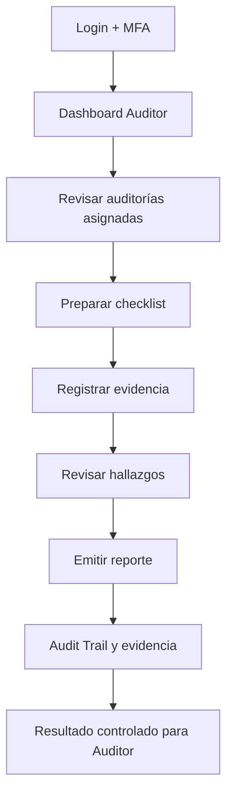
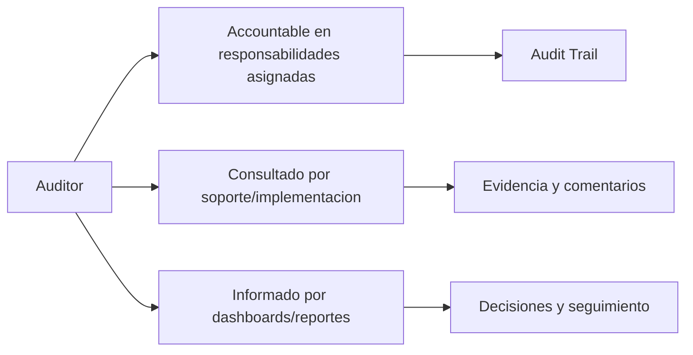

# Compliance 360 Academy

## Auditor Certification

## Portada

| Campo | Valor |
| --- | --- |
| Rol | Auditor |
| Nivel | Intermediate / Auditor |
| Duración | 24 horas |
| Objetivo | Formar auditores internos y externos para planificar, ejecutar y cerrar auditorías en Compliance 360. |
| Prerrequisitos | Conocer ISO 19011, auditoría interna y gestión de hallazgos. |
| Ruta de aprendizaje | Fundamentos -> Seguridad -> Módulos -> Operación -> Escenarios -> Evaluación -> Certificación |
| Certificación asociada | Compliance 360 Certified Auditor |
| Estado | Markdown maestro. No generar Word hasta aprobación. |

---

# CAPÍTULO 1 - Introducción al Rol

## ¿Quién es?

El `Auditor` es un perfil formal de Compliance 360 Academy. Su entrenamiento está diseñado para que pueda usar la plataforma sin revisar código fuente, entendiendo módulos, permisos, responsabilidades, riesgos y límites reales del producto.

## ¿Qué responsabilidades tiene?

| Responsabilidad | Dueño | Prioridad | Evidencia esperada |
| --- | --- | --- | --- |
| Preparar auditorías | Auditor | Alta | Evidencia en Audit Trail / reporte / registro |
| Ejecutar checklist | Auditor | Alta | Evidencia en Audit Trail / reporte / registro |
| Registrar hallazgos | Auditor | Alta | Evidencia en Audit Trail / reporte / registro |
| Adjuntar evidencia | Auditor | Alta | Evidencia en Audit Trail / reporte / registro |
| Vincular CAPA | Auditor | Alta | Evidencia en Audit Trail / reporte / registro |

## ¿Qué puede hacer?

- Preparar auditorías
- Ejecutar checklist
- Registrar hallazgos
- Adjuntar evidencia
- Vincular CAPA

## ¿Qué no puede hacer?

- Modificar roles
- Cerrar CAPA sin autoridad
- Eliminar evidencia
- Auditar sin criterio definido

## Flujo operativo del rol

## Matriz de responsabilidades

| Responsabilidad | Dueño | Prioridad | Evidencia esperada |
| --- | --- | --- | --- |
| Preparar auditorías | Auditor | Alta | Evidencia en Audit Trail / reporte / registro |
| Ejecutar checklist | Auditor | Alta | Evidencia en Audit Trail / reporte / registro |
| Registrar hallazgos | Auditor | Alta | Evidencia en Audit Trail / reporte / registro |
| Adjuntar evidencia | Auditor | Alta | Evidencia en Audit Trail / reporte / registro |
| Vincular CAPA | Auditor | Alta | Evidencia en Audit Trail / reporte / registro |

## Matriz RACI

| Proceso | Auditor | Tenant Admin | Quality Manager | Support Engineer | Consultora Admin |
| --- | --- | --- | --- | --- | --- |
| Crear plan | R/A | I | I | C | C |
| Ejecutar auditoría | R/A | I | I | C | C |
| Registrar hallazgo | R/A | I | I | C | C |
| Adjuntar evidencia | R/A | I | I | C | C |
| Crear CAPA vinculada | R/A | I | I | C | C |
| Cerrar auditoría | R/A | I | I | C | C |

---

# CAPÍTULO 2 - Módulos que utiliza

## Módulos asignados al rol

| Módulo | Para qué sirve | Cuándo lo usa |
| --- | --- | --- |
| Audit Management | Sirve para audit management | Se usa cuando el rol necesita operar o consultar esta capacidad |
| Audit Trail | Sirve para audit trail | Se usa cuando el rol necesita operar o consultar esta capacidad |
| CAPA Management | Sirve para capa management | Se usa cuando el rol necesita operar o consultar esta capacidad |
| Document Management | Sirve para document management | Se usa cuando el rol necesita operar o consultar esta capacidad |
| Supplier Management | Sirve para supplier management | Se usa cuando el rol necesita operar o consultar esta capacidad |
| Reporting Engine | Sirve para reporting engine | Se usa cuando el rol necesita operar o consultar esta capacidad |
| Dashboard | Sirve para dashboard | Se usa cuando el rol necesita operar o consultar esta capacidad |

## Matriz de módulos

| Módulo | Tipo de uso | Frecuencia | Nota de estado |
| --- | --- | --- | --- |
| Audit Management | Uso principal | Diario/Semanal | Ver estado real en Handbook |
| Audit Trail | Uso principal | Diario/Semanal | Ver estado real en Handbook |
| CAPA Management | Uso principal | Diario/Semanal | Ver estado real en Handbook |
| Document Management | Uso principal | Diario/Semanal | Ver estado real en Handbook |
| Supplier Management | Uso principal | Diario/Semanal | Ver estado real en Handbook |
| Reporting Engine | Uso complementario | Según evento | Ver estado real en Handbook |
| Dashboard | Uso complementario | Según evento | Ver estado real en Handbook |

## Diagrama de responsabilidades

---

# CAPÍTULO 3 - Configuración Inicial

## Objetivo

Preparar el acceso y el entorno de trabajo del rol `Auditor` para operar sin fricción.

## Paso a paso

1. Crear o validar usuario en el tenant correcto.
2. Asignar rol y permisos correspondientes.
3. Activar MFA si el tenant lo requiere.
4. Validar acceso a dashboard.
5. Validar acceso a módulos asignados.
6. Probar operación mínima permitida.
7. Confirmar que Audit Trail registra eventos clave.
8. Documentar restricciones del rol.

## Pantalla por pantalla

| Pantalla | Acción esperada | Resultado |
| --- | --- | --- |
| Login | Ingresar credenciales y completar MFA si aplica | Sesión activa |
| Dashboard | Revisar indicadores y alertas | Prioridades visibles |
| Módulos asignados | Validar acceso según matriz | Acceso autorizado |
| Reportes | Consultar datos según permiso | Reporte visible |
| Audit Trail | Confirmar trazabilidad si aplica | Evento registrado |

## Proceso por proceso

Cada proceso debe ejecutarse con tenant, permiso y evidencia correctos. Si aparece `401`, el usuario debe renovar sesión. Si aparece `403`, debe solicitar ajuste de rol, no intentar rodear el control.

---

# CAPÍTULO 4 - Operación Diaria

## ¿Qué hace al iniciar sesión?

| Tarea | Frecuencia | Resultado esperado |
| --- | --- | --- |
| Revisar auditorías asignadas | Diario | Validar resultado en dashboard/audit trail |
| Preparar checklist | Diario | Validar resultado en dashboard/audit trail |
| Registrar evidencia | Diario | Validar resultado en dashboard/audit trail |
| Revisar hallazgos | Diario | Validar resultado en dashboard/audit trail |
| Emitir reporte | Diario | Validar resultado en dashboard/audit trail |

## ¿Qué revisa?

- Estado general del dashboard.
- Tareas asignadas.
- Alertas relacionadas con sus módulos.
- Reportes o indicadores relevantes.
- Evidencia pendiente o procesos vencidos.

## ¿Qué tareas ejecuta?

- Revisar auditorías asignadas
- Preparar checklist
- Registrar evidencia
- Revisar hallazgos
- Emitir reporte

## ¿Qué indicadores debe monitorear?

| Indicador | Uso | Acción esperada |
| --- | --- | --- |
| Auditorías abiertas | Monitorear tendencia | Escalar desviaciones |
| Hallazgos por severidad | Monitorear tendencia | Escalar desviaciones |
| CAPA vinculadas | Monitorear tendencia | Escalar desviaciones |
| Evidencias pendientes | Monitorear tendencia | Escalar desviaciones |
| Auditorías vencidas | Monitorear tendencia | Escalar desviaciones |

---

# CAPÍTULO 5 - Procesos Paso a Paso

Los procesos de este capítulo reemplazan la versión genérica anterior. Cada flujo incluye pantalla, decisión, resultado esperado y evidencia.

## 5.1 Crear plan de auditoría ISO 19011

**Objetivo:** Preparar una auditoría interna con alcance, criterios, equipo y agenda.

**Pantallas / áreas usadas:** Audit Management → Plans; Checklists; Participants

**Prerrequisitos específicos:**

- Programa anual activo
- Checklist aplicable
- Auditor autorizado

**Paso a paso operativo:**

1. Abrir Audit Management → Plans.
2. Crear plan AI-2026-ISO19011-Q2.
3. Definir alcance: Producción, Compras y Calidad.
4. Asignar criterios ISO 9001, BPM y procedimiento interno.
5. Seleccionar checklist y muestreo.
6. Asignar auditor líder y auditores de apoyo.
7. Invitar responsables de área.
8. Definir agenda y fechas.
9. Publicar plan y notificar.
10. Validar registro en Audit Trail.

**Decisiones clave:**

- **Alcance incompleto:** no publicar plan.
- **Conflicto de independencia:** reasignar auditor.

**Resultado esperado:**

- Plan publicado
- Participantes notificados

**Evidencias requeridas:**

- Plan
- Checklist
- Agenda

**Errores comunes a evitar:**

- Auditor sin independencia
- Criterios no definidos
- Agenda no comunicada

**Validación de cierre:** el `Auditor` debe poder explicar qué cambió, quién aprobó, qué evidencia quedó, qué riesgo se redujo y dónde se consulta la trazabilidad.

## 5.2 Ejecutar auditoría y registrar evidencia

**Objetivo:** Ejecutar entrevistas, muestreo y revisión documental.

**Pantallas / áreas usadas:** Audit Execution; Evidence; Findings

**Prerrequisitos específicos:**

- Plan publicado
- Participantes confirmados

**Paso a paso operativo:**

1. Abrir auditoría programada.
2. Marcar inicio de ejecución.
3. Revisar cada punto de checklist.
4. Registrar evidencia por pregunta.
5. Clasificar cumplimiento/no cumplimiento.
6. Crear observaciones cuando hay mejora.
7. Crear hallazgo si hay incumplimiento.
8. Adjuntar fotos, documentos o registros.
9. Guardar avance por área.
10. Cerrar ejecución preliminar.

**Decisiones clave:**

- **Evidencia insuficiente:** mantener pregunta pendiente.
- **No conformidad potencial:** crear hallazgo con severidad.

**Resultado esperado:**

- Checklist ejecutado
- Evidencias asociadas

**Evidencias requeridas:**

- Checklist respondido
- Evidencia por hallazgo

**Errores comunes a evitar:**

- Evidencia genérica
- Hallazgos sin criterio
- No guardar avance

**Validación de cierre:** el `Auditor` debe poder explicar qué cambió, quién aprobó, qué evidencia quedó, qué riesgo se redujo y dónde se consulta la trazabilidad.

## 5.3 Registrar no conformidad mayor

**Objetivo:** Documentar hallazgo crítico con criterio, evidencia y requisito incumplido.

**Pantallas / áreas usadas:** Findings; CAPA Link

**Prerrequisitos específicos:**

- Auditoría en ejecución
- Evidencia objetiva

**Paso a paso operativo:**

1. Seleccionar Crear Hallazgo.
2. Tipo: No conformidad mayor.
3. Requisito: ISO 9001 8.5.1.
4. Describir evidencia objetiva: lote liberado sin verificación final.
5. Asociar evidencia documental.
6. Asignar responsable de área.
7. Definir fecha de respuesta.
8. Vincular CAPA obligatoria.
9. Solicitar contención inmediata.
10. Validar aparición en resumen de hallazgos.

**Decisiones clave:**

- **Mayor:** requiere CAPA y contención.
- **Evidencia no objetiva:** no registrar como NC mayor.

**Resultado esperado:**

- No conformidad mayor registrada
- CAPA vinculada

**Evidencias requeridas:**

- Hallazgo
- Evidencia
- CAPA

**Errores comunes a evitar:**

- Redacción subjetiva
- No citar requisito
- No crear CAPA

**Validación de cierre:** el `Auditor` debe poder explicar qué cambió, quién aprobó, qué evidencia quedó, qué riesgo se redujo y dónde se consulta la trazabilidad.

## 5.4 Gestionar evidencia insuficiente

**Objetivo:** Solicitar, recibir y validar evidencia faltante.

**Pantallas / áreas usadas:** Evidence Requests; Audit Trail

**Prerrequisitos específicos:**

- Hallazgo o checklist pendiente

**Paso a paso operativo:**

1. Identificar pregunta o hallazgo con evidencia insuficiente.
2. Registrar solicitud específica.
3. Definir responsable y fecha.
4. Notificar al área.
5. Recibir evidencia.
6. Validar pertinencia, legibilidad y fecha.
7. Aceptar o rechazar evidencia.
8. Actualizar estado del hallazgo.
9. Documentar decisión.
10. Continuar cierre.

**Decisiones clave:**

- **Evidencia válida:** aceptar y continuar.
- **Evidencia inválida:** rechazar con motivo.

**Resultado esperado:**

- Evidencia validada o rechazada formalmente

**Evidencias requeridas:**

- Solicitud
- Archivo
- Comentario de decisión

**Errores comunes a evitar:**

- Aceptar evidencia ilegible
- No definir fecha
- No dejar motivo de rechazo

**Validación de cierre:** el `Auditor` debe poder explicar qué cambió, quién aprobó, qué evidencia quedó, qué riesgo se redujo y dónde se consulta la trazabilidad.

## 5.5 Cerrar auditoría con informe

**Objetivo:** Emitir informe final y cerrar auditoría solo cuando las condiciones estén completas.

**Pantallas / áreas usadas:** Audit Report; CAPA; Dashboard

**Prerrequisitos específicos:**

- Hallazgos clasificados
- Evidencia validada
- CAPA creada para mayores

**Paso a paso operativo:**

1. Revisar resumen de hallazgos.
2. Confirmar que no hay preguntas pendientes.
3. Verificar CAPA para NC mayores.
4. Redactar conclusión del auditor.
5. Generar informe final.
6. Enviar informe a Quality Manager.
7. Registrar aceptación o comentarios.
8. Cerrar auditoría.
9. Validar dashboard e indicadores.
10. Archivar evidencia.

**Decisiones clave:**

- **Pendientes abiertos:** no cerrar auditoría.
- **CAPA ausente:** bloquear cierre.

**Resultado esperado:**

- Auditoría cerrada con informe y trazabilidad

**Evidencias requeridas:**

- Informe
- CAPA vinculadas
- Audit Trail

**Errores comunes a evitar:**

- Cerrar con pendientes
- No emitir informe
- No comunicar responsables

**Validación de cierre:** el `Auditor` debe poder explicar qué cambió, quién aprobó, qué evidencia quedó, qué riesgo se redujo y dónde se consulta la trazabilidad.

---

# CAPÍTULO 6 - Escenarios Reales

Todos los escenarios fueron reemplazados por casos empresariales con datos, decisiones y consecuencias.

## 6.1 Escenario: Auditoría interna ISO 19011

**Contexto real:** Auditoría planificada bajo principios de independencia, evidencia objetiva y enfoque basado en riesgo.

**Datos iniciales:**

- Alcance: Producción
- Criterios: ISO 9001 + BPM
- Muestra: 25 registros

**Decisiones que debe tomar el `Auditor`:**

- **Independencia:** Auditor no puede auditar su propio proceso.
- **Muestreo:** Debe cubrir turnos y registros críticos.

**Acciones esperadas:**

1. Crear plan.
2. Ejecutar checklist.
3. Registrar evidencia.
4. Clasificar hallazgos.
5. Emitir informe.

**Resultado esperado:** Auditoría completada con informe objetivo.

**Consecuencias si se ejecuta mal:**

- Sesgo auditor
- Hallazgos débiles
- Informe no defendible

**Criterios de evaluación:** el caso se aprueba si el estudiante identifica el módulo correcto, aplica permisos adecuados, documenta evidencia, toma decisiones justificadas y deja trazabilidad auditable.

## 6.2 Escenario: Hallazgo crítico

**Contexto real:** Se detecta liberación de lote sin verificación final.

**Datos iniciales:**

- Lote L-2026-044
- Registro faltante
- Producto ya despachado

**Decisiones que debe tomar el `Auditor`:**

- **Severidad:** Clasificar como mayor/crítico.
- **Contención:** Solicitar acción inmediata.

**Acciones esperadas:**

1. Registrar NC mayor.
2. Adjuntar evidencia.
3. Vincular CAPA.
4. Escalar a Calidad.

**Resultado esperado:** Hallazgo crítico con CAPA y contención.

**Consecuencias si se ejecuta mal:**

- Riesgo cliente
- Falla regulatoria
- Reincidencia

**Criterios de evaluación:** el caso se aprueba si el estudiante identifica el módulo correcto, aplica permisos adecuados, documenta evidencia, toma decisiones justificadas y deja trazabilidad auditable.

## 6.3 Escenario: Evidencia insuficiente

**Contexto real:** Área presenta foto borrosa como prueba de limpieza.

**Datos iniciales:**

- Hallazgo limpieza
- Foto sin fecha
- Sin responsable

**Decisiones que debe tomar el `Auditor`:**

- **Aceptación:** Rechazar evidencia.
- **Solicitud:** Pedir registro válido.

**Acciones esperadas:**

1. Registrar rechazo.
2. Solicitar evidencia.
3. Definir fecha.
4. Revisar nueva evidencia.

**Resultado esperado:** Evidencia válida o hallazgo queda pendiente.

**Consecuencias si se ejecuta mal:**

- Cierre débil
- No conformidad sin soporte
- Auditoría cuestionada

**Criterios de evaluación:** el caso se aprueba si el estudiante identifica el módulo correcto, aplica permisos adecuados, documenta evidencia, toma decisiones justificadas y deja trazabilidad auditable.

## 6.4 Escenario: No conformidad mayor

**Contexto real:** Procedimiento obligatorio no fue aplicado durante tres turnos.

**Datos iniciales:**

- 3 turnos
- Registros ausentes
- Procedimiento vigente

**Decisiones que debe tomar el `Auditor`:**

- **Mayor:** No es observación menor.
- **CAPA:** Debe abrirse CAPA.

**Acciones esperadas:**

1. Crear NC mayor.
2. Citar requisito.
3. Adjuntar registros.
4. Vincular CAPA.

**Resultado esperado:** NC mayor formal, trazable y accionable.

**Consecuencias si se ejecuta mal:**

- Subclasificación
- CAPA omitida
- Riesgo de repetición

**Criterios de evaluación:** el caso se aprueba si el estudiante identifica el módulo correcto, aplica permisos adecuados, documenta evidencia, toma decisiones justificadas y deja trazabilidad auditable.

## 6.5 Escenario: Reapertura de auditoría

**Contexto real:** Luego del cierre, se detecta evidencia incorrecta en un hallazgo.

**Datos iniciales:**

- Auditoría cerrada
- Evidencia de otro proceso
- Hallazgo mayor

**Decisiones que debe tomar el `Auditor`:**

- **Reapertura:** Solicitar reapertura formal.
- **Trazabilidad:** Documentar motivo.

**Acciones esperadas:**

1. Registrar solicitud.
2. Reabrir si autorizado.
3. Corregir evidencia.
4. Actualizar informe.

**Resultado esperado:** Auditoría corregida con historial claro.

**Consecuencias si se ejecuta mal:**

- Informe inválido
- Pérdida de confianza
- Trazabilidad rota

**Criterios de evaluación:** el caso se aprueba si el estudiante identifica el módulo correcto, aplica permisos adecuados, documenta evidencia, toma decisiones justificadas y deja trazabilidad auditable.

## 6.6 Escenario: Cierre de auditoría

**Contexto real:** La auditoría tiene hallazgos menores cerrados y dos CAPA mayores abiertas.

**Datos iniciales:**

- Hallazgos menores cerrados
- 2 CAPA abiertas
- Informe preliminar

**Decisiones que debe tomar el `Auditor`:**

- **Cierre:** Puede cerrarse auditoría si CAPA quedan vinculadas y aceptadas.
- **Seguimiento:** CAPA se monitorean separadamente.

**Acciones esperadas:**

1. Validar CAPA.
2. Emitir informe.
3. Cerrar auditoría.
4. Programar seguimiento.

**Resultado esperado:** Auditoría cerrada con CAPA en seguimiento.

**Consecuencias si se ejecuta mal:**

- Auditoría eternamente abierta
- CAPA sin seguimiento
- Reporte incompleto

**Criterios de evaluación:** el caso se aprueba si el estudiante identifica el módulo correcto, aplica permisos adecuados, documenta evidencia, toma decisiones justificadas y deja trazabilidad auditable.

## 6.7 Escenario: Auditoría proveedor crítico

**Contexto real:** Proveedor HACCP presenta certificación vencida y evaluación incompleta.

**Datos iniciales:**

- Proveedor crítico
- Certificado vencido
- Score bajo

**Decisiones que debe tomar el `Auditor`:**

- **Riesgo:** Escalar a Supplier/Quality.
- **Evidencia:** Rechazar certificado vencido.

**Acciones esperadas:**

1. Registrar hallazgo.
2. Adjuntar documento vencido.
3. Recomendar suspensión.
4. Crear acción.

**Resultado esperado:** Proveedor queda con hallazgo y acción.

**Consecuencias si se ejecuta mal:**

- Proveedor no conforme activo
- Riesgo HACCP
- Compras no controladas

**Criterios de evaluación:** el caso se aprueba si el estudiante identifica el módulo correcto, aplica permisos adecuados, documenta evidencia, toma decisiones justificadas y deja trazabilidad auditable.

## 6.8 Escenario: Observación convertida en hallazgo

**Contexto real:** Una observación previa se repite por tercera vez.

**Datos iniciales:**

- Observación 2025
- Observación Q1
- Repetición Q2

**Decisiones que debe tomar el `Auditor`:**

- **Clasificación:** Elevar severidad.
- **Causa:** Exigir análisis.

**Acciones esperadas:**

1. Revisar historial.
2. Crear hallazgo.
3. Vincular CAPA.
4. Reportar recurrencia.

**Resultado esperado:** Reincidencia gestionada formalmente.

**Consecuencias si se ejecuta mal:**

- Mejora ignorada
- Repetición crónica
- Auditoría débil

**Criterios de evaluación:** el caso se aprueba si el estudiante identifica el módulo correcto, aplica permisos adecuados, documenta evidencia, toma decisiones justificadas y deja trazabilidad auditable.

## 6.9 Escenario: Auditoría remota

**Contexto real:** Evidencias se reciben digitalmente y hay dudas de autenticidad.

**Datos iniciales:**

- Documentos PDF
- Sin metadatos
- Responsable remoto

**Decisiones que debe tomar el `Auditor`:**

- **Autenticidad:** Solicitar fuente y trazabilidad.
- **Muestreo:** Ampliar muestra.

**Acciones esperadas:**

1. Solicitar evidencia original.
2. Validar fechas.
3. Registrar limitación.
4. Emitir conclusión.

**Resultado esperado:** Auditoría remota defendible.

**Consecuencias si se ejecuta mal:**

- Evidencia manipulada
- Conclusión no soportada
- Hallazgo omitido

**Criterios de evaluación:** el caso se aprueba si el estudiante identifica el módulo correcto, aplica permisos adecuados, documenta evidencia, toma decisiones justificadas y deja trazabilidad auditable.

## 6.10 Escenario: Informe final cuestionado

**Contexto real:** Área auditada objeta severidad de un hallazgo.

**Datos iniciales:**

- Hallazgo mayor
- Evidencia objetiva
- Área solicita menor

**Decisiones que debe tomar el `Auditor`:**

- **Criterio:** Mantener severidad si requisito lo soporta.
- **Comunicación:** Documentar respuesta.

**Acciones esperadas:**

1. Revisar criterio.
2. Responder objeción.
3. Actualizar informe si procede.
4. Cerrar decisión.

**Resultado esperado:** Objeción resuelta con criterio técnico.

**Consecuencias si se ejecuta mal:**

- Conflicto sin resolver
- Cambio arbitrario
- Informe débil

**Criterios de evaluación:** el caso se aprueba si el estudiante identifica el módulo correcto, aplica permisos adecuados, documenta evidencia, toma decisiones justificadas y deja trazabilidad auditable.

---

# CAPÍTULO 7 - Mejores Prácticas

## ISO 9001

- Mantener evidencia trazable de cambios, aprobaciones y cierres.
- Usar roles claros para evitar conflictos de interés.
- Medir desempeño con indicadores y revisar tendencias.
- Gestionar no conformidades mediante CAPA con causa raíz y efectividad.

## ISO 22000, HACCP y BPM

- Controlar documentos de inocuidad y BPM como documentos vigentes.
- Vincular proveedores críticos con certificaciones y evaluaciones.
- Registrar riesgos de inocuidad con controles y tratamiento.
- Mantener evidencias de acciones preventivas y correctivas.

## Buenas prácticas SaaS

- No compartir usuarios.
- Activar MFA para roles sensibles.
- Usar permisos mínimos necesarios.
- Validar providers de email/storage antes de producción.
- Escalar errores técnicos con evidencia, hora, tenant y correlation id.

---

# CAPÍTULO 8 - Errores Comunes

| Error | Consecuencia | Prevención |
| --- | --- | --- |
| Operar en tenant incorrecto | Riesgo de privacidad y datos cruzados | Confirmar tenant al iniciar |
| Usar rol con permisos excesivos | Falta de segregación | Revisar matriz RBAC |
| Cerrar sin evidencia | Debilidad ante auditoría | Adjuntar evidencia antes de cierre |
| Ignorar módulos en estado workspace | Promesa comercial incorrecta | Aplicar regla de honestidad |
| No revisar Audit Trail | Falta de trazabilidad | Validar eventos clave |
| No probar providers | Fallas de email/storage en producción | Ejecutar tests de conexión |
| Compartir credenciales | Riesgo de seguridad | Usuario individual por persona |
| Omitir MFA | Mayor exposición de acceso | Activar MFA en roles críticos |
| No documentar decisiones | Soporte y auditoría débiles | Registrar comentarios |
| No escalar a tiempo | SLA incumplido | Clasificar severidad |

---

# CAPÍTULO 9 - Checklist Operativo

## Checklist diario

- Confirmar acceso y tenant correcto.
- Revisar dashboard y tareas asignadas.
- Revisar alertas de módulos asignados.
- Ejecutar procesos prioritarios.
- Escalar bloqueos con evidencia.

## Checklist semanal

- Revisar reportes relevantes.
- Revisar tareas vencidas.
- Validar indicadores del rol.
- Confirmar que los procesos críticos tienen responsables.
- Revisar errores recurrentes.

## Checklist mensual

- Preparar comité o revisión ejecutiva.
- Auditar permisos del rol si aplica.
- Revisar tendencias y desviaciones.
- Confirmar cierre de procesos críticos.
- Documentar oportunidades de mejora.

## Checklist trimestral

- Revisar matriz de responsabilidades.
- Validar capacitación de usuarios.
- Revisar efectividad de controles.
- Actualizar procesos según cambios normativos.
- Preparar evidencia para auditorías.

---

# CAPÍTULO 10 - Evaluación Teórica

**Formato del examen:** 50 preguntas situacionales, 2 puntos por pregunta, 100 puntos totales.

**Regla de certificación:** las preguntas mezclan contexto, datos, problema, decisión y consecuencia. Las opciones incorrectas son plausibles y requieren criterio profesional.

## Pregunta 1

**Contexto:** Auditoría interna requiere independencia, alcance, criterios y agenda. Enfoque: Acción inmediata.

**Datos del sistema/caso:**

- Plan: AI-2026-Q2
- Proceso: Producción
- Auditor propuesto pertenece al área auditada

**Problema:** El rol `Auditor` debe resolver `Plan ISO 19011` sin romper segregación, evidencia ni trazabilidad.

**Decisión requerida:** ¿Cuál es la primera acción correcta?

**Consecuencia de una mala decisión:** Si se elige mal, el proceso puede avanzar sin control.

A. Aceptar auditor por experiencia técnica.
B. Reasignar auditor para preservar independencia.
C. Publicar plan y corregir independencia luego.
D. Auditar sin plan.

**Respuesta correcta:** B

**Explicación:** La opción B es correcta porque aborda `Plan ISO 19011` con control verificable, decisión justificada y evidencia auditable. Las demás opciones son plausibles, pero dejan una brecha de cumplimiento, operación o certificación.

## Pregunta 2

**Contexto:** Auditoría interna requiere independencia, alcance, criterios y agenda. Enfoque: Decisión de aprobación.

**Datos del sistema/caso:**

- Plan: AI-2026-Q2
- Proceso: Producción
- Auditor propuesto pertenece al área auditada

**Problema:** El rol `Auditor` debe resolver `Plan ISO 19011` sin romper segregación, evidencia ni trazabilidad.

**Decisión requerida:** ¿Qué decisión protege mejor la trazabilidad y el cumplimiento?

**Consecuencia de una mala decisión:** Una aprobación débil genera evidencia no defendible.

A. Publicar plan y corregir independencia luego.
B. Usar checklist genérico sin alcance.
C. Eliminar conflicto del registro.
D. Definir alcance, criterios, muestra y agenda antes de publicar.

**Respuesta correcta:** D

**Explicación:** La opción D es correcta porque aborda `Plan ISO 19011` con control verificable, decisión justificada y evidencia auditable. Las demás opciones son plausibles, pero dejan una brecha de cumplimiento, operación o certificación.

## Pregunta 3

**Contexto:** Auditoría interna requiere independencia, alcance, criterios y agenda. Enfoque: Evidencia.

**Datos del sistema/caso:**

- Plan: AI-2026-Q2
- Proceso: Producción
- Auditor propuesto pertenece al área auditada

**Problema:** El rol `Auditor` debe resolver `Plan ISO 19011` sin romper segregación, evidencia ni trazabilidad.

**Decisión requerida:** ¿Qué evidencia mínima debe exigirse antes de cerrar o avanzar?

**Consecuencia de una mala decisión:** Sin evidencia objetiva no hay certificación defendible.

A. Documentar conflicto de independencia y cambio.
B. Usar checklist genérico sin alcance.
C. Omitir notificación para evitar preparación.
D. Cerrar auditoría sin criterio.

**Respuesta correcta:** A

**Explicación:** La opción A es correcta porque aborda `Plan ISO 19011` con control verificable, decisión justificada y evidencia auditable. Las demás opciones son plausibles, pero dejan una brecha de cumplimiento, operación o certificación.

## Pregunta 4

**Contexto:** Auditoría interna requiere independencia, alcance, criterios y agenda. Enfoque: Escalación.

**Datos del sistema/caso:**

- Plan: AI-2026-Q2
- Proceso: Producción
- Auditor propuesto pertenece al área auditada

**Problema:** El rol `Auditor` debe resolver `Plan ISO 19011` sin romper segregación, evidencia ni trazabilidad.

**Decisión requerida:** ¿Cuándo debe escalarse el caso y a quién?

**Consecuencia de una mala decisión:** Escalar tarde puede producir incumplimiento, pérdida de SLA o riesgo contractual.

A. Omitir notificación para evitar preparación.
B. Aceptar auditor por experiencia técnica.
C. Notificar participantes con agenda aprobada.
D. Auditar sin plan.

**Respuesta correcta:** C

**Explicación:** La opción C es correcta porque aborda `Plan ISO 19011` con control verificable, decisión justificada y evidencia auditable. Las demás opciones son plausibles, pero dejan una brecha de cumplimiento, operación o certificación.

## Pregunta 5

**Contexto:** Auditoría interna requiere independencia, alcance, criterios y agenda. Enfoque: Prevención.

**Datos del sistema/caso:**

- Plan: AI-2026-Q2
- Proceso: Producción
- Auditor propuesto pertenece al área auditada

**Problema:** El rol `Auditor` debe resolver `Plan ISO 19011` sin romper segregación, evidencia ni trazabilidad.

**Decisión requerida:** ¿Qué control evita la recurrencia del problema?

**Consecuencia de una mala decisión:** Resolver solo el síntoma deja el sistema expuesto a repetición.

A. Aceptar auditor por experiencia técnica.
B. Bloquear ejecución hasta tener criterios claros.
C. Publicar plan y corregir independencia luego.
D. Eliminar conflicto del registro.

**Respuesta correcta:** B

**Explicación:** La opción B es correcta porque aborda `Plan ISO 19011` con control verificable, decisión justificada y evidencia auditable. Las demás opciones son plausibles, pero dejan una brecha de cumplimiento, operación o certificación.

## Pregunta 6

**Contexto:** Hallazgo se basa en comentario verbal sin registro de soporte. Enfoque: Acción inmediata.

**Datos del sistema/caso:**

- Hallazgo preliminar
- Evidencia: verbal
- Requisito: ISO 9001 8.5.1

**Problema:** El rol `Auditor` debe resolver `Evidencia objetiva` sin romper segregación, evidencia ni trazabilidad.

**Decisión requerida:** ¿Cuál es la primera acción correcta?

**Consecuencia de una mala decisión:** Si se elige mal, el proceso puede avanzar sin control.

A. Registrar NC mayor por intuición.
B. Aceptar comentario del supervisor.
C. Inventar evidencia.
D. Solicitar evidencia objetiva antes de clasificar no conformidad.

**Respuesta correcta:** D

**Explicación:** La opción D es correcta porque aborda `Evidencia objetiva` con control verificable, decisión justificada y evidencia auditable. Las demás opciones son plausibles, pero dejan una brecha de cumplimiento, operación o certificación.

## Pregunta 7

**Contexto:** Hallazgo se basa en comentario verbal sin registro de soporte. Enfoque: Decisión de aprobación.

**Datos del sistema/caso:**

- Hallazgo preliminar
- Evidencia: verbal
- Requisito: ISO 9001 8.5.1

**Problema:** El rol `Auditor` debe resolver `Evidencia objetiva` sin romper segregación, evidencia ni trazabilidad.

**Decisión requerida:** ¿Qué decisión protege mejor la trazabilidad y el cumplimiento?

**Consecuencia de una mala decisión:** Una aprobación débil genera evidencia no defendible.

A. Registrar observación preliminar hasta obtener soporte.
B. Aceptar comentario del supervisor.
C. Tomar foto sin fecha como prueba plena.
D. Cambiar requisito para encajar hallazgo.

**Respuesta correcta:** A

**Explicación:** La opción A es correcta porque aborda `Evidencia objetiva` con control verificable, decisión justificada y evidencia auditable. Las demás opciones son plausibles, pero dejan una brecha de cumplimiento, operación o certificación.

## Pregunta 8

**Contexto:** Hallazgo se basa en comentario verbal sin registro de soporte. Enfoque: Evidencia.

**Datos del sistema/caso:**

- Hallazgo preliminar
- Evidencia: verbal
- Requisito: ISO 9001 8.5.1

**Problema:** El rol `Auditor` debe resolver `Evidencia objetiva` sin romper segregación, evidencia ni trazabilidad.

**Decisión requerida:** ¿Qué evidencia mínima debe exigirse antes de cerrar o avanzar?

**Consecuencia de una mala decisión:** Sin evidencia objetiva no hay certificación defendible.

A. Tomar foto sin fecha como prueba plena.
B. Cerrar punto como conforme.
C. Vincular requisito solo si hay evidencia verificable.
D. Eliminar pregunta del checklist.

**Respuesta correcta:** C

**Explicación:** La opción C es correcta porque aborda `Evidencia objetiva` con control verificable, decisión justificada y evidencia auditable. Las demás opciones son plausibles, pero dejan una brecha de cumplimiento, operación o certificación.

## Pregunta 9

**Contexto:** Hallazgo se basa en comentario verbal sin registro de soporte. Enfoque: Escalación.

**Datos del sistema/caso:**

- Hallazgo preliminar
- Evidencia: verbal
- Requisito: ISO 9001 8.5.1

**Problema:** El rol `Auditor` debe resolver `Evidencia objetiva` sin romper segregación, evidencia ni trazabilidad.

**Decisión requerida:** ¿Cuándo debe escalarse el caso y a quién?

**Consecuencia de una mala decisión:** Escalar tarde puede producir incumplimiento, pérdida de SLA o riesgo contractual.

A. Cerrar punto como conforme.
B. Rechazar evidencia no pertinente o ilegible.
C. Registrar NC mayor por intuición.
D. Inventar evidencia.

**Respuesta correcta:** B

**Explicación:** La opción B es correcta porque aborda `Evidencia objetiva` con control verificable, decisión justificada y evidencia auditable. Las demás opciones son plausibles, pero dejan una brecha de cumplimiento, operación o certificación.

## Pregunta 10

**Contexto:** Hallazgo se basa en comentario verbal sin registro de soporte. Enfoque: Prevención.

**Datos del sistema/caso:**

- Hallazgo preliminar
- Evidencia: verbal
- Requisito: ISO 9001 8.5.1

**Problema:** El rol `Auditor` debe resolver `Evidencia objetiva` sin romper segregación, evidencia ni trazabilidad.

**Decisión requerida:** ¿Qué control evita la recurrencia del problema?

**Consecuencia de una mala decisión:** Resolver solo el síntoma deja el sistema expuesto a repetición.

A. Registrar NC mayor por intuición.
B. Documentar limitación de auditoría si no hay evidencia.
C. Aceptar comentario del supervisor.
D. Cambiar requisito para encajar hallazgo.

**Respuesta correcta:** B

**Explicación:** La opción B es correcta porque aborda `Evidencia objetiva` con control verificable, decisión justificada y evidencia auditable. Las demás opciones son plausibles, pero dejan una brecha de cumplimiento, operación o certificación.

## Pregunta 11

**Contexto:** Lote fue liberado sin verificación final documentada. Enfoque: Acción inmediata.

**Datos del sistema/caso:**

- Lote: L-2026-044
- Registro final: ausente
- Producto despachado

**Problema:** El rol `Auditor` debe resolver `No conformidad mayor` sin romper segregación, evidencia ni trazabilidad.

**Decisión requerida:** ¿Cuál es la primera acción correcta?

**Consecuencia de una mala decisión:** Si se elige mal, el proceso puede avanzar sin control.

A. Clasificar como no conformidad mayor y solicitar CAPA/contención.
B. Clasificar como observación por no haber reclamo.
C. Esperar a que el área envíe explicación.
D. Eliminar lote de muestra.

**Respuesta correcta:** A

**Explicación:** La opción A es correcta porque aborda `No conformidad mayor` con control verificable, decisión justificada y evidencia auditable. Las demás opciones son plausibles, pero dejan una brecha de cumplimiento, operación o certificación.

## Pregunta 12

**Contexto:** Lote fue liberado sin verificación final documentada. Enfoque: Decisión de aprobación.

**Datos del sistema/caso:**

- Lote: L-2026-044
- Registro final: ausente
- Producto despachado

**Problema:** El rol `Auditor` debe resolver `No conformidad mayor` sin romper segregación, evidencia ni trazabilidad.

**Decisión requerida:** ¿Qué decisión protege mejor la trazabilidad y el cumplimiento?

**Consecuencia de una mala decisión:** Una aprobación débil genera evidencia no defendible.

A. Esperar a que el área envíe explicación.
B. Cerrar como menor si prometen corregir.
C. Citar requisito incumplido y evidencia objetiva.
D. Modificar registro retroactivo.

**Respuesta correcta:** C

**Explicación:** La opción C es correcta porque aborda `No conformidad mayor` con control verificable, decisión justificada y evidencia auditable. Las demás opciones son plausibles, pero dejan una brecha de cumplimiento, operación o certificación.

## Pregunta 13

**Contexto:** Lote fue liberado sin verificación final documentada. Enfoque: Evidencia.

**Datos del sistema/caso:**

- Lote: L-2026-044
- Registro final: ausente
- Producto despachado

**Problema:** El rol `Auditor` debe resolver `No conformidad mayor` sin romper segregación, evidencia ni trazabilidad.

**Decisión requerida:** ¿Qué evidencia mínima debe exigirse antes de cerrar o avanzar?

**Consecuencia de una mala decisión:** Sin evidencia objetiva no hay certificación defendible.

A. Cerrar como menor si prometen corregir.
B. Escalar impacto por producto despachado.
C. No vincular CAPA para evitar duplicidad.
D. Cerrar auditoría sin hallazgo.

**Respuesta correcta:** B

**Explicación:** La opción B es correcta porque aborda `No conformidad mayor` con control verificable, decisión justificada y evidencia auditable. Las demás opciones son plausibles, pero dejan una brecha de cumplimiento, operación o certificación.

## Pregunta 14

**Contexto:** Lote fue liberado sin verificación final documentada. Enfoque: Escalación.

**Datos del sistema/caso:**

- Lote: L-2026-044
- Registro final: ausente
- Producto despachado

**Problema:** El rol `Auditor` debe resolver `No conformidad mayor` sin romper segregación, evidencia ni trazabilidad.

**Decisión requerida:** ¿Cuándo debe escalarse el caso y a quién?

**Consecuencia de una mala decisión:** Escalar tarde puede producir incumplimiento, pérdida de SLA o riesgo contractual.

A. No vincular CAPA para evitar duplicidad.
B. Registrar responsable y fecha de respuesta.
C. Clasificar como observación por no haber reclamo.
D. Eliminar lote de muestra.

**Respuesta correcta:** B

**Explicación:** La opción B es correcta porque aborda `No conformidad mayor` con control verificable, decisión justificada y evidencia auditable. Las demás opciones son plausibles, pero dejan una brecha de cumplimiento, operación o certificación.

## Pregunta 15

**Contexto:** Lote fue liberado sin verificación final documentada. Enfoque: Prevención.

**Datos del sistema/caso:**

- Lote: L-2026-044
- Registro final: ausente
- Producto despachado

**Problema:** El rol `Auditor` debe resolver `No conformidad mayor` sin romper segregación, evidencia ni trazabilidad.

**Decisión requerida:** ¿Qué control evita la recurrencia del problema?

**Consecuencia de una mala decisión:** Resolver solo el síntoma deja el sistema expuesto a repetición.

A. Clasificar como observación por no haber reclamo.
B. Esperar a que el área envíe explicación.
C. Modificar registro retroactivo.
D. Mantener trazabilidad con CAPA vinculada.

**Respuesta correcta:** D

**Explicación:** La opción D es correcta porque aborda `No conformidad mayor` con control verificable, decisión justificada y evidencia auditable. Las demás opciones son plausibles, pero dejan una brecha de cumplimiento, operación o certificación.

## Pregunta 16

**Contexto:** Auditoría remota recibe 25 registros pero todos del mismo turno. Enfoque: Acción inmediata.

**Datos del sistema/caso:**

- Turnos: 3
- Registros recibidos: 25
- Turno cubierto: mañana

**Problema:** El rol `Auditor` debe resolver `Muestreo` sin romper segregación, evidencia ni trazabilidad.

**Decisión requerida:** ¿Cuál es la primera acción correcta?

**Consecuencia de una mala decisión:** Si se elige mal, el proceso puede avanzar sin control.

A. Aceptar muestra por volumen suficiente.
B. Usar solo registros más recientes.
C. Ampliar muestra para cubrir turnos relevantes.
D. Inventar muestreo representativo.

**Respuesta correcta:** C

**Explicación:** La opción C es correcta porque aborda `Muestreo` con control verificable, decisión justificada y evidencia auditable. Las demás opciones son plausibles, pero dejan una brecha de cumplimiento, operación o certificación.

## Pregunta 17

**Contexto:** Auditoría remota recibe 25 registros pero todos del mismo turno. Enfoque: Decisión de aprobación.

**Datos del sistema/caso:**

- Turnos: 3
- Registros recibidos: 25
- Turno cubierto: mañana

**Problema:** El rol `Auditor` debe resolver `Muestreo` sin romper segregación, evidencia ni trazabilidad.

**Decisión requerida:** ¿Qué decisión protege mejor la trazabilidad y el cumplimiento?

**Consecuencia de una mala decisión:** Una aprobación débil genera evidencia no defendible.

A. Usar solo registros más recientes.
B. Documentar limitación si no se recibe muestra completa.
C. Excluir turnos sin disponibilidad.
D. Ignorar sesgo.

**Respuesta correcta:** B

**Explicación:** La opción B es correcta porque aborda `Muestreo` con control verificable, decisión justificada y evidencia auditable. Las demás opciones son plausibles, pero dejan una brecha de cumplimiento, operación o certificación.

## Pregunta 18

**Contexto:** Auditoría remota recibe 25 registros pero todos del mismo turno. Enfoque: Evidencia.

**Datos del sistema/caso:**

- Turnos: 3
- Registros recibidos: 25
- Turno cubierto: mañana

**Problema:** El rol `Auditor` debe resolver `Muestreo` sin romper segregación, evidencia ni trazabilidad.

**Decisión requerida:** ¿Qué evidencia mínima debe exigirse antes de cerrar o avanzar?

**Consecuencia de una mala decisión:** Sin evidencia objetiva no hay certificación defendible.

A. Excluir turnos sin disponibilidad.
B. No concluir conformidad total con muestra sesgada.
C. Cerrar pregunta como conforme.
D. Cambiar alcance sin aprobación.

**Respuesta correcta:** B

**Explicación:** La opción B es correcta porque aborda `Muestreo` con control verificable, decisión justificada y evidencia auditable. Las demás opciones son plausibles, pero dejan una brecha de cumplimiento, operación o certificación.

## Pregunta 19

**Contexto:** Auditoría remota recibe 25 registros pero todos del mismo turno. Enfoque: Escalación.

**Datos del sistema/caso:**

- Turnos: 3
- Registros recibidos: 25
- Turno cubierto: mañana

**Problema:** El rol `Auditor` debe resolver `Muestreo` sin romper segregación, evidencia ni trazabilidad.

**Decisión requerida:** ¿Cuándo debe escalarse el caso y a quién?

**Consecuencia de una mala decisión:** Escalar tarde puede producir incumplimiento, pérdida de SLA o riesgo contractual.

A. Cerrar pregunta como conforme.
B. Aceptar muestra por volumen suficiente.
C. Inventar muestreo representativo.
D. Solicitar registros de tarde/noche.

**Respuesta correcta:** D

**Explicación:** La opción D es correcta porque aborda `Muestreo` con control verificable, decisión justificada y evidencia auditable. Las demás opciones son plausibles, pero dejan una brecha de cumplimiento, operación o certificación.

## Pregunta 20

**Contexto:** Auditoría remota recibe 25 registros pero todos del mismo turno. Enfoque: Prevención.

**Datos del sistema/caso:**

- Turnos: 3
- Registros recibidos: 25
- Turno cubierto: mañana

**Problema:** El rol `Auditor` debe resolver `Muestreo` sin romper segregación, evidencia ni trazabilidad.

**Decisión requerida:** ¿Qué control evita la recurrencia del problema?

**Consecuencia de una mala decisión:** Resolver solo el síntoma deja el sistema expuesto a repetición.

A. Explicar impacto en informe.
B. Aceptar muestra por volumen suficiente.
C. Usar solo registros más recientes.
D. Ignorar sesgo.

**Respuesta correcta:** A

**Explicación:** La opción A es correcta porque aborda `Muestreo` con control verificable, decisión justificada y evidencia auditable. Las demás opciones son plausibles, pero dejan una brecha de cumplimiento, operación o certificación.

## Pregunta 21

**Contexto:** Auditoría tiene hallazgos mayores con CAPA creada pero sin acciones iniciadas. Enfoque: Acción inmediata.

**Datos del sistema/caso:**

- Hallazgos mayores: 2
- CAPA creadas
- Acciones: no iniciadas

**Problema:** El rol `Auditor` debe resolver `Cierre de auditoría` sin romper segregación, evidencia ni trazabilidad.

**Decisión requerida:** ¿Cuál es la primera acción correcta?

**Consecuencia de una mala decisión:** Si se elige mal, el proceso puede avanzar sin control.

A. Mantener auditoría abierta hasta cierre total de CAPA.
B. Cerrar auditoría solo si informe vincula CAPA y seguimiento formal.
C. Cerrar CAPA para poder cerrar auditoría.
D. Omitir CAPA del informe.

**Respuesta correcta:** B

**Explicación:** La opción B es correcta porque aborda `Cierre de auditoría` con control verificable, decisión justificada y evidencia auditable. Las demás opciones son plausibles, pero dejan una brecha de cumplimiento, operación o certificación.

## Pregunta 22

**Contexto:** Auditoría tiene hallazgos mayores con CAPA creada pero sin acciones iniciadas. Enfoque: Decisión de aprobación.

**Datos del sistema/caso:**

- Hallazgos mayores: 2
- CAPA creadas
- Acciones: no iniciadas

**Problema:** El rol `Auditor` debe resolver `Cierre de auditoría` sin romper segregación, evidencia ni trazabilidad.

**Decisión requerida:** ¿Qué decisión protege mejor la trazabilidad y el cumplimiento?

**Consecuencia de una mala decisión:** Una aprobación débil genera evidencia no defendible.

A. Cerrar CAPA para poder cerrar auditoría.
B. No cerrar si quedan preguntas/evidencias pendientes.
C. Eliminar hallazgos del informe final.
D. Cerrar auditoría y borrar pendientes.

**Respuesta correcta:** B

**Explicación:** La opción B es correcta porque aborda `Cierre de auditoría` con control verificable, decisión justificada y evidencia auditable. Las demás opciones son plausibles, pero dejan una brecha de cumplimiento, operación o certificación.

## Pregunta 23

**Contexto:** Auditoría tiene hallazgos mayores con CAPA creada pero sin acciones iniciadas. Enfoque: Evidencia.

**Datos del sistema/caso:**

- Hallazgos mayores: 2
- CAPA creadas
- Acciones: no iniciadas

**Problema:** El rol `Auditor` debe resolver `Cierre de auditoría` sin romper segregación, evidencia ni trazabilidad.

**Decisión requerida:** ¿Qué evidencia mínima debe exigirse antes de cerrar o avanzar?

**Consecuencia de una mala decisión:** Sin evidencia objetiva no hay certificación defendible.

A. Eliminar hallazgos del informe final.
B. Cerrar sin plan de seguimiento.
C. No informar a Quality.
D. Diferenciar cierre de auditoría de cierre de CAPA.

**Respuesta correcta:** D

**Explicación:** La opción D es correcta porque aborda `Cierre de auditoría` con control verificable, decisión justificada y evidencia auditable. Las demás opciones son plausibles, pero dejan una brecha de cumplimiento, operación o certificación.

## Pregunta 24

**Contexto:** Auditoría tiene hallazgos mayores con CAPA creada pero sin acciones iniciadas. Enfoque: Escalación.

**Datos del sistema/caso:**

- Hallazgos mayores: 2
- CAPA creadas
- Acciones: no iniciadas

**Problema:** El rol `Auditor` debe resolver `Cierre de auditoría` sin romper segregación, evidencia ni trazabilidad.

**Decisión requerida:** ¿Cuándo debe escalarse el caso y a quién?

**Consecuencia de una mala decisión:** Escalar tarde puede producir incumplimiento, pérdida de SLA o riesgo contractual.

A. Programar seguimiento de CAPA.
B. Cerrar sin plan de seguimiento.
C. Mantener auditoría abierta hasta cierre total de CAPA.
D. Omitir CAPA del informe.

**Respuesta correcta:** A

**Explicación:** La opción A es correcta porque aborda `Cierre de auditoría` con control verificable, decisión justificada y evidencia auditable. Las demás opciones son plausibles, pero dejan una brecha de cumplimiento, operación o certificación.

## Pregunta 25

**Contexto:** Auditoría tiene hallazgos mayores con CAPA creada pero sin acciones iniciadas. Enfoque: Prevención.

**Datos del sistema/caso:**

- Hallazgos mayores: 2
- CAPA creadas
- Acciones: no iniciadas

**Problema:** El rol `Auditor` debe resolver `Cierre de auditoría` sin romper segregación, evidencia ni trazabilidad.

**Decisión requerida:** ¿Qué control evita la recurrencia del problema?

**Consecuencia de una mala decisión:** Resolver solo el síntoma deja el sistema expuesto a repetición.

A. Mantener auditoría abierta hasta cierre total de CAPA.
B. Cerrar CAPA para poder cerrar auditoría.
C. Comunicar riesgos residuales.
D. Cerrar auditoría y borrar pendientes.

**Respuesta correcta:** C

**Explicación:** La opción C es correcta porque aborda `Cierre de auditoría` con control verificable, decisión justificada y evidencia auditable. Las demás opciones son plausibles, pero dejan una brecha de cumplimiento, operación o certificación.

## Pregunta 26

**Contexto:** Después del cierre aparece evidencia incorrecta asociada a un hallazgo mayor. Enfoque: Acción inmediata.

**Datos del sistema/caso:**

- Auditoría: cerrada
- Evidencia: otro proceso
- Hallazgo: mayor

**Problema:** El rol `Auditor` debe resolver `Reapertura` sin romper segregación, evidencia ni trazabilidad.

**Decisión requerida:** ¿Cuál es la primera acción correcta?

**Consecuencia de una mala decisión:** Si se elige mal, el proceso puede avanzar sin control.

A. Reemplazar archivo silenciosamente.
B. Solicitar reapertura formal y corregir evidencia con trazabilidad.
C. Crear auditoría nueva para el mismo hallazgo.
D. Editar informe sin registro.

**Respuesta correcta:** B

**Explicación:** La opción B es correcta porque aborda `Reapertura` con control verificable, decisión justificada y evidencia auditable. Las demás opciones son plausibles, pero dejan una brecha de cumplimiento, operación o certificación.

## Pregunta 27

**Contexto:** Después del cierre aparece evidencia incorrecta asociada a un hallazgo mayor. Enfoque: Decisión de aprobación.

**Datos del sistema/caso:**

- Auditoría: cerrada
- Evidencia: otro proceso
- Hallazgo: mayor

**Problema:** El rol `Auditor` debe resolver `Reapertura` sin romper segregación, evidencia ni trazabilidad.

**Decisión requerida:** ¿Qué decisión protege mejor la trazabilidad y el cumplimiento?

**Consecuencia de una mala decisión:** Una aprobación débil genera evidencia no defendible.

A. Crear auditoría nueva para el mismo hallazgo.
B. Ignorar si la conclusión no cambia.
C. Cerrar ticket sin acción.
D. Documentar motivo de reapertura y cambio de informe.

**Respuesta correcta:** D

**Explicación:** La opción D es correcta porque aborda `Reapertura` con control verificable, decisión justificada y evidencia auditable. Las demás opciones son plausibles, pero dejan una brecha de cumplimiento, operación o certificación.

## Pregunta 28

**Contexto:** Después del cierre aparece evidencia incorrecta asociada a un hallazgo mayor. Enfoque: Evidencia.

**Datos del sistema/caso:**

- Auditoría: cerrada
- Evidencia: otro proceso
- Hallazgo: mayor

**Problema:** El rol `Auditor` debe resolver `Reapertura` sin romper segregación, evidencia ni trazabilidad.

**Decisión requerida:** ¿Qué evidencia mínima debe exigirse antes de cerrar o avanzar?

**Consecuencia de una mala decisión:** Sin evidencia objetiva no hay certificación defendible.

A. Revalidar conclusión afectada.
B. Ignorar si la conclusión no cambia.
C. Eliminar evidencia incorrecta.
D. Ocultar error al auditado.

**Respuesta correcta:** A

**Explicación:** La opción A es correcta porque aborda `Reapertura` con control verificable, decisión justificada y evidencia auditable. Las demás opciones son plausibles, pero dejan una brecha de cumplimiento, operación o certificación.

## Pregunta 29

**Contexto:** Después del cierre aparece evidencia incorrecta asociada a un hallazgo mayor. Enfoque: Escalación.

**Datos del sistema/caso:**

- Auditoría: cerrada
- Evidencia: otro proceso
- Hallazgo: mayor

**Problema:** El rol `Auditor` debe resolver `Reapertura` sin romper segregación, evidencia ni trazabilidad.

**Decisión requerida:** ¿Cuándo debe escalarse el caso y a quién?

**Consecuencia de una mala decisión:** Escalar tarde puede producir incumplimiento, pérdida de SLA o riesgo contractual.

A. Eliminar evidencia incorrecta.
B. Reemplazar archivo silenciosamente.
C. Mantener historial original visible.
D. Editar informe sin registro.

**Respuesta correcta:** C

**Explicación:** La opción C es correcta porque aborda `Reapertura` con control verificable, decisión justificada y evidencia auditable. Las demás opciones son plausibles, pero dejan una brecha de cumplimiento, operación o certificación.

## Pregunta 30

**Contexto:** Después del cierre aparece evidencia incorrecta asociada a un hallazgo mayor. Enfoque: Prevención.

**Datos del sistema/caso:**

- Auditoría: cerrada
- Evidencia: otro proceso
- Hallazgo: mayor

**Problema:** El rol `Auditor` debe resolver `Reapertura` sin romper segregación, evidencia ni trazabilidad.

**Decisión requerida:** ¿Qué control evita la recurrencia del problema?

**Consecuencia de una mala decisión:** Resolver solo el síntoma deja el sistema expuesto a repetición.

A. Reemplazar archivo silenciosamente.
B. Notificar a Quality Manager.
C. Crear auditoría nueva para el mismo hallazgo.
D. Cerrar ticket sin acción.

**Respuesta correcta:** B

**Explicación:** La opción B es correcta porque aborda `Reapertura` con control verificable, decisión justificada y evidencia auditable. Las demás opciones son plausibles, pero dejan una brecha de cumplimiento, operación o certificación.

## Pregunta 31

**Contexto:** Área auditada objeta severidad de una NC mayor. Enfoque: Acción inmediata.

**Datos del sistema/caso:**

- Evidencia objetiva
- Requisito citado
- Área solicita menor

**Problema:** El rol `Auditor` debe resolver `Objeción del auditado` sin romper segregación, evidencia ni trazabilidad.

**Decisión requerida:** ¿Cuál es la primera acción correcta?

**Consecuencia de una mala decisión:** Si se elige mal, el proceso puede avanzar sin control.

A. Bajar severidad para facilitar cierre.
B. Ignorar objeción sin respuesta.
C. Eliminar hallazgo.
D. Revisar evidencia contra criterio y mantener severidad si está soportada.

**Respuesta correcta:** D

**Explicación:** La opción D es correcta porque aborda `Objeción del auditado` con control verificable, decisión justificada y evidencia auditable. Las demás opciones son plausibles, pero dejan una brecha de cumplimiento, operación o certificación.

## Pregunta 32

**Contexto:** Área auditada objeta severidad de una NC mayor. Enfoque: Decisión de aprobación.

**Datos del sistema/caso:**

- Evidencia objetiva
- Requisito citado
- Área solicita menor

**Problema:** El rol `Auditor` debe resolver `Objeción del auditado` sin romper segregación, evidencia ni trazabilidad.

**Decisión requerida:** ¿Qué decisión protege mejor la trazabilidad y el cumplimiento?

**Consecuencia de una mala decisión:** Una aprobación débil genera evidencia no defendible.

A. Documentar respuesta técnica a la objeción.
B. Ignorar objeción sin respuesta.
C. Cambiar a observación por presión.
D. Cerrar objeción verbalmente.

**Respuesta correcta:** A

**Explicación:** La opción A es correcta porque aborda `Objeción del auditado` con control verificable, decisión justificada y evidencia auditable. Las demás opciones son plausibles, pero dejan una brecha de cumplimiento, operación o certificación.

## Pregunta 33

**Contexto:** Área auditada objeta severidad de una NC mayor. Enfoque: Evidencia.

**Datos del sistema/caso:**

- Evidencia objetiva
- Requisito citado
- Área solicita menor

**Problema:** El rol `Auditor` debe resolver `Objeción del auditado` sin romper segregación, evidencia ni trazabilidad.

**Decisión requerida:** ¿Qué evidencia mínima debe exigirse antes de cerrar o avanzar?

**Consecuencia de una mala decisión:** Sin evidencia objetiva no hay certificación defendible.

A. Cambiar a observación por presión.
B. Pedir votación del equipo auditado.
C. Cambiar severidad solo con evidencia nueva.
D. Modificar criterio post-auditoría.

**Respuesta correcta:** C

**Explicación:** La opción C es correcta porque aborda `Objeción del auditado` con control verificable, decisión justificada y evidencia auditable. Las demás opciones son plausibles, pero dejan una brecha de cumplimiento, operación o certificación.

## Pregunta 34

**Contexto:** Área auditada objeta severidad de una NC mayor. Enfoque: Escalación.

**Datos del sistema/caso:**

- Evidencia objetiva
- Requisito citado
- Área solicita menor

**Problema:** El rol `Auditor` debe resolver `Objeción del auditado` sin romper segregación, evidencia ni trazabilidad.

**Decisión requerida:** ¿Cuándo debe escalarse el caso y a quién?

**Consecuencia de una mala decisión:** Escalar tarde puede producir incumplimiento, pérdida de SLA o riesgo contractual.

A. Pedir votación del equipo auditado.
B. Registrar decisión en informe.
C. Bajar severidad para facilitar cierre.
D. Eliminar hallazgo.

**Respuesta correcta:** B

**Explicación:** La opción B es correcta porque aborda `Objeción del auditado` con control verificable, decisión justificada y evidencia auditable. Las demás opciones son plausibles, pero dejan una brecha de cumplimiento, operación o certificación.

## Pregunta 35

**Contexto:** Área auditada objeta severidad de una NC mayor. Enfoque: Prevención.

**Datos del sistema/caso:**

- Evidencia objetiva
- Requisito citado
- Área solicita menor

**Problema:** El rol `Auditor` debe resolver `Objeción del auditado` sin romper segregación, evidencia ni trazabilidad.

**Decisión requerida:** ¿Qué control evita la recurrencia del problema?

**Consecuencia de una mala decisión:** Resolver solo el síntoma deja el sistema expuesto a repetición.

A. Bajar severidad para facilitar cierre.
B. Escalar si hay desacuerdo formal.
C. Ignorar objeción sin respuesta.
D. Cerrar objeción verbalmente.

**Respuesta correcta:** B

**Explicación:** La opción B es correcta porque aborda `Objeción del auditado` con control verificable, decisión justificada y evidencia auditable. Las demás opciones son plausibles, pero dejan una brecha de cumplimiento, operación o certificación.

## Pregunta 36

**Contexto:** Auditoría a proveedor detecta certificado HACCP vencido. Enfoque: Acción inmediata.

**Datos del sistema/caso:**

- Proveedor crítico
- Certificado vencido
- Última evaluación: baja

**Problema:** El rol `Auditor` debe resolver `Proveedor crítico` sin romper segregación, evidencia ni trazabilidad.

**Decisión requerida:** ¿Cuál es la primera acción correcta?

**Consecuencia de una mala decisión:** Si se elige mal, el proceso puede avanzar sin control.

A. Registrar hallazgo y recomendar acción sobre homologación.
B. Aceptar renovación prometida por email.
C. Clasificar como observación menor.
D. Modificar fecha del certificado.

**Respuesta correcta:** A

**Explicación:** La opción A es correcta porque aborda `Proveedor crítico` con control verificable, decisión justificada y evidencia auditable. Las demás opciones son plausibles, pero dejan una brecha de cumplimiento, operación o certificación.

## Pregunta 37

**Contexto:** Auditoría a proveedor detecta certificado HACCP vencido. Enfoque: Decisión de aprobación.

**Datos del sistema/caso:**

- Proveedor crítico
- Certificado vencido
- Última evaluación: baja

**Problema:** El rol `Auditor` debe resolver `Proveedor crítico` sin romper segregación, evidencia ni trazabilidad.

**Decisión requerida:** ¿Qué decisión protege mejor la trazabilidad y el cumplimiento?

**Consecuencia de una mala decisión:** Una aprobación débil genera evidencia no defendible.

A. Clasificar como observación menor.
B. Omitir por ser externo.
C. Adjuntar certificado vencido como evidencia.
D. Eliminar requisito HACCP.

**Respuesta correcta:** C

**Explicación:** La opción C es correcta porque aborda `Proveedor crítico` con control verificable, decisión justificada y evidencia auditable. Las demás opciones son plausibles, pero dejan una brecha de cumplimiento, operación o certificación.

## Pregunta 38

**Contexto:** Auditoría a proveedor detecta certificado HACCP vencido. Enfoque: Evidencia.

**Datos del sistema/caso:**

- Proveedor crítico
- Certificado vencido
- Última evaluación: baja

**Problema:** El rol `Auditor` debe resolver `Proveedor crítico` sin romper segregación, evidencia ni trazabilidad.

**Decisión requerida:** ¿Qué evidencia mínima debe exigirse antes de cerrar o avanzar?

**Consecuencia de una mala decisión:** Sin evidencia objetiva no hay certificación defendible.

A. Omitir por ser externo.
B. Escalar riesgo a Quality/Supplier.
C. Aprobar proveedor con condición verbal.
D. Cerrar auditoría sin hallazgo.

**Respuesta correcta:** B

**Explicación:** La opción B es correcta porque aborda `Proveedor crítico` con control verificable, decisión justificada y evidencia auditable. Las demás opciones son plausibles, pero dejan una brecha de cumplimiento, operación o certificación.

## Pregunta 39

**Contexto:** Auditoría a proveedor detecta certificado HACCP vencido. Enfoque: Escalación.

**Datos del sistema/caso:**

- Proveedor crítico
- Certificado vencido
- Última evaluación: baja

**Problema:** El rol `Auditor` debe resolver `Proveedor crítico` sin romper segregación, evidencia ni trazabilidad.

**Decisión requerida:** ¿Cuándo debe escalarse el caso y a quién?

**Consecuencia de una mala decisión:** Escalar tarde puede producir incumplimiento, pérdida de SLA o riesgo contractual.

A. Aprobar proveedor con condición verbal.
B. Solicitar plan de corrección al proveedor.
C. Aceptar renovación prometida por email.
D. Modificar fecha del certificado.

**Respuesta correcta:** B

**Explicación:** La opción B es correcta porque aborda `Proveedor crítico` con control verificable, decisión justificada y evidencia auditable. Las demás opciones son plausibles, pero dejan una brecha de cumplimiento, operación o certificación.

## Pregunta 40

**Contexto:** Auditoría a proveedor detecta certificado HACCP vencido. Enfoque: Prevención.

**Datos del sistema/caso:**

- Proveedor crítico
- Certificado vencido
- Última evaluación: baja

**Problema:** El rol `Auditor` debe resolver `Proveedor crítico` sin romper segregación, evidencia ni trazabilidad.

**Decisión requerida:** ¿Qué control evita la recurrencia del problema?

**Consecuencia de una mala decisión:** Resolver solo el síntoma deja el sistema expuesto a repetición.

A. Aceptar renovación prometida por email.
B. Clasificar como observación menor.
C. Eliminar requisito HACCP.
D. Vincular CAPA si afecta producto.

**Respuesta correcta:** D

**Explicación:** La opción D es correcta porque aborda `Proveedor crítico` con control verificable, decisión justificada y evidencia auditable. Las demás opciones son plausibles, pero dejan una brecha de cumplimiento, operación o certificación.

## Pregunta 41

**Contexto:** Informe final tiene hallazgos sin responsable ni fecha. Enfoque: Acción inmediata.

**Datos del sistema/caso:**

- Hallazgos: 7
- Responsables: 3 vacíos
- Fechas: 4 vacías

**Problema:** El rol `Auditor` debe resolver `Informe final` sin romper segregación, evidencia ni trazabilidad.

**Decisión requerida:** ¿Cuál es la primera acción correcta?

**Consecuencia de una mala decisión:** Si se elige mal, el proceso puede avanzar sin control.

A. Emitir informe y pedir datos después.
B. Usar responsable genérico 'Calidad'.
C. No emitir informe final hasta completar responsables y fechas.
D. Borrar hallazgos incompletos.

**Respuesta correcta:** C

**Explicación:** La opción C es correcta porque aborda `Informe final` con control verificable, decisión justificada y evidencia auditable. Las demás opciones son plausibles, pero dejan una brecha de cumplimiento, operación o certificación.

## Pregunta 42

**Contexto:** Informe final tiene hallazgos sin responsable ni fecha. Enfoque: Decisión de aprobación.

**Datos del sistema/caso:**

- Hallazgos: 7
- Responsables: 3 vacíos
- Fechas: 4 vacías

**Problema:** El rol `Auditor` debe resolver `Informe final` sin romper segregación, evidencia ni trazabilidad.

**Decisión requerida:** ¿Qué decisión protege mejor la trazabilidad y el cumplimiento?

**Consecuencia de una mala decisión:** Una aprobación débil genera evidencia no defendible.

A. Usar responsable genérico 'Calidad'.
B. Asignar dueños con área auditada antes de cierre.
C. Asignar fechas estándar de 30 días.
D. No reportar vacíos.

**Respuesta correcta:** B

**Explicación:** La opción B es correcta porque aborda `Informe final` con control verificable, decisión justificada y evidencia auditable. Las demás opciones son plausibles, pero dejan una brecha de cumplimiento, operación o certificación.

## Pregunta 43

**Contexto:** Informe final tiene hallazgos sin responsable ni fecha. Enfoque: Evidencia.

**Datos del sistema/caso:**

- Hallazgos: 7
- Responsables: 3 vacíos
- Fechas: 4 vacías

**Problema:** El rol `Auditor` debe resolver `Informe final` sin romper segregación, evidencia ni trazabilidad.

**Decisión requerida:** ¿Qué evidencia mínima debe exigirse antes de cerrar o avanzar?

**Consecuencia de una mala decisión:** Sin evidencia objetiva no hay certificación defendible.

A. Asignar fechas estándar de 30 días.
B. Marcar pendientes y escalar al sponsor.
C. Cerrar solo los hallazgos completos.
D. Cambiar estado a cerrado.

**Respuesta correcta:** B

**Explicación:** La opción B es correcta porque aborda `Informe final` con control verificable, decisión justificada y evidencia auditable. Las demás opciones son plausibles, pero dejan una brecha de cumplimiento, operación o certificación.

## Pregunta 44

**Contexto:** Informe final tiene hallazgos sin responsable ni fecha. Enfoque: Escalación.

**Datos del sistema/caso:**

- Hallazgos: 7
- Responsables: 3 vacíos
- Fechas: 4 vacías

**Problema:** El rol `Auditor` debe resolver `Informe final` sin romper segregación, evidencia ni trazabilidad.

**Decisión requerida:** ¿Cuándo debe escalarse el caso y a quién?

**Consecuencia de una mala decisión:** Escalar tarde puede producir incumplimiento, pérdida de SLA o riesgo contractual.

A. Cerrar solo los hallazgos completos.
B. Emitir informe y pedir datos después.
C. Borrar hallazgos incompletos.
D. Validar que CAPA mayores tengan responsable.

**Respuesta correcta:** D

**Explicación:** La opción D es correcta porque aborda `Informe final` con control verificable, decisión justificada y evidencia auditable. Las demás opciones son plausibles, pero dejan una brecha de cumplimiento, operación o certificación.

## Pregunta 45

**Contexto:** Informe final tiene hallazgos sin responsable ni fecha. Enfoque: Prevención.

**Datos del sistema/caso:**

- Hallazgos: 7
- Responsables: 3 vacíos
- Fechas: 4 vacías

**Problema:** El rol `Auditor` debe resolver `Informe final` sin romper segregación, evidencia ni trazabilidad.

**Decisión requerida:** ¿Qué control evita la recurrencia del problema?

**Consecuencia de una mala decisión:** Resolver solo el síntoma deja el sistema expuesto a repetición.

A. Actualizar dashboard de auditoría.
B. Emitir informe y pedir datos después.
C. Usar responsable genérico 'Calidad'.
D. No reportar vacíos.

**Respuesta correcta:** A

**Explicación:** La opción A es correcta porque aborda `Informe final` con control verificable, decisión justificada y evidencia auditable. Las demás opciones son plausibles, pero dejan una brecha de cumplimiento, operación o certificación.

## Pregunta 46

**Contexto:** Evidencias digitales carecen de metadatos y fecha. Enfoque: Acción inmediata.

**Datos del sistema/caso:**

- PDF sin metadata
- Fotos sin fecha
- Responsable remoto

**Problema:** El rol `Auditor` debe resolver `Auditoría remota` sin romper segregación, evidencia ni trazabilidad.

**Decisión requerida:** ¿Cuál es la primera acción correcta?

**Consecuencia de una mala decisión:** Si se elige mal, el proceso puede avanzar sin control.

A. Aceptar PDF por venir del responsable.
B. Solicitar evidencia fuente con fecha/responsable verificable.
C. Usar fecha del correo como fecha de evidencia.
D. Fabricar metadata.

**Respuesta correcta:** B

**Explicación:** La opción B es correcta porque aborda `Auditoría remota` con control verificable, decisión justificada y evidencia auditable. Las demás opciones son plausibles, pero dejan una brecha de cumplimiento, operación o certificación.

## Pregunta 47

**Contexto:** Evidencias digitales carecen de metadatos y fecha. Enfoque: Decisión de aprobación.

**Datos del sistema/caso:**

- PDF sin metadata
- Fotos sin fecha
- Responsable remoto

**Problema:** El rol `Auditor` debe resolver `Auditoría remota` sin romper segregación, evidencia ni trazabilidad.

**Decisión requerida:** ¿Qué decisión protege mejor la trazabilidad y el cumplimiento?

**Consecuencia de una mala decisión:** Una aprobación débil genera evidencia no defendible.

A. Usar fecha del correo como fecha de evidencia.
B. Registrar limitación de auditoría si no se obtiene.
C. Cerrar conforme por imposibilidad remota.
D. Ignorar autenticidad.

**Respuesta correcta:** B

**Explicación:** La opción B es correcta porque aborda `Auditoría remota` con control verificable, decisión justificada y evidencia auditable. Las demás opciones son plausibles, pero dejan una brecha de cumplimiento, operación o certificación.

## Pregunta 48

**Contexto:** Evidencias digitales carecen de metadatos y fecha. Enfoque: Evidencia.

**Datos del sistema/caso:**

- PDF sin metadata
- Fotos sin fecha
- Responsable remoto

**Problema:** El rol `Auditor` debe resolver `Auditoría remota` sin romper segregación, evidencia ni trazabilidad.

**Decisión requerida:** ¿Qué evidencia mínima debe exigirse antes de cerrar o avanzar?

**Consecuencia de una mala decisión:** Sin evidencia objetiva no hay certificación defendible.

A. Cerrar conforme por imposibilidad remota.
B. Pedir declaración verbal.
C. Excluir el proceso del informe.
D. Aumentar muestreo cuando autenticidad es débil.

**Respuesta correcta:** D

**Explicación:** La opción D es correcta porque aborda `Auditoría remota` con control verificable, decisión justificada y evidencia auditable. Las demás opciones son plausibles, pero dejan una brecha de cumplimiento, operación o certificación.

## Pregunta 49

**Contexto:** Evidencias digitales carecen de metadatos y fecha. Enfoque: Escalación.

**Datos del sistema/caso:**

- PDF sin metadata
- Fotos sin fecha
- Responsable remoto

**Problema:** El rol `Auditor` debe resolver `Auditoría remota` sin romper segregación, evidencia ni trazabilidad.

**Decisión requerida:** ¿Cuándo debe escalarse el caso y a quién?

**Consecuencia de una mala decisión:** Escalar tarde puede producir incumplimiento, pérdida de SLA o riesgo contractual.

A. No basar conformidad crítica en evidencia no verificable.
B. Pedir declaración verbal.
C. Aceptar PDF por venir del responsable.
D. Fabricar metadata.

**Respuesta correcta:** A

**Explicación:** La opción A es correcta porque aborda `Auditoría remota` con control verificable, decisión justificada y evidencia auditable. Las demás opciones son plausibles, pero dejan una brecha de cumplimiento, operación o certificación.

## Pregunta 50

**Contexto:** Evidencias digitales carecen de metadatos y fecha. Enfoque: Prevención.

**Datos del sistema/caso:**

- PDF sin metadata
- Fotos sin fecha
- Responsable remoto

**Problema:** El rol `Auditor` debe resolver `Auditoría remota` sin romper segregación, evidencia ni trazabilidad.

**Decisión requerida:** ¿Qué control evita la recurrencia del problema?

**Consecuencia de una mala decisión:** Resolver solo el síntoma deja el sistema expuesto a repetición.

A. Aceptar PDF por venir del responsable.
B. Usar fecha del correo como fecha de evidencia.
C. Documentar trazabilidad de recepción.
D. Ignorar autenticidad.

**Respuesta correcta:** C

**Explicación:** La opción C es correcta porque aborda `Auditoría remota` con control verificable, decisión justificada y evidencia auditable. Las demás opciones son plausibles, pero dejan una brecha de cumplimiento, operación o certificación.

---

# CAPÍTULO 11 - Evaluación Práctica y Laboratorios

Los laboratorios se endurecieron para certificación real. Cada laboratorio define nivel, tiempo máximo, resultado esperado, evidencia, errores críticos, criterios de fallo y rúbrica específica.

## 11.1 Laboratorio: Plan ISO 19011

**Nivel:** Intermediate

**Tiempo máximo:** 60 minutos

**Objetivo:** Demostrar competencia real en `Plan ISO 19011` usando Compliance 360 con datos de entrenamiento controlados.

**Contexto:** Auditoría interna requiere independencia, alcance, criterios y agenda.

**Datos iniciales:**

- Plan: AI-2026-Q2
- Proceso: Producción
- Auditor propuesto pertenece al área auditada

**Acciones esperadas:**

1. Analizar el caso y confirmar rol, alcance, permisos y estado inicial.
2. Ejecutar el flujo funcional correspondiente sin saltar controles.
3. Tomar decisiones justificadas cuando exista evidencia incompleta, estado inconsistente o riesgo de cumplimiento.
4. Registrar o identificar evidencia objetiva.
5. Validar resultado esperado en dashboard, reporte, provider health, Audit Trail o artefacto equivalente.
6. Documentar conclusión, riesgo residual y siguiente acción.

**Resultado esperado:** el caso `Plan ISO 19011` queda resuelto, escalado o bloqueado con evidencia suficiente para auditoría y certificación.

**Evidencia requerida:**

- Registro final del caso.
- Evidencia objetiva o captura del estado final.
- Decisión documentada y justificada.
- Validación de trazabilidad o resultado operativo.

**Errores críticos:**

- Cerrar o aprobar sin evidencia suficiente.
- Modificar alcance, permisos, providers o datos sin autorización.
- Ignorar señales de riesgo, estado vencido, error técnico o impacto cliente.
- No diferenciar workaround temporal de solución permanente.

**Criterios de fallo:**

- Menos de 80 puntos.
- Cualquier error crítico.
- Evidencia no verificable.
- Resultado final inconsistente con el objetivo del laboratorio.

**Puntos por criterio:**

| Criterio específico | Puntos | Qué debe demostrar |
| --- | --- | --- |
| Planificación | 20 | Evidencia específica del laboratorio `Plan ISO 19011` que demuestre planificación. |
| Hallazgo | 20 | Evidencia específica del laboratorio `Plan ISO 19011` que demuestre hallazgo. |
| Evidencia | 20 | Evidencia específica del laboratorio `Plan ISO 19011` que demuestre evidencia. |
| Clasificación | 20 | Evidencia específica del laboratorio `Plan ISO 19011` que demuestre clasificación. |
| Informe | 20 | Evidencia específica del laboratorio `Plan ISO 19011` que demuestre informe. |

## 11.2 Laboratorio: Ejecución de auditoría

**Nivel:** Advanced

**Tiempo máximo:** 90 minutos

**Objetivo:** Demostrar competencia real en `Ejecución de auditoría` usando Compliance 360 con datos de entrenamiento controlados.

**Contexto:** Hallazgo se basa en comentario verbal sin registro de soporte.

**Datos iniciales:**

- Hallazgo preliminar
- Evidencia: verbal
- Requisito: ISO 9001 8.5.1

**Acciones esperadas:**

1. Analizar el caso y confirmar rol, alcance, permisos y estado inicial.
2. Ejecutar el flujo funcional correspondiente sin saltar controles.
3. Tomar decisiones justificadas cuando exista evidencia incompleta, estado inconsistente o riesgo de cumplimiento.
4. Registrar o identificar evidencia objetiva.
5. Validar resultado esperado en dashboard, reporte, provider health, Audit Trail o artefacto equivalente.
6. Documentar conclusión, riesgo residual y siguiente acción.

**Resultado esperado:** el caso `Ejecución de auditoría` queda resuelto, escalado o bloqueado con evidencia suficiente para auditoría y certificación.

**Evidencia requerida:**

- Registro final del caso.
- Evidencia objetiva o captura del estado final.
- Decisión documentada y justificada.
- Validación de trazabilidad o resultado operativo.

**Errores críticos:**

- Cerrar o aprobar sin evidencia suficiente.
- Modificar alcance, permisos, providers o datos sin autorización.
- Ignorar señales de riesgo, estado vencido, error técnico o impacto cliente.
- No diferenciar workaround temporal de solución permanente.

**Criterios de fallo:**

- Menos de 80 puntos.
- Cualquier error crítico.
- Evidencia no verificable.
- Resultado final inconsistente con el objetivo del laboratorio.

**Puntos por criterio:**

| Criterio específico | Puntos | Qué debe demostrar |
| --- | --- | --- |
| Planificación | 20 | Evidencia específica del laboratorio `Ejecución de auditoría` que demuestre planificación. |
| Hallazgo | 20 | Evidencia específica del laboratorio `Ejecución de auditoría` que demuestre hallazgo. |
| Evidencia | 20 | Evidencia específica del laboratorio `Ejecución de auditoría` que demuestre evidencia. |
| Clasificación | 20 | Evidencia específica del laboratorio `Ejecución de auditoría` que demuestre clasificación. |
| Informe | 20 | Evidencia específica del laboratorio `Ejecución de auditoría` que demuestre informe. |

## 11.3 Laboratorio: No conformidad mayor

**Nivel:** Expert

**Tiempo máximo:** 120 minutos

**Objetivo:** Demostrar competencia real en `No conformidad mayor` usando Compliance 360 con datos de entrenamiento controlados.

**Contexto:** Lote fue liberado sin verificación final documentada.

**Datos iniciales:**

- Lote: L-2026-044
- Registro final: ausente
- Producto despachado

**Acciones esperadas:**

1. Analizar el caso y confirmar rol, alcance, permisos y estado inicial.
2. Ejecutar el flujo funcional correspondiente sin saltar controles.
3. Tomar decisiones justificadas cuando exista evidencia incompleta, estado inconsistente o riesgo de cumplimiento.
4. Registrar o identificar evidencia objetiva.
5. Validar resultado esperado en dashboard, reporte, provider health, Audit Trail o artefacto equivalente.
6. Documentar conclusión, riesgo residual y siguiente acción.

**Resultado esperado:** el caso `No conformidad mayor` queda resuelto, escalado o bloqueado con evidencia suficiente para auditoría y certificación.

**Evidencia requerida:**

- Registro final del caso.
- Evidencia objetiva o captura del estado final.
- Decisión documentada y justificada.
- Validación de trazabilidad o resultado operativo.

**Errores críticos:**

- Cerrar o aprobar sin evidencia suficiente.
- Modificar alcance, permisos, providers o datos sin autorización.
- Ignorar señales de riesgo, estado vencido, error técnico o impacto cliente.
- No diferenciar workaround temporal de solución permanente.

**Criterios de fallo:**

- Menos de 80 puntos.
- Cualquier error crítico.
- Evidencia no verificable.
- Resultado final inconsistente con el objetivo del laboratorio.

**Puntos por criterio:**

| Criterio específico | Puntos | Qué debe demostrar |
| --- | --- | --- |
| Planificación | 20 | Evidencia específica del laboratorio `No conformidad mayor` que demuestre planificación. |
| Hallazgo | 20 | Evidencia específica del laboratorio `No conformidad mayor` que demuestre hallazgo. |
| Evidencia | 20 | Evidencia específica del laboratorio `No conformidad mayor` que demuestre evidencia. |
| Clasificación | 20 | Evidencia específica del laboratorio `No conformidad mayor` que demuestre clasificación. |
| Informe | 20 | Evidencia específica del laboratorio `No conformidad mayor` que demuestre informe. |

## 11.4 Laboratorio: Evidencia insuficiente

**Nivel:** Advanced

**Tiempo máximo:** 90 minutos

**Objetivo:** Demostrar competencia real en `Evidencia insuficiente` usando Compliance 360 con datos de entrenamiento controlados.

**Contexto:** Auditoría remota recibe 25 registros pero todos del mismo turno.

**Datos iniciales:**

- Turnos: 3
- Registros recibidos: 25
- Turno cubierto: mañana

**Acciones esperadas:**

1. Analizar el caso y confirmar rol, alcance, permisos y estado inicial.
2. Ejecutar el flujo funcional correspondiente sin saltar controles.
3. Tomar decisiones justificadas cuando exista evidencia incompleta, estado inconsistente o riesgo de cumplimiento.
4. Registrar o identificar evidencia objetiva.
5. Validar resultado esperado en dashboard, reporte, provider health, Audit Trail o artefacto equivalente.
6. Documentar conclusión, riesgo residual y siguiente acción.

**Resultado esperado:** el caso `Evidencia insuficiente` queda resuelto, escalado o bloqueado con evidencia suficiente para auditoría y certificación.

**Evidencia requerida:**

- Registro final del caso.
- Evidencia objetiva o captura del estado final.
- Decisión documentada y justificada.
- Validación de trazabilidad o resultado operativo.

**Errores críticos:**

- Cerrar o aprobar sin evidencia suficiente.
- Modificar alcance, permisos, providers o datos sin autorización.
- Ignorar señales de riesgo, estado vencido, error técnico o impacto cliente.
- No diferenciar workaround temporal de solución permanente.

**Criterios de fallo:**

- Menos de 80 puntos.
- Cualquier error crítico.
- Evidencia no verificable.
- Resultado final inconsistente con el objetivo del laboratorio.

**Puntos por criterio:**

| Criterio específico | Puntos | Qué debe demostrar |
| --- | --- | --- |
| Planificación | 20 | Evidencia específica del laboratorio `Evidencia insuficiente` que demuestre planificación. |
| Hallazgo | 20 | Evidencia específica del laboratorio `Evidencia insuficiente` que demuestre hallazgo. |
| Evidencia | 20 | Evidencia específica del laboratorio `Evidencia insuficiente` que demuestre evidencia. |
| Clasificación | 20 | Evidencia específica del laboratorio `Evidencia insuficiente` que demuestre clasificación. |
| Informe | 20 | Evidencia específica del laboratorio `Evidencia insuficiente` que demuestre informe. |

## 11.5 Laboratorio: Cierre con informe

**Nivel:** Beginner

**Tiempo máximo:** 45 minutos

**Objetivo:** Demostrar competencia real en `Cierre con informe` usando Compliance 360 con datos de entrenamiento controlados.

**Contexto:** Auditoría tiene hallazgos mayores con CAPA creada pero sin acciones iniciadas.

**Datos iniciales:**

- Hallazgos mayores: 2
- CAPA creadas
- Acciones: no iniciadas

**Acciones esperadas:**

1. Analizar el caso y confirmar rol, alcance, permisos y estado inicial.
2. Ejecutar el flujo funcional correspondiente sin saltar controles.
3. Tomar decisiones justificadas cuando exista evidencia incompleta, estado inconsistente o riesgo de cumplimiento.
4. Registrar o identificar evidencia objetiva.
5. Validar resultado esperado en dashboard, reporte, provider health, Audit Trail o artefacto equivalente.
6. Documentar conclusión, riesgo residual y siguiente acción.

**Resultado esperado:** el caso `Cierre con informe` queda resuelto, escalado o bloqueado con evidencia suficiente para auditoría y certificación.

**Evidencia requerida:**

- Registro final del caso.
- Evidencia objetiva o captura del estado final.
- Decisión documentada y justificada.
- Validación de trazabilidad o resultado operativo.

**Errores críticos:**

- Cerrar o aprobar sin evidencia suficiente.
- Modificar alcance, permisos, providers o datos sin autorización.
- Ignorar señales de riesgo, estado vencido, error técnico o impacto cliente.
- No diferenciar workaround temporal de solución permanente.

**Criterios de fallo:**

- Menos de 80 puntos.
- Cualquier error crítico.
- Evidencia no verificable.
- Resultado final inconsistente con el objetivo del laboratorio.

**Puntos por criterio:**

| Criterio específico | Puntos | Qué debe demostrar |
| --- | --- | --- |
| Planificación | 20 | Evidencia específica del laboratorio `Cierre con informe` que demuestre planificación. |
| Hallazgo | 20 | Evidencia específica del laboratorio `Cierre con informe` que demuestre hallazgo. |
| Evidencia | 20 | Evidencia específica del laboratorio `Cierre con informe` que demuestre evidencia. |
| Clasificación | 20 | Evidencia específica del laboratorio `Cierre con informe` que demuestre clasificación. |
| Informe | 20 | Evidencia específica del laboratorio `Cierre con informe` que demuestre informe. |

## 11.6 Laboratorio: Reapertura

**Nivel:** Intermediate

**Tiempo máximo:** 60 minutos

**Objetivo:** Demostrar competencia real en `Reapertura` usando Compliance 360 con datos de entrenamiento controlados.

**Contexto:** Después del cierre aparece evidencia incorrecta asociada a un hallazgo mayor.

**Datos iniciales:**

- Auditoría: cerrada
- Evidencia: otro proceso
- Hallazgo: mayor

**Acciones esperadas:**

1. Analizar el caso y confirmar rol, alcance, permisos y estado inicial.
2. Ejecutar el flujo funcional correspondiente sin saltar controles.
3. Tomar decisiones justificadas cuando exista evidencia incompleta, estado inconsistente o riesgo de cumplimiento.
4. Registrar o identificar evidencia objetiva.
5. Validar resultado esperado en dashboard, reporte, provider health, Audit Trail o artefacto equivalente.
6. Documentar conclusión, riesgo residual y siguiente acción.

**Resultado esperado:** el caso `Reapertura` queda resuelto, escalado o bloqueado con evidencia suficiente para auditoría y certificación.

**Evidencia requerida:**

- Registro final del caso.
- Evidencia objetiva o captura del estado final.
- Decisión documentada y justificada.
- Validación de trazabilidad o resultado operativo.

**Errores críticos:**

- Cerrar o aprobar sin evidencia suficiente.
- Modificar alcance, permisos, providers o datos sin autorización.
- Ignorar señales de riesgo, estado vencido, error técnico o impacto cliente.
- No diferenciar workaround temporal de solución permanente.

**Criterios de fallo:**

- Menos de 80 puntos.
- Cualquier error crítico.
- Evidencia no verificable.
- Resultado final inconsistente con el objetivo del laboratorio.

**Puntos por criterio:**

| Criterio específico | Puntos | Qué debe demostrar |
| --- | --- | --- |
| Planificación | 20 | Evidencia específica del laboratorio `Reapertura` que demuestre planificación. |
| Hallazgo | 20 | Evidencia específica del laboratorio `Reapertura` que demuestre hallazgo. |
| Evidencia | 20 | Evidencia específica del laboratorio `Reapertura` que demuestre evidencia. |
| Clasificación | 20 | Evidencia específica del laboratorio `Reapertura` que demuestre clasificación. |
| Informe | 20 | Evidencia específica del laboratorio `Reapertura` que demuestre informe. |

## 11.7 Laboratorio: Objeción auditado

**Nivel:** Advanced

**Tiempo máximo:** 90 minutos

**Objetivo:** Demostrar competencia real en `Objeción auditado` usando Compliance 360 con datos de entrenamiento controlados.

**Contexto:** Área auditada objeta severidad de una NC mayor.

**Datos iniciales:**

- Evidencia objetiva
- Requisito citado
- Área solicita menor

**Acciones esperadas:**

1. Analizar el caso y confirmar rol, alcance, permisos y estado inicial.
2. Ejecutar el flujo funcional correspondiente sin saltar controles.
3. Tomar decisiones justificadas cuando exista evidencia incompleta, estado inconsistente o riesgo de cumplimiento.
4. Registrar o identificar evidencia objetiva.
5. Validar resultado esperado en dashboard, reporte, provider health, Audit Trail o artefacto equivalente.
6. Documentar conclusión, riesgo residual y siguiente acción.

**Resultado esperado:** el caso `Objeción auditado` queda resuelto, escalado o bloqueado con evidencia suficiente para auditoría y certificación.

**Evidencia requerida:**

- Registro final del caso.
- Evidencia objetiva o captura del estado final.
- Decisión documentada y justificada.
- Validación de trazabilidad o resultado operativo.

**Errores críticos:**

- Cerrar o aprobar sin evidencia suficiente.
- Modificar alcance, permisos, providers o datos sin autorización.
- Ignorar señales de riesgo, estado vencido, error técnico o impacto cliente.
- No diferenciar workaround temporal de solución permanente.

**Criterios de fallo:**

- Menos de 80 puntos.
- Cualquier error crítico.
- Evidencia no verificable.
- Resultado final inconsistente con el objetivo del laboratorio.

**Puntos por criterio:**

| Criterio específico | Puntos | Qué debe demostrar |
| --- | --- | --- |
| Planificación | 20 | Evidencia específica del laboratorio `Objeción auditado` que demuestre planificación. |
| Hallazgo | 20 | Evidencia específica del laboratorio `Objeción auditado` que demuestre hallazgo. |
| Evidencia | 20 | Evidencia específica del laboratorio `Objeción auditado` que demuestre evidencia. |
| Clasificación | 20 | Evidencia específica del laboratorio `Objeción auditado` que demuestre clasificación. |
| Informe | 20 | Evidencia específica del laboratorio `Objeción auditado` que demuestre informe. |

## 11.8 Laboratorio: Auditoría proveedor

**Nivel:** Expert

**Tiempo máximo:** 120 minutos

**Objetivo:** Demostrar competencia real en `Auditoría proveedor` usando Compliance 360 con datos de entrenamiento controlados.

**Contexto:** Auditoría a proveedor detecta certificado HACCP vencido.

**Datos iniciales:**

- Proveedor crítico
- Certificado vencido
- Última evaluación: baja

**Acciones esperadas:**

1. Analizar el caso y confirmar rol, alcance, permisos y estado inicial.
2. Ejecutar el flujo funcional correspondiente sin saltar controles.
3. Tomar decisiones justificadas cuando exista evidencia incompleta, estado inconsistente o riesgo de cumplimiento.
4. Registrar o identificar evidencia objetiva.
5. Validar resultado esperado en dashboard, reporte, provider health, Audit Trail o artefacto equivalente.
6. Documentar conclusión, riesgo residual y siguiente acción.

**Resultado esperado:** el caso `Auditoría proveedor` queda resuelto, escalado o bloqueado con evidencia suficiente para auditoría y certificación.

**Evidencia requerida:**

- Registro final del caso.
- Evidencia objetiva o captura del estado final.
- Decisión documentada y justificada.
- Validación de trazabilidad o resultado operativo.

**Errores críticos:**

- Cerrar o aprobar sin evidencia suficiente.
- Modificar alcance, permisos, providers o datos sin autorización.
- Ignorar señales de riesgo, estado vencido, error técnico o impacto cliente.
- No diferenciar workaround temporal de solución permanente.

**Criterios de fallo:**

- Menos de 80 puntos.
- Cualquier error crítico.
- Evidencia no verificable.
- Resultado final inconsistente con el objetivo del laboratorio.

**Puntos por criterio:**

| Criterio específico | Puntos | Qué debe demostrar |
| --- | --- | --- |
| Planificación | 20 | Evidencia específica del laboratorio `Auditoría proveedor` que demuestre planificación. |
| Hallazgo | 20 | Evidencia específica del laboratorio `Auditoría proveedor` que demuestre hallazgo. |
| Evidencia | 20 | Evidencia específica del laboratorio `Auditoría proveedor` que demuestre evidencia. |
| Clasificación | 20 | Evidencia específica del laboratorio `Auditoría proveedor` que demuestre clasificación. |
| Informe | 20 | Evidencia específica del laboratorio `Auditoría proveedor` que demuestre informe. |

## 11.9 Laboratorio: Muestreo remoto

**Nivel:** Advanced

**Tiempo máximo:** 90 minutos

**Objetivo:** Demostrar competencia real en `Muestreo remoto` usando Compliance 360 con datos de entrenamiento controlados.

**Contexto:** Informe final tiene hallazgos sin responsable ni fecha.

**Datos iniciales:**

- Hallazgos: 7
- Responsables: 3 vacíos
- Fechas: 4 vacías

**Acciones esperadas:**

1. Analizar el caso y confirmar rol, alcance, permisos y estado inicial.
2. Ejecutar el flujo funcional correspondiente sin saltar controles.
3. Tomar decisiones justificadas cuando exista evidencia incompleta, estado inconsistente o riesgo de cumplimiento.
4. Registrar o identificar evidencia objetiva.
5. Validar resultado esperado en dashboard, reporte, provider health, Audit Trail o artefacto equivalente.
6. Documentar conclusión, riesgo residual y siguiente acción.

**Resultado esperado:** el caso `Muestreo remoto` queda resuelto, escalado o bloqueado con evidencia suficiente para auditoría y certificación.

**Evidencia requerida:**

- Registro final del caso.
- Evidencia objetiva o captura del estado final.
- Decisión documentada y justificada.
- Validación de trazabilidad o resultado operativo.

**Errores críticos:**

- Cerrar o aprobar sin evidencia suficiente.
- Modificar alcance, permisos, providers o datos sin autorización.
- Ignorar señales de riesgo, estado vencido, error técnico o impacto cliente.
- No diferenciar workaround temporal de solución permanente.

**Criterios de fallo:**

- Menos de 80 puntos.
- Cualquier error crítico.
- Evidencia no verificable.
- Resultado final inconsistente con el objetivo del laboratorio.

**Puntos por criterio:**

| Criterio específico | Puntos | Qué debe demostrar |
| --- | --- | --- |
| Planificación | 20 | Evidencia específica del laboratorio `Muestreo remoto` que demuestre planificación. |
| Hallazgo | 20 | Evidencia específica del laboratorio `Muestreo remoto` que demuestre hallazgo. |
| Evidencia | 20 | Evidencia específica del laboratorio `Muestreo remoto` que demuestre evidencia. |
| Clasificación | 20 | Evidencia específica del laboratorio `Muestreo remoto` que demuestre clasificación. |
| Informe | 20 | Evidencia específica del laboratorio `Muestreo remoto` que demuestre informe. |

## 11.10 Laboratorio: Informe final

**Nivel:** Beginner

**Tiempo máximo:** 45 minutos

**Objetivo:** Demostrar competencia real en `Informe final` usando Compliance 360 con datos de entrenamiento controlados.

**Contexto:** Evidencias digitales carecen de metadatos y fecha.

**Datos iniciales:**

- PDF sin metadata
- Fotos sin fecha
- Responsable remoto

**Acciones esperadas:**

1. Analizar el caso y confirmar rol, alcance, permisos y estado inicial.
2. Ejecutar el flujo funcional correspondiente sin saltar controles.
3. Tomar decisiones justificadas cuando exista evidencia incompleta, estado inconsistente o riesgo de cumplimiento.
4. Registrar o identificar evidencia objetiva.
5. Validar resultado esperado en dashboard, reporte, provider health, Audit Trail o artefacto equivalente.
6. Documentar conclusión, riesgo residual y siguiente acción.

**Resultado esperado:** el caso `Informe final` queda resuelto, escalado o bloqueado con evidencia suficiente para auditoría y certificación.

**Evidencia requerida:**

- Registro final del caso.
- Evidencia objetiva o captura del estado final.
- Decisión documentada y justificada.
- Validación de trazabilidad o resultado operativo.

**Errores críticos:**

- Cerrar o aprobar sin evidencia suficiente.
- Modificar alcance, permisos, providers o datos sin autorización.
- Ignorar señales de riesgo, estado vencido, error técnico o impacto cliente.
- No diferenciar workaround temporal de solución permanente.

**Criterios de fallo:**

- Menos de 80 puntos.
- Cualquier error crítico.
- Evidencia no verificable.
- Resultado final inconsistente con el objetivo del laboratorio.

**Puntos por criterio:**

| Criterio específico | Puntos | Qué debe demostrar |
| --- | --- | --- |
| Planificación | 20 | Evidencia específica del laboratorio `Informe final` que demuestre planificación. |
| Hallazgo | 20 | Evidencia específica del laboratorio `Informe final` que demuestre hallazgo. |
| Evidencia | 20 | Evidencia específica del laboratorio `Informe final` que demuestre evidencia. |
| Clasificación | 20 | Evidencia específica del laboratorio `Informe final` que demuestre clasificación. |
| Informe | 20 | Evidencia específica del laboratorio `Informe final` que demuestre informe. |

# Final Certification Exam

## Estructura del examen final

| Componente | Cantidad | Puntaje |
| --- | ---: | ---: |
| Preguntas teóricas | 50 | 100 |
| Casos de análisis | 10 | 100 |
| Laboratorios seleccionados | 5 | 100 |
| Examen práctico integrador | 1 | 100 |

## Caso práctico integrador

**Caso:** Ejecutar auditoría ISO 19011 con evidencia insuficiente, no conformidad mayor, objeción y cierre formal.

**Objetivo:** demostrar que el candidato puede operar como `Auditor` sin apoyo externo, tomar decisiones correctas, producir evidencia y explicar el impacto.

**Evaluación:** el evaluador selecciona 5 laboratorios de este capítulo, 2 casos complejos del Capítulo 6 y una simulación integradora. El candidato debe defender sus decisiones y mostrar evidencia.

## Resultado del examen

| Resultado | Criterio |
| --- | --- |
| Pass | 90+ total, sin errores críticos y examen práctico aprobado. |
| Conditional Pass | 80-89 total, sin errores críticos, pero con una brecha menor documentada. Requiere remediación. |
| Fail | Menos de 80, evidencia insuficiente o cualquier error crítico. |

---

# CAPÍTULO 12 - Certificación

## Criterios de aprobación endurecidos

Para obtener `Compliance 360 Certified Auditor`, el candidato debe demostrar competencia teórica, práctica y de juicio profesional. La aprobación no se basa solo en memoria del manual.

## Puntaje mínimo por nivel

| Nivel de certificación | Puntaje mínimo | Uso permitido |
| --- | ---: | --- |
| Certified User | 80 | Operación básica o consulta supervisada. |
| Certified Operator | 85 | Operación diaria de procesos asignados. |
| Certified Specialist | 90 | Operación autónoma de módulos críticos. |
| Certified Consultant | 92 | Implementación, capacitación o asesoría a clientes. |
| Certified Architect | 95 | Diseño, gobierno y operación enterprise. |

## Puntaje mínimo de este manual

| Componente | Peso | Mínimo requerido |
| --- | ---: | ---: |
| Examen teórico | 35% | 85% |
| Laboratorios prácticos | 35% | 90% |
| Casos de análisis | 15% | 85% |
| Examen práctico integrador | 15% | 90% |

## Criterios de fallo automático

- Operar en tenant incorrecto.
- Cerrar, aprobar o certificar sin evidencia objetiva.
- Saltar segregación de funciones.
- Ignorar un riesgo crítico, falla de provider, error productivo o hallazgo mayor.
- Presentar como final una funcionalidad que el handbook declara como workspace, parcial o dependiente de roadmap.

## Competencias certificadas

- Ejecutar decisiones de `Auditor` con datos, evidencia y trazabilidad.
- Resolver casos reales sin depender de explicaciones externas.
- Interpretar estados, riesgos, evidencias, permisos y resultados.
- Defender una decisión ante auditoría, soporte, consultoría, cliente o comité.

## Nivel alcanzado

`Certified Specialist`.

## Decisión de certificación

| Resultado | Interpretación |
| --- | --- |
| Pass | Certificable para operación real del rol. |
| Conditional Pass | Requiere remediación específica antes de operar sin supervisión. |
| Fail | No certificable; repetir laboratorios y examen. |
