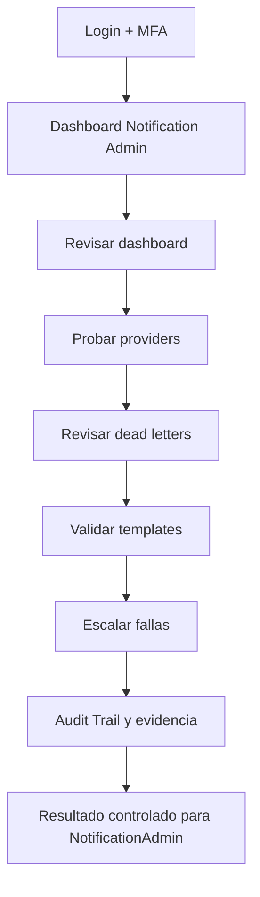
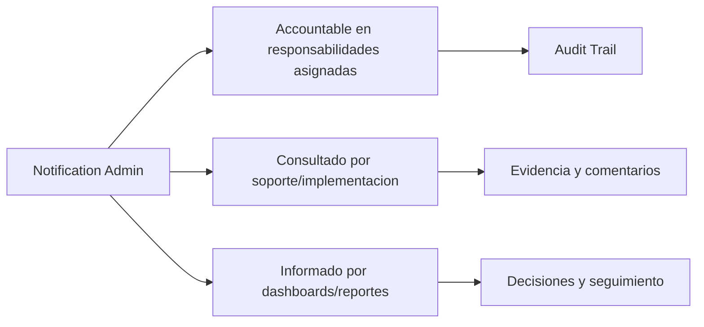

# Compliance 360 Academy

## Notification Admin Certification

## Portada

| Campo | Valor |
| --- | --- |
| Rol | Notification Admin |
| Nivel | Advanced / Technical Admin |
| Duración | 18 horas |
| Objetivo | Formar administradores de notificaciones, plantillas, providers, tracking, retries y dead letters. |
| Prerrequisitos | Conocer SMTP/API email, dominios, seguridad de secretos y operación de alertas. |
| Ruta de aprendizaje | Fundamentos -> Seguridad -> Módulos -> Operación -> Escenarios -> Evaluación -> Certificación |
| Certificación asociada | Compliance 360 Certified Administrator |
| Estado | Markdown maestro. No generar Word hasta aprobación. |

---

# CAPÍTULO 1 - Introducción al Rol

## ¿Quién es?

El `Notification Admin` es un perfil formal de Compliance 360 Academy. Su entrenamiento está diseñado para que pueda usar la plataforma sin revisar código fuente, entendiendo módulos, permisos, responsabilidades, riesgos y límites reales del producto.

## ¿Qué responsabilidades tiene?

| Responsabilidad | Dueño | Prioridad | Evidencia esperada |
| --- | --- | --- | --- |
| Configurar providers | Notification Admin | Alta | Evidencia en Audit Trail / reporte / registro |
| Probar envío | Notification Admin | Alta | Evidencia en Audit Trail / reporte / registro |
| Administrar templates | Notification Admin | Alta | Evidencia en Audit Trail / reporte / registro |
| Monitorear dead letters | Notification Admin | Alta | Evidencia en Audit Trail / reporte / registro |
| Gestionar failover | Notification Admin | Alta | Evidencia en Audit Trail / reporte / registro |

## ¿Qué puede hacer?

- Configurar providers
- Probar envío
- Administrar templates
- Monitorear dead letters
- Gestionar failover

## ¿Qué no puede hacer?

- Hardcodear credenciales
- Enviar masivos sin validación
- Ignorar dominios verificados
- Eliminar trazabilidad

## Flujo operativo del rol

## Matriz de responsabilidades

| Responsabilidad | Dueño | Prioridad | Evidencia esperada |
| --- | --- | --- | --- |
| Configurar providers | Notification Admin | Alta | Evidencia en Audit Trail / reporte / registro |
| Probar envío | Notification Admin | Alta | Evidencia en Audit Trail / reporte / registro |
| Administrar templates | Notification Admin | Alta | Evidencia en Audit Trail / reporte / registro |
| Monitorear dead letters | Notification Admin | Alta | Evidencia en Audit Trail / reporte / registro |
| Gestionar failover | Notification Admin | Alta | Evidencia en Audit Trail / reporte / registro |

## Matriz RACI

| Proceso | Notification Admin | Tenant Admin | Quality Manager | Support Engineer | Consultora Admin |
| --- | --- | --- | --- | --- | --- |
| Configurar Gmail SMTP | R/A | I | I | C | C |
| Configurar Microsoft 365 | R/A | I | I | C | C |
| Configurar SendGrid | R/A | I | I | C | C |
| Crear template | R/A | I | I | C | C |
| Enviar prueba | R/A | I | I | C | C |
| Reintentar dead letter | R/A | I | I | C | C |

---

# CAPÍTULO 2 - Módulos que utiliza

## Módulos asignados al rol

| Módulo | Para qué sirve | Cuándo lo usa |
| --- | --- | --- |
| Notifications | Sirve para notifications | Se usa cuando el rol necesita operar o consultar esta capacidad |
| Audit Trail | Sirve para audit trail | Se usa cuando el rol necesita operar o consultar esta capacidad |
| Observability | Sirve para observability | Se usa cuando el rol necesita operar o consultar esta capacidad |
| Security Hardening | Sirve para security hardening | Se usa cuando el rol necesita operar o consultar esta capacidad |
| Workflow Engine | Sirve para workflow engine | Se usa cuando el rol necesita operar o consultar esta capacidad |
| Reporting Engine | Sirve para reporting engine | Se usa cuando el rol necesita operar o consultar esta capacidad |

## Matriz de módulos

| Módulo | Tipo de uso | Frecuencia | Nota de estado |
| --- | --- | --- | --- |
| Notifications | Uso principal | Diario/Semanal | Ver estado real en Handbook |
| Audit Trail | Uso principal | Diario/Semanal | Ver estado real en Handbook |
| Observability | Uso principal | Diario/Semanal | Ver estado real en Handbook |
| Security Hardening | Uso principal | Diario/Semanal | Ver estado real en Handbook |
| Workflow Engine | Uso principal | Diario/Semanal | Ver estado real en Handbook |
| Reporting Engine | Uso complementario | Según evento | Ver estado real en Handbook |

## Diagrama de responsabilidades

---

# CAPÍTULO 3 - Configuración Inicial

## Objetivo

Preparar el acceso y el entorno de trabajo del rol `Notification Admin` para operar sin fricción.

## Paso a paso

1. Crear o validar usuario en el tenant correcto.
2. Asignar rol y permisos correspondientes.
3. Activar MFA si el tenant lo requiere.
4. Validar acceso a dashboard.
5. Validar acceso a módulos asignados.
6. Probar operación mínima permitida.
7. Confirmar que Audit Trail registra eventos clave.
8. Documentar restricciones del rol.

## Pantalla por pantalla

| Pantalla | Acción esperada | Resultado |
| --- | --- | --- |
| Login | Ingresar credenciales y completar MFA si aplica | Sesión activa |
| Dashboard | Revisar indicadores y alertas | Prioridades visibles |
| Módulos asignados | Validar acceso según matriz | Acceso autorizado |
| Reportes | Consultar datos según permiso | Reporte visible |
| Audit Trail | Confirmar trazabilidad si aplica | Evento registrado |

## Proceso por proceso

Cada proceso debe ejecutarse con tenant, permiso y evidencia correctos. Si aparece `401`, el usuario debe renovar sesión. Si aparece `403`, debe solicitar ajuste de rol, no intentar rodear el control.

---

# CAPÍTULO 4 - Operación Diaria

## ¿Qué hace al iniciar sesión?

| Tarea | Frecuencia | Resultado esperado |
| --- | --- | --- |
| Revisar dashboard | Diario | Validar resultado en dashboard/audit trail |
| Probar providers | Diario | Validar resultado en dashboard/audit trail |
| Revisar dead letters | Diario | Validar resultado en dashboard/audit trail |
| Validar templates | Diario | Validar resultado en dashboard/audit trail |
| Escalar fallas | Diario | Validar resultado en dashboard/audit trail |

## ¿Qué revisa?

- Estado general del dashboard.
- Tareas asignadas.
- Alertas relacionadas con sus módulos.
- Reportes o indicadores relevantes.
- Evidencia pendiente o procesos vencidos.

## ¿Qué tareas ejecuta?

- Revisar dashboard
- Probar providers
- Revisar dead letters
- Validar templates
- Escalar fallas

## ¿Qué indicadores debe monitorear?

| Indicador | Uso | Acción esperada |
| --- | --- | --- |
| Tasa de entrega | Monitorear tendencia | Escalar desviaciones |
| Dead letters | Monitorear tendencia | Escalar desviaciones |
| Retries | Monitorear tendencia | Escalar desviaciones |
| Provider health | Monitorear tendencia | Escalar desviaciones |
| Errores por template | Monitorear tendencia | Escalar desviaciones |

---

# CAPÍTULO 5 - Procesos Paso a Paso

Los procesos de este capítulo reemplazan la versión genérica anterior. Cada flujo incluye pantalla, decisión, resultado esperado y evidencia.

## 5.1 Configurar Gmail SMTP

**Objetivo:** Habilitar Gmail como provider SMTP controlado.

**Pantallas / áreas usadas:** Configuration → Integraciones → Email Providers

**Prerrequisitos específicos:**

- Cuenta autorizada
- App password/secret seguro
- Dominio permitido

**Paso a paso operativo:**

1. Abrir Integraciones.
2. Crear provider Gmail SMTP.
3. Host smtp.gmail.com puerto 587 TLS.
4. Registrar remitente compliance@empresa.com.
5. Guardar secreto fuera del código.
6. Definir prioridad secundaria si M365 es primario.
7. Ejecutar test de conexión.
8. Enviar correo de prueba a buzón controlado.
9. Validar tracking Sent.
10. Documentar health.

**Decisiones clave:**

- **Auth falla:** verificar app password y bloqueo Google.
- **Test OK:** habilitar provider.

**Resultado esperado:**

- Provider activo y probado

**Evidencias requeridas:**

- Test result
- Tracking
- Audit Trail

**Errores comunes a evitar:**

- Usar password personal
- No probar envío
- No configurar failover

**Validación de cierre:** el `Notification Admin` debe poder explicar qué cambió, quién aprobó, qué evidencia quedó, qué riesgo se redujo y dónde se consulta la trazabilidad.

## 5.2 Configurar Microsoft 365

**Objetivo:** Habilitar SMTP corporativo M365.

**Pantallas / áreas usadas:** Email Providers; Health

**Prerrequisitos específicos:**

- Tenant M365
- Credenciales autorizadas

**Paso a paso operativo:**

1. Crear provider Microsoft 365.
2. Host smtp.office365.com puerto 587.
3. Configurar usuario servicio.
4. Activar TLS.
5. Definir prioridad primaria.
6. Enviar test a interno y externo.
7. Validar política antispam.
8. Registrar owner.
9. Revisar health.
10. Documentar fallback.

**Decisiones clave:**

- **Bloqueo SMTP:** habilitar SMTP AUTH o usar provider alterno.
- **Delivery falla:** revisar remitente/dominio.

**Resultado esperado:**

- M365 listo y monitoreado

**Evidencias requeridas:**

- Test
- Health
- Correo recibido

**Errores comunes a evitar:**

- Usar usuario personal
- No validar externo
- No configurar fallback

**Validación de cierre:** el `Notification Admin` debe poder explicar qué cambió, quién aprobó, qué evidencia quedó, qué riesgo se redujo y dónde se consulta la trazabilidad.

## 5.3 Configurar SendGrid y cuotas

**Objetivo:** Configurar API provider y controlar quota.

**Pantallas / áreas usadas:** Email Providers; Notification Dashboard

**Prerrequisitos específicos:**

- API key
- Sender verificado

**Paso a paso operativo:**

1. Crear provider SendGrid.
2. Configurar API key en secret store.
3. Definir sender verificado.
4. Establecer prioridad de failover.
5. Enviar prueba transaccional.
6. Verificar tracking.
7. Revisar quota diaria.
8. Configurar alerta de quota.
9. Simular error controlado.
10. Validar failover.

**Decisiones clave:**

- **Quota > 80%:** activar alerta y failover.
- **Sender no verificado:** bloquear activación.

**Resultado esperado:**

- SendGrid operativo con control de quota

**Evidencias requeridas:**

- API test
- Tracking
- Alerta quota

**Errores comunes a evitar:**

- API key expuesta
- Sender no verificado
- Sin failover

**Validación de cierre:** el `Notification Admin` debe poder explicar qué cambió, quién aprobó, qué evidencia quedó, qué riesgo se redujo y dónde se consulta la trazabilidad.

## 5.4 Gestionar Dead Letter Queue

**Objetivo:** Investigar y reprocesar notificaciones fallidas.

**Pantallas / áreas usadas:** Notifications → Dead Letters; Tracking

**Prerrequisitos específicos:**

- Permiso Notification.Admin
- DLQ con mensajes

**Paso a paso operativo:**

1. Abrir Dead Letters.
2. Filtrar por provider y error.
3. Seleccionar mensaje fallido.
4. Revisar destinatario, template y payload.
5. Corregir causa: provider, template o recipient.
6. Reintentar mensaje individual.
7. Si falla, mover a investigación.
8. Registrar causa raíz.
9. Validar dashboard DLQ.
10. Escalar si hay patrón sistémico.

**Decisiones clave:**

- **Error recipient:** corregir destinatario y reintentar.
- **Error provider:** activar failover.

**Resultado esperado:**

- DLQ reducida y causas documentadas

**Evidencias requeridas:**

- Registro DLQ
- Retry
- RCA

**Errores comunes a evitar:**

- Reintentar masivo sin causa
- Eliminar DLQ
- No analizar patrón

**Validación de cierre:** el `Notification Admin` debe poder explicar qué cambió, quién aprobó, qué evidencia quedó, qué riesgo se redujo y dónde se consulta la trazabilidad.

---

# CAPÍTULO 6 - Escenarios Reales

Todos los escenarios fueron reemplazados por casos empresariales con datos, decisiones y consecuencias.

## 6.1 Escenario: Gmail bloqueado

**Contexto real:** Google bloquea SMTP por política de seguridad.

**Datos iniciales:**

- Provider Gmail
- Error auth
- Correos CAPA pendientes: 38

**Decisiones que debe tomar el `Notification Admin`:**

- **Failover:** Activar M365/SendGrid.
- **Seguridad:** No usar password personal.

**Acciones esperadas:**

1. Revisar health.
2. Confirmar error.
3. Activar failover.
4. Reintentar cola.
5. Documentar RCA.

**Resultado esperado:** Mensajes enviados por provider alterno.

**Consecuencias si se ejecuta mal:**

- Alertas no enviadas
- CAPA vencidas
- Credenciales expuestas

**Criterios de evaluación:** el caso se aprueba si el estudiante identifica el módulo correcto, aplica permisos adecuados, documenta evidencia, toma decisiones justificadas y deja trazabilidad auditable.

## 6.2 Escenario: SMTP caído

**Contexto real:** Servidor corporativo no responde.

**Datos iniciales:**

- Timeout 30s
- Provider primario
- DLQ creciendo

**Decisiones que debe tomar el `Notification Admin`:**

- **Disponibilidad:** Cambiar prioridad provider.
- **Reintentos:** Evitar tormenta de retries.

**Acciones esperadas:**

1. Validar health.
2. Pausar reintentos masivos.
3. Activar secundario.
4. Reprocesar lote controlado.

**Resultado esperado:** Servicio recuperado por failover.

**Consecuencias si se ejecuta mal:**

- Cola saturada
- Pérdida de alertas
- SLA incumplido

**Criterios de evaluación:** el caso se aprueba si el estudiante identifica el módulo correcto, aplica permisos adecuados, documenta evidencia, toma decisiones justificadas y deja trazabilidad auditable.

## 6.3 Escenario: SendGrid quota excedida

**Contexto real:** La quota diaria llega al 100%.

**Datos iniciales:**

- Quota 100%
- Reportes programados
- Provider secundario disponible

**Decisiones que debe tomar el `Notification Admin`:**

- **Quota:** Bloquear envíos no críticos.
- **Failover:** Mover transaccionales críticos.

**Acciones esperadas:**

1. Revisar dashboard.
2. Priorizar mensajes.
3. Activar failover.
4. Notificar owner.

**Resultado esperado:** Mensajes críticos continúan.

**Consecuencias si se ejecuta mal:**

- Mensajes rechazados
- Clientes sin reporte
- Costo inesperado

**Criterios de evaluación:** el caso se aprueba si el estudiante identifica el módulo correcto, aplica permisos adecuados, documenta evidencia, toma decisiones justificadas y deja trazabilidad auditable.

## 6.4 Escenario: Mailgun timeout

**Contexto real:** API Mailgun responde lento intermitente.

**Datos iniciales:**

- p95 12s
- HTTP timeout
- Provider prioridad 2

**Decisiones que debe tomar el `Notification Admin`:**

- **Timeout:** Reducir uso de provider.
- **Monitoreo:** Registrar alerta.

**Acciones esperadas:**

1. Analizar errores.
2. Cambiar prioridad.
3. Reintentar fallidos.
4. Registrar incidente.

**Resultado esperado:** Timeout mitigado sin pérdida de mensajes.

**Consecuencias si se ejecuta mal:**

- Retries excesivos
- DLQ crece
- Latencia usuario

**Criterios de evaluación:** el caso se aprueba si el estudiante identifica el módulo correcto, aplica permisos adecuados, documenta evidencia, toma decisiones justificadas y deja trazabilidad auditable.

## 6.5 Escenario: Failover automático

**Contexto real:** Provider primario falla y secundario debe tomar control.

**Datos iniciales:**

- SMTP down
- SendGrid healthy
- 150 mensajes queued

**Decisiones que debe tomar el `Notification Admin`:**

- **Conmutación:** Validar proveedor secundario antes de lote.
- **Auditoría:** Registrar failover.

**Acciones esperadas:**

1. Ejecutar test secundario.
2. Cambiar prioridad.
3. Reprocesar 10 mensajes.
4. Reprocesar resto.
5. Monitorear tracking.

**Resultado esperado:** Failover exitoso con tracking.

**Consecuencias si se ejecuta mal:**

- Duplicados
- Mensajes perdidos
- Sin evidencia de failover

**Criterios de evaluación:** el caso se aprueba si el estudiante identifica el módulo correcto, aplica permisos adecuados, documenta evidencia, toma decisiones justificadas y deja trazabilidad auditable.

## 6.6 Escenario: Dead Letter Queue creciendo

**Contexto real:** DLQ sube de 20 a 480 en 2 horas.

**Datos iniciales:**

- Error template variable
- Provider healthy
- Campaña reporte

**Decisiones que debe tomar el `Notification Admin`:**

- **Causa:** No es provider; es template.
- **Reproceso:** Corregir antes de retry.

**Acciones esperadas:**

1. Filtrar DLQ.
2. Identificar error variable.
3. Corregir template.
4. Reintentar muestra.
5. Reprocesar lote.

**Resultado esperado:** DLQ vuelve a nivel normal.

**Consecuencias si se ejecuta mal:**

- Reintentos inútiles
- Saturación
- Mensajes mal formados

**Criterios de evaluación:** el caso se aprueba si el estudiante identifica el módulo correcto, aplica permisos adecuados, documenta evidencia, toma decisiones justificadas y deja trazabilidad auditable.

## 6.7 Escenario: Template roto

**Contexto real:** Plantilla CAPA usa variable inexistente.

**Datos iniciales:**

- Variable {{ownerName}}
- DTO usa {{owner}}
- Falla render

**Decisiones que debe tomar el `Notification Admin`:**

- **Template:** Corregir variable.
- **Testing:** Preview obligatorio.

**Acciones esperadas:**

1. Abrir template.
2. Ejecutar preview.
3. Corregir variable.
4. Enviar test.
5. Publicar.

**Resultado esperado:** Template renderiza correctamente.

**Consecuencias si se ejecuta mal:**

- DLQ
- Correo sin datos
- Alertas inválidas

**Criterios de evaluación:** el caso se aprueba si el estudiante identifica el módulo correcto, aplica permisos adecuados, documenta evidencia, toma decisiones justificadas y deja trazabilidad auditable.

## 6.8 Escenario: Dominio no verificado

**Contexto real:** SendGrid rechaza remitente nuevo.

**Datos iniciales:**

- sender calidad@cliente.com
- Domain not verified

**Decisiones que debe tomar el `Notification Admin`:**

- **Remitente:** Usar verificado o verificar dominio.
- **Producción:** No activar sender inválido.

**Acciones esperadas:**

1. Revisar error.
2. Cambiar sender.
3. Probar envío.
4. Solicitar verificación.

**Resultado esperado:** Envío restablecido con dominio autorizado.

**Consecuencias si se ejecuta mal:**

- Rechazos
- Spam
- Pérdida reputación

**Criterios de evaluación:** el caso se aprueba si el estudiante identifica el módulo correcto, aplica permisos adecuados, documenta evidencia, toma decisiones justificadas y deja trazabilidad auditable.

## 6.9 Escenario: Reporte programado no enviado

**Contexto real:** Reporte mensual no llegó a gerencia.

**Datos iniciales:**

- Schedule 08:00
- No tracking
- Provider healthy

**Decisiones que debe tomar el `Notification Admin`:**

- **Origen:** Verificar scheduler/template antes de provider.
- **Comunicación:** Emitir reenvío controlado.

**Acciones esperadas:**

1. Revisar schedule.
2. Revisar message queue.
3. Generar manual.
4. Enviar y trackear.

**Resultado esperado:** Reporte entregado y causa documentada.

**Consecuencias si se ejecuta mal:**

- Gerencia sin datos
- Doble envío
- Causa no corregida

**Criterios de evaluación:** el caso se aprueba si el estudiante identifica el módulo correcto, aplica permisos adecuados, documenta evidencia, toma decisiones justificadas y deja trazabilidad auditable.

## 6.10 Escenario: Proveedor degradado recurrente

**Contexto real:** M365 falla cada lunes 09:00.

**Datos iniciales:**

- Patrón semanal
- Timeout
- Failover manual

**Decisiones que debe tomar el `Notification Admin`:**

- **Patrón:** Crear regla/alerta.
- **Arquitectura:** Evaluar prioridad provider.

**Acciones esperadas:**

1. Analizar historial.
2. Documentar patrón.
3. Ajustar prioridad.
4. Crear alerta.

**Resultado esperado:** Riesgo recurrente reducido.

**Consecuencias si se ejecuta mal:**

- Incidente repetido
- Operación manual
- SLA bajo

**Criterios de evaluación:** el caso se aprueba si el estudiante identifica el módulo correcto, aplica permisos adecuados, documenta evidencia, toma decisiones justificadas y deja trazabilidad auditable.

---

# CAPÍTULO 7 - Mejores Prácticas

## ISO 9001

- Mantener evidencia trazable de cambios, aprobaciones y cierres.
- Usar roles claros para evitar conflictos de interés.
- Medir desempeño con indicadores y revisar tendencias.
- Gestionar no conformidades mediante CAPA con causa raíz y efectividad.

## ISO 22000, HACCP y BPM

- Controlar documentos de inocuidad y BPM como documentos vigentes.
- Vincular proveedores críticos con certificaciones y evaluaciones.
- Registrar riesgos de inocuidad con controles y tratamiento.
- Mantener evidencias de acciones preventivas y correctivas.

## Buenas prácticas SaaS

- No compartir usuarios.
- Activar MFA para roles sensibles.
- Usar permisos mínimos necesarios.
- Validar providers de email/storage antes de producción.
- Escalar errores técnicos con evidencia, hora, tenant y correlation id.

---

# CAPÍTULO 8 - Errores Comunes

| Error | Consecuencia | Prevención |
| --- | --- | --- |
| Operar en tenant incorrecto | Riesgo de privacidad y datos cruzados | Confirmar tenant al iniciar |
| Usar rol con permisos excesivos | Falta de segregación | Revisar matriz RBAC |
| Cerrar sin evidencia | Debilidad ante auditoría | Adjuntar evidencia antes de cierre |
| Ignorar módulos en estado workspace | Promesa comercial incorrecta | Aplicar regla de honestidad |
| No revisar Audit Trail | Falta de trazabilidad | Validar eventos clave |
| No probar providers | Fallas de email/storage en producción | Ejecutar tests de conexión |
| Compartir credenciales | Riesgo de seguridad | Usuario individual por persona |
| Omitir MFA | Mayor exposición de acceso | Activar MFA en roles críticos |
| No documentar decisiones | Soporte y auditoría débiles | Registrar comentarios |
| No escalar a tiempo | SLA incumplido | Clasificar severidad |

---

# CAPÍTULO 9 - Checklist Operativo

## Checklist diario

- Confirmar acceso y tenant correcto.
- Revisar dashboard y tareas asignadas.
- Revisar alertas de módulos asignados.
- Ejecutar procesos prioritarios.
- Escalar bloqueos con evidencia.

## Checklist semanal

- Revisar reportes relevantes.
- Revisar tareas vencidas.
- Validar indicadores del rol.
- Confirmar que los procesos críticos tienen responsables.
- Revisar errores recurrentes.

## Checklist mensual

- Preparar comité o revisión ejecutiva.
- Auditar permisos del rol si aplica.
- Revisar tendencias y desviaciones.
- Confirmar cierre de procesos críticos.
- Documentar oportunidades de mejora.

## Checklist trimestral

- Revisar matriz de responsabilidades.
- Validar capacitación de usuarios.
- Revisar efectividad de controles.
- Actualizar procesos según cambios normativos.
- Preparar evidencia para auditorías.

---

# CAPÍTULO 10 - Evaluación Teórica

**Formato del examen:** 50 preguntas situacionales, 2 puntos por pregunta, 100 puntos totales.

**Regla de certificación:** las preguntas mezclan contexto, datos, problema, decisión y consecuencia. Las opciones incorrectas son plausibles y requieren criterio profesional.

## Pregunta 1

**Contexto:** Gmail rechaza autenticación durante envío de alertas CAPA. Enfoque: Acción inmediata.

**Datos del sistema/caso:**

- Provider: Gmail SMTP
- Error: auth blocked
- Pendientes: 38
- Failover: M365 disponible

**Problema:** El rol `Notification Admin` debe resolver `Gmail SMTP bloqueado` sin romper segregación, evidencia ni trazabilidad.

**Decisión requerida:** ¿Cuál es la primera acción correcta?

**Consecuencia de una mala decisión:** Si se elige mal, el proceso puede avanzar sin control.

A. Reintentar todos los mensajes indefinidamente.
B. Activar failover a M365/SendGrid y documentar bloqueo.
C. Cambiar remitente a cuenta personal.
D. Eliminar DLQ.

**Respuesta correcta:** B

**Explicación:** La opción B es correcta porque aborda `Gmail SMTP bloqueado` con control verificable, decisión justificada y evidencia auditable. Las demás opciones son plausibles, pero dejan una brecha de cumplimiento, operación o certificación.

## Pregunta 2

**Contexto:** Gmail rechaza autenticación durante envío de alertas CAPA. Enfoque: Decisión de aprobación.

**Datos del sistema/caso:**

- Provider: Gmail SMTP
- Error: auth blocked
- Pendientes: 38
- Failover: M365 disponible

**Problema:** El rol `Notification Admin` debe resolver `Gmail SMTP bloqueado` sin romper segregación, evidencia ni trazabilidad.

**Decisión requerida:** ¿Qué decisión protege mejor la trazabilidad y el cumplimiento?

**Consecuencia de una mala decisión:** Una aprobación débil genera evidencia no defendible.

A. Cambiar remitente a cuenta personal.
B. Desactivar MFA de cuenta Google.
C. Marcar mensajes como enviados.
D. No usar credenciales personales; validar app password/política.

**Respuesta correcta:** D

**Explicación:** La opción D es correcta porque aborda `Gmail SMTP bloqueado` con control verificable, decisión justificada y evidencia auditable. Las demás opciones son plausibles, pero dejan una brecha de cumplimiento, operación o certificación.

## Pregunta 3

**Contexto:** Gmail rechaza autenticación durante envío de alertas CAPA. Enfoque: Evidencia.

**Datos del sistema/caso:**

- Provider: Gmail SMTP
- Error: auth blocked
- Pendientes: 38
- Failover: M365 disponible

**Problema:** El rol `Notification Admin` debe resolver `Gmail SMTP bloqueado` sin romper segregación, evidencia ni trazabilidad.

**Decisión requerida:** ¿Qué evidencia mínima debe exigirse antes de cerrar o avanzar?

**Consecuencia de una mala decisión:** Sin evidencia objetiva no hay certificación defendible.

A. Reintentar cola por lotes después de provider sano.
B. Desactivar MFA de cuenta Google.
C. Esperar resolución manual sin failover.
D. Exponer contraseña en configuración.

**Respuesta correcta:** A

**Explicación:** La opción A es correcta porque aborda `Gmail SMTP bloqueado` con control verificable, decisión justificada y evidencia auditable. Las demás opciones son plausibles, pero dejan una brecha de cumplimiento, operación o certificación.

## Pregunta 4

**Contexto:** Gmail rechaza autenticación durante envío de alertas CAPA. Enfoque: Escalación.

**Datos del sistema/caso:**

- Provider: Gmail SMTP
- Error: auth blocked
- Pendientes: 38
- Failover: M365 disponible

**Problema:** El rol `Notification Admin` debe resolver `Gmail SMTP bloqueado` sin romper segregación, evidencia ni trazabilidad.

**Decisión requerida:** ¿Cuándo debe escalarse el caso y a quién?

**Consecuencia de una mala decisión:** Escalar tarde puede producir incumplimiento, pérdida de SLA o riesgo contractual.

A. Esperar resolución manual sin failover.
B. Reintentar todos los mensajes indefinidamente.
C. Registrar RCA y actualizar health.
D. Eliminar DLQ.

**Respuesta correcta:** C

**Explicación:** La opción C es correcta porque aborda `Gmail SMTP bloqueado` con control verificable, decisión justificada y evidencia auditable. Las demás opciones son plausibles, pero dejan una brecha de cumplimiento, operación o certificación.

## Pregunta 5

**Contexto:** Gmail rechaza autenticación durante envío de alertas CAPA. Enfoque: Prevención.

**Datos del sistema/caso:**

- Provider: Gmail SMTP
- Error: auth blocked
- Pendientes: 38
- Failover: M365 disponible

**Problema:** El rol `Notification Admin` debe resolver `Gmail SMTP bloqueado` sin romper segregación, evidencia ni trazabilidad.

**Decisión requerida:** ¿Qué control evita la recurrencia del problema?

**Consecuencia de una mala decisión:** Resolver solo el síntoma deja el sistema expuesto a repetición.

A. Reintentar todos los mensajes indefinidamente.
B. Mantener alertas críticas priorizadas.
C. Cambiar remitente a cuenta personal.
D. Marcar mensajes como enviados.

**Respuesta correcta:** B

**Explicación:** La opción B es correcta porque aborda `Gmail SMTP bloqueado` con control verificable, decisión justificada y evidencia auditable. Las demás opciones son plausibles, pero dejan una brecha de cumplimiento, operación o certificación.

## Pregunta 6

**Contexto:** M365 rechaza SMTP AUTH para usuario servicio. Enfoque: Acción inmediata.

**Datos del sistema/caso:**

- Host: smtp.office365.com
- Error: 535/SMTP AUTH disabled
- Provider priority: 1

**Problema:** El rol `Notification Admin` debe resolver `Microsoft 365 SMTP AUTH` sin romper segregación, evidencia ni trazabilidad.

**Decisión requerida:** ¿Cuál es la primera acción correcta?

**Consecuencia de una mala decisión:** Si se elige mal, el proceso puede avanzar sin control.

A. Cambiar puerto aleatoriamente.
B. Usar usuario personal con permisos admin.
C. Guardar password en texto plano.
D. Verificar política SMTP AUTH y usar provider alterno mientras se corrige.

**Respuesta correcta:** D

**Explicación:** La opción D es correcta porque aborda `Microsoft 365 SMTP AUTH` con control verificable, decisión justificada y evidencia auditable. Las demás opciones son plausibles, pero dejan una brecha de cumplimiento, operación o certificación.

## Pregunta 7

**Contexto:** M365 rechaza SMTP AUTH para usuario servicio. Enfoque: Decisión de aprobación.

**Datos del sistema/caso:**

- Host: smtp.office365.com
- Error: 535/SMTP AUTH disabled
- Provider priority: 1

**Problema:** El rol `Notification Admin` debe resolver `Microsoft 365 SMTP AUTH` sin romper segregación, evidencia ni trazabilidad.

**Decisión requerida:** ¿Qué decisión protege mejor la trazabilidad y el cumplimiento?

**Consecuencia de una mala decisión:** Una aprobación débil genera evidencia no defendible.

A. Bloquear activación hasta test interno/externo correcto.
B. Usar usuario personal con permisos admin.
C. Desactivar TLS para probar.
D. Marcar provider healthy sin test.

**Respuesta correcta:** A

**Explicación:** La opción A es correcta porque aborda `Microsoft 365 SMTP AUTH` con control verificable, decisión justificada y evidencia auditable. Las demás opciones son plausibles, pero dejan una brecha de cumplimiento, operación o certificación.

## Pregunta 8

**Contexto:** M365 rechaza SMTP AUTH para usuario servicio. Enfoque: Evidencia.

**Datos del sistema/caso:**

- Host: smtp.office365.com
- Error: 535/SMTP AUTH disabled
- Provider priority: 1

**Problema:** El rol `Notification Admin` debe resolver `Microsoft 365 SMTP AUTH` sin romper segregación, evidencia ni trazabilidad.

**Decisión requerida:** ¿Qué evidencia mínima debe exigirse antes de cerrar o avanzar?

**Consecuencia de una mala decisión:** Sin evidencia objetiva no hay certificación defendible.

A. Desactivar TLS para probar.
B. Ignorar envío externo.
C. Documentar cambio de prioridad y health.
D. Eliminar tracking fallido.

**Respuesta correcta:** C

**Explicación:** La opción C es correcta porque aborda `Microsoft 365 SMTP AUTH` con control verificable, decisión justificada y evidencia auditable. Las demás opciones son plausibles, pero dejan una brecha de cumplimiento, operación o certificación.

## Pregunta 9

**Contexto:** M365 rechaza SMTP AUTH para usuario servicio. Enfoque: Escalación.

**Datos del sistema/caso:**

- Host: smtp.office365.com
- Error: 535/SMTP AUTH disabled
- Provider priority: 1

**Problema:** El rol `Notification Admin` debe resolver `Microsoft 365 SMTP AUTH` sin romper segregación, evidencia ni trazabilidad.

**Decisión requerida:** ¿Cuándo debe escalarse el caso y a quién?

**Consecuencia de una mala decisión:** Escalar tarde puede producir incumplimiento, pérdida de SLA o riesgo contractual.

A. Ignorar envío externo.
B. Usar cuenta de servicio autorizada.
C. Cambiar puerto aleatoriamente.
D. Guardar password en texto plano.

**Respuesta correcta:** B

**Explicación:** La opción B es correcta porque aborda `Microsoft 365 SMTP AUTH` con control verificable, decisión justificada y evidencia auditable. Las demás opciones son plausibles, pero dejan una brecha de cumplimiento, operación o certificación.

## Pregunta 10

**Contexto:** M365 rechaza SMTP AUTH para usuario servicio. Enfoque: Prevención.

**Datos del sistema/caso:**

- Host: smtp.office365.com
- Error: 535/SMTP AUTH disabled
- Provider priority: 1

**Problema:** El rol `Notification Admin` debe resolver `Microsoft 365 SMTP AUTH` sin romper segregación, evidencia ni trazabilidad.

**Decisión requerida:** ¿Qué control evita la recurrencia del problema?

**Consecuencia de una mala decisión:** Resolver solo el síntoma deja el sistema expuesto a repetición.

A. Cambiar puerto aleatoriamente.
B. Notificar impacto a soporte.
C. Usar usuario personal con permisos admin.
D. Marcar provider healthy sin test.

**Respuesta correcta:** B

**Explicación:** La opción B es correcta porque aborda `Microsoft 365 SMTP AUTH` con control verificable, decisión justificada y evidencia auditable. Las demás opciones son plausibles, pero dejan una brecha de cumplimiento, operación o certificación.

## Pregunta 11

**Contexto:** SendGrid llega al 100% de cuota diaria con reportes programados. Enfoque: Acción inmediata.

**Datos del sistema/caso:**

- Quota: 100%
- Reportes pendientes: 120
- Provider secundario: Resend

**Problema:** El rol `Notification Admin` debe resolver `SendGrid quota` sin romper segregación, evidencia ni trazabilidad.

**Decisión requerida:** ¿Cuál es la primera acción correcta?

**Consecuencia de una mala decisión:** Si se elige mal, el proceso puede avanzar sin control.

A. Priorizar mensajes transaccionales y activar provider secundario.
B. Aumentar retries para entregar más rápido.
C. Enviar todo por SendGrid hasta que rechace.
D. Ignorar quota.

**Respuesta correcta:** A

**Explicación:** La opción A es correcta porque aborda `SendGrid quota` con control verificable, decisión justificada y evidencia auditable. Las demás opciones son plausibles, pero dejan una brecha de cumplimiento, operación o certificación.

## Pregunta 12

**Contexto:** SendGrid llega al 100% de cuota diaria con reportes programados. Enfoque: Decisión de aprobación.

**Datos del sistema/caso:**

- Quota: 100%
- Reportes pendientes: 120
- Provider secundario: Resend

**Problema:** El rol `Notification Admin` debe resolver `SendGrid quota` sin romper segregación, evidencia ni trazabilidad.

**Decisión requerida:** ¿Qué decisión protege mejor la trazabilidad y el cumplimiento?

**Consecuencia de una mala decisión:** Una aprobación débil genera evidencia no defendible.

A. Enviar todo por SendGrid hasta que rechace.
B. Borrar reportes programados.
C. Configurar alerta de cuota antes de reintentos masivos.
D. Marcar pendientes como delivered.

**Respuesta correcta:** C

**Explicación:** La opción C es correcta porque aborda `SendGrid quota` con control verificable, decisión justificada y evidencia auditable. Las demás opciones son plausibles, pero dejan una brecha de cumplimiento, operación o certificación.

## Pregunta 13

**Contexto:** SendGrid llega al 100% de cuota diaria con reportes programados. Enfoque: Evidencia.

**Datos del sistema/caso:**

- Quota: 100%
- Reportes pendientes: 120
- Provider secundario: Resend

**Problema:** El rol `Notification Admin` debe resolver `SendGrid quota` sin romper segregación, evidencia ni trazabilidad.

**Decisión requerida:** ¿Qué evidencia mínima debe exigirse antes de cerrar o avanzar?

**Consecuencia de una mala decisión:** Sin evidencia objetiva no hay certificación defendible.

A. Borrar reportes programados.
B. Separar reportes no críticos de alertas CAPA.
C. Cambiar remitente sin verificar.
D. Desactivar plantillas.

**Respuesta correcta:** B

**Explicación:** La opción B es correcta porque aborda `SendGrid quota` con control verificable, decisión justificada y evidencia auditable. Las demás opciones son plausibles, pero dejan una brecha de cumplimiento, operación o certificación.

## Pregunta 14

**Contexto:** SendGrid llega al 100% de cuota diaria con reportes programados. Enfoque: Escalación.

**Datos del sistema/caso:**

- Quota: 100%
- Reportes pendientes: 120
- Provider secundario: Resend

**Problema:** El rol `Notification Admin` debe resolver `SendGrid quota` sin romper segregación, evidencia ni trazabilidad.

**Decisión requerida:** ¿Cuándo debe escalarse el caso y a quién?

**Consecuencia de una mala decisión:** Escalar tarde puede producir incumplimiento, pérdida de SLA o riesgo contractual.

A. Cambiar remitente sin verificar.
B. Registrar impacto y acciones preventivas.
C. Aumentar retries para entregar más rápido.
D. Ignorar quota.

**Respuesta correcta:** B

**Explicación:** La opción B es correcta porque aborda `SendGrid quota` con control verificable, decisión justificada y evidencia auditable. Las demás opciones son plausibles, pero dejan una brecha de cumplimiento, operación o certificación.

## Pregunta 15

**Contexto:** SendGrid llega al 100% de cuota diaria con reportes programados. Enfoque: Prevención.

**Datos del sistema/caso:**

- Quota: 100%
- Reportes pendientes: 120
- Provider secundario: Resend

**Problema:** El rol `Notification Admin` debe resolver `SendGrid quota` sin romper segregación, evidencia ni trazabilidad.

**Decisión requerida:** ¿Qué control evita la recurrencia del problema?

**Consecuencia de una mala decisión:** Resolver solo el síntoma deja el sistema expuesto a repetición.

A. Aumentar retries para entregar más rápido.
B. Enviar todo por SendGrid hasta que rechace.
C. Marcar pendientes como delivered.
D. Validar tracking post-failover.

**Respuesta correcta:** D

**Explicación:** La opción D es correcta porque aborda `SendGrid quota` con control verificable, decisión justificada y evidencia auditable. Las demás opciones son plausibles, pero dejan una brecha de cumplimiento, operación o certificación.

## Pregunta 16

**Contexto:** Mailgun API responde con timeout intermitente. Enfoque: Acción inmediata.

**Datos del sistema/caso:**

- p95 API: 12s
- Timeout: 30%
- DLQ: creciendo

**Problema:** El rol `Notification Admin` debe resolver `Mailgun timeout` sin romper segregación, evidencia ni trazabilidad.

**Decisión requerida:** ¿Cuál es la primera acción correcta?

**Consecuencia de una mala decisión:** Si se elige mal, el proceso puede avanzar sin control.

A. Reintentar toda la cola cada minuto.
B. Aumentar timeout a 5 minutos.
C. Cambiar prioridad de provider y reprocesar muestra controlada.
D. Perder mensajes.

**Respuesta correcta:** C

**Explicación:** La opción C es correcta porque aborda `Mailgun timeout` con control verificable, decisión justificada y evidencia auditable. Las demás opciones son plausibles, pero dejan una brecha de cumplimiento, operación o certificación.

## Pregunta 17

**Contexto:** Mailgun API responde con timeout intermitente. Enfoque: Decisión de aprobación.

**Datos del sistema/caso:**

- p95 API: 12s
- Timeout: 30%
- DLQ: creciendo

**Problema:** El rol `Notification Admin` debe resolver `Mailgun timeout` sin romper segregación, evidencia ni trazabilidad.

**Decisión requerida:** ¿Qué decisión protege mejor la trazabilidad y el cumplimiento?

**Consecuencia de una mala decisión:** Una aprobación débil genera evidencia no defendible.

A. Aumentar timeout a 5 minutos.
B. Distinguir fallo provider de fallo template.
C. Cambiar endpoint sin validar.
D. Duplicar envíos.

**Respuesta correcta:** B

**Explicación:** La opción B es correcta porque aborda `Mailgun timeout` con control verificable, decisión justificada y evidencia auditable. Las demás opciones son plausibles, pero dejan una brecha de cumplimiento, operación o certificación.

## Pregunta 18

**Contexto:** Mailgun API responde con timeout intermitente. Enfoque: Evidencia.

**Datos del sistema/caso:**

- p95 API: 12s
- Timeout: 30%
- DLQ: creciendo

**Problema:** El rol `Notification Admin` debe resolver `Mailgun timeout` sin romper segregación, evidencia ni trazabilidad.

**Decisión requerida:** ¿Qué evidencia mínima debe exigirse antes de cerrar o avanzar?

**Consecuencia de una mala decisión:** Sin evidencia objetiva no hay certificación defendible.

A. Cambiar endpoint sin validar.
B. Registrar métrica de timeout y RCA.
C. Desactivar DLQ.
D. Ocultar degradación.

**Respuesta correcta:** B

**Explicación:** La opción B es correcta porque aborda `Mailgun timeout` con control verificable, decisión justificada y evidencia auditable. Las demás opciones son plausibles, pero dejan una brecha de cumplimiento, operación o certificación.

## Pregunta 19

**Contexto:** Mailgun API responde con timeout intermitente. Enfoque: Escalación.

**Datos del sistema/caso:**

- p95 API: 12s
- Timeout: 30%
- DLQ: creciendo

**Problema:** El rol `Notification Admin` debe resolver `Mailgun timeout` sin romper segregación, evidencia ni trazabilidad.

**Decisión requerida:** ¿Cuándo debe escalarse el caso y a quién?

**Consecuencia de una mala decisión:** Escalar tarde puede producir incumplimiento, pérdida de SLA o riesgo contractual.

A. Desactivar DLQ.
B. Reintentar toda la cola cada minuto.
C. Perder mensajes.
D. Evitar retries masivos simultáneos.

**Respuesta correcta:** D

**Explicación:** La opción D es correcta porque aborda `Mailgun timeout` con control verificable, decisión justificada y evidencia auditable. Las demás opciones son plausibles, pero dejan una brecha de cumplimiento, operación o certificación.

## Pregunta 20

**Contexto:** Mailgun API responde con timeout intermitente. Enfoque: Prevención.

**Datos del sistema/caso:**

- p95 API: 12s
- Timeout: 30%
- DLQ: creciendo

**Problema:** El rol `Notification Admin` debe resolver `Mailgun timeout` sin romper segregación, evidencia ni trazabilidad.

**Decisión requerida:** ¿Qué control evita la recurrencia del problema?

**Consecuencia de una mala decisión:** Resolver solo el síntoma deja el sistema expuesto a repetición.

A. Notificar degradación.
B. Reintentar toda la cola cada minuto.
C. Aumentar timeout a 5 minutos.
D. Duplicar envíos.

**Respuesta correcta:** A

**Explicación:** La opción A es correcta porque aborda `Mailgun timeout` con control verificable, decisión justificada y evidencia auditable. Las demás opciones son plausibles, pero dejan una brecha de cumplimiento, operación o certificación.

## Pregunta 21

**Contexto:** Provider primario falla y Resend está configurado como secundario. Enfoque: Acción inmediata.

**Datos del sistema/caso:**

- SMTP down
- Resend healthy
- Mensajes queued: 150

**Problema:** El rol `Notification Admin` debe resolver `Resend failover` sin romper segregación, evidencia ni trazabilidad.

**Decisión requerida:** ¿Cuál es la primera acción correcta?

**Consecuencia de una mala decisión:** Si se elige mal, el proceso puede avanzar sin control.

A. Cambiar todo sin prueba.
B. Probar Resend con muestra y luego reprocesar cola priorizada.
C. Enviar mismos mensajes por ambos providers.
D. Duplicar alertas críticas.

**Respuesta correcta:** B

**Explicación:** La opción B es correcta porque aborda `Resend failover` con control verificable, decisión justificada y evidencia auditable. Las demás opciones son plausibles, pero dejan una brecha de cumplimiento, operación o certificación.

## Pregunta 22

**Contexto:** Provider primario falla y Resend está configurado como secundario. Enfoque: Decisión de aprobación.

**Datos del sistema/caso:**

- SMTP down
- Resend healthy
- Mensajes queued: 150

**Problema:** El rol `Notification Admin` debe resolver `Resend failover` sin romper segregación, evidencia ni trazabilidad.

**Decisión requerida:** ¿Qué decisión protege mejor la trazabilidad y el cumplimiento?

**Consecuencia de una mala decisión:** Una aprobación débil genera evidencia no defendible.

A. Enviar mismos mensajes por ambos providers.
B. Registrar evento de failover en audit/observability.
C. Eliminar mensajes queued.
D. Perder trazabilidad de provider.

**Respuesta correcta:** B

**Explicación:** La opción B es correcta porque aborda `Resend failover` con control verificable, decisión justificada y evidencia auditable. Las demás opciones son plausibles, pero dejan una brecha de cumplimiento, operación o certificación.

## Pregunta 23

**Contexto:** Provider primario falla y Resend está configurado como secundario. Enfoque: Evidencia.

**Datos del sistema/caso:**

- SMTP down
- Resend healthy
- Mensajes queued: 150

**Problema:** El rol `Notification Admin` debe resolver `Resend failover` sin romper segregación, evidencia ni trazabilidad.

**Decisión requerida:** ¿Qué evidencia mínima debe exigirse antes de cerrar o avanzar?

**Consecuencia de una mala decisión:** Sin evidencia objetiva no hay certificación defendible.

A. Eliminar mensajes queued.
B. Mantener provider caído como primario.
C. No revertir failover.
D. Validar tracking de enviados por provider secundario.

**Respuesta correcta:** D

**Explicación:** La opción D es correcta porque aborda `Resend failover` con control verificable, decisión justificada y evidencia auditable. Las demás opciones son plausibles, pero dejan una brecha de cumplimiento, operación o certificación.

## Pregunta 24

**Contexto:** Provider primario falla y Resend está configurado como secundario. Enfoque: Escalación.

**Datos del sistema/caso:**

- SMTP down
- Resend healthy
- Mensajes queued: 150

**Problema:** El rol `Notification Admin` debe resolver `Resend failover` sin romper segregación, evidencia ni trazabilidad.

**Decisión requerida:** ¿Cuándo debe escalarse el caso y a quién?

**Consecuencia de una mala decisión:** Escalar tarde puede producir incumplimiento, pérdida de SLA o riesgo contractual.

A. Evitar duplicados con idempotencia.
B. Mantener provider caído como primario.
C. Cambiar todo sin prueba.
D. Duplicar alertas críticas.

**Respuesta correcta:** A

**Explicación:** La opción A es correcta porque aborda `Resend failover` con control verificable, decisión justificada y evidencia auditable. Las demás opciones son plausibles, pero dejan una brecha de cumplimiento, operación o certificación.

## Pregunta 25

**Contexto:** Provider primario falla y Resend está configurado como secundario. Enfoque: Prevención.

**Datos del sistema/caso:**

- SMTP down
- Resend healthy
- Mensajes queued: 150

**Problema:** El rol `Notification Admin` debe resolver `Resend failover` sin romper segregación, evidencia ni trazabilidad.

**Decisión requerida:** ¿Qué control evita la recurrencia del problema?

**Consecuencia de una mala decisión:** Resolver solo el síntoma deja el sistema expuesto a repetición.

A. Cambiar todo sin prueba.
B. Enviar mismos mensajes por ambos providers.
C. Restaurar prioridad cuando primario sane.
D. Perder trazabilidad de provider.

**Respuesta correcta:** C

**Explicación:** La opción C es correcta porque aborda `Resend failover` con control verificable, decisión justificada y evidencia auditable. Las demás opciones son plausibles, pero dejan una brecha de cumplimiento, operación o certificación.

## Pregunta 26

**Contexto:** Dead Letter Queue sube de 20 a 480 por error de variable en template. Enfoque: Acción inmediata.

**Datos del sistema/caso:**

- DLQ: 480
- Provider health: OK
- Error: missing variable ownerName

**Problema:** El rol `Notification Admin` debe resolver `DLQ creciendo` sin romper segregación, evidencia ni trazabilidad.

**Decisión requerida:** ¿Cuál es la primera acción correcta?

**Consecuencia de una mala decisión:** Si se elige mal, el proceso puede avanzar sin control.

A. Cambiar provider para todos los mensajes.
B. Corregir template y probar preview antes de retry.
C. Reintentar DLQ completa sin corregir.
D. Perder notificaciones.

**Respuesta correcta:** B

**Explicación:** La opción B es correcta porque aborda `DLQ creciendo` con control verificable, decisión justificada y evidencia auditable. Las demás opciones son plausibles, pero dejan una brecha de cumplimiento, operación o certificación.

## Pregunta 27

**Contexto:** Dead Letter Queue sube de 20 a 480 por error de variable en template. Enfoque: Decisión de aprobación.

**Datos del sistema/caso:**

- DLQ: 480
- Provider health: OK
- Error: missing variable ownerName

**Problema:** El rol `Notification Admin` debe resolver `DLQ creciendo` sin romper segregación, evidencia ni trazabilidad.

**Decisión requerida:** ¿Qué decisión protege mejor la trazabilidad y el cumplimiento?

**Consecuencia de una mala decisión:** Una aprobación débil genera evidencia no defendible.

A. Reintentar DLQ completa sin corregir.
B. Eliminar mensajes con template roto.
C. Saturar provider.
D. Reintentar muestra controlada después del fix.

**Respuesta correcta:** D

**Explicación:** La opción D es correcta porque aborda `DLQ creciendo` con control verificable, decisión justificada y evidencia auditable. Las demás opciones son plausibles, pero dejan una brecha de cumplimiento, operación o certificación.

## Pregunta 28

**Contexto:** Dead Letter Queue sube de 20 a 480 por error de variable en template. Enfoque: Evidencia.

**Datos del sistema/caso:**

- DLQ: 480
- Provider health: OK
- Error: missing variable ownerName

**Problema:** El rol `Notification Admin` debe resolver `DLQ creciendo` sin romper segregación, evidencia ni trazabilidad.

**Decisión requerida:** ¿Qué evidencia mínima debe exigirse antes de cerrar o avanzar?

**Consecuencia de una mala decisión:** Sin evidencia objetiva no hay certificación defendible.

A. Clasificar causa como template, no provider.
B. Eliminar mensajes con template roto.
C. Editar payload manualmente sin control.
D. Mantener template roto.

**Respuesta correcta:** A

**Explicación:** La opción A es correcta porque aborda `DLQ creciendo` con control verificable, decisión justificada y evidencia auditable. Las demás opciones son plausibles, pero dejan una brecha de cumplimiento, operación o certificación.

## Pregunta 29

**Contexto:** Dead Letter Queue sube de 20 a 480 por error de variable en template. Enfoque: Escalación.

**Datos del sistema/caso:**

- DLQ: 480
- Provider health: OK
- Error: missing variable ownerName

**Problema:** El rol `Notification Admin` debe resolver `DLQ creciendo` sin romper segregación, evidencia ni trazabilidad.

**Decisión requerida:** ¿Cuándo debe escalarse el caso y a quién?

**Consecuencia de una mala decisión:** Escalar tarde puede producir incumplimiento, pérdida de SLA o riesgo contractual.

A. Editar payload manualmente sin control.
B. Cambiar provider para todos los mensajes.
C. Documentar RCA y prevención.
D. Perder notificaciones.

**Respuesta correcta:** C

**Explicación:** La opción C es correcta porque aborda `DLQ creciendo` con control verificable, decisión justificada y evidencia auditable. Las demás opciones son plausibles, pero dejan una brecha de cumplimiento, operación o certificación.

## Pregunta 30

**Contexto:** Dead Letter Queue sube de 20 a 480 por error de variable en template. Enfoque: Prevención.

**Datos del sistema/caso:**

- DLQ: 480
- Provider health: OK
- Error: missing variable ownerName

**Problema:** El rol `Notification Admin` debe resolver `DLQ creciendo` sin romper segregación, evidencia ni trazabilidad.

**Decisión requerida:** ¿Qué control evita la recurrencia del problema?

**Consecuencia de una mala decisión:** Resolver solo el síntoma deja el sistema expuesto a repetición.

A. Cambiar provider para todos los mensajes.
B. Monitorear DLQ hasta normalizar.
C. Reintentar DLQ completa sin corregir.
D. Saturar provider.

**Respuesta correcta:** B

**Explicación:** La opción B es correcta porque aborda `DLQ creciendo` con control verificable, decisión justificada y evidencia auditable. Las demás opciones son plausibles, pero dejan una brecha de cumplimiento, operación o certificación.

## Pregunta 31

**Contexto:** Retries agresivos saturan provider degradado. Enfoque: Acción inmediata.

**Datos del sistema/caso:**

- Retry cada 30s
- Provider 5xx
- Queue: 900

**Problema:** El rol `Notification Admin` debe resolver `Retry policy` sin romper segregación, evidencia ni trazabilidad.

**Decisión requerida:** ¿Cuál es la primera acción correcta?

**Consecuencia de una mala decisión:** Si se elige mal, el proceso puede avanzar sin control.

A. Reducir retry a 5s.
B. Eliminar límite de retries.
C. Tormenta de retries.
D. Aplicar backoff, pausar no críticos y priorizar transaccionales.

**Respuesta correcta:** D

**Explicación:** La opción D es correcta porque aborda `Retry policy` con control verificable, decisión justificada y evidencia auditable. Las demás opciones son plausibles, pero dejan una brecha de cumplimiento, operación o certificación.

## Pregunta 32

**Contexto:** Retries agresivos saturan provider degradado. Enfoque: Decisión de aprobación.

**Datos del sistema/caso:**

- Retry cada 30s
- Provider 5xx
- Queue: 900

**Problema:** El rol `Notification Admin` debe resolver `Retry policy` sin romper segregación, evidencia ni trazabilidad.

**Decisión requerida:** ¿Qué decisión protege mejor la trazabilidad y el cumplimiento?

**Consecuencia de una mala decisión:** Una aprobación débil genera evidencia no defendible.

A. Activar failover si el provider está degradado.
B. Eliminar límite de retries.
C. Mover todo a DLQ inmediatamente.
D. Bloqueo proveedor.

**Respuesta correcta:** A

**Explicación:** La opción A es correcta porque aborda `Retry policy` con control verificable, decisión justificada y evidencia auditable. Las demás opciones son plausibles, pero dejan una brecha de cumplimiento, operación o certificación.

## Pregunta 33

**Contexto:** Retries agresivos saturan provider degradado. Enfoque: Evidencia.

**Datos del sistema/caso:**

- Retry cada 30s
- Provider 5xx
- Queue: 900

**Problema:** El rol `Notification Admin` debe resolver `Retry policy` sin romper segregación, evidencia ni trazabilidad.

**Decisión requerida:** ¿Qué evidencia mínima debe exigirse antes de cerrar o avanzar?

**Consecuencia de una mala decisión:** Sin evidencia objetiva no hay certificación defendible.

A. Mover todo a DLQ inmediatamente.
B. Desactivar tracking.
C. Separar errores temporales de permanentes.
D. Pérdida SLA.

**Respuesta correcta:** C

**Explicación:** La opción C es correcta porque aborda `Retry policy` con control verificable, decisión justificada y evidencia auditable. Las demás opciones son plausibles, pero dejan una brecha de cumplimiento, operación o certificación.

## Pregunta 34

**Contexto:** Retries agresivos saturan provider degradado. Enfoque: Escalación.

**Datos del sistema/caso:**

- Retry cada 30s
- Provider 5xx
- Queue: 900

**Problema:** El rol `Notification Admin` debe resolver `Retry policy` sin romper segregación, evidencia ni trazabilidad.

**Decisión requerida:** ¿Cuándo debe escalarse el caso y a quién?

**Consecuencia de una mala decisión:** Escalar tarde puede producir incumplimiento, pérdida de SLA o riesgo contractual.

A. Desactivar tracking.
B. Registrar cambios de política.
C. Reducir retry a 5s.
D. Tormenta de retries.

**Respuesta correcta:** B

**Explicación:** La opción B es correcta porque aborda `Retry policy` con control verificable, decisión justificada y evidencia auditable. Las demás opciones son plausibles, pero dejan una brecha de cumplimiento, operación o certificación.

## Pregunta 35

**Contexto:** Retries agresivos saturan provider degradado. Enfoque: Prevención.

**Datos del sistema/caso:**

- Retry cada 30s
- Provider 5xx
- Queue: 900

**Problema:** El rol `Notification Admin` debe resolver `Retry policy` sin romper segregación, evidencia ni trazabilidad.

**Decisión requerida:** ¿Qué control evita la recurrencia del problema?

**Consecuencia de una mala decisión:** Resolver solo el síntoma deja el sistema expuesto a repetición.

A. Reducir retry a 5s.
B. Monitorear recuperación.
C. Eliminar límite de retries.
D. Bloqueo proveedor.

**Respuesta correcta:** B

**Explicación:** La opción B es correcta porque aborda `Retry policy` con control verificable, decisión justificada y evidencia auditable. Las demás opciones son plausibles, pero dejan una brecha de cumplimiento, operación o certificación.

## Pregunta 36

**Contexto:** SendGrid rechaza sender de cliente por dominio no verificado. Enfoque: Acción inmediata.

**Datos del sistema/caso:**

- Sender: calidad@cliente.com
- Error: domain not verified
- Tenant: Cliente A

**Problema:** El rol `Notification Admin` debe resolver `Dominio no verificado` sin romper segregación, evidencia ni trazabilidad.

**Decisión requerida:** ¿Cuál es la primera acción correcta?

**Consecuencia de una mala decisión:** Si se elige mal, el proceso puede avanzar sin control.

A. Usar sender verificado o completar verificación DNS antes de activar.
B. Forzar envío con otro header.
C. Usar correo personal temporal.
D. Afectar reputación

**Respuesta correcta:** A

**Explicación:** La opción A es correcta porque aborda `Dominio no verificado` con control verificable, decisión justificada y evidencia auditable. Las demás opciones son plausibles, pero dejan una brecha de cumplimiento, operación o certificación.

## Pregunta 37

**Contexto:** SendGrid rechaza sender de cliente por dominio no verificado. Enfoque: Decisión de aprobación.

**Datos del sistema/caso:**

- Sender: calidad@cliente.com
- Error: domain not verified
- Tenant: Cliente A

**Problema:** El rol `Notification Admin` debe resolver `Dominio no verificado` sin romper segregación, evidencia ni trazabilidad.

**Decisión requerida:** ¿Qué decisión protege mejor la trazabilidad y el cumplimiento?

**Consecuencia de una mala decisión:** Una aprobación débil genera evidencia no defendible.

A. Usar correo personal temporal.
B. Ocultar error al cliente.
C. Bloquear envío productivo con dominio inválido.
D. Enviar desde dominio fraudulento

**Respuesta correcta:** C

**Explicación:** La opción C es correcta porque aborda `Dominio no verificado` con control verificable, decisión justificada y evidencia auditable. Las demás opciones son plausibles, pero dejan una brecha de cumplimiento, operación o certificación.

## Pregunta 38

**Contexto:** SendGrid rechaza sender de cliente por dominio no verificado. Enfoque: Evidencia.

**Datos del sistema/caso:**

- Sender: calidad@cliente.com
- Error: domain not verified
- Tenant: Cliente A

**Problema:** El rol `Notification Admin` debe resolver `Dominio no verificado` sin romper segregación, evidencia ni trazabilidad.

**Decisión requerida:** ¿Qué evidencia mínima debe exigirse antes de cerrar o avanzar?

**Consecuencia de una mala decisión:** Sin evidencia objetiva no hay certificación defendible.

A. Ocultar error al cliente.
B. Registrar requisito pendiente al tenant.
C. Cambiar tenant sender sin aprobación.
D. Marcar como delivered.

**Respuesta correcta:** B

**Explicación:** La opción B es correcta porque aborda `Dominio no verificado` con control verificable, decisión justificada y evidencia auditable. Las demás opciones son plausibles, pero dejan una brecha de cumplimiento, operación o certificación.

## Pregunta 39

**Contexto:** SendGrid rechaza sender de cliente por dominio no verificado. Enfoque: Escalación.

**Datos del sistema/caso:**

- Sender: calidad@cliente.com
- Error: domain not verified
- Tenant: Cliente A

**Problema:** El rol `Notification Admin` debe resolver `Dominio no verificado` sin romper segregación, evidencia ni trazabilidad.

**Decisión requerida:** ¿Cuándo debe escalarse el caso y a quién?

**Consecuencia de una mala decisión:** Escalar tarde puede producir incumplimiento, pérdida de SLA o riesgo contractual.

A. Cambiar tenant sender sin aprobación.
B. Enviar test con dominio autorizado.
C. Forzar envío con otro header.
D. Afectar reputación

**Respuesta correcta:** B

**Explicación:** La opción B es correcta porque aborda `Dominio no verificado` con control verificable, decisión justificada y evidencia auditable. Las demás opciones son plausibles, pero dejan una brecha de cumplimiento, operación o certificación.

## Pregunta 40

**Contexto:** SendGrid rechaza sender de cliente por dominio no verificado. Enfoque: Prevención.

**Datos del sistema/caso:**

- Sender: calidad@cliente.com
- Error: domain not verified
- Tenant: Cliente A

**Problema:** El rol `Notification Admin` debe resolver `Dominio no verificado` sin romper segregación, evidencia ni trazabilidad.

**Decisión requerida:** ¿Qué control evita la recurrencia del problema?

**Consecuencia de una mala decisión:** Resolver solo el síntoma deja el sistema expuesto a repetición.

A. Forzar envío con otro header.
B. Usar correo personal temporal.
C. Enviar desde dominio fraudulento
D. Actualizar configuración una vez verificado.

**Respuesta correcta:** D

**Explicación:** La opción D es correcta porque aborda `Dominio no verificado` con control verificable, decisión justificada y evidencia auditable. Las demás opciones son plausibles, pero dejan una brecha de cumplimiento, operación o certificación.

## Pregunta 41

**Contexto:** Reporte mensual no llega a gerencia aunque provider está healthy. Enfoque: Acción inmediata.

**Datos del sistema/caso:**

- Schedule: 08:00
- Provider: healthy
- Tracking: no message

**Problema:** El rol `Notification Admin` debe resolver `Reporte programado no enviado` sin romper segregación, evidencia ni trazabilidad.

**Decisión requerida:** ¿Cuál es la primera acción correcta?

**Consecuencia de una mala decisión:** Si se elige mal, el proceso puede avanzar sin control.

A. Cambiar provider inmediatamente.
B. Crear nuevo reporte manual sin revisar causa.
C. Investigar scheduler/template antes de cambiar provider.
D. No resolver schedule

**Respuesta correcta:** C

**Explicación:** La opción C es correcta porque aborda `Reporte programado no enviado` con control verificable, decisión justificada y evidencia auditable. Las demás opciones son plausibles, pero dejan una brecha de cumplimiento, operación o certificación.

## Pregunta 42

**Contexto:** Reporte mensual no llega a gerencia aunque provider está healthy. Enfoque: Decisión de aprobación.

**Datos del sistema/caso:**

- Schedule: 08:00
- Provider: healthy
- Tracking: no message

**Problema:** El rol `Notification Admin` debe resolver `Reporte programado no enviado` sin romper segregación, evidencia ni trazabilidad.

**Decisión requerida:** ¿Qué decisión protege mejor la trazabilidad y el cumplimiento?

**Consecuencia de una mala decisión:** Una aprobación débil genera evidencia no defendible.

A. Crear nuevo reporte manual sin revisar causa.
B. Generar reenvío controlado y documentar causa.
C. Reenviar varias veces a todos.
D. Duplicar reportes

**Respuesta correcta:** B

**Explicación:** La opción B es correcta porque aborda `Reporte programado no enviado` con control verificable, decisión justificada y evidencia auditable. Las demás opciones son plausibles, pero dejan una brecha de cumplimiento, operación o certificación.

## Pregunta 43

**Contexto:** Reporte mensual no llega a gerencia aunque provider está healthy. Enfoque: Evidencia.

**Datos del sistema/caso:**

- Schedule: 08:00
- Provider: healthy
- Tracking: no message

**Problema:** El rol `Notification Admin` debe resolver `Reporte programado no enviado` sin romper segregación, evidencia ni trazabilidad.

**Decisión requerida:** ¿Qué evidencia mínima debe exigirse antes de cerrar o avanzar?

**Consecuencia de una mala decisión:** Sin evidencia objetiva no hay certificación defendible.

A. Reenviar varias veces a todos.
B. Validar subscription y permisos de destinatarios.
C. Cerrar por provider healthy.
D. Enviar a destinatarios incorrectos.

**Respuesta correcta:** B

**Explicación:** La opción B es correcta porque aborda `Reporte programado no enviado` con control verificable, decisión justificada y evidencia auditable. Las demás opciones son plausibles, pero dejan una brecha de cumplimiento, operación o certificación.

## Pregunta 44

**Contexto:** Reporte mensual no llega a gerencia aunque provider está healthy. Enfoque: Escalación.

**Datos del sistema/caso:**

- Schedule: 08:00
- Provider: healthy
- Tracking: no message

**Problema:** El rol `Notification Admin` debe resolver `Reporte programado no enviado` sin romper segregación, evidencia ni trazabilidad.

**Decisión requerida:** ¿Cuándo debe escalarse el caso y a quién?

**Consecuencia de una mala decisión:** Escalar tarde puede producir incumplimiento, pérdida de SLA o riesgo contractual.

A. Cerrar por provider healthy.
B. Cambiar provider inmediatamente.
C. No resolver schedule
D. Registrar incidente y prevención.

**Respuesta correcta:** D

**Explicación:** La opción D es correcta porque aborda `Reporte programado no enviado` con control verificable, decisión justificada y evidencia auditable. Las demás opciones son plausibles, pero dejan una brecha de cumplimiento, operación o certificación.

## Pregunta 45

**Contexto:** Reporte mensual no llega a gerencia aunque provider está healthy. Enfoque: Prevención.

**Datos del sistema/caso:**

- Schedule: 08:00
- Provider: healthy
- Tracking: no message

**Problema:** El rol `Notification Admin` debe resolver `Reporte programado no enviado` sin romper segregación, evidencia ni trazabilidad.

**Decisión requerida:** ¿Qué control evita la recurrencia del problema?

**Consecuencia de una mala decisión:** Resolver solo el síntoma deja el sistema expuesto a repetición.

A. Confirmar entrega final.
B. Cambiar provider inmediatamente.
C. Crear nuevo reporte manual sin revisar causa.
D. Duplicar reportes

**Respuesta correcta:** A

**Explicación:** La opción A es correcta porque aborda `Reporte programado no enviado` con control verificable, decisión justificada y evidencia auditable. Las demás opciones son plausibles, pero dejan una brecha de cumplimiento, operación o certificación.

## Pregunta 46

**Contexto:** SES rechaza envíos externos porque la cuenta está en sandbox. Enfoque: Acción inmediata.

**Datos del sistema/caso:**

- Provider: Amazon SES
- Mode: sandbox
- Recipients externos

**Problema:** El rol `Notification Admin` debe resolver `Amazon SES sandbox` sin romper segregación, evidencia ni trazabilidad.

**Decisión requerida:** ¿Cuál es la primera acción correcta?

**Consecuencia de una mala decisión:** Si se elige mal, el proceso puede avanzar sin control.

A. Activar SES porque test interno pasó.
B. Mantener provider no productivo hasta salir de sandbox o verificar recipients.
C. Enviar solo a correos verificados y declarar OK.
D. No entregar a clientes

**Respuesta correcta:** B

**Explicación:** La opción B es correcta porque aborda `Amazon SES sandbox` con control verificable, decisión justificada y evidencia auditable. Las demás opciones son plausibles, pero dejan una brecha de cumplimiento, operación o certificación.

## Pregunta 47

**Contexto:** SES rechaza envíos externos porque la cuenta está en sandbox. Enfoque: Decisión de aprobación.

**Datos del sistema/caso:**

- Provider: Amazon SES
- Mode: sandbox
- Recipients externos

**Problema:** El rol `Notification Admin` debe resolver `Amazon SES sandbox` sin romper segregación, evidencia ni trazabilidad.

**Decisión requerida:** ¿Qué decisión protege mejor la trazabilidad y el cumplimiento?

**Consecuencia de una mala decisión:** Una aprobación débil genera evidencia no defendible.

A. Enviar solo a correos verificados y declarar OK.
B. Usar provider alterno para producción.
C. Cambiar región sin análisis.
D. Exponer credenciales

**Respuesta correcta:** B

**Explicación:** La opción B es correcta porque aborda `Amazon SES sandbox` con control verificable, decisión justificada y evidencia auditable. Las demás opciones son plausibles, pero dejan una brecha de cumplimiento, operación o certificación.

## Pregunta 48

**Contexto:** SES rechaza envíos externos porque la cuenta está en sandbox. Enfoque: Evidencia.

**Datos del sistema/caso:**

- Provider: Amazon SES
- Mode: sandbox
- Recipients externos

**Problema:** El rol `Notification Admin` debe resolver `Amazon SES sandbox` sin romper segregación, evidencia ni trazabilidad.

**Decisión requerida:** ¿Qué evidencia mínima debe exigirse antes de cerrar o avanzar?

**Consecuencia de una mala decisión:** Sin evidencia objetiva no hay certificación defendible.

A. Cambiar región sin análisis.
B. Usar credenciales root.
C. Marcar provider healthy indebidamente.
D. Documentar limitación y owner.

**Respuesta correcta:** D

**Explicación:** La opción D es correcta porque aborda `Amazon SES sandbox` con control verificable, decisión justificada y evidencia auditable. Las demás opciones son plausibles, pero dejan una brecha de cumplimiento, operación o certificación.

## Pregunta 49

**Contexto:** SES rechaza envíos externos porque la cuenta está en sandbox. Enfoque: Escalación.

**Datos del sistema/caso:**

- Provider: Amazon SES
- Mode: sandbox
- Recipients externos

**Problema:** El rol `Notification Admin` debe resolver `Amazon SES sandbox` sin romper segregación, evidencia ni trazabilidad.

**Decisión requerida:** ¿Cuándo debe escalarse el caso y a quién?

**Consecuencia de una mala decisión:** Escalar tarde puede producir incumplimiento, pérdida de SLA o riesgo contractual.

A. Solicitar producción SES.
B. Usar credenciales root.
C. Activar SES porque test interno pasó.
D. No entregar a clientes

**Respuesta correcta:** A

**Explicación:** La opción A es correcta porque aborda `Amazon SES sandbox` con control verificable, decisión justificada y evidencia auditable. Las demás opciones son plausibles, pero dejan una brecha de cumplimiento, operación o certificación.

## Pregunta 50

**Contexto:** SES rechaza envíos externos porque la cuenta está en sandbox. Enfoque: Prevención.

**Datos del sistema/caso:**

- Provider: Amazon SES
- Mode: sandbox
- Recipients externos

**Problema:** El rol `Notification Admin` debe resolver `Amazon SES sandbox` sin romper segregación, evidencia ni trazabilidad.

**Decisión requerida:** ¿Qué control evita la recurrencia del problema?

**Consecuencia de una mala decisión:** Resolver solo el síntoma deja el sistema expuesto a repetición.

A. Activar SES porque test interno pasó.
B. Enviar solo a correos verificados y declarar OK.
C. Validar envío externo antes de activar.
D. Exponer credenciales

**Respuesta correcta:** C

**Explicación:** La opción C es correcta porque aborda `Amazon SES sandbox` con control verificable, decisión justificada y evidencia auditable. Las demás opciones son plausibles, pero dejan una brecha de cumplimiento, operación o certificación.

---

# CAPÍTULO 11 - Evaluación Práctica y Laboratorios

Los laboratorios se endurecieron para certificación real. Cada laboratorio define nivel, tiempo máximo, resultado esperado, evidencia, errores críticos, criterios de fallo y rúbrica específica.

## 11.1 Laboratorio: Gmail SMTP

**Nivel:** Intermediate

**Tiempo máximo:** 60 minutos

**Objetivo:** Demostrar competencia real en `Gmail SMTP` usando Compliance 360 con datos de entrenamiento controlados.

**Contexto:** Gmail rechaza autenticación durante envío de alertas CAPA.

**Datos iniciales:**

- Provider: Gmail SMTP
- Error: auth blocked
- Pendientes: 38
- Failover: M365 disponible

**Acciones esperadas:**

1. Analizar el caso y confirmar rol, alcance, permisos y estado inicial.
2. Ejecutar el flujo funcional correspondiente sin saltar controles.
3. Tomar decisiones justificadas cuando exista evidencia incompleta, estado inconsistente o riesgo de cumplimiento.
4. Registrar o identificar evidencia objetiva.
5. Validar resultado esperado en dashboard, reporte, provider health, Audit Trail o artefacto equivalente.
6. Documentar conclusión, riesgo residual y siguiente acción.

**Resultado esperado:** el caso `Gmail SMTP` queda resuelto, escalado o bloqueado con evidencia suficiente para auditoría y certificación.

**Evidencia requerida:**

- Registro final del caso.
- Evidencia objetiva o captura del estado final.
- Decisión documentada y justificada.
- Validación de trazabilidad o resultado operativo.

**Errores críticos:**

- Cerrar o aprobar sin evidencia suficiente.
- Modificar alcance, permisos, providers o datos sin autorización.
- Ignorar señales de riesgo, estado vencido, error técnico o impacto cliente.
- No diferenciar workaround temporal de solución permanente.

**Criterios de fallo:**

- Menos de 80 puntos.
- Cualquier error crítico.
- Evidencia no verificable.
- Resultado final inconsistente con el objetivo del laboratorio.

**Puntos por criterio:**

| Criterio específico | Puntos | Qué debe demostrar |
| --- | --- | --- |
| Configuración provider | 20 | Evidencia específica del laboratorio `Gmail SMTP` que demuestre configuración provider. |
| Diagnóstico | 20 | Evidencia específica del laboratorio `Gmail SMTP` que demuestre diagnóstico. |
| Failover/retry | 20 | Evidencia específica del laboratorio `Gmail SMTP` que demuestre failover/retry. |
| Tracking/DLQ | 20 | Evidencia específica del laboratorio `Gmail SMTP` que demuestre tracking/dlq. |
| RCA y prevención | 20 | Evidencia específica del laboratorio `Gmail SMTP` que demuestre rca y prevención. |

## 11.2 Laboratorio: Microsoft 365 SMTP

**Nivel:** Advanced

**Tiempo máximo:** 90 minutos

**Objetivo:** Demostrar competencia real en `Microsoft 365 SMTP` usando Compliance 360 con datos de entrenamiento controlados.

**Contexto:** M365 rechaza SMTP AUTH para usuario servicio.

**Datos iniciales:**

- Host: smtp.office365.com
- Error: 535/SMTP AUTH disabled
- Provider priority: 1

**Acciones esperadas:**

1. Analizar el caso y confirmar rol, alcance, permisos y estado inicial.
2. Ejecutar el flujo funcional correspondiente sin saltar controles.
3. Tomar decisiones justificadas cuando exista evidencia incompleta, estado inconsistente o riesgo de cumplimiento.
4. Registrar o identificar evidencia objetiva.
5. Validar resultado esperado en dashboard, reporte, provider health, Audit Trail o artefacto equivalente.
6. Documentar conclusión, riesgo residual y siguiente acción.

**Resultado esperado:** el caso `Microsoft 365 SMTP` queda resuelto, escalado o bloqueado con evidencia suficiente para auditoría y certificación.

**Evidencia requerida:**

- Registro final del caso.
- Evidencia objetiva o captura del estado final.
- Decisión documentada y justificada.
- Validación de trazabilidad o resultado operativo.

**Errores críticos:**

- Cerrar o aprobar sin evidencia suficiente.
- Modificar alcance, permisos, providers o datos sin autorización.
- Ignorar señales de riesgo, estado vencido, error técnico o impacto cliente.
- No diferenciar workaround temporal de solución permanente.

**Criterios de fallo:**

- Menos de 80 puntos.
- Cualquier error crítico.
- Evidencia no verificable.
- Resultado final inconsistente con el objetivo del laboratorio.

**Puntos por criterio:**

| Criterio específico | Puntos | Qué debe demostrar |
| --- | --- | --- |
| Configuración provider | 20 | Evidencia específica del laboratorio `Microsoft 365 SMTP` que demuestre configuración provider. |
| Diagnóstico | 20 | Evidencia específica del laboratorio `Microsoft 365 SMTP` que demuestre diagnóstico. |
| Failover/retry | 20 | Evidencia específica del laboratorio `Microsoft 365 SMTP` que demuestre failover/retry. |
| Tracking/DLQ | 20 | Evidencia específica del laboratorio `Microsoft 365 SMTP` que demuestre tracking/dlq. |
| RCA y prevención | 20 | Evidencia específica del laboratorio `Microsoft 365 SMTP` que demuestre rca y prevención. |

## 11.3 Laboratorio: SendGrid quota

**Nivel:** Expert

**Tiempo máximo:** 120 minutos

**Objetivo:** Demostrar competencia real en `SendGrid quota` usando Compliance 360 con datos de entrenamiento controlados.

**Contexto:** SendGrid llega al 100% de cuota diaria con reportes programados.

**Datos iniciales:**

- Quota: 100%
- Reportes pendientes: 120
- Provider secundario: Resend

**Acciones esperadas:**

1. Analizar el caso y confirmar rol, alcance, permisos y estado inicial.
2. Ejecutar el flujo funcional correspondiente sin saltar controles.
3. Tomar decisiones justificadas cuando exista evidencia incompleta, estado inconsistente o riesgo de cumplimiento.
4. Registrar o identificar evidencia objetiva.
5. Validar resultado esperado en dashboard, reporte, provider health, Audit Trail o artefacto equivalente.
6. Documentar conclusión, riesgo residual y siguiente acción.

**Resultado esperado:** el caso `SendGrid quota` queda resuelto, escalado o bloqueado con evidencia suficiente para auditoría y certificación.

**Evidencia requerida:**

- Registro final del caso.
- Evidencia objetiva o captura del estado final.
- Decisión documentada y justificada.
- Validación de trazabilidad o resultado operativo.

**Errores críticos:**

- Cerrar o aprobar sin evidencia suficiente.
- Modificar alcance, permisos, providers o datos sin autorización.
- Ignorar señales de riesgo, estado vencido, error técnico o impacto cliente.
- No diferenciar workaround temporal de solución permanente.

**Criterios de fallo:**

- Menos de 80 puntos.
- Cualquier error crítico.
- Evidencia no verificable.
- Resultado final inconsistente con el objetivo del laboratorio.

**Puntos por criterio:**

| Criterio específico | Puntos | Qué debe demostrar |
| --- | --- | --- |
| Configuración provider | 20 | Evidencia específica del laboratorio `SendGrid quota` que demuestre configuración provider. |
| Diagnóstico | 20 | Evidencia específica del laboratorio `SendGrid quota` que demuestre diagnóstico. |
| Failover/retry | 20 | Evidencia específica del laboratorio `SendGrid quota` que demuestre failover/retry. |
| Tracking/DLQ | 20 | Evidencia específica del laboratorio `SendGrid quota` que demuestre tracking/dlq. |
| RCA y prevención | 20 | Evidencia específica del laboratorio `SendGrid quota` que demuestre rca y prevención. |

## 11.4 Laboratorio: Mailgun timeout

**Nivel:** Advanced

**Tiempo máximo:** 90 minutos

**Objetivo:** Demostrar competencia real en `Mailgun timeout` usando Compliance 360 con datos de entrenamiento controlados.

**Contexto:** Mailgun API responde con timeout intermitente.

**Datos iniciales:**

- p95 API: 12s
- Timeout: 30%
- DLQ: creciendo

**Acciones esperadas:**

1. Analizar el caso y confirmar rol, alcance, permisos y estado inicial.
2. Ejecutar el flujo funcional correspondiente sin saltar controles.
3. Tomar decisiones justificadas cuando exista evidencia incompleta, estado inconsistente o riesgo de cumplimiento.
4. Registrar o identificar evidencia objetiva.
5. Validar resultado esperado en dashboard, reporte, provider health, Audit Trail o artefacto equivalente.
6. Documentar conclusión, riesgo residual y siguiente acción.

**Resultado esperado:** el caso `Mailgun timeout` queda resuelto, escalado o bloqueado con evidencia suficiente para auditoría y certificación.

**Evidencia requerida:**

- Registro final del caso.
- Evidencia objetiva o captura del estado final.
- Decisión documentada y justificada.
- Validación de trazabilidad o resultado operativo.

**Errores críticos:**

- Cerrar o aprobar sin evidencia suficiente.
- Modificar alcance, permisos, providers o datos sin autorización.
- Ignorar señales de riesgo, estado vencido, error técnico o impacto cliente.
- No diferenciar workaround temporal de solución permanente.

**Criterios de fallo:**

- Menos de 80 puntos.
- Cualquier error crítico.
- Evidencia no verificable.
- Resultado final inconsistente con el objetivo del laboratorio.

**Puntos por criterio:**

| Criterio específico | Puntos | Qué debe demostrar |
| --- | --- | --- |
| Configuración provider | 20 | Evidencia específica del laboratorio `Mailgun timeout` que demuestre configuración provider. |
| Diagnóstico | 20 | Evidencia específica del laboratorio `Mailgun timeout` que demuestre diagnóstico. |
| Failover/retry | 20 | Evidencia específica del laboratorio `Mailgun timeout` que demuestre failover/retry. |
| Tracking/DLQ | 20 | Evidencia específica del laboratorio `Mailgun timeout` que demuestre tracking/dlq. |
| RCA y prevención | 20 | Evidencia específica del laboratorio `Mailgun timeout` que demuestre rca y prevención. |

## 11.5 Laboratorio: Resend failover

**Nivel:** Beginner

**Tiempo máximo:** 45 minutos

**Objetivo:** Demostrar competencia real en `Resend failover` usando Compliance 360 con datos de entrenamiento controlados.

**Contexto:** Provider primario falla y Resend está configurado como secundario.

**Datos iniciales:**

- SMTP down
- Resend healthy
- Mensajes queued: 150

**Acciones esperadas:**

1. Analizar el caso y confirmar rol, alcance, permisos y estado inicial.
2. Ejecutar el flujo funcional correspondiente sin saltar controles.
3. Tomar decisiones justificadas cuando exista evidencia incompleta, estado inconsistente o riesgo de cumplimiento.
4. Registrar o identificar evidencia objetiva.
5. Validar resultado esperado en dashboard, reporte, provider health, Audit Trail o artefacto equivalente.
6. Documentar conclusión, riesgo residual y siguiente acción.

**Resultado esperado:** el caso `Resend failover` queda resuelto, escalado o bloqueado con evidencia suficiente para auditoría y certificación.

**Evidencia requerida:**

- Registro final del caso.
- Evidencia objetiva o captura del estado final.
- Decisión documentada y justificada.
- Validación de trazabilidad o resultado operativo.

**Errores críticos:**

- Cerrar o aprobar sin evidencia suficiente.
- Modificar alcance, permisos, providers o datos sin autorización.
- Ignorar señales de riesgo, estado vencido, error técnico o impacto cliente.
- No diferenciar workaround temporal de solución permanente.

**Criterios de fallo:**

- Menos de 80 puntos.
- Cualquier error crítico.
- Evidencia no verificable.
- Resultado final inconsistente con el objetivo del laboratorio.

**Puntos por criterio:**

| Criterio específico | Puntos | Qué debe demostrar |
| --- | --- | --- |
| Configuración provider | 20 | Evidencia específica del laboratorio `Resend failover` que demuestre configuración provider. |
| Diagnóstico | 20 | Evidencia específica del laboratorio `Resend failover` que demuestre diagnóstico. |
| Failover/retry | 20 | Evidencia específica del laboratorio `Resend failover` que demuestre failover/retry. |
| Tracking/DLQ | 20 | Evidencia específica del laboratorio `Resend failover` que demuestre tracking/dlq. |
| RCA y prevención | 20 | Evidencia específica del laboratorio `Resend failover` que demuestre rca y prevención. |

## 11.6 Laboratorio: DLQ creciendo

**Nivel:** Intermediate

**Tiempo máximo:** 60 minutos

**Objetivo:** Demostrar competencia real en `DLQ creciendo` usando Compliance 360 con datos de entrenamiento controlados.

**Contexto:** Dead Letter Queue sube de 20 a 480 por error de variable en template.

**Datos iniciales:**

- DLQ: 480
- Provider health: OK
- Error: missing variable ownerName

**Acciones esperadas:**

1. Analizar el caso y confirmar rol, alcance, permisos y estado inicial.
2. Ejecutar el flujo funcional correspondiente sin saltar controles.
3. Tomar decisiones justificadas cuando exista evidencia incompleta, estado inconsistente o riesgo de cumplimiento.
4. Registrar o identificar evidencia objetiva.
5. Validar resultado esperado en dashboard, reporte, provider health, Audit Trail o artefacto equivalente.
6. Documentar conclusión, riesgo residual y siguiente acción.

**Resultado esperado:** el caso `DLQ creciendo` queda resuelto, escalado o bloqueado con evidencia suficiente para auditoría y certificación.

**Evidencia requerida:**

- Registro final del caso.
- Evidencia objetiva o captura del estado final.
- Decisión documentada y justificada.
- Validación de trazabilidad o resultado operativo.

**Errores críticos:**

- Cerrar o aprobar sin evidencia suficiente.
- Modificar alcance, permisos, providers o datos sin autorización.
- Ignorar señales de riesgo, estado vencido, error técnico o impacto cliente.
- No diferenciar workaround temporal de solución permanente.

**Criterios de fallo:**

- Menos de 80 puntos.
- Cualquier error crítico.
- Evidencia no verificable.
- Resultado final inconsistente con el objetivo del laboratorio.

**Puntos por criterio:**

| Criterio específico | Puntos | Qué debe demostrar |
| --- | --- | --- |
| Configuración provider | 20 | Evidencia específica del laboratorio `DLQ creciendo` que demuestre configuración provider. |
| Diagnóstico | 20 | Evidencia específica del laboratorio `DLQ creciendo` que demuestre diagnóstico. |
| Failover/retry | 20 | Evidencia específica del laboratorio `DLQ creciendo` que demuestre failover/retry. |
| Tracking/DLQ | 20 | Evidencia específica del laboratorio `DLQ creciendo` que demuestre tracking/dlq. |
| RCA y prevención | 20 | Evidencia específica del laboratorio `DLQ creciendo` que demuestre rca y prevención. |

## 11.7 Laboratorio: Retry policy

**Nivel:** Advanced

**Tiempo máximo:** 90 minutos

**Objetivo:** Demostrar competencia real en `Retry policy` usando Compliance 360 con datos de entrenamiento controlados.

**Contexto:** Retries agresivos saturan provider degradado.

**Datos iniciales:**

- Retry cada 30s
- Provider 5xx
- Queue: 900

**Acciones esperadas:**

1. Analizar el caso y confirmar rol, alcance, permisos y estado inicial.
2. Ejecutar el flujo funcional correspondiente sin saltar controles.
3. Tomar decisiones justificadas cuando exista evidencia incompleta, estado inconsistente o riesgo de cumplimiento.
4. Registrar o identificar evidencia objetiva.
5. Validar resultado esperado en dashboard, reporte, provider health, Audit Trail o artefacto equivalente.
6. Documentar conclusión, riesgo residual y siguiente acción.

**Resultado esperado:** el caso `Retry policy` queda resuelto, escalado o bloqueado con evidencia suficiente para auditoría y certificación.

**Evidencia requerida:**

- Registro final del caso.
- Evidencia objetiva o captura del estado final.
- Decisión documentada y justificada.
- Validación de trazabilidad o resultado operativo.

**Errores críticos:**

- Cerrar o aprobar sin evidencia suficiente.
- Modificar alcance, permisos, providers o datos sin autorización.
- Ignorar señales de riesgo, estado vencido, error técnico o impacto cliente.
- No diferenciar workaround temporal de solución permanente.

**Criterios de fallo:**

- Menos de 80 puntos.
- Cualquier error crítico.
- Evidencia no verificable.
- Resultado final inconsistente con el objetivo del laboratorio.

**Puntos por criterio:**

| Criterio específico | Puntos | Qué debe demostrar |
| --- | --- | --- |
| Configuración provider | 20 | Evidencia específica del laboratorio `Retry policy` que demuestre configuración provider. |
| Diagnóstico | 20 | Evidencia específica del laboratorio `Retry policy` que demuestre diagnóstico. |
| Failover/retry | 20 | Evidencia específica del laboratorio `Retry policy` que demuestre failover/retry. |
| Tracking/DLQ | 20 | Evidencia específica del laboratorio `Retry policy` que demuestre tracking/dlq. |
| RCA y prevención | 20 | Evidencia específica del laboratorio `Retry policy` que demuestre rca y prevención. |

## 11.8 Laboratorio: Dominio no verificado

**Nivel:** Expert

**Tiempo máximo:** 120 minutos

**Objetivo:** Demostrar competencia real en `Dominio no verificado` usando Compliance 360 con datos de entrenamiento controlados.

**Contexto:** SendGrid rechaza sender de cliente por dominio no verificado.

**Datos iniciales:**

- Sender: calidad@cliente.com
- Error: domain not verified
- Tenant: Cliente A

**Acciones esperadas:**

1. Analizar el caso y confirmar rol, alcance, permisos y estado inicial.
2. Ejecutar el flujo funcional correspondiente sin saltar controles.
3. Tomar decisiones justificadas cuando exista evidencia incompleta, estado inconsistente o riesgo de cumplimiento.
4. Registrar o identificar evidencia objetiva.
5. Validar resultado esperado en dashboard, reporte, provider health, Audit Trail o artefacto equivalente.
6. Documentar conclusión, riesgo residual y siguiente acción.

**Resultado esperado:** el caso `Dominio no verificado` queda resuelto, escalado o bloqueado con evidencia suficiente para auditoría y certificación.

**Evidencia requerida:**

- Registro final del caso.
- Evidencia objetiva o captura del estado final.
- Decisión documentada y justificada.
- Validación de trazabilidad o resultado operativo.

**Errores críticos:**

- Cerrar o aprobar sin evidencia suficiente.
- Modificar alcance, permisos, providers o datos sin autorización.
- Ignorar señales de riesgo, estado vencido, error técnico o impacto cliente.
- No diferenciar workaround temporal de solución permanente.

**Criterios de fallo:**

- Menos de 80 puntos.
- Cualquier error crítico.
- Evidencia no verificable.
- Resultado final inconsistente con el objetivo del laboratorio.

**Puntos por criterio:**

| Criterio específico | Puntos | Qué debe demostrar |
| --- | --- | --- |
| Configuración provider | 20 | Evidencia específica del laboratorio `Dominio no verificado` que demuestre configuración provider. |
| Diagnóstico | 20 | Evidencia específica del laboratorio `Dominio no verificado` que demuestre diagnóstico. |
| Failover/retry | 20 | Evidencia específica del laboratorio `Dominio no verificado` que demuestre failover/retry. |
| Tracking/DLQ | 20 | Evidencia específica del laboratorio `Dominio no verificado` que demuestre tracking/dlq. |
| RCA y prevención | 20 | Evidencia específica del laboratorio `Dominio no verificado` que demuestre rca y prevención. |

## 11.9 Laboratorio: Reporte programado

**Nivel:** Advanced

**Tiempo máximo:** 90 minutos

**Objetivo:** Demostrar competencia real en `Reporte programado` usando Compliance 360 con datos de entrenamiento controlados.

**Contexto:** Reporte mensual no llega a gerencia aunque provider está healthy.

**Datos iniciales:**

- Schedule: 08:00
- Provider: healthy
- Tracking: no message

**Acciones esperadas:**

1. Analizar el caso y confirmar rol, alcance, permisos y estado inicial.
2. Ejecutar el flujo funcional correspondiente sin saltar controles.
3. Tomar decisiones justificadas cuando exista evidencia incompleta, estado inconsistente o riesgo de cumplimiento.
4. Registrar o identificar evidencia objetiva.
5. Validar resultado esperado en dashboard, reporte, provider health, Audit Trail o artefacto equivalente.
6. Documentar conclusión, riesgo residual y siguiente acción.

**Resultado esperado:** el caso `Reporte programado` queda resuelto, escalado o bloqueado con evidencia suficiente para auditoría y certificación.

**Evidencia requerida:**

- Registro final del caso.
- Evidencia objetiva o captura del estado final.
- Decisión documentada y justificada.
- Validación de trazabilidad o resultado operativo.

**Errores críticos:**

- Cerrar o aprobar sin evidencia suficiente.
- Modificar alcance, permisos, providers o datos sin autorización.
- Ignorar señales de riesgo, estado vencido, error técnico o impacto cliente.
- No diferenciar workaround temporal de solución permanente.

**Criterios de fallo:**

- Menos de 80 puntos.
- Cualquier error crítico.
- Evidencia no verificable.
- Resultado final inconsistente con el objetivo del laboratorio.

**Puntos por criterio:**

| Criterio específico | Puntos | Qué debe demostrar |
| --- | --- | --- |
| Configuración provider | 20 | Evidencia específica del laboratorio `Reporte programado` que demuestre configuración provider. |
| Diagnóstico | 20 | Evidencia específica del laboratorio `Reporte programado` que demuestre diagnóstico. |
| Failover/retry | 20 | Evidencia específica del laboratorio `Reporte programado` que demuestre failover/retry. |
| Tracking/DLQ | 20 | Evidencia específica del laboratorio `Reporte programado` que demuestre tracking/dlq. |
| RCA y prevención | 20 | Evidencia específica del laboratorio `Reporte programado` que demuestre rca y prevención. |

## 11.10 Laboratorio: Amazon SES sandbox

**Nivel:** Beginner

**Tiempo máximo:** 45 minutos

**Objetivo:** Demostrar competencia real en `Amazon SES sandbox` usando Compliance 360 con datos de entrenamiento controlados.

**Contexto:** SES rechaza envíos externos porque la cuenta está en sandbox.

**Datos iniciales:**

- Provider: Amazon SES
- Mode: sandbox
- Recipients externos

**Acciones esperadas:**

1. Analizar el caso y confirmar rol, alcance, permisos y estado inicial.
2. Ejecutar el flujo funcional correspondiente sin saltar controles.
3. Tomar decisiones justificadas cuando exista evidencia incompleta, estado inconsistente o riesgo de cumplimiento.
4. Registrar o identificar evidencia objetiva.
5. Validar resultado esperado en dashboard, reporte, provider health, Audit Trail o artefacto equivalente.
6. Documentar conclusión, riesgo residual y siguiente acción.

**Resultado esperado:** el caso `Amazon SES sandbox` queda resuelto, escalado o bloqueado con evidencia suficiente para auditoría y certificación.

**Evidencia requerida:**

- Registro final del caso.
- Evidencia objetiva o captura del estado final.
- Decisión documentada y justificada.
- Validación de trazabilidad o resultado operativo.

**Errores críticos:**

- Cerrar o aprobar sin evidencia suficiente.
- Modificar alcance, permisos, providers o datos sin autorización.
- Ignorar señales de riesgo, estado vencido, error técnico o impacto cliente.
- No diferenciar workaround temporal de solución permanente.

**Criterios de fallo:**

- Menos de 80 puntos.
- Cualquier error crítico.
- Evidencia no verificable.
- Resultado final inconsistente con el objetivo del laboratorio.

**Puntos por criterio:**

| Criterio específico | Puntos | Qué debe demostrar |
| --- | --- | --- |
| Configuración provider | 20 | Evidencia específica del laboratorio `Amazon SES sandbox` que demuestre configuración provider. |
| Diagnóstico | 20 | Evidencia específica del laboratorio `Amazon SES sandbox` que demuestre diagnóstico. |
| Failover/retry | 20 | Evidencia específica del laboratorio `Amazon SES sandbox` que demuestre failover/retry. |
| Tracking/DLQ | 20 | Evidencia específica del laboratorio `Amazon SES sandbox` que demuestre tracking/dlq. |
| RCA y prevención | 20 | Evidencia específica del laboratorio `Amazon SES sandbox` que demuestre rca y prevención. |

# Final Certification Exam

## Estructura del examen final

| Componente | Cantidad | Puntaje |
| --- | ---: | ---: |
| Preguntas teóricas | 50 | 100 |
| Casos de análisis | 10 | 100 |
| Laboratorios seleccionados | 5 | 100 |
| Examen práctico integrador | 1 | 100 |

## Caso práctico integrador

**Caso:** Recuperar notificaciones críticas con Gmail bloqueado, quota SendGrid, DLQ creciente y failover controlado.

**Objetivo:** demostrar que el candidato puede operar como `Notification Admin` sin apoyo externo, tomar decisiones correctas, producir evidencia y explicar el impacto.

**Evaluación:** el evaluador selecciona 5 laboratorios de este capítulo, 2 casos complejos del Capítulo 6 y una simulación integradora. El candidato debe defender sus decisiones y mostrar evidencia.

## Resultado del examen

| Resultado | Criterio |
| --- | --- |
| Pass | 90+ total, sin errores críticos y examen práctico aprobado. |
| Conditional Pass | 80-89 total, sin errores críticos, pero con una brecha menor documentada. Requiere remediación. |
| Fail | Menos de 80, evidencia insuficiente o cualquier error crítico. |

---

# CAPÍTULO 12 - Certificación

## Criterios de aprobación endurecidos

Para obtener `Compliance 360 Certified Administrator`, el candidato debe demostrar competencia teórica, práctica y de juicio profesional. La aprobación no se basa solo en memoria del manual.

## Puntaje mínimo por nivel

| Nivel de certificación | Puntaje mínimo | Uso permitido |
| --- | ---: | --- |
| Certified User | 80 | Operación básica o consulta supervisada. |
| Certified Operator | 85 | Operación diaria de procesos asignados. |
| Certified Specialist | 90 | Operación autónoma de módulos críticos. |
| Certified Consultant | 92 | Implementación, capacitación o asesoría a clientes. |
| Certified Architect | 95 | Diseño, gobierno y operación enterprise. |

## Puntaje mínimo de este manual

| Componente | Peso | Mínimo requerido |
| --- | ---: | ---: |
| Examen teórico | 35% | 85% |
| Laboratorios prácticos | 35% | 90% |
| Casos de análisis | 15% | 85% |
| Examen práctico integrador | 15% | 90% |

## Criterios de fallo automático

- Operar en tenant incorrecto.
- Cerrar, aprobar o certificar sin evidencia objetiva.
- Saltar segregación de funciones.
- Ignorar un riesgo crítico, falla de provider, error productivo o hallazgo mayor.
- Presentar como final una funcionalidad que el handbook declara como workspace, parcial o dependiente de roadmap.

## Competencias certificadas

- Ejecutar decisiones de `Notification Admin` con datos, evidencia y trazabilidad.
- Resolver casos reales sin depender de explicaciones externas.
- Interpretar estados, riesgos, evidencias, permisos y resultados.
- Defender una decisión ante auditoría, soporte, consultoría, cliente o comité.

## Nivel alcanzado

`Certified Specialist`.

## Decisión de certificación

| Resultado | Interpretación |
| --- | --- |
| Pass | Certificable para operación real del rol. |
| Conditional Pass | Requiere remediación específica antes de operar sin supervisión. |
| Fail | No certificable; repetir laboratorios y examen. |
