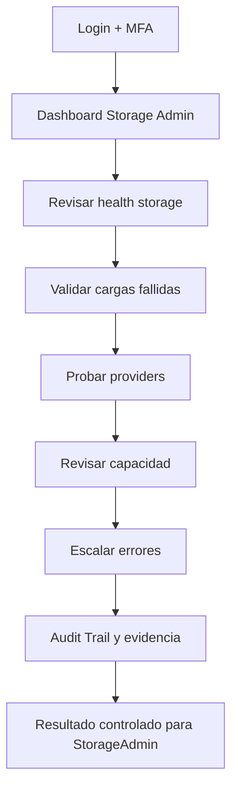
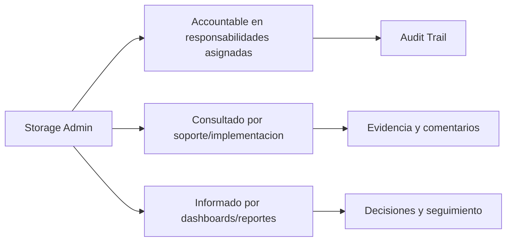

# Compliance 360 Academy

## Storage Admin Certification

## Portada

| Campo | Valor |
| --- | --- |
| Rol | Storage Admin |
| Nivel | Advanced / Technical Admin |
| Duración | 18 horas |
| Objetivo | Formar administradores de almacenamiento, providers, evidencias y failover. |
| Prerrequisitos | Conocer storage cloud/on-premise, buckets, secretos y retención documental. |
| Ruta de aprendizaje | Fundamentos -> Seguridad -> Módulos -> Operación -> Escenarios -> Evaluación -> Certificación |
| Certificación asociada | Compliance 360 Certified Administrator |
| Estado | Markdown maestro. No generar Word hasta aprobación. |

---

# CAPÍTULO 1 - Introducción al Rol

## ¿Quién es?

El `Storage Admin` es un perfil formal de Compliance 360 Academy. Su entrenamiento está diseñado para que pueda usar la plataforma sin revisar código fuente, entendiendo módulos, permisos, responsabilidades, riesgos y límites reales del producto.

## ¿Qué responsabilidades tiene?

| Responsabilidad | Dueño | Prioridad | Evidencia esperada |
| --- | --- | --- | --- |
| Configurar storage | Storage Admin | Alta | Evidencia en Audit Trail / reporte / registro |
| Probar conexión | Storage Admin | Alta | Evidencia en Audit Trail / reporte / registro |
| Administrar failover | Storage Admin | Alta | Evidencia en Audit Trail / reporte / registro |
| Validar evidencias | Storage Admin | Alta | Evidencia en Audit Trail / reporte / registro |
| Monitorear health | Storage Admin | Alta | Evidencia en Audit Trail / reporte / registro |

## ¿Qué puede hacer?

- Configurar storage
- Probar conexión
- Administrar failover
- Validar evidencias
- Monitorear health

## ¿Qué no puede hacer?

- Usar buckets compartidos sin aislamiento
- Guardar secretos en texto plano
- Eliminar evidencias auditables
- Configurar provider sin prueba

## Flujo operativo del rol

## Matriz de responsabilidades

| Responsabilidad | Dueño | Prioridad | Evidencia esperada |
| --- | --- | --- | --- |
| Configurar storage | Storage Admin | Alta | Evidencia en Audit Trail / reporte / registro |
| Probar conexión | Storage Admin | Alta | Evidencia en Audit Trail / reporte / registro |
| Administrar failover | Storage Admin | Alta | Evidencia en Audit Trail / reporte / registro |
| Validar evidencias | Storage Admin | Alta | Evidencia en Audit Trail / reporte / registro |
| Monitorear health | Storage Admin | Alta | Evidencia en Audit Trail / reporte / registro |

## Matriz RACI

| Proceso | Storage Admin | Tenant Admin | Quality Manager | Support Engineer | Consultora Admin |
| --- | --- | --- | --- | --- | --- |
| Configurar Azure Blob | R/A | I | I | C | C |
| Configurar AWS S3 | R/A | I | I | C | C |
| Configurar MinIO | R/A | I | I | C | C |
| Configurar Local | R/A | I | I | C | C |
| Probar failover | R/A | I | I | C | C |
| Validar archivo | R/A | I | I | C | C |

---

# CAPÍTULO 2 - Módulos que utiliza

## Módulos asignados al rol

| Módulo | Para qué sirve | Cuándo lo usa |
| --- | --- | --- |
| Storage | Sirve para storage | Se usa cuando el rol necesita operar o consultar esta capacidad |
| Document Management | Sirve para document management | Se usa cuando el rol necesita operar o consultar esta capacidad |
| Supplier Management | Sirve para supplier management | Se usa cuando el rol necesita operar o consultar esta capacidad |
| Audit Management | Sirve para audit management | Se usa cuando el rol necesita operar o consultar esta capacidad |
| CAPA Management | Sirve para capa management | Se usa cuando el rol necesita operar o consultar esta capacidad |
| Observability | Sirve para observability | Se usa cuando el rol necesita operar o consultar esta capacidad |
| Audit Trail | Sirve para audit trail | Se usa cuando el rol necesita operar o consultar esta capacidad |

## Matriz de módulos

| Módulo | Tipo de uso | Frecuencia | Nota de estado |
| --- | --- | --- | --- |
| Storage | Uso principal | Diario/Semanal | Ver estado real en Handbook |
| Document Management | Uso principal | Diario/Semanal | Ver estado real en Handbook |
| Supplier Management | Uso principal | Diario/Semanal | Ver estado real en Handbook |
| Audit Management | Uso principal | Diario/Semanal | Ver estado real en Handbook |
| CAPA Management | Uso principal | Diario/Semanal | Ver estado real en Handbook |
| Observability | Uso complementario | Según evento | Ver estado real en Handbook |
| Audit Trail | Uso complementario | Según evento | Ver estado real en Handbook |

## Diagrama de responsabilidades

---

# CAPÍTULO 3 - Configuración Inicial

## Objetivo

Preparar el acceso y el entorno de trabajo del rol `Storage Admin` para operar sin fricción.

## Paso a paso

1. Crear o validar usuario en el tenant correcto.
2. Asignar rol y permisos correspondientes.
3. Activar MFA si el tenant lo requiere.
4. Validar acceso a dashboard.
5. Validar acceso a módulos asignados.
6. Probar operación mínima permitida.
7. Confirmar que Audit Trail registra eventos clave.
8. Documentar restricciones del rol.

## Pantalla por pantalla

| Pantalla | Acción esperada | Resultado |
| --- | --- | --- |
| Login | Ingresar credenciales y completar MFA si aplica | Sesión activa |
| Dashboard | Revisar indicadores y alertas | Prioridades visibles |
| Módulos asignados | Validar acceso según matriz | Acceso autorizado |
| Reportes | Consultar datos según permiso | Reporte visible |
| Audit Trail | Confirmar trazabilidad si aplica | Evento registrado |

## Proceso por proceso

Cada proceso debe ejecutarse con tenant, permiso y evidencia correctos. Si aparece `401`, el usuario debe renovar sesión. Si aparece `403`, debe solicitar ajuste de rol, no intentar rodear el control.

---

# CAPÍTULO 4 - Operación Diaria

## ¿Qué hace al iniciar sesión?

| Tarea | Frecuencia | Resultado esperado |
| --- | --- | --- |
| Revisar health storage | Diario | Validar resultado en dashboard/audit trail |
| Validar cargas fallidas | Diario | Validar resultado en dashboard/audit trail |
| Probar providers | Diario | Validar resultado en dashboard/audit trail |
| Revisar capacidad | Diario | Validar resultado en dashboard/audit trail |
| Escalar errores | Diario | Validar resultado en dashboard/audit trail |

## ¿Qué revisa?

- Estado general del dashboard.
- Tareas asignadas.
- Alertas relacionadas con sus módulos.
- Reportes o indicadores relevantes.
- Evidencia pendiente o procesos vencidos.

## ¿Qué tareas ejecuta?

- Revisar health storage
- Validar cargas fallidas
- Probar providers
- Revisar capacidad
- Escalar errores

## ¿Qué indicadores debe monitorear?

| Indicador | Uso | Acción esperada |
| --- | --- | --- |
| Storage health | Monitorear tendencia | Escalar desviaciones |
| Uploads fallidos | Monitorear tendencia | Escalar desviaciones |
| Failovers | Monitorear tendencia | Escalar desviaciones |
| Archivos por tenant | Monitorear tendencia | Escalar desviaciones |
| Errores de descarga | Monitorear tendencia | Escalar desviaciones |

---

# CAPÍTULO 5 - Procesos Paso a Paso

Los procesos de este capítulo reemplazan la versión genérica anterior. Cada flujo incluye pantalla, decisión, resultado esperado y evidencia.

## 5.1 Configurar Azure Blob

**Objetivo:** Habilitar Azure Blob como storage provider.

**Pantallas / áreas usadas:** Configuration → Integraciones → Storage Providers

**Prerrequisitos específicos:**

- Storage account
- Container por tenant
- Secret seguro

**Paso a paso operativo:**

1. Crear provider Azure Blob.
2. Registrar container compliance360-tenant.
3. Configurar connection/secret seguro.
4. Definir prioridad primaria.
5. Ejecutar test de escritura.
6. Subir archivo de prueba.
7. Descargar y validar hash.
8. Activar provider.
9. Registrar owner.
10. Documentar rollback.

**Decisiones clave:**

- **Container inaccesible:** no activar provider.
- **Hash coincide:** habilitar producción.

**Resultado esperado:**

- Azure Blob activo y probado

**Evidencias requeridas:**

- Test upload
- Hash
- Audit Trail

**Errores comunes a evitar:**

- Container compartido
- Sin hash
- Secret en texto plano

**Validación de cierre:** el `Storage Admin` debe poder explicar qué cambió, quién aprobó, qué evidencia quedó, qué riesgo se redujo y dónde se consulta la trazabilidad.

## 5.2 Configurar AWS S3

**Objetivo:** Habilitar bucket S3 con permisos mínimos.

**Pantallas / áreas usadas:** Storage Providers; Health

**Prerrequisitos específicos:**

- Bucket dedicado
- IAM policy mínima
- Region

**Paso a paso operativo:**

1. Crear provider AWS S3.
2. Configurar bucket c360-tenant-prod.
3. Registrar region.
4. Configurar access key segura.
5. Probar PutObject/GetObject.
6. Validar permisos denegados fuera de prefijo.
7. Activar cifrado bucket.
8. Validar descarga.
9. Definir failover.
10. Documentar health.

**Decisiones clave:**

- **AccessDenied:** corregir IAM policy.
- **Permisos amplios:** rechazar configuración.

**Resultado esperado:**

- S3 listo con mínimo privilegio

**Evidencias requeridas:**

- Policy
- Upload test
- Encryption

**Errores comunes a evitar:**

- Permiso wildcard
- Bucket compartido
- Sin cifrado

**Validación de cierre:** el `Storage Admin` debe poder explicar qué cambió, quién aprobó, qué evidencia quedó, qué riesgo se redujo y dónde se consulta la trazabilidad.

## 5.3 Configurar MinIO

**Objetivo:** Configurar storage S3-compatible on-premise.

**Pantallas / áreas usadas:** Storage Providers; Health

**Prerrequisitos específicos:**

- Endpoint MinIO
- Bucket
- Credenciales

**Paso a paso operativo:**

1. Crear provider MinIO.
2. Registrar endpoint HTTPS.
3. Configurar bucket tenant.
4. Registrar access/secret seguro.
5. Probar conexión.
6. Subir evidencia.
7. Simular descarga.
8. Validar health.
9. Configurar failover a local/S3.
10. Documentar limitaciones.

**Decisiones clave:**

- **Endpoint offline:** activar failover.
- **Certificado TLS inválido:** corregir antes de producción.

**Resultado esperado:**

- MinIO operativo o fallback activo

**Evidencias requeridas:**

- Health
- Upload
- Download

**Errores comunes a evitar:**

- HTTP sin TLS
- Sin failover
- No validar descarga

**Validación de cierre:** el `Storage Admin` debe poder explicar qué cambió, quién aprobó, qué evidencia quedó, qué riesgo se redujo y dónde se consulta la trazabilidad.

## 5.4 Restaurar evidencia y versión

**Objetivo:** Recuperar evidencia ante corrupción o pérdida.

**Pantallas / áreas usadas:** Storage Files; Audit Trail

**Prerrequisitos específicos:**

- Archivo registrado
- Hash esperado
- Provider alterno

**Paso a paso operativo:**

1. Buscar archivo por ID.
2. Validar metadata y hash.
3. Intentar descarga del provider primario.
4. Si falla, consultar provider secundario.
5. Restaurar versión válida.
6. Comparar hash.
7. Registrar incidente.
8. Notificar módulo origen.
9. Cerrar recuperación.
10. Actualizar reporte de storage.

**Decisiones clave:**

- **Hash no coincide:** marcar archivo corrupto y no usar.
- **Versión recuperada:** restaurar y auditar.

**Resultado esperado:**

- Evidencia recuperada o incidente formal

**Evidencias requeridas:**

- Hash
- Archivo recuperado
- Audit Trail

**Errores comunes a evitar:**

- Usar archivo corrupto
- No registrar incidente
- Sobrescribir evidencia

**Validación de cierre:** el `Storage Admin` debe poder explicar qué cambió, quién aprobó, qué evidencia quedó, qué riesgo se redujo y dónde se consulta la trazabilidad.

---

# CAPÍTULO 6 - Escenarios Reales

Todos los escenarios fueron reemplazados por casos empresariales con datos, decisiones y consecuencias.

## 6.1 Escenario: Azure Blob inaccesible

**Contexto real:** El provider primario Azure Blob no permite descarga de evidencias.

**Datos iniciales:**

- HTTP 403
- Container compliance360-prod
- Auditoría en curso

**Decisiones que debe tomar el `Storage Admin`:**

- **Acceso:** Validar secreto/container.
- **Continuidad:** Usar failover si existe.

**Acciones esperadas:**

1. Revisar health.
2. Probar descarga.
3. Validar credenciales.
4. Activar secundario.
5. Registrar incidente.

**Resultado esperado:** Evidencias disponibles por provider alterno o incidente formal.

**Consecuencias si se ejecuta mal:**

- Auditoría bloqueada
- Evidencia inaccesible
- SLA incumplido

**Criterios de evaluación:** el caso se aprueba si el estudiante identifica el módulo correcto, aplica permisos adecuados, documenta evidencia, toma decisiones justificadas y deja trazabilidad auditable.

## 6.2 Escenario: Bucket S3 sin permisos

**Contexto real:** IAM policy permite PutObject pero no GetObject.

**Datos iniciales:**

- Bucket c360-tenant
- AccessDenied GetObject

**Decisiones que debe tomar el `Storage Admin`:**

- **Policy:** Corregir mínimo privilegio.
- **Activación:** No activar hasta test completo.

**Acciones esperadas:**

1. Revisar policy.
2. Probar get/put.
3. Ajustar permisos.
4. Validar cifrado.

**Resultado esperado:** S3 funcional con permisos mínimos.

**Consecuencias si se ejecuta mal:**

- Subidas sin descarga
- Evidencia perdida
- Permisos excesivos

**Criterios de evaluación:** el caso se aprueba si el estudiante identifica el módulo correcto, aplica permisos adecuados, documenta evidencia, toma decisiones justificadas y deja trazabilidad auditable.

## 6.3 Escenario: MinIO fuera de línea

**Contexto real:** Endpoint on-premise no responde.

**Datos iniciales:**

- Endpoint offline
- Failover S3 disponible

**Decisiones que debe tomar el `Storage Admin`:**

- **Continuidad:** Activar failover.
- **RCA:** Registrar causa local.

**Acciones esperadas:**

1. Confirmar health.
2. Cambiar prioridad.
3. Probar S3.
4. Notificar infraestructura.

**Resultado esperado:** Operación continúa por S3.

**Consecuencias si se ejecuta mal:**

- Carga fallida
- Pérdida de evidencia
- Incidente repetido

**Criterios de evaluación:** el caso se aprueba si el estudiante identifica el módulo correcto, aplica permisos adecuados, documenta evidencia, toma decisiones justificadas y deja trazabilidad auditable.

## 6.4 Escenario: Restauración de evidencia

**Contexto real:** Auditor requiere recuperar evidencia histórica.

**Datos iniciales:**

- Archivo ID 8821
- Hash esperado
- Versión 1.0

**Decisiones que debe tomar el `Storage Admin`:**

- **Integridad:** Comparar hash.
- **Trazabilidad:** Registrar recuperación.

**Acciones esperadas:**

1. Buscar metadata.
2. Descargar versión.
3. Validar hash.
4. Entregar evidencia.

**Resultado esperado:** Evidencia restaurada y verificable.

**Consecuencias si se ejecuta mal:**

- Evidencia inválida
- Auditoría fallida
- Cadena de custodia rota

**Criterios de evaluación:** el caso se aprueba si el estudiante identifica el módulo correcto, aplica permisos adecuados, documenta evidencia, toma decisiones justificadas y deja trazabilidad auditable.

## 6.5 Escenario: Archivo corrupto

**Contexto real:** Hash descargado no coincide con metadata.

**Datos iniciales:**

- Hash esperado abc
- Hash real xyz

**Decisiones que debe tomar el `Storage Admin`:**

- **Uso:** No usar archivo corrupto.
- **Recuperación:** Buscar copia secundaria.

**Acciones esperadas:**

1. Bloquear archivo.
2. Consultar provider alterno.
3. Restaurar.
4. Registrar incidente.

**Resultado esperado:** Archivo válido recuperado o incidente abierto.

**Consecuencias si se ejecuta mal:**

- Decisión basada en archivo corrupto
- Evidencia inválida

**Criterios de evaluación:** el caso se aprueba si el estudiante identifica el módulo correcto, aplica permisos adecuados, documenta evidencia, toma decisiones justificadas y deja trazabilidad auditable.

## 6.6 Escenario: Recuperación de versión

**Contexto real:** Se necesita versión anterior de ficha técnica.

**Datos iniciales:**

- Ficha v1.2 actual
- Solicitan v1.0
- Auditoría cliente

**Decisiones que debe tomar el `Storage Admin`:**

- **Versionado:** Entregar versión histórica, no sobrescribir.
- **Auditoría:** Registrar consulta.

**Acciones esperadas:**

1. Buscar versión.
2. Validar metadata.
3. Descargar.
4. Registrar entrega.

**Resultado esperado:** Versión correcta entregada.

**Consecuencias si se ejecuta mal:**

- Sobrescribir versión
- Entregar documento incorrecto

**Criterios de evaluación:** el caso se aprueba si el estudiante identifica el módulo correcto, aplica permisos adecuados, documenta evidencia, toma decisiones justificadas y deja trazabilidad auditable.

## 6.7 Escenario: Cifrado no validado

**Contexto real:** Cliente exige evidencia de cifrado en bucket.

**Datos iniciales:**

- AWS S3
- SSE no confirmado

**Decisiones que debe tomar el `Storage Admin`:**

- **Go-live:** Bloquear salida hasta validar.
- **Evidencia:** Guardar configuración.

**Acciones esperadas:**

1. Revisar provider.
2. Validar cifrado.
3. Adjuntar evidencia.
4. Actualizar checklist.

**Resultado esperado:** Cifrado validado antes de go-live.

**Consecuencias si se ejecuta mal:**

- Riesgo contractual
- No conformidad seguridad

**Criterios de evaluación:** el caso se aprueba si el estudiante identifica el módulo correcto, aplica permisos adecuados, documenta evidencia, toma decisiones justificadas y deja trazabilidad auditable.

## 6.8 Escenario: Bucket compartido entre tenants

**Contexto real:** Se detectan prefijos de dos tenants en el mismo bucket sin aislamiento claro.

**Datos iniciales:**

- Tenant A
- Tenant B
- Bucket compartido

**Decisiones que debe tomar el `Storage Admin`:**

- **Aislamiento:** Revisar prefijos y permisos.
- **Riesgo:** Escalar como incidente.

**Acciones esperadas:**

1. Auditar paths.
2. Validar acceso cruzado.
3. Corregir policy.
4. Documentar riesgo.

**Resultado esperado:** Aislamiento restaurado.

**Consecuencias si se ejecuta mal:**

- Exposición de datos
- Incidente privacidad

**Criterios de evaluación:** el caso se aprueba si el estudiante identifica el módulo correcto, aplica permisos adecuados, documenta evidencia, toma decisiones justificadas y deja trazabilidad auditable.

## 6.9 Escenario: Carga masiva fallida

**Contexto real:** Migración documental falla al 35%.

**Datos iniciales:**

- 1,200 archivos
- 420 cargados
- Timeout

**Decisiones que debe tomar el `Storage Admin`:**

- **Reintento:** Reanudar idempotente.
- **Integridad:** Validar hash por lote.

**Acciones esperadas:**

1. Revisar logs.
2. Separar lote.
3. Reintentar.
4. Validar conteos.

**Resultado esperado:** Carga completa con integridad.

**Consecuencias si se ejecuta mal:**

- Duplicados
- Archivos faltantes
- Migración inconsistente

**Criterios de evaluación:** el caso se aprueba si el estudiante identifica el módulo correcto, aplica permisos adecuados, documenta evidencia, toma decisiones justificadas y deja trazabilidad auditable.

## 6.10 Escenario: Provider local lleno

**Contexto real:** Storage local alcanza 95%.

**Datos iniciales:**

- Disco 95%
- Uploads fallan
- Cloud disponible

**Decisiones que debe tomar el `Storage Admin`:**

- **Capacidad:** Activar provider cloud.
- **Operación:** Bloquear cargas no críticas.

**Acciones esperadas:**

1. Revisar capacidad.
2. Activar secundario.
3. Migrar archivos críticos.
4. Crear alerta.

**Resultado esperado:** Capacidad mitigada.

**Consecuencias si se ejecuta mal:**

- Caída de cargas
- Pérdida de evidencias

**Criterios de evaluación:** el caso se aprueba si el estudiante identifica el módulo correcto, aplica permisos adecuados, documenta evidencia, toma decisiones justificadas y deja trazabilidad auditable.

---

# CAPÍTULO 7 - Mejores Prácticas

## ISO 9001

- Mantener evidencia trazable de cambios, aprobaciones y cierres.
- Usar roles claros para evitar conflictos de interés.
- Medir desempeño con indicadores y revisar tendencias.
- Gestionar no conformidades mediante CAPA con causa raíz y efectividad.

## ISO 22000, HACCP y BPM

- Controlar documentos de inocuidad y BPM como documentos vigentes.
- Vincular proveedores críticos con certificaciones y evaluaciones.
- Registrar riesgos de inocuidad con controles y tratamiento.
- Mantener evidencias de acciones preventivas y correctivas.

## Buenas prácticas SaaS

- No compartir usuarios.
- Activar MFA para roles sensibles.
- Usar permisos mínimos necesarios.
- Validar providers de email/storage antes de producción.
- Escalar errores técnicos con evidencia, hora, tenant y correlation id.

---

# CAPÍTULO 8 - Errores Comunes

| Error | Consecuencia | Prevención |
| --- | --- | --- |
| Operar en tenant incorrecto | Riesgo de privacidad y datos cruzados | Confirmar tenant al iniciar |
| Usar rol con permisos excesivos | Falta de segregación | Revisar matriz RBAC |
| Cerrar sin evidencia | Debilidad ante auditoría | Adjuntar evidencia antes de cierre |
| Ignorar módulos en estado workspace | Promesa comercial incorrecta | Aplicar regla de honestidad |
| No revisar Audit Trail | Falta de trazabilidad | Validar eventos clave |
| No probar providers | Fallas de email/storage en producción | Ejecutar tests de conexión |
| Compartir credenciales | Riesgo de seguridad | Usuario individual por persona |
| Omitir MFA | Mayor exposición de acceso | Activar MFA en roles críticos |
| No documentar decisiones | Soporte y auditoría débiles | Registrar comentarios |
| No escalar a tiempo | SLA incumplido | Clasificar severidad |

---

# CAPÍTULO 9 - Checklist Operativo

## Checklist diario

- Confirmar acceso y tenant correcto.
- Revisar dashboard y tareas asignadas.
- Revisar alertas de módulos asignados.
- Ejecutar procesos prioritarios.
- Escalar bloqueos con evidencia.

## Checklist semanal

- Revisar reportes relevantes.
- Revisar tareas vencidas.
- Validar indicadores del rol.
- Confirmar que los procesos críticos tienen responsables.
- Revisar errores recurrentes.

## Checklist mensual

- Preparar comité o revisión ejecutiva.
- Auditar permisos del rol si aplica.
- Revisar tendencias y desviaciones.
- Confirmar cierre de procesos críticos.
- Documentar oportunidades de mejora.

## Checklist trimestral

- Revisar matriz de responsabilidades.
- Validar capacitación de usuarios.
- Revisar efectividad de controles.
- Actualizar procesos según cambios normativos.
- Preparar evidencia para auditorías.

---

# CAPÍTULO 10 - Evaluación Teórica

**Formato del examen:** 50 preguntas situacionales, 2 puntos por pregunta, 100 puntos totales.

**Regla de certificación:** las preguntas mezclan contexto, datos, problema, decisión y consecuencia. Las opciones incorrectas son plausibles y requieren criterio profesional.

## Pregunta 1

**Contexto:** Azure Blob devuelve 403 al descargar evidencia durante auditoría. Enfoque: Acción inmediata.

**Datos del sistema/caso:**

- Container: compliance360-prod
- Error: 403
- Audit evidence needed

**Problema:** El rol `Storage Admin` debe resolver `Azure Blob 403` sin romper segregación, evidencia ni trazabilidad.

**Decisión requerida:** ¿Cuál es la primera acción correcta?

**Consecuencia de una mala decisión:** Si se elige mal, el proceso puede avanzar sin control.

A. Cambiar container manualmente sin registrar.
B. Validar SAS/secret/container y activar failover si existe.
C. Pedir al auditor esperar sin evidencia.
D. Exponer todos los blobs.

**Respuesta correcta:** B

**Explicación:** La opción B es correcta porque aborda `Azure Blob 403` con control verificable, decisión justificada y evidencia auditable. Las demás opciones son plausibles, pero dejan una brecha de cumplimiento, operación o certificación.

## Pregunta 2

**Contexto:** Azure Blob devuelve 403 al descargar evidencia durante auditoría. Enfoque: Decisión de aprobación.

**Datos del sistema/caso:**

- Container: compliance360-prod
- Error: 403
- Audit evidence needed

**Problema:** El rol `Storage Admin` debe resolver `Azure Blob 403` sin romper segregación, evidencia ni trazabilidad.

**Decisión requerida:** ¿Qué decisión protege mejor la trazabilidad y el cumplimiento?

**Consecuencia de una mala decisión:** Una aprobación débil genera evidencia no defendible.

A. Pedir al auditor esperar sin evidencia.
B. Subir copia local sin hash.
C. Borrar metadata
D. No usar evidencia inaccesible como entregada.

**Respuesta correcta:** D

**Explicación:** La opción D es correcta porque aborda `Azure Blob 403` con control verificable, decisión justificada y evidencia auditable. Las demás opciones son plausibles, pero dejan una brecha de cumplimiento, operación o certificación.

## Pregunta 3

**Contexto:** Azure Blob devuelve 403 al descargar evidencia durante auditoría. Enfoque: Evidencia.

**Datos del sistema/caso:**

- Container: compliance360-prod
- Error: 403
- Audit evidence needed

**Problema:** El rol `Storage Admin` debe resolver `Azure Blob 403` sin romper segregación, evidencia ni trazabilidad.

**Decisión requerida:** ¿Qué evidencia mínima debe exigirse antes de cerrar o avanzar?

**Consecuencia de una mala decisión:** Sin evidencia objetiva no hay certificación defendible.

A. Registrar incidente y preservar metadata.
B. Subir copia local sin hash.
C. Dar permisos globales al container.
D. Marcar evidencia como validada.

**Respuesta correcta:** A

**Explicación:** La opción A es correcta porque aborda `Azure Blob 403` con control verificable, decisión justificada y evidencia auditable. Las demás opciones son plausibles, pero dejan una brecha de cumplimiento, operación o certificación.

## Pregunta 4

**Contexto:** Azure Blob devuelve 403 al descargar evidencia durante auditoría. Enfoque: Escalación.

**Datos del sistema/caso:**

- Container: compliance360-prod
- Error: 403
- Audit evidence needed

**Problema:** El rol `Storage Admin` debe resolver `Azure Blob 403` sin romper segregación, evidencia ni trazabilidad.

**Decisión requerida:** ¿Cuándo debe escalarse el caso y a quién?

**Consecuencia de una mala decisión:** Escalar tarde puede producir incumplimiento, pérdida de SLA o riesgo contractual.

A. Dar permisos globales al container.
B. Cambiar container manualmente sin registrar.
C. Comparar permisos por tenant.
D. Exponer todos los blobs.

**Respuesta correcta:** C

**Explicación:** La opción C es correcta porque aborda `Azure Blob 403` con control verificable, decisión justificada y evidencia auditable. Las demás opciones son plausibles, pero dejan una brecha de cumplimiento, operación o certificación.

## Pregunta 5

**Contexto:** Azure Blob devuelve 403 al descargar evidencia durante auditoría. Enfoque: Prevención.

**Datos del sistema/caso:**

- Container: compliance360-prod
- Error: 403
- Audit evidence needed

**Problema:** El rol `Storage Admin` debe resolver `Azure Blob 403` sin romper segregación, evidencia ni trazabilidad.

**Decisión requerida:** ¿Qué control evita la recurrencia del problema?

**Consecuencia de una mala decisión:** Resolver solo el síntoma deja el sistema expuesto a repetición.

A. Cambiar container manualmente sin registrar.
B. Confirmar descarga y hash tras corrección.
C. Pedir al auditor esperar sin evidencia.
D. Borrar metadata

**Respuesta correcta:** B

**Explicación:** La opción B es correcta porque aborda `Azure Blob 403` con control verificable, decisión justificada y evidencia auditable. Las demás opciones son plausibles, pero dejan una brecha de cumplimiento, operación o certificación.

## Pregunta 6

**Contexto:** Bucket S3 permite PutObject pero falla GetObject. Enfoque: Acción inmediata.

**Datos del sistema/caso:**

- Bucket: c360-tenant-prod
- Error: AccessDenied
- Policy: PutObject only

**Problema:** El rol `Storage Admin` debe resolver `AWS S3 IAM` sin romper segregación, evidencia ni trazabilidad.

**Decisión requerida:** ¿Cuál es la primera acción correcta?

**Consecuencia de una mala decisión:** Si se elige mal, el proceso puede avanzar sin control.

A. Agregar s3:* para resolver rápido.
B. Usar credenciales admin.
C. Permiso excesivo
D. Corregir IAM con mínimo privilegio GetObject al prefijo correcto.

**Respuesta correcta:** D

**Explicación:** La opción D es correcta porque aborda `AWS S3 IAM` con control verificable, decisión justificada y evidencia auditable. Las demás opciones son plausibles, pero dejan una brecha de cumplimiento, operación o certificación.

## Pregunta 7

**Contexto:** Bucket S3 permite PutObject pero falla GetObject. Enfoque: Decisión de aprobación.

**Datos del sistema/caso:**

- Bucket: c360-tenant-prod
- Error: AccessDenied
- Policy: PutObject only

**Problema:** El rol `Storage Admin` debe resolver `AWS S3 IAM` sin romper segregación, evidencia ni trazabilidad.

**Decisión requerida:** ¿Qué decisión protege mejor la trazabilidad y el cumplimiento?

**Consecuencia de una mala decisión:** Una aprobación débil genera evidencia no defendible.

A. No activar provider hasta probar put/get/delete permitido.
B. Usar credenciales admin.
C. Copiar archivos a bucket público.
D. Exposición tenant

**Respuesta correcta:** A

**Explicación:** La opción A es correcta porque aborda `AWS S3 IAM` con control verificable, decisión justificada y evidencia auditable. Las demás opciones son plausibles, pero dejan una brecha de cumplimiento, operación o certificación.

## Pregunta 8

**Contexto:** Bucket S3 permite PutObject pero falla GetObject. Enfoque: Evidencia.

**Datos del sistema/caso:**

- Bucket: c360-tenant-prod
- Error: AccessDenied
- Policy: PutObject only

**Problema:** El rol `Storage Admin` debe resolver `AWS S3 IAM` sin romper segregación, evidencia ni trazabilidad.

**Decisión requerida:** ¿Qué evidencia mínima debe exigirse antes de cerrar o avanzar?

**Consecuencia de una mala decisión:** Sin evidencia objetiva no hay certificación defendible.

A. Copiar archivos a bucket público.
B. Activar provider porque upload funciona.
C. Validar que no exista acceso cruzado de tenants.
D. Evidencia no descargable.

**Respuesta correcta:** C

**Explicación:** La opción C es correcta porque aborda `AWS S3 IAM` con control verificable, decisión justificada y evidencia auditable. Las demás opciones son plausibles, pero dejan una brecha de cumplimiento, operación o certificación.

## Pregunta 9

**Contexto:** Bucket S3 permite PutObject pero falla GetObject. Enfoque: Escalación.

**Datos del sistema/caso:**

- Bucket: c360-tenant-prod
- Error: AccessDenied
- Policy: PutObject only

**Problema:** El rol `Storage Admin` debe resolver `AWS S3 IAM` sin romper segregación, evidencia ni trazabilidad.

**Decisión requerida:** ¿Cuándo debe escalarse el caso y a quién?

**Consecuencia de una mala decisión:** Escalar tarde puede producir incumplimiento, pérdida de SLA o riesgo contractual.

A. Activar provider porque upload funciona.
B. Documentar policy y evidencia de test.
C. Agregar s3:* para resolver rápido.
D. Permiso excesivo

**Respuesta correcta:** B

**Explicación:** La opción B es correcta porque aborda `AWS S3 IAM` con control verificable, decisión justificada y evidencia auditable. Las demás opciones son plausibles, pero dejan una brecha de cumplimiento, operación o certificación.

## Pregunta 10

**Contexto:** Bucket S3 permite PutObject pero falla GetObject. Enfoque: Prevención.

**Datos del sistema/caso:**

- Bucket: c360-tenant-prod
- Error: AccessDenied
- Policy: PutObject only

**Problema:** El rol `Storage Admin` debe resolver `AWS S3 IAM` sin romper segregación, evidencia ni trazabilidad.

**Decisión requerida:** ¿Qué control evita la recurrencia del problema?

**Consecuencia de una mala decisión:** Resolver solo el síntoma deja el sistema expuesto a repetición.

A. Agregar s3:* para resolver rápido.
B. Mantener failover hasta completar prueba.
C. Usar credenciales admin.
D. Exposición tenant

**Respuesta correcta:** B

**Explicación:** La opción B es correcta porque aborda `AWS S3 IAM` con control verificable, decisión justificada y evidencia auditable. Las demás opciones son plausibles, pero dejan una brecha de cumplimiento, operación o certificación.

## Pregunta 11

**Contexto:** Endpoint MinIO on-premise no responde y hay cargas pendientes. Enfoque: Acción inmediata.

**Datos del sistema/caso:**

- Endpoint: minio.local
- Health: down
- Failover: S3

**Problema:** El rol `Storage Admin` debe resolver `MinIO offline` sin romper segregación, evidencia ni trazabilidad.

**Decisión requerida:** ¿Cuál es la primera acción correcta?

**Consecuencia de una mala decisión:** Si se elige mal, el proceso puede avanzar sin control.

A. Activar failover S3 y registrar incidente de infraestructura.
B. Reintentar uploads indefinidamente.
C. Desactivar health para evitar alerta.
D. Perder evidencias

**Respuesta correcta:** A

**Explicación:** La opción A es correcta porque aborda `MinIO offline` con control verificable, decisión justificada y evidencia auditable. Las demás opciones son plausibles, pero dejan una brecha de cumplimiento, operación o certificación.

## Pregunta 12

**Contexto:** Endpoint MinIO on-premise no responde y hay cargas pendientes. Enfoque: Decisión de aprobación.

**Datos del sistema/caso:**

- Endpoint: minio.local
- Health: down
- Failover: S3

**Problema:** El rol `Storage Admin` debe resolver `MinIO offline` sin romper segregación, evidencia ni trazabilidad.

**Decisión requerida:** ¿Qué decisión protege mejor la trazabilidad y el cumplimiento?

**Consecuencia de una mala decisión:** Una aprobación débil genera evidencia no defendible.

A. Desactivar health para evitar alerta.
B. Cambiar DNS sin prueba.
C. Pausar cargas no críticas si no hay failover validado.
D. Duplicar archivos

**Respuesta correcta:** C

**Explicación:** La opción C es correcta porque aborda `MinIO offline` con control verificable, decisión justificada y evidencia auditable. Las demás opciones son plausibles, pero dejan una brecha de cumplimiento, operación o certificación.

## Pregunta 13

**Contexto:** Endpoint MinIO on-premise no responde y hay cargas pendientes. Enfoque: Evidencia.

**Datos del sistema/caso:**

- Endpoint: minio.local
- Health: down
- Failover: S3

**Problema:** El rol `Storage Admin` debe resolver `MinIO offline` sin romper segregación, evidencia ni trazabilidad.

**Decisión requerida:** ¿Qué evidencia mínima debe exigirse antes de cerrar o avanzar?

**Consecuencia de una mala decisión:** Sin evidencia objetiva no hay certificación defendible.

A. Cambiar DNS sin prueba.
B. Validar descarga de evidencia crítica.
C. Usar carpeta local sin registrar.
D. No reconciliar.

**Respuesta correcta:** B

**Explicación:** La opción B es correcta porque aborda `MinIO offline` con control verificable, decisión justificada y evidencia auditable. Las demás opciones son plausibles, pero dejan una brecha de cumplimiento, operación o certificación.

## Pregunta 14

**Contexto:** Endpoint MinIO on-premise no responde y hay cargas pendientes. Enfoque: Escalación.

**Datos del sistema/caso:**

- Endpoint: minio.local
- Health: down
- Failover: S3

**Problema:** El rol `Storage Admin` debe resolver `MinIO offline` sin romper segregación, evidencia ni trazabilidad.

**Decisión requerida:** ¿Cuándo debe escalarse el caso y a quién?

**Consecuencia de una mala decisión:** Escalar tarde puede producir incumplimiento, pérdida de SLA o riesgo contractual.

A. Usar carpeta local sin registrar.
B. Notificar owner on-prem.
C. Reintentar uploads indefinidamente.
D. Perder evidencias

**Respuesta correcta:** B

**Explicación:** La opción B es correcta porque aborda `MinIO offline` con control verificable, decisión justificada y evidencia auditable. Las demás opciones son plausibles, pero dejan una brecha de cumplimiento, operación o certificación.

## Pregunta 15

**Contexto:** Endpoint MinIO on-premise no responde y hay cargas pendientes. Enfoque: Prevención.

**Datos del sistema/caso:**

- Endpoint: minio.local
- Health: down
- Failover: S3

**Problema:** El rol `Storage Admin` debe resolver `MinIO offline` sin romper segregación, evidencia ni trazabilidad.

**Decisión requerida:** ¿Qué control evita la recurrencia del problema?

**Consecuencia de una mala decisión:** Resolver solo el síntoma deja el sistema expuesto a repetición.

A. Reintentar uploads indefinidamente.
B. Desactivar health para evitar alerta.
C. Duplicar archivos
D. Reconciliar archivos cuando MinIO vuelva.

**Respuesta correcta:** D

**Explicación:** La opción D es correcta porque aborda `MinIO offline` con control verificable, decisión justificada y evidencia auditable. Las demás opciones son plausibles, pero dejan una brecha de cumplimiento, operación o certificación.

## Pregunta 16

**Contexto:** Hash de archivo descargado no coincide con metadata. Enfoque: Acción inmediata.

**Datos del sistema/caso:**

- Expected hash: abc
- Actual hash: xyz
- Provider: primary

**Problema:** El rol `Storage Admin` debe resolver `Hash mismatch` sin romper segregación, evidencia ni trazabilidad.

**Decisión requerida:** ¿Cuál es la primera acción correcta?

**Consecuencia de una mala decisión:** Si se elige mal, el proceso puede avanzar sin control.

A. Usar archivo si abre correctamente.
B. Actualizar metadata al hash nuevo.
C. Bloquear uso del archivo y buscar copia secundaria/versionada.
D. Evidencia corrupta

**Respuesta correcta:** C

**Explicación:** La opción C es correcta porque aborda `Hash mismatch` con control verificable, decisión justificada y evidencia auditable. Las demás opciones son plausibles, pero dejan una brecha de cumplimiento, operación o certificación.

## Pregunta 17

**Contexto:** Hash de archivo descargado no coincide con metadata. Enfoque: Decisión de aprobación.

**Datos del sistema/caso:**

- Expected hash: abc
- Actual hash: xyz
- Provider: primary

**Problema:** El rol `Storage Admin` debe resolver `Hash mismatch` sin romper segregación, evidencia ni trazabilidad.

**Decisión requerida:** ¿Qué decisión protege mejor la trazabilidad y el cumplimiento?

**Consecuencia de una mala decisión:** Una aprobación débil genera evidencia no defendible.

A. Actualizar metadata al hash nuevo.
B. Registrar incidente de integridad.
C. Solicitar nuevo archivo y borrar anterior.
D. Cadena de custodia rota

**Respuesta correcta:** B

**Explicación:** La opción B es correcta porque aborda `Hash mismatch` con control verificable, decisión justificada y evidencia auditable. Las demás opciones son plausibles, pero dejan una brecha de cumplimiento, operación o certificación.

## Pregunta 18

**Contexto:** Hash de archivo descargado no coincide con metadata. Enfoque: Evidencia.

**Datos del sistema/caso:**

- Expected hash: abc
- Actual hash: xyz
- Provider: primary

**Problema:** El rol `Storage Admin` debe resolver `Hash mismatch` sin romper segregación, evidencia ni trazabilidad.

**Decisión requerida:** ¿Qué evidencia mínima debe exigirse antes de cerrar o avanzar?

**Consecuencia de una mala decisión:** Sin evidencia objetiva no hay certificación defendible.

A. Solicitar nuevo archivo y borrar anterior.
B. Comparar metadata y eventos de upload.
C. Ignorar si es PDF.
D. Auditoría inválida.

**Respuesta correcta:** B

**Explicación:** La opción B es correcta porque aborda `Hash mismatch` con control verificable, decisión justificada y evidencia auditable. Las demás opciones son plausibles, pero dejan una brecha de cumplimiento, operación o certificación.

## Pregunta 19

**Contexto:** Hash de archivo descargado no coincide con metadata. Enfoque: Escalación.

**Datos del sistema/caso:**

- Expected hash: abc
- Actual hash: xyz
- Provider: primary

**Problema:** El rol `Storage Admin` debe resolver `Hash mismatch` sin romper segregación, evidencia ni trazabilidad.

**Decisión requerida:** ¿Cuándo debe escalarse el caso y a quién?

**Consecuencia de una mala decisión:** Escalar tarde puede producir incumplimiento, pérdida de SLA o riesgo contractual.

A. Ignorar si es PDF.
B. Usar archivo si abre correctamente.
C. Evidencia corrupta
D. Restaurar solo si hash coincide.

**Respuesta correcta:** D

**Explicación:** La opción D es correcta porque aborda `Hash mismatch` con control verificable, decisión justificada y evidencia auditable. Las demás opciones son plausibles, pero dejan una brecha de cumplimiento, operación o certificación.

## Pregunta 20

**Contexto:** Hash de archivo descargado no coincide con metadata. Enfoque: Prevención.

**Datos del sistema/caso:**

- Expected hash: abc
- Actual hash: xyz
- Provider: primary

**Problema:** El rol `Storage Admin` debe resolver `Hash mismatch` sin romper segregación, evidencia ni trazabilidad.

**Decisión requerida:** ¿Qué control evita la recurrencia del problema?

**Consecuencia de una mala decisión:** Resolver solo el síntoma deja el sistema expuesto a repetición.

A. Notificar módulo origen.
B. Usar archivo si abre correctamente.
C. Actualizar metadata al hash nuevo.
D. Cadena de custodia rota

**Respuesta correcta:** A

**Explicación:** La opción A es correcta porque aborda `Hash mismatch` con control verificable, decisión justificada y evidencia auditable. Las demás opciones son plausibles, pero dejan una brecha de cumplimiento, operación o certificación.

## Pregunta 21

**Contexto:** Auditor pide versión 1.0 de ficha técnica; actual es 1.2. Enfoque: Acción inmediata.

**Datos del sistema/caso:**

- File: ficha salsa
- Current: 1.2
- Requested: 1.0

**Problema:** El rol `Storage Admin` debe resolver `Version restore` sin romper segregación, evidencia ni trazabilidad.

**Decisión requerida:** ¿Cuál es la primera acción correcta?

**Consecuencia de una mala decisión:** Si se elige mal, el proceso puede avanzar sin control.

A. Reemplazar 1.2 por 1.0 temporalmente.
B. Recuperar versión 1.0 sin sobrescribir la vigente.
C. Enviar 1.2 porque es más reciente.
D. Pérdida versionado

**Respuesta correcta:** B

**Explicación:** La opción B es correcta porque aborda `Version restore` con control verificable, decisión justificada y evidencia auditable. Las demás opciones son plausibles, pero dejan una brecha de cumplimiento, operación o certificación.

## Pregunta 22

**Contexto:** Auditor pide versión 1.0 de ficha técnica; actual es 1.2. Enfoque: Decisión de aprobación.

**Datos del sistema/caso:**

- File: ficha salsa
- Current: 1.2
- Requested: 1.0

**Problema:** El rol `Storage Admin` debe resolver `Version restore` sin romper segregación, evidencia ni trazabilidad.

**Decisión requerida:** ¿Qué decisión protege mejor la trazabilidad y el cumplimiento?

**Consecuencia de una mala decisión:** Una aprobación débil genera evidencia no defendible.

A. Enviar 1.2 porque es más reciente.
B. Validar metadata, fecha, hash y estado histórico.
C. Crear copia sin metadata.
D. Evidencia incorrecta

**Respuesta correcta:** B

**Explicación:** La opción B es correcta porque aborda `Version restore` con control verificable, decisión justificada y evidencia auditable. Las demás opciones son plausibles, pero dejan una brecha de cumplimiento, operación o certificación.

## Pregunta 23

**Contexto:** Auditor pide versión 1.0 de ficha técnica; actual es 1.2. Enfoque: Evidencia.

**Datos del sistema/caso:**

- File: ficha salsa
- Current: 1.2
- Requested: 1.0

**Problema:** El rol `Storage Admin` debe resolver `Version restore` sin romper segregación, evidencia ni trazabilidad.

**Decisión requerida:** ¿Qué evidencia mínima debe exigirse antes de cerrar o avanzar?

**Consecuencia de una mala decisión:** Sin evidencia objetiva no hay certificación defendible.

A. Crear copia sin metadata.
B. Modificar fecha de 1.0.
C. Histórico alterado.
D. Registrar entrega en Audit Trail.

**Respuesta correcta:** D

**Explicación:** La opción D es correcta porque aborda `Version restore` con control verificable, decisión justificada y evidencia auditable. Las demás opciones son plausibles, pero dejan una brecha de cumplimiento, operación o certificación.

## Pregunta 24

**Contexto:** Auditor pide versión 1.0 de ficha técnica; actual es 1.2. Enfoque: Escalación.

**Datos del sistema/caso:**

- File: ficha salsa
- Current: 1.2
- Requested: 1.0

**Problema:** El rol `Storage Admin` debe resolver `Version restore` sin romper segregación, evidencia ni trazabilidad.

**Decisión requerida:** ¿Cuándo debe escalarse el caso y a quién?

**Consecuencia de una mala decisión:** Escalar tarde puede producir incumplimiento, pérdida de SLA o riesgo contractual.

A. Mantener versión actual como vigente.
B. Modificar fecha de 1.0.
C. Reemplazar 1.2 por 1.0 temporalmente.
D. Pérdida versionado

**Respuesta correcta:** A

**Explicación:** La opción A es correcta porque aborda `Version restore` con control verificable, decisión justificada y evidencia auditable. Las demás opciones son plausibles, pero dejan una brecha de cumplimiento, operación o certificación.

## Pregunta 25

**Contexto:** Auditor pide versión 1.0 de ficha técnica; actual es 1.2. Enfoque: Prevención.

**Datos del sistema/caso:**

- File: ficha salsa
- Current: 1.2
- Requested: 1.0

**Problema:** El rol `Storage Admin` debe resolver `Version restore` sin romper segregación, evidencia ni trazabilidad.

**Decisión requerida:** ¿Qué control evita la recurrencia del problema?

**Consecuencia de una mala decisión:** Resolver solo el síntoma deja el sistema expuesto a repetición.

A. Reemplazar 1.2 por 1.0 temporalmente.
B. Enviar 1.2 porque es más reciente.
C. Documentar motivo de consulta histórica.
D. Evidencia incorrecta

**Respuesta correcta:** C

**Explicación:** La opción C es correcta porque aborda `Version restore` con control verificable, decisión justificada y evidencia auditable. Las demás opciones son plausibles, pero dejan una brecha de cumplimiento, operación o certificación.

## Pregunta 26

**Contexto:** Cliente exige prueba de cifrado para bucket productivo. Enfoque: Acción inmediata.

**Datos del sistema/caso:**

- Provider: AWS S3
- SSE: unknown
- Go-live: 48h

**Problema:** El rol `Storage Admin` debe resolver `Encryption required` sin romper segregación, evidencia ni trazabilidad.

**Decisión requerida:** ¿Cuál es la primera acción correcta?

**Consecuencia de una mala decisión:** Si se elige mal, el proceso puede avanzar sin control.

A. Aceptar declaración verbal de IT.
B. Bloquear go-live hasta validar cifrado o aplicar SSE/KMS.
C. Activar go-live y corregir luego.
D. Incumplimiento contractual

**Respuesta correcta:** B

**Explicación:** La opción B es correcta porque aborda `Encryption required` con control verificable, decisión justificada y evidencia auditable. Las demás opciones son plausibles, pero dejan una brecha de cumplimiento, operación o certificación.

## Pregunta 27

**Contexto:** Cliente exige prueba de cifrado para bucket productivo. Enfoque: Decisión de aprobación.

**Datos del sistema/caso:**

- Provider: AWS S3
- SSE: unknown
- Go-live: 48h

**Problema:** El rol `Storage Admin` debe resolver `Encryption required` sin romper segregación, evidencia ni trazabilidad.

**Decisión requerida:** ¿Qué decisión protege mejor la trazabilidad y el cumplimiento?

**Consecuencia de una mala decisión:** Una aprobación débil genera evidencia no defendible.

A. Activar go-live y corregir luego.
B. Usar cifrado local no documentado.
C. Datos expuestos
D. Adjuntar evidencia de configuración de cifrado.

**Respuesta correcta:** D

**Explicación:** La opción D es correcta porque aborda `Encryption required` con control verificable, decisión justificada y evidencia auditable. Las demás opciones son plausibles, pero dejan una brecha de cumplimiento, operación o certificación.

## Pregunta 28

**Contexto:** Cliente exige prueba de cifrado para bucket productivo. Enfoque: Evidencia.

**Datos del sistema/caso:**

- Provider: AWS S3
- SSE: unknown
- Go-live: 48h

**Problema:** El rol `Storage Admin` debe resolver `Encryption required` sin romper segregación, evidencia ni trazabilidad.

**Decisión requerida:** ¿Qué evidencia mínima debe exigirse antes de cerrar o avanzar?

**Consecuencia de una mala decisión:** Sin evidencia objetiva no hay certificación defendible.

A. Revisar policy de bucket y acceso.
B. Usar cifrado local no documentado.
C. Omitir evidencia por ser cloud.
D. Go-live inseguro.

**Respuesta correcta:** A

**Explicación:** La opción A es correcta porque aborda `Encryption required` con control verificable, decisión justificada y evidencia auditable. Las demás opciones son plausibles, pero dejan una brecha de cumplimiento, operación o certificación.

## Pregunta 29

**Contexto:** Cliente exige prueba de cifrado para bucket productivo. Enfoque: Escalación.

**Datos del sistema/caso:**

- Provider: AWS S3
- SSE: unknown
- Go-live: 48h

**Problema:** El rol `Storage Admin` debe resolver `Encryption required` sin romper segregación, evidencia ni trazabilidad.

**Decisión requerida:** ¿Cuándo debe escalarse el caso y a quién?

**Consecuencia de una mala decisión:** Escalar tarde puede producir incumplimiento, pérdida de SLA o riesgo contractual.

A. Omitir evidencia por ser cloud.
B. Aceptar declaración verbal de IT.
C. Registrar decisión de seguridad.
D. Incumplimiento contractual

**Respuesta correcta:** C

**Explicación:** La opción C es correcta porque aborda `Encryption required` con control verificable, decisión justificada y evidencia auditable. Las demás opciones son plausibles, pero dejan una brecha de cumplimiento, operación o certificación.

## Pregunta 30

**Contexto:** Cliente exige prueba de cifrado para bucket productivo. Enfoque: Prevención.

**Datos del sistema/caso:**

- Provider: AWS S3
- SSE: unknown
- Go-live: 48h

**Problema:** El rol `Storage Admin` debe resolver `Encryption required` sin romper segregación, evidencia ni trazabilidad.

**Decisión requerida:** ¿Qué control evita la recurrencia del problema?

**Consecuencia de una mala decisión:** Resolver solo el síntoma deja el sistema expuesto a repetición.

A. Aceptar declaración verbal de IT.
B. Repetir test upload/download.
C. Activar go-live y corregir luego.
D. Datos expuestos

**Respuesta correcta:** B

**Explicación:** La opción B es correcta porque aborda `Encryption required` con control verificable, decisión justificada y evidencia auditable. Las demás opciones son plausibles, pero dejan una brecha de cumplimiento, operación o certificación.

## Pregunta 31

**Contexto:** Política exige retención de evidencias por 5 años. Enfoque: Acción inmediata.

**Datos del sistema/caso:**

- Tipo: auditoría
- Retención requerida: 5 años
- Provider lifecycle: 1 año

**Problema:** El rol `Storage Admin` debe resolver `Retention` sin romper segregación, evidencia ni trazabilidad.

**Decisión requerida:** ¿Cuál es la primera acción correcta?

**Consecuencia de una mala decisión:** Si se elige mal, el proceso puede avanzar sin control.

A. Aceptar lifecycle del provider por defecto.
B. Exportar evidencias a ZIP anual.
C. Borrado prematuro
D. Ajustar lifecycle/retention antes de producción.

**Respuesta correcta:** D

**Explicación:** La opción D es correcta porque aborda `Retention` con control verificable, decisión justificada y evidencia auditable. Las demás opciones son plausibles, pero dejan una brecha de cumplimiento, operación o certificación.

## Pregunta 32

**Contexto:** Política exige retención de evidencias por 5 años. Enfoque: Decisión de aprobación.

**Datos del sistema/caso:**

- Tipo: auditoría
- Retención requerida: 5 años
- Provider lifecycle: 1 año

**Problema:** El rol `Storage Admin` debe resolver `Retention` sin romper segregación, evidencia ni trazabilidad.

**Decisión requerida:** ¿Qué decisión protege mejor la trazabilidad y el cumplimiento?

**Consecuencia de una mala decisión:** Una aprobación débil genera evidencia no defendible.

A. Documentar política por tipo documental.
B. Exportar evidencias a ZIP anual.
C. Confiar en backup sin retención.
D. No conformidad

**Respuesta correcta:** A

**Explicación:** La opción A es correcta porque aborda `Retention` con control verificable, decisión justificada y evidencia auditable. Las demás opciones son plausibles, pero dejan una brecha de cumplimiento, operación o certificación.

## Pregunta 33

**Contexto:** Política exige retención de evidencias por 5 años. Enfoque: Evidencia.

**Datos del sistema/caso:**

- Tipo: auditoría
- Retención requerida: 5 años
- Provider lifecycle: 1 año

**Problema:** El rol `Storage Admin` debe resolver `Retention` sin romper segregación, evidencia ni trazabilidad.

**Decisión requerida:** ¿Qué evidencia mínima debe exigirse antes de cerrar o avanzar?

**Consecuencia de una mala decisión:** Sin evidencia objetiva no hay certificación defendible.

A. Confiar en backup sin retención.
B. Aplicar retención solo a documentos nuevos.
C. Validar que borrado accidental no viole retención.
D. Evidencia irrecuperable.

**Respuesta correcta:** C

**Explicación:** La opción C es correcta porque aborda `Retention` con control verificable, decisión justificada y evidencia auditable. Las demás opciones son plausibles, pero dejan una brecha de cumplimiento, operación o certificación.

## Pregunta 34

**Contexto:** Política exige retención de evidencias por 5 años. Enfoque: Escalación.

**Datos del sistema/caso:**

- Tipo: auditoría
- Retención requerida: 5 años
- Provider lifecycle: 1 año

**Problema:** El rol `Storage Admin` debe resolver `Retention` sin romper segregación, evidencia ni trazabilidad.

**Decisión requerida:** ¿Cuándo debe escalarse el caso y a quién?

**Consecuencia de una mala decisión:** Escalar tarde puede producir incumplimiento, pérdida de SLA o riesgo contractual.

A. Aplicar retención solo a documentos nuevos.
B. Alinear storage con compliance.
C. Aceptar lifecycle del provider por defecto.
D. Borrado prematuro

**Respuesta correcta:** B

**Explicación:** La opción B es correcta porque aborda `Retention` con control verificable, decisión justificada y evidencia auditable. Las demás opciones son plausibles, pero dejan una brecha de cumplimiento, operación o certificación.

## Pregunta 35

**Contexto:** Política exige retención de evidencias por 5 años. Enfoque: Prevención.

**Datos del sistema/caso:**

- Tipo: auditoría
- Retención requerida: 5 años
- Provider lifecycle: 1 año

**Problema:** El rol `Storage Admin` debe resolver `Retention` sin romper segregación, evidencia ni trazabilidad.

**Decisión requerida:** ¿Qué control evita la recurrencia del problema?

**Consecuencia de una mala decisión:** Resolver solo el síntoma deja el sistema expuesto a repetición.

A. Aceptar lifecycle del provider por defecto.
B. Registrar aprobación del cambio.
C. Exportar evidencias a ZIP anual.
D. No conformidad

**Respuesta correcta:** B

**Explicación:** La opción B es correcta porque aborda `Retention` con control verificable, decisión justificada y evidencia auditable. Las demás opciones son plausibles, pero dejan una brecha de cumplimiento, operación o certificación.

## Pregunta 36

**Contexto:** Se detecta bucket compartido con prefijos de dos tenants. Enfoque: Acción inmediata.

**Datos del sistema/caso:**

- Tenant A prefix
- Tenant B prefix
- Policy shared

**Problema:** El rol `Storage Admin` debe resolver `Tenant isolation` sin romper segregación, evidencia ni trazabilidad.

**Decisión requerida:** ¿Cuál es la primera acción correcta?

**Consecuencia de una mala decisión:** Si se elige mal, el proceso puede avanzar sin control.

A. Auditar acceso cruzado y corregir policy/prefix isolation.
B. Mantener bucket si prefijos son diferentes.
C. Renombrar carpetas sin revisar policy.
D. Exposición datos

**Respuesta correcta:** A

**Explicación:** La opción A es correcta porque aborda `Tenant isolation` con control verificable, decisión justificada y evidencia auditable. Las demás opciones son plausibles, pero dejan una brecha de cumplimiento, operación o certificación.

## Pregunta 37

**Contexto:** Se detecta bucket compartido con prefijos de dos tenants. Enfoque: Decisión de aprobación.

**Datos del sistema/caso:**

- Tenant A prefix
- Tenant B prefix
- Policy shared

**Problema:** El rol `Storage Admin` debe resolver `Tenant isolation` sin romper segregación, evidencia ni trazabilidad.

**Decisión requerida:** ¿Qué decisión protege mejor la trazabilidad y el cumplimiento?

**Consecuencia de una mala decisión:** Una aprobación débil genera evidencia no defendible.

A. Renombrar carpetas sin revisar policy.
B. Dar acceso read-only a ambos.
C. Tratar como incidente de privacidad si hay exposición.
D. Incidente legal

**Respuesta correcta:** C

**Explicación:** La opción C es correcta porque aborda `Tenant isolation` con control verificable, decisión justificada y evidencia auditable. Las demás opciones son plausibles, pero dejan una brecha de cumplimiento, operación o certificación.

## Pregunta 38

**Contexto:** Se detecta bucket compartido con prefijos de dos tenants. Enfoque: Evidencia.

**Datos del sistema/caso:**

- Tenant A prefix
- Tenant B prefix
- Policy shared

**Problema:** El rol `Storage Admin` debe resolver `Tenant isolation` sin romper segregación, evidencia ni trazabilidad.

**Decisión requerida:** ¿Qué evidencia mínima debe exigirse antes de cerrar o avanzar?

**Consecuencia de una mala decisión:** Sin evidencia objetiva no hay certificación defendible.

A. Dar acceso read-only a ambos.
B. Validar que cada tenant solo acceda a su prefijo.
C. Ignorar porque es interno.
D. Falla multitenant.

**Respuesta correcta:** B

**Explicación:** La opción B es correcta porque aborda `Tenant isolation` con control verificable, decisión justificada y evidencia auditable. Las demás opciones son plausibles, pero dejan una brecha de cumplimiento, operación o certificación.

## Pregunta 39

**Contexto:** Se detecta bucket compartido con prefijos de dos tenants. Enfoque: Escalación.

**Datos del sistema/caso:**

- Tenant A prefix
- Tenant B prefix
- Policy shared

**Problema:** El rol `Storage Admin` debe resolver `Tenant isolation` sin romper segregación, evidencia ni trazabilidad.

**Decisión requerida:** ¿Cuándo debe escalarse el caso y a quién?

**Consecuencia de una mala decisión:** Escalar tarde puede producir incumplimiento, pérdida de SLA o riesgo contractual.

A. Ignorar porque es interno.
B. Documentar evidencia de aislamiento.
C. Mantener bucket si prefijos son diferentes.
D. Exposición datos

**Respuesta correcta:** B

**Explicación:** La opción B es correcta porque aborda `Tenant isolation` con control verificable, decisión justificada y evidencia auditable. Las demás opciones son plausibles, pero dejan una brecha de cumplimiento, operación o certificación.

## Pregunta 40

**Contexto:** Se detecta bucket compartido con prefijos de dos tenants. Enfoque: Prevención.

**Datos del sistema/caso:**

- Tenant A prefix
- Tenant B prefix
- Policy shared

**Problema:** El rol `Storage Admin` debe resolver `Tenant isolation` sin romper segregación, evidencia ni trazabilidad.

**Decisión requerida:** ¿Qué control evita la recurrencia del problema?

**Consecuencia de una mala decisión:** Resolver solo el síntoma deja el sistema expuesto a repetición.

A. Mantener bucket si prefijos son diferentes.
B. Renombrar carpetas sin revisar policy.
C. Incidente legal
D. Revisar providers activos.

**Respuesta correcta:** D

**Explicación:** La opción D es correcta porque aborda `Tenant isolation` con control verificable, decisión justificada y evidencia auditable. Las demás opciones son plausibles, pero dejan una brecha de cumplimiento, operación o certificación.

## Pregunta 41

**Contexto:** Migración documental falla al 35% con timeouts. Enfoque: Acción inmediata.

**Datos del sistema/caso:**

- Archivos: 1200
- Cargados: 420
- Error: timeout

**Problema:** El rol `Storage Admin` debe resolver `Carga masiva` sin romper segregación, evidencia ni trazabilidad.

**Decisión requerida:** ¿Cuál es la primera acción correcta?

**Consecuencia de una mala decisión:** Si se elige mal, el proceso puede avanzar sin control.

A. Reiniciar todo desde cero.
B. Marcar lote como exitoso si hay mayoría.
C. Reanudar carga idempotente por lote y validar hash/conteos.
D. Duplicados

**Respuesta correcta:** C

**Explicación:** La opción C es correcta porque aborda `Carga masiva` con control verificable, decisión justificada y evidencia auditable. Las demás opciones son plausibles, pero dejan una brecha de cumplimiento, operación o certificación.

## Pregunta 42

**Contexto:** Migración documental falla al 35% con timeouts. Enfoque: Decisión de aprobación.

**Datos del sistema/caso:**

- Archivos: 1200
- Cargados: 420
- Error: timeout

**Problema:** El rol `Storage Admin` debe resolver `Carga masiva` sin romper segregación, evidencia ni trazabilidad.

**Decisión requerida:** ¿Qué decisión protege mejor la trazabilidad y el cumplimiento?

**Consecuencia de una mala decisión:** Una aprobación débil genera evidencia no defendible.

A. Marcar lote como exitoso si hay mayoría.
B. No reiniciar sin detectar duplicados.
C. Subir manualmente los faltantes sin metadata.
D. Archivos faltantes

**Respuesta correcta:** B

**Explicación:** La opción B es correcta porque aborda `Carga masiva` con control verificable, decisión justificada y evidencia auditable. Las demás opciones son plausibles, pero dejan una brecha de cumplimiento, operación o certificación.

## Pregunta 43

**Contexto:** Migración documental falla al 35% con timeouts. Enfoque: Evidencia.

**Datos del sistema/caso:**

- Archivos: 1200
- Cargados: 420
- Error: timeout

**Problema:** El rol `Storage Admin` debe resolver `Carga masiva` sin romper segregación, evidencia ni trazabilidad.

**Decisión requerida:** ¿Qué evidencia mínima debe exigirse antes de cerrar o avanzar?

**Consecuencia de una mala decisión:** Sin evidencia objetiva no hay certificación defendible.

A. Subir manualmente los faltantes sin metadata.
B. Separar errores permanentes y temporales.
C. Desactivar hash para acelerar.
D. Metadata inconsistente.

**Respuesta correcta:** B

**Explicación:** La opción B es correcta porque aborda `Carga masiva` con control verificable, decisión justificada y evidencia auditable. Las demás opciones son plausibles, pero dejan una brecha de cumplimiento, operación o certificación.

## Pregunta 44

**Contexto:** Migración documental falla al 35% con timeouts. Enfoque: Escalación.

**Datos del sistema/caso:**

- Archivos: 1200
- Cargados: 420
- Error: timeout

**Problema:** El rol `Storage Admin` debe resolver `Carga masiva` sin romper segregación, evidencia ni trazabilidad.

**Decisión requerida:** ¿Cuándo debe escalarse el caso y a quién?

**Consecuencia de una mala decisión:** Escalar tarde puede producir incumplimiento, pérdida de SLA o riesgo contractual.

A. Desactivar hash para acelerar.
B. Reiniciar todo desde cero.
C. Duplicados
D. Registrar reporte de migración.

**Respuesta correcta:** D

**Explicación:** La opción D es correcta porque aborda `Carga masiva` con control verificable, decisión justificada y evidencia auditable. Las demás opciones son plausibles, pero dejan una brecha de cumplimiento, operación o certificación.

## Pregunta 45

**Contexto:** Migración documental falla al 35% con timeouts. Enfoque: Prevención.

**Datos del sistema/caso:**

- Archivos: 1200
- Cargados: 420
- Error: timeout

**Problema:** El rol `Storage Admin` debe resolver `Carga masiva` sin romper segregación, evidencia ni trazabilidad.

**Decisión requerida:** ¿Qué control evita la recurrencia del problema?

**Consecuencia de una mala decisión:** Resolver solo el síntoma deja el sistema expuesto a repetición.

A. Validar muestra por tipo documental.
B. Reiniciar todo desde cero.
C. Marcar lote como exitoso si hay mayoría.
D. Archivos faltantes

**Respuesta correcta:** A

**Explicación:** La opción A es correcta porque aborda `Carga masiva` con control verificable, decisión justificada y evidencia auditable. Las demás opciones son plausibles, pero dejan una brecha de cumplimiento, operación o certificación.

## Pregunta 46

**Contexto:** Evidencia de auditoría entra en investigación legal. Enfoque: Acción inmediata.

**Datos del sistema/caso:**

- File ID: 8821
- Case: legal hold
- Retention normal: 2 años

**Problema:** El rol `Storage Admin` debe resolver `Legal hold` sin romper segregación, evidencia ni trazabilidad.

**Decisión requerida:** ¿Cuál es la primera acción correcta?

**Consecuencia de una mala decisión:** Si se elige mal, el proceso puede avanzar sin control.

A. Descargar copia local y borrar original.
B. Aplicar hold/retención extendida y bloquear eliminación.
C. Cambiar retención general del bucket.
D. Pérdida legal

**Respuesta correcta:** B

**Explicación:** La opción B es correcta porque aborda `Legal hold` con control verificable, decisión justificada y evidencia auditable. Las demás opciones son plausibles, pero dejan una brecha de cumplimiento, operación o certificación.

## Pregunta 47

**Contexto:** Evidencia de auditoría entra en investigación legal. Enfoque: Decisión de aprobación.

**Datos del sistema/caso:**

- File ID: 8821
- Case: legal hold
- Retention normal: 2 años

**Problema:** El rol `Storage Admin` debe resolver `Legal hold` sin romper segregación, evidencia ni trazabilidad.

**Decisión requerida:** ¿Qué decisión protege mejor la trazabilidad y el cumplimiento?

**Consecuencia de una mala decisión:** Una aprobación débil genera evidencia no defendible.

A. Cambiar retención general del bucket.
B. Registrar motivo y aprobador.
C. Permitir eliminación por owner.
D. Manipulación evidencia

**Respuesta correcta:** B

**Explicación:** La opción B es correcta porque aborda `Legal hold` con control verificable, decisión justificada y evidencia auditable. Las demás opciones son plausibles, pero dejan una brecha de cumplimiento, operación o certificación.

## Pregunta 48

**Contexto:** Evidencia de auditoría entra en investigación legal. Enfoque: Evidencia.

**Datos del sistema/caso:**

- File ID: 8821
- Case: legal hold
- Retention normal: 2 años

**Problema:** El rol `Storage Admin` debe resolver `Legal hold` sin romper segregación, evidencia ni trazabilidad.

**Decisión requerida:** ¿Qué evidencia mínima debe exigirse antes de cerrar o avanzar?

**Consecuencia de una mala decisión:** Sin evidencia objetiva no hay certificación defendible.

A. Permitir eliminación por owner.
B. Ocultar archivo del módulo.
C. Incumplimiento hold.
D. Validar acceso restringido.

**Respuesta correcta:** D

**Explicación:** La opción D es correcta porque aborda `Legal hold` con control verificable, decisión justificada y evidencia auditable. Las demás opciones son plausibles, pero dejan una brecha de cumplimiento, operación o certificación.

## Pregunta 49

**Contexto:** Evidencia de auditoría entra en investigación legal. Enfoque: Escalación.

**Datos del sistema/caso:**

- File ID: 8821
- Case: legal hold
- Retention normal: 2 años

**Problema:** El rol `Storage Admin` debe resolver `Legal hold` sin romper segregación, evidencia ni trazabilidad.

**Decisión requerida:** ¿Cuándo debe escalarse el caso y a quién?

**Consecuencia de una mala decisión:** Escalar tarde puede producir incumplimiento, pérdida de SLA o riesgo contractual.

A. Mantener hash y versionado.
B. Ocultar archivo del módulo.
C. Descargar copia local y borrar original.
D. Pérdida legal

**Respuesta correcta:** A

**Explicación:** La opción A es correcta porque aborda `Legal hold` con control verificable, decisión justificada y evidencia auditable. Las demás opciones son plausibles, pero dejan una brecha de cumplimiento, operación o certificación.

## Pregunta 50

**Contexto:** Evidencia de auditoría entra en investigación legal. Enfoque: Prevención.

**Datos del sistema/caso:**

- File ID: 8821
- Case: legal hold
- Retention normal: 2 años

**Problema:** El rol `Storage Admin` debe resolver `Legal hold` sin romper segregación, evidencia ni trazabilidad.

**Decisión requerida:** ¿Qué control evita la recurrencia del problema?

**Consecuencia de una mala decisión:** Resolver solo el síntoma deja el sistema expuesto a repetición.

A. Descargar copia local y borrar original.
B. Cambiar retención general del bucket.
C. Notificar a compliance/legal.
D. Manipulación evidencia

**Respuesta correcta:** C

**Explicación:** La opción C es correcta porque aborda `Legal hold` con control verificable, decisión justificada y evidencia auditable. Las demás opciones son plausibles, pero dejan una brecha de cumplimiento, operación o certificación.

---

# CAPÍTULO 11 - Evaluación Práctica y Laboratorios

Los laboratorios se endurecieron para certificación real. Cada laboratorio define nivel, tiempo máximo, resultado esperado, evidencia, errores críticos, criterios de fallo y rúbrica específica.

## 11.1 Laboratorio: Azure Blob 403

**Nivel:** Intermediate

**Tiempo máximo:** 60 minutos

**Objetivo:** Demostrar competencia real en `Azure Blob 403` usando Compliance 360 con datos de entrenamiento controlados.

**Contexto:** Azure Blob devuelve 403 al descargar evidencia durante auditoría.

**Datos iniciales:**

- Container: compliance360-prod
- Error: 403
- Audit evidence needed

**Acciones esperadas:**

1. Analizar el caso y confirmar rol, alcance, permisos y estado inicial.
2. Ejecutar el flujo funcional correspondiente sin saltar controles.
3. Tomar decisiones justificadas cuando exista evidencia incompleta, estado inconsistente o riesgo de cumplimiento.
4. Registrar o identificar evidencia objetiva.
5. Validar resultado esperado en dashboard, reporte, provider health, Audit Trail o artefacto equivalente.
6. Documentar conclusión, riesgo residual y siguiente acción.

**Resultado esperado:** el caso `Azure Blob 403` queda resuelto, escalado o bloqueado con evidencia suficiente para auditoría y certificación.

**Evidencia requerida:**

- Registro final del caso.
- Evidencia objetiva o captura del estado final.
- Decisión documentada y justificada.
- Validación de trazabilidad o resultado operativo.

**Errores críticos:**

- Cerrar o aprobar sin evidencia suficiente.
- Modificar alcance, permisos, providers o datos sin autorización.
- Ignorar señales de riesgo, estado vencido, error técnico o impacto cliente.
- No diferenciar workaround temporal de solución permanente.

**Criterios de fallo:**

- Menos de 80 puntos.
- Cualquier error crítico.
- Evidencia no verificable.
- Resultado final inconsistente con el objetivo del laboratorio.

**Puntos por criterio:**

| Criterio específico | Puntos | Qué debe demostrar |
| --- | --- | --- |
| Configuración segura | 20 | Evidencia específica del laboratorio `Azure Blob 403` que demuestre configuración segura. |
| Integridad/hash | 20 | Evidencia específica del laboratorio `Azure Blob 403` que demuestre integridad/hash. |
| Aislamiento tenant | 20 | Evidencia específica del laboratorio `Azure Blob 403` que demuestre aislamiento tenant. |
| Recuperación/retención | 20 | Evidencia específica del laboratorio `Azure Blob 403` que demuestre recuperación/retención. |
| Evidencia auditada | 20 | Evidencia específica del laboratorio `Azure Blob 403` que demuestre evidencia auditada. |

## 11.2 Laboratorio: AWS S3 IAM

**Nivel:** Advanced

**Tiempo máximo:** 90 minutos

**Objetivo:** Demostrar competencia real en `AWS S3 IAM` usando Compliance 360 con datos de entrenamiento controlados.

**Contexto:** Bucket S3 permite PutObject pero falla GetObject.

**Datos iniciales:**

- Bucket: c360-tenant-prod
- Error: AccessDenied
- Policy: PutObject only

**Acciones esperadas:**

1. Analizar el caso y confirmar rol, alcance, permisos y estado inicial.
2. Ejecutar el flujo funcional correspondiente sin saltar controles.
3. Tomar decisiones justificadas cuando exista evidencia incompleta, estado inconsistente o riesgo de cumplimiento.
4. Registrar o identificar evidencia objetiva.
5. Validar resultado esperado en dashboard, reporte, provider health, Audit Trail o artefacto equivalente.
6. Documentar conclusión, riesgo residual y siguiente acción.

**Resultado esperado:** el caso `AWS S3 IAM` queda resuelto, escalado o bloqueado con evidencia suficiente para auditoría y certificación.

**Evidencia requerida:**

- Registro final del caso.
- Evidencia objetiva o captura del estado final.
- Decisión documentada y justificada.
- Validación de trazabilidad o resultado operativo.

**Errores críticos:**

- Cerrar o aprobar sin evidencia suficiente.
- Modificar alcance, permisos, providers o datos sin autorización.
- Ignorar señales de riesgo, estado vencido, error técnico o impacto cliente.
- No diferenciar workaround temporal de solución permanente.

**Criterios de fallo:**

- Menos de 80 puntos.
- Cualquier error crítico.
- Evidencia no verificable.
- Resultado final inconsistente con el objetivo del laboratorio.

**Puntos por criterio:**

| Criterio específico | Puntos | Qué debe demostrar |
| --- | --- | --- |
| Configuración segura | 20 | Evidencia específica del laboratorio `AWS S3 IAM` que demuestre configuración segura. |
| Integridad/hash | 20 | Evidencia específica del laboratorio `AWS S3 IAM` que demuestre integridad/hash. |
| Aislamiento tenant | 20 | Evidencia específica del laboratorio `AWS S3 IAM` que demuestre aislamiento tenant. |
| Recuperación/retención | 20 | Evidencia específica del laboratorio `AWS S3 IAM` que demuestre recuperación/retención. |
| Evidencia auditada | 20 | Evidencia específica del laboratorio `AWS S3 IAM` que demuestre evidencia auditada. |

## 11.3 Laboratorio: MinIO offline

**Nivel:** Expert

**Tiempo máximo:** 120 minutos

**Objetivo:** Demostrar competencia real en `MinIO offline` usando Compliance 360 con datos de entrenamiento controlados.

**Contexto:** Endpoint MinIO on-premise no responde y hay cargas pendientes.

**Datos iniciales:**

- Endpoint: minio.local
- Health: down
- Failover: S3

**Acciones esperadas:**

1. Analizar el caso y confirmar rol, alcance, permisos y estado inicial.
2. Ejecutar el flujo funcional correspondiente sin saltar controles.
3. Tomar decisiones justificadas cuando exista evidencia incompleta, estado inconsistente o riesgo de cumplimiento.
4. Registrar o identificar evidencia objetiva.
5. Validar resultado esperado en dashboard, reporte, provider health, Audit Trail o artefacto equivalente.
6. Documentar conclusión, riesgo residual y siguiente acción.

**Resultado esperado:** el caso `MinIO offline` queda resuelto, escalado o bloqueado con evidencia suficiente para auditoría y certificación.

**Evidencia requerida:**

- Registro final del caso.
- Evidencia objetiva o captura del estado final.
- Decisión documentada y justificada.
- Validación de trazabilidad o resultado operativo.

**Errores críticos:**

- Cerrar o aprobar sin evidencia suficiente.
- Modificar alcance, permisos, providers o datos sin autorización.
- Ignorar señales de riesgo, estado vencido, error técnico o impacto cliente.
- No diferenciar workaround temporal de solución permanente.

**Criterios de fallo:**

- Menos de 80 puntos.
- Cualquier error crítico.
- Evidencia no verificable.
- Resultado final inconsistente con el objetivo del laboratorio.

**Puntos por criterio:**

| Criterio específico | Puntos | Qué debe demostrar |
| --- | --- | --- |
| Configuración segura | 20 | Evidencia específica del laboratorio `MinIO offline` que demuestre configuración segura. |
| Integridad/hash | 20 | Evidencia específica del laboratorio `MinIO offline` que demuestre integridad/hash. |
| Aislamiento tenant | 20 | Evidencia específica del laboratorio `MinIO offline` que demuestre aislamiento tenant. |
| Recuperación/retención | 20 | Evidencia específica del laboratorio `MinIO offline` que demuestre recuperación/retención. |
| Evidencia auditada | 20 | Evidencia específica del laboratorio `MinIO offline` que demuestre evidencia auditada. |

## 11.4 Laboratorio: Hash mismatch

**Nivel:** Advanced

**Tiempo máximo:** 90 minutos

**Objetivo:** Demostrar competencia real en `Hash mismatch` usando Compliance 360 con datos de entrenamiento controlados.

**Contexto:** Hash de archivo descargado no coincide con metadata.

**Datos iniciales:**

- Expected hash: abc
- Actual hash: xyz
- Provider: primary

**Acciones esperadas:**

1. Analizar el caso y confirmar rol, alcance, permisos y estado inicial.
2. Ejecutar el flujo funcional correspondiente sin saltar controles.
3. Tomar decisiones justificadas cuando exista evidencia incompleta, estado inconsistente o riesgo de cumplimiento.
4. Registrar o identificar evidencia objetiva.
5. Validar resultado esperado en dashboard, reporte, provider health, Audit Trail o artefacto equivalente.
6. Documentar conclusión, riesgo residual y siguiente acción.

**Resultado esperado:** el caso `Hash mismatch` queda resuelto, escalado o bloqueado con evidencia suficiente para auditoría y certificación.

**Evidencia requerida:**

- Registro final del caso.
- Evidencia objetiva o captura del estado final.
- Decisión documentada y justificada.
- Validación de trazabilidad o resultado operativo.

**Errores críticos:**

- Cerrar o aprobar sin evidencia suficiente.
- Modificar alcance, permisos, providers o datos sin autorización.
- Ignorar señales de riesgo, estado vencido, error técnico o impacto cliente.
- No diferenciar workaround temporal de solución permanente.

**Criterios de fallo:**

- Menos de 80 puntos.
- Cualquier error crítico.
- Evidencia no verificable.
- Resultado final inconsistente con el objetivo del laboratorio.

**Puntos por criterio:**

| Criterio específico | Puntos | Qué debe demostrar |
| --- | --- | --- |
| Configuración segura | 20 | Evidencia específica del laboratorio `Hash mismatch` que demuestre configuración segura. |
| Integridad/hash | 20 | Evidencia específica del laboratorio `Hash mismatch` que demuestre integridad/hash. |
| Aislamiento tenant | 20 | Evidencia específica del laboratorio `Hash mismatch` que demuestre aislamiento tenant. |
| Recuperación/retención | 20 | Evidencia específica del laboratorio `Hash mismatch` que demuestre recuperación/retención. |
| Evidencia auditada | 20 | Evidencia específica del laboratorio `Hash mismatch` que demuestre evidencia auditada. |

## 11.5 Laboratorio: Restore version

**Nivel:** Beginner

**Tiempo máximo:** 45 minutos

**Objetivo:** Demostrar competencia real en `Restore version` usando Compliance 360 con datos de entrenamiento controlados.

**Contexto:** Auditor pide versión 1.0 de ficha técnica; actual es 1.2.

**Datos iniciales:**

- File: ficha salsa
- Current: 1.2
- Requested: 1.0

**Acciones esperadas:**

1. Analizar el caso y confirmar rol, alcance, permisos y estado inicial.
2. Ejecutar el flujo funcional correspondiente sin saltar controles.
3. Tomar decisiones justificadas cuando exista evidencia incompleta, estado inconsistente o riesgo de cumplimiento.
4. Registrar o identificar evidencia objetiva.
5. Validar resultado esperado en dashboard, reporte, provider health, Audit Trail o artefacto equivalente.
6. Documentar conclusión, riesgo residual y siguiente acción.

**Resultado esperado:** el caso `Restore version` queda resuelto, escalado o bloqueado con evidencia suficiente para auditoría y certificación.

**Evidencia requerida:**

- Registro final del caso.
- Evidencia objetiva o captura del estado final.
- Decisión documentada y justificada.
- Validación de trazabilidad o resultado operativo.

**Errores críticos:**

- Cerrar o aprobar sin evidencia suficiente.
- Modificar alcance, permisos, providers o datos sin autorización.
- Ignorar señales de riesgo, estado vencido, error técnico o impacto cliente.
- No diferenciar workaround temporal de solución permanente.

**Criterios de fallo:**

- Menos de 80 puntos.
- Cualquier error crítico.
- Evidencia no verificable.
- Resultado final inconsistente con el objetivo del laboratorio.

**Puntos por criterio:**

| Criterio específico | Puntos | Qué debe demostrar |
| --- | --- | --- |
| Configuración segura | 20 | Evidencia específica del laboratorio `Restore version` que demuestre configuración segura. |
| Integridad/hash | 20 | Evidencia específica del laboratorio `Restore version` que demuestre integridad/hash. |
| Aislamiento tenant | 20 | Evidencia específica del laboratorio `Restore version` que demuestre aislamiento tenant. |
| Recuperación/retención | 20 | Evidencia específica del laboratorio `Restore version` que demuestre recuperación/retención. |
| Evidencia auditada | 20 | Evidencia específica del laboratorio `Restore version` que demuestre evidencia auditada. |

## 11.6 Laboratorio: Encryption

**Nivel:** Intermediate

**Tiempo máximo:** 60 minutos

**Objetivo:** Demostrar competencia real en `Encryption` usando Compliance 360 con datos de entrenamiento controlados.

**Contexto:** Cliente exige prueba de cifrado para bucket productivo.

**Datos iniciales:**

- Provider: AWS S3
- SSE: unknown
- Go-live: 48h

**Acciones esperadas:**

1. Analizar el caso y confirmar rol, alcance, permisos y estado inicial.
2. Ejecutar el flujo funcional correspondiente sin saltar controles.
3. Tomar decisiones justificadas cuando exista evidencia incompleta, estado inconsistente o riesgo de cumplimiento.
4. Registrar o identificar evidencia objetiva.
5. Validar resultado esperado en dashboard, reporte, provider health, Audit Trail o artefacto equivalente.
6. Documentar conclusión, riesgo residual y siguiente acción.

**Resultado esperado:** el caso `Encryption` queda resuelto, escalado o bloqueado con evidencia suficiente para auditoría y certificación.

**Evidencia requerida:**

- Registro final del caso.
- Evidencia objetiva o captura del estado final.
- Decisión documentada y justificada.
- Validación de trazabilidad o resultado operativo.

**Errores críticos:**

- Cerrar o aprobar sin evidencia suficiente.
- Modificar alcance, permisos, providers o datos sin autorización.
- Ignorar señales de riesgo, estado vencido, error técnico o impacto cliente.
- No diferenciar workaround temporal de solución permanente.

**Criterios de fallo:**

- Menos de 80 puntos.
- Cualquier error crítico.
- Evidencia no verificable.
- Resultado final inconsistente con el objetivo del laboratorio.

**Puntos por criterio:**

| Criterio específico | Puntos | Qué debe demostrar |
| --- | --- | --- |
| Configuración segura | 20 | Evidencia específica del laboratorio `Encryption` que demuestre configuración segura. |
| Integridad/hash | 20 | Evidencia específica del laboratorio `Encryption` que demuestre integridad/hash. |
| Aislamiento tenant | 20 | Evidencia específica del laboratorio `Encryption` que demuestre aislamiento tenant. |
| Recuperación/retención | 20 | Evidencia específica del laboratorio `Encryption` que demuestre recuperación/retención. |
| Evidencia auditada | 20 | Evidencia específica del laboratorio `Encryption` que demuestre evidencia auditada. |

## 11.7 Laboratorio: Retention

**Nivel:** Advanced

**Tiempo máximo:** 90 minutos

**Objetivo:** Demostrar competencia real en `Retention` usando Compliance 360 con datos de entrenamiento controlados.

**Contexto:** Política exige retención de evidencias por 5 años.

**Datos iniciales:**

- Tipo: auditoría
- Retención requerida: 5 años
- Provider lifecycle: 1 año

**Acciones esperadas:**

1. Analizar el caso y confirmar rol, alcance, permisos y estado inicial.
2. Ejecutar el flujo funcional correspondiente sin saltar controles.
3. Tomar decisiones justificadas cuando exista evidencia incompleta, estado inconsistente o riesgo de cumplimiento.
4. Registrar o identificar evidencia objetiva.
5. Validar resultado esperado en dashboard, reporte, provider health, Audit Trail o artefacto equivalente.
6. Documentar conclusión, riesgo residual y siguiente acción.

**Resultado esperado:** el caso `Retention` queda resuelto, escalado o bloqueado con evidencia suficiente para auditoría y certificación.

**Evidencia requerida:**

- Registro final del caso.
- Evidencia objetiva o captura del estado final.
- Decisión documentada y justificada.
- Validación de trazabilidad o resultado operativo.

**Errores críticos:**

- Cerrar o aprobar sin evidencia suficiente.
- Modificar alcance, permisos, providers o datos sin autorización.
- Ignorar señales de riesgo, estado vencido, error técnico o impacto cliente.
- No diferenciar workaround temporal de solución permanente.

**Criterios de fallo:**

- Menos de 80 puntos.
- Cualquier error crítico.
- Evidencia no verificable.
- Resultado final inconsistente con el objetivo del laboratorio.

**Puntos por criterio:**

| Criterio específico | Puntos | Qué debe demostrar |
| --- | --- | --- |
| Configuración segura | 20 | Evidencia específica del laboratorio `Retention` que demuestre configuración segura. |
| Integridad/hash | 20 | Evidencia específica del laboratorio `Retention` que demuestre integridad/hash. |
| Aislamiento tenant | 20 | Evidencia específica del laboratorio `Retention` que demuestre aislamiento tenant. |
| Recuperación/retención | 20 | Evidencia específica del laboratorio `Retention` que demuestre recuperación/retención. |
| Evidencia auditada | 20 | Evidencia específica del laboratorio `Retention` que demuestre evidencia auditada. |

## 11.8 Laboratorio: Tenant isolation

**Nivel:** Expert

**Tiempo máximo:** 120 minutos

**Objetivo:** Demostrar competencia real en `Tenant isolation` usando Compliance 360 con datos de entrenamiento controlados.

**Contexto:** Se detecta bucket compartido con prefijos de dos tenants.

**Datos iniciales:**

- Tenant A prefix
- Tenant B prefix
- Policy shared

**Acciones esperadas:**

1. Analizar el caso y confirmar rol, alcance, permisos y estado inicial.
2. Ejecutar el flujo funcional correspondiente sin saltar controles.
3. Tomar decisiones justificadas cuando exista evidencia incompleta, estado inconsistente o riesgo de cumplimiento.
4. Registrar o identificar evidencia objetiva.
5. Validar resultado esperado en dashboard, reporte, provider health, Audit Trail o artefacto equivalente.
6. Documentar conclusión, riesgo residual y siguiente acción.

**Resultado esperado:** el caso `Tenant isolation` queda resuelto, escalado o bloqueado con evidencia suficiente para auditoría y certificación.

**Evidencia requerida:**

- Registro final del caso.
- Evidencia objetiva o captura del estado final.
- Decisión documentada y justificada.
- Validación de trazabilidad o resultado operativo.

**Errores críticos:**

- Cerrar o aprobar sin evidencia suficiente.
- Modificar alcance, permisos, providers o datos sin autorización.
- Ignorar señales de riesgo, estado vencido, error técnico o impacto cliente.
- No diferenciar workaround temporal de solución permanente.

**Criterios de fallo:**

- Menos de 80 puntos.
- Cualquier error crítico.
- Evidencia no verificable.
- Resultado final inconsistente con el objetivo del laboratorio.

**Puntos por criterio:**

| Criterio específico | Puntos | Qué debe demostrar |
| --- | --- | --- |
| Configuración segura | 20 | Evidencia específica del laboratorio `Tenant isolation` que demuestre configuración segura. |
| Integridad/hash | 20 | Evidencia específica del laboratorio `Tenant isolation` que demuestre integridad/hash. |
| Aislamiento tenant | 20 | Evidencia específica del laboratorio `Tenant isolation` que demuestre aislamiento tenant. |
| Recuperación/retención | 20 | Evidencia específica del laboratorio `Tenant isolation` que demuestre recuperación/retención. |
| Evidencia auditada | 20 | Evidencia específica del laboratorio `Tenant isolation` que demuestre evidencia auditada. |

## 11.9 Laboratorio: Carga masiva

**Nivel:** Advanced

**Tiempo máximo:** 90 minutos

**Objetivo:** Demostrar competencia real en `Carga masiva` usando Compliance 360 con datos de entrenamiento controlados.

**Contexto:** Migración documental falla al 35% con timeouts.

**Datos iniciales:**

- Archivos: 1200
- Cargados: 420
- Error: timeout

**Acciones esperadas:**

1. Analizar el caso y confirmar rol, alcance, permisos y estado inicial.
2. Ejecutar el flujo funcional correspondiente sin saltar controles.
3. Tomar decisiones justificadas cuando exista evidencia incompleta, estado inconsistente o riesgo de cumplimiento.
4. Registrar o identificar evidencia objetiva.
5. Validar resultado esperado en dashboard, reporte, provider health, Audit Trail o artefacto equivalente.
6. Documentar conclusión, riesgo residual y siguiente acción.

**Resultado esperado:** el caso `Carga masiva` queda resuelto, escalado o bloqueado con evidencia suficiente para auditoría y certificación.

**Evidencia requerida:**

- Registro final del caso.
- Evidencia objetiva o captura del estado final.
- Decisión documentada y justificada.
- Validación de trazabilidad o resultado operativo.

**Errores críticos:**

- Cerrar o aprobar sin evidencia suficiente.
- Modificar alcance, permisos, providers o datos sin autorización.
- Ignorar señales de riesgo, estado vencido, error técnico o impacto cliente.
- No diferenciar workaround temporal de solución permanente.

**Criterios de fallo:**

- Menos de 80 puntos.
- Cualquier error crítico.
- Evidencia no verificable.
- Resultado final inconsistente con el objetivo del laboratorio.

**Puntos por criterio:**

| Criterio específico | Puntos | Qué debe demostrar |
| --- | --- | --- |
| Configuración segura | 20 | Evidencia específica del laboratorio `Carga masiva` que demuestre configuración segura. |
| Integridad/hash | 20 | Evidencia específica del laboratorio `Carga masiva` que demuestre integridad/hash. |
| Aislamiento tenant | 20 | Evidencia específica del laboratorio `Carga masiva` que demuestre aislamiento tenant. |
| Recuperación/retención | 20 | Evidencia específica del laboratorio `Carga masiva` que demuestre recuperación/retención. |
| Evidencia auditada | 20 | Evidencia específica del laboratorio `Carga masiva` que demuestre evidencia auditada. |

## 11.10 Laboratorio: Legal hold

**Nivel:** Beginner

**Tiempo máximo:** 45 minutos

**Objetivo:** Demostrar competencia real en `Legal hold` usando Compliance 360 con datos de entrenamiento controlados.

**Contexto:** Evidencia de auditoría entra en investigación legal.

**Datos iniciales:**

- File ID: 8821
- Case: legal hold
- Retention normal: 2 años

**Acciones esperadas:**

1. Analizar el caso y confirmar rol, alcance, permisos y estado inicial.
2. Ejecutar el flujo funcional correspondiente sin saltar controles.
3. Tomar decisiones justificadas cuando exista evidencia incompleta, estado inconsistente o riesgo de cumplimiento.
4. Registrar o identificar evidencia objetiva.
5. Validar resultado esperado en dashboard, reporte, provider health, Audit Trail o artefacto equivalente.
6. Documentar conclusión, riesgo residual y siguiente acción.

**Resultado esperado:** el caso `Legal hold` queda resuelto, escalado o bloqueado con evidencia suficiente para auditoría y certificación.

**Evidencia requerida:**

- Registro final del caso.
- Evidencia objetiva o captura del estado final.
- Decisión documentada y justificada.
- Validación de trazabilidad o resultado operativo.

**Errores críticos:**

- Cerrar o aprobar sin evidencia suficiente.
- Modificar alcance, permisos, providers o datos sin autorización.
- Ignorar señales de riesgo, estado vencido, error técnico o impacto cliente.
- No diferenciar workaround temporal de solución permanente.

**Criterios de fallo:**

- Menos de 80 puntos.
- Cualquier error crítico.
- Evidencia no verificable.
- Resultado final inconsistente con el objetivo del laboratorio.

**Puntos por criterio:**

| Criterio específico | Puntos | Qué debe demostrar |
| --- | --- | --- |
| Configuración segura | 20 | Evidencia específica del laboratorio `Legal hold` que demuestre configuración segura. |
| Integridad/hash | 20 | Evidencia específica del laboratorio `Legal hold` que demuestre integridad/hash. |
| Aislamiento tenant | 20 | Evidencia específica del laboratorio `Legal hold` que demuestre aislamiento tenant. |
| Recuperación/retención | 20 | Evidencia específica del laboratorio `Legal hold` que demuestre recuperación/retención. |
| Evidencia auditada | 20 | Evidencia específica del laboratorio `Legal hold` que demuestre evidencia auditada. |

# Final Certification Exam

## Estructura del examen final

| Componente | Cantidad | Puntaje |
| --- | ---: | ---: |
| Preguntas teóricas | 50 | 100 |
| Casos de análisis | 10 | 100 |
| Laboratorios seleccionados | 5 | 100 |
| Examen práctico integrador | 1 | 100 |

## Caso práctico integrador

**Caso:** Recuperar evidencias durante auditoría con Azure 403, S3 IAM incompleto, hash mismatch y retención legal.

**Objetivo:** demostrar que el candidato puede operar como `Storage Admin` sin apoyo externo, tomar decisiones correctas, producir evidencia y explicar el impacto.

**Evaluación:** el evaluador selecciona 5 laboratorios de este capítulo, 2 casos complejos del Capítulo 6 y una simulación integradora. El candidato debe defender sus decisiones y mostrar evidencia.

## Resultado del examen

| Resultado | Criterio |
| --- | --- |
| Pass | 90+ total, sin errores críticos y examen práctico aprobado. |
| Conditional Pass | 80-89 total, sin errores críticos, pero con una brecha menor documentada. Requiere remediación. |
| Fail | Menos de 80, evidencia insuficiente o cualquier error crítico. |

---

# CAPÍTULO 12 - Certificación

## Criterios de aprobación endurecidos

Para obtener `Compliance 360 Certified Administrator`, el candidato debe demostrar competencia teórica, práctica y de juicio profesional. La aprobación no se basa solo en memoria del manual.

## Puntaje mínimo por nivel

| Nivel de certificación | Puntaje mínimo | Uso permitido |
| --- | ---: | --- |
| Certified User | 80 | Operación básica o consulta supervisada. |
| Certified Operator | 85 | Operación diaria de procesos asignados. |
| Certified Specialist | 90 | Operación autónoma de módulos críticos. |
| Certified Consultant | 92 | Implementación, capacitación o asesoría a clientes. |
| Certified Architect | 95 | Diseño, gobierno y operación enterprise. |

## Puntaje mínimo de este manual

| Componente | Peso | Mínimo requerido |
| --- | ---: | ---: |
| Examen teórico | 35% | 85% |
| Laboratorios prácticos | 35% | 90% |
| Casos de análisis | 15% | 85% |
| Examen práctico integrador | 15% | 90% |

## Criterios de fallo automático

- Operar en tenant incorrecto.
- Cerrar, aprobar o certificar sin evidencia objetiva.
- Saltar segregación de funciones.
- Ignorar un riesgo crítico, falla de provider, error productivo o hallazgo mayor.
- Presentar como final una funcionalidad que el handbook declara como workspace, parcial o dependiente de roadmap.

## Competencias certificadas

- Ejecutar decisiones de `Storage Admin` con datos, evidencia y trazabilidad.
- Resolver casos reales sin depender de explicaciones externas.
- Interpretar estados, riesgos, evidencias, permisos y resultados.
- Defender una decisión ante auditoría, soporte, consultoría, cliente o comité.

## Nivel alcanzado

`Certified Specialist`.

## Decisión de certificación

| Resultado | Interpretación |
| --- | --- |
| Pass | Certificable para operación real del rol. |
| Conditional Pass | Requiere remediación específica antes de operar sin supervisión. |
| Fail | No certificable; repetir laboratorios y examen. |
