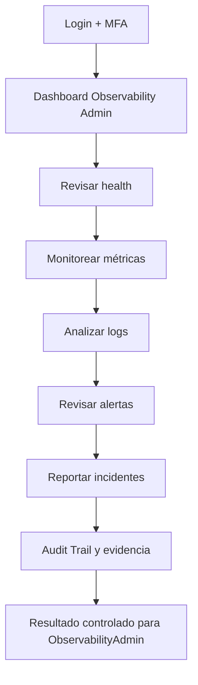
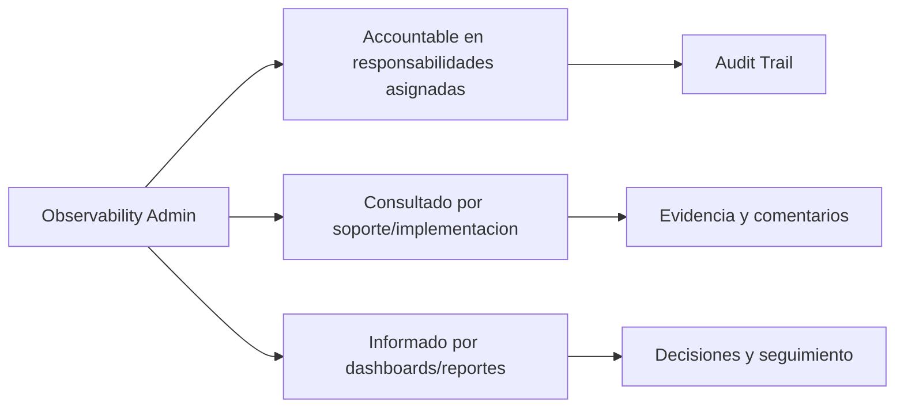

# Compliance 360 Academy

## Observability Admin Certification

## Portada

| Campo | Valor |
| --- | --- |
| Rol | Observability Admin |
| Nivel | Expert / Operations |
| Duración | 20 horas |
| Objetivo | Formar administradores de observabilidad, health checks, métricas, logs y alertas. |
| Prerrequisitos | Conocer monitoreo, SRE, logs, métricas, trazas y operación de incidentes. |
| Ruta de aprendizaje | Fundamentos -> Seguridad -> Módulos -> Operación -> Escenarios -> Evaluación -> Certificación |
| Certificación asociada | Compliance 360 Certified Architect |
| Estado | Markdown maestro. No generar Word hasta aprobación. |

---

# CAPÍTULO 1 - Introducción al Rol

## ¿Quién es?

El `Observability Admin` es un perfil formal de Compliance 360 Academy. Su entrenamiento está diseñado para que pueda usar la plataforma sin revisar código fuente, entendiendo módulos, permisos, responsabilidades, riesgos y límites reales del producto.

## ¿Qué responsabilidades tiene?

| Responsabilidad | Dueño | Prioridad | Evidencia esperada |
| --- | --- | --- | --- |
| Monitorear health | Observability Admin | Alta | Evidencia en Audit Trail / reporte / registro |
| Investigar errores | Observability Admin | Alta | Evidencia en Audit Trail / reporte / registro |
| Analizar latencia | Observability Admin | Alta | Evidencia en Audit Trail / reporte / registro |
| Gestionar alertas | Observability Admin | Alta | Evidencia en Audit Trail / reporte / registro |
| Guiar soporte | Observability Admin | Alta | Evidencia en Audit Trail / reporte / registro |

## ¿Qué puede hacer?

- Monitorear health
- Investigar errores
- Analizar latencia
- Gestionar alertas
- Guiar soporte

## ¿Qué no puede hacer?

- Modificar datos de negocio
- Ignorar incidentes críticos
- Desactivar alertas sin cambio aprobado
- Exponer logs sensibles

## Flujo operativo del rol

## Matriz de responsabilidades

| Responsabilidad | Dueño | Prioridad | Evidencia esperada |
| --- | --- | --- | --- |
| Monitorear health | Observability Admin | Alta | Evidencia en Audit Trail / reporte / registro |
| Investigar errores | Observability Admin | Alta | Evidencia en Audit Trail / reporte / registro |
| Analizar latencia | Observability Admin | Alta | Evidencia en Audit Trail / reporte / registro |
| Gestionar alertas | Observability Admin | Alta | Evidencia en Audit Trail / reporte / registro |
| Guiar soporte | Observability Admin | Alta | Evidencia en Audit Trail / reporte / registro |

## Matriz RACI

| Proceso | Observability Admin | Tenant Admin | Quality Manager | Support Engineer | Consultora Admin |
| --- | --- | --- | --- | --- | --- |
| Revisar /health | R/A | I | I | C | C |
| Analizar metrics | R/A | I | I | C | C |
| Investigar correlation id | R/A | I | I | C | C |
| Revisar provider health | R/A | I | I | C | C |
| Generar RCA | R/A | I | I | C | C |
| Validar readiness | R/A | I | I | C | C |

---

# CAPÍTULO 2 - Módulos que utiliza

## Módulos asignados al rol

| Módulo | Para qué sirve | Cuándo lo usa |
| --- | --- | --- |
| Observability | Sirve para observability | Se usa cuando el rol necesita operar o consultar esta capacidad |
| Security Hardening | Sirve para security hardening | Se usa cuando el rol necesita operar o consultar esta capacidad |
| Notifications | Sirve para notifications | Se usa cuando el rol necesita operar o consultar esta capacidad |
| Storage | Sirve para storage | Se usa cuando el rol necesita operar o consultar esta capacidad |
| CI/CD | Sirve para ci/cd | Se usa cuando el rol necesita operar o consultar esta capacidad |
| Audit Trail | Sirve para audit trail | Se usa cuando el rol necesita operar o consultar esta capacidad |
| Reporting Engine | Sirve para reporting engine | Se usa cuando el rol necesita operar o consultar esta capacidad |

## Matriz de módulos

| Módulo | Tipo de uso | Frecuencia | Nota de estado |
| --- | --- | --- | --- |
| Observability | Uso principal | Diario/Semanal | Ver estado real en Handbook |
| Security Hardening | Uso principal | Diario/Semanal | Ver estado real en Handbook |
| Notifications | Uso principal | Diario/Semanal | Ver estado real en Handbook |
| Storage | Uso principal | Diario/Semanal | Ver estado real en Handbook |
| CI/CD | Uso principal | Diario/Semanal | Ver estado real en Handbook |
| Audit Trail | Uso complementario | Según evento | Ver estado real en Handbook |
| Reporting Engine | Uso complementario | Según evento | Ver estado real en Handbook |

## Diagrama de responsabilidades

---

# CAPÍTULO 3 - Configuración Inicial

## Objetivo

Preparar el acceso y el entorno de trabajo del rol `Observability Admin` para operar sin fricción.

## Paso a paso

1. Crear o validar usuario en el tenant correcto.
2. Asignar rol y permisos correspondientes.
3. Activar MFA si el tenant lo requiere.
4. Validar acceso a dashboard.
5. Validar acceso a módulos asignados.
6. Probar operación mínima permitida.
7. Confirmar que Audit Trail registra eventos clave.
8. Documentar restricciones del rol.

## Pantalla por pantalla

| Pantalla | Acción esperada | Resultado |
| --- | --- | --- |
| Login | Ingresar credenciales y completar MFA si aplica | Sesión activa |
| Dashboard | Revisar indicadores y alertas | Prioridades visibles |
| Módulos asignados | Validar acceso según matriz | Acceso autorizado |
| Reportes | Consultar datos según permiso | Reporte visible |
| Audit Trail | Confirmar trazabilidad si aplica | Evento registrado |

## Proceso por proceso

Cada proceso debe ejecutarse con tenant, permiso y evidencia correctos. Si aparece `401`, el usuario debe renovar sesión. Si aparece `403`, debe solicitar ajuste de rol, no intentar rodear el control.

---

# CAPÍTULO 4 - Operación Diaria

## ¿Qué hace al iniciar sesión?

| Tarea | Frecuencia | Resultado esperado |
| --- | --- | --- |
| Revisar health | Diario | Validar resultado en dashboard/audit trail |
| Monitorear métricas | Diario | Validar resultado en dashboard/audit trail |
| Analizar logs | Diario | Validar resultado en dashboard/audit trail |
| Revisar alertas | Diario | Validar resultado en dashboard/audit trail |
| Reportar incidentes | Diario | Validar resultado en dashboard/audit trail |

## ¿Qué revisa?

- Estado general del dashboard.
- Tareas asignadas.
- Alertas relacionadas con sus módulos.
- Reportes o indicadores relevantes.
- Evidencia pendiente o procesos vencidos.

## ¿Qué tareas ejecuta?

- Revisar health
- Monitorear métricas
- Analizar logs
- Revisar alertas
- Reportar incidentes

## ¿Qué indicadores debe monitorear?

| Indicador | Uso | Acción esperada |
| --- | --- | --- |
| Error rate | Monitorear tendencia | Escalar desviaciones |
| Latency p95 | Monitorear tendencia | Escalar desviaciones |
| Health status | Monitorear tendencia | Escalar desviaciones |
| Dead letters | Monitorear tendencia | Escalar desviaciones |
| Failed auth | Monitorear tendencia | Escalar desviaciones |

---

# CAPÍTULO 5 - Procesos Paso a Paso

Los procesos de este capítulo reemplazan la versión genérica anterior. Cada flujo incluye pantalla, decisión, resultado esperado y evidencia.

## 5.1 Investigar error 500 con correlation id

**Objetivo:** Trazar un error intermitente desde reporte de usuario hasta causa probable.

**Pantallas / áreas usadas:** Observability; Logs; Audit Trail; API Health

**Prerrequisitos específicos:**

- Correlation id reportado
- Acceso Observability.Read

**Paso a paso operativo:**

1. Recibir ticket con hora, tenant y endpoint.
2. Abrir Observability → traces/logs.
3. Buscar correlation id.
4. Identificar endpoint y status 500.
5. Revisar spans relacionados: DB, provider o aplicación.
6. Comparar con métricas de error rate.
7. Validar si afecta un tenant o todos.
8. Documentar hipótesis.
9. Escalar a ingeniería con evidencia.
10. Registrar RCA preliminar.

**Decisiones clave:**

- **Un tenant:** investigar datos/configuración tenant.
- **Todos los tenants:** tratar como incidente plataforma.

**Resultado esperado:**

- Incidente clasificado y evidenciado

**Evidencias requeridas:**

- Correlation id
- Trace
- Métricas
- RCA

**Errores comunes a evitar:**

- Escalar sin evidence
- Ignorar tenant
- Confundir 500 con 403

**Validación de cierre:** el `Observability Admin` debe poder explicar qué cambió, quién aprobó, qué evidencia quedó, qué riesgo se redujo y dónde se consulta la trazabilidad.

## 5.2 Analizar latencia alta

**Objetivo:** Identificar causa de p95 elevado.

**Pantallas / áreas usadas:** Metrics; Performance Dashboard

**Prerrequisitos específicos:**

- Métrica latency disponible

**Paso a paso operativo:**

1. Abrir dashboard performance.
2. Filtrar ventana de tiempo.
3. Comparar p50/p95/p99.
4. Identificar endpoint lento.
5. Cruzar con DB health.
6. Cruzar con provider health.
7. Revisar volumen de requests.
8. Determinar degradación o pico normal.
9. Crear alerta si supera umbral.
10. Emitir reporte.

**Decisiones clave:**

- **DB lenta:** escalar infraestructura.
- **Provider lento:** activar failover o degradación controlada.

**Resultado esperado:**

- Causa probable de latencia documentada

**Evidencias requeridas:**

- Gráfica
- Endpoint
- Periodo

**Errores comunes a evitar:**

- Mirar solo promedio
- No segmentar endpoint
- No revisar providers

**Validación de cierre:** el `Observability Admin` debe poder explicar qué cambió, quién aprobó, qué evidencia quedó, qué riesgo se redujo y dónde se consulta la trazabilidad.

## 5.3 Validar health checks productivos

**Objetivo:** Determinar readiness real de la aplicación.

**Pantallas / áreas usadas:** /health; /health/live; /health/ready; /metrics

**Prerrequisitos específicos:**

- Acceso endpoints
- Ambiente definido

**Paso a paso operativo:**

1. Consultar /health/live.
2. Consultar /health/ready.
3. Revisar DB, storage, notifications.
4. Comparar con métricas Prometheus.
5. Identificar componente degraded.
6. Validar impacto usuario.
7. Registrar estado.
8. Notificar soporte.
9. Definir acción correctiva.
10. Confirmar recuperación.

**Decisiones clave:**

- **live OK ready fail:** aplicación vive pero no lista.
- **storage fail:** validar impacto evidencias.

**Resultado esperado:**

- Health clasificado y accionado

**Evidencias requeridas:**

- Health response
- Métrica
- Ticket

**Errores comunes a evitar:**

- Usar solo /health
- Ignorar readiness
- No notificar impacto

**Validación de cierre:** el `Observability Admin` debe poder explicar qué cambió, quién aprobó, qué evidencia quedó, qué riesgo se redujo y dónde se consulta la trazabilidad.

## 5.4 Emitir RCA de incidente

**Objetivo:** Documentar causa raíz y acciones preventivas.

**Pantallas / áreas usadas:** Incident Report; Observability; Audit Trail

**Prerrequisitos específicos:**

- Incidente cerrado o mitigado

**Paso a paso operativo:**

1. Recolectar línea de tiempo.
2. Listar síntomas.
3. Identificar impacto por tenant.
4. Analizar logs/traces/metrics.
5. Determinar causa raíz.
6. Definir acciones correctivas.
7. Definir acciones preventivas.
8. Asignar dueños.
9. Publicar RCA.
10. Registrar seguimiento.

**Decisiones clave:**

- **Causa desconocida:** documentar hipótesis y plan de instrumentación.
- **Reincidencia:** crear acción preventiva.

**Resultado esperado:**

- RCA claro y accionable

**Evidencias requeridas:**

- Timeline
- Métricas
- Acciones

**Errores comunes a evitar:**

- Culpar sin evidencia
- No definir dueños
- No prevenir recurrencia

**Validación de cierre:** el `Observability Admin` debe poder explicar qué cambió, quién aprobó, qué evidencia quedó, qué riesgo se redujo y dónde se consulta la trazabilidad.

---

# CAPÍTULO 6 - Escenarios Reales

Todos los escenarios fueron reemplazados por casos empresariales con datos, decisiones y consecuencias.

## 6.1 Escenario: Error 500 intermitente

**Contexto real:** Usuarios reportan error 500 al generar reportes entre 10:00 y 10:20.

**Datos iniciales:**

- Endpoint /reports/export
- Tenant A afectado
- Correlation IDs: 8

**Decisiones que debe tomar el `Observability Admin`:**

- **Alcance:** Determinar si es tenant o plataforma.
- **Escalación:** Enviar traces a ingeniería.

**Acciones esperadas:**

1. Buscar traces.
2. Cruzar con DB.
3. Revisar logs.
4. Emitir RCA preliminar.

**Resultado esperado:** Causa probable y evidencia listas.

**Consecuencias si se ejecuta mal:**

- Incidente sin diagnóstico
- Downtime prolongado

**Criterios de evaluación:** el caso se aprueba si el estudiante identifica el módulo correcto, aplica permisos adecuados, documenta evidencia, toma decisiones justificadas y deja trazabilidad auditable.

## 6.2 Escenario: Latencia alta

**Contexto real:** p95 sube a 4.8s en CAPA dashboard.

**Datos iniciales:**

- p50 700ms
- p95 4.8s
- DB CPU 88%

**Decisiones que debe tomar el `Observability Admin`:**

- **Causa:** DB probable.
- **Mitigación:** Reducir carga/reportar.

**Acciones esperadas:**

1. Revisar métricas.
2. Comparar endpoints.
3. Escalar DB.
4. Monitorear recuperación.

**Resultado esperado:** Latencia reducida o mitigada.

**Consecuencias si se ejecuta mal:**

- Usuarios abandonan
- SLA incumplido

**Criterios de evaluación:** el caso se aprueba si el estudiante identifica el módulo correcto, aplica permisos adecuados, documenta evidencia, toma decisiones justificadas y deja trazabilidad auditable.

## 6.3 Escenario: Falla de Health Check

**Contexto real:** /health/ready falla por storage.

**Datos iniciales:**

- live OK
- ready FAIL
- Storage timeout

**Decisiones que debe tomar el `Observability Admin`:**

- **Readiness:** No desplegar/retirar tráfico.
- **Impacto:** Subida de evidencias afectada.

**Acciones esperadas:**

1. Consultar health.
2. Validar storage.
3. Activar failover.
4. Reportar.

**Resultado esperado:** Readiness recuperado.

**Consecuencias si se ejecuta mal:**

- Despliegue incorrecto
- Carga de archivos fallida

**Criterios de evaluación:** el caso se aprueba si el estudiante identifica el módulo correcto, aplica permisos adecuados, documenta evidencia, toma decisiones justificadas y deja trazabilidad auditable.

## 6.4 Escenario: Correlation ID tracing

**Contexto real:** Soporte entrega correlation id de error MFA.

**Datos iniciales:**

- Correlation c360-abc
- Auth endpoint
- Usuario admin

**Decisiones que debe tomar el `Observability Admin`:**

- **Privacidad:** No exponer secretos.
- **Diagnóstico:** Seguir trace completo.

**Acciones esperadas:**

1. Buscar trace.
2. Identificar span.
3. Revisar error.
4. Documentar acción.

**Resultado esperado:** Error MFA diagnosticado.

**Consecuencias si se ejecuta mal:**

- Datos sensibles expuestos
- Caso sin resolución

**Criterios de evaluación:** el caso se aprueba si el estudiante identifica el módulo correcto, aplica permisos adecuados, documenta evidencia, toma decisiones justificadas y deja trazabilidad auditable.

## 6.5 Escenario: Incidente productivo

**Contexto real:** Notifications y storage fallan simultáneamente.

**Datos iniciales:**

- 2 providers degraded
- CAPA alerts detenidas
- Uploads fallidos

**Decisiones que debe tomar el `Observability Admin`:**

- **Severidad:** Declarar incidente alto.
- **Comunicación:** Informar soporte/negocio.

**Acciones esperadas:**

1. Activar war room.
2. Revisar health.
3. Mitigar providers.
4. Emitir updates.

**Resultado esperado:** Incidente mitigado y comunicado.

**Consecuencias si se ejecuta mal:**

- SLA roto
- Clientes sin información

**Criterios de evaluación:** el caso se aprueba si el estudiante identifica el módulo correcto, aplica permisos adecuados, documenta evidencia, toma decisiones justificadas y deja trazabilidad auditable.

## 6.6 Escenario: Root Cause Analysis

**Contexto real:** Incidente de reportes lentos se repite semanalmente.

**Datos iniciales:**

- Patrón lunes
- Export grande
- DB locks

**Decisiones que debe tomar el `Observability Admin`:**

- **RCA:** Debe identificar recurrencia.
- **Prevención:** Acción permanente.

**Acciones esperadas:**

1. Analizar historial.
2. Determinar causa.
3. Crear acciones.
4. Publicar RCA.

**Resultado esperado:** RCA con acciones preventivas.

**Consecuencias si se ejecuta mal:**

- Reincidencia
- Pérdida confianza

**Criterios de evaluación:** el caso se aprueba si el estudiante identifica el módulo correcto, aplica permisos adecuados, documenta evidencia, toma decisiones justificadas y deja trazabilidad auditable.

## 6.7 Escenario: MFA failures altos

**Contexto real:** Fallas MFA suben 300% tras cambio horario.

**Datos iniciales:**

- Usuarios LATAM
- TOTP skew
- MFA failures

**Decisiones que debe tomar el `Observability Admin`:**

- **Seguridad:** No desactivar MFA masivamente.
- **Soporte:** Guiar sincronización.

**Acciones esperadas:**

1. Revisar métricas.
2. Confirmar causa.
3. Emitir guía.
4. Monitorear.

**Resultado esperado:** Fallas reducidas sin bajar seguridad.

**Consecuencias si se ejecuta mal:**

- Acceso inseguro
- Bloqueo masivo

**Criterios de evaluación:** el caso se aprueba si el estudiante identifica el módulo correcto, aplica permisos adecuados, documenta evidencia, toma decisiones justificadas y deja trazabilidad auditable.

## 6.8 Escenario: Dead letters y error rate

**Contexto real:** DLQ crece y API notification tiene 5xx.

**Datos iniciales:**

- DLQ 500
- 5xx 12%
- Provider timeout

**Decisiones que debe tomar el `Observability Admin`:**

- **Causa:** Provider puede estar degradado.
- **Mitigación:** Failover.

**Acciones esperadas:**

1. Cruzar métricas.
2. Validar provider.
3. Activar failover.
4. Reintentar lote.

**Resultado esperado:** Mensajes críticos recuperados.

**Consecuencias si se ejecuta mal:**

- Alertas perdidas
- Reintentos inútiles

**Criterios de evaluación:** el caso se aprueba si el estudiante identifica el módulo correcto, aplica permisos adecuados, documenta evidencia, toma decisiones justificadas y deja trazabilidad auditable.

## 6.9 Escenario: Deploy con readiness fail

**Contexto real:** Pipeline desplegó pero readiness falla.

**Datos iniciales:**

- Build OK
- Ready FAIL DB
- Migración pendiente

**Decisiones que debe tomar el `Observability Admin`:**

- **Rollback:** Evaluar rollback.
- **Migración:** Validar estado DB.

**Acciones esperadas:**

1. Revisar health.
2. Revisar migración.
3. Decidir rollback.
4. Comunicar.

**Resultado esperado:** Servicio estable o rollback ejecutado.

**Consecuencias si se ejecuta mal:**

- Producción degradada
- Datos inconsistentes

**Criterios de evaluación:** el caso se aprueba si el estudiante identifica el módulo correcto, aplica permisos adecuados, documenta evidencia, toma decisiones justificadas y deja trazabilidad auditable.

## 6.10 Escenario: Tenant con errores aislados

**Contexto real:** Solo un tenant falla al cargar documentos.

**Datos iniciales:**

- Tenant B
- Storage config propia
- Otros OK

**Decisiones que debe tomar el `Observability Admin`:**

- **Aislamiento:** Investigar provider tenant.
- **Impacto:** No declarar caída global.

**Acciones esperadas:**

1. Filtrar por tenant.
2. Revisar provider.
3. Probar conexión.
4. Escalar admin.

**Resultado esperado:** Falla aislada resuelta.

**Consecuencias si se ejecuta mal:**

- Comunicación errónea
- Tiempo perdido

**Criterios de evaluación:** el caso se aprueba si el estudiante identifica el módulo correcto, aplica permisos adecuados, documenta evidencia, toma decisiones justificadas y deja trazabilidad auditable.

---

# CAPÍTULO 7 - Mejores Prácticas

## ISO 9001

- Mantener evidencia trazable de cambios, aprobaciones y cierres.
- Usar roles claros para evitar conflictos de interés.
- Medir desempeño con indicadores y revisar tendencias.
- Gestionar no conformidades mediante CAPA con causa raíz y efectividad.

## ISO 22000, HACCP y BPM

- Controlar documentos de inocuidad y BPM como documentos vigentes.
- Vincular proveedores críticos con certificaciones y evaluaciones.
- Registrar riesgos de inocuidad con controles y tratamiento.
- Mantener evidencias de acciones preventivas y correctivas.

## Buenas prácticas SaaS

- No compartir usuarios.
- Activar MFA para roles sensibles.
- Usar permisos mínimos necesarios.
- Validar providers de email/storage antes de producción.
- Escalar errores técnicos con evidencia, hora, tenant y correlation id.

---

# CAPÍTULO 8 - Errores Comunes

| Error | Consecuencia | Prevención |
| --- | --- | --- |
| Operar en tenant incorrecto | Riesgo de privacidad y datos cruzados | Confirmar tenant al iniciar |
| Usar rol con permisos excesivos | Falta de segregación | Revisar matriz RBAC |
| Cerrar sin evidencia | Debilidad ante auditoría | Adjuntar evidencia antes de cierre |
| Ignorar módulos en estado workspace | Promesa comercial incorrecta | Aplicar regla de honestidad |
| No revisar Audit Trail | Falta de trazabilidad | Validar eventos clave |
| No probar providers | Fallas de email/storage en producción | Ejecutar tests de conexión |
| Compartir credenciales | Riesgo de seguridad | Usuario individual por persona |
| Omitir MFA | Mayor exposición de acceso | Activar MFA en roles críticos |
| No documentar decisiones | Soporte y auditoría débiles | Registrar comentarios |
| No escalar a tiempo | SLA incumplido | Clasificar severidad |

---

# CAPÍTULO 9 - Checklist Operativo

## Checklist diario

- Confirmar acceso y tenant correcto.
- Revisar dashboard y tareas asignadas.
- Revisar alertas de módulos asignados.
- Ejecutar procesos prioritarios.
- Escalar bloqueos con evidencia.

## Checklist semanal

- Revisar reportes relevantes.
- Revisar tareas vencidas.
- Validar indicadores del rol.
- Confirmar que los procesos críticos tienen responsables.
- Revisar errores recurrentes.

## Checklist mensual

- Preparar comité o revisión ejecutiva.
- Auditar permisos del rol si aplica.
- Revisar tendencias y desviaciones.
- Confirmar cierre de procesos críticos.
- Documentar oportunidades de mejora.

## Checklist trimestral

- Revisar matriz de responsabilidades.
- Validar capacitación de usuarios.
- Revisar efectividad de controles.
- Actualizar procesos según cambios normativos.
- Preparar evidencia para auditorías.

---

# CAPÍTULO 10 - Evaluación Teórica

**Formato del examen:** 50 preguntas situacionales, 2 puntos por pregunta, 100 puntos totales.

**Regla de certificación:** las preguntas mezclan contexto, datos, problema, decisión y consecuencia. Las opciones incorrectas son plausibles y requieren criterio profesional.

## Pregunta 1

**Contexto:** Usuarios reportan 500 en exportación de reportes. Enfoque: Acción inmediata.

**Datos del sistema/caso:**

- Endpoint: /reports/export
- Hora: 10:00-10:20
- Correlation IDs: 8

**Problema:** El rol `Observability Admin` debe resolver `Error 500 intermitente` sin romper segregación, evidencia ni trazabilidad.

**Decisión requerida:** ¿Cuál es la primera acción correcta?

**Consecuencia de una mala decisión:** Si se elige mal, el proceso puede avanzar sin control.

A. Reiniciar aplicación sin investigar.
B. Buscar traces por correlation id y determinar si afecta tenant o plataforma.
C. Cerrar ticket porque es intermitente.
D. Perder evidencia

**Respuesta correcta:** B

**Explicación:** La opción B es correcta porque aborda `Error 500 intermitente` con control verificable, decisión justificada y evidencia auditable. Las demás opciones son plausibles, pero dejan una brecha de cumplimiento, operación o certificación.

## Pregunta 2

**Contexto:** Usuarios reportan 500 en exportación de reportes. Enfoque: Decisión de aprobación.

**Datos del sistema/caso:**

- Endpoint: /reports/export
- Hora: 10:00-10:20
- Correlation IDs: 8

**Problema:** El rol `Observability Admin` debe resolver `Error 500 intermitente` sin romper segregación, evidencia ni trazabilidad.

**Decisión requerida:** ¿Qué decisión protege mejor la trazabilidad y el cumplimiento?

**Consecuencia de una mala decisión:** Una aprobación débil genera evidencia no defendible.

A. Cerrar ticket porque es intermitente.
B. Pedir al usuario intentar después.
C. Incidente repetido
D. Cruzar spans con DB/provider y error rate.

**Respuesta correcta:** D

**Explicación:** La opción D es correcta porque aborda `Error 500 intermitente` con control verificable, decisión justificada y evidencia auditable. Las demás opciones son plausibles, pero dejan una brecha de cumplimiento, operación o certificación.

## Pregunta 3

**Contexto:** Usuarios reportan 500 en exportación de reportes. Enfoque: Evidencia.

**Datos del sistema/caso:**

- Endpoint: /reports/export
- Hora: 10:00-10:20
- Correlation IDs: 8

**Problema:** El rol `Observability Admin` debe resolver `Error 500 intermitente` sin romper segregación, evidencia ni trazabilidad.

**Decisión requerida:** ¿Qué evidencia mínima debe exigirse antes de cerrar o avanzar?

**Consecuencia de una mala decisión:** Sin evidencia objetiva no hay certificación defendible.

A. Escalar con evidencia técnica y timeline.
B. Pedir al usuario intentar después.
C. Cambiar permisos del usuario.
D. Diagnóstico incorrecto.

**Respuesta correcta:** A

**Explicación:** La opción A es correcta porque aborda `Error 500 intermitente` con control verificable, decisión justificada y evidencia auditable. Las demás opciones son plausibles, pero dejan una brecha de cumplimiento, operación o certificación.

## Pregunta 4

**Contexto:** Usuarios reportan 500 en exportación de reportes. Enfoque: Escalación.

**Datos del sistema/caso:**

- Endpoint: /reports/export
- Hora: 10:00-10:20
- Correlation IDs: 8

**Problema:** El rol `Observability Admin` debe resolver `Error 500 intermitente` sin romper segregación, evidencia ni trazabilidad.

**Decisión requerida:** ¿Cuándo debe escalarse el caso y a quién?

**Consecuencia de una mala decisión:** Escalar tarde puede producir incumplimiento, pérdida de SLA o riesgo contractual.

A. Cambiar permisos del usuario.
B. Reiniciar aplicación sin investigar.
C. Clasificar severidad por impacto.
D. Perder evidencia

**Respuesta correcta:** C

**Explicación:** La opción C es correcta porque aborda `Error 500 intermitente` con control verificable, decisión justificada y evidencia auditable. Las demás opciones son plausibles, pero dejan una brecha de cumplimiento, operación o certificación.

## Pregunta 5

**Contexto:** Usuarios reportan 500 en exportación de reportes. Enfoque: Prevención.

**Datos del sistema/caso:**

- Endpoint: /reports/export
- Hora: 10:00-10:20
- Correlation IDs: 8

**Problema:** El rol `Observability Admin` debe resolver `Error 500 intermitente` sin romper segregación, evidencia ni trazabilidad.

**Decisión requerida:** ¿Qué control evita la recurrencia del problema?

**Consecuencia de una mala decisión:** Resolver solo el síntoma deja el sistema expuesto a repetición.

A. Reiniciar aplicación sin investigar.
B. Registrar RCA preliminar.
C. Cerrar ticket porque es intermitente.
D. Incidente repetido

**Respuesta correcta:** B

**Explicación:** La opción B es correcta porque aborda `Error 500 intermitente` con control verificable, decisión justificada y evidencia auditable. Las demás opciones son plausibles, pero dejan una brecha de cumplimiento, operación o certificación.

## Pregunta 6

**Contexto:** Dashboard CAPA muestra p95 4.8s y p99 9s. Enfoque: Acción inmediata.

**Datos del sistema/caso:**

- p50: 700ms
- p95: 4.8s
- p99: 9s
- DB CPU: 88%

**Problema:** El rol `Observability Admin` debe resolver `Latencia p95 alta` sin romper segregación, evidencia ni trazabilidad.

**Decisión requerida:** ¿Cuál es la primera acción correcta?

**Consecuencia de una mala decisión:** Si se elige mal, el proceso puede avanzar sin control.

A. Usar solo p50 para decir que está bien.
B. Aumentar timeout del frontend.
C. SLA incumplido
D. Analizar percentiles, endpoint y DB antes de concluir.

**Respuesta correcta:** D

**Explicación:** La opción D es correcta porque aborda `Latencia p95 alta` con control verificable, decisión justificada y evidencia auditable. Las demás opciones son plausibles, pero dejan una brecha de cumplimiento, operación o certificación.

## Pregunta 7

**Contexto:** Dashboard CAPA muestra p95 4.8s y p99 9s. Enfoque: Decisión de aprobación.

**Datos del sistema/caso:**

- p50: 700ms
- p95: 4.8s
- p99: 9s
- DB CPU: 88%

**Problema:** El rol `Observability Admin` debe resolver `Latencia p95 alta` sin romper segregación, evidencia ni trazabilidad.

**Decisión requerida:** ¿Qué decisión protege mejor la trazabilidad y el cumplimiento?

**Consecuencia de una mala decisión:** Una aprobación débil genera evidencia no defendible.

A. Distinguir promedio aceptable de cola lenta.
B. Aumentar timeout del frontend.
C. Cerrar por no afectar todos.
D. Mala priorización

**Respuesta correcta:** A

**Explicación:** La opción A es correcta porque aborda `Latencia p95 alta` con control verificable, decisión justificada y evidencia auditable. Las demás opciones son plausibles, pero dejan una brecha de cumplimiento, operación o certificación.

## Pregunta 8

**Contexto:** Dashboard CAPA muestra p95 4.8s y p99 9s. Enfoque: Evidencia.

**Datos del sistema/caso:**

- p50: 700ms
- p95: 4.8s
- p99: 9s
- DB CPU: 88%

**Problema:** El rol `Observability Admin` debe resolver `Latencia p95 alta` sin romper segregación, evidencia ni trazabilidad.

**Decisión requerida:** ¿Qué evidencia mínima debe exigirse antes de cerrar o avanzar?

**Consecuencia de una mala decisión:** Sin evidencia objetiva no hay certificación defendible.

A. Cerrar por no afectar todos.
B. Reiniciar provider email.
C. Correlacionar con volumen y locks.
D. Causa no resuelta.

**Respuesta correcta:** C

**Explicación:** La opción C es correcta porque aborda `Latencia p95 alta` con control verificable, decisión justificada y evidencia auditable. Las demás opciones son plausibles, pero dejan una brecha de cumplimiento, operación o certificación.

## Pregunta 9

**Contexto:** Dashboard CAPA muestra p95 4.8s y p99 9s. Enfoque: Escalación.

**Datos del sistema/caso:**

- p50: 700ms
- p95: 4.8s
- p99: 9s
- DB CPU: 88%

**Problema:** El rol `Observability Admin` debe resolver `Latencia p95 alta` sin romper segregación, evidencia ni trazabilidad.

**Decisión requerida:** ¿Cuándo debe escalarse el caso y a quién?

**Consecuencia de una mala decisión:** Escalar tarde puede producir incumplimiento, pérdida de SLA o riesgo contractual.

A. Reiniciar provider email.
B. Escalar infraestructura si DB es cuello.
C. Usar solo p50 para decir que está bien.
D. SLA incumplido

**Respuesta correcta:** B

**Explicación:** La opción B es correcta porque aborda `Latencia p95 alta` con control verificable, decisión justificada y evidencia auditable. Las demás opciones son plausibles, pero dejan una brecha de cumplimiento, operación o certificación.

## Pregunta 10

**Contexto:** Dashboard CAPA muestra p95 4.8s y p99 9s. Enfoque: Prevención.

**Datos del sistema/caso:**

- p50: 700ms
- p95: 4.8s
- p99: 9s
- DB CPU: 88%

**Problema:** El rol `Observability Admin` debe resolver `Latencia p95 alta` sin romper segregación, evidencia ni trazabilidad.

**Decisión requerida:** ¿Qué control evita la recurrencia del problema?

**Consecuencia de una mala decisión:** Resolver solo el síntoma deja el sistema expuesto a repetición.

A. Usar solo p50 para decir que está bien.
B. Crear alerta por umbral p95/p99.
C. Aumentar timeout del frontend.
D. Mala priorización

**Respuesta correcta:** B

**Explicación:** La opción B es correcta porque aborda `Latencia p95 alta` con control verificable, decisión justificada y evidencia auditable. Las demás opciones son plausibles, pero dejan una brecha de cumplimiento, operación o certificación.

## Pregunta 11

**Contexto:** /health/live OK pero /health/ready falla por storage. Enfoque: Acción inmediata.

**Datos del sistema/caso:**

- live: OK
- ready: FAIL
- dependency: storage

**Problema:** El rol `Observability Admin` debe resolver `Health readiness fail` sin romper segregación, evidencia ni trazabilidad.

**Decisión requerida:** ¿Cuál es la primera acción correcta?

**Consecuencia de una mala decisión:** Si se elige mal, el proceso puede avanzar sin control.

A. Tratar app como viva pero no lista para tráfico completo.
B. Ignorar porque live está OK.
C. Declarar caída total sin analizar.
D. Go-live inseguro

**Respuesta correcta:** A

**Explicación:** La opción A es correcta porque aborda `Health readiness fail` con control verificable, decisión justificada y evidencia auditable. Las demás opciones son plausibles, pero dejan una brecha de cumplimiento, operación o certificación.

## Pregunta 12

**Contexto:** /health/live OK pero /health/ready falla por storage. Enfoque: Decisión de aprobación.

**Datos del sistema/caso:**

- live: OK
- ready: FAIL
- dependency: storage

**Problema:** El rol `Observability Admin` debe resolver `Health readiness fail` sin romper segregación, evidencia ni trazabilidad.

**Decisión requerida:** ¿Qué decisión protege mejor la trazabilidad y el cumplimiento?

**Consecuencia de una mala decisión:** Una aprobación débil genera evidencia no defendible.

A. Declarar caída total sin analizar.
B. Desactivar storage health.
C. Validar impacto en carga/descarga de evidencias.
D. Uploads fallidos

**Respuesta correcta:** C

**Explicación:** La opción C es correcta porque aborda `Health readiness fail` con control verificable, decisión justificada y evidencia auditable. Las demás opciones son plausibles, pero dejan una brecha de cumplimiento, operación o certificación.

## Pregunta 13

**Contexto:** /health/live OK pero /health/ready falla por storage. Enfoque: Evidencia.

**Datos del sistema/caso:**

- live: OK
- ready: FAIL
- dependency: storage

**Problema:** El rol `Observability Admin` debe resolver `Health readiness fail` sin romper segregación, evidencia ni trazabilidad.

**Decisión requerida:** ¿Qué evidencia mínima debe exigirse antes de cerrar o avanzar?

**Consecuencia de una mala decisión:** Sin evidencia objetiva no hay certificación defendible.

A. Desactivar storage health.
B. Activar failover o retirar tráfico según criticidad.
C. Continuar despliegue productivo.
D. Falsa disponibilidad.

**Respuesta correcta:** B

**Explicación:** La opción B es correcta porque aborda `Health readiness fail` con control verificable, decisión justificada y evidencia auditable. Las demás opciones son plausibles, pero dejan una brecha de cumplimiento, operación o certificación.

## Pregunta 14

**Contexto:** /health/live OK pero /health/ready falla por storage. Enfoque: Escalación.

**Datos del sistema/caso:**

- live: OK
- ready: FAIL
- dependency: storage

**Problema:** El rol `Observability Admin` debe resolver `Health readiness fail` sin romper segregación, evidencia ni trazabilidad.

**Decisión requerida:** ¿Cuándo debe escalarse el caso y a quién?

**Consecuencia de una mala decisión:** Escalar tarde puede producir incumplimiento, pérdida de SLA o riesgo contractual.

A. Continuar despliegue productivo.
B. Notificar soporte y registrar incidente.
C. Ignorar porque live está OK.
D. Go-live inseguro

**Respuesta correcta:** B

**Explicación:** La opción B es correcta porque aborda `Health readiness fail` con control verificable, decisión justificada y evidencia auditable. Las demás opciones son plausibles, pero dejan una brecha de cumplimiento, operación o certificación.

## Pregunta 15

**Contexto:** /health/live OK pero /health/ready falla por storage. Enfoque: Prevención.

**Datos del sistema/caso:**

- live: OK
- ready: FAIL
- dependency: storage

**Problema:** El rol `Observability Admin` debe resolver `Health readiness fail` sin romper segregación, evidencia ni trazabilidad.

**Decisión requerida:** ¿Qué control evita la recurrencia del problema?

**Consecuencia de una mala decisión:** Resolver solo el síntoma deja el sistema expuesto a repetición.

A. Ignorar porque live está OK.
B. Declarar caída total sin analizar.
C. Uploads fallidos
D. Confirmar recuperación antes de go-live.

**Respuesta correcta:** D

**Explicación:** La opción D es correcta porque aborda `Health readiness fail` con control verificable, decisión justificada y evidencia auditable. Las demás opciones son plausibles, pero dejan una brecha de cumplimiento, operación o certificación.

## Pregunta 16

**Contexto:** Soporte entrega correlation id de fallo MFA. Enfoque: Acción inmediata.

**Datos del sistema/caso:**

- Correlation: c360-abc
- Endpoint: auth/mfa
- User: admin

**Problema:** El rol `Observability Admin` debe resolver `Correlation ID` sin romper segregación, evidencia ni trazabilidad.

**Decisión requerida:** ¿Cuál es la primera acción correcta?

**Consecuencia de una mala decisión:** Si se elige mal, el proceso puede avanzar sin control.

A. Pedir al usuario enviar código MFA.
B. Desactivar MFA del tenant.
C. Seguir trace sin exponer secretos y determinar causa MFA.
D. Exposición seguridad

**Respuesta correcta:** C

**Explicación:** La opción C es correcta porque aborda `Correlation ID` con control verificable, decisión justificada y evidencia auditable. Las demás opciones son plausibles, pero dejan una brecha de cumplimiento, operación o certificación.

## Pregunta 17

**Contexto:** Soporte entrega correlation id de fallo MFA. Enfoque: Decisión de aprobación.

**Datos del sistema/caso:**

- Correlation: c360-abc
- Endpoint: auth/mfa
- User: admin

**Problema:** El rol `Observability Admin` debe resolver `Correlation ID` sin romper segregación, evidencia ni trazabilidad.

**Decisión requerida:** ¿Qué decisión protege mejor la trazabilidad y el cumplimiento?

**Consecuencia de una mala decisión:** Una aprobación débil genera evidencia no defendible.

A. Desactivar MFA del tenant.
B. Revisar spans, status y tenant.
C. Buscar por email en logs sensibles.
D. Diagnóstico incompleto

**Respuesta correcta:** B

**Explicación:** La opción B es correcta porque aborda `Correlation ID` con control verificable, decisión justificada y evidencia auditable. Las demás opciones son plausibles, pero dejan una brecha de cumplimiento, operación o certificación.

## Pregunta 18

**Contexto:** Soporte entrega correlation id de fallo MFA. Enfoque: Evidencia.

**Datos del sistema/caso:**

- Correlation: c360-abc
- Endpoint: auth/mfa
- User: admin

**Problema:** El rol `Observability Admin` debe resolver `Correlation ID` sin romper segregación, evidencia ni trazabilidad.

**Decisión requerida:** ¿Qué evidencia mínima debe exigirse antes de cerrar o avanzar?

**Consecuencia de una mala decisión:** Sin evidencia objetiva no hay certificación defendible.

A. Buscar por email en logs sensibles.
B. Entregar diagnóstico reproducible a soporte.
C. Cerrar por usuario incorrecto.
D. MFA debilitado.

**Respuesta correcta:** B

**Explicación:** La opción B es correcta porque aborda `Correlation ID` con control verificable, decisión justificada y evidencia auditable. Las demás opciones son plausibles, pero dejan una brecha de cumplimiento, operación o certificación.

## Pregunta 19

**Contexto:** Soporte entrega correlation id de fallo MFA. Enfoque: Escalación.

**Datos del sistema/caso:**

- Correlation: c360-abc
- Endpoint: auth/mfa
- User: admin

**Problema:** El rol `Observability Admin` debe resolver `Correlation ID` sin romper segregación, evidencia ni trazabilidad.

**Decisión requerida:** ¿Cuándo debe escalarse el caso y a quién?

**Consecuencia de una mala decisión:** Escalar tarde puede producir incumplimiento, pérdida de SLA o riesgo contractual.

A. Cerrar por usuario incorrecto.
B. Pedir al usuario enviar código MFA.
C. Exposición seguridad
D. No registrar códigos MFA en texto.

**Respuesta correcta:** D

**Explicación:** La opción D es correcta porque aborda `Correlation ID` con control verificable, decisión justificada y evidencia auditable. Las demás opciones son plausibles, pero dejan una brecha de cumplimiento, operación o certificación.

## Pregunta 20

**Contexto:** Soporte entrega correlation id de fallo MFA. Enfoque: Prevención.

**Datos del sistema/caso:**

- Correlation: c360-abc
- Endpoint: auth/mfa
- User: admin

**Problema:** El rol `Observability Admin` debe resolver `Correlation ID` sin romper segregación, evidencia ni trazabilidad.

**Decisión requerida:** ¿Qué control evita la recurrencia del problema?

**Consecuencia de una mala decisión:** Resolver solo el síntoma deja el sistema expuesto a repetición.

A. Identificar si es skew horario o credencial.
B. Pedir al usuario enviar código MFA.
C. Desactivar MFA del tenant.
D. Diagnóstico incompleto

**Respuesta correcta:** A

**Explicación:** La opción A es correcta porque aborda `Correlation ID` con control verificable, decisión justificada y evidencia auditable. Las demás opciones son plausibles, pero dejan una brecha de cumplimiento, operación o certificación.

## Pregunta 21

**Contexto:** Incidente de reportes lentos se repite cada lunes. Enfoque: Acción inmediata.

**Datos del sistema/caso:**

- Patrón: lunes 09:00
- DB locks
- Exports grandes

**Problema:** El rol `Observability Admin` debe resolver `RCA` sin romper segregación, evidencia ni trazabilidad.

**Decisión requerida:** ¿Cuál es la primera acción correcta?

**Consecuencia de una mala decisión:** Si se elige mal, el proceso puede avanzar sin control.

A. Cerrar como pico normal.
B. Construir RCA con timeline, causa raíz, acciones y dueños.
C. Culpar al usuario por reportes grandes.
D. Reincidencia

**Respuesta correcta:** B

**Explicación:** La opción B es correcta porque aborda `RCA` con control verificable, decisión justificada y evidencia auditable. Las demás opciones son plausibles, pero dejan una brecha de cumplimiento, operación o certificación.

## Pregunta 22

**Contexto:** Incidente de reportes lentos se repite cada lunes. Enfoque: Decisión de aprobación.

**Datos del sistema/caso:**

- Patrón: lunes 09:00
- DB locks
- Exports grandes

**Problema:** El rol `Observability Admin` debe resolver `RCA` sin romper segregación, evidencia ni trazabilidad.

**Decisión requerida:** ¿Qué decisión protege mejor la trazabilidad y el cumplimiento?

**Consecuencia de una mala decisión:** Una aprobación débil genera evidencia no defendible.

A. Culpar al usuario por reportes grandes.
B. Diferenciar síntoma de causa raíz.
C. Aumentar CPU sin RCA.
D. Costo operativo

**Respuesta correcta:** B

**Explicación:** La opción B es correcta porque aborda `RCA` con control verificable, decisión justificada y evidencia auditable. Las demás opciones son plausibles, pero dejan una brecha de cumplimiento, operación o certificación.

## Pregunta 23

**Contexto:** Incidente de reportes lentos se repite cada lunes. Enfoque: Evidencia.

**Datos del sistema/caso:**

- Patrón: lunes 09:00
- DB locks
- Exports grandes

**Problema:** El rol `Observability Admin` debe resolver `RCA` sin romper segregación, evidencia ni trazabilidad.

**Decisión requerida:** ¿Qué evidencia mínima debe exigirse antes de cerrar o avanzar?

**Consecuencia de una mala decisión:** Sin evidencia objetiva no hay certificación defendible.

A. Aumentar CPU sin RCA.
B. Esperar próxima semana.
C. Pérdida confianza.
D. Agregar acción preventiva sobre exports/DB.

**Respuesta correcta:** D

**Explicación:** La opción D es correcta porque aborda `RCA` con control verificable, decisión justificada y evidencia auditable. Las demás opciones son plausibles, pero dejan una brecha de cumplimiento, operación o certificación.

## Pregunta 24

**Contexto:** Incidente de reportes lentos se repite cada lunes. Enfoque: Escalación.

**Datos del sistema/caso:**

- Patrón: lunes 09:00
- DB locks
- Exports grandes

**Problema:** El rol `Observability Admin` debe resolver `RCA` sin romper segregación, evidencia ni trazabilidad.

**Decisión requerida:** ¿Cuándo debe escalarse el caso y a quién?

**Consecuencia de una mala decisión:** Escalar tarde puede producir incumplimiento, pérdida de SLA o riesgo contractual.

A. Definir seguimiento medible.
B. Esperar próxima semana.
C. Cerrar como pico normal.
D. Reincidencia

**Respuesta correcta:** A

**Explicación:** La opción A es correcta porque aborda `RCA` con control verificable, decisión justificada y evidencia auditable. Las demás opciones son plausibles, pero dejan una brecha de cumplimiento, operación o certificación.

## Pregunta 25

**Contexto:** Incidente de reportes lentos se repite cada lunes. Enfoque: Prevención.

**Datos del sistema/caso:**

- Patrón: lunes 09:00
- DB locks
- Exports grandes

**Problema:** El rol `Observability Admin` debe resolver `RCA` sin romper segregación, evidencia ni trazabilidad.

**Decisión requerida:** ¿Qué control evita la recurrencia del problema?

**Consecuencia de una mala decisión:** Resolver solo el síntoma deja el sistema expuesto a repetición.

A. Cerrar como pico normal.
B. Culpar al usuario por reportes grandes.
C. Comunicar impacto y mitigación.
D. Costo operativo

**Respuesta correcta:** C

**Explicación:** La opción C es correcta porque aborda `RCA` con control verificable, decisión justificada y evidencia auditable. Las demás opciones son plausibles, pero dejan una brecha de cumplimiento, operación o certificación.

## Pregunta 26

**Contexto:** DLQ crece y API notifications devuelve 5xx. Enfoque: Acción inmediata.

**Datos del sistema/caso:**

- DLQ: 500
- 5xx: 12%
- Provider timeout

**Problema:** El rol `Observability Admin` debe resolver `DLQ + 5xx` sin romper segregación, evidencia ni trazabilidad.

**Decisión requerida:** ¿Cuál es la primera acción correcta?

**Consecuencia de una mala decisión:** Si se elige mal, el proceso puede avanzar sin control.

A. Reintentar toda DLQ.
B. Correlacionar métricas de provider, API y DLQ antes de retry.
C. Cambiar template sin evidencia.
D. Duplicados

**Respuesta correcta:** B

**Explicación:** La opción B es correcta porque aborda `DLQ + 5xx` con control verificable, decisión justificada y evidencia auditable. Las demás opciones son plausibles, pero dejan una brecha de cumplimiento, operación o certificación.

## Pregunta 27

**Contexto:** DLQ crece y API notifications devuelve 5xx. Enfoque: Decisión de aprobación.

**Datos del sistema/caso:**

- DLQ: 500
- 5xx: 12%
- Provider timeout

**Problema:** El rol `Observability Admin` debe resolver `DLQ + 5xx` sin romper segregación, evidencia ni trazabilidad.

**Decisión requerida:** ¿Qué decisión protege mejor la trazabilidad y el cumplimiento?

**Consecuencia de una mala decisión:** Una aprobación débil genera evidencia no defendible.

A. Cambiar template sin evidencia.
B. Eliminar mensajes antiguos.
C. Cola saturada
D. Activar failover si provider está degradado.

**Respuesta correcta:** D

**Explicación:** La opción D es correcta porque aborda `DLQ + 5xx` con control verificable, decisión justificada y evidencia auditable. Las demás opciones son plausibles, pero dejan una brecha de cumplimiento, operación o certificación.

## Pregunta 28

**Contexto:** DLQ crece y API notifications devuelve 5xx. Enfoque: Evidencia.

**Datos del sistema/caso:**

- DLQ: 500
- 5xx: 12%
- Provider timeout

**Problema:** El rol `Observability Admin` debe resolver `DLQ + 5xx` sin romper segregación, evidencia ni trazabilidad.

**Decisión requerida:** ¿Qué evidencia mínima debe exigirse antes de cerrar o avanzar?

**Consecuencia de una mala decisión:** Sin evidencia objetiva no hay certificación defendible.

A. Reprocesar muestra controlada.
B. Eliminar mensajes antiguos.
C. Marcar provider healthy.
D. Mensajes perdidos.

**Respuesta correcta:** A

**Explicación:** La opción A es correcta porque aborda `DLQ + 5xx` con control verificable, decisión justificada y evidencia auditable. Las demás opciones son plausibles, pero dejan una brecha de cumplimiento, operación o certificación.

## Pregunta 29

**Contexto:** DLQ crece y API notifications devuelve 5xx. Enfoque: Escalación.

**Datos del sistema/caso:**

- DLQ: 500
- 5xx: 12%
- Provider timeout

**Problema:** El rol `Observability Admin` debe resolver `DLQ + 5xx` sin romper segregación, evidencia ni trazabilidad.

**Decisión requerida:** ¿Cuándo debe escalarse el caso y a quién?

**Consecuencia de una mala decisión:** Escalar tarde puede producir incumplimiento, pérdida de SLA o riesgo contractual.

A. Marcar provider healthy.
B. Reintentar toda DLQ.
C. Evitar tormenta de retries.
D. Duplicados

**Respuesta correcta:** C

**Explicación:** La opción C es correcta porque aborda `DLQ + 5xx` con control verificable, decisión justificada y evidencia auditable. Las demás opciones son plausibles, pero dejan una brecha de cumplimiento, operación o certificación.

## Pregunta 30

**Contexto:** DLQ crece y API notifications devuelve 5xx. Enfoque: Prevención.

**Datos del sistema/caso:**

- DLQ: 500
- 5xx: 12%
- Provider timeout

**Problema:** El rol `Observability Admin` debe resolver `DLQ + 5xx` sin romper segregación, evidencia ni trazabilidad.

**Decisión requerida:** ¿Qué control evita la recurrencia del problema?

**Consecuencia de una mala decisión:** Resolver solo el síntoma deja el sistema expuesto a repetición.

A. Reintentar toda DLQ.
B. Registrar causa.
C. Cambiar template sin evidencia.
D. Cola saturada

**Respuesta correcta:** B

**Explicación:** La opción B es correcta porque aborda `DLQ + 5xx` con control verificable, decisión justificada y evidencia auditable. Las demás opciones son plausibles, pero dejan una brecha de cumplimiento, operación o certificación.

## Pregunta 31

**Contexto:** Pipeline pasa build pero readiness falla por migración pendiente. Enfoque: Acción inmediata.

**Datos del sistema/caso:**

- Build: OK
- Ready: FAIL DB
- Migration: pending

**Problema:** El rol `Observability Admin` debe resolver `Deploy readiness` sin romper segregación, evidencia ni trazabilidad.

**Decisión requerida:** ¿Cuál es la primera acción correcta?

**Consecuencia de una mala decisión:** Si se elige mal, el proceso puede avanzar sin control.

A. Continuar porque tests pasaron.
B. Desactivar ready check.
C. Producción inconsistente
D. Bloquear despliegue o ejecutar rollback según ventana y riesgo.

**Respuesta correcta:** D

**Explicación:** La opción D es correcta porque aborda `Deploy readiness` con control verificable, decisión justificada y evidencia auditable. Las demás opciones son plausibles, pero dejan una brecha de cumplimiento, operación o certificación.

## Pregunta 32

**Contexto:** Pipeline pasa build pero readiness falla por migración pendiente. Enfoque: Decisión de aprobación.

**Datos del sistema/caso:**

- Build: OK
- Ready: FAIL DB
- Migration: pending

**Problema:** El rol `Observability Admin` debe resolver `Deploy readiness` sin romper segregación, evidencia ni trazabilidad.

**Decisión requerida:** ¿Qué decisión protege mejor la trazabilidad y el cumplimiento?

**Consecuencia de una mala decisión:** Una aprobación débil genera evidencia no defendible.

A. Validar migración antes de tráfico.
B. Desactivar ready check.
C. Ejecutar migración manual sin aprobación.
D. Error runtime

**Respuesta correcta:** A

**Explicación:** La opción A es correcta porque aborda `Deploy readiness` con control verificable, decisión justificada y evidencia auditable. Las demás opciones son plausibles, pero dejan una brecha de cumplimiento, operación o certificación.

## Pregunta 33

**Contexto:** Pipeline pasa build pero readiness falla por migración pendiente. Enfoque: Evidencia.

**Datos del sistema/caso:**

- Build: OK
- Ready: FAIL DB
- Migration: pending

**Problema:** El rol `Observability Admin` debe resolver `Deploy readiness` sin romper segregación, evidencia ni trazabilidad.

**Decisión requerida:** ¿Qué evidencia mínima debe exigirse antes de cerrar o avanzar?

**Consecuencia de una mala decisión:** Sin evidencia objetiva no hay certificación defendible.

A. Ejecutar migración manual sin aprobación.
B. Ignorar si live está OK.
C. Comunicar estado a stakeholders.
D. Rollback caótico.

**Respuesta correcta:** C

**Explicación:** La opción C es correcta porque aborda `Deploy readiness` con control verificable, decisión justificada y evidencia auditable. Las demás opciones son plausibles, pero dejan una brecha de cumplimiento, operación o certificación.

## Pregunta 34

**Contexto:** Pipeline pasa build pero readiness falla por migración pendiente. Enfoque: Escalación.

**Datos del sistema/caso:**

- Build: OK
- Ready: FAIL DB
- Migration: pending

**Problema:** El rol `Observability Admin` debe resolver `Deploy readiness` sin romper segregación, evidencia ni trazabilidad.

**Decisión requerida:** ¿Cuándo debe escalarse el caso y a quién?

**Consecuencia de una mala decisión:** Escalar tarde puede producir incumplimiento, pérdida de SLA o riesgo contractual.

A. Ignorar si live está OK.
B. No confundir build OK con app ready.
C. Continuar porque tests pasaron.
D. Producción inconsistente

**Respuesta correcta:** B

**Explicación:** La opción B es correcta porque aborda `Deploy readiness` con control verificable, decisión justificada y evidencia auditable. Las demás opciones son plausibles, pero dejan una brecha de cumplimiento, operación o certificación.

## Pregunta 35

**Contexto:** Pipeline pasa build pero readiness falla por migración pendiente. Enfoque: Prevención.

**Datos del sistema/caso:**

- Build: OK
- Ready: FAIL DB
- Migration: pending

**Problema:** El rol `Observability Admin` debe resolver `Deploy readiness` sin romper segregación, evidencia ni trazabilidad.

**Decisión requerida:** ¿Qué control evita la recurrencia del problema?

**Consecuencia de una mala decisión:** Resolver solo el síntoma deja el sistema expuesto a repetición.

A. Continuar porque tests pasaron.
B. Registrar decisión de release.
C. Desactivar ready check.
D. Error runtime

**Respuesta correcta:** B

**Explicación:** La opción B es correcta porque aborda `Deploy readiness` con control verificable, decisión justificada y evidencia auditable. Las demás opciones son plausibles, pero dejan una brecha de cumplimiento, operación o certificación.

## Pregunta 36

**Contexto:** Solo Tenant B falla al subir documentos. Enfoque: Acción inmediata.

**Datos del sistema/caso:**

- Tenant B
- Storage provider propio
- Otros tenants OK

**Problema:** El rol `Observability Admin` debe resolver `Tenant aislado` sin romper segregación, evidencia ni trazabilidad.

**Decisión requerida:** ¿Cuál es la primera acción correcta?

**Consecuencia de una mala decisión:** Si se elige mal, el proceso puede avanzar sin control.

A. Filtrar métricas/logs por tenant y revisar provider de Tenant B.
B. Reiniciar toda plataforma.
C. Cambiar provider global.
D. Comunicación errónea

**Respuesta correcta:** A

**Explicación:** La opción A es correcta porque aborda `Tenant aislado` con control verificable, decisión justificada y evidencia auditable. Las demás opciones son plausibles, pero dejan una brecha de cumplimiento, operación o certificación.

## Pregunta 37

**Contexto:** Solo Tenant B falla al subir documentos. Enfoque: Decisión de aprobación.

**Datos del sistema/caso:**

- Tenant B
- Storage provider propio
- Otros tenants OK

**Problema:** El rol `Observability Admin` debe resolver `Tenant aislado` sin romper segregación, evidencia ni trazabilidad.

**Decisión requerida:** ¿Qué decisión protege mejor la trazabilidad y el cumplimiento?

**Consecuencia de una mala decisión:** Una aprobación débil genera evidencia no defendible.

A. Cambiar provider global.
B. Dar permisos globales al tenant.
C. No declarar incidente global.
D. Riesgo tenant

**Respuesta correcta:** C

**Explicación:** La opción C es correcta porque aborda `Tenant aislado` con control verificable, decisión justificada y evidencia auditable. Las demás opciones son plausibles, pero dejan una brecha de cumplimiento, operación o certificación.

## Pregunta 38

**Contexto:** Solo Tenant B falla al subir documentos. Enfoque: Evidencia.

**Datos del sistema/caso:**

- Tenant B
- Storage provider propio
- Otros tenants OK

**Problema:** El rol `Observability Admin` debe resolver `Tenant aislado` sin romper segregación, evidencia ni trazabilidad.

**Decisión requerida:** ¿Qué evidencia mínima debe exigirse antes de cerrar o avanzar?

**Consecuencia de una mala decisión:** Sin evidencia objetiva no hay certificación defendible.

A. Dar permisos globales al tenant.
B. Probar conexión de provider tenant.
C. Ignorar porque otros funcionan.
D. Tiempo perdido.

**Respuesta correcta:** B

**Explicación:** La opción B es correcta porque aborda `Tenant aislado` con control verificable, decisión justificada y evidencia auditable. Las demás opciones son plausibles, pero dejan una brecha de cumplimiento, operación o certificación.

## Pregunta 39

**Contexto:** Solo Tenant B falla al subir documentos. Enfoque: Escalación.

**Datos del sistema/caso:**

- Tenant B
- Storage provider propio
- Otros tenants OK

**Problema:** El rol `Observability Admin` debe resolver `Tenant aislado` sin romper segregación, evidencia ni trazabilidad.

**Decisión requerida:** ¿Cuándo debe escalarse el caso y a quién?

**Consecuencia de una mala decisión:** Escalar tarde puede producir incumplimiento, pérdida de SLA o riesgo contractual.

A. Ignorar porque otros funcionan.
B. Escalar a Storage Admin/Tenant Admin.
C. Reiniciar toda plataforma.
D. Comunicación errónea

**Respuesta correcta:** B

**Explicación:** La opción B es correcta porque aborda `Tenant aislado` con control verificable, decisión justificada y evidencia auditable. Las demás opciones son plausibles, pero dejan una brecha de cumplimiento, operación o certificación.

## Pregunta 40

**Contexto:** Solo Tenant B falla al subir documentos. Enfoque: Prevención.

**Datos del sistema/caso:**

- Tenant B
- Storage provider propio
- Otros tenants OK

**Problema:** El rol `Observability Admin` debe resolver `Tenant aislado` sin romper segregación, evidencia ni trazabilidad.

**Decisión requerida:** ¿Qué control evita la recurrencia del problema?

**Consecuencia de una mala decisión:** Resolver solo el síntoma deja el sistema expuesto a repetición.

A. Reiniciar toda plataforma.
B. Cambiar provider global.
C. Riesgo tenant
D. Documentar aislamiento.

**Respuesta correcta:** D

**Explicación:** La opción D es correcta porque aborda `Tenant aislado` con control verificable, decisión justificada y evidencia auditable. Las demás opciones son plausibles, pero dejan una brecha de cumplimiento, operación o certificación.

## Pregunta 41

**Contexto:** MFA failures suben 300% tras cambio horario. Enfoque: Acción inmediata.

**Datos del sistema/caso:**

- Region: LATAM
- TOTP failures
- Time skew suspected

**Problema:** El rol `Observability Admin` debe resolver `Authentication failures` sin romper segregación, evidencia ni trazabilidad.

**Decisión requerida:** ¿Cuál es la primera acción correcta?

**Consecuencia de una mala decisión:** Si se elige mal, el proceso puede avanzar sin control.

A. Desactivar MFA globalmente.
B. Resetear passwords masivamente.
C. Investigar skew horario y guiar sincronización sin desactivar MFA masivo.
D. Debilitar seguridad

**Respuesta correcta:** C

**Explicación:** La opción C es correcta porque aborda `Authentication failures` con control verificable, decisión justificada y evidencia auditable. Las demás opciones son plausibles, pero dejan una brecha de cumplimiento, operación o certificación.

## Pregunta 42

**Contexto:** MFA failures suben 300% tras cambio horario. Enfoque: Decisión de aprobación.

**Datos del sistema/caso:**

- Region: LATAM
- TOTP failures
- Time skew suspected

**Problema:** El rol `Observability Admin` debe resolver `Authentication failures` sin romper segregación, evidencia ni trazabilidad.

**Decisión requerida:** ¿Qué decisión protege mejor la trazabilidad y el cumplimiento?

**Consecuencia de una mala decisión:** Una aprobación débil genera evidencia no defendible.

A. Resetear passwords masivamente.
B. Segmentar por región/tenant.
C. Ignorar por ser usuario final.
D. Bloqueo usuarios

**Respuesta correcta:** B

**Explicación:** La opción B es correcta porque aborda `Authentication failures` con control verificable, decisión justificada y evidencia auditable. Las demás opciones son plausibles, pero dejan una brecha de cumplimiento, operación o certificación.

## Pregunta 43

**Contexto:** MFA failures suben 300% tras cambio horario. Enfoque: Evidencia.

**Datos del sistema/caso:**

- Region: LATAM
- TOTP failures
- Time skew suspected

**Problema:** El rol `Observability Admin` debe resolver `Authentication failures` sin romper segregación, evidencia ni trazabilidad.

**Decisión requerida:** ¿Qué evidencia mínima debe exigirse antes de cerrar o avanzar?

**Consecuencia de una mala decisión:** Sin evidencia objetiva no hay certificación defendible.

A. Ignorar por ser usuario final.
B. Monitorear reducción de fallas.
C. Pedir códigos a usuarios.
D. Datos sensibles.

**Respuesta correcta:** B

**Explicación:** La opción B es correcta porque aborda `Authentication failures` con control verificable, decisión justificada y evidencia auditable. Las demás opciones son plausibles, pero dejan una brecha de cumplimiento, operación o certificación.

## Pregunta 44

**Contexto:** MFA failures suben 300% tras cambio horario. Enfoque: Escalación.

**Datos del sistema/caso:**

- Region: LATAM
- TOTP failures
- Time skew suspected

**Problema:** El rol `Observability Admin` debe resolver `Authentication failures` sin romper segregación, evidencia ni trazabilidad.

**Decisión requerida:** ¿Cuándo debe escalarse el caso y a quién?

**Consecuencia de una mala decisión:** Escalar tarde puede producir incumplimiento, pérdida de SLA o riesgo contractual.

A. Pedir códigos a usuarios.
B. Desactivar MFA globalmente.
C. Debilitar seguridad
D. Escalar solo si patrón continúa.

**Respuesta correcta:** D

**Explicación:** La opción D es correcta porque aborda `Authentication failures` con control verificable, decisión justificada y evidencia auditable. Las demás opciones son plausibles, pero dejan una brecha de cumplimiento, operación o certificación.

## Pregunta 45

**Contexto:** MFA failures suben 300% tras cambio horario. Enfoque: Prevención.

**Datos del sistema/caso:**

- Region: LATAM
- TOTP failures
- Time skew suspected

**Problema:** El rol `Observability Admin` debe resolver `Authentication failures` sin romper segregación, evidencia ni trazabilidad.

**Decisión requerida:** ¿Qué control evita la recurrencia del problema?

**Consecuencia de una mala decisión:** Resolver solo el síntoma deja el sistema expuesto a repetición.

A. Proteger seguridad.
B. Desactivar MFA globalmente.
C. Resetear passwords masivamente.
D. Bloqueo usuarios

**Respuesta correcta:** A

**Explicación:** La opción A es correcta porque aborda `Authentication failures` con control verificable, decisión justificada y evidencia auditable. Las demás opciones son plausibles, pero dejan una brecha de cumplimiento, operación o certificación.

## Pregunta 46

**Contexto:** Error rate mensual consume 80% del presupuesto de errores. Enfoque: Acción inmediata.

**Datos del sistema/caso:**

- SLO: 99.5%
- Budget used: 80%
- Días restantes: 10

**Problema:** El rol `Observability Admin` debe resolver `SLO error budget` sin romper segregación, evidencia ni trazabilidad.

**Decisión requerida:** ¿Cuál es la primera acción correcta?

**Consecuencia de una mala decisión:** Si se elige mal, el proceso puede avanzar sin control.

A. Acelerar releases antes de fin de mes.
B. Recomendar freeze de cambios riesgosos y priorizar estabilidad.
C. Cambiar SLO retroactivamente.
D. SLO incumplido

**Respuesta correcta:** B

**Explicación:** La opción B es correcta porque aborda `SLO error budget` con control verificable, decisión justificada y evidencia auditable. Las demás opciones son plausibles, pero dejan una brecha de cumplimiento, operación o certificación.

## Pregunta 47

**Contexto:** Error rate mensual consume 80% del presupuesto de errores. Enfoque: Decisión de aprobación.

**Datos del sistema/caso:**

- SLO: 99.5%
- Budget used: 80%
- Días restantes: 10

**Problema:** El rol `Observability Admin` debe resolver `SLO error budget` sin romper segregación, evidencia ni trazabilidad.

**Decisión requerida:** ¿Qué decisión protege mejor la trazabilidad y el cumplimiento?

**Consecuencia de una mala decisión:** Una aprobación débil genera evidencia no defendible.

A. Cambiar SLO retroactivamente.
B. Analizar endpoints contribuyentes.
C. Ignorar hasta 100%.
D. Riesgo cliente

**Respuesta correcta:** B

**Explicación:** La opción B es correcta porque aborda `SLO error budget` con control verificable, decisión justificada y evidencia auditable. Las demás opciones son plausibles, pero dejan una brecha de cumplimiento, operación o certificación.

## Pregunta 48

**Contexto:** Error rate mensual consume 80% del presupuesto de errores. Enfoque: Evidencia.

**Datos del sistema/caso:**

- SLO: 99.5%
- Budget used: 80%
- Días restantes: 10

**Problema:** El rol `Observability Admin` debe resolver `SLO error budget` sin romper segregación, evidencia ni trazabilidad.

**Decisión requerida:** ¿Qué evidencia mínima debe exigirse antes de cerrar o avanzar?

**Consecuencia de una mala decisión:** Sin evidencia objetiva no hay certificación defendible.

A. Ignorar hasta 100%.
B. Ocultar error budget.
C. Operación reactiva.
D. Comunicar riesgo SLO.

**Respuesta correcta:** D

**Explicación:** La opción D es correcta porque aborda `SLO error budget` con control verificable, decisión justificada y evidencia auditable. Las demás opciones son plausibles, pero dejan una brecha de cumplimiento, operación o certificación.

## Pregunta 49

**Contexto:** Error rate mensual consume 80% del presupuesto de errores. Enfoque: Escalación.

**Datos del sistema/caso:**

- SLO: 99.5%
- Budget used: 80%
- Días restantes: 10

**Problema:** El rol `Observability Admin` debe resolver `SLO error budget` sin romper segregación, evidencia ni trazabilidad.

**Decisión requerida:** ¿Cuándo debe escalarse el caso y a quién?

**Consecuencia de una mala decisión:** Escalar tarde puede producir incumplimiento, pérdida de SLA o riesgo contractual.

A. Crear acciones preventivas.
B. Ocultar error budget.
C. Acelerar releases antes de fin de mes.
D. SLO incumplido

**Respuesta correcta:** A

**Explicación:** La opción A es correcta porque aborda `SLO error budget` con control verificable, decisión justificada y evidencia auditable. Las demás opciones son plausibles, pero dejan una brecha de cumplimiento, operación o certificación.

## Pregunta 50

**Contexto:** Error rate mensual consume 80% del presupuesto de errores. Enfoque: Prevención.

**Datos del sistema/caso:**

- SLO: 99.5%
- Budget used: 80%
- Días restantes: 10

**Problema:** El rol `Observability Admin` debe resolver `SLO error budget` sin romper segregación, evidencia ni trazabilidad.

**Decisión requerida:** ¿Qué control evita la recurrencia del problema?

**Consecuencia de una mala decisión:** Resolver solo el síntoma deja el sistema expuesto a repetición.

A. Acelerar releases antes de fin de mes.
B. Cambiar SLO retroactivamente.
C. Monitorear burn rate.
D. Riesgo cliente

**Respuesta correcta:** C

**Explicación:** La opción C es correcta porque aborda `SLO error budget` con control verificable, decisión justificada y evidencia auditable. Las demás opciones son plausibles, pero dejan una brecha de cumplimiento, operación o certificación.

---

# CAPÍTULO 11 - Evaluación Práctica y Laboratorios

Los laboratorios se endurecieron para certificación real. Cada laboratorio define nivel, tiempo máximo, resultado esperado, evidencia, errores críticos, criterios de fallo y rúbrica específica.

## 11.1 Laboratorio: Error 500

**Nivel:** Intermediate

**Tiempo máximo:** 60 minutos

**Objetivo:** Demostrar competencia real en `Error 500` usando Compliance 360 con datos de entrenamiento controlados.

**Contexto:** Usuarios reportan 500 en exportación de reportes.

**Datos iniciales:**

- Endpoint: /reports/export
- Hora: 10:00-10:20
- Correlation IDs: 8

**Acciones esperadas:**

1. Analizar el caso y confirmar rol, alcance, permisos y estado inicial.
2. Ejecutar el flujo funcional correspondiente sin saltar controles.
3. Tomar decisiones justificadas cuando exista evidencia incompleta, estado inconsistente o riesgo de cumplimiento.
4. Registrar o identificar evidencia objetiva.
5. Validar resultado esperado en dashboard, reporte, provider health, Audit Trail o artefacto equivalente.
6. Documentar conclusión, riesgo residual y siguiente acción.

**Resultado esperado:** el caso `Error 500` queda resuelto, escalado o bloqueado con evidencia suficiente para auditoría y certificación.

**Evidencia requerida:**

- Registro final del caso.
- Evidencia objetiva o captura del estado final.
- Decisión documentada y justificada.
- Validación de trazabilidad o resultado operativo.

**Errores críticos:**

- Cerrar o aprobar sin evidencia suficiente.
- Modificar alcance, permisos, providers o datos sin autorización.
- Ignorar señales de riesgo, estado vencido, error técnico o impacto cliente.
- No diferenciar workaround temporal de solución permanente.

**Criterios de fallo:**

- Menos de 80 puntos.
- Cualquier error crítico.
- Evidencia no verificable.
- Resultado final inconsistente con el objetivo del laboratorio.

**Puntos por criterio:**

| Criterio específico | Puntos | Qué debe demostrar |
| --- | --- | --- |
| Detección | 20 | Evidencia específica del laboratorio `Error 500` que demuestre detección. |
| Investigación | 20 | Evidencia específica del laboratorio `Error 500` que demuestre investigación. |
| Trace/metrics analysis | 20 | Evidencia específica del laboratorio `Error 500` que demuestre trace/metrics analysis. |
| RCA | 20 | Evidencia específica del laboratorio `Error 500` que demuestre rca. |
| Comunicación | 20 | Evidencia específica del laboratorio `Error 500` que demuestre comunicación. |

## 11.2 Laboratorio: Latencia p95/p99

**Nivel:** Advanced

**Tiempo máximo:** 90 minutos

**Objetivo:** Demostrar competencia real en `Latencia p95/p99` usando Compliance 360 con datos de entrenamiento controlados.

**Contexto:** Dashboard CAPA muestra p95 4.8s y p99 9s.

**Datos iniciales:**

- p50: 700ms
- p95: 4.8s
- p99: 9s
- DB CPU: 88%

**Acciones esperadas:**

1. Analizar el caso y confirmar rol, alcance, permisos y estado inicial.
2. Ejecutar el flujo funcional correspondiente sin saltar controles.
3. Tomar decisiones justificadas cuando exista evidencia incompleta, estado inconsistente o riesgo de cumplimiento.
4. Registrar o identificar evidencia objetiva.
5. Validar resultado esperado en dashboard, reporte, provider health, Audit Trail o artefacto equivalente.
6. Documentar conclusión, riesgo residual y siguiente acción.

**Resultado esperado:** el caso `Latencia p95/p99` queda resuelto, escalado o bloqueado con evidencia suficiente para auditoría y certificación.

**Evidencia requerida:**

- Registro final del caso.
- Evidencia objetiva o captura del estado final.
- Decisión documentada y justificada.
- Validación de trazabilidad o resultado operativo.

**Errores críticos:**

- Cerrar o aprobar sin evidencia suficiente.
- Modificar alcance, permisos, providers o datos sin autorización.
- Ignorar señales de riesgo, estado vencido, error técnico o impacto cliente.
- No diferenciar workaround temporal de solución permanente.

**Criterios de fallo:**

- Menos de 80 puntos.
- Cualquier error crítico.
- Evidencia no verificable.
- Resultado final inconsistente con el objetivo del laboratorio.

**Puntos por criterio:**

| Criterio específico | Puntos | Qué debe demostrar |
| --- | --- | --- |
| Detección | 20 | Evidencia específica del laboratorio `Latencia p95/p99` que demuestre detección. |
| Investigación | 20 | Evidencia específica del laboratorio `Latencia p95/p99` que demuestre investigación. |
| Trace/metrics analysis | 20 | Evidencia específica del laboratorio `Latencia p95/p99` que demuestre trace/metrics analysis. |
| RCA | 20 | Evidencia específica del laboratorio `Latencia p95/p99` que demuestre rca. |
| Comunicación | 20 | Evidencia específica del laboratorio `Latencia p95/p99` que demuestre comunicación. |

## 11.3 Laboratorio: Readiness fail

**Nivel:** Expert

**Tiempo máximo:** 120 minutos

**Objetivo:** Demostrar competencia real en `Readiness fail` usando Compliance 360 con datos de entrenamiento controlados.

**Contexto:** /health/live OK pero /health/ready falla por storage.

**Datos iniciales:**

- live: OK
- ready: FAIL
- dependency: storage

**Acciones esperadas:**

1. Analizar el caso y confirmar rol, alcance, permisos y estado inicial.
2. Ejecutar el flujo funcional correspondiente sin saltar controles.
3. Tomar decisiones justificadas cuando exista evidencia incompleta, estado inconsistente o riesgo de cumplimiento.
4. Registrar o identificar evidencia objetiva.
5. Validar resultado esperado en dashboard, reporte, provider health, Audit Trail o artefacto equivalente.
6. Documentar conclusión, riesgo residual y siguiente acción.

**Resultado esperado:** el caso `Readiness fail` queda resuelto, escalado o bloqueado con evidencia suficiente para auditoría y certificación.

**Evidencia requerida:**

- Registro final del caso.
- Evidencia objetiva o captura del estado final.
- Decisión documentada y justificada.
- Validación de trazabilidad o resultado operativo.

**Errores críticos:**

- Cerrar o aprobar sin evidencia suficiente.
- Modificar alcance, permisos, providers o datos sin autorización.
- Ignorar señales de riesgo, estado vencido, error técnico o impacto cliente.
- No diferenciar workaround temporal de solución permanente.

**Criterios de fallo:**

- Menos de 80 puntos.
- Cualquier error crítico.
- Evidencia no verificable.
- Resultado final inconsistente con el objetivo del laboratorio.

**Puntos por criterio:**

| Criterio específico | Puntos | Qué debe demostrar |
| --- | --- | --- |
| Detección | 20 | Evidencia específica del laboratorio `Readiness fail` que demuestre detección. |
| Investigación | 20 | Evidencia específica del laboratorio `Readiness fail` que demuestre investigación. |
| Trace/metrics analysis | 20 | Evidencia específica del laboratorio `Readiness fail` que demuestre trace/metrics analysis. |
| RCA | 20 | Evidencia específica del laboratorio `Readiness fail` que demuestre rca. |
| Comunicación | 20 | Evidencia específica del laboratorio `Readiness fail` que demuestre comunicación. |

## 11.4 Laboratorio: Correlation ID

**Nivel:** Advanced

**Tiempo máximo:** 90 minutos

**Objetivo:** Demostrar competencia real en `Correlation ID` usando Compliance 360 con datos de entrenamiento controlados.

**Contexto:** Soporte entrega correlation id de fallo MFA.

**Datos iniciales:**

- Correlation: c360-abc
- Endpoint: auth/mfa
- User: admin

**Acciones esperadas:**

1. Analizar el caso y confirmar rol, alcance, permisos y estado inicial.
2. Ejecutar el flujo funcional correspondiente sin saltar controles.
3. Tomar decisiones justificadas cuando exista evidencia incompleta, estado inconsistente o riesgo de cumplimiento.
4. Registrar o identificar evidencia objetiva.
5. Validar resultado esperado en dashboard, reporte, provider health, Audit Trail o artefacto equivalente.
6. Documentar conclusión, riesgo residual y siguiente acción.

**Resultado esperado:** el caso `Correlation ID` queda resuelto, escalado o bloqueado con evidencia suficiente para auditoría y certificación.

**Evidencia requerida:**

- Registro final del caso.
- Evidencia objetiva o captura del estado final.
- Decisión documentada y justificada.
- Validación de trazabilidad o resultado operativo.

**Errores críticos:**

- Cerrar o aprobar sin evidencia suficiente.
- Modificar alcance, permisos, providers o datos sin autorización.
- Ignorar señales de riesgo, estado vencido, error técnico o impacto cliente.
- No diferenciar workaround temporal de solución permanente.

**Criterios de fallo:**

- Menos de 80 puntos.
- Cualquier error crítico.
- Evidencia no verificable.
- Resultado final inconsistente con el objetivo del laboratorio.

**Puntos por criterio:**

| Criterio específico | Puntos | Qué debe demostrar |
| --- | --- | --- |
| Detección | 20 | Evidencia específica del laboratorio `Correlation ID` que demuestre detección. |
| Investigación | 20 | Evidencia específica del laboratorio `Correlation ID` que demuestre investigación. |
| Trace/metrics analysis | 20 | Evidencia específica del laboratorio `Correlation ID` que demuestre trace/metrics analysis. |
| RCA | 20 | Evidencia específica del laboratorio `Correlation ID` que demuestre rca. |
| Comunicación | 20 | Evidencia específica del laboratorio `Correlation ID` que demuestre comunicación. |

## 11.5 Laboratorio: RCA

**Nivel:** Beginner

**Tiempo máximo:** 45 minutos

**Objetivo:** Demostrar competencia real en `RCA` usando Compliance 360 con datos de entrenamiento controlados.

**Contexto:** Incidente de reportes lentos se repite cada lunes.

**Datos iniciales:**

- Patrón: lunes 09:00
- DB locks
- Exports grandes

**Acciones esperadas:**

1. Analizar el caso y confirmar rol, alcance, permisos y estado inicial.
2. Ejecutar el flujo funcional correspondiente sin saltar controles.
3. Tomar decisiones justificadas cuando exista evidencia incompleta, estado inconsistente o riesgo de cumplimiento.
4. Registrar o identificar evidencia objetiva.
5. Validar resultado esperado en dashboard, reporte, provider health, Audit Trail o artefacto equivalente.
6. Documentar conclusión, riesgo residual y siguiente acción.

**Resultado esperado:** el caso `RCA` queda resuelto, escalado o bloqueado con evidencia suficiente para auditoría y certificación.

**Evidencia requerida:**

- Registro final del caso.
- Evidencia objetiva o captura del estado final.
- Decisión documentada y justificada.
- Validación de trazabilidad o resultado operativo.

**Errores críticos:**

- Cerrar o aprobar sin evidencia suficiente.
- Modificar alcance, permisos, providers o datos sin autorización.
- Ignorar señales de riesgo, estado vencido, error técnico o impacto cliente.
- No diferenciar workaround temporal de solución permanente.

**Criterios de fallo:**

- Menos de 80 puntos.
- Cualquier error crítico.
- Evidencia no verificable.
- Resultado final inconsistente con el objetivo del laboratorio.

**Puntos por criterio:**

| Criterio específico | Puntos | Qué debe demostrar |
| --- | --- | --- |
| Detección | 20 | Evidencia específica del laboratorio `RCA` que demuestre detección. |
| Investigación | 20 | Evidencia específica del laboratorio `RCA` que demuestre investigación. |
| Trace/metrics analysis | 20 | Evidencia específica del laboratorio `RCA` que demuestre trace/metrics analysis. |
| RCA | 20 | Evidencia específica del laboratorio `RCA` que demuestre rca. |
| Comunicación | 20 | Evidencia específica del laboratorio `RCA` que demuestre comunicación. |

## 11.6 Laboratorio: DLQ + 5xx

**Nivel:** Intermediate

**Tiempo máximo:** 60 minutos

**Objetivo:** Demostrar competencia real en `DLQ + 5xx` usando Compliance 360 con datos de entrenamiento controlados.

**Contexto:** DLQ crece y API notifications devuelve 5xx.

**Datos iniciales:**

- DLQ: 500
- 5xx: 12%
- Provider timeout

**Acciones esperadas:**

1. Analizar el caso y confirmar rol, alcance, permisos y estado inicial.
2. Ejecutar el flujo funcional correspondiente sin saltar controles.
3. Tomar decisiones justificadas cuando exista evidencia incompleta, estado inconsistente o riesgo de cumplimiento.
4. Registrar o identificar evidencia objetiva.
5. Validar resultado esperado en dashboard, reporte, provider health, Audit Trail o artefacto equivalente.
6. Documentar conclusión, riesgo residual y siguiente acción.

**Resultado esperado:** el caso `DLQ + 5xx` queda resuelto, escalado o bloqueado con evidencia suficiente para auditoría y certificación.

**Evidencia requerida:**

- Registro final del caso.
- Evidencia objetiva o captura del estado final.
- Decisión documentada y justificada.
- Validación de trazabilidad o resultado operativo.

**Errores críticos:**

- Cerrar o aprobar sin evidencia suficiente.
- Modificar alcance, permisos, providers o datos sin autorización.
- Ignorar señales de riesgo, estado vencido, error técnico o impacto cliente.
- No diferenciar workaround temporal de solución permanente.

**Criterios de fallo:**

- Menos de 80 puntos.
- Cualquier error crítico.
- Evidencia no verificable.
- Resultado final inconsistente con el objetivo del laboratorio.

**Puntos por criterio:**

| Criterio específico | Puntos | Qué debe demostrar |
| --- | --- | --- |
| Detección | 20 | Evidencia específica del laboratorio `DLQ + 5xx` que demuestre detección. |
| Investigación | 20 | Evidencia específica del laboratorio `DLQ + 5xx` que demuestre investigación. |
| Trace/metrics analysis | 20 | Evidencia específica del laboratorio `DLQ + 5xx` que demuestre trace/metrics analysis. |
| RCA | 20 | Evidencia específica del laboratorio `DLQ + 5xx` que demuestre rca. |
| Comunicación | 20 | Evidencia específica del laboratorio `DLQ + 5xx` que demuestre comunicación. |

## 11.7 Laboratorio: Deploy readiness

**Nivel:** Advanced

**Tiempo máximo:** 90 minutos

**Objetivo:** Demostrar competencia real en `Deploy readiness` usando Compliance 360 con datos de entrenamiento controlados.

**Contexto:** Pipeline pasa build pero readiness falla por migración pendiente.

**Datos iniciales:**

- Build: OK
- Ready: FAIL DB
- Migration: pending

**Acciones esperadas:**

1. Analizar el caso y confirmar rol, alcance, permisos y estado inicial.
2. Ejecutar el flujo funcional correspondiente sin saltar controles.
3. Tomar decisiones justificadas cuando exista evidencia incompleta, estado inconsistente o riesgo de cumplimiento.
4. Registrar o identificar evidencia objetiva.
5. Validar resultado esperado en dashboard, reporte, provider health, Audit Trail o artefacto equivalente.
6. Documentar conclusión, riesgo residual y siguiente acción.

**Resultado esperado:** el caso `Deploy readiness` queda resuelto, escalado o bloqueado con evidencia suficiente para auditoría y certificación.

**Evidencia requerida:**

- Registro final del caso.
- Evidencia objetiva o captura del estado final.
- Decisión documentada y justificada.
- Validación de trazabilidad o resultado operativo.

**Errores críticos:**

- Cerrar o aprobar sin evidencia suficiente.
- Modificar alcance, permisos, providers o datos sin autorización.
- Ignorar señales de riesgo, estado vencido, error técnico o impacto cliente.
- No diferenciar workaround temporal de solución permanente.

**Criterios de fallo:**

- Menos de 80 puntos.
- Cualquier error crítico.
- Evidencia no verificable.
- Resultado final inconsistente con el objetivo del laboratorio.

**Puntos por criterio:**

| Criterio específico | Puntos | Qué debe demostrar |
| --- | --- | --- |
| Detección | 20 | Evidencia específica del laboratorio `Deploy readiness` que demuestre detección. |
| Investigación | 20 | Evidencia específica del laboratorio `Deploy readiness` que demuestre investigación. |
| Trace/metrics analysis | 20 | Evidencia específica del laboratorio `Deploy readiness` que demuestre trace/metrics analysis. |
| RCA | 20 | Evidencia específica del laboratorio `Deploy readiness` que demuestre rca. |
| Comunicación | 20 | Evidencia específica del laboratorio `Deploy readiness` que demuestre comunicación. |

## 11.8 Laboratorio: Tenant aislado

**Nivel:** Expert

**Tiempo máximo:** 120 minutos

**Objetivo:** Demostrar competencia real en `Tenant aislado` usando Compliance 360 con datos de entrenamiento controlados.

**Contexto:** Solo Tenant B falla al subir documentos.

**Datos iniciales:**

- Tenant B
- Storage provider propio
- Otros tenants OK

**Acciones esperadas:**

1. Analizar el caso y confirmar rol, alcance, permisos y estado inicial.
2. Ejecutar el flujo funcional correspondiente sin saltar controles.
3. Tomar decisiones justificadas cuando exista evidencia incompleta, estado inconsistente o riesgo de cumplimiento.
4. Registrar o identificar evidencia objetiva.
5. Validar resultado esperado en dashboard, reporte, provider health, Audit Trail o artefacto equivalente.
6. Documentar conclusión, riesgo residual y siguiente acción.

**Resultado esperado:** el caso `Tenant aislado` queda resuelto, escalado o bloqueado con evidencia suficiente para auditoría y certificación.

**Evidencia requerida:**

- Registro final del caso.
- Evidencia objetiva o captura del estado final.
- Decisión documentada y justificada.
- Validación de trazabilidad o resultado operativo.

**Errores críticos:**

- Cerrar o aprobar sin evidencia suficiente.
- Modificar alcance, permisos, providers o datos sin autorización.
- Ignorar señales de riesgo, estado vencido, error técnico o impacto cliente.
- No diferenciar workaround temporal de solución permanente.

**Criterios de fallo:**

- Menos de 80 puntos.
- Cualquier error crítico.
- Evidencia no verificable.
- Resultado final inconsistente con el objetivo del laboratorio.

**Puntos por criterio:**

| Criterio específico | Puntos | Qué debe demostrar |
| --- | --- | --- |
| Detección | 20 | Evidencia específica del laboratorio `Tenant aislado` que demuestre detección. |
| Investigación | 20 | Evidencia específica del laboratorio `Tenant aislado` que demuestre investigación. |
| Trace/metrics analysis | 20 | Evidencia específica del laboratorio `Tenant aislado` que demuestre trace/metrics analysis. |
| RCA | 20 | Evidencia específica del laboratorio `Tenant aislado` que demuestre rca. |
| Comunicación | 20 | Evidencia específica del laboratorio `Tenant aislado` que demuestre comunicación. |

## 11.9 Laboratorio: MFA failures

**Nivel:** Advanced

**Tiempo máximo:** 90 minutos

**Objetivo:** Demostrar competencia real en `MFA failures` usando Compliance 360 con datos de entrenamiento controlados.

**Contexto:** MFA failures suben 300% tras cambio horario.

**Datos iniciales:**

- Region: LATAM
- TOTP failures
- Time skew suspected

**Acciones esperadas:**

1. Analizar el caso y confirmar rol, alcance, permisos y estado inicial.
2. Ejecutar el flujo funcional correspondiente sin saltar controles.
3. Tomar decisiones justificadas cuando exista evidencia incompleta, estado inconsistente o riesgo de cumplimiento.
4. Registrar o identificar evidencia objetiva.
5. Validar resultado esperado en dashboard, reporte, provider health, Audit Trail o artefacto equivalente.
6. Documentar conclusión, riesgo residual y siguiente acción.

**Resultado esperado:** el caso `MFA failures` queda resuelto, escalado o bloqueado con evidencia suficiente para auditoría y certificación.

**Evidencia requerida:**

- Registro final del caso.
- Evidencia objetiva o captura del estado final.
- Decisión documentada y justificada.
- Validación de trazabilidad o resultado operativo.

**Errores críticos:**

- Cerrar o aprobar sin evidencia suficiente.
- Modificar alcance, permisos, providers o datos sin autorización.
- Ignorar señales de riesgo, estado vencido, error técnico o impacto cliente.
- No diferenciar workaround temporal de solución permanente.

**Criterios de fallo:**

- Menos de 80 puntos.
- Cualquier error crítico.
- Evidencia no verificable.
- Resultado final inconsistente con el objetivo del laboratorio.

**Puntos por criterio:**

| Criterio específico | Puntos | Qué debe demostrar |
| --- | --- | --- |
| Detección | 20 | Evidencia específica del laboratorio `MFA failures` que demuestre detección. |
| Investigación | 20 | Evidencia específica del laboratorio `MFA failures` que demuestre investigación. |
| Trace/metrics analysis | 20 | Evidencia específica del laboratorio `MFA failures` que demuestre trace/metrics analysis. |
| RCA | 20 | Evidencia específica del laboratorio `MFA failures` que demuestre rca. |
| Comunicación | 20 | Evidencia específica del laboratorio `MFA failures` que demuestre comunicación. |

## 11.10 Laboratorio: SLO error budget

**Nivel:** Beginner

**Tiempo máximo:** 45 minutos

**Objetivo:** Demostrar competencia real en `SLO error budget` usando Compliance 360 con datos de entrenamiento controlados.

**Contexto:** Error rate mensual consume 80% del presupuesto de errores.

**Datos iniciales:**

- SLO: 99.5%
- Budget used: 80%
- Días restantes: 10

**Acciones esperadas:**

1. Analizar el caso y confirmar rol, alcance, permisos y estado inicial.
2. Ejecutar el flujo funcional correspondiente sin saltar controles.
3. Tomar decisiones justificadas cuando exista evidencia incompleta, estado inconsistente o riesgo de cumplimiento.
4. Registrar o identificar evidencia objetiva.
5. Validar resultado esperado en dashboard, reporte, provider health, Audit Trail o artefacto equivalente.
6. Documentar conclusión, riesgo residual y siguiente acción.

**Resultado esperado:** el caso `SLO error budget` queda resuelto, escalado o bloqueado con evidencia suficiente para auditoría y certificación.

**Evidencia requerida:**

- Registro final del caso.
- Evidencia objetiva o captura del estado final.
- Decisión documentada y justificada.
- Validación de trazabilidad o resultado operativo.

**Errores críticos:**

- Cerrar o aprobar sin evidencia suficiente.
- Modificar alcance, permisos, providers o datos sin autorización.
- Ignorar señales de riesgo, estado vencido, error técnico o impacto cliente.
- No diferenciar workaround temporal de solución permanente.

**Criterios de fallo:**

- Menos de 80 puntos.
- Cualquier error crítico.
- Evidencia no verificable.
- Resultado final inconsistente con el objetivo del laboratorio.

**Puntos por criterio:**

| Criterio específico | Puntos | Qué debe demostrar |
| --- | --- | --- |
| Detección | 20 | Evidencia específica del laboratorio `SLO error budget` que demuestre detección. |
| Investigación | 20 | Evidencia específica del laboratorio `SLO error budget` que demuestre investigación. |
| Trace/metrics analysis | 20 | Evidencia específica del laboratorio `SLO error budget` que demuestre trace/metrics analysis. |
| RCA | 20 | Evidencia específica del laboratorio `SLO error budget` que demuestre rca. |
| Comunicación | 20 | Evidencia específica del laboratorio `SLO error budget` que demuestre comunicación. |

# Final Certification Exam

## Estructura del examen final

| Componente | Cantidad | Puntaje |
| --- | ---: | ---: |
| Preguntas teóricas | 50 | 100 |
| Casos de análisis | 10 | 100 |
| Laboratorios seleccionados | 5 | 100 |
| Examen práctico integrador | 1 | 100 |

## Caso práctico integrador

**Caso:** Investigar incidente productivo con error 500 intermitente, p95 alto, readiness fail y RCA ejecutivo.

**Objetivo:** demostrar que el candidato puede operar como `Observability Admin` sin apoyo externo, tomar decisiones correctas, producir evidencia y explicar el impacto.

**Evaluación:** el evaluador selecciona 5 laboratorios de este capítulo, 2 casos complejos del Capítulo 6 y una simulación integradora. El candidato debe defender sus decisiones y mostrar evidencia.

## Resultado del examen

| Resultado | Criterio |
| --- | --- |
| Pass | 90+ total, sin errores críticos y examen práctico aprobado. |
| Conditional Pass | 80-89 total, sin errores críticos, pero con una brecha menor documentada. Requiere remediación. |
| Fail | Menos de 80, evidencia insuficiente o cualquier error crítico. |

---

# CAPÍTULO 12 - Certificación

## Criterios de aprobación endurecidos

Para obtener `Compliance 360 Certified Architect`, el candidato debe demostrar competencia teórica, práctica y de juicio profesional. La aprobación no se basa solo en memoria del manual.

## Puntaje mínimo por nivel

| Nivel de certificación | Puntaje mínimo | Uso permitido |
| --- | ---: | --- |
| Certified User | 80 | Operación básica o consulta supervisada. |
| Certified Operator | 85 | Operación diaria de procesos asignados. |
| Certified Specialist | 90 | Operación autónoma de módulos críticos. |
| Certified Consultant | 92 | Implementación, capacitación o asesoría a clientes. |
| Certified Architect | 95 | Diseño, gobierno y operación enterprise. |

## Puntaje mínimo de este manual

| Componente | Peso | Mínimo requerido |
| --- | ---: | ---: |
| Examen teórico | 35% | 85% |
| Laboratorios prácticos | 35% | 90% |
| Casos de análisis | 15% | 85% |
| Examen práctico integrador | 15% | 90% |

## Criterios de fallo automático

- Operar en tenant incorrecto.
- Cerrar, aprobar o certificar sin evidencia objetiva.
- Saltar segregación de funciones.
- Ignorar un riesgo crítico, falla de provider, error productivo o hallazgo mayor.
- Presentar como final una funcionalidad que el handbook declara como workspace, parcial o dependiente de roadmap.

## Competencias certificadas

- Ejecutar decisiones de `Observability Admin` con datos, evidencia y trazabilidad.
- Resolver casos reales sin depender de explicaciones externas.
- Interpretar estados, riesgos, evidencias, permisos y resultados.
- Defender una decisión ante auditoría, soporte, consultoría, cliente o comité.

## Nivel alcanzado

`Certified Specialist`.

## Decisión de certificación

| Resultado | Interpretación |
| --- | --- |
| Pass | Certificable para operación real del rol. |
| Conditional Pass | Requiere remediación específica antes de operar sin supervisión. |
| Fail | No certificable; repetir laboratorios y examen. |
