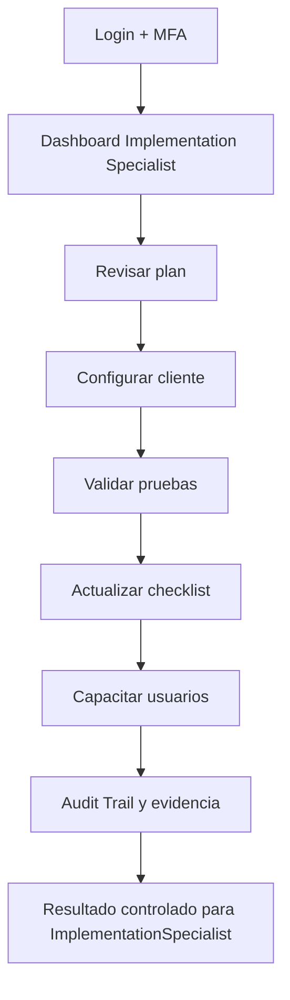
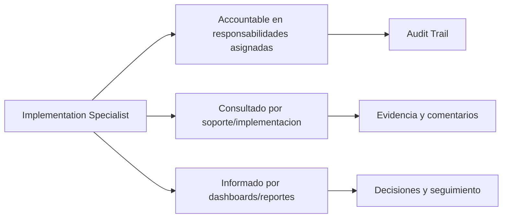

# Compliance 360 Academy

## Implementation Specialist Certification

## Portada

| Campo | Valor |
| --- | --- |
| Rol | Implementation Specialist |
| Nivel | Expert / Implementation |
| Duración | 34 horas |
| Objetivo | Formar implementadores que llevan un cliente de discovery a go-live. |
| Prerrequisitos | Conocer gestión de proyectos, compliance, configuración SaaS y capacitación. |
| Ruta de aprendizaje | Fundamentos -> Seguridad -> Módulos -> Operación -> Escenarios -> Evaluación -> Certificación |
| Certificación asociada | Compliance 360 Certified Implementation Specialist |
| Estado | Markdown maestro. No generar Word hasta aprobación. |

---

# CAPÍTULO 1 - Introducción al Rol

## ¿Quién es?

El `Implementation Specialist` es un perfil formal de Compliance 360 Academy. Su entrenamiento está diseñado para que pueda usar la plataforma sin revisar código fuente, entendiendo módulos, permisos, responsabilidades, riesgos y límites reales del producto.

## ¿Qué responsabilidades tiene?

| Responsabilidad | Dueño | Prioridad | Evidencia esperada |
| --- | --- | --- | --- |
| Ejecutar onboarding | Implementation Specialist | Alta | Evidencia en Audit Trail / reporte / registro |
| Configurar tenants | Implementation Specialist | Alta | Evidencia en Audit Trail / reporte / registro |
| Migrar datos iniciales | Implementation Specialist | Alta | Evidencia en Audit Trail / reporte / registro |
| Capacitar usuarios | Implementation Specialist | Alta | Evidencia en Audit Trail / reporte / registro |
| Coordinar go-live | Implementation Specialist | Alta | Evidencia en Audit Trail / reporte / registro |

## ¿Qué puede hacer?

- Ejecutar onboarding
- Configurar tenants
- Migrar datos iniciales
- Capacitar usuarios
- Coordinar go-live

## ¿Qué no puede hacer?

- Saltarse discovery
- Prometer features pendientes
- Configurar sin pruebas
- Ignorar soporte post go-live

## Flujo operativo del rol

## Matriz de responsabilidades

| Responsabilidad | Dueño | Prioridad | Evidencia esperada |
| --- | --- | --- | --- |
| Ejecutar onboarding | Implementation Specialist | Alta | Evidencia en Audit Trail / reporte / registro |
| Configurar tenants | Implementation Specialist | Alta | Evidencia en Audit Trail / reporte / registro |
| Migrar datos iniciales | Implementation Specialist | Alta | Evidencia en Audit Trail / reporte / registro |
| Capacitar usuarios | Implementation Specialist | Alta | Evidencia en Audit Trail / reporte / registro |
| Coordinar go-live | Implementation Specialist | Alta | Evidencia en Audit Trail / reporte / registro |

## Matriz RACI

| Proceso | Implementation Specialist | Tenant Admin | Quality Manager | Support Engineer | Consultora Admin |
| --- | --- | --- | --- | --- | --- |
| Discovery | R/A | I | I | C | C |
| Configurar tenant | R/A | I | I | C | C |
| Configurar seguridad | R/A | I | I | C | C |
| Cargar documentos | R/A | I | I | C | C |
| Configurar procesos | R/A | I | I | C | C |
| Ejecutar UAT | R/A | I | I | C | C |
| Go-live | R/A | I | I | C | C |

---

# CAPÍTULO 2 - Módulos que utiliza

## Módulos asignados al rol

| Módulo | Para qué sirve | Cuándo lo usa |
| --- | --- | --- |
| Tenant Management | Sirve para tenant management | Se usa cuando el rol necesita operar o consultar esta capacidad |
| Identity | Sirve para identity | Se usa cuando el rol necesita operar o consultar esta capacidad |
| RBAC | Sirve para rbac | Se usa cuando el rol necesita operar o consultar esta capacidad |
| MFA | Sirve para mfa | Se usa cuando el rol necesita operar o consultar esta capacidad |
| Storage | Sirve para storage | Se usa cuando el rol necesita operar o consultar esta capacidad |
| Notifications | Sirve para notifications | Se usa cuando el rol necesita operar o consultar esta capacidad |
| Document Management | Sirve para document management | Se usa cuando el rol necesita operar o consultar esta capacidad |
| Workflow Engine | Sirve para workflow engine | Se usa cuando el rol necesita operar o consultar esta capacidad |
| Supplier Management | Sirve para supplier management | Se usa cuando el rol necesita operar o consultar esta capacidad |
| Audit Management | Sirve para audit management | Se usa cuando el rol necesita operar o consultar esta capacidad |
| CAPA Management | Sirve para capa management | Se usa cuando el rol necesita operar o consultar esta capacidad |
| Risk Management | Sirve para risk management | Se usa cuando el rol necesita operar o consultar esta capacidad |
| Quality Indicators | Sirve para quality indicators | Se usa cuando el rol necesita operar o consultar esta capacidad |
| Reporting Engine | Sirve para reporting engine | Se usa cuando el rol necesita operar o consultar esta capacidad |
| Dashboard | Sirve para dashboard | Se usa cuando el rol necesita operar o consultar esta capacidad |
| Template Builder | Sirve para template builder | Se usa cuando el rol necesita operar o consultar esta capacidad |
| Regulatory Management | Sirve para regulatory management | Se usa cuando el rol necesita operar o consultar esta capacidad |
| Training Management | Sirve para training management | Se usa cuando el rol necesita operar o consultar esta capacidad |
| Supplier Portal | Sirve para supplier portal | Se usa cuando el rol necesita operar o consultar esta capacidad |
| Customer Portal | Sirve para customer portal | Se usa cuando el rol necesita operar o consultar esta capacidad |

## Matriz de módulos

| Módulo | Tipo de uso | Frecuencia | Nota de estado |
| --- | --- | --- | --- |
| Tenant Management | Uso principal | Diario/Semanal | Ver estado real en Handbook |
| Identity | Uso principal | Diario/Semanal | Ver estado real en Handbook |
| RBAC | Uso principal | Diario/Semanal | Ver estado real en Handbook |
| MFA | Uso principal | Diario/Semanal | Ver estado real en Handbook |
| Storage | Uso principal | Diario/Semanal | Ver estado real en Handbook |
| Notifications | Uso complementario | Según evento | Ver estado real en Handbook |
| Document Management | Uso complementario | Según evento | Ver estado real en Handbook |
| Workflow Engine | Uso complementario | Según evento | Ver estado real en Handbook |
| Supplier Management | Uso complementario | Según evento | Ver estado real en Handbook |
| Audit Management | Uso complementario | Según evento | Ver estado real en Handbook |
| CAPA Management | Uso complementario | Según evento | Ver estado real en Handbook |
| Risk Management | Uso complementario | Según evento | Ver estado real en Handbook |
| Quality Indicators | Uso complementario | Según evento | Ver estado real en Handbook |
| Reporting Engine | Uso complementario | Según evento | Ver estado real en Handbook |
| Dashboard | Uso complementario | Según evento | Ver estado real en Handbook |
| Template Builder | Uso complementario | Según evento | Ver estado real en Handbook |
| Regulatory Management | Uso complementario | Según evento | Ver estado real en Handbook |
| Training Management | Uso complementario | Según evento | Ver estado real en Handbook |
| Supplier Portal | Uso complementario | Según evento | Ver estado real en Handbook |
| Customer Portal | Uso complementario | Según evento | Ver estado real en Handbook |

## Diagrama de responsabilidades

---

# CAPÍTULO 3 - Configuración Inicial

## Objetivo

Preparar el acceso y el entorno de trabajo del rol `Implementation Specialist` para operar sin fricción.

## Paso a paso

1. Crear o validar usuario en el tenant correcto.
2. Asignar rol y permisos correspondientes.
3. Activar MFA si el tenant lo requiere.
4. Validar acceso a dashboard.
5. Validar acceso a módulos asignados.
6. Probar operación mínima permitida.
7. Confirmar que Audit Trail registra eventos clave.
8. Documentar restricciones del rol.

## Pantalla por pantalla

| Pantalla | Acción esperada | Resultado |
| --- | --- | --- |
| Login | Ingresar credenciales y completar MFA si aplica | Sesión activa |
| Dashboard | Revisar indicadores y alertas | Prioridades visibles |
| Módulos asignados | Validar acceso según matriz | Acceso autorizado |
| Reportes | Consultar datos según permiso | Reporte visible |
| Audit Trail | Confirmar trazabilidad si aplica | Evento registrado |

## Proceso por proceso

Cada proceso debe ejecutarse con tenant, permiso y evidencia correctos. Si aparece `401`, el usuario debe renovar sesión. Si aparece `403`, debe solicitar ajuste de rol, no intentar rodear el control.

---

# CAPÍTULO 4 - Operación Diaria

## ¿Qué hace al iniciar sesión?

| Tarea | Frecuencia | Resultado esperado |
| --- | --- | --- |
| Revisar plan | Diario | Validar resultado en dashboard/audit trail |
| Configurar cliente | Diario | Validar resultado en dashboard/audit trail |
| Validar pruebas | Diario | Validar resultado en dashboard/audit trail |
| Actualizar checklist | Diario | Validar resultado en dashboard/audit trail |
| Capacitar usuarios | Diario | Validar resultado en dashboard/audit trail |

## ¿Qué revisa?

- Estado general del dashboard.
- Tareas asignadas.
- Alertas relacionadas con sus módulos.
- Reportes o indicadores relevantes.
- Evidencia pendiente o procesos vencidos.

## ¿Qué tareas ejecuta?

- Revisar plan
- Configurar cliente
- Validar pruebas
- Actualizar checklist
- Capacitar usuarios

## ¿Qué indicadores debe monitorear?

| Indicador | Uso | Acción esperada |
| --- | --- | --- |
| Avance onboarding | Monitorear tendencia | Escalar desviaciones |
| UAT aprobados | Monitorear tendencia | Escalar desviaciones |
| Usuarios capacitados | Monitorear tendencia | Escalar desviaciones |
| Módulos configurados | Monitorear tendencia | Escalar desviaciones |
| Incidentes post go-live | Monitorear tendencia | Escalar desviaciones |

---

# CAPÍTULO 5 - Procesos Paso a Paso

Los procesos de este capítulo reemplazan la versión genérica anterior. Cada flujo incluye pantalla, decisión, resultado esperado y evidencia.

## 5.1 Proyecto de implementación 4 semanas

**Objetivo:** Llevar cliente de discovery a go-live controlado.

**Pantallas / áreas usadas:** Tenant; RBAC; Storage; Notifications; UAT

**Prerrequisitos específicos:**

- Sponsor designado
- Alcance aprobado

**Paso a paso operativo:**

1. Semana 1: discovery, procesos, roles y matriz de datos.
2. Crear tenant y branding.
3. Semana 2: configurar RBAC, MFA, storage y notifications.
4. Cargar catálogos documentales.
5. Semana 3: configurar documentos, proveedores, auditorías, CAPA, riesgos y KPIs.
6. Ejecutar capacitación por rol.
7. Semana 4: UAT con casos reales.
8. Corregir hallazgos UAT.
9. Ejecutar go-live checklist.
10. Entrar a hypercare.

**Decisiones clave:**

- **UAT fallido:** no go-live.
- **Provider no probado:** bloquear producción.

**Resultado esperado:**

- Cliente productivo con soporte hypercare

**Evidencias requeridas:**

- Plan
- UAT
- Go-live checklist

**Errores comunes a evitar:**

- Saltarse discovery
- No probar providers
- No capacitar usuarios

**Validación de cierre:** el `Implementation Specialist` debe poder explicar qué cambió, quién aprobó, qué evidencia quedó, qué riesgo se redujo y dónde se consulta la trazabilidad.

## 5.2 Ejecutar UAT empresarial

**Objetivo:** Validar que usuarios reales pueden operar casos críticos.

**Pantallas / áreas usadas:** UAT Board; Modules; Reports

**Prerrequisitos específicos:**

- Casos UAT definidos
- Usuarios entrenados

**Paso a paso operativo:**

1. Preparar 15 casos UAT.
2. Asignar roles.
3. Ejecutar login/MFA.
4. Probar documento.
5. Probar CAPA.
6. Probar auditoría.
7. Probar riesgo/KPI.
8. Probar reportes.
9. Registrar pass/fail.
10. Definir go/no-go.

**Decisiones clave:**

- **Falla crítica:** bloquear go-live.
- **Falla menor:** go-live condicionado con plan.

**Resultado esperado:**

- UAT aprobado o plan correctivo

**Evidencias requeridas:**

- Matriz UAT
- Evidencias
- Decisión

**Errores comunes a evitar:**

- Aceptar UAT verbal
- No registrar fallas
- Ignorar usuarios clave

**Validación de cierre:** el `Implementation Specialist` debe poder explicar qué cambió, quién aprobó, qué evidencia quedó, qué riesgo se redujo y dónde se consulta la trazabilidad.

## 5.3 Gestionar cambio de alcance

**Objetivo:** Controlar scope creep durante implementación.

**Pantallas / áreas usadas:** Project Log; Roadmap; Change Request

**Prerrequisitos específicos:**

- Contrato/alcance base
- Solicitud formal

**Paso a paso operativo:**

1. Registrar cambio solicitado.
2. Clasificar: configuración, custom, roadmap o no alcance.
3. Evaluar impacto tiempo/costo/riesgo.
4. Validar estado real del módulo.
5. Presentar opciones.
6. Obtener aprobación.
7. Actualizar plan.
8. Comunicar a equipo.
9. Ejecutar si aprobado.
10. Registrar decisión.

**Decisiones clave:**

- **Módulo workspace:** declarar limitación.
- **Cambio crítico:** requiere aprobación sponsor.

**Resultado esperado:**

- Cambio controlado

**Evidencias requeridas:**

- Change request
- Impacto
- Aprobación

**Errores comunes a evitar:**

- Prometer sin evaluar
- No registrar decisión
- Mezclar roadmap con alcance

**Validación de cierre:** el `Implementation Specialist` debe poder explicar qué cambió, quién aprobó, qué evidencia quedó, qué riesgo se redujo y dónde se consulta la trazabilidad.

## 5.4 Ejecutar Go-Live e Hypercare

**Objetivo:** Pasar a producción y estabilizar operación.

**Pantallas / áreas usadas:** Go-live Checklist; Health; Support

**Prerrequisitos específicos:**

- UAT aprobado
- Backups
- Soporte asignado

**Paso a paso operativo:**

1. Congelar configuración.
2. Validar backups.
3. Validar health ready.
4. Confirmar usuarios y MFA.
5. Confirmar providers.
6. Comunicar ventana.
7. Habilitar producción.
8. Ejecutar smoke test.
9. Monitorear 72 horas.
10. Cerrar hypercare con lecciones.

**Decisiones clave:**

- **Ready fail:** no go-live.
- **Incidente P1:** activar soporte y rollback si aplica.

**Resultado esperado:**

- Producción estable

**Evidencias requeridas:**

- Checklist
- Smoke test
- Hypercare log

**Errores comunes a evitar:**

- Go-live sin UAT
- Sin rollback
- Sin soporte

**Validación de cierre:** el `Implementation Specialist` debe poder explicar qué cambió, quién aprobó, qué evidencia quedó, qué riesgo se redujo y dónde se consulta la trazabilidad.

---

# CAPÍTULO 6 - Escenarios Reales

Todos los escenarios fueron reemplazados por casos empresariales con datos, decisiones y consecuencias.

## 6.1 Escenario: Proyecto de implementación 4 semanas

**Contexto real:** Cliente alimentario necesita salir en producción en 20 días hábiles.

**Datos iniciales:**

- 80 usuarios
- 5 procesos
- 2 providers
- Auditoría en 45 días

**Decisiones que debe tomar el `Implementation Specialist`:**

- **Prioridad:** Core primero, workspaces después.
- **Riesgo:** No prometer portales finales.

**Acciones esperadas:**

1. Definir plan.
2. Configurar tenant.
3. Capacitar roles.
4. Ejecutar UAT.
5. Go-live.

**Resultado esperado:** Go-live controlado con alcance real.

**Consecuencias si se ejecuta mal:**

- Alcance inflado
- UAT insuficiente
- Cliente decepcionado

**Criterios de evaluación:** el caso se aprueba si el estudiante identifica el módulo correcto, aplica permisos adecuados, documenta evidencia, toma decisiones justificadas y deja trazabilidad auditable.

## 6.2 Escenario: UAT fallido

**Contexto real:** Usuarios no pueden cerrar CAPA ni generar reporte.

**Datos iniciales:**

- CAPA.Close faltante
- Report permission faltante

**Decisiones que debe tomar el `Implementation Specialist`:**

- **Go-live:** Bloquear hasta corregir permisos.
- **RCA:** Actualizar matriz RBAC.

**Acciones esperadas:**

1. Registrar fallas.
2. Corregir roles.
3. Reejecutar UAT.
4. Aprobar go/no-go.

**Resultado esperado:** UAT aprobado tras corrección.

**Consecuencias si se ejecuta mal:**

- Go-live fallido
- Usuarios bloqueados

**Criterios de evaluación:** el caso se aprueba si el estudiante identifica el módulo correcto, aplica permisos adecuados, documenta evidencia, toma decisiones justificadas y deja trazabilidad auditable.

## 6.3 Escenario: Cambio de alcance

**Contexto real:** Cliente pide portal proveedor externo completo durante semana 3.

**Datos iniciales:**

- Alcance original: Supplier Management interno
- Portal real pendiente

**Decisiones que debe tomar el `Implementation Specialist`:**

- **Honestidad:** Declarar workspace/roadmap.
- **Comercial:** Generar change request.

**Acciones esperadas:**

1. Registrar cambio.
2. Explicar estado real.
3. Proponer workaround.
4. Actualizar plan.

**Resultado esperado:** Cambio controlado sin prometer feature inexistente.

**Consecuencias si se ejecuta mal:**

- Riesgo contractual
- Promesa falsa

**Criterios de evaluación:** el caso se aprueba si el estudiante identifica el módulo correcto, aplica permisos adecuados, documenta evidencia, toma decisiones justificadas y deja trazabilidad auditable.

## 6.4 Escenario: Migración documental

**Contexto real:** Cliente entrega 1,200 documentos en carpetas Excel.

**Datos iniciales:**

- 1,200 archivos
- Sin metadatos completos
- Tipos documentales 8

**Decisiones que debe tomar el `Implementation Specialist`:**

- **Calidad:** No migrar basura.
- **Muestreo:** Validar lote piloto.

**Acciones esperadas:**

1. Mapear metadatos.
2. Migrar piloto.
3. Validar documentos.
4. Migrar lotes.
5. Reportar errores.

**Resultado esperado:** Migración trazable y validada.

**Consecuencias si se ejecuta mal:**

- Documentos mal clasificados
- Duplicados

**Criterios de evaluación:** el caso se aprueba si el estudiante identifica el módulo correcto, aplica permisos adecuados, documenta evidencia, toma decisiones justificadas y deja trazabilidad auditable.

## 6.5 Escenario: Go-Live

**Contexto real:** Sponsor solicita salida pese a provider email sin probar.

**Datos iniciales:**

- UAT aprobado
- Email test pendiente
- Storage OK

**Decisiones que debe tomar el `Implementation Specialist`:**

- **Go-live:** Condicionar o bloquear por notificaciones críticas.
- **Mitigación:** Activar provider temporal.

**Acciones esperadas:**

1. Revisar checklist.
2. Probar provider.
3. Documentar riesgo.
4. Decidir go/no-go.

**Resultado esperado:** Go-live con riesgos controlados.

**Consecuencias si se ejecuta mal:**

- Alertas no enviadas
- Soporte saturado

**Criterios de evaluación:** el caso se aprueba si el estudiante identifica el módulo correcto, aplica permisos adecuados, documenta evidencia, toma decisiones justificadas y deja trazabilidad auditable.

## 6.6 Escenario: Hypercare

**Contexto real:** Primeras 72 horas tienen 18 tickets de permisos.

**Datos iniciales:**

- Tickets RBAC
- Usuarios nuevos
- MFA dudas

**Decisiones que debe tomar el `Implementation Specialist`:**

- **Patrón:** Actualizar training/roles.
- **Soporte:** Clasificar severidad.

**Acciones esperadas:**

1. Analizar tickets.
2. Corregir matriz.
3. Capacitar usuarios.
4. Cerrar hypercare.

**Resultado esperado:** Estabilización con lecciones.

**Consecuencias si se ejecuta mal:**

- Tickets repetidos
- Adopción baja

**Criterios de evaluación:** el caso se aprueba si el estudiante identifica el módulo correcto, aplica permisos adecuados, documenta evidencia, toma decisiones justificadas y deja trazabilidad auditable.

## 6.7 Escenario: Cliente multisede

**Contexto real:** Tres sedes requieren diferentes responsables y KPIs.

**Datos iniciales:**

- Sede norte/sur/centro
- Roles locales
- KPIs comunes

**Decisiones que debe tomar el `Implementation Specialist`:**

- **Modelo:** Un tenant con segmentación operativa si aplica.
- **Permisos:** Evitar visibilidad indebida.

**Acciones esperadas:**

1. Mapear sedes.
2. Configurar responsables.
3. Crear KPIs.
4. Validar reportes.

**Resultado esperado:** Operación multisede controlada.

**Consecuencias si se ejecuta mal:**

- Datos cruzados
- Reportes confusos

**Criterios de evaluación:** el caso se aprueba si el estudiante identifica el módulo correcto, aplica permisos adecuados, documenta evidencia, toma decisiones justificadas y deja trazabilidad auditable.

## 6.8 Escenario: Provider sin credenciales

**Contexto real:** IT cliente no entrega secretos de storage.

**Datos iniciales:**

- Go-live semana 4
- Storage pendiente

**Decisiones que debe tomar el `Implementation Specialist`:**

- **Riesgo:** No cargar evidencias productivas.
- **Alternativa:** Usar local temporal si aprobado.

**Acciones esperadas:**

1. Registrar bloqueo.
2. Escalar sponsor.
3. Configurar alterno.
4. Actualizar plan.

**Resultado esperado:** Bloqueo resuelto formalmente.

**Consecuencias si se ejecuta mal:**

- Go-live sin evidencias
- Pérdida de archivos

**Criterios de evaluación:** el caso se aprueba si el estudiante identifica el módulo correcto, aplica permisos adecuados, documenta evidencia, toma decisiones justificadas y deja trazabilidad auditable.

## 6.9 Escenario: Capacitación quality

**Contexto real:** Usuarios aprueban teoría pero fallan práctica CAPA.

**Datos iniciales:**

- 10 usuarios
- 60% práctica
- Errores cierre sin evidencia

**Decisiones que debe tomar el `Implementation Specialist`:**

- **Capacitación:** Reentrenar CAPA.
- **Certificación:** No certificar aún.

**Acciones esperadas:**

1. Analizar fallas.
2. Ejecutar lab CAPA.
3. Reevaluar.
4. Certificar solo aprobados.

**Resultado esperado:** Usuarios certificados con competencia real.

**Consecuencias si se ejecuta mal:**

- Certificación falsa
- Cierres inválidos

**Criterios de evaluación:** el caso se aprueba si el estudiante identifica el módulo correcto, aplica permisos adecuados, documenta evidencia, toma decisiones justificadas y deja trazabilidad auditable.

## 6.10 Escenario: Roadmap de brechas

**Contexto real:** Cliente requiere regulatory especializado y training LMS.

**Datos iniciales:**

- Módulos workspace
- Necesidad real
- Contrato pendiente

**Decisiones que debe tomar el `Implementation Specialist`:**

- **Transparencia:** Separar alcance actual de roadmap.
- **Plan:** Definir fase 2.

**Acciones esperadas:**

1. Documentar brecha.
2. Proponer workaround.
3. Estimar roadmap.
4. Aprobar fase.

**Resultado esperado:** Expectativa controlada.

**Consecuencias si se ejecuta mal:**

- Insatisfacción
- Scope creep

**Criterios de evaluación:** el caso se aprueba si el estudiante identifica el módulo correcto, aplica permisos adecuados, documenta evidencia, toma decisiones justificadas y deja trazabilidad auditable.

---

# CAPÍTULO 7 - Mejores Prácticas

## ISO 9001

- Mantener evidencia trazable de cambios, aprobaciones y cierres.
- Usar roles claros para evitar conflictos de interés.
- Medir desempeño con indicadores y revisar tendencias.
- Gestionar no conformidades mediante CAPA con causa raíz y efectividad.

## ISO 22000, HACCP y BPM

- Controlar documentos de inocuidad y BPM como documentos vigentes.
- Vincular proveedores críticos con certificaciones y evaluaciones.
- Registrar riesgos de inocuidad con controles y tratamiento.
- Mantener evidencias de acciones preventivas y correctivas.

## Buenas prácticas SaaS

- No compartir usuarios.
- Activar MFA para roles sensibles.
- Usar permisos mínimos necesarios.
- Validar providers de email/storage antes de producción.
- Escalar errores técnicos con evidencia, hora, tenant y correlation id.

---

# CAPÍTULO 8 - Errores Comunes

| Error | Consecuencia | Prevención |
| --- | --- | --- |
| Operar en tenant incorrecto | Riesgo de privacidad y datos cruzados | Confirmar tenant al iniciar |
| Usar rol con permisos excesivos | Falta de segregación | Revisar matriz RBAC |
| Cerrar sin evidencia | Debilidad ante auditoría | Adjuntar evidencia antes de cierre |
| Ignorar módulos en estado workspace | Promesa comercial incorrecta | Aplicar regla de honestidad |
| No revisar Audit Trail | Falta de trazabilidad | Validar eventos clave |
| No probar providers | Fallas de email/storage en producción | Ejecutar tests de conexión |
| Compartir credenciales | Riesgo de seguridad | Usuario individual por persona |
| Omitir MFA | Mayor exposición de acceso | Activar MFA en roles críticos |
| No documentar decisiones | Soporte y auditoría débiles | Registrar comentarios |
| No escalar a tiempo | SLA incumplido | Clasificar severidad |

---

# CAPÍTULO 9 - Checklist Operativo

## Checklist diario

- Confirmar acceso y tenant correcto.
- Revisar dashboard y tareas asignadas.
- Revisar alertas de módulos asignados.
- Ejecutar procesos prioritarios.
- Escalar bloqueos con evidencia.

## Checklist semanal

- Revisar reportes relevantes.
- Revisar tareas vencidas.
- Validar indicadores del rol.
- Confirmar que los procesos críticos tienen responsables.
- Revisar errores recurrentes.

## Checklist mensual

- Preparar comité o revisión ejecutiva.
- Auditar permisos del rol si aplica.
- Revisar tendencias y desviaciones.
- Confirmar cierre de procesos críticos.
- Documentar oportunidades de mejora.

## Checklist trimestral

- Revisar matriz de responsabilidades.
- Validar capacitación de usuarios.
- Revisar efectividad de controles.
- Actualizar procesos según cambios normativos.
- Preparar evidencia para auditorías.

---

# CAPÍTULO 10 - Evaluación Teórica

**Formato del examen:** 50 preguntas situacionales, 2 puntos por pregunta, 100 puntos totales.

**Regla de certificación:** las preguntas mezclan contexto, datos, problema, decisión y consecuencia. Las opciones incorrectas son plausibles y requieren criterio profesional.

## Pregunta 1

**Contexto:** Cliente quiere go-live en 4 semanas pero no entregó matriz de roles. Enfoque: Acción inmediata.

**Datos del sistema/caso:**

- Go-live: 4 semanas
- Roles: pendientes
- Módulos core: 5

**Problema:** El rol `Implementation Specialist` debe resolver `Discovery incompleto` sin romper segregación, evidencia ni trazabilidad.

**Decisión requerida:** ¿Cuál es la primera acción correcta?

**Consecuencia de una mala decisión:** Si se elige mal, el proceso puede avanzar sin control.

A. Inventar roles estándar.
B. Bloquear configuración final de RBAC hasta completar matriz mínima.
C. Dar permisos amplios temporalmente.
D. UAT fallido

**Respuesta correcta:** B

**Explicación:** La opción B es correcta porque aborda `Discovery incompleto` con control verificable, decisión justificada y evidencia auditable. Las demás opciones son plausibles, pero dejan una brecha de cumplimiento, operación o certificación.

## Pregunta 2

**Contexto:** Cliente quiere go-live en 4 semanas pero no entregó matriz de roles. Enfoque: Decisión de aprobación.

**Datos del sistema/caso:**

- Go-live: 4 semanas
- Roles: pendientes
- Módulos core: 5

**Problema:** El rol `Implementation Specialist` debe resolver `Discovery incompleto` sin romper segregación, evidencia ni trazabilidad.

**Decisión requerida:** ¿Qué decisión protege mejor la trazabilidad y el cumplimiento?

**Consecuencia de una mala decisión:** Una aprobación débil genera evidencia no defendible.

A. Dar permisos amplios temporalmente.
B. Mover RBAC a post-go-live.
C. Accesos indebidos
D. Documentar riesgo y dueño del entregable.

**Respuesta correcta:** D

**Explicación:** La opción D es correcta porque aborda `Discovery incompleto` con control verificable, decisión justificada y evidencia auditable. Las demás opciones son plausibles, pero dejan una brecha de cumplimiento, operación o certificación.

## Pregunta 3

**Contexto:** Cliente quiere go-live en 4 semanas pero no entregó matriz de roles. Enfoque: Evidencia.

**Datos del sistema/caso:**

- Go-live: 4 semanas
- Roles: pendientes
- Módulos core: 5

**Problema:** El rol `Implementation Specialist` debe resolver `Discovery incompleto` sin romper segregación, evidencia ni trazabilidad.

**Decisión requerida:** ¿Qué evidencia mínima debe exigirse antes de cerrar o avanzar?

**Consecuencia de una mala decisión:** Sin evidencia objetiva no hay certificación defendible.

A. Configurar tenant base sin habilitar usuarios finales.
B. Mover RBAC a post-go-live.
C. Capacitar sin roles.
D. Retrabajo.

**Respuesta correcta:** A

**Explicación:** La opción A es correcta porque aborda `Discovery incompleto` con control verificable, decisión justificada y evidencia auditable. Las demás opciones son plausibles, pero dejan una brecha de cumplimiento, operación o certificación.

## Pregunta 4

**Contexto:** Cliente quiere go-live en 4 semanas pero no entregó matriz de roles. Enfoque: Escalación.

**Datos del sistema/caso:**

- Go-live: 4 semanas
- Roles: pendientes
- Módulos core: 5

**Problema:** El rol `Implementation Specialist` debe resolver `Discovery incompleto` sin romper segregación, evidencia ni trazabilidad.

**Decisión requerida:** ¿Cuándo debe escalarse el caso y a quién?

**Consecuencia de una mala decisión:** Escalar tarde puede producir incumplimiento, pérdida de SLA o riesgo contractual.

A. Capacitar sin roles.
B. Inventar roles estándar.
C. Ajustar plan de UAT.
D. UAT fallido

**Respuesta correcta:** C

**Explicación:** La opción C es correcta porque aborda `Discovery incompleto` con control verificable, decisión justificada y evidencia auditable. Las demás opciones son plausibles, pero dejan una brecha de cumplimiento, operación o certificación.

## Pregunta 5

**Contexto:** Cliente quiere go-live en 4 semanas pero no entregó matriz de roles. Enfoque: Prevención.

**Datos del sistema/caso:**

- Go-live: 4 semanas
- Roles: pendientes
- Módulos core: 5

**Problema:** El rol `Implementation Specialist` debe resolver `Discovery incompleto` sin romper segregación, evidencia ni trazabilidad.

**Decisión requerida:** ¿Qué control evita la recurrencia del problema?

**Consecuencia de una mala decisión:** Resolver solo el síntoma deja el sistema expuesto a repetición.

A. Inventar roles estándar.
B. Escalar al sponsor.
C. Dar permisos amplios temporalmente.
D. Accesos indebidos

**Respuesta correcta:** B

**Explicación:** La opción B es correcta porque aborda `Discovery incompleto` con control verificable, decisión justificada y evidencia auditable. Las demás opciones son plausibles, pero dejan una brecha de cumplimiento, operación o certificación.

## Pregunta 6

**Contexto:** Usuarios no pueden cerrar CAPA ni generar reportes. Enfoque: Acción inmediata.

**Datos del sistema/caso:**

- CAPA.Close faltante
- REPORT.EXECUTE faltante
- UAT fail

**Problema:** El rol `Implementation Specialist` debe resolver `UAT fallido` sin romper segregación, evidencia ni trazabilidad.

**Decisión requerida:** ¿Cuál es la primera acción correcta?

**Consecuencia de una mala decisión:** Si se elige mal, el proceso puede avanzar sin control.

A. Aprobar UAT con workaround manual.
B. Dar SuperAdmin a usuarios clave.
C. Usuarios bloqueados
D. Corregir matriz RBAC, reejecutar casos y bloquear go-live hasta pass.

**Respuesta correcta:** D

**Explicación:** La opción D es correcta porque aborda `UAT fallido` con control verificable, decisión justificada y evidencia auditable. Las demás opciones son plausibles, pero dejan una brecha de cumplimiento, operación o certificación.

## Pregunta 7

**Contexto:** Usuarios no pueden cerrar CAPA ni generar reportes. Enfoque: Decisión de aprobación.

**Datos del sistema/caso:**

- CAPA.Close faltante
- REPORT.EXECUTE faltante
- UAT fail

**Problema:** El rol `Implementation Specialist` debe resolver `UAT fallido` sin romper segregación, evidencia ni trazabilidad.

**Decisión requerida:** ¿Qué decisión protege mejor la trazabilidad y el cumplimiento?

**Consecuencia de una mala decisión:** Una aprobación débil genera evidencia no defendible.

A. Registrar defectos UAT con severidad.
B. Dar SuperAdmin a usuarios clave.
C. Eliminar casos fallidos.
D. Go-live fallido

**Respuesta correcta:** A

**Explicación:** La opción A es correcta porque aborda `UAT fallido` con control verificable, decisión justificada y evidencia auditable. Las demás opciones son plausibles, pero dejan una brecha de cumplimiento, operación o certificación.

## Pregunta 8

**Contexto:** Usuarios no pueden cerrar CAPA ni generar reportes. Enfoque: Evidencia.

**Datos del sistema/caso:**

- CAPA.Close faltante
- REPORT.EXECUTE faltante
- UAT fail

**Problema:** El rol `Implementation Specialist` debe resolver `UAT fallido` sin romper segregación, evidencia ni trazabilidad.

**Decisión requerida:** ¿Qué evidencia mínima debe exigirse antes de cerrar o avanzar?

**Consecuencia de una mala decisión:** Sin evidencia objetiva no hay certificación defendible.

A. Eliminar casos fallidos.
B. Go-live y corregir después.
C. Separar configuración de bug real.
D. Riesgo seguridad.

**Respuesta correcta:** C

**Explicación:** La opción C es correcta porque aborda `UAT fallido` con control verificable, decisión justificada y evidencia auditable. Las demás opciones son plausibles, pero dejan una brecha de cumplimiento, operación o certificación.

## Pregunta 9

**Contexto:** Usuarios no pueden cerrar CAPA ni generar reportes. Enfoque: Escalación.

**Datos del sistema/caso:**

- CAPA.Close faltante
- REPORT.EXECUTE faltante
- UAT fail

**Problema:** El rol `Implementation Specialist` debe resolver `UAT fallido` sin romper segregación, evidencia ni trazabilidad.

**Decisión requerida:** ¿Cuándo debe escalarse el caso y a quién?

**Consecuencia de una mala decisión:** Escalar tarde puede producir incumplimiento, pérdida de SLA o riesgo contractual.

A. Go-live y corregir después.
B. Comunicar decisión go/no-go.
C. Aprobar UAT con workaround manual.
D. Usuarios bloqueados

**Respuesta correcta:** B

**Explicación:** La opción B es correcta porque aborda `UAT fallido` con control verificable, decisión justificada y evidencia auditable. Las demás opciones son plausibles, pero dejan una brecha de cumplimiento, operación o certificación.

## Pregunta 10

**Contexto:** Usuarios no pueden cerrar CAPA ni generar reportes. Enfoque: Prevención.

**Datos del sistema/caso:**

- CAPA.Close faltante
- REPORT.EXECUTE faltante
- UAT fail

**Problema:** El rol `Implementation Specialist` debe resolver `UAT fallido` sin romper segregación, evidencia ni trazabilidad.

**Decisión requerida:** ¿Qué control evita la recurrencia del problema?

**Consecuencia de una mala decisión:** Resolver solo el síntoma deja el sistema expuesto a repetición.

A. Aprobar UAT con workaround manual.
B. Actualizar evidencia UAT.
C. Dar SuperAdmin a usuarios clave.
D. Go-live fallido

**Respuesta correcta:** B

**Explicación:** La opción B es correcta porque aborda `UAT fallido` con control verificable, decisión justificada y evidencia auditable. Las demás opciones son plausibles, pero dejan una brecha de cumplimiento, operación o certificación.

## Pregunta 11

**Contexto:** Cliente pide portal proveedor final en semana 3 aunque alcance era Supplier Management interno. Enfoque: Acción inmediata.

**Datos del sistema/caso:**

- Semana: 3
- Feature: portal externo
- Estado: workspace/roadmap

**Problema:** El rol `Implementation Specialist` debe resolver `Change control` sin romper segregación, evidencia ni trazabilidad.

**Decisión requerida:** ¿Cuál es la primera acción correcta?

**Consecuencia de una mala decisión:** Si se elige mal, el proceso puede avanzar sin control.

A. Registrar change request y explicar estado real/roadmap.
B. Aceptar verbalmente para mantener relación.
C. Cambiar alcance sin costo.
D. Riesgo contractual

**Respuesta correcta:** A

**Explicación:** La opción A es correcta porque aborda `Change control` con control verificable, decisión justificada y evidencia auditable. Las demás opciones son plausibles, pero dejan una brecha de cumplimiento, operación o certificación.

## Pregunta 12

**Contexto:** Cliente pide portal proveedor final en semana 3 aunque alcance era Supplier Management interno. Enfoque: Decisión de aprobación.

**Datos del sistema/caso:**

- Semana: 3
- Feature: portal externo
- Estado: workspace/roadmap

**Problema:** El rol `Implementation Specialist` debe resolver `Change control` sin romper segregación, evidencia ni trazabilidad.

**Decisión requerida:** ¿Qué decisión protege mejor la trazabilidad y el cumplimiento?

**Consecuencia de una mala decisión:** Una aprobación débil genera evidencia no defendible.

A. Cambiar alcance sin costo.
B. Decir que estará en go-live.
C. Proponer workaround con Supplier Management core.
D. Expectativas falsas

**Respuesta correcta:** C

**Explicación:** La opción C es correcta porque aborda `Change control` con control verificable, decisión justificada y evidencia auditable. Las demás opciones son plausibles, pero dejan una brecha de cumplimiento, operación o certificación.

## Pregunta 13

**Contexto:** Cliente pide portal proveedor final en semana 3 aunque alcance era Supplier Management interno. Enfoque: Evidencia.

**Datos del sistema/caso:**

- Semana: 3
- Feature: portal externo
- Estado: workspace/roadmap

**Problema:** El rol `Implementation Specialist` debe resolver `Change control` sin romper segregación, evidencia ni trazabilidad.

**Decisión requerida:** ¿Qué evidencia mínima debe exigirse antes de cerrar o avanzar?

**Consecuencia de una mala decisión:** Sin evidencia objetiva no hay certificación defendible.

A. Decir que estará en go-live.
B. Evaluar impacto costo/tiempo.
C. Ocultar limitación hasta demo.
D. Retraso.

**Respuesta correcta:** B

**Explicación:** La opción B es correcta porque aborda `Change control` con control verificable, decisión justificada y evidencia auditable. Las demás opciones son plausibles, pero dejan una brecha de cumplimiento, operación o certificación.

## Pregunta 14

**Contexto:** Cliente pide portal proveedor final en semana 3 aunque alcance era Supplier Management interno. Enfoque: Escalación.

**Datos del sistema/caso:**

- Semana: 3
- Feature: portal externo
- Estado: workspace/roadmap

**Problema:** El rol `Implementation Specialist` debe resolver `Change control` sin romper segregación, evidencia ni trazabilidad.

**Decisión requerida:** ¿Cuándo debe escalarse el caso y a quién?

**Consecuencia de una mala decisión:** Escalar tarde puede producir incumplimiento, pérdida de SLA o riesgo contractual.

A. Ocultar limitación hasta demo.
B. Obtener aprobación si cambia alcance.
C. Aceptar verbalmente para mantener relación.
D. Riesgo contractual

**Respuesta correcta:** B

**Explicación:** La opción B es correcta porque aborda `Change control` con control verificable, decisión justificada y evidencia auditable. Las demás opciones son plausibles, pero dejan una brecha de cumplimiento, operación o certificación.

## Pregunta 15

**Contexto:** Cliente pide portal proveedor final en semana 3 aunque alcance era Supplier Management interno. Enfoque: Prevención.

**Datos del sistema/caso:**

- Semana: 3
- Feature: portal externo
- Estado: workspace/roadmap

**Problema:** El rol `Implementation Specialist` debe resolver `Change control` sin romper segregación, evidencia ni trazabilidad.

**Decisión requerida:** ¿Qué control evita la recurrencia del problema?

**Consecuencia de una mala decisión:** Resolver solo el síntoma deja el sistema expuesto a repetición.

A. Aceptar verbalmente para mantener relación.
B. Cambiar alcance sin costo.
C. Expectativas falsas
D. No prometer feature final.

**Respuesta correcta:** D

**Explicación:** La opción D es correcta porque aborda `Change control` con control verificable, decisión justificada y evidencia auditable. Las demás opciones son plausibles, pero dejan una brecha de cumplimiento, operación o certificación.

## Pregunta 16

**Contexto:** 1,200 documentos llegan con metadatos incompletos. Enfoque: Acción inmediata.

**Datos del sistema/caso:**

- Archivos: 1200
- Metadatos faltantes: 35%
- Tipos: 8

**Problema:** El rol `Implementation Specialist` debe resolver `Migración documental` sin romper segregación, evidencia ni trazabilidad.

**Decisión requerida:** ¿Cuál es la primera acción correcta?

**Consecuencia de una mala decisión:** Si se elige mal, el proceso puede avanzar sin control.

A. Migrar todo a categoría genérica.
B. Completar metadatos con valores por defecto.
C. Ejecutar piloto, validar mapeo y rechazar registros sin metadatos mínimos.
D. Repositorio sucio

**Respuesta correcta:** C

**Explicación:** La opción C es correcta porque aborda `Migración documental` con control verificable, decisión justificada y evidencia auditable. Las demás opciones son plausibles, pero dejan una brecha de cumplimiento, operación o certificación.

## Pregunta 17

**Contexto:** 1,200 documentos llegan con metadatos incompletos. Enfoque: Decisión de aprobación.

**Datos del sistema/caso:**

- Archivos: 1200
- Metadatos faltantes: 35%
- Tipos: 8

**Problema:** El rol `Implementation Specialist` debe resolver `Migración documental` sin romper segregación, evidencia ni trazabilidad.

**Decisión requerida:** ¿Qué decisión protege mejor la trazabilidad y el cumplimiento?

**Consecuencia de una mala decisión:** Una aprobación débil genera evidencia no defendible.

A. Completar metadatos con valores por defecto.
B. Definir reglas de calidad de datos.
C. Omitir validación piloto.
D. Búsqueda inútil

**Respuesta correcta:** B

**Explicación:** La opción B es correcta porque aborda `Migración documental` con control verificable, decisión justificada y evidencia auditable. Las demás opciones son plausibles, pero dejan una brecha de cumplimiento, operación o certificación.

## Pregunta 18

**Contexto:** 1,200 documentos llegan con metadatos incompletos. Enfoque: Evidencia.

**Datos del sistema/caso:**

- Archivos: 1200
- Metadatos faltantes: 35%
- Tipos: 8

**Problema:** El rol `Implementation Specialist` debe resolver `Migración documental` sin romper segregación, evidencia ni trazabilidad.

**Decisión requerida:** ¿Qué evidencia mínima debe exigirse antes de cerrar o avanzar?

**Consecuencia de una mala decisión:** Sin evidencia objetiva no hay certificación defendible.

A. Omitir validación piloto.
B. Cargar por lotes con reporte de errores.
C. Aceptar duplicados.
D. Auditoría débil.

**Respuesta correcta:** B

**Explicación:** La opción B es correcta porque aborda `Migración documental` con control verificable, decisión justificada y evidencia auditable. Las demás opciones son plausibles, pero dejan una brecha de cumplimiento, operación o certificación.

## Pregunta 19

**Contexto:** 1,200 documentos llegan con metadatos incompletos. Enfoque: Escalación.

**Datos del sistema/caso:**

- Archivos: 1200
- Metadatos faltantes: 35%
- Tipos: 8

**Problema:** El rol `Implementation Specialist` debe resolver `Migración documental` sin romper segregación, evidencia ni trazabilidad.

**Decisión requerida:** ¿Cuándo debe escalarse el caso y a quién?

**Consecuencia de una mala decisión:** Escalar tarde puede producir incumplimiento, pérdida de SLA o riesgo contractual.

A. Aceptar duplicados.
B. Migrar todo a categoría genérica.
C. Repositorio sucio
D. No migrar documentos no clasificables.

**Respuesta correcta:** D

**Explicación:** La opción D es correcta porque aborda `Migración documental` con control verificable, decisión justificada y evidencia auditable. Las demás opciones son plausibles, pero dejan una brecha de cumplimiento, operación o certificación.

## Pregunta 20

**Contexto:** 1,200 documentos llegan con metadatos incompletos. Enfoque: Prevención.

**Datos del sistema/caso:**

- Archivos: 1200
- Metadatos faltantes: 35%
- Tipos: 8

**Problema:** El rol `Implementation Specialist` debe resolver `Migración documental` sin romper segregación, evidencia ni trazabilidad.

**Decisión requerida:** ¿Qué control evita la recurrencia del problema?

**Consecuencia de una mala decisión:** Resolver solo el síntoma deja el sistema expuesto a repetición.

A. Obtener aprobación de muestra.
B. Migrar todo a categoría genérica.
C. Completar metadatos con valores por defecto.
D. Búsqueda inútil

**Respuesta correcta:** A

**Explicación:** La opción A es correcta porque aborda `Migración documental` con control verificable, decisión justificada y evidencia auditable. Las demás opciones son plausibles, pero dejan una brecha de cumplimiento, operación o certificación.

## Pregunta 21

**Contexto:** UAT aprobado, pero provider email no fue probado externamente. Enfoque: Acción inmediata.

**Datos del sistema/caso:**

- UAT: pass
- Email external test: pending
- CAPA alerts critical

**Problema:** El rol `Implementation Specialist` debe resolver `Go-live` sin romper segregación, evidencia ni trazabilidad.

**Decisión requerida:** ¿Cuál es la primera acción correcta?

**Consecuencia de una mala decisión:** Si se elige mal, el proceso puede avanzar sin control.

A. Go-live porque UAT pasó.
B. Condicionar go-live o ejecutar prueba externa antes de activar alertas.
C. Desactivar alertas CAPA temporalmente.
D. Alertas no enviadas

**Respuesta correcta:** B

**Explicación:** La opción B es correcta porque aborda `Go-live` con control verificable, decisión justificada y evidencia auditable. Las demás opciones son plausibles, pero dejan una brecha de cumplimiento, operación o certificación.

## Pregunta 22

**Contexto:** UAT aprobado, pero provider email no fue probado externamente. Enfoque: Decisión de aprobación.

**Datos del sistema/caso:**

- UAT: pass
- Email external test: pending
- CAPA alerts critical

**Problema:** El rol `Implementation Specialist` debe resolver `Go-live` sin romper segregación, evidencia ni trazabilidad.

**Decisión requerida:** ¿Qué decisión protege mejor la trazabilidad y el cumplimiento?

**Consecuencia de una mala decisión:** Una aprobación débil genera evidencia no defendible.

A. Desactivar alertas CAPA temporalmente.
B. Documentar riesgo si sponsor insiste.
C. Usar correo personal.
D. Soporte saturado

**Respuesta correcta:** B

**Explicación:** La opción B es correcta porque aborda `Go-live` con control verificable, decisión justificada y evidencia auditable. Las demás opciones son plausibles, pero dejan una brecha de cumplimiento, operación o certificación.

## Pregunta 23

**Contexto:** UAT aprobado, pero provider email no fue probado externamente. Enfoque: Evidencia.

**Datos del sistema/caso:**

- UAT: pass
- Email external test: pending
- CAPA alerts critical

**Problema:** El rol `Implementation Specialist` debe resolver `Go-live` sin romper segregación, evidencia ni trazabilidad.

**Decisión requerida:** ¿Qué evidencia mínima debe exigirse antes de cerrar o avanzar?

**Consecuencia de una mala decisión:** Sin evidencia objetiva no hay certificación defendible.

A. Usar correo personal.
B. Omitir prueba externa.
C. Confianza baja.
D. Configurar provider alterno temporal.

**Respuesta correcta:** D

**Explicación:** La opción D es correcta porque aborda `Go-live` con control verificable, decisión justificada y evidencia auditable. Las demás opciones son plausibles, pero dejan una brecha de cumplimiento, operación o certificación.

## Pregunta 24

**Contexto:** UAT aprobado, pero provider email no fue probado externamente. Enfoque: Escalación.

**Datos del sistema/caso:**

- UAT: pass
- Email external test: pending
- CAPA alerts critical

**Problema:** El rol `Implementation Specialist` debe resolver `Go-live` sin romper segregación, evidencia ni trazabilidad.

**Decisión requerida:** ¿Cuándo debe escalarse el caso y a quién?

**Consecuencia de una mala decisión:** Escalar tarde puede producir incumplimiento, pérdida de SLA o riesgo contractual.

A. Actualizar checklist.
B. Omitir prueba externa.
C. Go-live porque UAT pasó.
D. Alertas no enviadas

**Respuesta correcta:** A

**Explicación:** La opción A es correcta porque aborda `Go-live` con control verificable, decisión justificada y evidencia auditable. Las demás opciones son plausibles, pero dejan una brecha de cumplimiento, operación o certificación.

## Pregunta 25

**Contexto:** UAT aprobado, pero provider email no fue probado externamente. Enfoque: Prevención.

**Datos del sistema/caso:**

- UAT: pass
- Email external test: pending
- CAPA alerts critical

**Problema:** El rol `Implementation Specialist` debe resolver `Go-live` sin romper segregación, evidencia ni trazabilidad.

**Decisión requerida:** ¿Qué control evita la recurrencia del problema?

**Consecuencia de una mala decisión:** Resolver solo el síntoma deja el sistema expuesto a repetición.

A. Go-live porque UAT pasó.
B. Desactivar alertas CAPA temporalmente.
C. No declarar readiness total sin test.
D. Soporte saturado

**Respuesta correcta:** C

**Explicación:** La opción C es correcta porque aborda `Go-live` con control verificable, decisión justificada y evidencia auditable. Las demás opciones son plausibles, pero dejan una brecha de cumplimiento, operación o certificación.

## Pregunta 26

**Contexto:** Primeras 72h tienen 18 tickets RBAC. Enfoque: Acción inmediata.

**Datos del sistema/caso:**

- Tickets: 18
- Causa: roles
- Usuarios: calidad/compras

**Problema:** El rol `Implementation Specialist` debe resolver `Hypercare` sin romper segregación, evidencia ni trazabilidad.

**Decisión requerida:** ¿Cuál es la primera acción correcta?

**Consecuencia de una mala decisión:** Si se elige mal, el proceso puede avanzar sin control.

A. Resolver uno por uno sin análisis.
B. Analizar patrón, corregir matriz y reentrenar usuarios afectados.
C. Dar permisos amplios.
D. Tickets recurrentes

**Respuesta correcta:** B

**Explicación:** La opción B es correcta porque aborda `Hypercare` con control verificable, decisión justificada y evidencia auditable. Las demás opciones son plausibles, pero dejan una brecha de cumplimiento, operación o certificación.

## Pregunta 27

**Contexto:** Primeras 72h tienen 18 tickets RBAC. Enfoque: Decisión de aprobación.

**Datos del sistema/caso:**

- Tickets: 18
- Causa: roles
- Usuarios: calidad/compras

**Problema:** El rol `Implementation Specialist` debe resolver `Hypercare` sin romper segregación, evidencia ni trazabilidad.

**Decisión requerida:** ¿Qué decisión protege mejor la trazabilidad y el cumplimiento?

**Consecuencia de una mala decisión:** Una aprobación débil genera evidencia no defendible.

A. Dar permisos amplios.
B. Cerrar como capacitación.
C. Seguridad débil
D. Clasificar severidad y cerrar con evidencia.

**Respuesta correcta:** D

**Explicación:** La opción D es correcta porque aborda `Hypercare` con control verificable, decisión justificada y evidencia auditable. Las demás opciones son plausibles, pero dejan una brecha de cumplimiento, operación o certificación.

## Pregunta 28

**Contexto:** Primeras 72h tienen 18 tickets RBAC. Enfoque: Evidencia.

**Datos del sistema/caso:**

- Tickets: 18
- Causa: roles
- Usuarios: calidad/compras

**Problema:** El rol `Implementation Specialist` debe resolver `Hypercare` sin romper segregación, evidencia ni trazabilidad.

**Decisión requerida:** ¿Qué evidencia mínima debe exigirse antes de cerrar o avanzar?

**Consecuencia de una mala decisión:** Sin evidencia objetiva no hay certificación defendible.

A. Distinguir incidentes de capacitación vs configuración.
B. Cerrar como capacitación.
C. Extender hypercare sin plan.
D. Adopción baja.

**Respuesta correcta:** A

**Explicación:** La opción A es correcta porque aborda `Hypercare` con control verificable, decisión justificada y evidencia auditable. Las demás opciones son plausibles, pero dejan una brecha de cumplimiento, operación o certificación.

## Pregunta 29

**Contexto:** Primeras 72h tienen 18 tickets RBAC. Enfoque: Escalación.

**Datos del sistema/caso:**

- Tickets: 18
- Causa: roles
- Usuarios: calidad/compras

**Problema:** El rol `Implementation Specialist` debe resolver `Hypercare` sin romper segregación, evidencia ni trazabilidad.

**Decisión requerida:** ¿Cuándo debe escalarse el caso y a quién?

**Consecuencia de una mala decisión:** Escalar tarde puede producir incumplimiento, pérdida de SLA o riesgo contractual.

A. Extender hypercare sin plan.
B. Resolver uno por uno sin análisis.
C. Actualizar playbook.
D. Tickets recurrentes

**Respuesta correcta:** C

**Explicación:** La opción C es correcta porque aborda `Hypercare` con control verificable, decisión justificada y evidencia auditable. Las demás opciones son plausibles, pero dejan una brecha de cumplimiento, operación o certificación.

## Pregunta 30

**Contexto:** Primeras 72h tienen 18 tickets RBAC. Enfoque: Prevención.

**Datos del sistema/caso:**

- Tickets: 18
- Causa: roles
- Usuarios: calidad/compras

**Problema:** El rol `Implementation Specialist` debe resolver `Hypercare` sin romper segregación, evidencia ni trazabilidad.

**Decisión requerida:** ¿Qué control evita la recurrencia del problema?

**Consecuencia de una mala decisión:** Resolver solo el síntoma deja el sistema expuesto a repetición.

A. Resolver uno por uno sin análisis.
B. Reportar lecciones aprendidas.
C. Dar permisos amplios.
D. Seguridad débil

**Respuesta correcta:** B

**Explicación:** La opción B es correcta porque aborda `Hypercare` con control verificable, decisión justificada y evidencia auditable. Las demás opciones son plausibles, pero dejan una brecha de cumplimiento, operación o certificación.

## Pregunta 31

**Contexto:** Tres sedes requieren visibilidad distinta de KPIs y responsables. Enfoque: Acción inmediata.

**Datos del sistema/caso:**

- Sedes: norte/sur/centro
- KPIs comunes
- Responsables locales

**Problema:** El rol `Implementation Specialist` debe resolver `Cliente multisede` sin romper segregación, evidencia ni trazabilidad.

**Decisión requerida:** ¿Cuál es la primera acción correcta?

**Consecuencia de una mala decisión:** Si se elige mal, el proceso puede avanzar sin control.

A. Crear un rol único para todos.
B. Duplicar tenants sin análisis.
C. Datos cruzados
D. Diseñar segmentación operativa y validar permisos antes de carga masiva.

**Respuesta correcta:** D

**Explicación:** La opción D es correcta porque aborda `Cliente multisede` con control verificable, decisión justificada y evidencia auditable. Las demás opciones son plausibles, pero dejan una brecha de cumplimiento, operación o certificación.

## Pregunta 32

**Contexto:** Tres sedes requieren visibilidad distinta de KPIs y responsables. Enfoque: Decisión de aprobación.

**Datos del sistema/caso:**

- Sedes: norte/sur/centro
- KPIs comunes
- Responsables locales

**Problema:** El rol `Implementation Specialist` debe resolver `Cliente multisede` sin romper segregación, evidencia ni trazabilidad.

**Decisión requerida:** ¿Qué decisión protege mejor la trazabilidad y el cumplimiento?

**Consecuencia de una mala decisión:** Una aprobación débil genera evidencia no defendible.

A. Definir responsables por sede.
B. Duplicar tenants sin análisis.
C. Filtrar reportes manualmente.
D. Reportes inconsistentes

**Respuesta correcta:** A

**Explicación:** La opción A es correcta porque aborda `Cliente multisede` con control verificable, decisión justificada y evidencia auditable. Las demás opciones son plausibles, pero dejan una brecha de cumplimiento, operación o certificación.

## Pregunta 33

**Contexto:** Tres sedes requieren visibilidad distinta de KPIs y responsables. Enfoque: Evidencia.

**Datos del sistema/caso:**

- Sedes: norte/sur/centro
- KPIs comunes
- Responsables locales

**Problema:** El rol `Implementation Specialist` debe resolver `Cliente multisede` sin romper segregación, evidencia ni trazabilidad.

**Decisión requerida:** ¿Qué evidencia mínima debe exigirse antes de cerrar o avanzar?

**Consecuencia de una mala decisión:** Sin evidencia objetiva no hay certificación defendible.

A. Filtrar reportes manualmente.
B. Usar nombres de sede en título.
C. Probar reportes por audiencia.
D. Gobierno débil.

**Respuesta correcta:** C

**Explicación:** La opción C es correcta porque aborda `Cliente multisede` con control verificable, decisión justificada y evidencia auditable. Las demás opciones son plausibles, pero dejan una brecha de cumplimiento, operación o certificación.

## Pregunta 34

**Contexto:** Tres sedes requieren visibilidad distinta de KPIs y responsables. Enfoque: Escalación.

**Datos del sistema/caso:**

- Sedes: norte/sur/centro
- KPIs comunes
- Responsables locales

**Problema:** El rol `Implementation Specialist` debe resolver `Cliente multisede` sin romper segregación, evidencia ni trazabilidad.

**Decisión requerida:** ¿Cuándo debe escalarse el caso y a quién?

**Consecuencia de una mala decisión:** Escalar tarde puede producir incumplimiento, pérdida de SLA o riesgo contractual.

A. Usar nombres de sede en título.
B. Documentar supuestos.
C. Crear un rol único para todos.
D. Datos cruzados

**Respuesta correcta:** B

**Explicación:** La opción B es correcta porque aborda `Cliente multisede` con control verificable, decisión justificada y evidencia auditable. Las demás opciones son plausibles, pero dejan una brecha de cumplimiento, operación o certificación.

## Pregunta 35

**Contexto:** Tres sedes requieren visibilidad distinta de KPIs y responsables. Enfoque: Prevención.

**Datos del sistema/caso:**

- Sedes: norte/sur/centro
- KPIs comunes
- Responsables locales

**Problema:** El rol `Implementation Specialist` debe resolver `Cliente multisede` sin romper segregación, evidencia ni trazabilidad.

**Decisión requerida:** ¿Qué control evita la recurrencia del problema?

**Consecuencia de una mala decisión:** Resolver solo el síntoma deja el sistema expuesto a repetición.

A. Crear un rol único para todos.
B. Evitar datos cruzados.
C. Duplicar tenants sin análisis.
D. Reportes inconsistentes

**Respuesta correcta:** B

**Explicación:** La opción B es correcta porque aborda `Cliente multisede` con control verificable, decisión justificada y evidencia auditable. Las demás opciones son plausibles, pero dejan una brecha de cumplimiento, operación o certificación.

## Pregunta 36

**Contexto:** Cliente exige regulatory especializado y LMS completo. Enfoque: Acción inmediata.

**Datos del sistema/caso:**

- Regulatory: workspace
- Training: workspace
- Necesidad: especializada

**Problema:** El rol `Implementation Specialist` debe resolver `Scope vs roadmap` sin romper segregación, evidencia ni trazabilidad.

**Decisión requerida:** ¿Cuál es la primera acción correcta?

**Consecuencia de una mala decisión:** Si se elige mal, el proceso puede avanzar sin control.

A. Separar alcance actual, workaround y roadmap contractual.
B. Configurar workspaces y llamarlos módulos finales.
C. Prometer LMS en go-live.
D. Pérdida confianza

**Respuesta correcta:** A

**Explicación:** La opción A es correcta porque aborda `Scope vs roadmap` con control verificable, decisión justificada y evidencia auditable. Las demás opciones son plausibles, pero dejan una brecha de cumplimiento, operación o certificación.

## Pregunta 37

**Contexto:** Cliente exige regulatory especializado y LMS completo. Enfoque: Decisión de aprobación.

**Datos del sistema/caso:**

- Regulatory: workspace
- Training: workspace
- Necesidad: especializada

**Problema:** El rol `Implementation Specialist` debe resolver `Scope vs roadmap` sin romper segregación, evidencia ni trazabilidad.

**Decisión requerida:** ¿Qué decisión protege mejor la trazabilidad y el cumplimiento?

**Consecuencia de una mala decisión:** Una aprobación débil genera evidencia no defendible.

A. Prometer LMS en go-live.
B. Evitar hablar de brecha.
C. Documentar brecha y propuesta fase 2.
D. Contrato riesgoso

**Respuesta correcta:** C

**Explicación:** La opción C es correcta porque aborda `Scope vs roadmap` con control verificable, decisión justificada y evidencia auditable. Las demás opciones son plausibles, pero dejan una brecha de cumplimiento, operación o certificación.

## Pregunta 38

**Contexto:** Cliente exige regulatory especializado y LMS completo. Enfoque: Evidencia.

**Datos del sistema/caso:**

- Regulatory: workspace
- Training: workspace
- Necesidad: especializada

**Problema:** El rol `Implementation Specialist` debe resolver `Scope vs roadmap` sin romper segregación, evidencia ni trazabilidad.

**Decisión requerida:** ¿Qué evidencia mínima debe exigirse antes de cerrar o avanzar?

**Consecuencia de una mala decisión:** Sin evidencia objetiva no hay certificación defendible.

A. Evitar hablar de brecha.
B. No certificar módulos como finales.
C. Incluirlo sin costo.
D. Go-live incompleto.

**Respuesta correcta:** B

**Explicación:** La opción B es correcta porque aborda `Scope vs roadmap` con control verificable, decisión justificada y evidencia auditable. Las demás opciones son plausibles, pero dejan una brecha de cumplimiento, operación o certificación.

## Pregunta 39

**Contexto:** Cliente exige regulatory especializado y LMS completo. Enfoque: Escalación.

**Datos del sistema/caso:**

- Regulatory: workspace
- Training: workspace
- Necesidad: especializada

**Problema:** El rol `Implementation Specialist` debe resolver `Scope vs roadmap` sin romper segregación, evidencia ni trazabilidad.

**Decisión requerida:** ¿Cuándo debe escalarse el caso y a quién?

**Consecuencia de una mala decisión:** Escalar tarde puede producir incumplimiento, pérdida de SLA o riesgo contractual.

A. Incluirlo sin costo.
B. Alinear ventas/implementación.
C. Configurar workspaces y llamarlos módulos finales.
D. Pérdida confianza

**Respuesta correcta:** B

**Explicación:** La opción B es correcta porque aborda `Scope vs roadmap` con control verificable, decisión justificada y evidencia auditable. Las demás opciones son plausibles, pero dejan una brecha de cumplimiento, operación o certificación.

## Pregunta 40

**Contexto:** Cliente exige regulatory especializado y LMS completo. Enfoque: Prevención.

**Datos del sistema/caso:**

- Regulatory: workspace
- Training: workspace
- Necesidad: especializada

**Problema:** El rol `Implementation Specialist` debe resolver `Scope vs roadmap` sin romper segregación, evidencia ni trazabilidad.

**Decisión requerida:** ¿Qué control evita la recurrencia del problema?

**Consecuencia de una mala decisión:** Resolver solo el síntoma deja el sistema expuesto a repetición.

A. Configurar workspaces y llamarlos módulos finales.
B. Prometer LMS en go-live.
C. Contrato riesgoso
D. Obtener aprobación de scope.

**Respuesta correcta:** D

**Explicación:** La opción D es correcta porque aborda `Scope vs roadmap` con control verificable, decisión justificada y evidencia auditable. Las demás opciones son plausibles, pero dejan una brecha de cumplimiento, operación o certificación.

## Pregunta 41

**Contexto:** IT exige MFA, CORS, headers, backups y rollback antes de producción. Enfoque: Acción inmediata.

**Datos del sistema/caso:**

- Security checklist
- MFA OK
- Backups pending

**Problema:** El rol `Implementation Specialist` debe resolver `Security review` sin romper segregación, evidencia ni trazabilidad.

**Decisión requerida:** ¿Cuál es la primera acción correcta?

**Consecuencia de una mala decisión:** Si se elige mal, el proceso puede avanzar sin control.

A. Firmar excepción sin sponsor.
B. Decir que CI/CD cubre backups.
C. Bloquear production readiness hasta cerrar controles críticos.
D. Riesgo operativo

**Respuesta correcta:** C

**Explicación:** La opción C es correcta porque aborda `Security review` con control verificable, decisión justificada y evidencia auditable. Las demás opciones son plausibles, pero dejan una brecha de cumplimiento, operación o certificación.

## Pregunta 42

**Contexto:** IT exige MFA, CORS, headers, backups y rollback antes de producción. Enfoque: Decisión de aprobación.

**Datos del sistema/caso:**

- Security checklist
- MFA OK
- Backups pending

**Problema:** El rol `Implementation Specialist` debe resolver `Security review` sin romper segregación, evidencia ni trazabilidad.

**Decisión requerida:** ¿Qué decisión protege mejor la trazabilidad y el cumplimiento?

**Consecuencia de una mala decisión:** Una aprobación débil genera evidencia no defendible.

A. Decir que CI/CD cubre backups.
B. Diferenciar controles app vs infraestructura.
C. Pasar a producción con backups pendientes.
D. Falla recuperación

**Respuesta correcta:** B

**Explicación:** La opción B es correcta porque aborda `Security review` con control verificable, decisión justificada y evidencia auditable. Las demás opciones son plausibles, pero dejan una brecha de cumplimiento, operación o certificación.

## Pregunta 43

**Contexto:** IT exige MFA, CORS, headers, backups y rollback antes de producción. Enfoque: Evidencia.

**Datos del sistema/caso:**

- Security checklist
- MFA OK
- Backups pending

**Problema:** El rol `Implementation Specialist` debe resolver `Security review` sin romper segregación, evidencia ni trazabilidad.

**Decisión requerida:** ¿Qué evidencia mínima debe exigirse antes de cerrar o avanzar?

**Consecuencia de una mala decisión:** Sin evidencia objetiva no hay certificación defendible.

A. Pasar a producción con backups pendientes.
B. Documentar evidencias de seguridad.
C. Omitir rollback.
D. No aprobación IT.

**Respuesta correcta:** B

**Explicación:** La opción B es correcta porque aborda `Security review` con control verificable, decisión justificada y evidencia auditable. Las demás opciones son plausibles, pero dejan una brecha de cumplimiento, operación o certificación.

## Pregunta 44

**Contexto:** IT exige MFA, CORS, headers, backups y rollback antes de producción. Enfoque: Escalación.

**Datos del sistema/caso:**

- Security checklist
- MFA OK
- Backups pending

**Problema:** El rol `Implementation Specialist` debe resolver `Security review` sin romper segregación, evidencia ni trazabilidad.

**Decisión requerida:** ¿Cuándo debe escalarse el caso y a quién?

**Consecuencia de una mala decisión:** Escalar tarde puede producir incumplimiento, pérdida de SLA o riesgo contractual.

A. Omitir rollback.
B. Firmar excepción sin sponsor.
C. Riesgo operativo
D. Alinear DevOps/IT.

**Respuesta correcta:** D

**Explicación:** La opción D es correcta porque aborda `Security review` con control verificable, decisión justificada y evidencia auditable. Las demás opciones son plausibles, pero dejan una brecha de cumplimiento, operación o certificación.

## Pregunta 45

**Contexto:** IT exige MFA, CORS, headers, backups y rollback antes de producción. Enfoque: Prevención.

**Datos del sistema/caso:**

- Security checklist
- MFA OK
- Backups pending

**Problema:** El rol `Implementation Specialist` debe resolver `Security review` sin romper segregación, evidencia ni trazabilidad.

**Decisión requerida:** ¿Qué control evita la recurrencia del problema?

**Consecuencia de una mala decisión:** Resolver solo el síntoma deja el sistema expuesto a repetición.

A. Revalidar readiness.
B. Firmar excepción sin sponsor.
C. Decir que CI/CD cubre backups.
D. Falla recuperación

**Respuesta correcta:** A

**Explicación:** La opción A es correcta porque aborda `Security review` con control verificable, decisión justificada y evidencia auditable. Las demás opciones son plausibles, pero dejan una brecha de cumplimiento, operación o certificación.

## Pregunta 46

**Contexto:** Usuarios aprobaron teoría, pero fallan laboratorio CAPA. Enfoque: Acción inmediata.

**Datos del sistema/caso:**

- Teoría: 92%
- Lab CAPA: 60%
- Error: cierre sin evidencia

**Problema:** El rol `Implementation Specialist` debe resolver `Training readiness` sin romper segregación, evidencia ni trazabilidad.

**Decisión requerida:** ¿Cuál es la primera acción correcta?

**Consecuencia de una mala decisión:** Si se elige mal, el proceso puede avanzar sin control.

A. Certificar por nota teórica.
B. No certificar; ejecutar remediación práctica y reevaluar.
C. Permitir operación con checklist.
D. Certificación falsa

**Respuesta correcta:** B

**Explicación:** La opción B es correcta porque aborda `Training readiness` con control verificable, decisión justificada y evidencia auditable. Las demás opciones son plausibles, pero dejan una brecha de cumplimiento, operación o certificación.

## Pregunta 47

**Contexto:** Usuarios aprobaron teoría, pero fallan laboratorio CAPA. Enfoque: Decisión de aprobación.

**Datos del sistema/caso:**

- Teoría: 92%
- Lab CAPA: 60%
- Error: cierre sin evidencia

**Problema:** El rol `Implementation Specialist` debe resolver `Training readiness` sin romper segregación, evidencia ni trazabilidad.

**Decisión requerida:** ¿Qué decisión protege mejor la trazabilidad y el cumplimiento?

**Consecuencia de una mala decisión:** Una aprobación débil genera evidencia no defendible.

A. Permitir operación con checklist.
B. Analizar error recurrente y actualizar capacitación.
C. Bajar criterio práctico.
D. CAPA inválidas

**Respuesta correcta:** B

**Explicación:** La opción B es correcta porque aborda `Training readiness` con control verificable, decisión justificada y evidencia auditable. Las demás opciones son plausibles, pero dejan una brecha de cumplimiento, operación o certificación.

## Pregunta 48

**Contexto:** Usuarios aprobaron teoría, pero fallan laboratorio CAPA. Enfoque: Evidencia.

**Datos del sistema/caso:**

- Teoría: 92%
- Lab CAPA: 60%
- Error: cierre sin evidencia

**Problema:** El rol `Implementation Specialist` debe resolver `Training readiness` sin romper segregación, evidencia ni trazabilidad.

**Decisión requerida:** ¿Qué evidencia mínima debe exigirse antes de cerrar o avanzar?

**Consecuencia de una mala decisión:** Sin evidencia objetiva no hay certificación defendible.

A. Bajar criterio práctico.
B. Eliminar lab CAPA.
C. Riesgo cliente.
D. Exigir evidencia en lab repetido.

**Respuesta correcta:** D

**Explicación:** La opción D es correcta porque aborda `Training readiness` con control verificable, decisión justificada y evidencia auditable. Las demás opciones son plausibles, pero dejan una brecha de cumplimiento, operación o certificación.

## Pregunta 49

**Contexto:** Usuarios aprobaron teoría, pero fallan laboratorio CAPA. Enfoque: Escalación.

**Datos del sistema/caso:**

- Teoría: 92%
- Lab CAPA: 60%
- Error: cierre sin evidencia

**Problema:** El rol `Implementation Specialist` debe resolver `Training readiness` sin romper segregación, evidencia ni trazabilidad.

**Decisión requerida:** ¿Cuándo debe escalarse el caso y a quién?

**Consecuencia de una mala decisión:** Escalar tarde puede producir incumplimiento, pérdida de SLA o riesgo contractual.

A. Reportar conditional pass.
B. Eliminar lab CAPA.
C. Certificar por nota teórica.
D. Certificación falsa

**Respuesta correcta:** A

**Explicación:** La opción A es correcta porque aborda `Training readiness` con control verificable, decisión justificada y evidencia auditable. Las demás opciones son plausibles, pero dejan una brecha de cumplimiento, operación o certificación.

## Pregunta 50

**Contexto:** Usuarios aprobaron teoría, pero fallan laboratorio CAPA. Enfoque: Prevención.

**Datos del sistema/caso:**

- Teoría: 92%
- Lab CAPA: 60%
- Error: cierre sin evidencia

**Problema:** El rol `Implementation Specialist` debe resolver `Training readiness` sin romper segregación, evidencia ni trazabilidad.

**Decisión requerida:** ¿Qué control evita la recurrencia del problema?

**Consecuencia de una mala decisión:** Resolver solo el síntoma deja el sistema expuesto a repetición.

A. Certificar por nota teórica.
B. Permitir operación con checklist.
C. Bloquear operación autónoma.
D. CAPA inválidas

**Respuesta correcta:** C

**Explicación:** La opción C es correcta porque aborda `Training readiness` con control verificable, decisión justificada y evidencia auditable. Las demás opciones son plausibles, pero dejan una brecha de cumplimiento, operación o certificación.

---

# CAPÍTULO 11 - Evaluación Práctica y Laboratorios

Los laboratorios se endurecieron para certificación real. Cada laboratorio define nivel, tiempo máximo, resultado esperado, evidencia, errores críticos, criterios de fallo y rúbrica específica.

## 11.1 Laboratorio: Discovery incompleto

**Nivel:** Intermediate

**Tiempo máximo:** 60 minutos

**Objetivo:** Demostrar competencia real en `Discovery incompleto` usando Compliance 360 con datos de entrenamiento controlados.

**Contexto:** Cliente quiere go-live en 4 semanas pero no entregó matriz de roles.

**Datos iniciales:**

- Go-live: 4 semanas
- Roles: pendientes
- Módulos core: 5

**Acciones esperadas:**

1. Analizar el caso y confirmar rol, alcance, permisos y estado inicial.
2. Ejecutar el flujo funcional correspondiente sin saltar controles.
3. Tomar decisiones justificadas cuando exista evidencia incompleta, estado inconsistente o riesgo de cumplimiento.
4. Registrar o identificar evidencia objetiva.
5. Validar resultado esperado en dashboard, reporte, provider health, Audit Trail o artefacto equivalente.
6. Documentar conclusión, riesgo residual y siguiente acción.

**Resultado esperado:** el caso `Discovery incompleto` queda resuelto, escalado o bloqueado con evidencia suficiente para auditoría y certificación.

**Evidencia requerida:**

- Registro final del caso.
- Evidencia objetiva o captura del estado final.
- Decisión documentada y justificada.
- Validación de trazabilidad o resultado operativo.

**Errores críticos:**

- Cerrar o aprobar sin evidencia suficiente.
- Modificar alcance, permisos, providers o datos sin autorización.
- Ignorar señales de riesgo, estado vencido, error técnico o impacto cliente.
- No diferenciar workaround temporal de solución permanente.

**Criterios de fallo:**

- Menos de 80 puntos.
- Cualquier error crítico.
- Evidencia no verificable.
- Resultado final inconsistente con el objetivo del laboratorio.

**Puntos por criterio:**

| Criterio específico | Puntos | Qué debe demostrar |
| --- | --- | --- |
| Discovery/scope | 20 | Evidencia específica del laboratorio `Discovery incompleto` que demuestre discovery/scope. |
| Configuración | 20 | Evidencia específica del laboratorio `Discovery incompleto` que demuestre configuración. |
| UAT/go-live | 20 | Evidencia específica del laboratorio `Discovery incompleto` que demuestre uat/go-live. |
| Gestión de cambio | 20 | Evidencia específica del laboratorio `Discovery incompleto` que demuestre gestión de cambio. |
| Hypercare | 20 | Evidencia específica del laboratorio `Discovery incompleto` que demuestre hypercare. |

## 11.2 Laboratorio: UAT fallido

**Nivel:** Advanced

**Tiempo máximo:** 90 minutos

**Objetivo:** Demostrar competencia real en `UAT fallido` usando Compliance 360 con datos de entrenamiento controlados.

**Contexto:** Usuarios no pueden cerrar CAPA ni generar reportes.

**Datos iniciales:**

- CAPA.Close faltante
- REPORT.EXECUTE faltante
- UAT fail

**Acciones esperadas:**

1. Analizar el caso y confirmar rol, alcance, permisos y estado inicial.
2. Ejecutar el flujo funcional correspondiente sin saltar controles.
3. Tomar decisiones justificadas cuando exista evidencia incompleta, estado inconsistente o riesgo de cumplimiento.
4. Registrar o identificar evidencia objetiva.
5. Validar resultado esperado en dashboard, reporte, provider health, Audit Trail o artefacto equivalente.
6. Documentar conclusión, riesgo residual y siguiente acción.

**Resultado esperado:** el caso `UAT fallido` queda resuelto, escalado o bloqueado con evidencia suficiente para auditoría y certificación.

**Evidencia requerida:**

- Registro final del caso.
- Evidencia objetiva o captura del estado final.
- Decisión documentada y justificada.
- Validación de trazabilidad o resultado operativo.

**Errores críticos:**

- Cerrar o aprobar sin evidencia suficiente.
- Modificar alcance, permisos, providers o datos sin autorización.
- Ignorar señales de riesgo, estado vencido, error técnico o impacto cliente.
- No diferenciar workaround temporal de solución permanente.

**Criterios de fallo:**

- Menos de 80 puntos.
- Cualquier error crítico.
- Evidencia no verificable.
- Resultado final inconsistente con el objetivo del laboratorio.

**Puntos por criterio:**

| Criterio específico | Puntos | Qué debe demostrar |
| --- | --- | --- |
| Discovery/scope | 20 | Evidencia específica del laboratorio `UAT fallido` que demuestre discovery/scope. |
| Configuración | 20 | Evidencia específica del laboratorio `UAT fallido` que demuestre configuración. |
| UAT/go-live | 20 | Evidencia específica del laboratorio `UAT fallido` que demuestre uat/go-live. |
| Gestión de cambio | 20 | Evidencia específica del laboratorio `UAT fallido` que demuestre gestión de cambio. |
| Hypercare | 20 | Evidencia específica del laboratorio `UAT fallido` que demuestre hypercare. |

## 11.3 Laboratorio: Change control

**Nivel:** Expert

**Tiempo máximo:** 120 minutos

**Objetivo:** Demostrar competencia real en `Change control` usando Compliance 360 con datos de entrenamiento controlados.

**Contexto:** Cliente pide portal proveedor final en semana 3 aunque alcance era Supplier Management interno.

**Datos iniciales:**

- Semana: 3
- Feature: portal externo
- Estado: workspace/roadmap

**Acciones esperadas:**

1. Analizar el caso y confirmar rol, alcance, permisos y estado inicial.
2. Ejecutar el flujo funcional correspondiente sin saltar controles.
3. Tomar decisiones justificadas cuando exista evidencia incompleta, estado inconsistente o riesgo de cumplimiento.
4. Registrar o identificar evidencia objetiva.
5. Validar resultado esperado en dashboard, reporte, provider health, Audit Trail o artefacto equivalente.
6. Documentar conclusión, riesgo residual y siguiente acción.

**Resultado esperado:** el caso `Change control` queda resuelto, escalado o bloqueado con evidencia suficiente para auditoría y certificación.

**Evidencia requerida:**

- Registro final del caso.
- Evidencia objetiva o captura del estado final.
- Decisión documentada y justificada.
- Validación de trazabilidad o resultado operativo.

**Errores críticos:**

- Cerrar o aprobar sin evidencia suficiente.
- Modificar alcance, permisos, providers o datos sin autorización.
- Ignorar señales de riesgo, estado vencido, error técnico o impacto cliente.
- No diferenciar workaround temporal de solución permanente.

**Criterios de fallo:**

- Menos de 80 puntos.
- Cualquier error crítico.
- Evidencia no verificable.
- Resultado final inconsistente con el objetivo del laboratorio.

**Puntos por criterio:**

| Criterio específico | Puntos | Qué debe demostrar |
| --- | --- | --- |
| Discovery/scope | 20 | Evidencia específica del laboratorio `Change control` que demuestre discovery/scope. |
| Configuración | 20 | Evidencia específica del laboratorio `Change control` que demuestre configuración. |
| UAT/go-live | 20 | Evidencia específica del laboratorio `Change control` que demuestre uat/go-live. |
| Gestión de cambio | 20 | Evidencia específica del laboratorio `Change control` que demuestre gestión de cambio. |
| Hypercare | 20 | Evidencia específica del laboratorio `Change control` que demuestre hypercare. |

## 11.4 Laboratorio: Migración documental

**Nivel:** Advanced

**Tiempo máximo:** 90 minutos

**Objetivo:** Demostrar competencia real en `Migración documental` usando Compliance 360 con datos de entrenamiento controlados.

**Contexto:** 1,200 documentos llegan con metadatos incompletos.

**Datos iniciales:**

- Archivos: 1200
- Metadatos faltantes: 35%
- Tipos: 8

**Acciones esperadas:**

1. Analizar el caso y confirmar rol, alcance, permisos y estado inicial.
2. Ejecutar el flujo funcional correspondiente sin saltar controles.
3. Tomar decisiones justificadas cuando exista evidencia incompleta, estado inconsistente o riesgo de cumplimiento.
4. Registrar o identificar evidencia objetiva.
5. Validar resultado esperado en dashboard, reporte, provider health, Audit Trail o artefacto equivalente.
6. Documentar conclusión, riesgo residual y siguiente acción.

**Resultado esperado:** el caso `Migración documental` queda resuelto, escalado o bloqueado con evidencia suficiente para auditoría y certificación.

**Evidencia requerida:**

- Registro final del caso.
- Evidencia objetiva o captura del estado final.
- Decisión documentada y justificada.
- Validación de trazabilidad o resultado operativo.

**Errores críticos:**

- Cerrar o aprobar sin evidencia suficiente.
- Modificar alcance, permisos, providers o datos sin autorización.
- Ignorar señales de riesgo, estado vencido, error técnico o impacto cliente.
- No diferenciar workaround temporal de solución permanente.

**Criterios de fallo:**

- Menos de 80 puntos.
- Cualquier error crítico.
- Evidencia no verificable.
- Resultado final inconsistente con el objetivo del laboratorio.

**Puntos por criterio:**

| Criterio específico | Puntos | Qué debe demostrar |
| --- | --- | --- |
| Discovery/scope | 20 | Evidencia específica del laboratorio `Migración documental` que demuestre discovery/scope. |
| Configuración | 20 | Evidencia específica del laboratorio `Migración documental` que demuestre configuración. |
| UAT/go-live | 20 | Evidencia específica del laboratorio `Migración documental` que demuestre uat/go-live. |
| Gestión de cambio | 20 | Evidencia específica del laboratorio `Migración documental` que demuestre gestión de cambio. |
| Hypercare | 20 | Evidencia específica del laboratorio `Migración documental` que demuestre hypercare. |

## 11.5 Laboratorio: Go-live readiness

**Nivel:** Beginner

**Tiempo máximo:** 45 minutos

**Objetivo:** Demostrar competencia real en `Go-live readiness` usando Compliance 360 con datos de entrenamiento controlados.

**Contexto:** UAT aprobado, pero provider email no fue probado externamente.

**Datos iniciales:**

- UAT: pass
- Email external test: pending
- CAPA alerts critical

**Acciones esperadas:**

1. Analizar el caso y confirmar rol, alcance, permisos y estado inicial.
2. Ejecutar el flujo funcional correspondiente sin saltar controles.
3. Tomar decisiones justificadas cuando exista evidencia incompleta, estado inconsistente o riesgo de cumplimiento.
4. Registrar o identificar evidencia objetiva.
5. Validar resultado esperado en dashboard, reporte, provider health, Audit Trail o artefacto equivalente.
6. Documentar conclusión, riesgo residual y siguiente acción.

**Resultado esperado:** el caso `Go-live readiness` queda resuelto, escalado o bloqueado con evidencia suficiente para auditoría y certificación.

**Evidencia requerida:**

- Registro final del caso.
- Evidencia objetiva o captura del estado final.
- Decisión documentada y justificada.
- Validación de trazabilidad o resultado operativo.

**Errores críticos:**

- Cerrar o aprobar sin evidencia suficiente.
- Modificar alcance, permisos, providers o datos sin autorización.
- Ignorar señales de riesgo, estado vencido, error técnico o impacto cliente.
- No diferenciar workaround temporal de solución permanente.

**Criterios de fallo:**

- Menos de 80 puntos.
- Cualquier error crítico.
- Evidencia no verificable.
- Resultado final inconsistente con el objetivo del laboratorio.

**Puntos por criterio:**

| Criterio específico | Puntos | Qué debe demostrar |
| --- | --- | --- |
| Discovery/scope | 20 | Evidencia específica del laboratorio `Go-live readiness` que demuestre discovery/scope. |
| Configuración | 20 | Evidencia específica del laboratorio `Go-live readiness` que demuestre configuración. |
| UAT/go-live | 20 | Evidencia específica del laboratorio `Go-live readiness` que demuestre uat/go-live. |
| Gestión de cambio | 20 | Evidencia específica del laboratorio `Go-live readiness` que demuestre gestión de cambio. |
| Hypercare | 20 | Evidencia específica del laboratorio `Go-live readiness` que demuestre hypercare. |

## 11.6 Laboratorio: Hypercare

**Nivel:** Intermediate

**Tiempo máximo:** 60 minutos

**Objetivo:** Demostrar competencia real en `Hypercare` usando Compliance 360 con datos de entrenamiento controlados.

**Contexto:** Primeras 72h tienen 18 tickets RBAC.

**Datos iniciales:**

- Tickets: 18
- Causa: roles
- Usuarios: calidad/compras

**Acciones esperadas:**

1. Analizar el caso y confirmar rol, alcance, permisos y estado inicial.
2. Ejecutar el flujo funcional correspondiente sin saltar controles.
3. Tomar decisiones justificadas cuando exista evidencia incompleta, estado inconsistente o riesgo de cumplimiento.
4. Registrar o identificar evidencia objetiva.
5. Validar resultado esperado en dashboard, reporte, provider health, Audit Trail o artefacto equivalente.
6. Documentar conclusión, riesgo residual y siguiente acción.

**Resultado esperado:** el caso `Hypercare` queda resuelto, escalado o bloqueado con evidencia suficiente para auditoría y certificación.

**Evidencia requerida:**

- Registro final del caso.
- Evidencia objetiva o captura del estado final.
- Decisión documentada y justificada.
- Validación de trazabilidad o resultado operativo.

**Errores críticos:**

- Cerrar o aprobar sin evidencia suficiente.
- Modificar alcance, permisos, providers o datos sin autorización.
- Ignorar señales de riesgo, estado vencido, error técnico o impacto cliente.
- No diferenciar workaround temporal de solución permanente.

**Criterios de fallo:**

- Menos de 80 puntos.
- Cualquier error crítico.
- Evidencia no verificable.
- Resultado final inconsistente con el objetivo del laboratorio.

**Puntos por criterio:**

| Criterio específico | Puntos | Qué debe demostrar |
| --- | --- | --- |
| Discovery/scope | 20 | Evidencia específica del laboratorio `Hypercare` que demuestre discovery/scope. |
| Configuración | 20 | Evidencia específica del laboratorio `Hypercare` que demuestre configuración. |
| UAT/go-live | 20 | Evidencia específica del laboratorio `Hypercare` que demuestre uat/go-live. |
| Gestión de cambio | 20 | Evidencia específica del laboratorio `Hypercare` que demuestre gestión de cambio. |
| Hypercare | 20 | Evidencia específica del laboratorio `Hypercare` que demuestre hypercare. |

## 11.7 Laboratorio: Cliente multisede

**Nivel:** Advanced

**Tiempo máximo:** 90 minutos

**Objetivo:** Demostrar competencia real en `Cliente multisede` usando Compliance 360 con datos de entrenamiento controlados.

**Contexto:** Tres sedes requieren visibilidad distinta de KPIs y responsables.

**Datos iniciales:**

- Sedes: norte/sur/centro
- KPIs comunes
- Responsables locales

**Acciones esperadas:**

1. Analizar el caso y confirmar rol, alcance, permisos y estado inicial.
2. Ejecutar el flujo funcional correspondiente sin saltar controles.
3. Tomar decisiones justificadas cuando exista evidencia incompleta, estado inconsistente o riesgo de cumplimiento.
4. Registrar o identificar evidencia objetiva.
5. Validar resultado esperado en dashboard, reporte, provider health, Audit Trail o artefacto equivalente.
6. Documentar conclusión, riesgo residual y siguiente acción.

**Resultado esperado:** el caso `Cliente multisede` queda resuelto, escalado o bloqueado con evidencia suficiente para auditoría y certificación.

**Evidencia requerida:**

- Registro final del caso.
- Evidencia objetiva o captura del estado final.
- Decisión documentada y justificada.
- Validación de trazabilidad o resultado operativo.

**Errores críticos:**

- Cerrar o aprobar sin evidencia suficiente.
- Modificar alcance, permisos, providers o datos sin autorización.
- Ignorar señales de riesgo, estado vencido, error técnico o impacto cliente.
- No diferenciar workaround temporal de solución permanente.

**Criterios de fallo:**

- Menos de 80 puntos.
- Cualquier error crítico.
- Evidencia no verificable.
- Resultado final inconsistente con el objetivo del laboratorio.

**Puntos por criterio:**

| Criterio específico | Puntos | Qué debe demostrar |
| --- | --- | --- |
| Discovery/scope | 20 | Evidencia específica del laboratorio `Cliente multisede` que demuestre discovery/scope. |
| Configuración | 20 | Evidencia específica del laboratorio `Cliente multisede` que demuestre configuración. |
| UAT/go-live | 20 | Evidencia específica del laboratorio `Cliente multisede` que demuestre uat/go-live. |
| Gestión de cambio | 20 | Evidencia específica del laboratorio `Cliente multisede` que demuestre gestión de cambio. |
| Hypercare | 20 | Evidencia específica del laboratorio `Cliente multisede` que demuestre hypercare. |

## 11.8 Laboratorio: Scope vs roadmap

**Nivel:** Expert

**Tiempo máximo:** 120 minutos

**Objetivo:** Demostrar competencia real en `Scope vs roadmap` usando Compliance 360 con datos de entrenamiento controlados.

**Contexto:** Cliente exige regulatory especializado y LMS completo.

**Datos iniciales:**

- Regulatory: workspace
- Training: workspace
- Necesidad: especializada

**Acciones esperadas:**

1. Analizar el caso y confirmar rol, alcance, permisos y estado inicial.
2. Ejecutar el flujo funcional correspondiente sin saltar controles.
3. Tomar decisiones justificadas cuando exista evidencia incompleta, estado inconsistente o riesgo de cumplimiento.
4. Registrar o identificar evidencia objetiva.
5. Validar resultado esperado en dashboard, reporte, provider health, Audit Trail o artefacto equivalente.
6. Documentar conclusión, riesgo residual y siguiente acción.

**Resultado esperado:** el caso `Scope vs roadmap` queda resuelto, escalado o bloqueado con evidencia suficiente para auditoría y certificación.

**Evidencia requerida:**

- Registro final del caso.
- Evidencia objetiva o captura del estado final.
- Decisión documentada y justificada.
- Validación de trazabilidad o resultado operativo.

**Errores críticos:**

- Cerrar o aprobar sin evidencia suficiente.
- Modificar alcance, permisos, providers o datos sin autorización.
- Ignorar señales de riesgo, estado vencido, error técnico o impacto cliente.
- No diferenciar workaround temporal de solución permanente.

**Criterios de fallo:**

- Menos de 80 puntos.
- Cualquier error crítico.
- Evidencia no verificable.
- Resultado final inconsistente con el objetivo del laboratorio.

**Puntos por criterio:**

| Criterio específico | Puntos | Qué debe demostrar |
| --- | --- | --- |
| Discovery/scope | 20 | Evidencia específica del laboratorio `Scope vs roadmap` que demuestre discovery/scope. |
| Configuración | 20 | Evidencia específica del laboratorio `Scope vs roadmap` que demuestre configuración. |
| UAT/go-live | 20 | Evidencia específica del laboratorio `Scope vs roadmap` que demuestre uat/go-live. |
| Gestión de cambio | 20 | Evidencia específica del laboratorio `Scope vs roadmap` que demuestre gestión de cambio. |
| Hypercare | 20 | Evidencia específica del laboratorio `Scope vs roadmap` que demuestre hypercare. |

## 11.9 Laboratorio: Security review

**Nivel:** Advanced

**Tiempo máximo:** 90 minutos

**Objetivo:** Demostrar competencia real en `Security review` usando Compliance 360 con datos de entrenamiento controlados.

**Contexto:** IT exige MFA, CORS, headers, backups y rollback antes de producción.

**Datos iniciales:**

- Security checklist
- MFA OK
- Backups pending

**Acciones esperadas:**

1. Analizar el caso y confirmar rol, alcance, permisos y estado inicial.
2. Ejecutar el flujo funcional correspondiente sin saltar controles.
3. Tomar decisiones justificadas cuando exista evidencia incompleta, estado inconsistente o riesgo de cumplimiento.
4. Registrar o identificar evidencia objetiva.
5. Validar resultado esperado en dashboard, reporte, provider health, Audit Trail o artefacto equivalente.
6. Documentar conclusión, riesgo residual y siguiente acción.

**Resultado esperado:** el caso `Security review` queda resuelto, escalado o bloqueado con evidencia suficiente para auditoría y certificación.

**Evidencia requerida:**

- Registro final del caso.
- Evidencia objetiva o captura del estado final.
- Decisión documentada y justificada.
- Validación de trazabilidad o resultado operativo.

**Errores críticos:**

- Cerrar o aprobar sin evidencia suficiente.
- Modificar alcance, permisos, providers o datos sin autorización.
- Ignorar señales de riesgo, estado vencido, error técnico o impacto cliente.
- No diferenciar workaround temporal de solución permanente.

**Criterios de fallo:**

- Menos de 80 puntos.
- Cualquier error crítico.
- Evidencia no verificable.
- Resultado final inconsistente con el objetivo del laboratorio.

**Puntos por criterio:**

| Criterio específico | Puntos | Qué debe demostrar |
| --- | --- | --- |
| Discovery/scope | 20 | Evidencia específica del laboratorio `Security review` que demuestre discovery/scope. |
| Configuración | 20 | Evidencia específica del laboratorio `Security review` que demuestre configuración. |
| UAT/go-live | 20 | Evidencia específica del laboratorio `Security review` que demuestre uat/go-live. |
| Gestión de cambio | 20 | Evidencia específica del laboratorio `Security review` que demuestre gestión de cambio. |
| Hypercare | 20 | Evidencia específica del laboratorio `Security review` que demuestre hypercare. |

## 11.10 Laboratorio: Training readiness

**Nivel:** Beginner

**Tiempo máximo:** 45 minutos

**Objetivo:** Demostrar competencia real en `Training readiness` usando Compliance 360 con datos de entrenamiento controlados.

**Contexto:** Usuarios aprobaron teoría, pero fallan laboratorio CAPA.

**Datos iniciales:**

- Teoría: 92%
- Lab CAPA: 60%
- Error: cierre sin evidencia

**Acciones esperadas:**

1. Analizar el caso y confirmar rol, alcance, permisos y estado inicial.
2. Ejecutar el flujo funcional correspondiente sin saltar controles.
3. Tomar decisiones justificadas cuando exista evidencia incompleta, estado inconsistente o riesgo de cumplimiento.
4. Registrar o identificar evidencia objetiva.
5. Validar resultado esperado en dashboard, reporte, provider health, Audit Trail o artefacto equivalente.
6. Documentar conclusión, riesgo residual y siguiente acción.

**Resultado esperado:** el caso `Training readiness` queda resuelto, escalado o bloqueado con evidencia suficiente para auditoría y certificación.

**Evidencia requerida:**

- Registro final del caso.
- Evidencia objetiva o captura del estado final.
- Decisión documentada y justificada.
- Validación de trazabilidad o resultado operativo.

**Errores críticos:**

- Cerrar o aprobar sin evidencia suficiente.
- Modificar alcance, permisos, providers o datos sin autorización.
- Ignorar señales de riesgo, estado vencido, error técnico o impacto cliente.
- No diferenciar workaround temporal de solución permanente.

**Criterios de fallo:**

- Menos de 80 puntos.
- Cualquier error crítico.
- Evidencia no verificable.
- Resultado final inconsistente con el objetivo del laboratorio.

**Puntos por criterio:**

| Criterio específico | Puntos | Qué debe demostrar |
| --- | --- | --- |
| Discovery/scope | 20 | Evidencia específica del laboratorio `Training readiness` que demuestre discovery/scope. |
| Configuración | 20 | Evidencia específica del laboratorio `Training readiness` que demuestre configuración. |
| UAT/go-live | 20 | Evidencia específica del laboratorio `Training readiness` que demuestre uat/go-live. |
| Gestión de cambio | 20 | Evidencia específica del laboratorio `Training readiness` que demuestre gestión de cambio. |
| Hypercare | 20 | Evidencia específica del laboratorio `Training readiness` que demuestre hypercare. |

# Final Certification Exam

## Estructura del examen final

| Componente | Cantidad | Puntaje |
| --- | ---: | ---: |
| Preguntas teóricas | 50 | 100 |
| Casos de análisis | 10 | 100 |
| Laboratorios seleccionados | 5 | 100 |
| Examen práctico integrador | 1 | 100 |

## Caso práctico integrador

**Caso:** Llevar cliente alimentario de discovery a go-live resolviendo UAT fallido, scope change, provider pendiente y training gap.

**Objetivo:** demostrar que el candidato puede operar como `Implementation Specialist` sin apoyo externo, tomar decisiones correctas, producir evidencia y explicar el impacto.

**Evaluación:** el evaluador selecciona 5 laboratorios de este capítulo, 2 casos complejos del Capítulo 6 y una simulación integradora. El candidato debe defender sus decisiones y mostrar evidencia.

## Resultado del examen

| Resultado | Criterio |
| --- | --- |
| Pass | 90+ total, sin errores críticos y examen práctico aprobado. |
| Conditional Pass | 80-89 total, sin errores críticos, pero con una brecha menor documentada. Requiere remediación. |
| Fail | Menos de 80, evidencia insuficiente o cualquier error crítico. |

---

# CAPÍTULO 12 - Certificación

## Criterios de aprobación endurecidos

Para obtener `Compliance 360 Certified Implementation Specialist`, el candidato debe demostrar competencia teórica, práctica y de juicio profesional. La aprobación no se basa solo en memoria del manual.

## Puntaje mínimo por nivel

| Nivel de certificación | Puntaje mínimo | Uso permitido |
| --- | ---: | --- |
| Certified User | 80 | Operación básica o consulta supervisada. |
| Certified Operator | 85 | Operación diaria de procesos asignados. |
| Certified Specialist | 90 | Operación autónoma de módulos críticos. |
| Certified Consultant | 92 | Implementación, capacitación o asesoría a clientes. |
| Certified Architect | 95 | Diseño, gobierno y operación enterprise. |

## Puntaje mínimo de este manual

| Componente | Peso | Mínimo requerido |
| --- | ---: | ---: |
| Examen teórico | 35% | 85% |
| Laboratorios prácticos | 35% | 90% |
| Casos de análisis | 15% | 85% |
| Examen práctico integrador | 15% | 90% |

## Criterios de fallo automático

- Operar en tenant incorrecto.
- Cerrar, aprobar o certificar sin evidencia objetiva.
- Saltar segregación de funciones.
- Ignorar un riesgo crítico, falla de provider, error productivo o hallazgo mayor.
- Presentar como final una funcionalidad que el handbook declara como workspace, parcial o dependiente de roadmap.

## Competencias certificadas

- Ejecutar decisiones de `Implementation Specialist` con datos, evidencia y trazabilidad.
- Resolver casos reales sin depender de explicaciones externas.
- Interpretar estados, riesgos, evidencias, permisos y resultados.
- Defender una decisión ante auditoría, soporte, consultoría, cliente o comité.

## Nivel alcanzado

`Certified Consultant`.

## Decisión de certificación

| Resultado | Interpretación |
| --- | --- |
| Pass | Certificable para operación real del rol. |
| Conditional Pass | Requiere remediación específica antes de operar sin supervisión. |
| Fail | No certificable; repetir laboratorios y examen. |
