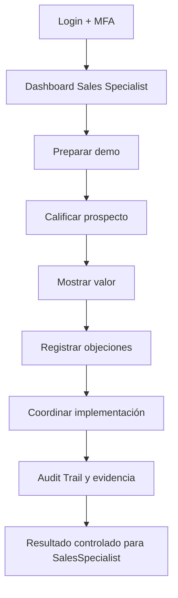
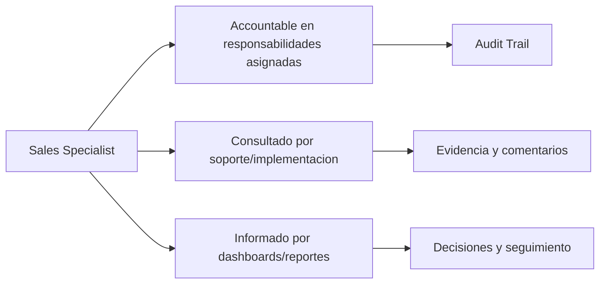

# Compliance 360 Academy

## Sales Specialist Certification

## Portada

| Campo | Valor |
| --- | --- |
| Rol | Sales Specialist |
| Nivel | Intermediate / Commercial |
| Duración | 16 horas |
| Objetivo | Formar equipo comercial para vender Compliance 360 con demos honestas y orientadas a valor. |
| Prerrequisitos | Conocer venta consultiva B2B SaaS y problemas de compliance/calidad. |
| Ruta de aprendizaje | Fundamentos -> Seguridad -> Módulos -> Operación -> Escenarios -> Evaluación -> Certificación |
| Certificación asociada | Compliance 360 Certified Consultant |
| Estado | Markdown maestro. No generar Word hasta aprobación. |

---

# CAPÍTULO 1 - Introducción al Rol

## ¿Quién es?

El `Sales Specialist` es un perfil formal de Compliance 360 Academy. Su entrenamiento está diseñado para que pueda usar la plataforma sin revisar código fuente, entendiendo módulos, permisos, responsabilidades, riesgos y límites reales del producto.

## ¿Qué responsabilidades tiene?

| Responsabilidad | Dueño | Prioridad | Evidencia esperada |
| --- | --- | --- | --- |
| Diagnosticar dolor | Sales Specialist | Alta | Evidencia en Audit Trail / reporte / registro |
| Ejecutar demo | Sales Specialist | Alta | Evidencia en Audit Trail / reporte / registro |
| Explicar beneficios | Sales Specialist | Alta | Evidencia en Audit Trail / reporte / registro |
| Manejar objeciones | Sales Specialist | Alta | Evidencia en Audit Trail / reporte / registro |
| Diferenciar estado real | Sales Specialist | Alta | Evidencia en Audit Trail / reporte / registro |

## ¿Qué puede hacer?

- Diagnosticar dolor
- Ejecutar demo
- Explicar beneficios
- Manejar objeciones
- Diferenciar estado real

## ¿Qué no puede hacer?

- Prometer módulos pendientes como completos
- Ocultar brechas
- Vender sin discovery
- Hablar de seguridad sin límites claros

## Flujo operativo del rol

## Matriz de responsabilidades

| Responsabilidad | Dueño | Prioridad | Evidencia esperada |
| --- | --- | --- | --- |
| Diagnosticar dolor | Sales Specialist | Alta | Evidencia en Audit Trail / reporte / registro |
| Ejecutar demo | Sales Specialist | Alta | Evidencia en Audit Trail / reporte / registro |
| Explicar beneficios | Sales Specialist | Alta | Evidencia en Audit Trail / reporte / registro |
| Manejar objeciones | Sales Specialist | Alta | Evidencia en Audit Trail / reporte / registro |
| Diferenciar estado real | Sales Specialist | Alta | Evidencia en Audit Trail / reporte / registro |

## Matriz RACI

| Proceso | Sales Specialist | Tenant Admin | Quality Manager | Support Engineer | Consultora Admin |
| --- | --- | --- | --- | --- | --- |
| Demo 15 minutos | R/A | I | I | C | C |
| Demo 30 minutos | R/A | I | I | C | C |
| Demo 60 minutos | R/A | I | I | C | C |
| Manejo de objeción | R/A | I | I | C | C |
| Discovery | R/A | I | I | C | C |
| Propuesta | R/A | I | I | C | C |
| Cierre técnico | R/A | I | I | C | C |

---

# CAPÍTULO 2 - Módulos que utiliza

## Módulos asignados al rol

| Módulo | Para qué sirve | Cuándo lo usa |
| --- | --- | --- |
| Dashboard | Sirve para dashboard | Se usa cuando el rol necesita operar o consultar esta capacidad |
| Document Management | Sirve para document management | Se usa cuando el rol necesita operar o consultar esta capacidad |
| Supplier Management | Sirve para supplier management | Se usa cuando el rol necesita operar o consultar esta capacidad |
| Audit Management | Sirve para audit management | Se usa cuando el rol necesita operar o consultar esta capacidad |
| CAPA Management | Sirve para capa management | Se usa cuando el rol necesita operar o consultar esta capacidad |
| Risk Management | Sirve para risk management | Se usa cuando el rol necesita operar o consultar esta capacidad |
| Quality Indicators | Sirve para quality indicators | Se usa cuando el rol necesita operar o consultar esta capacidad |
| Reporting Engine | Sirve para reporting engine | Se usa cuando el rol necesita operar o consultar esta capacidad |
| Audit Trail | Sirve para audit trail | Se usa cuando el rol necesita operar o consultar esta capacidad |
| Observability | Sirve para observability | Se usa cuando el rol necesita operar o consultar esta capacidad |

## Matriz de módulos

| Módulo | Tipo de uso | Frecuencia | Nota de estado |
| --- | --- | --- | --- |
| Dashboard | Uso principal | Diario/Semanal | Ver estado real en Handbook |
| Document Management | Uso principal | Diario/Semanal | Ver estado real en Handbook |
| Supplier Management | Uso principal | Diario/Semanal | Ver estado real en Handbook |
| Audit Management | Uso principal | Diario/Semanal | Ver estado real en Handbook |
| CAPA Management | Uso principal | Diario/Semanal | Ver estado real en Handbook |
| Risk Management | Uso complementario | Según evento | Ver estado real en Handbook |
| Quality Indicators | Uso complementario | Según evento | Ver estado real en Handbook |
| Reporting Engine | Uso complementario | Según evento | Ver estado real en Handbook |
| Audit Trail | Uso complementario | Según evento | Ver estado real en Handbook |
| Observability | Uso complementario | Según evento | Ver estado real en Handbook |

## Diagrama de responsabilidades

---

# CAPÍTULO 3 - Configuración Inicial

## Objetivo

Preparar el acceso y el entorno de trabajo del rol `Sales Specialist` para operar sin fricción.

## Paso a paso

1. Crear o validar usuario en el tenant correcto.
2. Asignar rol y permisos correspondientes.
3. Activar MFA si el tenant lo requiere.
4. Validar acceso a dashboard.
5. Validar acceso a módulos asignados.
6. Probar operación mínima permitida.
7. Confirmar que Audit Trail registra eventos clave.
8. Documentar restricciones del rol.

## Pantalla por pantalla

| Pantalla | Acción esperada | Resultado |
| --- | --- | --- |
| Login | Ingresar credenciales y completar MFA si aplica | Sesión activa |
| Dashboard | Revisar indicadores y alertas | Prioridades visibles |
| Módulos asignados | Validar acceso según matriz | Acceso autorizado |
| Reportes | Consultar datos según permiso | Reporte visible |
| Audit Trail | Confirmar trazabilidad si aplica | Evento registrado |

## Proceso por proceso

Cada proceso debe ejecutarse con tenant, permiso y evidencia correctos. Si aparece `401`, el usuario debe renovar sesión. Si aparece `403`, debe solicitar ajuste de rol, no intentar rodear el control.

---

# CAPÍTULO 4 - Operación Diaria

## ¿Qué hace al iniciar sesión?

| Tarea | Frecuencia | Resultado esperado |
| --- | --- | --- |
| Preparar demo | Diario | Validar resultado en dashboard/audit trail |
| Calificar prospecto | Diario | Validar resultado en dashboard/audit trail |
| Mostrar valor | Diario | Validar resultado en dashboard/audit trail |
| Registrar objeciones | Diario | Validar resultado en dashboard/audit trail |
| Coordinar implementación | Diario | Validar resultado en dashboard/audit trail |

## ¿Qué revisa?

- Estado general del dashboard.
- Tareas asignadas.
- Alertas relacionadas con sus módulos.
- Reportes o indicadores relevantes.
- Evidencia pendiente o procesos vencidos.

## ¿Qué tareas ejecuta?

- Preparar demo
- Calificar prospecto
- Mostrar valor
- Registrar objeciones
- Coordinar implementación

## ¿Qué indicadores debe monitorear?

| Indicador | Uso | Acción esperada |
| --- | --- | --- |
| Tasa de demo | Monitorear tendencia | Escalar desviaciones |
| Conversión piloto | Monitorear tendencia | Escalar desviaciones |
| Objeciones | Monitorear tendencia | Escalar desviaciones |
| Módulos más valorados | Monitorear tendencia | Escalar desviaciones |
| Tiempo de cierre | Monitorear tendencia | Escalar desviaciones |

---

# CAPÍTULO 5 - Procesos Paso a Paso

Los procesos de este capítulo reemplazan la versión genérica anterior. Cada flujo incluye pantalla, decisión, resultado esperado y evidencia.

## 5.1 Discovery Enterprise con SPIN

**Objetivo:** Descubrir dolor, impacto y necesidad antes de demo.

**Pantallas / áreas usadas:** CRM/Discovery notes; Demo tenant; Handbook

**Prerrequisitos específicos:**

- Buyer persona identificado
- Industria y norma objetivo

**Paso a paso operativo:**

1. Abrir discovery con contexto del cliente.
2. Preguntar Situación: procesos actuales, herramientas y auditorías.
3. Preguntar Problema: pérdidas de evidencia, CAPA vencidas, reportes manuales.
4. Preguntar Implicación: costo de auditoría fallida, tiempo, riesgo comercial.
5. Preguntar Need-payoff: valor esperado de trazabilidad y dashboards.
6. Mapear módulos que resuelven el dolor.
7. Identificar brechas que no deben prometerse.
8. Registrar próximos pasos.
9. Definir demo personalizada.
10. Confirmar criterio de éxito.

**Decisiones clave:**

- **Dolor no claro:** no demo profunda todavía.
- **Brecha solicitada:** presentar roadmap honestamente.

**Resultado esperado:**

- Discovery con hipótesis de valor

**Evidencias requeridas:**

- Notas SPIN
- Dolores
- Criterios de demo

**Errores comunes a evitar:**

- Demo sin discovery
- Prometer portales finales
- No identificar decisor

**Validación de cierre:** el `Sales Specialist` debe poder explicar qué cambió, quién aprobó, qué evidencia quedó, qué riesgo se redujo y dónde se consulta la trazabilidad.

## 5.2 Calificación BANT y MEDDIC

**Objetivo:** Determinar si la oportunidad es real y cómo avanzar.

**Pantallas / áreas usadas:** Sales pipeline; Qualification sheet

**Prerrequisitos específicos:**

- Contacto comercial
- Caso de uso

**Paso a paso operativo:**

1. Evaluar Budget: presupuesto o rango.
2. Evaluar Authority: sponsor, usuario, IT, compras.
3. Evaluar Need: cumplimiento, calidad, auditoría, riesgos.
4. Evaluar Timeline: auditoría, go-live o renovación.
5. MEDDIC Metrics: horas ahorradas, CAPA vencidas, auditorías.
6. Economic Buyer: quién aprueba.
7. Decision Criteria: seguridad, módulos, precio.
8. Decision Process: pasos de compra.
9. Identify Pain: impacto operativo.
10. Champion: usuario interno que impulsa.

**Decisiones clave:**

- **Sin dolor:** nutrir, no forecast.
- **Sin autoridad:** buscar sponsor.

**Resultado esperado:**

- Oportunidad calificada

**Evidencias requeridas:**

- BANT
- MEDDIC
- Next steps

**Errores comunes a evitar:**

- Forecast falso
- No identificar comprador
- No conocer criterios

**Validación de cierre:** el `Sales Specialist` debe poder explicar qué cambió, quién aprobó, qué evidencia quedó, qué riesgo se redujo y dónde se consulta la trazabilidad.

## 5.3 Demo storytelling 15/30/60

**Objetivo:** Mostrar Compliance 360 según audiencia y tiempo.

**Pantallas / áreas usadas:** Demo tenant; Dashboard; Modules

**Prerrequisitos específicos:**

- Demo data cargada
- Dolores priorizados

**Paso a paso operativo:**

1. Abrir con historia: auditoría próxima y evidencias dispersas.
2. Mostrar dashboard ejecutivo.
3. Mostrar documento vigente y audit trail.
4. Mostrar hallazgo → CAPA → evidencia.
5. Mostrar riesgo e indicador fuera de meta.
6. Mostrar reporte ejecutivo.
7. Mostrar integraciones si IT está presente.
8. Declarar límites de workspaces/portales.
9. Cerrar con ROI y plan de implementación.
10. Confirmar siguiente paso.

**Decisiones clave:**

- **Audiencia ejecutiva:** menos configuración, más valor.
- **Audiencia técnica:** mostrar seguridad/observabilidad.

**Resultado esperado:**

- Demo conectada al dolor

**Evidencias requeridas:**

- Guion
- Feedback
- Objeciones

**Errores comunes a evitar:**

- Demo genérica
- Mostrar features no listas
- Ignorar tiempo

**Validación de cierre:** el `Sales Specialist` debe poder explicar qué cambió, quién aprobó, qué evidencia quedó, qué riesgo se redujo y dónde se consulta la trazabilidad.

## 5.4 ROI, propuesta y cierre

**Objetivo:** Convertir valor operativo en propuesta defendible.

**Pantallas / áreas usadas:** ROI calculator; Proposal; Closing plan

**Prerrequisitos específicos:**

- Dolores cuantificados
- Alcance definido

**Paso a paso operativo:**

1. Calcular horas de auditoría ahorradas.
2. Calcular reducción de CAPA vencidas.
3. Estimar reducción de reprocesos documentales.
4. Cuantificar riesgo de auditoría fallida.
5. Construir propuesta por fases.
6. Separar core disponible de roadmap.
7. Definir servicios de implementación.
8. Presentar ROI y payback.
9. Manejar objeciones finales.
10. Cerrar piloto o contrato.

**Decisiones clave:**

- **ROI débil:** buscar métrica real adicional.
- **Feature pendiente:** fasear propuesta.

**Resultado esperado:**

- Propuesta honesta y accionable

**Evidencias requeridas:**

- ROI
- Propuesta
- Plan cierre

**Errores comunes a evitar:**

- Inflar ROI
- No separar roadmap
- Descuento sin valor

**Validación de cierre:** el `Sales Specialist` debe poder explicar qué cambió, quién aprobó, qué evidencia quedó, qué riesgo se redujo y dónde se consulta la trazabilidad.

---

# CAPÍTULO 6 - Escenarios Reales

Todos los escenarios fueron reemplazados por casos empresariales con datos, decisiones y consecuencias.

## 6.1 Escenario: Discovery con consultora ISO

**Contexto real:** Consultora opera 18 clientes con Excel y carpetas.

**Datos iniciales:**

- 18 clientes
- 6 consultores
- Auditorías mensuales

**Decisiones que debe tomar el `Sales Specialist`:**

- **Dolor:** Multitenancy y reportes.
- **Demo:** Tenant + dashboards + auditorías.

**Acciones esperadas:**

1. Aplicar SPIN.
2. Mapear clientes.
3. Preparar demo.
4. Proponer piloto.

**Resultado esperado:** Oportunidad calificada con caso multicliente.

**Consecuencias si se ejecuta mal:**

- Demo irrelevante
- No captar valor consultora

**Criterios de evaluación:** el caso se aprueba si el estudiante identifica el módulo correcto, aplica permisos adecuados, documenta evidencia, toma decisiones justificadas y deja trazabilidad auditable.

## 6.2 Escenario: Empresa alimentaria antes de auditoría

**Contexto real:** Cliente tiene auditoría ISO 22000 en 60 días.

**Datos iniciales:**

- CAPA vencidas
- Proveedor HACCP vencido
- Documentos dispersos

**Decisiones que debe tomar el `Sales Specialist`:**

- **Urgencia:** Implementación faseada.
- **Valor:** Evidencia y CAPA primero.

**Acciones esperadas:**

1. Calificar BANT.
2. Demo CAPA/proveedor/documentos.
3. Proponer 4 semanas.

**Resultado esperado:** Propuesta alineada a auditoría.

**Consecuencias si se ejecuta mal:**

- Prometer LMS/regulatory
- No priorizar core

**Criterios de evaluación:** el caso se aprueba si el estudiante identifica el módulo correcto, aplica permisos adecuados, documenta evidencia, toma decisiones justificadas y deja trazabilidad auditable.

## 6.3 Escenario: Objeción por portales

**Contexto real:** Cliente exige portal proveedor externo completo.

**Datos iniciales:**

- Supplier Portal actual workspace
- Necesidad futura

**Decisiones que debe tomar el `Sales Specialist`:**

- **Honestidad:** Aclarar estado.
- **Estrategia:** Ofrecer Supplier Management core + roadmap.

**Acciones esperadas:**

1. Reconocer necesidad.
2. Mostrar core actual.
3. Explicar roadmap.
4. Fasear propuesta.

**Resultado esperado:** Objeción manejada sin promesa falsa.

**Consecuencias si se ejecuta mal:**

- Contrato riesgoso
- Pérdida confianza

**Criterios de evaluación:** el caso se aprueba si el estudiante identifica el módulo correcto, aplica permisos adecuados, documenta evidencia, toma decisiones justificadas y deja trazabilidad auditable.

## 6.4 Escenario: Objeción por precio

**Contexto real:** Compras dice que Excel es gratis.

**Datos iniciales:**

- 10 horas/semana reportes
- 2 auditorías fallidas
- CAPA vencidas

**Decisiones que debe tomar el `Sales Specialist`:**

- **ROI:** Cuantificar costo oculto.
- **Valor:** Riesgo + productividad.

**Acciones esperadas:**

1. Calcular horas.
2. Cuantificar riesgo.
3. Mostrar dashboard.
4. Presentar payback.

**Resultado esperado:** Precio defendido por ROI.

**Consecuencias si se ejecuta mal:**

- Competir solo por precio
- Descuento prematuro

**Criterios de evaluación:** el caso se aprueba si el estudiante identifica el módulo correcto, aplica permisos adecuados, documenta evidencia, toma decisiones justificadas y deja trazabilidad auditable.

## 6.5 Escenario: Demo ejecutiva 15 minutos

**Contexto real:** CEO solo tiene 15 minutos.

**Datos iniciales:**

- Interés: riesgos y cumplimiento
- No quiere configuración

**Decisiones que debe tomar el `Sales Specialist`:**

- **Narrativa:** Dashboard → riesgo → CAPA → reporte.
- **Tiempo:** No abrir pantallas técnicas.

**Acciones esperadas:**

1. Abrir dashboard.
2. Mostrar riesgos altos.
3. Mostrar CAPA crítica.
4. Cerrar con reporte.

**Resultado esperado:** CEO entiende valor en 15 minutos.

**Consecuencias si se ejecuta mal:**

- Demo técnica aburrida
- Perder sponsor

**Criterios de evaluación:** el caso se aprueba si el estudiante identifica el módulo correcto, aplica permisos adecuados, documenta evidencia, toma decisiones justificadas y deja trazabilidad auditable.

## 6.6 Escenario: Demo técnica con IT

**Contexto real:** IT pregunta seguridad, MFA, storage y observability.

**Datos iniciales:**

- Requisitos: MFA, CORS, logs, provider

**Decisiones que debe tomar el `Sales Specialist`:**

- **Técnico:** Mostrar hardening y observability.
- **Límites:** Explicar infraestructura requerida.

**Acciones esperadas:**

1. Mostrar MFA.
2. Mostrar integrations.
3. Mostrar health.
4. Mostrar CI/CD.

**Resultado esperado:** IT valida viabilidad.

**Consecuencias si se ejecuta mal:**

- No responder seguridad
- Inventar certificaciones

**Criterios de evaluación:** el caso se aprueba si el estudiante identifica el módulo correcto, aplica permisos adecuados, documenta evidencia, toma decisiones justificadas y deja trazabilidad auditable.

## 6.7 Escenario: MEDDIC sin champion

**Contexto real:** Hay dolor pero nadie impulsa internamente.

**Datos iniciales:**

- Quality interesado
- Compras pasivo
- CEO ausente

**Decisiones que debe tomar el `Sales Specialist`:**

- **Champion:** Identificar aliado.
- **Proceso:** No forecast alto.

**Acciones esperadas:**

1. Mapear stakeholders.
2. Buscar champion.
3. Enviar business case.
4. Agendar sponsor.

**Resultado esperado:** Oportunidad reencauzada.

**Consecuencias si se ejecuta mal:**

- Forecast falso
- Ciclo estancado

**Criterios de evaluación:** el caso se aprueba si el estudiante identifica el módulo correcto, aplica permisos adecuados, documenta evidencia, toma decisiones justificadas y deja trazabilidad auditable.

## 6.8 Escenario: Competidor genérico GRC

**Contexto real:** Cliente compara con herramienta GRC horizontal.

**Datos iniciales:**

- Competidor fuerte
- Dolor calidad/ISO
- Necesita CAPA

**Decisiones que debe tomar el `Sales Specialist`:**

- **Posicionamiento:** Compliance 360 especializado en calidad operativa.
- **Diferenciación:** CAPA/riesgos/proveedores/documentos.

**Acciones esperadas:**

1. Comparar casos.
2. Mostrar flujo core.
3. Diferenciar implementación.

**Resultado esperado:** Cliente entiende diferenciador.

**Consecuencias si se ejecuta mal:**

- Competir feature por feature
- No destacar vertical

**Criterios de evaluación:** el caso se aprueba si el estudiante identifica el módulo correcto, aplica permisos adecuados, documenta evidencia, toma decisiones justificadas y deja trazabilidad auditable.

## 6.9 Escenario: Propuesta por fases

**Contexto real:** Cliente quiere todo pero presupuesto limitado.

**Datos iniciales:**

- Core urgente
- Portales deseados
- Presupuesto fase 1

**Decisiones que debe tomar el `Sales Specialist`:**

- **Faseo:** Core ahora, roadmap después.
- **Riesgo:** No vender todo incompleto.

**Acciones esperadas:**

1. Separar alcance.
2. Definir fase 1.
3. Definir roadmap.
4. Cerrar piloto.

**Resultado esperado:** Propuesta viable.

**Consecuencias si se ejecuta mal:**

- Sobrepromesa
- Proyecto imposible

**Criterios de evaluación:** el caso se aprueba si el estudiante identifica el módulo correcto, aplica permisos adecuados, documenta evidencia, toma decisiones justificadas y deja trazabilidad auditable.

## 6.10 Escenario: Cierre técnico

**Contexto real:** IT aprueba si hay plan implementación y soporte.

**Datos iniciales:**

- UAT requerido
- Security review
- Go-live plan

**Decisiones que debe tomar el `Sales Specialist`:**

- **Cierre:** Incluir implementation specialist.
- **Confianza:** Mostrar plan 4 semanas.

**Acciones esperadas:**

1. Presentar plan.
2. Acordar UAT.
3. Definir soporte.
4. Cerrar decisión.

**Resultado esperado:** Cierre con plan técnico aceptado.

**Consecuencias si se ejecuta mal:**

- Cierre sin IT
- Riesgo postventa

**Criterios de evaluación:** el caso se aprueba si el estudiante identifica el módulo correcto, aplica permisos adecuados, documenta evidencia, toma decisiones justificadas y deja trazabilidad auditable.

---

# CAPÍTULO 7 - Mejores Prácticas

## ISO 9001

- Mantener evidencia trazable de cambios, aprobaciones y cierres.
- Usar roles claros para evitar conflictos de interés.
- Medir desempeño con indicadores y revisar tendencias.
- Gestionar no conformidades mediante CAPA con causa raíz y efectividad.

## ISO 22000, HACCP y BPM

- Controlar documentos de inocuidad y BPM como documentos vigentes.
- Vincular proveedores críticos con certificaciones y evaluaciones.
- Registrar riesgos de inocuidad con controles y tratamiento.
- Mantener evidencias de acciones preventivas y correctivas.

## Buenas prácticas SaaS

- No compartir usuarios.
- Activar MFA para roles sensibles.
- Usar permisos mínimos necesarios.
- Validar providers de email/storage antes de producción.
- Escalar errores técnicos con evidencia, hora, tenant y correlation id.

---

# CAPÍTULO 8 - Errores Comunes

| Error | Consecuencia | Prevención |
| --- | --- | --- |
| Operar en tenant incorrecto | Riesgo de privacidad y datos cruzados | Confirmar tenant al iniciar |
| Usar rol con permisos excesivos | Falta de segregación | Revisar matriz RBAC |
| Cerrar sin evidencia | Debilidad ante auditoría | Adjuntar evidencia antes de cierre |
| Ignorar módulos en estado workspace | Promesa comercial incorrecta | Aplicar regla de honestidad |
| No revisar Audit Trail | Falta de trazabilidad | Validar eventos clave |
| No probar providers | Fallas de email/storage en producción | Ejecutar tests de conexión |
| Compartir credenciales | Riesgo de seguridad | Usuario individual por persona |
| Omitir MFA | Mayor exposición de acceso | Activar MFA en roles críticos |
| No documentar decisiones | Soporte y auditoría débiles | Registrar comentarios |
| No escalar a tiempo | SLA incumplido | Clasificar severidad |

---

# CAPÍTULO 9 - Checklist Operativo

## Checklist diario

- Confirmar acceso y tenant correcto.
- Revisar dashboard y tareas asignadas.
- Revisar alertas de módulos asignados.
- Ejecutar procesos prioritarios.
- Escalar bloqueos con evidencia.

## Checklist semanal

- Revisar reportes relevantes.
- Revisar tareas vencidas.
- Validar indicadores del rol.
- Confirmar que los procesos críticos tienen responsables.
- Revisar errores recurrentes.

## Checklist mensual

- Preparar comité o revisión ejecutiva.
- Auditar permisos del rol si aplica.
- Revisar tendencias y desviaciones.
- Confirmar cierre de procesos críticos.
- Documentar oportunidades de mejora.

## Checklist trimestral

- Revisar matriz de responsabilidades.
- Validar capacitación de usuarios.
- Revisar efectividad de controles.
- Actualizar procesos según cambios normativos.
- Preparar evidencia para auditorías.

---

# CAPÍTULO 10 - Evaluación Teórica

**Formato del examen:** 50 preguntas situacionales, 2 puntos por pregunta, 100 puntos totales.

**Regla de certificación:** las preguntas mezclan contexto, datos, problema, decisión y consecuencia. Las opciones incorrectas son plausibles y requieren criterio profesional.

## Pregunta 1

**Contexto:** Prospecto usa Excel y tiene auditoría en 60 días. Enfoque: Acción inmediata.

**Datos del sistema/caso:**

- Auditoría: 60 días
- CAPA vencidas: desconocidas
- Stakeholder: Quality

**Problema:** El rol `Sales Specialist` debe resolver `SPIN discovery` sin romper segregación, evidencia ni trazabilidad.

**Decisión requerida:** ¿Cuál es la primera acción correcta?

**Consecuencia de una mala decisión:** Si se elige mal, el proceso puede avanzar sin control.

A. Hacer demo completa de inmediato.
B. Preguntar implicación de auditoría fallida y cuantificar dolor antes de demo.
C. Preguntar solo presupuesto.
D. Demo irrelevante

**Respuesta correcta:** B

**Explicación:** La opción B es correcta porque aborda `SPIN discovery` con control verificable, decisión justificada y evidencia auditable. Las demás opciones son plausibles, pero dejan una brecha de cumplimiento, operación o certificación.

## Pregunta 2

**Contexto:** Prospecto usa Excel y tiene auditoría en 60 días. Enfoque: Decisión de aprobación.

**Datos del sistema/caso:**

- Auditoría: 60 días
- CAPA vencidas: desconocidas
- Stakeholder: Quality

**Problema:** El rol `Sales Specialist` debe resolver `SPIN discovery` sin romper segregación, evidencia ni trazabilidad.

**Decisión requerida:** ¿Qué decisión protege mejor la trazabilidad y el cumplimiento?

**Consecuencia de una mala decisión:** Una aprobación débil genera evidencia no defendible.

A. Preguntar solo presupuesto.
B. Mostrar observability a usuario de calidad.
C. Dolor no validado
D. Separar situación/problema/implicación/need-payoff.

**Respuesta correcta:** D

**Explicación:** La opción D es correcta porque aborda `SPIN discovery` con control verificable, decisión justificada y evidencia auditable. Las demás opciones son plausibles, pero dejan una brecha de cumplimiento, operación o certificación.

## Pregunta 3

**Contexto:** Prospecto usa Excel y tiene auditoría en 60 días. Enfoque: Evidencia.

**Datos del sistema/caso:**

- Auditoría: 60 días
- CAPA vencidas: desconocidas
- Stakeholder: Quality

**Problema:** El rol `Sales Specialist` debe resolver `SPIN discovery` sin romper segregación, evidencia ni trazabilidad.

**Decisión requerida:** ¿Qué evidencia mínima debe exigirse antes de cerrar o avanzar?

**Consecuencia de una mala decisión:** Sin evidencia objetiva no hay certificación defendible.

A. Mapear dolor a módulos core disponibles.
B. Mostrar observability a usuario de calidad.
C. Enviar propuesta estándar.
D. Oportunidad débil.

**Respuesta correcta:** A

**Explicación:** La opción A es correcta porque aborda `SPIN discovery` con control verificable, decisión justificada y evidencia auditable. Las demás opciones son plausibles, pero dejan una brecha de cumplimiento, operación o certificación.

## Pregunta 4

**Contexto:** Prospecto usa Excel y tiene auditoría en 60 días. Enfoque: Escalación.

**Datos del sistema/caso:**

- Auditoría: 60 días
- CAPA vencidas: desconocidas
- Stakeholder: Quality

**Problema:** El rol `Sales Specialist` debe resolver `SPIN discovery` sin romper segregación, evidencia ni trazabilidad.

**Decisión requerida:** ¿Cuándo debe escalarse el caso y a quién?

**Consecuencia de una mala decisión:** Escalar tarde puede producir incumplimiento, pérdida de SLA o riesgo contractual.

A. Enviar propuesta estándar.
B. Hacer demo completa de inmediato.
C. Registrar criterios de éxito de demo.
D. Demo irrelevante

**Respuesta correcta:** C

**Explicación:** La opción C es correcta porque aborda `SPIN discovery` con control verificable, decisión justificada y evidencia auditable. Las demás opciones son plausibles, pero dejan una brecha de cumplimiento, operación o certificación.

## Pregunta 5

**Contexto:** Prospecto usa Excel y tiene auditoría en 60 días. Enfoque: Prevención.

**Datos del sistema/caso:**

- Auditoría: 60 días
- CAPA vencidas: desconocidas
- Stakeholder: Quality

**Problema:** El rol `Sales Specialist` debe resolver `SPIN discovery` sin romper segregación, evidencia ni trazabilidad.

**Decisión requerida:** ¿Qué control evita la recurrencia del problema?

**Consecuencia de una mala decisión:** Resolver solo el síntoma deja el sistema expuesto a repetición.

A. Hacer demo completa de inmediato.
B. No prometer portales no finales.
C. Preguntar solo presupuesto.
D. Dolor no validado

**Respuesta correcta:** B

**Explicación:** La opción B es correcta porque aborda `SPIN discovery` con control verificable, decisión justificada y evidencia auditable. Las demás opciones son plausibles, pero dejan una brecha de cumplimiento, operación o certificación.

## Pregunta 6

**Contexto:** Quality quiere avanzar, pero no conoce presupuesto ni comprador económico. Enfoque: Acción inmediata.

**Datos del sistema/caso:**

- Need: alto
- Budget: desconocido
- Authority: no confirmado

**Problema:** El rol `Sales Specialist` debe resolver `BANT` sin romper segregación, evidencia ni trazabilidad.

**Decisión requerida:** ¿Cuál es la primera acción correcta?

**Consecuencia de una mala decisión:** Si se elige mal, el proceso puede avanzar sin control.

A. Marcar oportunidad como commit.
B. Enviar descuento para crear presupuesto.
C. Forecast falso
D. Calificar autoridad y presupuesto antes de forecast comprometido.

**Respuesta correcta:** D

**Explicación:** La opción D es correcta porque aborda `BANT` con control verificable, decisión justificada y evidencia auditable. Las demás opciones son plausibles, pero dejan una brecha de cumplimiento, operación o certificación.

## Pregunta 7

**Contexto:** Quality quiere avanzar, pero no conoce presupuesto ni comprador económico. Enfoque: Decisión de aprobación.

**Datos del sistema/caso:**

- Need: alto
- Budget: desconocido
- Authority: no confirmado

**Problema:** El rol `Sales Specialist` debe resolver `BANT` sin romper segregación, evidencia ni trazabilidad.

**Decisión requerida:** ¿Qué decisión protege mejor la trazabilidad y el cumplimiento?

**Consecuencia de una mala decisión:** Una aprobación débil genera evidencia no defendible.

A. Identificar sponsor económico y timeline.
B. Enviar descuento para crear presupuesto.
C. Saltar a contrato.
D. Ciclo estancado

**Respuesta correcta:** A

**Explicación:** La opción A es correcta porque aborda `BANT` con control verificable, decisión justificada y evidencia auditable. Las demás opciones son plausibles, pero dejan una brecha de cumplimiento, operación o certificación.

## Pregunta 8

**Contexto:** Quality quiere avanzar, pero no conoce presupuesto ni comprador económico. Enfoque: Evidencia.

**Datos del sistema/caso:**

- Need: alto
- Budget: desconocido
- Authority: no confirmado

**Problema:** El rol `Sales Specialist` debe resolver `BANT` sin romper segregación, evidencia ni trazabilidad.

**Decisión requerida:** ¿Qué evidencia mínima debe exigirse antes de cerrar o avanzar?

**Consecuencia de una mala decisión:** Sin evidencia objetiva no hay certificación defendible.

A. Saltar a contrato.
B. Evitar compras hasta el final.
C. Mantener oportunidad en discovery si BANT incompleto.
D. Pérdida tiempo.

**Respuesta correcta:** C

**Explicación:** La opción C es correcta porque aborda `BANT` con control verificable, decisión justificada y evidencia auditable. Las demás opciones son plausibles, pero dejan una brecha de cumplimiento, operación o certificación.

## Pregunta 9

**Contexto:** Quality quiere avanzar, pero no conoce presupuesto ni comprador económico. Enfoque: Escalación.

**Datos del sistema/caso:**

- Need: alto
- Budget: desconocido
- Authority: no confirmado

**Problema:** El rol `Sales Specialist` debe resolver `BANT` sin romper segregación, evidencia ni trazabilidad.

**Decisión requerida:** ¿Cuándo debe escalarse el caso y a quién?

**Consecuencia de una mala decisión:** Escalar tarde puede producir incumplimiento, pérdida de SLA o riesgo contractual.

A. Evitar compras hasta el final.
B. Proponer business case para obtener budget.
C. Marcar oportunidad como commit.
D. Forecast falso

**Respuesta correcta:** B

**Explicación:** La opción B es correcta porque aborda `BANT` con control verificable, decisión justificada y evidencia auditable. Las demás opciones son plausibles, pero dejan una brecha de cumplimiento, operación o certificación.

## Pregunta 10

**Contexto:** Quality quiere avanzar, pero no conoce presupuesto ni comprador económico. Enfoque: Prevención.

**Datos del sistema/caso:**

- Need: alto
- Budget: desconocido
- Authority: no confirmado

**Problema:** El rol `Sales Specialist` debe resolver `BANT` sin romper segregación, evidencia ni trazabilidad.

**Decisión requerida:** ¿Qué control evita la recurrencia del problema?

**Consecuencia de una mala decisión:** Resolver solo el síntoma deja el sistema expuesto a repetición.

A. Marcar oportunidad como commit.
B. No inflar probabilidad.
C. Enviar descuento para crear presupuesto.
D. Ciclo estancado

**Respuesta correcta:** B

**Explicación:** La opción B es correcta porque aborda `BANT` con control verificable, decisión justificada y evidencia auditable. Las demás opciones son plausibles, pero dejan una brecha de cumplimiento, operación o certificación.

## Pregunta 11

**Contexto:** Cliente compara herramientas y pide justificación ejecutiva. Enfoque: Acción inmediata.

**Datos del sistema/caso:**

- Metrics: horas auditoría
- Economic buyer: COO
- Decision criteria: seguridad/precio

**Problema:** El rol `Sales Specialist` debe resolver `MEDDIC` sin romper segregación, evidencia ni trazabilidad.

**Decisión requerida:** ¿Cuál es la primera acción correcta?

**Consecuencia de una mala decisión:** Si se elige mal, el proceso puede avanzar sin control.

A. Construir MEDDIC con métricas, buyer, criterios, proceso, pain y champion.
B. Enviar brochure genérico.
C. Competir solo por precio.
D. No decision

**Respuesta correcta:** A

**Explicación:** La opción A es correcta porque aborda `MEDDIC` con control verificable, decisión justificada y evidencia auditable. Las demás opciones son plausibles, pero dejan una brecha de cumplimiento, operación o certificación.

## Pregunta 12

**Contexto:** Cliente compara herramientas y pide justificación ejecutiva. Enfoque: Decisión de aprobación.

**Datos del sistema/caso:**

- Metrics: horas auditoría
- Economic buyer: COO
- Decision criteria: seguridad/precio

**Problema:** El rol `Sales Specialist` debe resolver `MEDDIC` sin romper segregación, evidencia ni trazabilidad.

**Decisión requerida:** ¿Qué decisión protege mejor la trazabilidad y el cumplimiento?

**Consecuencia de una mala decisión:** Una aprobación débil genera evidencia no defendible.

A. Competir solo por precio.
B. Ignorar champion.
C. Validar decision process y paper process.
D. Pérdida contra competidor

**Respuesta correcta:** C

**Explicación:** La opción C es correcta porque aborda `MEDDIC` con control verificable, decisión justificada y evidencia auditable. Las demás opciones son plausibles, pero dejan una brecha de cumplimiento, operación o certificación.

## Pregunta 13

**Contexto:** Cliente compara herramientas y pide justificación ejecutiva. Enfoque: Evidencia.

**Datos del sistema/caso:**

- Metrics: horas auditoría
- Economic buyer: COO
- Decision criteria: seguridad/precio

**Problema:** El rol `Sales Specialist` debe resolver `MEDDIC` sin romper segregación, evidencia ni trazabilidad.

**Decisión requerida:** ¿Qué evidencia mínima debe exigirse antes de cerrar o avanzar?

**Consecuencia de una mala decisión:** Sin evidencia objetiva no hay certificación defendible.

A. Ignorar champion.
B. Cuantificar pain con horas/CAPA/riesgos.
C. Presentar demo técnica al COO.
D. ROI débil.

**Respuesta correcta:** B

**Explicación:** La opción B es correcta porque aborda `MEDDIC` con control verificable, decisión justificada y evidencia auditable. Las demás opciones son plausibles, pero dejan una brecha de cumplimiento, operación o certificación.

## Pregunta 14

**Contexto:** Cliente compara herramientas y pide justificación ejecutiva. Enfoque: Escalación.

**Datos del sistema/caso:**

- Metrics: horas auditoría
- Economic buyer: COO
- Decision criteria: seguridad/precio

**Problema:** El rol `Sales Specialist` debe resolver `MEDDIC` sin romper segregación, evidencia ni trazabilidad.

**Decisión requerida:** ¿Cuándo debe escalarse el caso y a quién?

**Consecuencia de una mala decisión:** Escalar tarde puede producir incumplimiento, pérdida de SLA o riesgo contractual.

A. Presentar demo técnica al COO.
B. Preparar champion para venta interna.
C. Enviar brochure genérico.
D. No decision

**Respuesta correcta:** B

**Explicación:** La opción B es correcta porque aborda `MEDDIC` con control verificable, decisión justificada y evidencia auditable. Las demás opciones son plausibles, pero dejan una brecha de cumplimiento, operación o certificación.

## Pregunta 15

**Contexto:** Cliente compara herramientas y pide justificación ejecutiva. Enfoque: Prevención.

**Datos del sistema/caso:**

- Metrics: horas auditoría
- Economic buyer: COO
- Decision criteria: seguridad/precio

**Problema:** El rol `Sales Specialist` debe resolver `MEDDIC` sin romper segregación, evidencia ni trazabilidad.

**Decisión requerida:** ¿Qué control evita la recurrencia del problema?

**Consecuencia de una mala decisión:** Resolver solo el síntoma deja el sistema expuesto a repetición.

A. Enviar brochure genérico.
B. Competir solo por precio.
C. Pérdida contra competidor
D. No avanzar sin criterio de decisión.

**Respuesta correcta:** D

**Explicación:** La opción D es correcta porque aborda `MEDDIC` con control verificable, decisión justificada y evidencia auditable. Las demás opciones son plausibles, pero dejan una brecha de cumplimiento, operación o certificación.

## Pregunta 16

**Contexto:** Compras dice que Excel es gratis. Enfoque: Acción inmediata.

**Datos del sistema/caso:**

- Reportes: 10 h/semana
- Auditorías: 2/año
- CAPA vencidas: 14

**Problema:** El rol `Sales Specialist` debe resolver `ROI` sin romper segregación, evidencia ni trazabilidad.

**Decisión requerida:** ¿Cuál es la primera acción correcta?

**Consecuencia de una mala decisión:** Si se elige mal, el proceso puede avanzar sin control.

A. Descontar 40% inmediatamente.
B. Decir que Excel no sirve.
C. Calcular costo oculto de horas, riesgo y reprocesos antes de defender precio.
D. Venta por precio

**Respuesta correcta:** C

**Explicación:** La opción C es correcta porque aborda `ROI` con control verificable, decisión justificada y evidencia auditable. Las demás opciones son plausibles, pero dejan una brecha de cumplimiento, operación o certificación.

## Pregunta 17

**Contexto:** Compras dice que Excel es gratis. Enfoque: Decisión de aprobación.

**Datos del sistema/caso:**

- Reportes: 10 h/semana
- Auditorías: 2/año
- CAPA vencidas: 14

**Problema:** El rol `Sales Specialist` debe resolver `ROI` sin romper segregación, evidencia ni trazabilidad.

**Decisión requerida:** ¿Qué decisión protege mejor la trazabilidad y el cumplimiento?

**Consecuencia de una mala decisión:** Una aprobación débil genera evidencia no defendible.

A. Decir que Excel no sirve.
B. Comparar costo de no cumplimiento vs suscripción.
C. Ignorar ROI y hablar de features.
D. ROI no creíble

**Respuesta correcta:** B

**Explicación:** La opción B es correcta porque aborda `ROI` con control verificable, decisión justificada y evidencia auditable. Las demás opciones son plausibles, pero dejan una brecha de cumplimiento, operación o certificación.

## Pregunta 18

**Contexto:** Compras dice que Excel es gratis. Enfoque: Evidencia.

**Datos del sistema/caso:**

- Reportes: 10 h/semana
- Auditorías: 2/año
- CAPA vencidas: 14

**Problema:** El rol `Sales Specialist` debe resolver `ROI` sin romper segregación, evidencia ni trazabilidad.

**Decisión requerida:** ¿Qué evidencia mínima debe exigirse antes de cerrar o avanzar?

**Consecuencia de una mala decisión:** Sin evidencia objetiva no hay certificación defendible.

A. Ignorar ROI y hablar de features.
B. Usar ROI conservador y verificable.
C. Prometer ahorro sin datos.
D. Objeción vuelve.

**Respuesta correcta:** B

**Explicación:** La opción B es correcta porque aborda `ROI` con control verificable, decisión justificada y evidencia auditable. Las demás opciones son plausibles, pero dejan una brecha de cumplimiento, operación o certificación.

## Pregunta 19

**Contexto:** Compras dice que Excel es gratis. Enfoque: Escalación.

**Datos del sistema/caso:**

- Reportes: 10 h/semana
- Auditorías: 2/año
- CAPA vencidas: 14

**Problema:** El rol `Sales Specialist` debe resolver `ROI` sin romper segregación, evidencia ni trazabilidad.

**Decisión requerida:** ¿Cuándo debe escalarse el caso y a quién?

**Consecuencia de una mala decisión:** Escalar tarde puede producir incumplimiento, pérdida de SLA o riesgo contractual.

A. Prometer ahorro sin datos.
B. Descontar 40% inmediatamente.
C. Venta por precio
D. Incluir implementación en payback.

**Respuesta correcta:** D

**Explicación:** La opción D es correcta porque aborda `ROI` con control verificable, decisión justificada y evidencia auditable. Las demás opciones son plausibles, pero dejan una brecha de cumplimiento, operación o certificación.

## Pregunta 20

**Contexto:** Compras dice que Excel es gratis. Enfoque: Prevención.

**Datos del sistema/caso:**

- Reportes: 10 h/semana
- Auditorías: 2/año
- CAPA vencidas: 14

**Problema:** El rol `Sales Specialist` debe resolver `ROI` sin romper segregación, evidencia ni trazabilidad.

**Decisión requerida:** ¿Qué control evita la recurrencia del problema?

**Consecuencia de una mala decisión:** Resolver solo el síntoma deja el sistema expuesto a repetición.

A. No inflar ahorros.
B. Descontar 40% inmediatamente.
C. Decir que Excel no sirve.
D. ROI no creíble

**Respuesta correcta:** A

**Explicación:** La opción A es correcta porque aborda `ROI` con control verificable, decisión justificada y evidencia auditable. Las demás opciones son plausibles, pero dejan una brecha de cumplimiento, operación o certificación.

## Pregunta 21

**Contexto:** Cliente exige portal proveedor externo completo. Enfoque: Acción inmediata.

**Datos del sistema/caso:**

- Supplier Portal: workspace
- Supplier Management: core
- Need: proveedores

**Problema:** El rol `Sales Specialist` debe resolver `Objeción por portales` sin romper segregación, evidencia ni trazabilidad.

**Decisión requerida:** ¿Cuál es la primera acción correcta?

**Consecuencia de una mala decisión:** Si se elige mal, el proceso puede avanzar sin control.

A. Decir que portal está completo.
B. Aclarar estado real y proponer Supplier Management core + roadmap.
C. Evitar tema hasta contrato.
D. Riesgo contractual

**Respuesta correcta:** B

**Explicación:** La opción B es correcta porque aborda `Objeción por portales` con control verificable, decisión justificada y evidencia auditable. Las demás opciones son plausibles, pero dejan una brecha de cumplimiento, operación o certificación.

## Pregunta 22

**Contexto:** Cliente exige portal proveedor externo completo. Enfoque: Decisión de aprobación.

**Datos del sistema/caso:**

- Supplier Portal: workspace
- Supplier Management: core
- Need: proveedores

**Problema:** El rol `Sales Specialist` debe resolver `Objeción por portales` sin romper segregación, evidencia ni trazabilidad.

**Decisión requerida:** ¿Qué decisión protege mejor la trazabilidad y el cumplimiento?

**Consecuencia de una mala decisión:** Una aprobación débil genera evidencia no defendible.

A. Evitar tema hasta contrato.
B. Fasear portal externo como etapa futura.
C. Prometer custom sin estimación.
D. Pérdida confianza

**Respuesta correcta:** B

**Explicación:** La opción B es correcta porque aborda `Objeción por portales` con control verificable, decisión justificada y evidencia auditable. Las demás opciones son plausibles, pero dejan una brecha de cumplimiento, operación o certificación.

## Pregunta 23

**Contexto:** Cliente exige portal proveedor externo completo. Enfoque: Evidencia.

**Datos del sistema/caso:**

- Supplier Portal: workspace
- Supplier Management: core
- Need: proveedores

**Problema:** El rol `Sales Specialist` debe resolver `Objeción por portales` sin romper segregación, evidencia ni trazabilidad.

**Decisión requerida:** ¿Qué evidencia mínima debe exigirse antes de cerrar o avanzar?

**Consecuencia de una mala decisión:** Sin evidencia objetiva no hay certificación defendible.

A. Prometer custom sin estimación.
B. Descalificar necesidad.
C. Implementación fallida.
D. Mostrar flujo actual de documentos proveedor.

**Respuesta correcta:** D

**Explicación:** La opción D es correcta porque aborda `Objeción por portales` con control verificable, decisión justificada y evidencia auditable. Las demás opciones son plausibles, pero dejan una brecha de cumplimiento, operación o certificación.

## Pregunta 24

**Contexto:** Cliente exige portal proveedor externo completo. Enfoque: Escalación.

**Datos del sistema/caso:**

- Supplier Portal: workspace
- Supplier Management: core
- Need: proveedores

**Problema:** El rol `Sales Specialist` debe resolver `Objeción por portales` sin romper segregación, evidencia ni trazabilidad.

**Decisión requerida:** ¿Cuándo debe escalarse el caso y a quién?

**Consecuencia de una mala decisión:** Escalar tarde puede producir incumplimiento, pérdida de SLA o riesgo contractual.

A. Documentar límite en propuesta.
B. Descalificar necesidad.
C. Decir que portal está completo.
D. Riesgo contractual

**Respuesta correcta:** A

**Explicación:** La opción A es correcta porque aborda `Objeción por portales` con control verificable, decisión justificada y evidencia auditable. Las demás opciones son plausibles, pero dejan una brecha de cumplimiento, operación o certificación.

## Pregunta 25

**Contexto:** Cliente exige portal proveedor externo completo. Enfoque: Prevención.

**Datos del sistema/caso:**

- Supplier Portal: workspace
- Supplier Management: core
- Need: proveedores

**Problema:** El rol `Sales Specialist` debe resolver `Objeción por portales` sin romper segregación, evidencia ni trazabilidad.

**Decisión requerida:** ¿Qué control evita la recurrencia del problema?

**Consecuencia de una mala decisión:** Resolver solo el síntoma deja el sistema expuesto a repetición.

A. Decir que portal está completo.
B. Evitar tema hasta contrato.
C. No vender workspace como portal final.
D. Pérdida confianza

**Respuesta correcta:** C

**Explicación:** La opción C es correcta porque aborda `Objeción por portales` con control verificable, decisión justificada y evidencia auditable. Las demás opciones son plausibles, pero dejan una brecha de cumplimiento, operación o certificación.

## Pregunta 26

**Contexto:** Competidor GRC horizontal promete muchas integraciones. Enfoque: Acción inmediata.

**Datos del sistema/caso:**

- Competidor: GRC
- Dolor: calidad ISO
- Cliente: alimentos

**Problema:** El rol `Sales Specialist` debe resolver `Competitive positioning` sin romper segregación, evidencia ni trazabilidad.

**Decisión requerida:** ¿Cuál es la primera acción correcta?

**Consecuencia de una mala decisión:** Si se elige mal, el proceso puede avanzar sin control.

A. Decir que Compliance 360 hace todo igual.
B. Posicionar Compliance 360 como plataforma operativa de calidad/compliance, no GRC genérico.
C. Atacar competidor sin evidencia.
D. Diferenciación débil

**Respuesta correcta:** B

**Explicación:** La opción B es correcta porque aborda `Competitive positioning` con control verificable, decisión justificada y evidencia auditable. Las demás opciones son plausibles, pero dejan una brecha de cumplimiento, operación o certificación.

## Pregunta 27

**Contexto:** Competidor GRC horizontal promete muchas integraciones. Enfoque: Decisión de aprobación.

**Datos del sistema/caso:**

- Competidor: GRC
- Dolor: calidad ISO
- Cliente: alimentos

**Problema:** El rol `Sales Specialist` debe resolver `Competitive positioning` sin romper segregación, evidencia ni trazabilidad.

**Decisión requerida:** ¿Qué decisión protege mejor la trazabilidad y el cumplimiento?

**Consecuencia de una mala decisión:** Una aprobación débil genera evidencia no defendible.

A. Atacar competidor sin evidencia.
B. Hablar solo de precio.
C. Sobrepromesa
D. Diferenciar CAPA, documentos, proveedores, riesgos e indicadores.

**Respuesta correcta:** D

**Explicación:** La opción D es correcta porque aborda `Competitive positioning` con control verificable, decisión justificada y evidencia auditable. Las demás opciones son plausibles, pero dejan una brecha de cumplimiento, operación o certificación.

## Pregunta 28

**Contexto:** Competidor GRC horizontal promete muchas integraciones. Enfoque: Evidencia.

**Datos del sistema/caso:**

- Competidor: GRC
- Dolor: calidad ISO
- Cliente: alimentos

**Problema:** El rol `Sales Specialist` debe resolver `Competitive positioning` sin romper segregación, evidencia ni trazabilidad.

**Decisión requerida:** ¿Qué evidencia mínima debe exigirse antes de cerrar o avanzar?

**Consecuencia de una mala decisión:** Sin evidencia objetiva no hay certificación defendible.

A. Reconocer límites y roadmap.
B. Hablar solo de precio.
C. Mostrar módulos no finales.
D. Pérdida por checklist.

**Respuesta correcta:** A

**Explicación:** La opción A es correcta porque aborda `Competitive positioning` con control verificable, decisión justificada y evidencia auditable. Las demás opciones son plausibles, pero dejan una brecha de cumplimiento, operación o certificación.

## Pregunta 29

**Contexto:** Competidor GRC horizontal promete muchas integraciones. Enfoque: Escalación.

**Datos del sistema/caso:**

- Competidor: GRC
- Dolor: calidad ISO
- Cliente: alimentos

**Problema:** El rol `Sales Specialist` debe resolver `Competitive positioning` sin romper segregación, evidencia ni trazabilidad.

**Decisión requerida:** ¿Cuándo debe escalarse el caso y a quién?

**Consecuencia de una mala decisión:** Escalar tarde puede producir incumplimiento, pérdida de SLA o riesgo contractual.

A. Mostrar módulos no finales.
B. Decir que Compliance 360 hace todo igual.
C. Vincular demo al caso de auditoría.
D. Diferenciación débil

**Respuesta correcta:** C

**Explicación:** La opción C es correcta porque aborda `Competitive positioning` con control verificable, decisión justificada y evidencia auditable. Las demás opciones son plausibles, pero dejan una brecha de cumplimiento, operación o certificación.

## Pregunta 30

**Contexto:** Competidor GRC horizontal promete muchas integraciones. Enfoque: Prevención.

**Datos del sistema/caso:**

- Competidor: GRC
- Dolor: calidad ISO
- Cliente: alimentos

**Problema:** El rol `Sales Specialist` debe resolver `Competitive positioning` sin romper segregación, evidencia ni trazabilidad.

**Decisión requerida:** ¿Qué control evita la recurrencia del problema?

**Consecuencia de una mala decisión:** Resolver solo el síntoma deja el sistema expuesto a repetición.

A. Decir que Compliance 360 hace todo igual.
B. No competir feature por feature.
C. Atacar competidor sin evidencia.
D. Sobrepromesa

**Respuesta correcta:** B

**Explicación:** La opción B es correcta porque aborda `Competitive positioning` con control verificable, decisión justificada y evidencia auditable. Las demás opciones son plausibles, pero dejan una brecha de cumplimiento, operación o certificación.

## Pregunta 31

**Contexto:** CEO solo tiene 15 minutos y quiere entender valor. Enfoque: Acción inmediata.

**Datos del sistema/caso:**

- Audience: CEO
- Tiempo: 15 min
- Dolor: riesgo/auditoría

**Problema:** El rol `Sales Specialist` debe resolver `Demo 15 minutos` sin romper segregación, evidencia ni trazabilidad.

**Decisión requerida:** ¿Cuál es la primera acción correcta?

**Consecuencia de una mala decisión:** Si se elige mal, el proceso puede avanzar sin control.

A. Mostrar administración de providers.
B. Recorrer menú completo.
C. Sponsor pierde interés
D. Mostrar historia ejecutiva: dashboard, riesgo, CAPA, reporte y ROI.

**Respuesta correcta:** D

**Explicación:** La opción D es correcta porque aborda `Demo 15 minutos` con control verificable, decisión justificada y evidencia auditable. Las demás opciones son plausibles, pero dejan una brecha de cumplimiento, operación o certificación.

## Pregunta 32

**Contexto:** CEO solo tiene 15 minutos y quiere entender valor. Enfoque: Decisión de aprobación.

**Datos del sistema/caso:**

- Audience: CEO
- Tiempo: 15 min
- Dolor: riesgo/auditoría

**Problema:** El rol `Sales Specialist` debe resolver `Demo 15 minutos` sin romper segregación, evidencia ni trazabilidad.

**Decisión requerida:** ¿Qué decisión protege mejor la trazabilidad y el cumplimiento?

**Consecuencia de una mala decisión:** Una aprobación débil genera evidencia no defendible.

A. Evitar configuración técnica.
B. Recorrer menú completo.
C. Hablar de arquitectura 10 minutos.
D. Valor no claro

**Respuesta correcta:** A

**Explicación:** La opción A es correcta porque aborda `Demo 15 minutos` con control verificable, decisión justificada y evidencia auditable. Las demás opciones son plausibles, pero dejan una brecha de cumplimiento, operación o certificación.

## Pregunta 33

**Contexto:** CEO solo tiene 15 minutos y quiere entender valor. Enfoque: Evidencia.

**Datos del sistema/caso:**

- Audience: CEO
- Tiempo: 15 min
- Dolor: riesgo/auditoría

**Problema:** El rol `Sales Specialist` debe resolver `Demo 15 minutos` sin romper segregación, evidencia ni trazabilidad.

**Decisión requerida:** ¿Qué evidencia mínima debe exigirse antes de cerrar o avanzar?

**Consecuencia de una mala decisión:** Sin evidencia objetiva no hay certificación defendible.

A. Hablar de arquitectura 10 minutos.
B. Improvisar sin historia.
C. Cerrar con decisión y siguiente paso.
D. No next step.

**Respuesta correcta:** C

**Explicación:** La opción C es correcta porque aborda `Demo 15 minutos` con control verificable, decisión justificada y evidencia auditable. Las demás opciones son plausibles, pero dejan una brecha de cumplimiento, operación o certificación.

## Pregunta 34

**Contexto:** CEO solo tiene 15 minutos y quiere entender valor. Enfoque: Escalación.

**Datos del sistema/caso:**

- Audience: CEO
- Tiempo: 15 min
- Dolor: riesgo/auditoría

**Problema:** El rol `Sales Specialist` debe resolver `Demo 15 minutos` sin romper segregación, evidencia ni trazabilidad.

**Decisión requerida:** ¿Cuándo debe escalarse el caso y a quién?

**Consecuencia de una mala decisión:** Escalar tarde puede producir incumplimiento, pérdida de SLA o riesgo contractual.

A. Improvisar sin historia.
B. Usar datos del discovery.
C. Mostrar administración de providers.
D. Sponsor pierde interés

**Respuesta correcta:** B

**Explicación:** La opción B es correcta porque aborda `Demo 15 minutos` con control verificable, decisión justificada y evidencia auditable. Las demás opciones son plausibles, pero dejan una brecha de cumplimiento, operación o certificación.

## Pregunta 35

**Contexto:** CEO solo tiene 15 minutos y quiere entender valor. Enfoque: Prevención.

**Datos del sistema/caso:**

- Audience: CEO
- Tiempo: 15 min
- Dolor: riesgo/auditoría

**Problema:** El rol `Sales Specialist` debe resolver `Demo 15 minutos` sin romper segregación, evidencia ni trazabilidad.

**Decisión requerida:** ¿Qué control evita la recurrencia del problema?

**Consecuencia de una mala decisión:** Resolver solo el síntoma deja el sistema expuesto a repetición.

A. Mostrar administración de providers.
B. No abrir todos los módulos.
C. Recorrer menú completo.
D. Valor no claro

**Respuesta correcta:** B

**Explicación:** La opción B es correcta porque aborda `Demo 15 minutos` con control verificable, decisión justificada y evidencia auditable. Las demás opciones son plausibles, pero dejan una brecha de cumplimiento, operación o certificación.

## Pregunta 36

**Contexto:** Cliente quiere todo, pero presupuesto solo cubre fase 1. Enfoque: Acción inmediata.

**Datos del sistema/caso:**

- Budget limitado
- Core urgente
- Portales deseados

**Problema:** El rol `Sales Specialist` debe resolver `Proposal strategy` sin romper segregación, evidencia ni trazabilidad.

**Decisión requerida:** ¿Cuál es la primera acción correcta?

**Consecuencia de una mala decisión:** Si se elige mal, el proceso puede avanzar sin control.

A. Proponer fase 1 core y roadmap fase 2 con límites claros.
B. Incluir todo para cerrar.
C. Ocultar exclusiones.
D. Scope creep

**Respuesta correcta:** A

**Explicación:** La opción A es correcta porque aborda `Proposal strategy` con control verificable, decisión justificada y evidencia auditable. Las demás opciones son plausibles, pero dejan una brecha de cumplimiento, operación o certificación.

## Pregunta 37

**Contexto:** Cliente quiere todo, pero presupuesto solo cubre fase 1. Enfoque: Decisión de aprobación.

**Datos del sistema/caso:**

- Budget limitado
- Core urgente
- Portales deseados

**Problema:** El rol `Sales Specialist` debe resolver `Proposal strategy` sin romper segregación, evidencia ni trazabilidad.

**Decisión requerida:** ¿Qué decisión protege mejor la trazabilidad y el cumplimiento?

**Consecuencia de una mala decisión:** Una aprobación débil genera evidencia no defendible.

A. Ocultar exclusiones.
B. Reducir implementación crítica.
C. Separar licencias, implementación y servicios.
D. Margen negativo

**Respuesta correcta:** C

**Explicación:** La opción C es correcta porque aborda `Proposal strategy` con control verificable, decisión justificada y evidencia auditable. Las demás opciones son plausibles, pero dejan una brecha de cumplimiento, operación o certificación.

## Pregunta 38

**Contexto:** Cliente quiere todo, pero presupuesto solo cubre fase 1. Enfoque: Evidencia.

**Datos del sistema/caso:**

- Budget limitado
- Core urgente
- Portales deseados

**Problema:** El rol `Sales Specialist` debe resolver `Proposal strategy` sin romper segregación, evidencia ni trazabilidad.

**Decisión requerida:** ¿Qué evidencia mínima debe exigirse antes de cerrar o avanzar?

**Consecuencia de una mala decisión:** Sin evidencia objetiva no hay certificación defendible.

A. Reducir implementación crítica.
B. Alinear entregables a auditoría próxima.
C. Prometer descuento futuro.
D. Cliente insatisfecho.

**Respuesta correcta:** B

**Explicación:** La opción B es correcta porque aborda `Proposal strategy` con control verificable, decisión justificada y evidencia auditable. Las demás opciones son plausibles, pero dejan una brecha de cumplimiento, operación o certificación.

## Pregunta 39

**Contexto:** Cliente quiere todo, pero presupuesto solo cubre fase 1. Enfoque: Escalación.

**Datos del sistema/caso:**

- Budget limitado
- Core urgente
- Portales deseados

**Problema:** El rol `Sales Specialist` debe resolver `Proposal strategy` sin romper segregación, evidencia ni trazabilidad.

**Decisión requerida:** ¿Cuándo debe escalarse el caso y a quién?

**Consecuencia de una mala decisión:** Escalar tarde puede producir incumplimiento, pérdida de SLA o riesgo contractual.

A. Prometer descuento futuro.
B. Declarar supuestos y exclusiones.
C. Incluir todo para cerrar.
D. Scope creep

**Respuesta correcta:** B

**Explicación:** La opción B es correcta porque aborda `Proposal strategy` con control verificable, decisión justificada y evidencia auditable. Las demás opciones son plausibles, pero dejan una brecha de cumplimiento, operación o certificación.

## Pregunta 40

**Contexto:** Cliente quiere todo, pero presupuesto solo cubre fase 1. Enfoque: Prevención.

**Datos del sistema/caso:**

- Budget limitado
- Core urgente
- Portales deseados

**Problema:** El rol `Sales Specialist` debe resolver `Proposal strategy` sin romper segregación, evidencia ni trazabilidad.

**Decisión requerida:** ¿Qué control evita la recurrencia del problema?

**Consecuencia de una mala decisión:** Resolver solo el síntoma deja el sistema expuesto a repetición.

A. Incluir todo para cerrar.
B. Ocultar exclusiones.
C. Margen negativo
D. Definir criterios de aceptación.

**Respuesta correcta:** D

**Explicación:** La opción D es correcta porque aborda `Proposal strategy` con control verificable, decisión justificada y evidencia auditable. Las demás opciones son plausibles, pero dejan una brecha de cumplimiento, operación o certificación.

## Pregunta 41

**Contexto:** IT aprueba si hay plan UAT, seguridad y soporte. Enfoque: Acción inmediata.

**Datos del sistema/caso:**

- IT review
- UAT required
- Support model pending

**Problema:** El rol `Sales Specialist` debe resolver `Closing` sin romper segregación, evidencia ni trazabilidad.

**Decisión requerida:** ¿Cuál es la primera acción correcta?

**Consecuencia de una mala decisión:** Si se elige mal, el proceso puede avanzar sin control.

A. Pedir firma y resolver luego.
B. Omitir IT para acelerar.
C. Llevar Implementation Specialist y cerrar plan técnico/UAT/soporte.
D. No firma

**Respuesta correcta:** C

**Explicación:** La opción C es correcta porque aborda `Closing` con control verificable, decisión justificada y evidencia auditable. Las demás opciones son plausibles, pero dejan una brecha de cumplimiento, operación o certificación.

## Pregunta 42

**Contexto:** IT aprueba si hay plan UAT, seguridad y soporte. Enfoque: Decisión de aprobación.

**Datos del sistema/caso:**

- IT review
- UAT required
- Support model pending

**Problema:** El rol `Sales Specialist` debe resolver `Closing` sin romper segregación, evidencia ni trazabilidad.

**Decisión requerida:** ¿Qué decisión protege mejor la trazabilidad y el cumplimiento?

**Consecuencia de una mala decisión:** Una aprobación débil genera evidencia no defendible.

A. Omitir IT para acelerar.
B. Resolver blockers antes de firma.
C. Mandar contrato estándar.
D. Riesgo postventa

**Respuesta correcta:** B

**Explicación:** La opción B es correcta porque aborda `Closing` con control verificable, decisión justificada y evidencia auditable. Las demás opciones son plausibles, pero dejan una brecha de cumplimiento, operación o certificación.

## Pregunta 43

**Contexto:** IT aprueba si hay plan UAT, seguridad y soporte. Enfoque: Evidencia.

**Datos del sistema/caso:**

- IT review
- UAT required
- Support model pending

**Problema:** El rol `Sales Specialist` debe resolver `Closing` sin romper segregación, evidencia ni trazabilidad.

**Decisión requerida:** ¿Qué evidencia mínima debe exigirse antes de cerrar o avanzar?

**Consecuencia de una mala decisión:** Sin evidencia objetiva no hay certificación defendible.

A. Mandar contrato estándar.
B. Definir mutual action plan.
C. Prometer soporte 24/7 sin validación.
D. Implementación bloqueada.

**Respuesta correcta:** B

**Explicación:** La opción B es correcta porque aborda `Closing` con control verificable, decisión justificada y evidencia auditable. Las demás opciones son plausibles, pero dejan una brecha de cumplimiento, operación o certificación.

## Pregunta 44

**Contexto:** IT aprueba si hay plan UAT, seguridad y soporte. Enfoque: Escalación.

**Datos del sistema/caso:**

- IT review
- UAT required
- Support model pending

**Problema:** El rol `Sales Specialist` debe resolver `Closing` sin romper segregación, evidencia ni trazabilidad.

**Decisión requerida:** ¿Cuándo debe escalarse el caso y a quién?

**Consecuencia de una mala decisión:** Escalar tarde puede producir incumplimiento, pérdida de SLA o riesgo contractual.

A. Prometer soporte 24/7 sin validación.
B. Pedir firma y resolver luego.
C. No firma
D. Documentar responsabilidades.

**Respuesta correcta:** D

**Explicación:** La opción D es correcta porque aborda `Closing` con control verificable, decisión justificada y evidencia auditable. Las demás opciones son plausibles, pero dejan una brecha de cumplimiento, operación o certificación.

## Pregunta 45

**Contexto:** IT aprueba si hay plan UAT, seguridad y soporte. Enfoque: Prevención.

**Datos del sistema/caso:**

- IT review
- UAT required
- Support model pending

**Problema:** El rol `Sales Specialist` debe resolver `Closing` sin romper segregación, evidencia ni trazabilidad.

**Decisión requerida:** ¿Qué control evita la recurrencia del problema?

**Consecuencia de una mala decisión:** Resolver solo el síntoma deja el sistema expuesto a repetición.

A. No presionar cierre sin condiciones.
B. Pedir firma y resolver luego.
C. Omitir IT para acelerar.
D. Riesgo postventa

**Respuesta correcta:** A

**Explicación:** La opción A es correcta porque aborda `Closing` con control verificable, decisión justificada y evidencia auditable. Las demás opciones son plausibles, pero dejan una brecha de cumplimiento, operación o certificación.

## Pregunta 46

**Contexto:** Compras pide igualar precio de herramienta básica documental. Enfoque: Acción inmediata.

**Datos del sistema/caso:**

- Competidor: DMS básico
- Diferencia: CAPA/riesgo/audit
- Compras: precio

**Problema:** El rol `Sales Specialist` debe resolver `Procurement objection` sin romper segregación, evidencia ni trazabilidad.

**Decisión requerida:** ¿Cuál es la primera acción correcta?

**Consecuencia de una mala decisión:** Si se elige mal, el proceso puede avanzar sin control.

A. Igualar precio sin reducir alcance.
B. Reenfocar comparación en alcance y riesgo, no solo documento/precio.
C. Eliminar implementación.
D. Venta no rentable

**Respuesta correcta:** B

**Explicación:** La opción B es correcta porque aborda `Procurement objection` con control verificable, decisión justificada y evidencia auditable. Las demás opciones son plausibles, pero dejan una brecha de cumplimiento, operación o certificación.

## Pregunta 47

**Contexto:** Compras pide igualar precio de herramienta básica documental. Enfoque: Decisión de aprobación.

**Datos del sistema/caso:**

- Competidor: DMS básico
- Diferencia: CAPA/riesgo/audit
- Compras: precio

**Problema:** El rol `Sales Specialist` debe resolver `Procurement objection` sin romper segregación, evidencia ni trazabilidad.

**Decisión requerida:** ¿Qué decisión protege mejor la trazabilidad y el cumplimiento?

**Consecuencia de una mala decisión:** Una aprobación débil genera evidencia no defendible.

A. Eliminar implementación.
B. Mostrar costo de CAPA/riesgo/auditoría no cubiertos.
C. Decir que competidor es inferior.
D. Expectativa errónea

**Respuesta correcta:** B

**Explicación:** La opción B es correcta porque aborda `Procurement objection` con control verificable, decisión justificada y evidencia auditable. Las demás opciones son plausibles, pero dejan una brecha de cumplimiento, operación o certificación.

## Pregunta 48

**Contexto:** Compras pide igualar precio de herramienta básica documental. Enfoque: Evidencia.

**Datos del sistema/caso:**

- Competidor: DMS básico
- Diferencia: CAPA/riesgo/audit
- Compras: precio

**Problema:** El rol `Sales Specialist` debe resolver `Procurement objection` sin romper segregación, evidencia ni trazabilidad.

**Decisión requerida:** ¿Qué evidencia mínima debe exigirse antes de cerrar o avanzar?

**Consecuencia de una mala decisión:** Sin evidencia objetiva no hay certificación defendible.

A. Decir que competidor es inferior.
B. Ofrecer descuento sin sponsor.
C. Pérdida valor.
D. Ofrecer fase/piloto si requiere reducción.

**Respuesta correcta:** D

**Explicación:** La opción D es correcta porque aborda `Procurement objection` con control verificable, decisión justificada y evidencia auditable. Las demás opciones son plausibles, pero dejan una brecha de cumplimiento, operación o certificación.

## Pregunta 49

**Contexto:** Compras pide igualar precio de herramienta básica documental. Enfoque: Escalación.

**Datos del sistema/caso:**

- Competidor: DMS básico
- Diferencia: CAPA/riesgo/audit
- Compras: precio

**Problema:** El rol `Sales Specialist` debe resolver `Procurement objection` sin romper segregación, evidencia ni trazabilidad.

**Decisión requerida:** ¿Cuándo debe escalarse el caso y a quién?

**Consecuencia de una mala decisión:** Escalar tarde puede producir incumplimiento, pérdida de SLA o riesgo contractual.

A. Mantener valor de implementación.
B. Ofrecer descuento sin sponsor.
C. Igualar precio sin reducir alcance.
D. Venta no rentable

**Respuesta correcta:** A

**Explicación:** La opción A es correcta porque aborda `Procurement objection` con control verificable, decisión justificada y evidencia auditable. Las demás opciones son plausibles, pero dejan una brecha de cumplimiento, operación o certificación.

## Pregunta 50

**Contexto:** Compras pide igualar precio de herramienta básica documental. Enfoque: Prevención.

**Datos del sistema/caso:**

- Competidor: DMS básico
- Diferencia: CAPA/riesgo/audit
- Compras: precio

**Problema:** El rol `Sales Specialist` debe resolver `Procurement objection` sin romper segregación, evidencia ni trazabilidad.

**Decisión requerida:** ¿Qué control evita la recurrencia del problema?

**Consecuencia de una mala decisión:** Resolver solo el síntoma deja el sistema expuesto a repetición.

A. Igualar precio sin reducir alcance.
B. Eliminar implementación.
C. No igualar sin cambiar alcance.
D. Expectativa errónea

**Respuesta correcta:** C

**Explicación:** La opción C es correcta porque aborda `Procurement objection` con control verificable, decisión justificada y evidencia auditable. Las demás opciones son plausibles, pero dejan una brecha de cumplimiento, operación o certificación.

---

# CAPÍTULO 11 - Evaluación Práctica y Laboratorios

Los laboratorios se endurecieron para certificación real. Cada laboratorio define nivel, tiempo máximo, resultado esperado, evidencia, errores críticos, criterios de fallo y rúbrica específica.

## 11.1 Laboratorio: SPIN discovery

**Nivel:** Intermediate

**Tiempo máximo:** 60 minutos

**Objetivo:** Demostrar competencia real en `SPIN discovery` usando Compliance 360 con datos de entrenamiento controlados.

**Contexto:** Prospecto usa Excel y tiene auditoría en 60 días.

**Datos iniciales:**

- Auditoría: 60 días
- CAPA vencidas: desconocidas
- Stakeholder: Quality

**Acciones esperadas:**

1. Analizar el caso y confirmar rol, alcance, permisos y estado inicial.
2. Ejecutar el flujo funcional correspondiente sin saltar controles.
3. Tomar decisiones justificadas cuando exista evidencia incompleta, estado inconsistente o riesgo de cumplimiento.
4. Registrar o identificar evidencia objetiva.
5. Validar resultado esperado en dashboard, reporte, provider health, Audit Trail o artefacto equivalente.
6. Documentar conclusión, riesgo residual y siguiente acción.

**Resultado esperado:** el caso `SPIN discovery` queda resuelto, escalado o bloqueado con evidencia suficiente para auditoría y certificación.

**Evidencia requerida:**

- Registro final del caso.
- Evidencia objetiva o captura del estado final.
- Decisión documentada y justificada.
- Validación de trazabilidad o resultado operativo.

**Errores críticos:**

- Cerrar o aprobar sin evidencia suficiente.
- Modificar alcance, permisos, providers o datos sin autorización.
- Ignorar señales de riesgo, estado vencido, error técnico o impacto cliente.
- No diferenciar workaround temporal de solución permanente.

**Criterios de fallo:**

- Menos de 80 puntos.
- Cualquier error crítico.
- Evidencia no verificable.
- Resultado final inconsistente con el objetivo del laboratorio.

**Puntos por criterio:**

| Criterio específico | Puntos | Qué debe demostrar |
| --- | --- | --- |
| Discovery | 20 | Evidencia específica del laboratorio `SPIN discovery` que demuestre discovery. |
| SPIN/MEDDIC | 20 | Evidencia específica del laboratorio `SPIN discovery` que demuestre spin/meddic. |
| ROI | 20 | Evidencia específica del laboratorio `SPIN discovery` que demuestre roi. |
| Objeciones | 20 | Evidencia específica del laboratorio `SPIN discovery` que demuestre objeciones. |
| Cierre | 20 | Evidencia específica del laboratorio `SPIN discovery` que demuestre cierre. |

## 11.2 Laboratorio: BANT

**Nivel:** Advanced

**Tiempo máximo:** 90 minutos

**Objetivo:** Demostrar competencia real en `BANT` usando Compliance 360 con datos de entrenamiento controlados.

**Contexto:** Quality quiere avanzar, pero no conoce presupuesto ni comprador económico.

**Datos iniciales:**

- Need: alto
- Budget: desconocido
- Authority: no confirmado

**Acciones esperadas:**

1. Analizar el caso y confirmar rol, alcance, permisos y estado inicial.
2. Ejecutar el flujo funcional correspondiente sin saltar controles.
3. Tomar decisiones justificadas cuando exista evidencia incompleta, estado inconsistente o riesgo de cumplimiento.
4. Registrar o identificar evidencia objetiva.
5. Validar resultado esperado en dashboard, reporte, provider health, Audit Trail o artefacto equivalente.
6. Documentar conclusión, riesgo residual y siguiente acción.

**Resultado esperado:** el caso `BANT` queda resuelto, escalado o bloqueado con evidencia suficiente para auditoría y certificación.

**Evidencia requerida:**

- Registro final del caso.
- Evidencia objetiva o captura del estado final.
- Decisión documentada y justificada.
- Validación de trazabilidad o resultado operativo.

**Errores críticos:**

- Cerrar o aprobar sin evidencia suficiente.
- Modificar alcance, permisos, providers o datos sin autorización.
- Ignorar señales de riesgo, estado vencido, error técnico o impacto cliente.
- No diferenciar workaround temporal de solución permanente.

**Criterios de fallo:**

- Menos de 80 puntos.
- Cualquier error crítico.
- Evidencia no verificable.
- Resultado final inconsistente con el objetivo del laboratorio.

**Puntos por criterio:**

| Criterio específico | Puntos | Qué debe demostrar |
| --- | --- | --- |
| Discovery | 20 | Evidencia específica del laboratorio `BANT` que demuestre discovery. |
| SPIN/MEDDIC | 20 | Evidencia específica del laboratorio `BANT` que demuestre spin/meddic. |
| ROI | 20 | Evidencia específica del laboratorio `BANT` que demuestre roi. |
| Objeciones | 20 | Evidencia específica del laboratorio `BANT` que demuestre objeciones. |
| Cierre | 20 | Evidencia específica del laboratorio `BANT` que demuestre cierre. |

## 11.3 Laboratorio: MEDDIC

**Nivel:** Expert

**Tiempo máximo:** 120 minutos

**Objetivo:** Demostrar competencia real en `MEDDIC` usando Compliance 360 con datos de entrenamiento controlados.

**Contexto:** Cliente compara herramientas y pide justificación ejecutiva.

**Datos iniciales:**

- Metrics: horas auditoría
- Economic buyer: COO
- Decision criteria: seguridad/precio

**Acciones esperadas:**

1. Analizar el caso y confirmar rol, alcance, permisos y estado inicial.
2. Ejecutar el flujo funcional correspondiente sin saltar controles.
3. Tomar decisiones justificadas cuando exista evidencia incompleta, estado inconsistente o riesgo de cumplimiento.
4. Registrar o identificar evidencia objetiva.
5. Validar resultado esperado en dashboard, reporte, provider health, Audit Trail o artefacto equivalente.
6. Documentar conclusión, riesgo residual y siguiente acción.

**Resultado esperado:** el caso `MEDDIC` queda resuelto, escalado o bloqueado con evidencia suficiente para auditoría y certificación.

**Evidencia requerida:**

- Registro final del caso.
- Evidencia objetiva o captura del estado final.
- Decisión documentada y justificada.
- Validación de trazabilidad o resultado operativo.

**Errores críticos:**

- Cerrar o aprobar sin evidencia suficiente.
- Modificar alcance, permisos, providers o datos sin autorización.
- Ignorar señales de riesgo, estado vencido, error técnico o impacto cliente.
- No diferenciar workaround temporal de solución permanente.

**Criterios de fallo:**

- Menos de 80 puntos.
- Cualquier error crítico.
- Evidencia no verificable.
- Resultado final inconsistente con el objetivo del laboratorio.

**Puntos por criterio:**

| Criterio específico | Puntos | Qué debe demostrar |
| --- | --- | --- |
| Discovery | 20 | Evidencia específica del laboratorio `MEDDIC` que demuestre discovery. |
| SPIN/MEDDIC | 20 | Evidencia específica del laboratorio `MEDDIC` que demuestre spin/meddic. |
| ROI | 20 | Evidencia específica del laboratorio `MEDDIC` que demuestre roi. |
| Objeciones | 20 | Evidencia específica del laboratorio `MEDDIC` que demuestre objeciones. |
| Cierre | 20 | Evidencia específica del laboratorio `MEDDIC` que demuestre cierre. |

## 11.4 Laboratorio: ROI

**Nivel:** Advanced

**Tiempo máximo:** 90 minutos

**Objetivo:** Demostrar competencia real en `ROI` usando Compliance 360 con datos de entrenamiento controlados.

**Contexto:** Compras dice que Excel es gratis.

**Datos iniciales:**

- Reportes: 10 h/semana
- Auditorías: 2/año
- CAPA vencidas: 14

**Acciones esperadas:**

1. Analizar el caso y confirmar rol, alcance, permisos y estado inicial.
2. Ejecutar el flujo funcional correspondiente sin saltar controles.
3. Tomar decisiones justificadas cuando exista evidencia incompleta, estado inconsistente o riesgo de cumplimiento.
4. Registrar o identificar evidencia objetiva.
5. Validar resultado esperado en dashboard, reporte, provider health, Audit Trail o artefacto equivalente.
6. Documentar conclusión, riesgo residual y siguiente acción.

**Resultado esperado:** el caso `ROI` queda resuelto, escalado o bloqueado con evidencia suficiente para auditoría y certificación.

**Evidencia requerida:**

- Registro final del caso.
- Evidencia objetiva o captura del estado final.
- Decisión documentada y justificada.
- Validación de trazabilidad o resultado operativo.

**Errores críticos:**

- Cerrar o aprobar sin evidencia suficiente.
- Modificar alcance, permisos, providers o datos sin autorización.
- Ignorar señales de riesgo, estado vencido, error técnico o impacto cliente.
- No diferenciar workaround temporal de solución permanente.

**Criterios de fallo:**

- Menos de 80 puntos.
- Cualquier error crítico.
- Evidencia no verificable.
- Resultado final inconsistente con el objetivo del laboratorio.

**Puntos por criterio:**

| Criterio específico | Puntos | Qué debe demostrar |
| --- | --- | --- |
| Discovery | 20 | Evidencia específica del laboratorio `ROI` que demuestre discovery. |
| SPIN/MEDDIC | 20 | Evidencia específica del laboratorio `ROI` que demuestre spin/meddic. |
| ROI | 20 | Evidencia específica del laboratorio `ROI` que demuestre roi. |
| Objeciones | 20 | Evidencia específica del laboratorio `ROI` que demuestre objeciones. |
| Cierre | 20 | Evidencia específica del laboratorio `ROI` que demuestre cierre. |

## 11.5 Laboratorio: Objeción portales

**Nivel:** Beginner

**Tiempo máximo:** 45 minutos

**Objetivo:** Demostrar competencia real en `Objeción portales` usando Compliance 360 con datos de entrenamiento controlados.

**Contexto:** Cliente exige portal proveedor externo completo.

**Datos iniciales:**

- Supplier Portal: workspace
- Supplier Management: core
- Need: proveedores

**Acciones esperadas:**

1. Analizar el caso y confirmar rol, alcance, permisos y estado inicial.
2. Ejecutar el flujo funcional correspondiente sin saltar controles.
3. Tomar decisiones justificadas cuando exista evidencia incompleta, estado inconsistente o riesgo de cumplimiento.
4. Registrar o identificar evidencia objetiva.
5. Validar resultado esperado en dashboard, reporte, provider health, Audit Trail o artefacto equivalente.
6. Documentar conclusión, riesgo residual y siguiente acción.

**Resultado esperado:** el caso `Objeción portales` queda resuelto, escalado o bloqueado con evidencia suficiente para auditoría y certificación.

**Evidencia requerida:**

- Registro final del caso.
- Evidencia objetiva o captura del estado final.
- Decisión documentada y justificada.
- Validación de trazabilidad o resultado operativo.

**Errores críticos:**

- Cerrar o aprobar sin evidencia suficiente.
- Modificar alcance, permisos, providers o datos sin autorización.
- Ignorar señales de riesgo, estado vencido, error técnico o impacto cliente.
- No diferenciar workaround temporal de solución permanente.

**Criterios de fallo:**

- Menos de 80 puntos.
- Cualquier error crítico.
- Evidencia no verificable.
- Resultado final inconsistente con el objetivo del laboratorio.

**Puntos por criterio:**

| Criterio específico | Puntos | Qué debe demostrar |
| --- | --- | --- |
| Discovery | 20 | Evidencia específica del laboratorio `Objeción portales` que demuestre discovery. |
| SPIN/MEDDIC | 20 | Evidencia específica del laboratorio `Objeción portales` que demuestre spin/meddic. |
| ROI | 20 | Evidencia específica del laboratorio `Objeción portales` que demuestre roi. |
| Objeciones | 20 | Evidencia específica del laboratorio `Objeción portales` que demuestre objeciones. |
| Cierre | 20 | Evidencia específica del laboratorio `Objeción portales` que demuestre cierre. |

## 11.6 Laboratorio: Competitive positioning

**Nivel:** Intermediate

**Tiempo máximo:** 60 minutos

**Objetivo:** Demostrar competencia real en `Competitive positioning` usando Compliance 360 con datos de entrenamiento controlados.

**Contexto:** Competidor GRC horizontal promete muchas integraciones.

**Datos iniciales:**

- Competidor: GRC
- Dolor: calidad ISO
- Cliente: alimentos

**Acciones esperadas:**

1. Analizar el caso y confirmar rol, alcance, permisos y estado inicial.
2. Ejecutar el flujo funcional correspondiente sin saltar controles.
3. Tomar decisiones justificadas cuando exista evidencia incompleta, estado inconsistente o riesgo de cumplimiento.
4. Registrar o identificar evidencia objetiva.
5. Validar resultado esperado en dashboard, reporte, provider health, Audit Trail o artefacto equivalente.
6. Documentar conclusión, riesgo residual y siguiente acción.

**Resultado esperado:** el caso `Competitive positioning` queda resuelto, escalado o bloqueado con evidencia suficiente para auditoría y certificación.

**Evidencia requerida:**

- Registro final del caso.
- Evidencia objetiva o captura del estado final.
- Decisión documentada y justificada.
- Validación de trazabilidad o resultado operativo.

**Errores críticos:**

- Cerrar o aprobar sin evidencia suficiente.
- Modificar alcance, permisos, providers o datos sin autorización.
- Ignorar señales de riesgo, estado vencido, error técnico o impacto cliente.
- No diferenciar workaround temporal de solución permanente.

**Criterios de fallo:**

- Menos de 80 puntos.
- Cualquier error crítico.
- Evidencia no verificable.
- Resultado final inconsistente con el objetivo del laboratorio.

**Puntos por criterio:**

| Criterio específico | Puntos | Qué debe demostrar |
| --- | --- | --- |
| Discovery | 20 | Evidencia específica del laboratorio `Competitive positioning` que demuestre discovery. |
| SPIN/MEDDIC | 20 | Evidencia específica del laboratorio `Competitive positioning` que demuestre spin/meddic. |
| ROI | 20 | Evidencia específica del laboratorio `Competitive positioning` que demuestre roi. |
| Objeciones | 20 | Evidencia específica del laboratorio `Competitive positioning` que demuestre objeciones. |
| Cierre | 20 | Evidencia específica del laboratorio `Competitive positioning` que demuestre cierre. |

## 11.7 Laboratorio: Demo ejecutiva

**Nivel:** Advanced

**Tiempo máximo:** 90 minutos

**Objetivo:** Demostrar competencia real en `Demo ejecutiva` usando Compliance 360 con datos de entrenamiento controlados.

**Contexto:** CEO solo tiene 15 minutos y quiere entender valor.

**Datos iniciales:**

- Audience: CEO
- Tiempo: 15 min
- Dolor: riesgo/auditoría

**Acciones esperadas:**

1. Analizar el caso y confirmar rol, alcance, permisos y estado inicial.
2. Ejecutar el flujo funcional correspondiente sin saltar controles.
3. Tomar decisiones justificadas cuando exista evidencia incompleta, estado inconsistente o riesgo de cumplimiento.
4. Registrar o identificar evidencia objetiva.
5. Validar resultado esperado en dashboard, reporte, provider health, Audit Trail o artefacto equivalente.
6. Documentar conclusión, riesgo residual y siguiente acción.

**Resultado esperado:** el caso `Demo ejecutiva` queda resuelto, escalado o bloqueado con evidencia suficiente para auditoría y certificación.

**Evidencia requerida:**

- Registro final del caso.
- Evidencia objetiva o captura del estado final.
- Decisión documentada y justificada.
- Validación de trazabilidad o resultado operativo.

**Errores críticos:**

- Cerrar o aprobar sin evidencia suficiente.
- Modificar alcance, permisos, providers o datos sin autorización.
- Ignorar señales de riesgo, estado vencido, error técnico o impacto cliente.
- No diferenciar workaround temporal de solución permanente.

**Criterios de fallo:**

- Menos de 80 puntos.
- Cualquier error crítico.
- Evidencia no verificable.
- Resultado final inconsistente con el objetivo del laboratorio.

**Puntos por criterio:**

| Criterio específico | Puntos | Qué debe demostrar |
| --- | --- | --- |
| Discovery | 20 | Evidencia específica del laboratorio `Demo ejecutiva` que demuestre discovery. |
| SPIN/MEDDIC | 20 | Evidencia específica del laboratorio `Demo ejecutiva` que demuestre spin/meddic. |
| ROI | 20 | Evidencia específica del laboratorio `Demo ejecutiva` que demuestre roi. |
| Objeciones | 20 | Evidencia específica del laboratorio `Demo ejecutiva` que demuestre objeciones. |
| Cierre | 20 | Evidencia específica del laboratorio `Demo ejecutiva` que demuestre cierre. |

## 11.8 Laboratorio: Proposal strategy

**Nivel:** Expert

**Tiempo máximo:** 120 minutos

**Objetivo:** Demostrar competencia real en `Proposal strategy` usando Compliance 360 con datos de entrenamiento controlados.

**Contexto:** Cliente quiere todo, pero presupuesto solo cubre fase 1.

**Datos iniciales:**

- Budget limitado
- Core urgente
- Portales deseados

**Acciones esperadas:**

1. Analizar el caso y confirmar rol, alcance, permisos y estado inicial.
2. Ejecutar el flujo funcional correspondiente sin saltar controles.
3. Tomar decisiones justificadas cuando exista evidencia incompleta, estado inconsistente o riesgo de cumplimiento.
4. Registrar o identificar evidencia objetiva.
5. Validar resultado esperado en dashboard, reporte, provider health, Audit Trail o artefacto equivalente.
6. Documentar conclusión, riesgo residual y siguiente acción.

**Resultado esperado:** el caso `Proposal strategy` queda resuelto, escalado o bloqueado con evidencia suficiente para auditoría y certificación.

**Evidencia requerida:**

- Registro final del caso.
- Evidencia objetiva o captura del estado final.
- Decisión documentada y justificada.
- Validación de trazabilidad o resultado operativo.

**Errores críticos:**

- Cerrar o aprobar sin evidencia suficiente.
- Modificar alcance, permisos, providers o datos sin autorización.
- Ignorar señales de riesgo, estado vencido, error técnico o impacto cliente.
- No diferenciar workaround temporal de solución permanente.

**Criterios de fallo:**

- Menos de 80 puntos.
- Cualquier error crítico.
- Evidencia no verificable.
- Resultado final inconsistente con el objetivo del laboratorio.

**Puntos por criterio:**

| Criterio específico | Puntos | Qué debe demostrar |
| --- | --- | --- |
| Discovery | 20 | Evidencia específica del laboratorio `Proposal strategy` que demuestre discovery. |
| SPIN/MEDDIC | 20 | Evidencia específica del laboratorio `Proposal strategy` que demuestre spin/meddic. |
| ROI | 20 | Evidencia específica del laboratorio `Proposal strategy` que demuestre roi. |
| Objeciones | 20 | Evidencia específica del laboratorio `Proposal strategy` que demuestre objeciones. |
| Cierre | 20 | Evidencia específica del laboratorio `Proposal strategy` que demuestre cierre. |

## 11.9 Laboratorio: Closing

**Nivel:** Advanced

**Tiempo máximo:** 90 minutos

**Objetivo:** Demostrar competencia real en `Closing` usando Compliance 360 con datos de entrenamiento controlados.

**Contexto:** IT aprueba si hay plan UAT, seguridad y soporte.

**Datos iniciales:**

- IT review
- UAT required
- Support model pending

**Acciones esperadas:**

1. Analizar el caso y confirmar rol, alcance, permisos y estado inicial.
2. Ejecutar el flujo funcional correspondiente sin saltar controles.
3. Tomar decisiones justificadas cuando exista evidencia incompleta, estado inconsistente o riesgo de cumplimiento.
4. Registrar o identificar evidencia objetiva.
5. Validar resultado esperado en dashboard, reporte, provider health, Audit Trail o artefacto equivalente.
6. Documentar conclusión, riesgo residual y siguiente acción.

**Resultado esperado:** el caso `Closing` queda resuelto, escalado o bloqueado con evidencia suficiente para auditoría y certificación.

**Evidencia requerida:**

- Registro final del caso.
- Evidencia objetiva o captura del estado final.
- Decisión documentada y justificada.
- Validación de trazabilidad o resultado operativo.

**Errores críticos:**

- Cerrar o aprobar sin evidencia suficiente.
- Modificar alcance, permisos, providers o datos sin autorización.
- Ignorar señales de riesgo, estado vencido, error técnico o impacto cliente.
- No diferenciar workaround temporal de solución permanente.

**Criterios de fallo:**

- Menos de 80 puntos.
- Cualquier error crítico.
- Evidencia no verificable.
- Resultado final inconsistente con el objetivo del laboratorio.

**Puntos por criterio:**

| Criterio específico | Puntos | Qué debe demostrar |
| --- | --- | --- |
| Discovery | 20 | Evidencia específica del laboratorio `Closing` que demuestre discovery. |
| SPIN/MEDDIC | 20 | Evidencia específica del laboratorio `Closing` que demuestre spin/meddic. |
| ROI | 20 | Evidencia específica del laboratorio `Closing` que demuestre roi. |
| Objeciones | 20 | Evidencia específica del laboratorio `Closing` que demuestre objeciones. |
| Cierre | 20 | Evidencia específica del laboratorio `Closing` que demuestre cierre. |

## 11.10 Laboratorio: Honest roadmap

**Nivel:** Beginner

**Tiempo máximo:** 45 minutos

**Objetivo:** Demostrar competencia real en `Honest roadmap` usando Compliance 360 con datos de entrenamiento controlados.

**Contexto:** Compras pide igualar precio de herramienta básica documental.

**Datos iniciales:**

- Competidor: DMS básico
- Diferencia: CAPA/riesgo/audit
- Compras: precio

**Acciones esperadas:**

1. Analizar el caso y confirmar rol, alcance, permisos y estado inicial.
2. Ejecutar el flujo funcional correspondiente sin saltar controles.
3. Tomar decisiones justificadas cuando exista evidencia incompleta, estado inconsistente o riesgo de cumplimiento.
4. Registrar o identificar evidencia objetiva.
5. Validar resultado esperado en dashboard, reporte, provider health, Audit Trail o artefacto equivalente.
6. Documentar conclusión, riesgo residual y siguiente acción.

**Resultado esperado:** el caso `Honest roadmap` queda resuelto, escalado o bloqueado con evidencia suficiente para auditoría y certificación.

**Evidencia requerida:**

- Registro final del caso.
- Evidencia objetiva o captura del estado final.
- Decisión documentada y justificada.
- Validación de trazabilidad o resultado operativo.

**Errores críticos:**

- Cerrar o aprobar sin evidencia suficiente.
- Modificar alcance, permisos, providers o datos sin autorización.
- Ignorar señales de riesgo, estado vencido, error técnico o impacto cliente.
- No diferenciar workaround temporal de solución permanente.

**Criterios de fallo:**

- Menos de 80 puntos.
- Cualquier error crítico.
- Evidencia no verificable.
- Resultado final inconsistente con el objetivo del laboratorio.

**Puntos por criterio:**

| Criterio específico | Puntos | Qué debe demostrar |
| --- | --- | --- |
| Discovery | 20 | Evidencia específica del laboratorio `Honest roadmap` que demuestre discovery. |
| SPIN/MEDDIC | 20 | Evidencia específica del laboratorio `Honest roadmap` que demuestre spin/meddic. |
| ROI | 20 | Evidencia específica del laboratorio `Honest roadmap` que demuestre roi. |
| Objeciones | 20 | Evidencia específica del laboratorio `Honest roadmap` que demuestre objeciones. |
| Cierre | 20 | Evidencia específica del laboratorio `Honest roadmap` que demuestre cierre. |

# Final Certification Exam

## Estructura del examen final

| Componente | Cantidad | Puntaje |
| --- | ---: | ---: |
| Preguntas teóricas | 50 | 100 |
| Casos de análisis | 10 | 100 |
| Laboratorios seleccionados | 5 | 100 |
| Examen práctico integrador | 1 | 100 |

## Caso práctico integrador

**Caso:** Vender Compliance 360 a empresa regulada con auditoría próxima, objeciones de precio, portales y competencia GRC.

**Objetivo:** demostrar que el candidato puede operar como `Sales Specialist` sin apoyo externo, tomar decisiones correctas, producir evidencia y explicar el impacto.

**Evaluación:** el evaluador selecciona 5 laboratorios de este capítulo, 2 casos complejos del Capítulo 6 y una simulación integradora. El candidato debe defender sus decisiones y mostrar evidencia.

## Resultado del examen

| Resultado | Criterio |
| --- | --- |
| Pass | 90+ total, sin errores críticos y examen práctico aprobado. |
| Conditional Pass | 80-89 total, sin errores críticos, pero con una brecha menor documentada. Requiere remediación. |
| Fail | Menos de 80, evidencia insuficiente o cualquier error crítico. |

---

# CAPÍTULO 12 - Certificación

## Criterios de aprobación endurecidos

Para obtener `Compliance 360 Certified Consultant`, el candidato debe demostrar competencia teórica, práctica y de juicio profesional. La aprobación no se basa solo en memoria del manual.

## Puntaje mínimo por nivel

| Nivel de certificación | Puntaje mínimo | Uso permitido |
| --- | ---: | --- |
| Certified User | 80 | Operación básica o consulta supervisada. |
| Certified Operator | 85 | Operación diaria de procesos asignados. |
| Certified Specialist | 90 | Operación autónoma de módulos críticos. |
| Certified Consultant | 92 | Implementación, capacitación o asesoría a clientes. |
| Certified Architect | 95 | Diseño, gobierno y operación enterprise. |

## Puntaje mínimo de este manual

| Componente | Peso | Mínimo requerido |
| --- | ---: | ---: |
| Examen teórico | 35% | 85% |
| Laboratorios prácticos | 35% | 90% |
| Casos de análisis | 15% | 85% |
| Examen práctico integrador | 15% | 90% |

## Criterios de fallo automático

- Operar en tenant incorrecto.
- Cerrar, aprobar o certificar sin evidencia objetiva.
- Saltar segregación de funciones.
- Ignorar un riesgo crítico, falla de provider, error productivo o hallazgo mayor.
- Presentar como final una funcionalidad que el handbook declara como workspace, parcial o dependiente de roadmap.

## Competencias certificadas

- Ejecutar decisiones de `Sales Specialist` con datos, evidencia y trazabilidad.
- Resolver casos reales sin depender de explicaciones externas.
- Interpretar estados, riesgos, evidencias, permisos y resultados.
- Defender una decisión ante auditoría, soporte, consultoría, cliente o comité.

## Nivel alcanzado

`Certified Consultant`.

## Decisión de certificación

| Resultado | Interpretación |
| --- | --- |
| Pass | Certificable para operación real del rol. |
| Conditional Pass | Requiere remediación específica antes de operar sin supervisión. |
| Fail | No certificable; repetir laboratorios y examen. |
