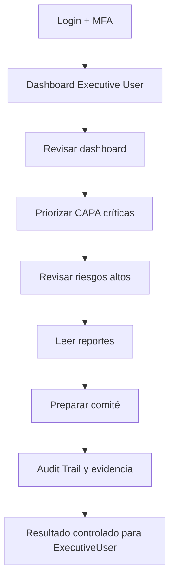
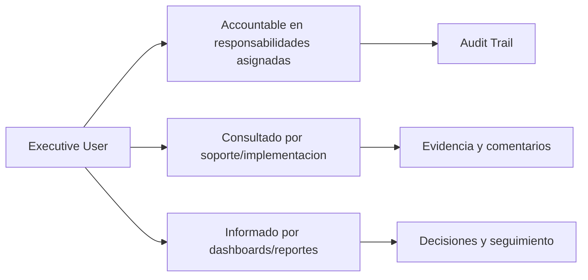

# Compliance 360 Academy

## Executive User Certification

## Portada

| Campo | Valor |
| --- | --- |
| Rol | Executive User |
| Nivel | Beginner / Executive |
| Duración | 8 horas |
| Objetivo | Formar directivos que consumen dashboards, reportes, riesgos y decisiones de cumplimiento. |
| Prerrequisitos | Conocer objetivos de negocio, indicadores y riesgos estratégicos. |
| Ruta de aprendizaje | Fundamentos -> Seguridad -> Módulos -> Operación -> Escenarios -> Evaluación -> Certificación |
| Certificación asociada | Compliance 360 Certified User |
| Estado | Markdown maestro. No generar Word hasta aprobación. |

---

# CAPÍTULO 1 - Introducción al Rol

## ¿Quién es?

El `Executive User` es un perfil formal de Compliance 360 Academy. Su entrenamiento está diseñado para que pueda usar la plataforma sin revisar código fuente, entendiendo módulos, permisos, responsabilidades, riesgos y límites reales del producto.

## ¿Qué responsabilidades tiene?

| Responsabilidad | Dueño | Prioridad | Evidencia esperada |
| --- | --- | --- | --- |
| Interpretar dashboard | Executive User | Alta | Evidencia en Audit Trail / reporte / registro |
| Priorizar riesgos | Executive User | Alta | Evidencia en Audit Trail / reporte / registro |
| Revisar KPIs | Executive User | Alta | Evidencia en Audit Trail / reporte / registro |
| Solicitar acciones | Executive User | Alta | Evidencia en Audit Trail / reporte / registro |
| Tomar decisiones | Executive User | Alta | Evidencia en Audit Trail / reporte / registro |

## ¿Qué puede hacer?

- Interpretar dashboard
- Priorizar riesgos
- Revisar KPIs
- Solicitar acciones
- Tomar decisiones

## ¿Qué no puede hacer?

- Operar configuración técnica
- Modificar registros sin proceso
- Aprobar sin autoridad
- Ignorar evidencia

## Flujo operativo del rol

## Matriz de responsabilidades

| Responsabilidad | Dueño | Prioridad | Evidencia esperada |
| --- | --- | --- | --- |
| Interpretar dashboard | Executive User | Alta | Evidencia en Audit Trail / reporte / registro |
| Priorizar riesgos | Executive User | Alta | Evidencia en Audit Trail / reporte / registro |
| Revisar KPIs | Executive User | Alta | Evidencia en Audit Trail / reporte / registro |
| Solicitar acciones | Executive User | Alta | Evidencia en Audit Trail / reporte / registro |
| Tomar decisiones | Executive User | Alta | Evidencia en Audit Trail / reporte / registro |

## Matriz RACI

| Proceso | Executive User | Tenant Admin | Quality Manager | Support Engineer | Consultora Admin |
| --- | --- | --- | --- | --- | --- |
| Leer dashboard | R/A | I | I | C | C |
| Interpretar KPI | R/A | I | I | C | C |
| Revisar CAPA | R/A | I | I | C | C |
| Revisar riesgo | R/A | I | I | C | C |
| Solicitar reporte | R/A | I | I | C | C |
| Preparar comité | R/A | I | I | C | C |

---

# CAPÍTULO 2 - Módulos que utiliza

## Módulos asignados al rol

| Módulo | Para qué sirve | Cuándo lo usa |
| --- | --- | --- |
| Dashboard | Sirve para dashboard | Se usa cuando el rol necesita operar o consultar esta capacidad |
| Reporting Engine | Sirve para reporting engine | Se usa cuando el rol necesita operar o consultar esta capacidad |
| Risk Management | Sirve para risk management | Se usa cuando el rol necesita operar o consultar esta capacidad |
| Quality Indicators | Sirve para quality indicators | Se usa cuando el rol necesita operar o consultar esta capacidad |
| CAPA Management | Sirve para capa management | Se usa cuando el rol necesita operar o consultar esta capacidad |
| Audit Management | Sirve para audit management | Se usa cuando el rol necesita operar o consultar esta capacidad |

## Matriz de módulos

| Módulo | Tipo de uso | Frecuencia | Nota de estado |
| --- | --- | --- | --- |
| Dashboard | Uso principal | Diario/Semanal | Ver estado real en Handbook |
| Reporting Engine | Uso principal | Diario/Semanal | Ver estado real en Handbook |
| Risk Management | Uso principal | Diario/Semanal | Ver estado real en Handbook |
| Quality Indicators | Uso principal | Diario/Semanal | Ver estado real en Handbook |
| CAPA Management | Uso principal | Diario/Semanal | Ver estado real en Handbook |
| Audit Management | Uso complementario | Según evento | Ver estado real en Handbook |

## Diagrama de responsabilidades

---

# CAPÍTULO 3 - Configuración Inicial

## Objetivo

Preparar el acceso y el entorno de trabajo del rol `Executive User` para operar sin fricción.

## Paso a paso

1. Crear o validar usuario en el tenant correcto.
2. Asignar rol y permisos correspondientes.
3. Activar MFA si el tenant lo requiere.
4. Validar acceso a dashboard.
5. Validar acceso a módulos asignados.
6. Probar operación mínima permitida.
7. Confirmar que Audit Trail registra eventos clave.
8. Documentar restricciones del rol.

## Pantalla por pantalla

| Pantalla | Acción esperada | Resultado |
| --- | --- | --- |
| Login | Ingresar credenciales y completar MFA si aplica | Sesión activa |
| Dashboard | Revisar indicadores y alertas | Prioridades visibles |
| Módulos asignados | Validar acceso según matriz | Acceso autorizado |
| Reportes | Consultar datos según permiso | Reporte visible |
| Audit Trail | Confirmar trazabilidad si aplica | Evento registrado |

## Proceso por proceso

Cada proceso debe ejecutarse con tenant, permiso y evidencia correctos. Si aparece `401`, el usuario debe renovar sesión. Si aparece `403`, debe solicitar ajuste de rol, no intentar rodear el control.

---

# CAPÍTULO 4 - Operación Diaria

## ¿Qué hace al iniciar sesión?

| Tarea | Frecuencia | Resultado esperado |
| --- | --- | --- |
| Revisar dashboard | Diario | Validar resultado en dashboard/audit trail |
| Priorizar CAPA críticas | Diario | Validar resultado en dashboard/audit trail |
| Revisar riesgos altos | Diario | Validar resultado en dashboard/audit trail |
| Leer reportes | Diario | Validar resultado en dashboard/audit trail |
| Preparar comité | Diario | Validar resultado en dashboard/audit trail |

## ¿Qué revisa?

- Estado general del dashboard.
- Tareas asignadas.
- Alertas relacionadas con sus módulos.
- Reportes o indicadores relevantes.
- Evidencia pendiente o procesos vencidos.

## ¿Qué tareas ejecuta?

- Revisar dashboard
- Priorizar CAPA críticas
- Revisar riesgos altos
- Leer reportes
- Preparar comité

## ¿Qué indicadores debe monitorear?

| Indicador | Uso | Acción esperada |
| --- | --- | --- |
| Riesgos altos | Monitorear tendencia | Escalar desviaciones |
| CAPA vencidas | Monitorear tendencia | Escalar desviaciones |
| KPIs críticos | Monitorear tendencia | Escalar desviaciones |
| Auditorías abiertas | Monitorear tendencia | Escalar desviaciones |
| Tendencia de cumplimiento | Monitorear tendencia | Escalar desviaciones |

---

# CAPÍTULO 5 - Procesos Paso a Paso

### 5.1 Leer dashboard

**Objetivo:** ejecutar el proceso `Leer dashboard` de forma trazable, segura y alineada con el rol `Executive User`.

**Prerrequisitos:**

- Usuario activo en el tenant correcto.
- Permisos del rol validados antes de iniciar.
- Datos base cargados: documentos, usuarios, módulos o providers según aplique.
- MFA completado si el tenant lo requiere.

**Pasos:**

1. Iniciar sesión en Compliance 360.
2. Confirmar tenant, rol activo y permisos visibles.
3. Abrir el módulo relacionado con `Leer dashboard`.
4. Revisar dashboard, filtros y estado actual antes de modificar información.
5. Crear, actualizar, aprobar, consultar o ejecutar la acción permitida por el rol.
6. Adjuntar evidencia cuando el proceso lo requiera.
7. Validar resultado esperado y registrar observaciones.
8. Revisar que el evento quede trazado en Audit Trail o en el dashboard correspondiente.

**Resultado esperado:** el proceso queda actualizado, con responsable, evidencia, estado visible y trazabilidad.

**Errores comunes:**

- Ejecutar el proceso en el tenant equivocado.
- Usar un rol sin permiso suficiente y recibir `403 Forbidden`.
- Omitir evidencia antes de aprobación/cierre.
- Confundir módulos core operativos con workspaces genéricos.

**Buenas prácticas:**

- Documentar decisiones en comentarios o evidencia.
- Validar datos antes de aprobar.
- Usar reportes para confirmar impacto.
- Escalar a soporte con correlation id cuando exista error técnico.

### 5.2 Interpretar KPI

**Objetivo:** ejecutar el proceso `Interpretar KPI` de forma trazable, segura y alineada con el rol `Executive User`.

**Prerrequisitos:**

- Usuario activo en el tenant correcto.
- Permisos del rol validados antes de iniciar.
- Datos base cargados: documentos, usuarios, módulos o providers según aplique.
- MFA completado si el tenant lo requiere.

**Pasos:**

1. Iniciar sesión en Compliance 360.
2. Confirmar tenant, rol activo y permisos visibles.
3. Abrir el módulo relacionado con `Interpretar KPI`.
4. Revisar dashboard, filtros y estado actual antes de modificar información.
5. Crear, actualizar, aprobar, consultar o ejecutar la acción permitida por el rol.
6. Adjuntar evidencia cuando el proceso lo requiera.
7. Validar resultado esperado y registrar observaciones.
8. Revisar que el evento quede trazado en Audit Trail o en el dashboard correspondiente.

**Resultado esperado:** el proceso queda actualizado, con responsable, evidencia, estado visible y trazabilidad.

**Errores comunes:**

- Ejecutar el proceso en el tenant equivocado.
- Usar un rol sin permiso suficiente y recibir `403 Forbidden`.
- Omitir evidencia antes de aprobación/cierre.
- Confundir módulos core operativos con workspaces genéricos.

**Buenas prácticas:**

- Documentar decisiones en comentarios o evidencia.
- Validar datos antes de aprobar.
- Usar reportes para confirmar impacto.
- Escalar a soporte con correlation id cuando exista error técnico.

### 5.3 Revisar CAPA

**Objetivo:** ejecutar el proceso `Revisar CAPA` de forma trazable, segura y alineada con el rol `Executive User`.

**Prerrequisitos:**

- Usuario activo en el tenant correcto.
- Permisos del rol validados antes de iniciar.
- Datos base cargados: documentos, usuarios, módulos o providers según aplique.
- MFA completado si el tenant lo requiere.

**Pasos:**

1. Iniciar sesión en Compliance 360.
2. Confirmar tenant, rol activo y permisos visibles.
3. Abrir el módulo relacionado con `Revisar CAPA`.
4. Revisar dashboard, filtros y estado actual antes de modificar información.
5. Crear, actualizar, aprobar, consultar o ejecutar la acción permitida por el rol.
6. Adjuntar evidencia cuando el proceso lo requiera.
7. Validar resultado esperado y registrar observaciones.
8. Revisar que el evento quede trazado en Audit Trail o en el dashboard correspondiente.

**Resultado esperado:** el proceso queda actualizado, con responsable, evidencia, estado visible y trazabilidad.

**Errores comunes:**

- Ejecutar el proceso en el tenant equivocado.
- Usar un rol sin permiso suficiente y recibir `403 Forbidden`.
- Omitir evidencia antes de aprobación/cierre.
- Confundir módulos core operativos con workspaces genéricos.

**Buenas prácticas:**

- Documentar decisiones en comentarios o evidencia.
- Validar datos antes de aprobar.
- Usar reportes para confirmar impacto.
- Escalar a soporte con correlation id cuando exista error técnico.

### 5.4 Revisar riesgo

**Objetivo:** ejecutar el proceso `Revisar riesgo` de forma trazable, segura y alineada con el rol `Executive User`.

**Prerrequisitos:**

- Usuario activo en el tenant correcto.
- Permisos del rol validados antes de iniciar.
- Datos base cargados: documentos, usuarios, módulos o providers según aplique.
- MFA completado si el tenant lo requiere.

**Pasos:**

1. Iniciar sesión en Compliance 360.
2. Confirmar tenant, rol activo y permisos visibles.
3. Abrir el módulo relacionado con `Revisar riesgo`.
4. Revisar dashboard, filtros y estado actual antes de modificar información.
5. Crear, actualizar, aprobar, consultar o ejecutar la acción permitida por el rol.
6. Adjuntar evidencia cuando el proceso lo requiera.
7. Validar resultado esperado y registrar observaciones.
8. Revisar que el evento quede trazado en Audit Trail o en el dashboard correspondiente.

**Resultado esperado:** el proceso queda actualizado, con responsable, evidencia, estado visible y trazabilidad.

**Errores comunes:**

- Ejecutar el proceso en el tenant equivocado.
- Usar un rol sin permiso suficiente y recibir `403 Forbidden`.
- Omitir evidencia antes de aprobación/cierre.
- Confundir módulos core operativos con workspaces genéricos.

**Buenas prácticas:**

- Documentar decisiones en comentarios o evidencia.
- Validar datos antes de aprobar.
- Usar reportes para confirmar impacto.
- Escalar a soporte con correlation id cuando exista error técnico.

### 5.5 Solicitar reporte

**Objetivo:** ejecutar el proceso `Solicitar reporte` de forma trazable, segura y alineada con el rol `Executive User`.

**Prerrequisitos:**

- Usuario activo en el tenant correcto.
- Permisos del rol validados antes de iniciar.
- Datos base cargados: documentos, usuarios, módulos o providers según aplique.
- MFA completado si el tenant lo requiere.

**Pasos:**

1. Iniciar sesión en Compliance 360.
2. Confirmar tenant, rol activo y permisos visibles.
3. Abrir el módulo relacionado con `Solicitar reporte`.
4. Revisar dashboard, filtros y estado actual antes de modificar información.
5. Crear, actualizar, aprobar, consultar o ejecutar la acción permitida por el rol.
6. Adjuntar evidencia cuando el proceso lo requiera.
7. Validar resultado esperado y registrar observaciones.
8. Revisar que el evento quede trazado en Audit Trail o en el dashboard correspondiente.

**Resultado esperado:** el proceso queda actualizado, con responsable, evidencia, estado visible y trazabilidad.

**Errores comunes:**

- Ejecutar el proceso en el tenant equivocado.
- Usar un rol sin permiso suficiente y recibir `403 Forbidden`.
- Omitir evidencia antes de aprobación/cierre.
- Confundir módulos core operativos con workspaces genéricos.

**Buenas prácticas:**

- Documentar decisiones en comentarios o evidencia.
- Validar datos antes de aprobar.
- Usar reportes para confirmar impacto.
- Escalar a soporte con correlation id cuando exista error técnico.

### 5.6 Preparar comité

**Objetivo:** ejecutar el proceso `Preparar comité` de forma trazable, segura y alineada con el rol `Executive User`.

**Prerrequisitos:**

- Usuario activo en el tenant correcto.
- Permisos del rol validados antes de iniciar.
- Datos base cargados: documentos, usuarios, módulos o providers según aplique.
- MFA completado si el tenant lo requiere.

**Pasos:**

1. Iniciar sesión en Compliance 360.
2. Confirmar tenant, rol activo y permisos visibles.
3. Abrir el módulo relacionado con `Preparar comité`.
4. Revisar dashboard, filtros y estado actual antes de modificar información.
5. Crear, actualizar, aprobar, consultar o ejecutar la acción permitida por el rol.
6. Adjuntar evidencia cuando el proceso lo requiera.
7. Validar resultado esperado y registrar observaciones.
8. Revisar que el evento quede trazado en Audit Trail o en el dashboard correspondiente.

**Resultado esperado:** el proceso queda actualizado, con responsable, evidencia, estado visible y trazabilidad.

**Errores comunes:**

- Ejecutar el proceso en el tenant equivocado.
- Usar un rol sin permiso suficiente y recibir `403 Forbidden`.
- Omitir evidencia antes de aprobación/cierre.
- Confundir módulos core operativos con workspaces genéricos.

**Buenas prácticas:**

- Documentar decisiones en comentarios o evidencia.
- Validar datos antes de aprobar.
- Usar reportes para confirmar impacto.
- Escalar a soporte con correlation id cuando exista error técnico.

---

# CAPÍTULO 6 - Escenarios Reales

### 6.1 Escenario: Comité mensual

**Contexto empresarial:** el rol `Executive User` enfrenta el caso `Comité mensual` dentro de un tenant productivo o de capacitación.

**Objetivo del escenario:** resolver la situación sin romper trazabilidad, seguridad ni segregación de funciones.

**Acciones esperadas:**

1. Identificar el módulo principal del caso.
2. Revisar permisos y alcance del rol.
3. Consultar registros existentes, dashboard o reportes relacionados.
4. Ejecutar la acción permitida por el rol.
5. Adjuntar evidencia o comentario de soporte.
6. Confirmar estado final y responsables.
7. Escalar si el proceso requiere permisos de otro rol.

**Criterios de éxito:**

- El caso queda resuelto o escalado formalmente.
- No se realizan acciones fuera del permiso del rol.
- Existe evidencia o trazabilidad suficiente para auditoría.
- El estado final es comprensible para negocio, soporte e implementación.

**Riesgo si se opera mal:** pérdida de evidencia, aprobación indebida, error de tenant, incumplimiento de ISO 9001/BPM/HACCP o confusión comercial sobre el estado real del producto.

### 6.2 Escenario: Riesgo crítico

**Contexto empresarial:** el rol `Executive User` enfrenta el caso `Riesgo crítico` dentro de un tenant productivo o de capacitación.

**Objetivo del escenario:** resolver la situación sin romper trazabilidad, seguridad ni segregación de funciones.

**Acciones esperadas:**

1. Identificar el módulo principal del caso.
2. Revisar permisos y alcance del rol.
3. Consultar registros existentes, dashboard o reportes relacionados.
4. Ejecutar la acción permitida por el rol.
5. Adjuntar evidencia o comentario de soporte.
6. Confirmar estado final y responsables.
7. Escalar si el proceso requiere permisos de otro rol.

**Criterios de éxito:**

- El caso queda resuelto o escalado formalmente.
- No se realizan acciones fuera del permiso del rol.
- Existe evidencia o trazabilidad suficiente para auditoría.
- El estado final es comprensible para negocio, soporte e implementación.

**Riesgo si se opera mal:** pérdida de evidencia, aprobación indebida, error de tenant, incumplimiento de ISO 9001/BPM/HACCP o confusión comercial sobre el estado real del producto.

### 6.3 Escenario: KPI fuera de meta

**Contexto empresarial:** el rol `Executive User` enfrenta el caso `KPI fuera de meta` dentro de un tenant productivo o de capacitación.

**Objetivo del escenario:** resolver la situación sin romper trazabilidad, seguridad ni segregación de funciones.

**Acciones esperadas:**

1. Identificar el módulo principal del caso.
2. Revisar permisos y alcance del rol.
3. Consultar registros existentes, dashboard o reportes relacionados.
4. Ejecutar la acción permitida por el rol.
5. Adjuntar evidencia o comentario de soporte.
6. Confirmar estado final y responsables.
7. Escalar si el proceso requiere permisos de otro rol.

**Criterios de éxito:**

- El caso queda resuelto o escalado formalmente.
- No se realizan acciones fuera del permiso del rol.
- Existe evidencia o trazabilidad suficiente para auditoría.
- El estado final es comprensible para negocio, soporte e implementación.

**Riesgo si se opera mal:** pérdida de evidencia, aprobación indebida, error de tenant, incumplimiento de ISO 9001/BPM/HACCP o confusión comercial sobre el estado real del producto.

### 6.4 Escenario: CAPA vencida

**Contexto empresarial:** el rol `Executive User` enfrenta el caso `CAPA vencida` dentro de un tenant productivo o de capacitación.

**Objetivo del escenario:** resolver la situación sin romper trazabilidad, seguridad ni segregación de funciones.

**Acciones esperadas:**

1. Identificar el módulo principal del caso.
2. Revisar permisos y alcance del rol.
3. Consultar registros existentes, dashboard o reportes relacionados.
4. Ejecutar la acción permitida por el rol.
5. Adjuntar evidencia o comentario de soporte.
6. Confirmar estado final y responsables.
7. Escalar si el proceso requiere permisos de otro rol.

**Criterios de éxito:**

- El caso queda resuelto o escalado formalmente.
- No se realizan acciones fuera del permiso del rol.
- Existe evidencia o trazabilidad suficiente para auditoría.
- El estado final es comprensible para negocio, soporte e implementación.

**Riesgo si se opera mal:** pérdida de evidencia, aprobación indebida, error de tenant, incumplimiento de ISO 9001/BPM/HACCP o confusión comercial sobre el estado real del producto.

### 6.5 Escenario: Auditoría externa

**Contexto empresarial:** el rol `Executive User` enfrenta el caso `Auditoría externa` dentro de un tenant productivo o de capacitación.

**Objetivo del escenario:** resolver la situación sin romper trazabilidad, seguridad ni segregación de funciones.

**Acciones esperadas:**

1. Identificar el módulo principal del caso.
2. Revisar permisos y alcance del rol.
3. Consultar registros existentes, dashboard o reportes relacionados.
4. Ejecutar la acción permitida por el rol.
5. Adjuntar evidencia o comentario de soporte.
6. Confirmar estado final y responsables.
7. Escalar si el proceso requiere permisos de otro rol.

**Criterios de éxito:**

- El caso queda resuelto o escalado formalmente.
- No se realizan acciones fuera del permiso del rol.
- Existe evidencia o trazabilidad suficiente para auditoría.
- El estado final es comprensible para negocio, soporte e implementación.

**Riesgo si se opera mal:** pérdida de evidencia, aprobación indebida, error de tenant, incumplimiento de ISO 9001/BPM/HACCP o confusión comercial sobre el estado real del producto.

### 6.6 Escenario: Reporte a directorio

**Contexto empresarial:** el rol `Executive User` enfrenta el caso `Reporte a directorio` dentro de un tenant productivo o de capacitación.

**Objetivo del escenario:** resolver la situación sin romper trazabilidad, seguridad ni segregación de funciones.

**Acciones esperadas:**

1. Identificar el módulo principal del caso.
2. Revisar permisos y alcance del rol.
3. Consultar registros existentes, dashboard o reportes relacionados.
4. Ejecutar la acción permitida por el rol.
5. Adjuntar evidencia o comentario de soporte.
6. Confirmar estado final y responsables.
7. Escalar si el proceso requiere permisos de otro rol.

**Criterios de éxito:**

- El caso queda resuelto o escalado formalmente.
- No se realizan acciones fuera del permiso del rol.
- Existe evidencia o trazabilidad suficiente para auditoría.
- El estado final es comprensible para negocio, soporte e implementación.

**Riesgo si se opera mal:** pérdida de evidencia, aprobación indebida, error de tenant, incumplimiento de ISO 9001/BPM/HACCP o confusión comercial sobre el estado real del producto.

### 6.7 Escenario: Proveedor crítico

**Contexto empresarial:** el rol `Executive User` enfrenta el caso `Proveedor crítico` dentro de un tenant productivo o de capacitación.

**Objetivo del escenario:** resolver la situación sin romper trazabilidad, seguridad ni segregación de funciones.

**Acciones esperadas:**

1. Identificar el módulo principal del caso.
2. Revisar permisos y alcance del rol.
3. Consultar registros existentes, dashboard o reportes relacionados.
4. Ejecutar la acción permitida por el rol.
5. Adjuntar evidencia o comentario de soporte.
6. Confirmar estado final y responsables.
7. Escalar si el proceso requiere permisos de otro rol.

**Criterios de éxito:**

- El caso queda resuelto o escalado formalmente.
- No se realizan acciones fuera del permiso del rol.
- Existe evidencia o trazabilidad suficiente para auditoría.
- El estado final es comprensible para negocio, soporte e implementación.

**Riesgo si se opera mal:** pérdida de evidencia, aprobación indebida, error de tenant, incumplimiento de ISO 9001/BPM/HACCP o confusión comercial sobre el estado real del producto.

### 6.8 Escenario: Incidente calidad

**Contexto empresarial:** el rol `Executive User` enfrenta el caso `Incidente calidad` dentro de un tenant productivo o de capacitación.

**Objetivo del escenario:** resolver la situación sin romper trazabilidad, seguridad ni segregación de funciones.

**Acciones esperadas:**

1. Identificar el módulo principal del caso.
2. Revisar permisos y alcance del rol.
3. Consultar registros existentes, dashboard o reportes relacionados.
4. Ejecutar la acción permitida por el rol.
5. Adjuntar evidencia o comentario de soporte.
6. Confirmar estado final y responsables.
7. Escalar si el proceso requiere permisos de otro rol.

**Criterios de éxito:**

- El caso queda resuelto o escalado formalmente.
- No se realizan acciones fuera del permiso del rol.
- Existe evidencia o trazabilidad suficiente para auditoría.
- El estado final es comprensible para negocio, soporte e implementación.

**Riesgo si se opera mal:** pérdida de evidencia, aprobación indebida, error de tenant, incumplimiento de ISO 9001/BPM/HACCP o confusión comercial sobre el estado real del producto.

### 6.9 Escenario: Plan de mejora

**Contexto empresarial:** el rol `Executive User` enfrenta el caso `Plan de mejora` dentro de un tenant productivo o de capacitación.

**Objetivo del escenario:** resolver la situación sin romper trazabilidad, seguridad ni segregación de funciones.

**Acciones esperadas:**

1. Identificar el módulo principal del caso.
2. Revisar permisos y alcance del rol.
3. Consultar registros existentes, dashboard o reportes relacionados.
4. Ejecutar la acción permitida por el rol.
5. Adjuntar evidencia o comentario de soporte.
6. Confirmar estado final y responsables.
7. Escalar si el proceso requiere permisos de otro rol.

**Criterios de éxito:**

- El caso queda resuelto o escalado formalmente.
- No se realizan acciones fuera del permiso del rol.
- Existe evidencia o trazabilidad suficiente para auditoría.
- El estado final es comprensible para negocio, soporte e implementación.

**Riesgo si se opera mal:** pérdida de evidencia, aprobación indebida, error de tenant, incumplimiento de ISO 9001/BPM/HACCP o confusión comercial sobre el estado real del producto.

### 6.10 Escenario: Decisión de inversión

**Contexto empresarial:** el rol `Executive User` enfrenta el caso `Decisión de inversión` dentro de un tenant productivo o de capacitación.

**Objetivo del escenario:** resolver la situación sin romper trazabilidad, seguridad ni segregación de funciones.

**Acciones esperadas:**

1. Identificar el módulo principal del caso.
2. Revisar permisos y alcance del rol.
3. Consultar registros existentes, dashboard o reportes relacionados.
4. Ejecutar la acción permitida por el rol.
5. Adjuntar evidencia o comentario de soporte.
6. Confirmar estado final y responsables.
7. Escalar si el proceso requiere permisos de otro rol.

**Criterios de éxito:**

- El caso queda resuelto o escalado formalmente.
- No se realizan acciones fuera del permiso del rol.
- Existe evidencia o trazabilidad suficiente para auditoría.
- El estado final es comprensible para negocio, soporte e implementación.

**Riesgo si se opera mal:** pérdida de evidencia, aprobación indebida, error de tenant, incumplimiento de ISO 9001/BPM/HACCP o confusión comercial sobre el estado real del producto.

---

# CAPÍTULO 7 - Mejores Prácticas

## ISO 9001

- Mantener evidencia trazable de cambios, aprobaciones y cierres.
- Usar roles claros para evitar conflictos de interés.
- Medir desempeño con indicadores y revisar tendencias.
- Gestionar no conformidades mediante CAPA con causa raíz y efectividad.

## ISO 22000, HACCP y BPM

- Controlar documentos de inocuidad y BPM como documentos vigentes.
- Vincular proveedores críticos con certificaciones y evaluaciones.
- Registrar riesgos de inocuidad con controles y tratamiento.
- Mantener evidencias de acciones preventivas y correctivas.

## Buenas prácticas SaaS

- No compartir usuarios.
- Activar MFA para roles sensibles.
- Usar permisos mínimos necesarios.
- Validar providers de email/storage antes de producción.
- Escalar errores técnicos con evidencia, hora, tenant y correlation id.

---

# CAPÍTULO 8 - Errores Comunes

| Error | Consecuencia | Prevención |
| --- | --- | --- |
| Operar en tenant incorrecto | Riesgo de privacidad y datos cruzados | Confirmar tenant al iniciar |
| Usar rol con permisos excesivos | Falta de segregación | Revisar matriz RBAC |
| Cerrar sin evidencia | Debilidad ante auditoría | Adjuntar evidencia antes de cierre |
| Ignorar módulos en estado workspace | Promesa comercial incorrecta | Aplicar regla de honestidad |
| No revisar Audit Trail | Falta de trazabilidad | Validar eventos clave |
| No probar providers | Fallas de email/storage en producción | Ejecutar tests de conexión |
| Compartir credenciales | Riesgo de seguridad | Usuario individual por persona |
| Omitir MFA | Mayor exposición de acceso | Activar MFA en roles críticos |
| No documentar decisiones | Soporte y auditoría débiles | Registrar comentarios |
| No escalar a tiempo | SLA incumplido | Clasificar severidad |

---

# CAPÍTULO 9 - Checklist Operativo

## Checklist diario

- Confirmar acceso y tenant correcto.
- Revisar dashboard y tareas asignadas.
- Revisar alertas de módulos asignados.
- Ejecutar procesos prioritarios.
- Escalar bloqueos con evidencia.

## Checklist semanal

- Revisar reportes relevantes.
- Revisar tareas vencidas.
- Validar indicadores del rol.
- Confirmar que los procesos críticos tienen responsables.
- Revisar errores recurrentes.

## Checklist mensual

- Preparar comité o revisión ejecutiva.
- Auditar permisos del rol si aplica.
- Revisar tendencias y desviaciones.
- Confirmar cierre de procesos críticos.
- Documentar oportunidades de mejora.

## Checklist trimestral

- Revisar matriz de responsabilidades.
- Validar capacitación de usuarios.
- Revisar efectividad de controles.
- Actualizar procesos según cambios normativos.
- Preparar evidencia para auditorías.

---

# CAPÍTULO 10 - Evaluación Teórica

**Instrucciones:** responder 50 preguntas de opción múltiple. Puntaje recomendado: 2 puntos por pregunta. Mínimo de aprobación: 80/100.

### Pregunta 1

**Situación:** el rol `Executive User` debe trabajar con `Dashboard` en Compliance 360.

A. Validar permisos, tenant, evidencia y estado antes de operar Dashboard.
B. Compartir credenciales para acelerar el trabajo sobre Dashboard.
C. Omitir Audit Trail porque el proceso Dashboard es interno.
D. Prometer funcionalidad no implementada para Dashboard sin aclaración.

**Respuesta correcta:** A

**Explicación:** la respuesta correcta protege multitenancy, RBAC, trazabilidad, evidencia y honestidad del producto. Las demás opciones introducen riesgos de seguridad, auditoría, soporte o venta incorrecta.

### Pregunta 2

**Situación:** el rol `Executive User` debe trabajar con `Reporting Engine` en Compliance 360.

A. Compartir credenciales para acelerar el trabajo sobre Reporting Engine.
B. Validar permisos, tenant, evidencia y estado antes de operar Reporting Engine.
C. Omitir Audit Trail porque el proceso Reporting Engine es interno.
D. Prometer funcionalidad no implementada para Reporting Engine sin aclaración.

**Respuesta correcta:** B

**Explicación:** la respuesta correcta protege multitenancy, RBAC, trazabilidad, evidencia y honestidad del producto. Las demás opciones introducen riesgos de seguridad, auditoría, soporte o venta incorrecta.

### Pregunta 3

**Situación:** el rol `Executive User` debe trabajar con `Risk Management` en Compliance 360.

A. Omitir Audit Trail porque el proceso Risk Management es interno.
B. Compartir credenciales para acelerar el trabajo sobre Risk Management.
C. Validar permisos, tenant, evidencia y estado antes de operar Risk Management.
D. Prometer funcionalidad no implementada para Risk Management sin aclaración.

**Respuesta correcta:** C

**Explicación:** la respuesta correcta protege multitenancy, RBAC, trazabilidad, evidencia y honestidad del producto. Las demás opciones introducen riesgos de seguridad, auditoría, soporte o venta incorrecta.

### Pregunta 4

**Situación:** el rol `Executive User` debe trabajar con `Quality Indicators` en Compliance 360.

A. Prometer funcionalidad no implementada para Quality Indicators sin aclaración.
B. Compartir credenciales para acelerar el trabajo sobre Quality Indicators.
C. Omitir Audit Trail porque el proceso Quality Indicators es interno.
D. Validar permisos, tenant, evidencia y estado antes de operar Quality Indicators.

**Respuesta correcta:** D

**Explicación:** la respuesta correcta protege multitenancy, RBAC, trazabilidad, evidencia y honestidad del producto. Las demás opciones introducen riesgos de seguridad, auditoría, soporte o venta incorrecta.

### Pregunta 5

**Situación:** el rol `Executive User` debe trabajar con `CAPA Management` en Compliance 360.

A. Validar permisos, tenant, evidencia y estado antes de operar CAPA Management.
B. Compartir credenciales para acelerar el trabajo sobre CAPA Management.
C. Omitir Audit Trail porque el proceso CAPA Management es interno.
D. Prometer funcionalidad no implementada para CAPA Management sin aclaración.

**Respuesta correcta:** A

**Explicación:** la respuesta correcta protege multitenancy, RBAC, trazabilidad, evidencia y honestidad del producto. Las demás opciones introducen riesgos de seguridad, auditoría, soporte o venta incorrecta.

### Pregunta 6

**Situación:** el rol `Executive User` debe trabajar con `Audit Management` en Compliance 360.

A. Compartir credenciales para acelerar el trabajo sobre Audit Management.
B. Validar permisos, tenant, evidencia y estado antes de operar Audit Management.
C. Omitir Audit Trail porque el proceso Audit Management es interno.
D. Prometer funcionalidad no implementada para Audit Management sin aclaración.

**Respuesta correcta:** B

**Explicación:** la respuesta correcta protege multitenancy, RBAC, trazabilidad, evidencia y honestidad del producto. Las demás opciones introducen riesgos de seguridad, auditoría, soporte o venta incorrecta.

### Pregunta 7

**Situación:** el rol `Executive User` debe trabajar con `Leer dashboard` en Compliance 360.

A. Omitir Audit Trail porque el proceso Leer dashboard es interno.
B. Compartir credenciales para acelerar el trabajo sobre Leer dashboard.
C. Validar permisos, tenant, evidencia y estado antes de operar Leer dashboard.
D. Prometer funcionalidad no implementada para Leer dashboard sin aclaración.

**Respuesta correcta:** C

**Explicación:** la respuesta correcta protege multitenancy, RBAC, trazabilidad, evidencia y honestidad del producto. Las demás opciones introducen riesgos de seguridad, auditoría, soporte o venta incorrecta.

### Pregunta 8

**Situación:** el rol `Executive User` debe trabajar con `Interpretar KPI` en Compliance 360.

A. Prometer funcionalidad no implementada para Interpretar KPI sin aclaración.
B. Compartir credenciales para acelerar el trabajo sobre Interpretar KPI.
C. Omitir Audit Trail porque el proceso Interpretar KPI es interno.
D. Validar permisos, tenant, evidencia y estado antes de operar Interpretar KPI.

**Respuesta correcta:** D

**Explicación:** la respuesta correcta protege multitenancy, RBAC, trazabilidad, evidencia y honestidad del producto. Las demás opciones introducen riesgos de seguridad, auditoría, soporte o venta incorrecta.

### Pregunta 9

**Situación:** el rol `Executive User` debe trabajar con `Revisar CAPA` en Compliance 360.

A. Validar permisos, tenant, evidencia y estado antes de operar Revisar CAPA.
B. Compartir credenciales para acelerar el trabajo sobre Revisar CAPA.
C. Omitir Audit Trail porque el proceso Revisar CAPA es interno.
D. Prometer funcionalidad no implementada para Revisar CAPA sin aclaración.

**Respuesta correcta:** A

**Explicación:** la respuesta correcta protege multitenancy, RBAC, trazabilidad, evidencia y honestidad del producto. Las demás opciones introducen riesgos de seguridad, auditoría, soporte o venta incorrecta.

### Pregunta 10

**Situación:** el rol `Executive User` debe trabajar con `Revisar riesgo` en Compliance 360.

A. Compartir credenciales para acelerar el trabajo sobre Revisar riesgo.
B. Validar permisos, tenant, evidencia y estado antes de operar Revisar riesgo.
C. Omitir Audit Trail porque el proceso Revisar riesgo es interno.
D. Prometer funcionalidad no implementada para Revisar riesgo sin aclaración.

**Respuesta correcta:** B

**Explicación:** la respuesta correcta protege multitenancy, RBAC, trazabilidad, evidencia y honestidad del producto. Las demás opciones introducen riesgos de seguridad, auditoría, soporte o venta incorrecta.

### Pregunta 11

**Situación:** el rol `Executive User` debe trabajar con `Solicitar reporte` en Compliance 360.

A. Omitir Audit Trail porque el proceso Solicitar reporte es interno.
B. Compartir credenciales para acelerar el trabajo sobre Solicitar reporte.
C. Validar permisos, tenant, evidencia y estado antes de operar Solicitar reporte.
D. Prometer funcionalidad no implementada para Solicitar reporte sin aclaración.

**Respuesta correcta:** C

**Explicación:** la respuesta correcta protege multitenancy, RBAC, trazabilidad, evidencia y honestidad del producto. Las demás opciones introducen riesgos de seguridad, auditoría, soporte o venta incorrecta.

### Pregunta 12

**Situación:** el rol `Executive User` debe trabajar con `Preparar comité` en Compliance 360.

A. Prometer funcionalidad no implementada para Preparar comité sin aclaración.
B. Compartir credenciales para acelerar el trabajo sobre Preparar comité.
C. Omitir Audit Trail porque el proceso Preparar comité es interno.
D. Validar permisos, tenant, evidencia y estado antes de operar Preparar comité.

**Respuesta correcta:** D

**Explicación:** la respuesta correcta protege multitenancy, RBAC, trazabilidad, evidencia y honestidad del producto. Las demás opciones introducen riesgos de seguridad, auditoría, soporte o venta incorrecta.

### Pregunta 13

**Situación:** el rol `Executive User` debe trabajar con `RBAC` en Compliance 360.

A. Validar permisos, tenant, evidencia y estado antes de operar RBAC.
B. Compartir credenciales para acelerar el trabajo sobre RBAC.
C. Omitir Audit Trail porque el proceso RBAC es interno.
D. Prometer funcionalidad no implementada para RBAC sin aclaración.

**Respuesta correcta:** A

**Explicación:** la respuesta correcta protege multitenancy, RBAC, trazabilidad, evidencia y honestidad del producto. Las demás opciones introducen riesgos de seguridad, auditoría, soporte o venta incorrecta.

### Pregunta 14

**Situación:** el rol `Executive User` debe trabajar con `MFA` en Compliance 360.

A. Compartir credenciales para acelerar el trabajo sobre MFA.
B. Validar permisos, tenant, evidencia y estado antes de operar MFA.
C. Omitir Audit Trail porque el proceso MFA es interno.
D. Prometer funcionalidad no implementada para MFA sin aclaración.

**Respuesta correcta:** B

**Explicación:** la respuesta correcta protege multitenancy, RBAC, trazabilidad, evidencia y honestidad del producto. Las demás opciones introducen riesgos de seguridad, auditoría, soporte o venta incorrecta.

### Pregunta 15

**Situación:** el rol `Executive User` debe trabajar con `Audit Trail` en Compliance 360.

A. Omitir Audit Trail porque el proceso Audit Trail es interno.
B. Compartir credenciales para acelerar el trabajo sobre Audit Trail.
C. Validar permisos, tenant, evidencia y estado antes de operar Audit Trail.
D. Prometer funcionalidad no implementada para Audit Trail sin aclaración.

**Respuesta correcta:** C

**Explicación:** la respuesta correcta protege multitenancy, RBAC, trazabilidad, evidencia y honestidad del producto. Las demás opciones introducen riesgos de seguridad, auditoría, soporte o venta incorrecta.

### Pregunta 16

**Situación:** el rol `Executive User` debe trabajar con `Estado real del módulo` en Compliance 360.

A. Prometer funcionalidad no implementada para Estado real del módulo sin aclaración.
B. Compartir credenciales para acelerar el trabajo sobre Estado real del módulo.
C. Omitir Audit Trail porque el proceso Estado real del módulo es interno.
D. Validar permisos, tenant, evidencia y estado antes de operar Estado real del módulo.

**Respuesta correcta:** D

**Explicación:** la respuesta correcta protege multitenancy, RBAC, trazabilidad, evidencia y honestidad del producto. Las demás opciones introducen riesgos de seguridad, auditoría, soporte o venta incorrecta.

### Pregunta 17

**Situación:** el rol `Executive User` debe trabajar con `Buenas prácticas ISO` en Compliance 360.

A. Validar permisos, tenant, evidencia y estado antes de operar Buenas prácticas ISO.
B. Compartir credenciales para acelerar el trabajo sobre Buenas prácticas ISO.
C. Omitir Audit Trail porque el proceso Buenas prácticas ISO es interno.
D. Prometer funcionalidad no implementada para Buenas prácticas ISO sin aclaración.

**Respuesta correcta:** A

**Explicación:** la respuesta correcta protege multitenancy, RBAC, trazabilidad, evidencia y honestidad del producto. Las demás opciones introducen riesgos de seguridad, auditoría, soporte o venta incorrecta.

### Pregunta 18

**Situación:** el rol `Executive User` debe trabajar con `Dashboard` en Compliance 360.

A. Compartir credenciales para acelerar el trabajo sobre Dashboard.
B. Validar permisos, tenant, evidencia y estado antes de operar Dashboard.
C. Omitir Audit Trail porque el proceso Dashboard es interno.
D. Prometer funcionalidad no implementada para Dashboard sin aclaración.

**Respuesta correcta:** B

**Explicación:** la respuesta correcta protege multitenancy, RBAC, trazabilidad, evidencia y honestidad del producto. Las demás opciones introducen riesgos de seguridad, auditoría, soporte o venta incorrecta.

### Pregunta 19

**Situación:** el rol `Executive User` debe trabajar con `Reporting Engine` en Compliance 360.

A. Omitir Audit Trail porque el proceso Reporting Engine es interno.
B. Compartir credenciales para acelerar el trabajo sobre Reporting Engine.
C. Validar permisos, tenant, evidencia y estado antes de operar Reporting Engine.
D. Prometer funcionalidad no implementada para Reporting Engine sin aclaración.

**Respuesta correcta:** C

**Explicación:** la respuesta correcta protege multitenancy, RBAC, trazabilidad, evidencia y honestidad del producto. Las demás opciones introducen riesgos de seguridad, auditoría, soporte o venta incorrecta.

### Pregunta 20

**Situación:** el rol `Executive User` debe trabajar con `Risk Management` en Compliance 360.

A. Prometer funcionalidad no implementada para Risk Management sin aclaración.
B. Compartir credenciales para acelerar el trabajo sobre Risk Management.
C. Omitir Audit Trail porque el proceso Risk Management es interno.
D. Validar permisos, tenant, evidencia y estado antes de operar Risk Management.

**Respuesta correcta:** D

**Explicación:** la respuesta correcta protege multitenancy, RBAC, trazabilidad, evidencia y honestidad del producto. Las demás opciones introducen riesgos de seguridad, auditoría, soporte o venta incorrecta.

### Pregunta 21

**Situación:** el rol `Executive User` debe trabajar con `Quality Indicators` en Compliance 360.

A. Validar permisos, tenant, evidencia y estado antes de operar Quality Indicators.
B. Compartir credenciales para acelerar el trabajo sobre Quality Indicators.
C. Omitir Audit Trail porque el proceso Quality Indicators es interno.
D. Prometer funcionalidad no implementada para Quality Indicators sin aclaración.

**Respuesta correcta:** A

**Explicación:** la respuesta correcta protege multitenancy, RBAC, trazabilidad, evidencia y honestidad del producto. Las demás opciones introducen riesgos de seguridad, auditoría, soporte o venta incorrecta.

### Pregunta 22

**Situación:** el rol `Executive User` debe trabajar con `CAPA Management` en Compliance 360.

A. Compartir credenciales para acelerar el trabajo sobre CAPA Management.
B. Validar permisos, tenant, evidencia y estado antes de operar CAPA Management.
C. Omitir Audit Trail porque el proceso CAPA Management es interno.
D. Prometer funcionalidad no implementada para CAPA Management sin aclaración.

**Respuesta correcta:** B

**Explicación:** la respuesta correcta protege multitenancy, RBAC, trazabilidad, evidencia y honestidad del producto. Las demás opciones introducen riesgos de seguridad, auditoría, soporte o venta incorrecta.

### Pregunta 23

**Situación:** el rol `Executive User` debe trabajar con `Audit Management` en Compliance 360.

A. Omitir Audit Trail porque el proceso Audit Management es interno.
B. Compartir credenciales para acelerar el trabajo sobre Audit Management.
C. Validar permisos, tenant, evidencia y estado antes de operar Audit Management.
D. Prometer funcionalidad no implementada para Audit Management sin aclaración.

**Respuesta correcta:** C

**Explicación:** la respuesta correcta protege multitenancy, RBAC, trazabilidad, evidencia y honestidad del producto. Las demás opciones introducen riesgos de seguridad, auditoría, soporte o venta incorrecta.

### Pregunta 24

**Situación:** el rol `Executive User` debe trabajar con `Leer dashboard` en Compliance 360.

A. Prometer funcionalidad no implementada para Leer dashboard sin aclaración.
B. Compartir credenciales para acelerar el trabajo sobre Leer dashboard.
C. Omitir Audit Trail porque el proceso Leer dashboard es interno.
D. Validar permisos, tenant, evidencia y estado antes de operar Leer dashboard.

**Respuesta correcta:** D

**Explicación:** la respuesta correcta protege multitenancy, RBAC, trazabilidad, evidencia y honestidad del producto. Las demás opciones introducen riesgos de seguridad, auditoría, soporte o venta incorrecta.

### Pregunta 25

**Situación:** el rol `Executive User` debe trabajar con `Interpretar KPI` en Compliance 360.

A. Validar permisos, tenant, evidencia y estado antes de operar Interpretar KPI.
B. Compartir credenciales para acelerar el trabajo sobre Interpretar KPI.
C. Omitir Audit Trail porque el proceso Interpretar KPI es interno.
D. Prometer funcionalidad no implementada para Interpretar KPI sin aclaración.

**Respuesta correcta:** A

**Explicación:** la respuesta correcta protege multitenancy, RBAC, trazabilidad, evidencia y honestidad del producto. Las demás opciones introducen riesgos de seguridad, auditoría, soporte o venta incorrecta.

### Pregunta 26

**Situación:** el rol `Executive User` debe trabajar con `Revisar CAPA` en Compliance 360.

A. Compartir credenciales para acelerar el trabajo sobre Revisar CAPA.
B. Validar permisos, tenant, evidencia y estado antes de operar Revisar CAPA.
C. Omitir Audit Trail porque el proceso Revisar CAPA es interno.
D. Prometer funcionalidad no implementada para Revisar CAPA sin aclaración.

**Respuesta correcta:** B

**Explicación:** la respuesta correcta protege multitenancy, RBAC, trazabilidad, evidencia y honestidad del producto. Las demás opciones introducen riesgos de seguridad, auditoría, soporte o venta incorrecta.

### Pregunta 27

**Situación:** el rol `Executive User` debe trabajar con `Revisar riesgo` en Compliance 360.

A. Omitir Audit Trail porque el proceso Revisar riesgo es interno.
B. Compartir credenciales para acelerar el trabajo sobre Revisar riesgo.
C. Validar permisos, tenant, evidencia y estado antes de operar Revisar riesgo.
D. Prometer funcionalidad no implementada para Revisar riesgo sin aclaración.

**Respuesta correcta:** C

**Explicación:** la respuesta correcta protege multitenancy, RBAC, trazabilidad, evidencia y honestidad del producto. Las demás opciones introducen riesgos de seguridad, auditoría, soporte o venta incorrecta.

### Pregunta 28

**Situación:** el rol `Executive User` debe trabajar con `Solicitar reporte` en Compliance 360.

A. Prometer funcionalidad no implementada para Solicitar reporte sin aclaración.
B. Compartir credenciales para acelerar el trabajo sobre Solicitar reporte.
C. Omitir Audit Trail porque el proceso Solicitar reporte es interno.
D. Validar permisos, tenant, evidencia y estado antes de operar Solicitar reporte.

**Respuesta correcta:** D

**Explicación:** la respuesta correcta protege multitenancy, RBAC, trazabilidad, evidencia y honestidad del producto. Las demás opciones introducen riesgos de seguridad, auditoría, soporte o venta incorrecta.

### Pregunta 29

**Situación:** el rol `Executive User` debe trabajar con `Preparar comité` en Compliance 360.

A. Validar permisos, tenant, evidencia y estado antes de operar Preparar comité.
B. Compartir credenciales para acelerar el trabajo sobre Preparar comité.
C. Omitir Audit Trail porque el proceso Preparar comité es interno.
D. Prometer funcionalidad no implementada para Preparar comité sin aclaración.

**Respuesta correcta:** A

**Explicación:** la respuesta correcta protege multitenancy, RBAC, trazabilidad, evidencia y honestidad del producto. Las demás opciones introducen riesgos de seguridad, auditoría, soporte o venta incorrecta.

### Pregunta 30

**Situación:** el rol `Executive User` debe trabajar con `RBAC` en Compliance 360.

A. Compartir credenciales para acelerar el trabajo sobre RBAC.
B. Validar permisos, tenant, evidencia y estado antes de operar RBAC.
C. Omitir Audit Trail porque el proceso RBAC es interno.
D. Prometer funcionalidad no implementada para RBAC sin aclaración.

**Respuesta correcta:** B

**Explicación:** la respuesta correcta protege multitenancy, RBAC, trazabilidad, evidencia y honestidad del producto. Las demás opciones introducen riesgos de seguridad, auditoría, soporte o venta incorrecta.

### Pregunta 31

**Situación:** el rol `Executive User` debe trabajar con `MFA` en Compliance 360.

A. Omitir Audit Trail porque el proceso MFA es interno.
B. Compartir credenciales para acelerar el trabajo sobre MFA.
C. Validar permisos, tenant, evidencia y estado antes de operar MFA.
D. Prometer funcionalidad no implementada para MFA sin aclaración.

**Respuesta correcta:** C

**Explicación:** la respuesta correcta protege multitenancy, RBAC, trazabilidad, evidencia y honestidad del producto. Las demás opciones introducen riesgos de seguridad, auditoría, soporte o venta incorrecta.

### Pregunta 32

**Situación:** el rol `Executive User` debe trabajar con `Audit Trail` en Compliance 360.

A. Prometer funcionalidad no implementada para Audit Trail sin aclaración.
B. Compartir credenciales para acelerar el trabajo sobre Audit Trail.
C. Omitir Audit Trail porque el proceso Audit Trail es interno.
D. Validar permisos, tenant, evidencia y estado antes de operar Audit Trail.

**Respuesta correcta:** D

**Explicación:** la respuesta correcta protege multitenancy, RBAC, trazabilidad, evidencia y honestidad del producto. Las demás opciones introducen riesgos de seguridad, auditoría, soporte o venta incorrecta.

### Pregunta 33

**Situación:** el rol `Executive User` debe trabajar con `Estado real del módulo` en Compliance 360.

A. Validar permisos, tenant, evidencia y estado antes de operar Estado real del módulo.
B. Compartir credenciales para acelerar el trabajo sobre Estado real del módulo.
C. Omitir Audit Trail porque el proceso Estado real del módulo es interno.
D. Prometer funcionalidad no implementada para Estado real del módulo sin aclaración.

**Respuesta correcta:** A

**Explicación:** la respuesta correcta protege multitenancy, RBAC, trazabilidad, evidencia y honestidad del producto. Las demás opciones introducen riesgos de seguridad, auditoría, soporte o venta incorrecta.

### Pregunta 34

**Situación:** el rol `Executive User` debe trabajar con `Buenas prácticas ISO` en Compliance 360.

A. Compartir credenciales para acelerar el trabajo sobre Buenas prácticas ISO.
B. Validar permisos, tenant, evidencia y estado antes de operar Buenas prácticas ISO.
C. Omitir Audit Trail porque el proceso Buenas prácticas ISO es interno.
D. Prometer funcionalidad no implementada para Buenas prácticas ISO sin aclaración.

**Respuesta correcta:** B

**Explicación:** la respuesta correcta protege multitenancy, RBAC, trazabilidad, evidencia y honestidad del producto. Las demás opciones introducen riesgos de seguridad, auditoría, soporte o venta incorrecta.

### Pregunta 35

**Situación:** el rol `Executive User` debe trabajar con `Dashboard` en Compliance 360.

A. Omitir Audit Trail porque el proceso Dashboard es interno.
B. Compartir credenciales para acelerar el trabajo sobre Dashboard.
C. Validar permisos, tenant, evidencia y estado antes de operar Dashboard.
D. Prometer funcionalidad no implementada para Dashboard sin aclaración.

**Respuesta correcta:** C

**Explicación:** la respuesta correcta protege multitenancy, RBAC, trazabilidad, evidencia y honestidad del producto. Las demás opciones introducen riesgos de seguridad, auditoría, soporte o venta incorrecta.

### Pregunta 36

**Situación:** el rol `Executive User` debe trabajar con `Reporting Engine` en Compliance 360.

A. Prometer funcionalidad no implementada para Reporting Engine sin aclaración.
B. Compartir credenciales para acelerar el trabajo sobre Reporting Engine.
C. Omitir Audit Trail porque el proceso Reporting Engine es interno.
D. Validar permisos, tenant, evidencia y estado antes de operar Reporting Engine.

**Respuesta correcta:** D

**Explicación:** la respuesta correcta protege multitenancy, RBAC, trazabilidad, evidencia y honestidad del producto. Las demás opciones introducen riesgos de seguridad, auditoría, soporte o venta incorrecta.

### Pregunta 37

**Situación:** el rol `Executive User` debe trabajar con `Risk Management` en Compliance 360.

A. Validar permisos, tenant, evidencia y estado antes de operar Risk Management.
B. Compartir credenciales para acelerar el trabajo sobre Risk Management.
C. Omitir Audit Trail porque el proceso Risk Management es interno.
D. Prometer funcionalidad no implementada para Risk Management sin aclaración.

**Respuesta correcta:** A

**Explicación:** la respuesta correcta protege multitenancy, RBAC, trazabilidad, evidencia y honestidad del producto. Las demás opciones introducen riesgos de seguridad, auditoría, soporte o venta incorrecta.

### Pregunta 38

**Situación:** el rol `Executive User` debe trabajar con `Quality Indicators` en Compliance 360.

A. Compartir credenciales para acelerar el trabajo sobre Quality Indicators.
B. Validar permisos, tenant, evidencia y estado antes de operar Quality Indicators.
C. Omitir Audit Trail porque el proceso Quality Indicators es interno.
D. Prometer funcionalidad no implementada para Quality Indicators sin aclaración.

**Respuesta correcta:** B

**Explicación:** la respuesta correcta protege multitenancy, RBAC, trazabilidad, evidencia y honestidad del producto. Las demás opciones introducen riesgos de seguridad, auditoría, soporte o venta incorrecta.

### Pregunta 39

**Situación:** el rol `Executive User` debe trabajar con `CAPA Management` en Compliance 360.

A. Omitir Audit Trail porque el proceso CAPA Management es interno.
B. Compartir credenciales para acelerar el trabajo sobre CAPA Management.
C. Validar permisos, tenant, evidencia y estado antes de operar CAPA Management.
D. Prometer funcionalidad no implementada para CAPA Management sin aclaración.

**Respuesta correcta:** C

**Explicación:** la respuesta correcta protege multitenancy, RBAC, trazabilidad, evidencia y honestidad del producto. Las demás opciones introducen riesgos de seguridad, auditoría, soporte o venta incorrecta.

### Pregunta 40

**Situación:** el rol `Executive User` debe trabajar con `Audit Management` en Compliance 360.

A. Prometer funcionalidad no implementada para Audit Management sin aclaración.
B. Compartir credenciales para acelerar el trabajo sobre Audit Management.
C. Omitir Audit Trail porque el proceso Audit Management es interno.
D. Validar permisos, tenant, evidencia y estado antes de operar Audit Management.

**Respuesta correcta:** D

**Explicación:** la respuesta correcta protege multitenancy, RBAC, trazabilidad, evidencia y honestidad del producto. Las demás opciones introducen riesgos de seguridad, auditoría, soporte o venta incorrecta.

### Pregunta 41

**Situación:** el rol `Executive User` debe trabajar con `Leer dashboard` en Compliance 360.

A. Validar permisos, tenant, evidencia y estado antes de operar Leer dashboard.
B. Compartir credenciales para acelerar el trabajo sobre Leer dashboard.
C. Omitir Audit Trail porque el proceso Leer dashboard es interno.
D. Prometer funcionalidad no implementada para Leer dashboard sin aclaración.

**Respuesta correcta:** A

**Explicación:** la respuesta correcta protege multitenancy, RBAC, trazabilidad, evidencia y honestidad del producto. Las demás opciones introducen riesgos de seguridad, auditoría, soporte o venta incorrecta.

### Pregunta 42

**Situación:** el rol `Executive User` debe trabajar con `Interpretar KPI` en Compliance 360.

A. Compartir credenciales para acelerar el trabajo sobre Interpretar KPI.
B. Validar permisos, tenant, evidencia y estado antes de operar Interpretar KPI.
C. Omitir Audit Trail porque el proceso Interpretar KPI es interno.
D. Prometer funcionalidad no implementada para Interpretar KPI sin aclaración.

**Respuesta correcta:** B

**Explicación:** la respuesta correcta protege multitenancy, RBAC, trazabilidad, evidencia y honestidad del producto. Las demás opciones introducen riesgos de seguridad, auditoría, soporte o venta incorrecta.

### Pregunta 43

**Situación:** el rol `Executive User` debe trabajar con `Revisar CAPA` en Compliance 360.

A. Omitir Audit Trail porque el proceso Revisar CAPA es interno.
B. Compartir credenciales para acelerar el trabajo sobre Revisar CAPA.
C. Validar permisos, tenant, evidencia y estado antes de operar Revisar CAPA.
D. Prometer funcionalidad no implementada para Revisar CAPA sin aclaración.

**Respuesta correcta:** C

**Explicación:** la respuesta correcta protege multitenancy, RBAC, trazabilidad, evidencia y honestidad del producto. Las demás opciones introducen riesgos de seguridad, auditoría, soporte o venta incorrecta.

### Pregunta 44

**Situación:** el rol `Executive User` debe trabajar con `Revisar riesgo` en Compliance 360.

A. Prometer funcionalidad no implementada para Revisar riesgo sin aclaración.
B. Compartir credenciales para acelerar el trabajo sobre Revisar riesgo.
C. Omitir Audit Trail porque el proceso Revisar riesgo es interno.
D. Validar permisos, tenant, evidencia y estado antes de operar Revisar riesgo.

**Respuesta correcta:** D

**Explicación:** la respuesta correcta protege multitenancy, RBAC, trazabilidad, evidencia y honestidad del producto. Las demás opciones introducen riesgos de seguridad, auditoría, soporte o venta incorrecta.

### Pregunta 45

**Situación:** el rol `Executive User` debe trabajar con `Solicitar reporte` en Compliance 360.

A. Validar permisos, tenant, evidencia y estado antes de operar Solicitar reporte.
B. Compartir credenciales para acelerar el trabajo sobre Solicitar reporte.
C. Omitir Audit Trail porque el proceso Solicitar reporte es interno.
D. Prometer funcionalidad no implementada para Solicitar reporte sin aclaración.

**Respuesta correcta:** A

**Explicación:** la respuesta correcta protege multitenancy, RBAC, trazabilidad, evidencia y honestidad del producto. Las demás opciones introducen riesgos de seguridad, auditoría, soporte o venta incorrecta.

### Pregunta 46

**Situación:** el rol `Executive User` debe trabajar con `Preparar comité` en Compliance 360.

A. Compartir credenciales para acelerar el trabajo sobre Preparar comité.
B. Validar permisos, tenant, evidencia y estado antes de operar Preparar comité.
C. Omitir Audit Trail porque el proceso Preparar comité es interno.
D. Prometer funcionalidad no implementada para Preparar comité sin aclaración.

**Respuesta correcta:** B

**Explicación:** la respuesta correcta protege multitenancy, RBAC, trazabilidad, evidencia y honestidad del producto. Las demás opciones introducen riesgos de seguridad, auditoría, soporte o venta incorrecta.

### Pregunta 47

**Situación:** el rol `Executive User` debe trabajar con `RBAC` en Compliance 360.

A. Omitir Audit Trail porque el proceso RBAC es interno.
B. Compartir credenciales para acelerar el trabajo sobre RBAC.
C. Validar permisos, tenant, evidencia y estado antes de operar RBAC.
D. Prometer funcionalidad no implementada para RBAC sin aclaración.

**Respuesta correcta:** C

**Explicación:** la respuesta correcta protege multitenancy, RBAC, trazabilidad, evidencia y honestidad del producto. Las demás opciones introducen riesgos de seguridad, auditoría, soporte o venta incorrecta.

### Pregunta 48

**Situación:** el rol `Executive User` debe trabajar con `MFA` en Compliance 360.

A. Prometer funcionalidad no implementada para MFA sin aclaración.
B. Compartir credenciales para acelerar el trabajo sobre MFA.
C. Omitir Audit Trail porque el proceso MFA es interno.
D. Validar permisos, tenant, evidencia y estado antes de operar MFA.

**Respuesta correcta:** D

**Explicación:** la respuesta correcta protege multitenancy, RBAC, trazabilidad, evidencia y honestidad del producto. Las demás opciones introducen riesgos de seguridad, auditoría, soporte o venta incorrecta.

### Pregunta 49

**Situación:** el rol `Executive User` debe trabajar con `Audit Trail` en Compliance 360.

A. Validar permisos, tenant, evidencia y estado antes de operar Audit Trail.
B. Compartir credenciales para acelerar el trabajo sobre Audit Trail.
C. Omitir Audit Trail porque el proceso Audit Trail es interno.
D. Prometer funcionalidad no implementada para Audit Trail sin aclaración.

**Respuesta correcta:** A

**Explicación:** la respuesta correcta protege multitenancy, RBAC, trazabilidad, evidencia y honestidad del producto. Las demás opciones introducen riesgos de seguridad, auditoría, soporte o venta incorrecta.

### Pregunta 50

**Situación:** el rol `Executive User` debe trabajar con `Estado real del módulo` en Compliance 360.

A. Compartir credenciales para acelerar el trabajo sobre Estado real del módulo.
B. Validar permisos, tenant, evidencia y estado antes de operar Estado real del módulo.
C. Omitir Audit Trail porque el proceso Estado real del módulo es interno.
D. Prometer funcionalidad no implementada para Estado real del módulo sin aclaración.

**Respuesta correcta:** B

**Explicación:** la respuesta correcta protege multitenancy, RBAC, trazabilidad, evidencia y honestidad del producto. Las demás opciones introducen riesgos de seguridad, auditoría, soporte o venta incorrecta.

---

# CAPÍTULO 11 - Evaluación Práctica

### 11.1 Ejercicio práctico: Leer dashboard

**Caso:** ejecutar `Leer dashboard` en un tenant de entrenamiento llamado `Academy Demo Tenant`.

**Tareas dentro de Compliance 360:**

1. Iniciar sesión con usuario de entrenamiento del rol `Executive User`.
2. Navegar al módulo correspondiente.
3. Ejecutar el proceso de punta a punta, respetando permisos.
4. Registrar evidencia o comentario.
5. Consultar dashboard, reporte o audit trail para validar resultado.

**Entregable del estudiante:** captura o descripción del resultado, estado final, evidencia creada y lección aprendida.

**Criterio de aprobación:** proceso completo sin violar permisos, sin usar tenant incorrecto y con trazabilidad visible.

### 11.2 Ejercicio práctico: Interpretar KPI

**Caso:** ejecutar `Interpretar KPI` en un tenant de entrenamiento llamado `Academy Demo Tenant`.

**Tareas dentro de Compliance 360:**

1. Iniciar sesión con usuario de entrenamiento del rol `Executive User`.
2. Navegar al módulo correspondiente.
3. Ejecutar el proceso de punta a punta, respetando permisos.
4. Registrar evidencia o comentario.
5. Consultar dashboard, reporte o audit trail para validar resultado.

**Entregable del estudiante:** captura o descripción del resultado, estado final, evidencia creada y lección aprendida.

**Criterio de aprobación:** proceso completo sin violar permisos, sin usar tenant incorrecto y con trazabilidad visible.

### 11.3 Ejercicio práctico: Revisar CAPA

**Caso:** ejecutar `Revisar CAPA` en un tenant de entrenamiento llamado `Academy Demo Tenant`.

**Tareas dentro de Compliance 360:**

1. Iniciar sesión con usuario de entrenamiento del rol `Executive User`.
2. Navegar al módulo correspondiente.
3. Ejecutar el proceso de punta a punta, respetando permisos.
4. Registrar evidencia o comentario.
5. Consultar dashboard, reporte o audit trail para validar resultado.

**Entregable del estudiante:** captura o descripción del resultado, estado final, evidencia creada y lección aprendida.

**Criterio de aprobación:** proceso completo sin violar permisos, sin usar tenant incorrecto y con trazabilidad visible.

### 11.4 Ejercicio práctico: Revisar riesgo

**Caso:** ejecutar `Revisar riesgo` en un tenant de entrenamiento llamado `Academy Demo Tenant`.

**Tareas dentro de Compliance 360:**

1. Iniciar sesión con usuario de entrenamiento del rol `Executive User`.
2. Navegar al módulo correspondiente.
3. Ejecutar el proceso de punta a punta, respetando permisos.
4. Registrar evidencia o comentario.
5. Consultar dashboard, reporte o audit trail para validar resultado.

**Entregable del estudiante:** captura o descripción del resultado, estado final, evidencia creada y lección aprendida.

**Criterio de aprobación:** proceso completo sin violar permisos, sin usar tenant incorrecto y con trazabilidad visible.

### 11.5 Ejercicio práctico: Solicitar reporte

**Caso:** ejecutar `Solicitar reporte` en un tenant de entrenamiento llamado `Academy Demo Tenant`.

**Tareas dentro de Compliance 360:**

1. Iniciar sesión con usuario de entrenamiento del rol `Executive User`.
2. Navegar al módulo correspondiente.
3. Ejecutar el proceso de punta a punta, respetando permisos.
4. Registrar evidencia o comentario.
5. Consultar dashboard, reporte o audit trail para validar resultado.

**Entregable del estudiante:** captura o descripción del resultado, estado final, evidencia creada y lección aprendida.

**Criterio de aprobación:** proceso completo sin violar permisos, sin usar tenant incorrecto y con trazabilidad visible.

### 11.6 Ejercicio práctico: Preparar comité

**Caso:** ejecutar `Preparar comité` en un tenant de entrenamiento llamado `Academy Demo Tenant`.

**Tareas dentro de Compliance 360:**

1. Iniciar sesión con usuario de entrenamiento del rol `Executive User`.
2. Navegar al módulo correspondiente.
3. Ejecutar el proceso de punta a punta, respetando permisos.
4. Registrar evidencia o comentario.
5. Consultar dashboard, reporte o audit trail para validar resultado.

**Entregable del estudiante:** captura o descripción del resultado, estado final, evidencia creada y lección aprendida.

**Criterio de aprobación:** proceso completo sin violar permisos, sin usar tenant incorrecto y con trazabilidad visible.

---

# CAPÍTULO 12 - Certificación

## Criterios de aprobación

- Evaluación teórica mínima: 80%.
- Evaluación práctica mínima: 85%.
- No cometer violaciones críticas: operar tenant equivocado, usar permisos no asignados, aprobar sin evidencia o prometer funcionalidades no implementadas.

## Puntaje mínimo

| Componente | Peso | Mínimo |
| --- | --- | --- |
| Evaluación teórica | 50% | 80% |
| Evaluación práctica | 35% | 85% |
| Checklist operativo | 10% | Completo |
| Conducta de seguridad y trazabilidad | 5% | Sin faltas críticas |

## Competencias adquiridas

- Comprensión del rol `Executive User`.
- Uso de módulos asignados.
- Respeto de RBAC, MFA, multitenancy y Audit Trail.
- Ejecución de procesos reales.
- Identificación de errores comunes y escalamiento.

## Nivel alcanzado

`Compliance 360 Certified User`.

## Matriz final de permisos

| Módulo | Acceso | Permiso/Claim orientativo | Alcance |
| --- | --- | --- | --- |
| Tenant Management | No | No asignado | No debe acceder salvo aprobación formal |
| Identity | No | No asignado | No debe acceder salvo aprobación formal |
| RBAC | No | No asignado | No debe acceder salvo aprobación formal |
| MFA | No | No asignado | No debe acceder salvo aprobación formal |
| Audit Trail | No | No asignado | No debe acceder salvo aprobación formal |
| Storage | No | No asignado | No debe acceder salvo aprobación formal |
| Notifications | No | No asignado | No debe acceder salvo aprobación formal |
| Document Management | No | No asignado | No debe acceder salvo aprobación formal |
| Workflow Engine | No | No asignado | No debe acceder salvo aprobación formal |
| Technical Sheets | No | No asignado | No debe acceder salvo aprobación formal |
| Supplier Management | No | No asignado | No debe acceder salvo aprobación formal |
| Audit Management | Sí | AUDIT.READ | Operar/consultar según alcance del rol |
| CAPA Management | Sí | CAPA.READ | Operar/consultar según alcance del rol |
| Risk Management | Sí | RISK.READ | Operar/consultar según alcance del rol |
| Quality Indicators | Sí | REPORT.READ | Operar/consultar según alcance del rol |
| Reporting Engine | Sí | REPORT.READ | Operar/consultar según alcance del rol |
| Dashboard | Sí | REPORT.READ | Operar/consultar según alcance del rol |
| Template Builder | No | No asignado | No debe acceder salvo aprobación formal |
| Regulatory Management | No | No asignado | No debe acceder salvo aprobación formal |
| Training Management | No | No asignado | No debe acceder salvo aprobación formal |
| Supplier Portal | No | No asignado | No debe acceder salvo aprobación formal |
| Customer Portal | No | No asignado | No debe acceder salvo aprobación formal |
| Observability | No | No asignado | No debe acceder salvo aprobación formal |
| CI/CD | No | No asignado | No debe acceder salvo aprobación formal |
| Security Hardening | No | No asignado | No debe acceder salvo aprobación formal |
