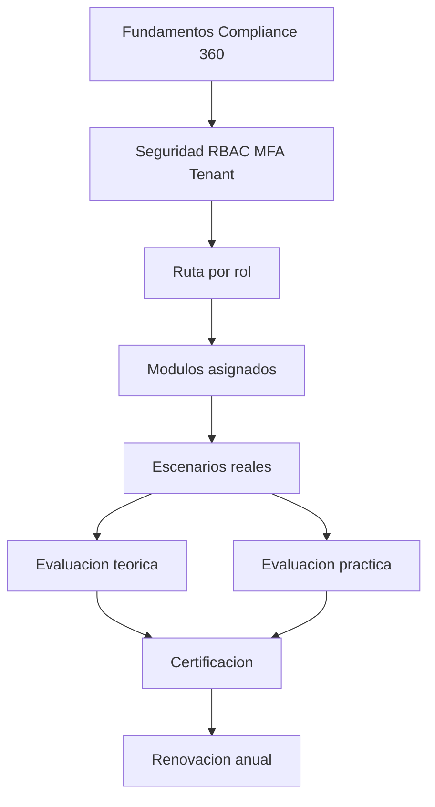

# Compliance 360 Academy Master Plan

## Enterprise Training & Certification Program

**Estado:** Markdown maestro generado. No generar Word hasta aprobación formal.
**Base:** Compliance 360 Enterprise Product Handbook, documentación existente y estado real del producto.
**Objetivo:** convertir Compliance 360 Academy en la ruta oficial para capacitar, operar y certificar usuarios, consultores, administradores, soporte, implementación, ventas y directivos.

---

# 1. Visión de la Academia

Compliance 360 Academy organiza el aprendizaje del producto en rutas por rol. Cada ruta enseña qué puede hacer el rol, qué no debe hacer, qué módulos utiliza, cómo ejecutar procesos, cómo resolver escenarios reales y cómo demostrar competencia mediante evaluación teórica y práctica.

# 2. Ruta completa de aprendizaje

| Nivel | Audiencia | Roles sugeridos | Duración |
| --- | --- | --- | --- |
| Beginner | Usuarios que consultan o ejecutan tareas simples | Viewer, Customer User, Supplier User, Executive User | 8-10 horas |
| Intermediate | Operadores con procesos diarios | Auditor, Approver, Support Engineer, Sales Specialist | 12-24 horas |
| Advanced | Administradores y líderes funcionales | Tenant Admin, Quality Manager, Notification Admin, Storage Admin | 18-32 horas |
| Expert | Implementadores, observabilidad y gobierno | SuperAdmin, Implementation Specialist, Observability Admin | 20-34 horas |
| Master | Consultores capaces de operar múltiples clientes | Consultora Admin + Implementation Specialist | 40+ horas acumuladas |
| Architect | Diseño completo, gobierno y operación enterprise | SuperAdmin + Observability + Implementation | 60+ horas acumuladas |

# 3. Certificaciones oficiales

| Certificación | Propósito | Evaluación | Mínimo |
| --- | --- | --- | --- |
| Compliance 360 Certified User | Ruta oficial de Compliance 360 Academy | Teórica + práctica | 80%+ |
| Compliance 360 Certified Operator | Ruta oficial de Compliance 360 Academy | Teórica + práctica | 80%+ |
| Compliance 360 Certified Quality Manager | Ruta oficial de Compliance 360 Academy | Teórica + práctica | 80%+ |
| Compliance 360 Certified Auditor | Ruta oficial de Compliance 360 Academy | Teórica + práctica | 80%+ |
| Compliance 360 Certified Administrator | Ruta oficial de Compliance 360 Academy | Teórica + práctica | 80%+ |
| Compliance 360 Certified Consultant | Ruta oficial de Compliance 360 Academy | Teórica + práctica | 80%+ |
| Compliance 360 Certified Implementation Specialist | Ruta oficial de Compliance 360 Academy | Teórica + práctica | 80%+ |
| Compliance 360 Certified Architect | Ruta oficial de Compliance 360 Academy | Teórica + práctica | 80%+ |

# 4. Manuales por rol

| Rol | Nivel | Duración | Certificación | Módulos principales |
| --- | --- | --- | --- | --- |
| SuperAdmin | Expert / Architect | 24 horas | Compliance 360 Certified Architect | Tenant Management, Identity, RBAC, MFA, Audit Trail... |
| Consultora Admin | Advanced / Consultant | 28 horas | Compliance 360 Certified Consultant | Tenant Management, RBAC, MFA, Document Management, Supplier Management... |
| Tenant Admin | Advanced / Administrator | 22 horas | Compliance 360 Certified Administrator | Identity, RBAC, MFA, Audit Trail, Document Management... |
| Quality Manager | Advanced / Operator | 32 horas | Compliance 360 Certified Quality Manager | Document Management, Workflow Engine, Technical Sheets, Supplier Management, Audit Management... |
| Auditor | Intermediate / Auditor | 24 horas | Compliance 360 Certified Auditor | Audit Management, Audit Trail, CAPA Management, Document Management, Supplier Management... |
| Approver | Intermediate / Governance | 16 horas | Compliance 360 Certified Operator | Document Management, Workflow Engine, CAPA Management, Risk Management, Quality Indicators... |
| Reviewer | Beginner / Reviewer | 12 horas | Compliance 360 Certified User | Document Management, Workflow Engine, CAPA Management, Risk Management, Quality Indicators... |
| Supplier User | Beginner / External User | 10 horas | Compliance 360 Certified User | Supplier Portal, Supplier Management, Storage, Notifications, Audit Trail |
| Customer User | Beginner / External User | 10 horas | Compliance 360 Certified User | Customer Portal, Reporting Engine, Dashboard, Document Management, Audit Trail |
| Viewer | Beginner / Read Only | 8 horas | Compliance 360 Certified User | Dashboard, Document Management, Reporting Engine, Audit Trail, Quality Indicators |
| Notification Admin | Advanced / Technical Admin | 18 horas | Compliance 360 Certified Administrator | Notifications, Audit Trail, Observability, Security Hardening, Workflow Engine... |
| Storage Admin | Advanced / Technical Admin | 18 horas | Compliance 360 Certified Administrator | Storage, Document Management, Supplier Management, Audit Management, CAPA Management... |
| Observability Admin | Expert / Operations | 20 horas | Compliance 360 Certified Architect | Observability, Security Hardening, Notifications, Storage, CI/CD... |
| Support Engineer | Intermediate / Support | 22 horas | Compliance 360 Certified Operator | Identity, RBAC, MFA, Audit Trail, Storage... |
| Implementation Specialist | Expert / Implementation | 34 horas | Compliance 360 Certified Implementation Specialist | Tenant Management, Identity, RBAC, MFA, Storage... |
| Sales Specialist | Intermediate / Commercial | 16 horas | Compliance 360 Certified Consultant | Dashboard, Document Management, Supplier Management, Audit Management, CAPA Management... |
| Executive User | Beginner / Executive | 8 horas | Compliance 360 Certified User | Dashboard, Reporting Engine, Risk Management, Quality Indicators, CAPA Management... |

# 5. Archivos generados

- `01_SUPERADMIN_CERTIFICATION.md`
- `02_CONSULTORA_ADMIN_CERTIFICATION.md`
- `03_TENANT_ADMIN_CERTIFICATION.md`
- `04_QUALITY_MANAGER_CERTIFICATION.md`
- `05_AUDITOR_CERTIFICATION.md`
- `06_APPROVER_CERTIFICATION.md`
- `07_REVIEWER_CERTIFICATION.md`
- `08_SUPPLIER_USER_CERTIFICATION.md`
- `09_CUSTOMER_USER_CERTIFICATION.md`
- `10_VIEWER_CERTIFICATION.md`
- `11_NOTIFICATION_ADMIN_CERTIFICATION.md`
- `12_STORAGE_ADMIN_CERTIFICATION.md`
- `13_OBSERVABILITY_ADMIN_CERTIFICATION.md`
- `14_SUPPORT_ENGINEER_CERTIFICATION.md`
- `15_IMPLEMENTATION_SPECIALIST_CERTIFICATION.md`
- `16_SALES_SPECIALIST_CERTIFICATION.md`
- `17_EXECUTIVE_USER_CERTIFICATION.md`

# 6. Rutas de aprendizaje recomendadas

## Ruta Certified User

Viewer -> Customer User -> Executive User.

## Ruta Certified Operator

Reviewer -> Approver -> Auditor -> Support Engineer.

## Ruta Certified Quality Manager

Viewer -> Reviewer -> Quality Manager -> Auditor.

## Ruta Certified Administrator

Tenant Admin -> Notification Admin -> Storage Admin -> Observability Admin.

## Ruta Certified Consultant

Quality Manager -> Auditor -> Consultora Admin -> Implementation Specialist.

## Ruta Certified Architect

SuperAdmin -> Observability Admin -> Implementation Specialist -> Architecture review.

# 7. Objetivos por rol

- **SuperAdmin:** Formar al administrador global capaz de gobernar toda la plataforma Compliance 360.
- **Consultora Admin:** Formar consultoras capaces de implementar, configurar y operar clientes en Compliance 360.
- **Tenant Admin:** Formar al administrador interno de una empresa cliente.
- **Quality Manager:** Formar al responsable de calidad que opera documentos, auditorías, CAPA, riesgos e indicadores.
- **Auditor:** Formar auditores internos y externos para planificar, ejecutar y cerrar auditorías en Compliance 360.
- **Approver:** Formar aprobadores responsables de aceptar o rechazar documentos, CAPA, riesgos e indicadores.
- **Reviewer:** Formar revisores que comentan, validan y recomiendan correcciones antes de aprobación.
- **Supplier User:** Formar usuarios proveedores para colaborar con evidencias y requisitos documentales.
- **Customer User:** Formar usuarios cliente para consultar reportes, documentos y estado de cumplimiento autorizado.
- **Viewer:** Formar usuarios de consulta para navegar información sin modificar registros.
- **Notification Admin:** Formar administradores de notificaciones, plantillas, providers, tracking, retries y dead letters.
- **Storage Admin:** Formar administradores de almacenamiento, providers, evidencias y failover.
- **Observability Admin:** Formar administradores de observabilidad, health checks, métricas, logs y alertas.
- **Support Engineer:** Formar soporte capaz de diagnosticar usuarios, permisos, módulos, providers y observabilidad.
- **Implementation Specialist:** Formar implementadores que llevan un cliente de discovery a go-live.
- **Sales Specialist:** Formar equipo comercial para vender Compliance 360 con demos honestas y orientadas a valor.
- **Executive User:** Formar directivos que consumen dashboards, reportes, riesgos y decisiones de cumplimiento.

# 8. Arquitectura de capacitación

# 9. Cobertura de módulos

| Módulo | Cobertura Academy | Estado de entrenamiento |
| --- | --- | --- |
| Tenant Management | Incluido en rutas relacionadas | Cubierto con procesos, escenarios o matrices |
| Identity | Incluido en rutas relacionadas | Cubierto con procesos, escenarios o matrices |
| RBAC | Incluido en rutas relacionadas | Cubierto con procesos, escenarios o matrices |
| MFA | Incluido en rutas relacionadas | Cubierto con procesos, escenarios o matrices |
| Audit Trail | Incluido en rutas relacionadas | Cubierto con procesos, escenarios o matrices |
| Storage | Incluido en rutas relacionadas | Cubierto con procesos, escenarios o matrices |
| Notifications | Incluido en rutas relacionadas | Cubierto con procesos, escenarios o matrices |
| Document Management | Incluido en rutas relacionadas | Cubierto con procesos, escenarios o matrices |
| Workflow Engine | Incluido en rutas relacionadas | Cubierto con procesos, escenarios o matrices |
| Technical Sheets | Incluido en rutas relacionadas | Cubierto con procesos, escenarios o matrices |
| Supplier Management | Incluido en rutas relacionadas | Cubierto con procesos, escenarios o matrices |
| Audit Management | Incluido en rutas relacionadas | Cubierto con procesos, escenarios o matrices |
| CAPA Management | Incluido en rutas relacionadas | Cubierto con procesos, escenarios o matrices |
| Risk Management | Incluido en rutas relacionadas | Cubierto con procesos, escenarios o matrices |
| Quality Indicators | Incluido en rutas relacionadas | Cubierto con procesos, escenarios o matrices |
| Reporting Engine | Incluido en rutas relacionadas | Cubierto con procesos, escenarios o matrices |
| Dashboard | Incluido en rutas relacionadas | Cubierto con procesos, escenarios o matrices |
| Template Builder | Incluido en rutas relacionadas | Cubierto con procesos, escenarios o matrices |
| Regulatory Management | Incluido en rutas relacionadas | Cubierto con procesos, escenarios o matrices |
| Training Management | Incluido en rutas relacionadas | Cubierto con procesos, escenarios o matrices |
| Supplier Portal | Incluido en rutas relacionadas | Cubierto con procesos, escenarios o matrices |
| Customer Portal | Incluido en rutas relacionadas | Cubierto con procesos, escenarios o matrices |
| Observability | Incluido en rutas relacionadas | Cubierto con procesos, escenarios o matrices |
| CI/CD | Incluido en rutas relacionadas | Cubierto con procesos, escenarios o matrices |
| Security Hardening | Incluido en rutas relacionadas | Cubierto con procesos, escenarios o matrices |

# 10. Política de aprobación

- Aprobación mínima teórica: 80%.
- Aprobación mínima práctica: 85%.
- Faltas críticas provocan reprobación automática: compartir credenciales, operar tenant incorrecto, borrar evidencia, aprobar sin permiso o vender funcionalidades no implementadas como completas.
- Renovación recomendada: anual o ante cambios mayores del producto.

# 11. Regla de honestidad de producto

La Academy enseña que Document Management, Supplier Management, Audit Management, CAPA, Risk, Indicators, Notifications, Storage, Observability, Security y CI/CD tienen capacidades operativas relevantes. Template Builder, Regulatory Management, Training Management, Supplier Portal y Customer Portal deben presentarse como workspaces genéricos o capacidades en roadmap cuando aplique.
